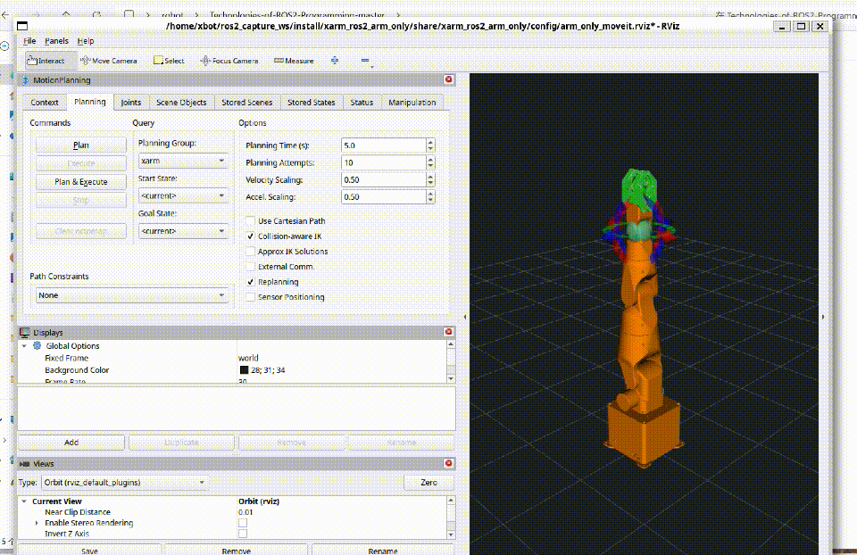
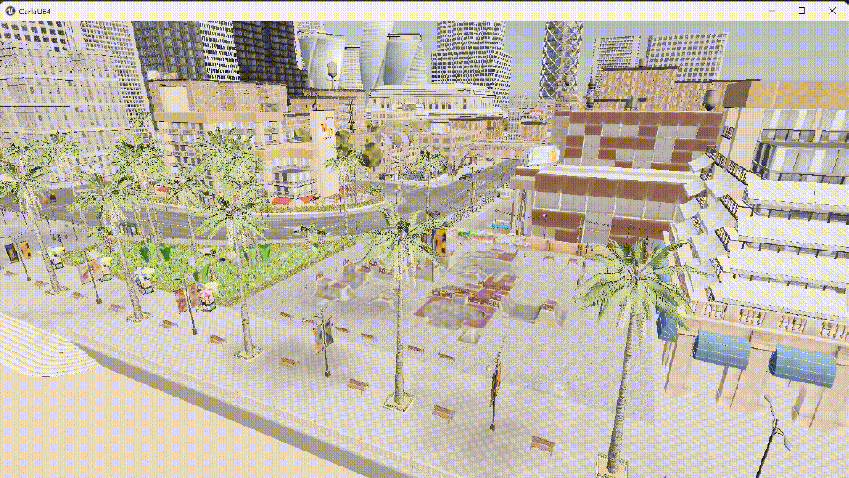
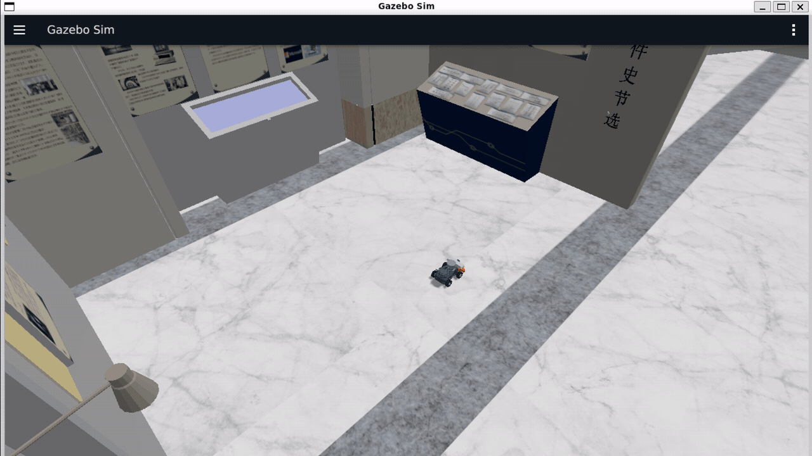

# ROS2编程技术

## 课程介绍

本课程是，以 ROS2（Robot Operating System 2）为技术平台，系统讲授机器人及智能网联汽车的软件开发框架、分布式通信机制、实时控制系统以及智能终端装调技术。

---

## 教学目标

| 目标维度 | 目标描述 |
|:--------|---------|
| **知识目标** | 掌握 ROS2 分布式通信机制（话题、服务、动作）、参数系统、TF2 坐标变换、URDF 建模、Gazebo 仿真等基础理论；理解 SLAM 建图与定位、自主导航、机械臂运动规划、视觉检测等核心技术原理 |
| **技能目标** | 能够独立完成 ROS2 功能包的创建与调试；能够在 PAV-S 智能车平台及仿真环境中实现 SLAM 建图、自主导航、机械臂抓取等工程任务；能够集成激光雷达、深度相机等多传感器实现智能感知 |
| **素养目标** | 培养系统化工程思维和跨领域技术整合能力；建立智能网联汽车与具身机器人统一的软件架构认知；形成规范的项目开发与文档编写习惯 |

---

## 课程大纲

### Part 1: ROS2 编程基础（智能车终端软件平台，36 课时）

| 章节 | 内容 | 理论 | 实验 | 小计 |
|:---:|------|:---:|:---:|:---:|
| 1 | ROS2 概述与架构 | 2 | 2 | 4 |
| 2 | 核心编程基础（Package/Node/Logger） | 2 | 2 | 4 |
| 3 | 话题通信——智能车传感器数据分发 | 2 | 2 | 4 |
| 4 | 服务通信——智能车远程诊断与指令 | 2 | 2 | 4 |
| 5 | 动作通信——智能车路径规划与执行 | 2 | 2 | 4 |
| 6 | 参数系统与 Launch 文件——智能车多节点管理 | 2 | 2 | 4 |
| 7 | TF2 坐标变换——多传感器联合标定基础 | 2 | 2 | 4 |
| 8 | URDF 机器人建模——智能车结构描述 | 2 | 2 | 4 |
| 9 | Gazebo 仿真——智能网联汽车仿真环境搭建 | 2 | 2 | 4 |

### Part 2: SLAM 与自主导航（智能网联汽车环境感知与决策，62 课时）

| 章节 | 内容 | 理论 | 实验 | 小计 |
|:---:|------|:---:|:---:|:---:|
| 10 | SLAM 基本概念与贝叶斯框架 | 2 | 2 | 4 |
| 11 | ICP 与 PLICP 扫描匹配 | 2 | 2 | 4 |
| 12 | Hector-SLAM | 2 | 2 | 4 |
| 13 | gmapping 粒子滤波 SLAM | 2 | 2 | 4 |
| 14 | AMCL 自适应蒙特卡洛定位 | 2 | 2 | 4 |
| 15 | Cartographer 图优化 SLAM | 4 | 2 | 6 |
| 16 | Nav2 架构与核心组件 | 2 | 2 | 4 |
| 17 | 全局代价地图 | 2 | 2 | 4 |
| 18 | 全局路径规划（Dijkstra / A\*） | 2 | 2 | 4 |
| 19 | 局部路径规划（DWA） | 2 | 2 | 4 |
| 20 | 行为树与恢复行为 | 2 | 2 | 4 |
| 21 | 视觉 SLAM 导论 | 2 | 2 | 4 |
| 22 | 多传感器融合 SLAM | 2 | 2 | 4 |
| 23 | SLAM 与导航综合实训 | 4 | 4 | 8 |

### Part 3: 机械臂编程技术（具身智能机器人操作系统，52 课时）

| 章节 | 内容 | 理论 | 实验 | 小计 |
|:---:|------|:---:|:---:|:---:|
| 24 | 机械臂基础知识与运动学 | 2 | 2 | 4 |
| 25 | ROS2 机械臂建模（URDF/Xacro） | 2 | 2 | 4 |
| 26 | MoveIt2 基础 | 2 | 2 | 4 |
| 27 | MoveIt2 Python 关节空间规划 | 2 | 2 | 4 |
| 28 | MoveIt2 笛卡尔空间与避障 | 2 | 2 | 4 |
| 29 | 抓取与放置编程 | 2 | 2 | 4 |
| 30 | ROS2 图像接口与相机标定 | 2 | 2 | 4 |
| 31 | 颜色检测与 YOLO 物体检测 | 2 | 2 | 4 |
| 32 | AR 标签检测与手眼标定 | 2 | 2 | 4 |
| 33 | 视觉大模型与 ROS2 应用 | 2 | 2 | 4 |
| 34 | 视觉抓取应用 | 2 | 2 | 4 |
| 35 | 综合实训（集成机器人产线） | 4 | 4 | 8 |

### Part 4: 自动驾驶（CARLA 仿真与 ROS2 集成，48 课时）

| 章节 | 内容 | 理论 | 实验 | 小计 |
|:---:|------|:---:|:---:|:---:|
| 36 | 自动驾驶概述与 CARLA 基础 | 2 | 2 | 4 |
| 37 | CARLA-ROS2 桥接与车辆部署 | 2 | 3 | 5 |
| 38 | 多传感器套件与数据采集 | 3 | 3 | 6 |
| 39 | 全局路径规划与地图导航 | 2 | 3 | 5 |
| 40 | 车辆纵横向控制（PID） | 2 | 3 | 5 |
| 41 | 多传感器融合定位 | 2 | 3 | 5 |
| 42 | 交通参与者感知 | 2 | 2 | 4 |
| 43 | 行为决策与交通规则 | 2 | 2 | 4 |
| 44 | 安全验证与系统集成 | 2 | 3 | 5 |
| 45 | 综合项目：城区自动驾驶 | 2 | 3 | 5 |

---

## 理论章节与实验手册对照

教学文档和课件仍按 45 个理论章节组织；实验代码和实验手册按 `src/lab_code/` 的 31 个实验组织。多个理论章节共用一个综合实验手册，实验手册编号与代码目录保持一致。

| 实验手册 | 对应理论章节 | 合并/调整说明 |
|:---:|:---|:---|
| ch01 | 第1章 | ROS 2 环境与生命周期节点入门 |
| ch02-ch09 | 第2-9章 | 与基础通信、TF、URDF、Gazebo 一一对应 |
| ch10 | 第10-15章 | SLAM、扫描匹配、Hector、gmapping、AMCL、Cartographer 合并 |
| ch11 | 第16-20章 | Nav2、代价地图、全局/局部规划、行为树合并 |
| ch12 | 第22章 | RealSense 多传感器数据采集与融合 |
| ch13、ch14 | 第23章 | SLAM 一键建图与 Nav2 一键导航拆分 |
| ch15-ch16 | 第24-25章 | 机械臂基础/关节控制与 URDF 建模 |
| ch17 | 第26-27章 | MoveIt2 配置、FK/IK 与关节空间规划合并 |
| ch18 | 第28-29章 | 笛卡尔路径、避障与抓取放置合并 |
| ch19 | 第30-32章 | 相机、标定、颜色/YOLO、AR 检测合并 |
| ch20 | 第33章 | 视觉大模型服务化设计占位实验 |
| ch21 | 第34-35章 | 视觉抓取与智能产线综合实训合并 |
| ch22-ch31 | 第36-45章 | CARLA 自动驾驶实验重新编号 |

第21章视觉 SLAM 导论保留理论讲授，不再单独维护没有对应源码的 ORB-SLAM2 实验手册。

---

## 课程资料索引

### 理论章节

| 模块 | 文档 |
|:---|:---|
| Part 1 | [ch01_ROS2概述与架构.md](teaching_docs/ch01_ROS2概述与架构.md) · [ch02_核心编程基础.md](teaching_docs/ch02_核心编程基础.md) · [ch03_话题通信.md](teaching_docs/ch03_话题通信.md) · [ch04_服务通信.md](teaching_docs/ch04_服务通信.md) · [ch05_动作通信.md](teaching_docs/ch05_动作通信.md) · [ch06_参数与Launch.md](teaching_docs/ch06_参数与Launch.md) · [ch07_TF2坐标变换.md](teaching_docs/ch07_TF2坐标变换.md) · [ch08_URDF机器人建模.md](teaching_docs/ch08_URDF机器人建模.md) · [ch09_Gazebo仿真.md](teaching_docs/ch09_Gazebo仿真.md) |
| Part 2 | [ch10_SLAM基本概念与贝叶斯框架.md](teaching_docs/ch10_SLAM基本概念与贝叶斯框架.md) · [ch11_ICP与PLICP扫描匹配.md](teaching_docs/ch11_ICP与PLICP扫描匹配.md) · [ch12_Hector_SLAM.md](teaching_docs/ch12_Hector_SLAM.md) · [ch13_gmapping粒子滤波SLAM.md](teaching_docs/ch13_gmapping粒子滤波SLAM.md) · [ch14_AMCL定位.md](teaching_docs/ch14_AMCL定位.md) · [ch15_Cartographer图优化SLAM.md](teaching_docs/ch15_Cartographer图优化SLAM.md) · [ch16_Nav2架构与核心组件.md](teaching_docs/ch16_Nav2架构与核心组件.md) · [ch17_全局代价地图.md](teaching_docs/ch17_全局代价地图.md) · [ch18_全局路径规划.md](teaching_docs/ch18_全局路径规划.md) · [ch19_局部路径规划.md](teaching_docs/ch19_局部路径规划.md) · [ch20_行为树与恢复行为.md](teaching_docs/ch20_行为树与恢复行为.md) · [ch21_视觉SLAM导论.md](teaching_docs/ch21_视觉SLAM导论.md) · [ch22_多传感器融合SLAM.md](teaching_docs/ch22_多传感器融合SLAM.md) · [ch23_SLAM与导航综合实训.md](teaching_docs/ch23_SLAM与导航综合实训.md) |
| Part 3 | [ch24_机械臂基础知识.md](teaching_docs/ch24_机械臂基础知识.md) · [ch25_ROS2机械臂建模.md](teaching_docs/ch25_ROS2机械臂建模.md) · [ch26_MoveIt2基础.md](teaching_docs/ch26_MoveIt2基础.md) · [ch27_MoveIt2_Python规划.md](teaching_docs/ch27_MoveIt2_Python规划.md) · [ch28_MoveIt2笛卡尔空间与避障.md](teaching_docs/ch28_MoveIt2笛卡尔空间与避障.md) · [ch29_抓取与放置编程.md](teaching_docs/ch29_抓取与放置编程.md) · [ch30_ROS2图像接口与相机标定.md](teaching_docs/ch30_ROS2图像接口与相机标定.md) · [ch31_颜色检测与YOLO检测.md](teaching_docs/ch31_颜色检测与YOLO检测.md) · [ch32_AR标签检测与手眼标定.md](teaching_docs/ch32_AR标签检测与手眼标定.md) · [ch33_视觉大模型与ROS2应用.md](teaching_docs/ch33_视觉大模型与ROS2应用.md) · [ch34_视觉抓取应用.md](teaching_docs/ch34_视觉抓取应用.md) · [ch35_综合实训.md](teaching_docs/ch35_综合实训.md) |
| Part 4 | [ch36_自动驾驶概述与CARLA基础.md](teaching_docs/ch36_自动驾驶概述与CARLA基础.md) · [ch37_CARLA_ROS2桥接与车辆部署.md](teaching_docs/ch37_CARLA_ROS2桥接与车辆部署.md) · [ch38_多传感器套件与数据采集.md](teaching_docs/ch38_多传感器套件与数据采集.md) · [ch39_全局路径规划与地图导航.md](teaching_docs/ch39_全局路径规划与地图导航.md) · [ch40_车辆纵横向控制.md](teaching_docs/ch40_车辆纵横向控制.md) · [ch41_多传感器融合定位.md](teaching_docs/ch41_多传感器融合定位.md) · [ch42_交通参与者感知.md](teaching_docs/ch42_交通参与者感知.md) · [ch43_行为决策与交通规则.md](teaching_docs/ch43_行为决策与交通规则.md) · [ch44_安全验证与系统集成.md](teaching_docs/ch44_安全验证与系统集成.md) · [ch45_综合项目.md](teaching_docs/ch45_综合项目.md) |

> 理论章节链接使用 `teaching_docs/` 当前规范文件名，并与 `scripts/generate_textbook.py` 的 45 个章节清单保持一致；旧版重号文件不作为课程入口。

### 实验手册

| 模块 | 手册 |
|:---|:---|
| Part 1 | [ch01](lab_manuals/ch01_lab.md) · [ch02](lab_manuals/ch02_lab.md) · [ch03](lab_manuals/ch03_lab.md) · [ch04](lab_manuals/ch04_lab.md) · [ch05](lab_manuals/ch05_lab.md) · [ch06](lab_manuals/ch06_lab.md) · [ch07](lab_manuals/ch07_lab.md) · [ch08](lab_manuals/ch08_lab.md) · [ch09](lab_manuals/ch09_lab.md) |
| Part 2 | [ch10](lab_manuals/ch10_lab.md) · [ch11](lab_manuals/ch11_lab.md) · [ch12](lab_manuals/ch12_lab.md) · [ch13](lab_manuals/ch13_lab.md) · [ch14](lab_manuals/ch14_lab.md) |
| Part 3 | [ch15](lab_manuals/ch15_lab.md) · [ch16](lab_manuals/ch16_lab.md) · [ch17](lab_manuals/ch17_lab.md) · [ch18](lab_manuals/ch18_lab.md) · [ch19](lab_manuals/ch19_lab.md) · [ch20](lab_manuals/ch20_lab.md) · [ch21](lab_manuals/ch21_lab.md) |
| Part 4 | [ch22](lab_manuals/ch22_lab.md) · [ch23](lab_manuals/ch23_lab.md) · [ch24](lab_manuals/ch24_lab.md) · [ch25](lab_manuals/ch25_lab.md) · [ch26](lab_manuals/ch26_lab.md) · [ch27](lab_manuals/ch27_lab.md) · [ch28](lab_manuals/ch28_lab.md) · [ch29](lab_manuals/ch29_lab.md) · [ch30](lab_manuals/ch30_lab.md) · [ch31](lab_manuals/ch31_lab.md) |

实际运行截图和原始录制见[实际运行证据索引](lab_manuals/runtime_evidence.md)。

---

## 课时汇总

| 模块 | 理论 | 实验 | 总课时 |
|:----:|:----:|:----:|:------:|
| Part 1 编程基础（智能车终端软件平台） | 18 | 18 | 36 |
| Part 2 SLAM/导航（环境感知与决策） | 30 | 32 | 62 |
| Part 3 机械臂（具身智能操作系统） | 26 | 26 | 52 |
| Part 4 自动驾驶（CARLA + ROS2 仿真） | 21 | 27 | 48 |
| **合计** | **95** | **103** | **198** |

> 可根据教学计划灵活调整至 **144 学时**：合并 Part 1 概述性内容、精简 Part 2 部分实验课时即可对齐。

## 目录结构

```
ROS2/
├── README.md                    # 本文件，课程总览
├── teaching_docs/               # 教学文档（45 章，含 images/）
├── lecture_slides/              # 教学课件（45 章）
├── lab_manuals/                 # 实验手册（31 个，含 images/）
└── src/                         # ROS2 课程源码（50 个可构建包 + 1 个嵌套资源包）
    ├── topic_demo_cpp/          # 话题通信 C++ 示例（车载传感器数据流）
    ├── topic_demo_py/           # 话题通信 Python 示例
    ├── topic_demo_interfaces/   # 话题通信自定义接口
    ├── service_demo_cpp/        # 服务通信 C++ 示例（远程诊断指令）
    ├── service_demo_py/         # 服务通信 Python 示例
    ├── service_demo_interfaces/ # 服务通信自定义接口
    ├── action_demo_cpp/         # 动作通信 C++ 示例（路径规划任务）
    ├── action_demo_py/          # 动作通信 Python 示例
    ├── action_demo_interfaces/  # 动作通信自定义接口
    ├── msgs_demo_interfaces/    # 消息接口定义
    ├── param_demo_cpp/          # 参数 C++ 示例
    ├── param_demo_py/           # 参数 Python 示例
    ├── tf_demo_cpp/             # TF2 C++ 示例（多传感器标定）
    ├── tf_demo_py/              # TF2 Python 示例
    ├── name_demo_cpp/           # 节点命名 C++ 示例
    ├── robot_sim_demo/           # Wheeltec + ISCAS Museum Gazebo 仿真
    ├── navigation_sim_demo_ros2/ # 导航仿真（自动驾驶仿真）
    ├── slam_sim_demo_ros2/      # SLAM 仿真
    ├── urdf_demo_ros2/          # URDF 建模示例
    ├── tf_follower_ros2/        # TF 跟随机器人
    ├── xarm/                    # xarm_ros2_arm_only：xArm6 + MoveIt2 仿真
    ├── course_lab_interfaces/   # 课程实验共享接口
    ├── course_lab_utils/        # 课程实验共享实现
    ├── lab_code/                # 实验代码（31 章，ch01_lab/ ~ ch31_lab/）
    ├── av_carla_interfaces/     # 自动驾驶自定义接口（msg/srv/action）
    ├── av_sensor_kit/           # CARLA 传感器套件配置与管理
    ├── av_control_cpp/          # 纵横向 PID 控制器（C++）
    ├── av_perception_py/        # 目标检测与跟踪（Python）
    ├── av_planning_py/          # 全局/局部路径规划（Python）
    └── av_safety_monitor/       # 安全监控与故障检测（Python）
```

---

## 环境要求

- **操作系统：** Ubuntu 24.04 Noble，或基于 Ubuntu 24.04 的 WSL2
- **ROS2 版本：** Jazzy Jalisco
- **Python：** 3.12（使用 Ubuntu/ROS 系统 Python）
- **基础磁盘空间：** 至少 15GB；启用 CARLA 时建议至少 30GB
- **可选硬件：** RealSense、USB 摄像头、串口机械臂或 PAV-S 实训平台
- **CARLA profile：** CARLA 0.9.16，支持 Noble 的 Python 3.12

安装器优先通过 `package.xml` 和 `rosdep` 解析 ROS 依赖。NumPy、OpenCV、SciPy

等 ABI 敏感依赖由 apt 安装；ML 依赖进入独立 venv，不会覆盖 `cv_bridge` 使用的

系统 Python 包。

## 快速开始

```bash
# 默认：ROS2 + src/lab 依赖 + 50 个可构建 ROS 包编译 + ~/.bashrc 配置
bash setup_course.sh

# 先检查将执行的安装命令
bash setup_course.sh --dry-run

# 安装后验证
bash setup_course.sh --verify
```

默认安装不包含体积较大或依赖硬件的组件，可按需组合 profile：

```bash
# YOLO、FilterPy、OpenAI、EVO（安装到独立 venv）
bash setup_course.sh --with-ml

# RealSense、USB Camera、ArUco 和串口依赖
bash setup_course.sh --with-hardware

# CARLA 0.9.16 与固定版本的 ROS Bridge
bash setup_course.sh --with-carla

# 只在 WSL 安装 Python API 和 Bridge，CARLA 服务端运行在 Windows 主机
bash setup_course.sh --carla-bridge-only

# 启用全部 profile，并在编译后运行 colcon 测试
bash setup_course.sh --all-profiles --run-tests
```

## 机械臂与 CARLA 安装

下面的步骤覆盖本项目中 xArm6 机械臂仿真和 CARLA 0.9.16 自动驾驶仿真。两套仿真都建议在 Ubuntu 24.04 / WSL2、ROS 2 Jazzy 环境中使用；CARLA 服务端也可以单独运行在 Windows 主机上。

### xArm6 机械臂仿真

#### 1. 安装 ROS 2、Gazebo、MoveIt 2 和课程包

```bash
cd /path/to/Technologies-of-ROS2-Programming-master

# 如果使用外部兼容的 XBot Arm 描述包，请将实际路径替换到下一行后再执行
# 要求：xarm_description 2.0.0，关节名为 arm_1_joint ~ arm_6_joint
# source /path/to/xarm_description_workspace/install/setup.bash

# 安装基础依赖、ros2_control、MoveIt 2、Gazebo Harmonic 并编译课程工作空间
bash setup_course.sh
source ~/.config/ros2-course/env.bash
```

本项目的 `xarm_ros2_arm_only` 位于 `src/xarm/`，底层 `xarm_description` 不随本仓库提供，必须使用与本项目 SRDF、URDF 和控制器配置兼容的 XBot Arm 版本。安装后检查：

```bash
ros2 pkg prefix xarm_description
ros2 pkg prefix xarm_ros2_arm_only
ros2 pkg prefix moveit_ros_move_group
ros2 pkg prefix gz_ros2_control
```

如果只需要重新构建机械臂包：

```bash
cd ~/ros2_course_ws
colcon build --symlink-install --packages-select xarm_ros2_arm_only
source install/setup.bash
```

#### 2. 启动和验证机械臂

完整模式会启动 Gazebo、ros2_control、MoveIt 2 和 RViz2：

```bash
source ~/ros2_course_ws/install/setup.bash
ros2 launch xarm_ros2_arm_only arm_only.launch.py
```

只查看 RViz2 中的机械臂和 MoveIt MotionPlanning 面板时，可使用轻量模式：

```bash
ros2 launch xarm_ros2_arm_only arm_only.launch.py \
  use_gazebo:=false use_sim_time:=false
```

完整模式启动后，在另一个已加载环境的终端中验证规划链路：

```bash
ros2 control list_controllers
ros2 topic echo /joint_states --once
ros2 run xarm_ros2_arm_only arm_only_runtime_smoke
```

启动后的 xArm6 RViz/MoveIt 画面（30 秒录制）：



### CARLA 0.9.16

#### 1. Linux / WSL2 安装 CARLA 和 ROS 2 Bridge

推荐由安装器一次完成 CARLA 服务端、Python API、图形依赖和固定版本的 ROS 2 Bridge：

```bash
cd /path/to/Technologies-of-ROS2-Programming-master
bash setup_course.sh --with-carla
source ~/.config/ros2-course/env.bash
```

安装结果如下：

- CARLA 服务端：`~/carla`
- CARLA Python venv：`~/.venvs/carla-0.9.16`
- ROS 2 Bridge 工作空间：`~/carla_ws`
- CARLA 版本：`0.9.16`

手动安装时，至少需要图形和运行库依赖：

```bash
sudo apt-get update
sudo apt-get install -y libomp5 libegl1 libgl1 libgl1-mesa-dri \
  libglx-mesa0 libvulkan1 mesa-vulkan-drivers vulkan-tools xauth xvfb

mkdir -p ~/carla
cd ~/carla
curl -fL https://tiny.carla.org/carla-0-9-16-linux \
  -o CARLA_0.9.16.tar.gz

python3 -m venv --system-site-packages ~/.venvs/carla-0.9.16
~/.venvs/carla-0.9.16/bin/python -m pip install carla==0.9.16
```

#### 2. Windows 原生 CARLA 服务端

Windows 10/11 已内置 DirectX 12 API。CARLA 启动器另外需要旧版 DirectX 辅助运行库；如果出现 `The following component(s) are required to run this program: DirectX Runtime`，请从 Microsoft 官方页面下载并运行 `directx_Jun2010_redist.exe`，在安装向导中接受许可并完成 `DXSETUP`：

[DirectX End-User Runtimes (June 2010)](https://www.microsoft.com/en-us/download/details.aspx?id=8109)

下载并解压 [CARLA 0.9.16 Windows package](https://carla-releases.b-cdn.net/Windows/CARLA_0.9.16.zip)，然后在 PowerShell 中启动服务端：

```powershell
cd C:\CARLA
.\CarlaUE4.exe -quality-level=Low -nosound `
  -carla-map=Town10HD_Opt -carla-rpc-port=2000 -carla-streaming-port=2001
```

如果 CARLA 服务端运行在 Windows 主机上，WSL2 中只需安装 Python API 和 Bridge：

```bash
bash setup_course.sh --carla-bridge-only
source ~/.config/ros2-course/env.bash
```

确认 Windows 主机的 `2000` 端口已监听后，再在 WSL2 中连接它。当前 WSL 网络模式下 `localhost` 不一定指向 Windows 主机，应使用 WSL 默认网关。环境文件会自动设置 `CARLA_HOST`、`CARLA_PORT`、`CARLA_MAP` 和 `CARLA_BRIDGE_TIMEOUT`，也可以手动覆盖：

```bash
source ~/.config/ros2-course/env.bash
echo "CARLA server: ${CARLA_HOST}:${CARLA_PORT}"
cd "$ROS2_COURSE_ROOT"

# 验证 Python API 和服务端版本
python3 src/lab_code/ch22_lab/explore_carla.py \
  --host "$CARLA_HOST" --port 2000 --timeout 30
```

#### 3. 启动 Bridge、生成车辆并验证话题

```bash
source ~/.config/ros2-course/env.bash

# 异步模式适合可视化和数据采集
ros2 launch carla_ros_bridge carla_ros_bridge.launch.py \
  host:="$CARLA_HOST" port:="$CARLA_PORT" \
  timeout:="$CARLA_BRIDGE_TIMEOUT" town:="$CARLA_MAP" \
  synchronous_mode:=False register_all_sensors:=True
```

Bridge 启动后，在另一个终端生成带 RGB 相机和 LiDAR 的 Ego Vehicle：

```bash
source ~/.config/ros2-course/env.bash
cd "$ROS2_COURSE_ROOT"
python3 src/lab_code/ch23_lab/spawn_ego.py \
  --host "$CARLA_HOST" --port "$CARLA_PORT" --spawn-point 10 \
  --duration 30
```

也可以使用一键 30 秒验证脚本；将 `CARLA_DURATION=0` 可恢复为持续运行直到按下 Ctrl+C：

```bash
CARLA_DURATION=30 bash src/lab_code/ch23_lab/bridge_launch.sh
```

最后检查节点、话题和传感器数据：

```bash
ros2 node list
ros2 topic list | grep carla
ros2 topic echo /carla/status --once
python3 src/lab_code/ch23_lab/check_topics.py --role-name ego_vehicle --verbose
```

启动后的 CARLA 城市场景画面（30 秒录制）：



源码会使用 `rsync --delete` 同步到脚本管理的 `~/ros2_course_ws`：课程 ROS 包位于

`src/course/`，实验代码位于 `src/labs/`；源码树中的 `src/lab_code/` 不会再次复制到

`src/course/`，以避免嵌套实验包重复发现。比如源码中的 `src/xarm/` 在托管工作空间中

对应 `src/course/xarm/`。这样也能避开 WSL 中 `/mnt/c` 的编译性能和中文路径问题。

脚本不会修改已有的非托管工作空间；可通过 `--workspace /absolute/path` 选择新的目标目录。

安装完成后重新打开终端，或执行：

```bash

source ~/.config/ros2-course/env.bash

cd ~/ros2_course_ws
```

---

## Gazebo 仿真启动（robot_sim_demo）

`robot_sim_demo` 使用 Gazebo Sim Harmonic 启动 Wheeltec 机器人。原有
`gazebo2.launch.py` 继续使用 ISCAS Museum 的 `museum.sdf`；新增
`campus_pucrs.launch.py` 使用 Campus PUCRS 的 `campus_pucrs.world.sdf`，并将车辆
放在黄色 X 标志中心 `(20.0, 0.0)` 的无障碍区域。

### 默认启动（Gazebo + 机器人 + 自动巡航）

```bash
source ~/ros2_course_ws/install/setup.bash
ros2 launch robot_sim_demo gazebo2.launch.py
```

默认启动 GUI 和自动巡航，RViz 默认关闭。需要手动控制时，先关闭自动巡航：

```bash

ros2 launch robot_sim_demo gazebo2.launch.py rviz:=true drive:=false
```

然后在另一终端运行键盘控制：

```bash
ros2 run teleop_twist_keyboard teleop_twist_keyboard
```

### Campus PUCRS 世界

```bash

ros2 launch robot_sim_demo campus_pucrs.launch.py
```

Campus 入口默认启动 GUI、传感器桥和 RViz 可选项，但不自动巡航；车辆初始位姿
为 `x=20.0, y=0.0, z=0.017, yaw=0.0`，对应世界中黄色标志的中心。

### Launch 参数

| 参数 | 默认值 | 说明 |
|------|--------|------|
| `gui` | `true` | 启动 Gazebo GUI；设为 `false` 使用无头模式 |
| `rviz` | `false` | 启动 RViz2 |
| `spawn_robot` | `true` | 在世界中生成 Wheeltec 机器人 |
| `drive` | `true` | 启动自动巡航节点 |
| `drive_linear_speed` | `0.18` | 巡航线速度（m/s） |
| `drive_angular_speed` | `0.55` | 巡航角速度（rad/s） |
| `drive_loop` | `true` | 是否循环巡航 |
| `drive_duration` | `0.0` | 巡航持续时间（0 表示不限制） |
| `world` | `museum.sdf` | Gazebo 世界文件路径 |
| `world_name` | `default` | Gazebo 世界名称 |
| `spawn_x/y/z/yaw` | `0/0/0.017/0` | 机器人生成位姿 |
| `use_sim_time` | `true` | 使用 Gazebo 仿真时钟 |



### 常用启动方式

```bash
# 无 GUI、无 RViz、无自动巡航
ros2 launch robot_sim_demo gazebo2.launch.py gui:=false rviz:=false drive:=false

# 启动 RViz 并关闭自动巡航
ros2 launch robot_sim_demo gazebo2.launch.py rviz:=true drive:=false

# 自定义机器人生成位置
ros2 launch robot_sim_demo gazebo2.launch.py \
  spawn_x:=1.0 spawn_y:=0.5 spawn_z:=0.017 spawn_yaw:=1.57
```

### 仿真包关键节点与话题

| 节点/组件 | 实现 | 功能 |
|------|------|------|
| `patrol_driver` | `robot_sim_demo/patrol_driver.py` | 自动巡航速度发布 |
| `camera_info_publisher` | `robot_sim_demo/camera_info_publisher.py` | 发布相机内参 |
| `parameter_bridge` | `ros_gz_bridge` | 桥接 `/cmd_vel`、`/odom`、`/scan`、`/clock` 等话题 |
| `image_bridge` | `ros_gz_image` | 桥接 `/camera/image_raw` |
| `create` | `ros_gz_sim` | 在 Gazebo 世界中生成机器人 |

常用验证命令：

```bash

ros2 topic echo /odom --once

ros2 topic echo /scan --once

ros2 topic echo /camera/camera_info --once

ros2 topic hz /camera/image_raw
```

---

## xArm MoveIt2 演示启动（xarm_ros2_arm_only）

`xarm_ros2_arm_only` 包位于 `src/xarm/`，为 xArm6 纯机械臂提供 Gazebo Harmonic、
ros2_control、MoveIt2 和 RViz 集成。启动前必须先 source 与本项目接口匹配的
`xarm_description` 底层包，详见“环境要求”章节。

### 完整 MoveIt2 演示（含 RViz、move_group 和 Gazebo）

```bash
source ~/ros2_course_ws/install/setup.bash

# 启动完整 xArm6 仿真环境
ros2 launch xarm_ros2_arm_only arm_only.launch.py
```

此 Launch 文件启动：
- `tf2_ros static_transform_publisher`（world → base_link 静态变换）
- `robot_state_publisher`（发布机器人 TF）
- `controller_manager` + ros2_control 控制器
- `move_group`（MoveIt2 运动规划核心）
- `RViz2`（含 MoveIt2 MotionPlanning 插件）

启动后可在 RViz2 中通过 **Interact 模式**拖拽机械臂末端设定目标位姿，点击 **Plan & Execute** 执行运动规划。

### 仅启动 MoveIt2（不含 Gazebo）

```bash

ros2 launch xarm_ros2_arm_only arm_only.launch.py \

  use_gazebo:=false use_sim_time:=false
```

该模式使用 MoveIt mock components，适用于纯运动学验证和规划预览。

### 常用启动变体

```bash
# Gazebo 无头运行，不启动 RViz
ros2 launch xarm_ros2_arm_only arm_only.launch.py \
  gz_headless:=true use_rviz:=false

# 启动独立的 MoveIt2 + RViz launch
ros2 launch xarm_ros2_arm_only arm_only_move_group.launch.py use_rviz:=true

# 调整机械臂固定底座高度
ros2 launch xarm_ros2_arm_only arm_only.launch.py base_height:=0.20
```

### 包结构与关键配置

```
src/xarm/
├── config/
│   ├── arm_only_kinematics.yaml # 运动学求解器配置
│   ├── arm_only_joint_limits.yaml # 关节限位配置
│   ├── arm_only_ompl_planning.yaml # OMPL 规划器参数
│   ├── arm_only_controllers.yaml # ros2_control 控制器配置
│   ├── moveit_controllers.yaml # MoveIt2 控制器映射
│   ├── xarm.srdf              # 语义机器人描述（碰撞矩阵、组定义）
│   └── arm_only_moveit.rviz   # RViz MotionPlanning 配置
├── launch/
│   ├── arm_only.launch.py      # Gazebo + ros2_control + MoveIt2
│   └── arm_only_move_group.launch.py # MoveIt2 + RViz
├── urdf/
│   └── arm_only_xarm.urdf.xacro
└── worlds/
    └── arm_only.sdf
```

> **前置依赖**：MoveIt2 依赖由 `setup_course.sh` 和 rosdep 安装。机械臂 URDF 模型定义在 `xarm_description` 包中，meshes 文件位于 `xarm_description/meshes/`。

备注：

1. [openEuler(x86/arm/RISC-V)下ROS2的安装](https://docs.openeuler.org/zh/docs/24.03_LTS_SP3/tools/application/ros/ros_user_guide.html)

---

## 变更记录

### 2026-08-30 教学文档名称与索引统一

- `README.md` 和 `scripts/generate_textbook.py` 统一使用 `teaching_docs/` 的 45 个规范文件名；上方理论章节索引直接显示当前文件名并链接到实际路径。
- 旧版 ch10–ch15 重号文档不再位于 `teaching_docs/`，不作为课程入口；历史副本保留在 `teaching_docs_backup_20260830/`，教材生成时会忽略该备份目录。

- **`ch07_TF2坐标变换.md` 现状说明**：对标新版章节模板，ch07 有意保留当前现状。与旧版备份（`teaching_docs_backup_20260830`）相比存在 3 处预期差异，内容与结构等价：

  1. 文首 2 个 bash 代码块移至文末；
  2. 文末新增 15 行诊断命令块；
  3. 备份版本一处行尾多 3 个空格。

- **全面重构已收官**：45 篇教学章节按统一模板重塑（头部 blockquote、章节结构、禁用尾缀清零、官方要点 16/16 补齐）；指纹校验基线已刷新；`scripts/generate_textbook.py` 已重新生成 `output/ROS2编程技术_教材.docx`（45 章 + 31 实验）。
