# 第1章 实验指导书：ROS 2 环境搭建与课程仿真入门

## 当前仓库仿真验证：ROS 2 图、仿真时钟与传感器桥

### 实验目标

用当前仓库的 `robot_sim_demo` 验证 ROS 2 环境是否正确加载，以及 Gazebo、ROS-Gazebo Bridge、机器人状态发布器和传感器话题能否被自动发现。

### 运行步骤

在工作区根目录打开终端：

```bash
source /opt/ros/jazzy/setup.bash
source install/setup.bash
ros2 launch robot_sim_demo gazebo2.launch.py \
  gui:=false rviz:=false drive:=false
```

另开终端执行：

```bash
source /opt/ros/jazzy/setup.bash
source install/setup.bash
ros2 node list
ros2 topic echo /clock --once
ros2 topic info /scan
ros2 topic echo /odom --once
```

### 观察与验收

应能看到 Gazebo 桥接节点、`/clock` 仿真时钟、`/scan` 激光和 `/odom` 里程计。该验证证明环境和基础数据链路可用；RViz/Gazebo 图形界面需在 WSLg 可用时再打开。

源码：`src/robot_sim_demo/launch/gazebo2.launch.py`、`src/robot_sim_demo/config/gazebo2_bridge.yaml`。

> **实验课时**：2 课时（90 分钟）  
> **实验平台**：Ubuntu 22.04 + ROS 2 Humble / Ubuntu 24.04 + ROS 2 Jazzy  

---

## 实验目标

完成本实验后，学员应能够：
1. 验证 ROS 2 安装并运行基本节点
2. 编译课程源码包完整工作空间
3. 启动课程仿真（Gazebo + RViz + LiDAR + 相机）
4. 使用 VS Code + ROS2 插件进行开发调试

---

## 实验准备

### 硬件环境
- PC 一台（Ubuntu 22.04 或 24.04，≥8GB RAM，推荐 16GB）
- 支持 OpenGL 3.3+ 的显卡（用于 Gazebo 渲染）
- 网络连接正常

### 软件环境
- ROS 2 Humble（推荐）或 Jazzy（已安装）
- VS Code（最新版）
- 终端模拟器（推荐 Terminator 或 tmux，支持多窗口）

---

## 练习 1.1：ROS 2 安装验证（约 15 分钟）

### 目标
验证 ROS 2 安装正确，环境变量已加载。

### 步骤

**步骤1：验证环境变量**
```bash
echo $ROS_DISTRO
# 期望输出：humble 或 jazzy

ros2 --help
# 期望：显示 ros2 命令列表
```

**步骤2：运行 talker / listener 验证**
```bash
# 终端1：启动发布者
source /opt/ros/humble/setup.bash
ros2 run demo_nodes_py talker
# 期望：[INFO] Publishing: "Hello World: 0"

# 终端2：启动订阅者
source /opt/ros/humble/setup.bash
ros2 run demo_nodes_py listener
# 期望：[INFO] I heard: "Hello World: X"

# 终端3：查看节点和话题
ros2 node list        # 期望：/talker /listener
ros2 topic echo /chatter   # 期望：data: 'Hello World: X'
```

**✓ 验证**：talker 发布消息，listener 接收消息，`ros2 topic echo` 能看到实时数据。

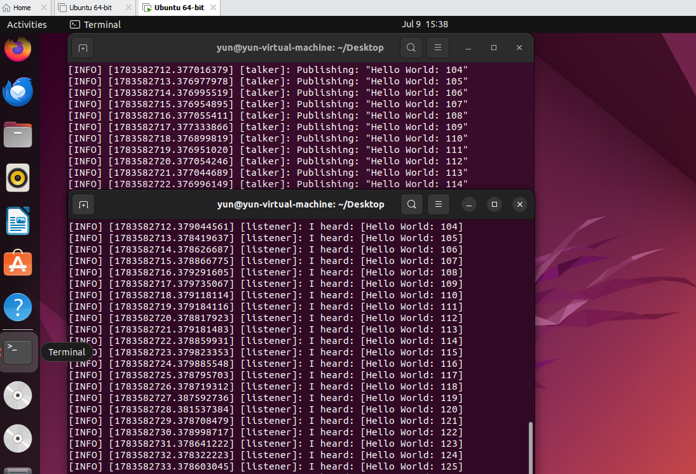

---

## 练习 1.2：工作空间创建与编译（约 15 分钟）

### 目标
创建 ROS 2 工作空间，掌握 colcon 构建工具链。

### 步骤

```bash
# 1. 创建工作空间
mkdir -p ~/my_ros2_ws/src
cd ~/my_ros2_ws

# 2. 编译空工作空间
colcon build --symlink-install

# 3. 创建测试包
cd src
ros2 pkg create my_first_pkg --build-type ament_python \
  --dependencies rclpy std_msgs

# 4. 编译测试包
cd ~/my_ros2_ws
colcon build --packages-select my_first_pkg --symlink-install
source install/setup.bash

# 5. 验证
ros2 pkg list | grep my_first
```

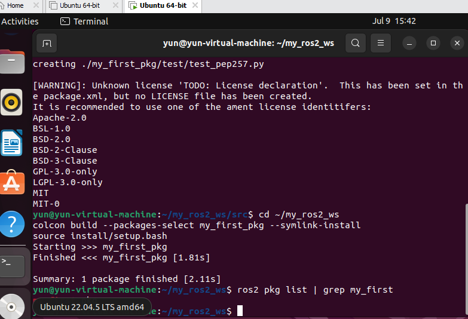

**✓ 验证**：`ros2 pkg list` 显示 my_first_pkg。

---

## 练习 1.3：DDS 域 ID 实验（约 15 分钟）

### 目标
理解 `ROS_DOMAIN_ID` 的通信隔离作用。

### 步骤

```bash
# 终端1：域0 talker
export ROS_DOMAIN_ID=0
ros2 run demo_nodes_py talker

# 终端2：域0 listener → 正常接收
export ROS_DOMAIN_ID=0
ros2 run demo_nodes_py listener
# Ctrl+C 停止
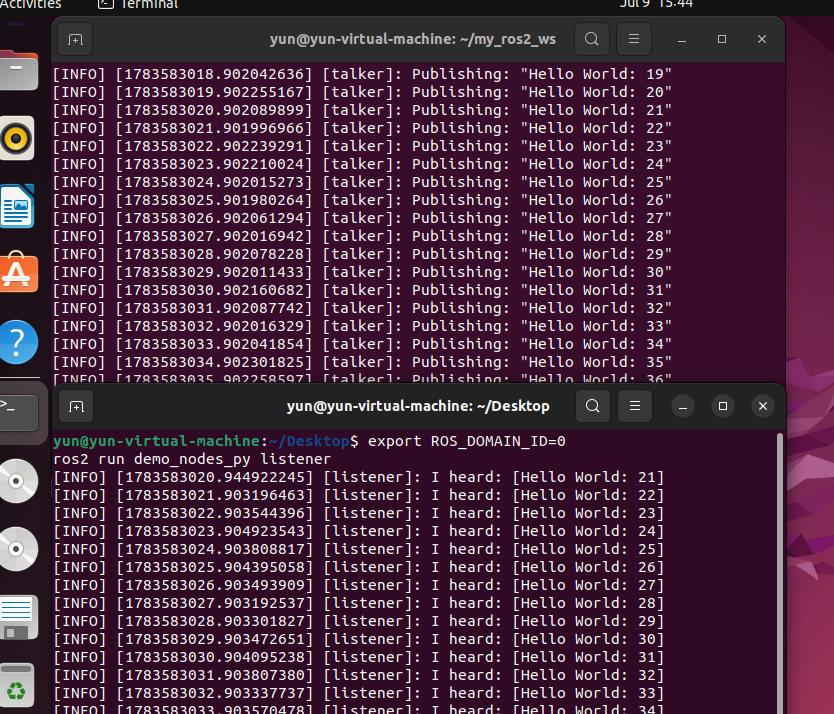
# 终端2：域1 listener → 无输出（域隔离）
export ROS_DOMAIN_ID=1
ros2 run demo_nodes_py listener
# 期望：无任何输出（无法跨域通信）
```

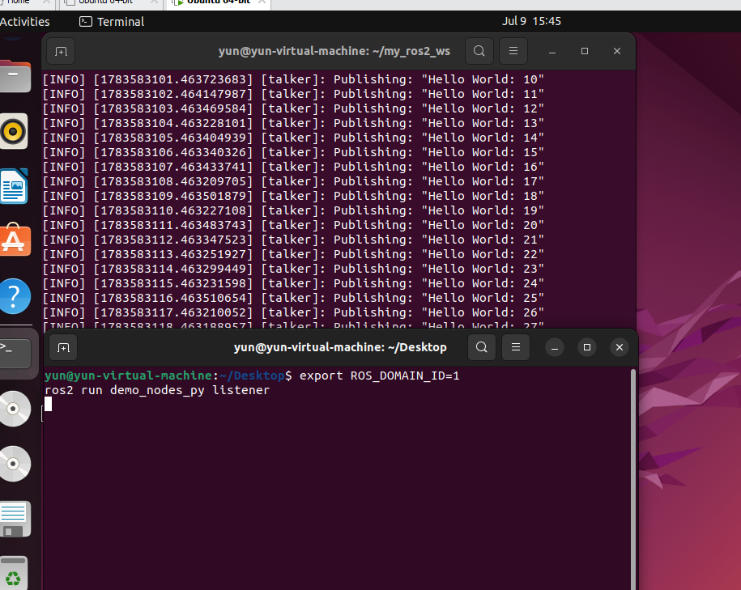

**✓ 验证**：同域通信正常，跨域通信隔离。

---

## 练习 1.4：课程源码包编译与运行（约 15 分钟）

### 目标
将课程源码包 `ros2_ws/` 复制到用户目录，完成完整编译并运行基础仿真。

### 步骤

**步骤1：复制课程源码**
```bash
# 将课程源码复制到用户工作空间
cp -r /path/to/course/ros2_ws/src ~/ros2_course_ws/
cd ~/ros2_course_ws
ls src/
# 期望：看到 20 个 ROS 2 包目录
# msgs_demo_interfaces  robot_sim_demo_ros2  topic_demo_py  ...
```

**步骤2：安装系统依赖**
```bash
# 安装 rosdep（如果尚未安装）
sudo apt install python3-rosdep -y                 
sudo rosdep init          # 仅首次运行
rosdep update

# 安装所有包的系统依赖
cd ~/ros2_course_ws
rosdep install --from-paths src --ignore-src -r -y
# 期望：[All required rosdeps installed successfully]
```

**步骤3：编译全部课程包**
```bash
colcon build --symlink-install
# 期望：Summary: 20 packages finished

# 查看编译结果
source install/setup.bash
ros2 pkg list | grep demo
```

**步骤4：验证仿真基础节点**
```bash
# 运行 XBot-U 无仿真模式（纯计算 + TF + RViz）
ros2 launch robot_sim_demo_ros2 sim_bringup.launch.py
# 期望：RViz 窗口打开，显示 XBot-U 机器人模型
# 终端输出：[ros2-control-ready:diff_drive_base_controller]
```

**✓ 验证**：
- 截图1：`colcon build` 编译成功（Summary: 20 packages finished）

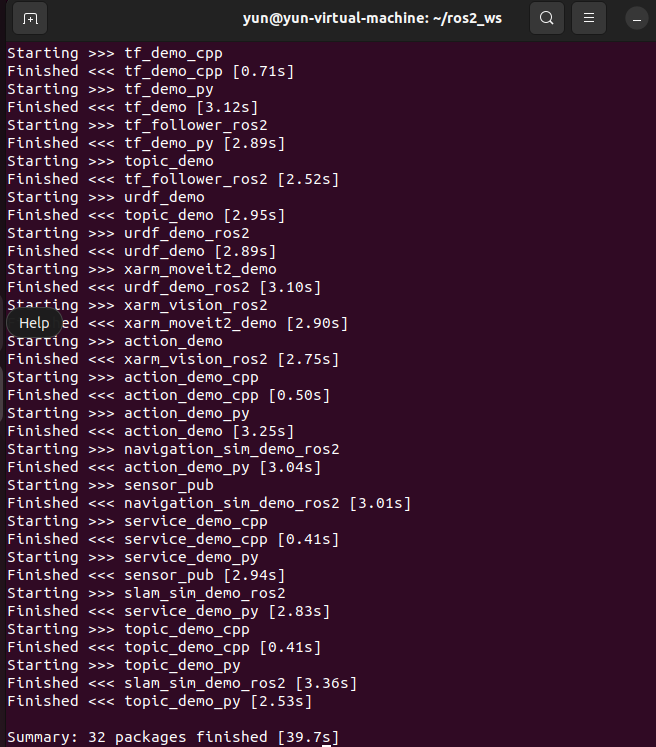

- 截图2：`ros2 pkg list | grep demo` 显示课程包列表

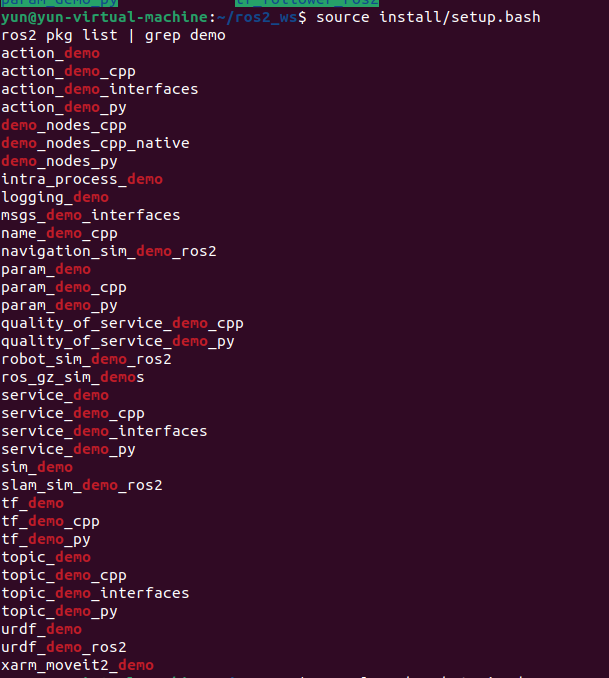

- 截图3：RViz 中 XBot-U 机器人模型正常显示

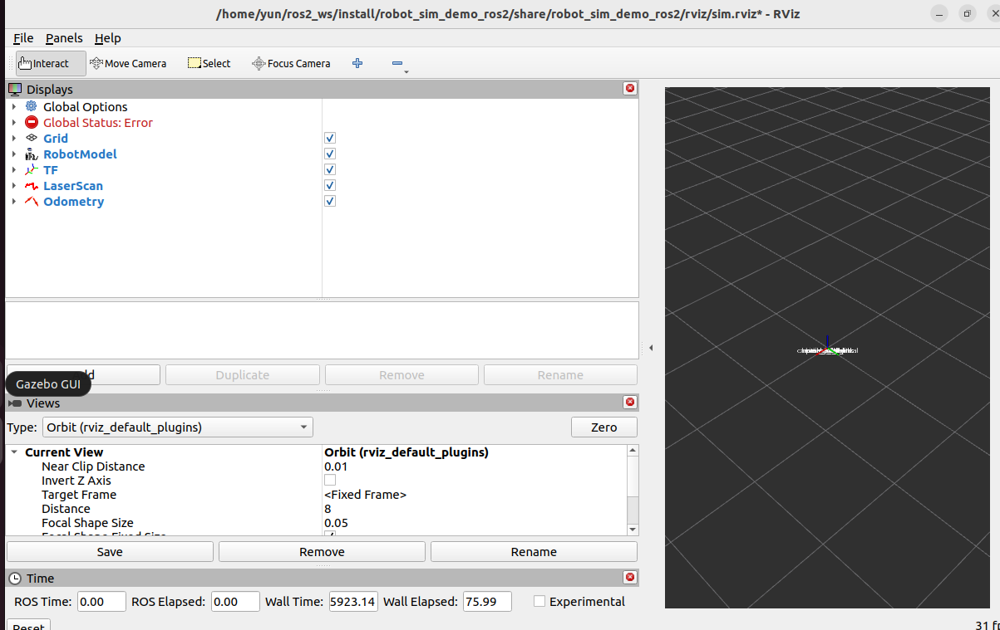

### 常见问题

| 问题 | 原因 | 解决方法 |
|------|------|---------|
| `rosdep install` 报错 | 缺少依赖包 | `sudo apt update && sudo apt install ros-humble-*` |
| 编译失败（找不到 gazebo） | 未安装 Gazebo | `sudo apt install ros-humble-ros-gz` |
| RViz 无机器人模型 | 未 source setup.bash | `cd ~/ros2_course_ws
source /opt/ros/humble/setup.bash
source install/setup.bash
ros2 launch robot_sim_demo_ros2 sim_bringup.launch.py use_rviz:=true` |

---

## 练习 1.5：课程仿真启动与使用（约 15 分钟）

### 目标
启动 Gazebo 仿真环境，在 RViz 中添加激光雷达、机器人模型、摄像头等显示项。

### 步骤

**步骤1：启动 Gazebo 仿真（含界面）**
```bash
# 加载课程工作空间
source ~/ros2_course_ws/install/setup.bash

# 启动 Gazebo + RViz 仿真
cd ~/ros2_course_ws
source /opt/ros/humble/setup.bash
source install/setup.bash
ros2 launch robot_sim_demo_ros2 sim_bringup.launch.py \
  use_gazebo:=true \
  gz_headless:=false \
  use_rviz:=true
# 期望：Gazebo 窗口 + RViz 窗口同时打开
# Gazebo 中显示 Museum 场景 + XBot-U 机器人
```

**步骤2：在 RViz 中添加激光雷达显示**
- 左侧 "Displays" → Add → 选择 "LaserScan"
- 在新增的 LaserScan 项中设置 Topic：`/scan`
- 期望：看到绿色激光扫描点组成的轮廓线

**步骤3：添加机器人模型显示**
- Displays → Add → 选择 "RobotModel"
- 期望：看到 XBot-U 机器人 3D 模型

**步骤4：添加摄像头显示（需要启用深度相机）**
- Displays → Add → 选择 "Camera"
- 在 Camera 项中设置 Topic：`/camera/image_raw`
- 期望：看到摄像头实时画面

**步骤5：键盘遥控测试**
```bash
# 新开终端
source ~/ros2_course_ws/install/setup.bash
ros2 run teleop_twist_keyboard teleop_twist_keyboard
# 按 i 前进，k 停止，j/l 左右转
# 观察 RViz 和 Gazebo 中机器人运动
```

**✓ 验证**：
- 截图1：Gazebo 窗口（Museum 场景 + XBot-U 机器人）

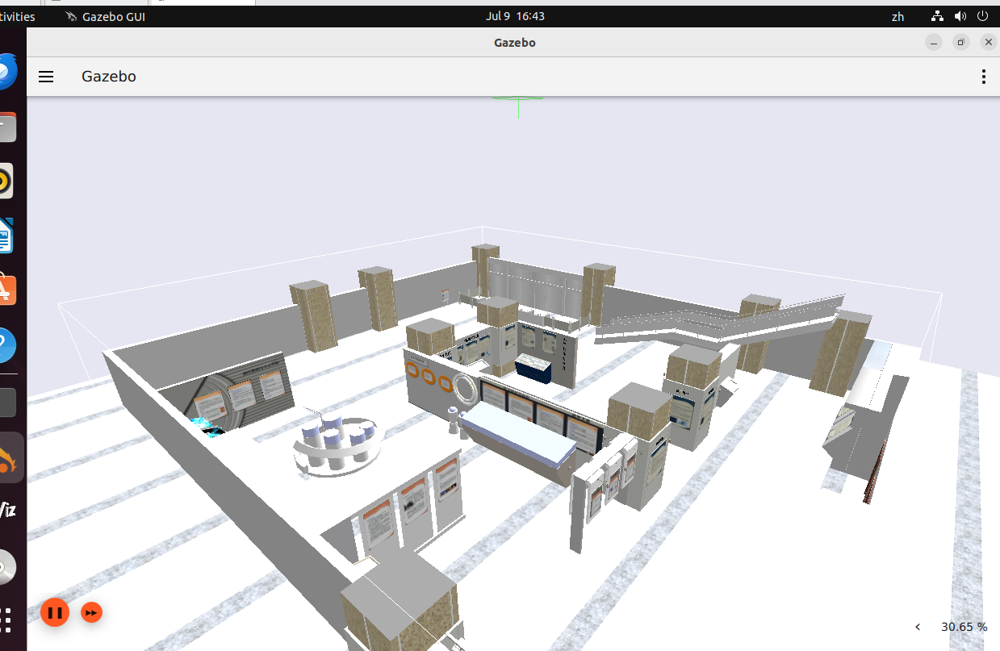

- 截图2：RViz 窗口（RobotModel + LaserScan 正常显示）

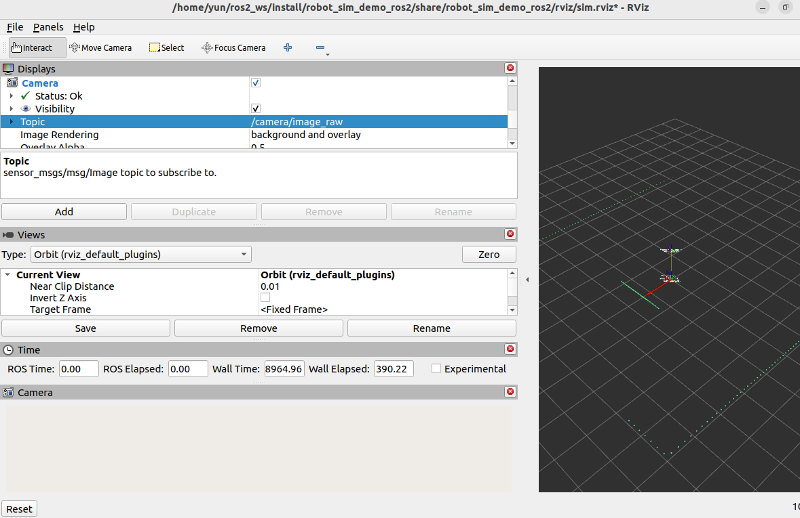

- 截图3：键盘遥控后机器人位置改变

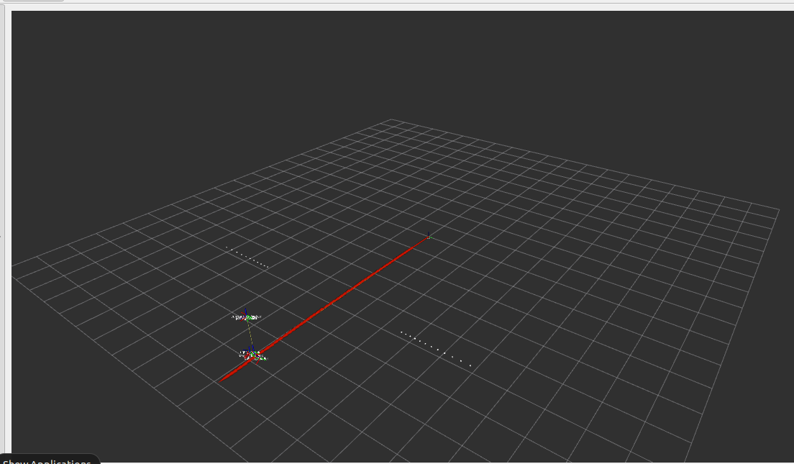


**补充：验证激光雷达与深度相机话题**

```bash
# 终端1：启动 Gazebo、RViz、激光雷达和深度相机
cd ~/ros2_course_ws
source /opt/ros/humble/setup.bash
source install/setup.bash

ros2 launch robot_sim_demo_ros2 sim_bringup.launch.py \
  use_gazebo:=true \
  gz_headless:=false \
  use_rviz:=true \
  enable_fake_laser:=true \
  enable_depth_camera:=true

# 终端2：桥接相机图像和 CameraInfo
source /opt/ros/humble/setup.bash
source ~/ros2_course_ws/install/setup.bash

ros2 run ros_gz_bridge parameter_bridge \
  /rgbd_camera/image@sensor_msgs/msg/Image@gz.msgs.Image \
  /rgbd_camera/camera_info@sensor_msgs/msg/CameraInfo@gz.msgs.CameraInfo

# 终端3：检查传感器话题及发布频率
source /opt/ros/humble/setup.bash
source ~/ros2_course_ws/install/setup.bash

ros2 topic list -t | grep -E "scan|rgbd|camera|image|depth|camera_info"
ros2 topic hz /scan
ros2 topic hz /rgbd_camera/image
ros2 topic hz /rgbd_camera/camera_info
```

- 在 RViz 中依次选择 Displays → Add → Image。
- 将 Topic 设置为 `/rgbd_camera/image`。

---


## 练习 1.6：VS Code + ROS 2 插件编程（约 15 分钟）

### 目标
配置 VS Code 开发环境，安装 ROS 扩展，创建、编译、调试 ROS 2 Python 节点。

### 步骤

**步骤1：安装 VS Code 和 ROS 插件**
```bash
# 安装 VS Code（如已安装可跳过）
sudo snap install code --classic

# 在 VS Code 扩展市场搜索安装：
# 1. 使用“ros/ros2 by JaehyunShim”
# 2. "Python" (by Microsoft)
# 3. "Pylance" (by Microsoft)
```

**步骤2：打开课程工作空间**
```bash
cd ~/ros2_course_ws
code .
# 在 VS Code 中打开工作空间文件夹
```

**步骤3：创建测试节点**
- 在 VS Code 左侧文件树中，右键 `src/` → 新建文件夹 `hello_ros2`
- 在 `hello_ros2/` 下创建 `hello_node.py`：

```python
#!/usr/bin/env python3
"""hello_ros2: VS Code 调试示例节点 — LifecyclePublisher + QoS + /cmd_vel"""

import rclpy
from rclpy.lifecycle import LifecycleNode, TransitionCallbackReturn
from geometry_msgs.msg import Twist

from rclpy.qos import (
    QoSProfile,
    HistoryPolicy,
    ReliabilityPolicy,
    DurabilityPolicy,
)


class HelloRos2Node(LifecycleNode):
    def __init__(self):
        super().__init__('hello_ros2_lifecycle')

        self.pub = None
        self.timer = None
        self.count = 0
        self.active = False

        self.get_logger().info('Lifecycle 节点已创建，等待 configure。')

    def on_configure(self, state):
        self.get_logger().info('on_configure: 配置节点资源。')

        cmd_vel_qos = QoSProfile(
            history=HistoryPolicy.KEEP_LAST,
            depth=10,
            reliability=ReliabilityPolicy.RELIABLE,
            durability=DurabilityPolicy.VOLATILE,
        )
        self.pub = self.create_lifecycle_publisher(
            Twist,
            '/cmd_vel',
            cmd_vel_qos
        )

        self.timer = self.create_timer(0.5, self.timer_callback)

        self.get_logger().info('on_configure: LifecyclePublisher 和定时器创建完成。')

        return TransitionCallbackReturn.SUCCESS

    def on_activate(self, state):
        self.get_logger().info('on_activate: 激活节点，允许发布 /cmd_vel。')

        ret = super().on_activate(state)

        if ret == TransitionCallbackReturn.SUCCESS:
            self.active = True
            self.get_logger().info('on_activate: 节点已激活。')

        return ret

    def on_deactivate(self, state):
        self.get_logger().info('on_deactivate: 停用节点，停止发布 /cmd_vel。')

        self.active = False

        ret = super().on_deactivate(state)

        return ret

    def on_cleanup(self, state):
        self.get_logger().info('on_cleanup: 清理节点资源。')

        self.active = False

        if self.timer is not None:
            self.destroy_timer(self.timer)
            self.timer = None

        if self.pub is not None:

            try:
                self.destroy_lifecycle_publisher(self.pub)
            except AttributeError:
                self.destroy_publisher(self.pub)
            self.pub = None

        self.count = 0

        return TransitionCallbackReturn.SUCCESS

    def timer_callback(self):
        if not self.active:
            return

        msg = Twist()
        msg.linear.x = 0.1
        msg.angular.z = 0.0

        self.pub.publish(msg)

        self.count += 1
        self.get_logger().info(
            f'第 {self.count} 次发布 /cmd_vel: '
            f'linear.x={msg.linear.x:.2f}, angular.z={msg.angular.z:.2f}'
        )


def main(args=None):
    rclpy.init(args=args)

    node = HelloRos2Node()

    try:
        rclpy.spin(node)
    except KeyboardInterrupt:
        node.get_logger().info('用户中断，节点退出。')
    finally:
        node.destroy_node()
        rclpy.shutdown()


if __name__ == '__main__':
    main()

```
#ros2+LifecycleNode+Qos，可以体现生命周期节点的配置、激活、停用和清理过程。
- 在 `on_configure()` 阶段创建 `/cmd_vel` 发布者和定时器；
- 在 `on_activate()` 阶段激活生命周期发布者，开始周期发布速度控制消息；
- 在 `on_deactivate()` 阶段停止发布；
- 在 `on_cleanup()` 阶段销毁定时器和发布者资源。
- `KEEP_LAST + depth=10`：保留最近 10 条消息；
- `RELIABLE`：尽量保证控制消息可靠传输；
- `VOLATILE`：不保存历史消息，只向当前在线订阅者发送。

**步骤4：配置调试（launch.json）**
- 手动创建 `.vscode/launch.json`：

```json
{
    "version": "0.2.0",
    "configurations": [
        {
            "name": "ROS: Debug hello_ros2",
            "type": "python",
            "request": "launch",
            "program": "${workspaceFolder}/src/hello_ros2/hello_node.py",
            "cwd": "${workspaceFolder}",
            "env": {
                "PYTHONPATH": "${workspaceFolder}/install/lib/python3.10/site-packages"
            }
        }
    ]
}
```

**步骤5：断点调试**
- 在 `self.pub = self.create_lifecycle_publisher(...)` `ret = super().on_activate(state)``self.pub.publish(msg)`行左侧单击设置断点（红点）
- 按 `F5` 启动调试,新建终端，依次执行`ros2 lifecycle set /hello_ros2_lifecycle configure`
`ros2 lifecycle set /hello_ros2_lifecycle activate`
- 期望：程序在断点处暂停，可查看变量值、单步执行，节点激活后程序周期性进入timer_callback，可以通过`ros2 topic echo /cmd_vel`验证话题是否正常发布

**✓ 验证**：
- 截图1：VS Code 扩展列表（ROS + Python 已安装）

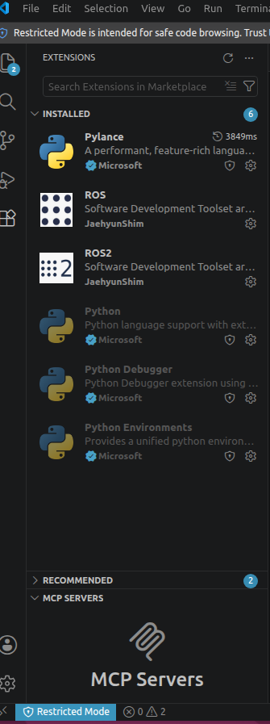

- 截图2：hello_node.py 代码编辑界面（含代码补全提示）

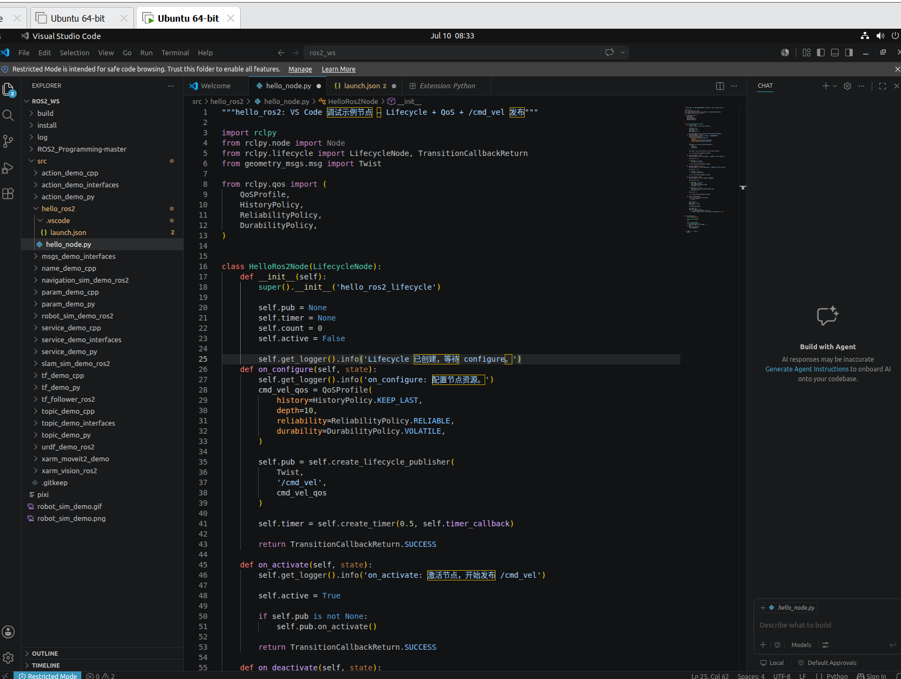

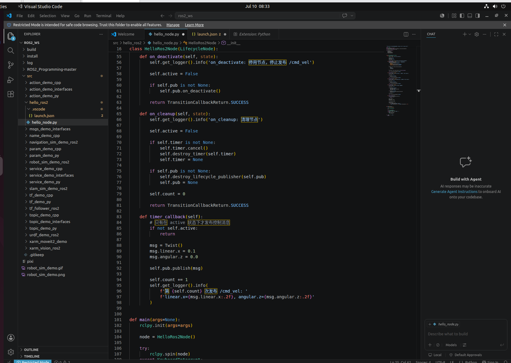

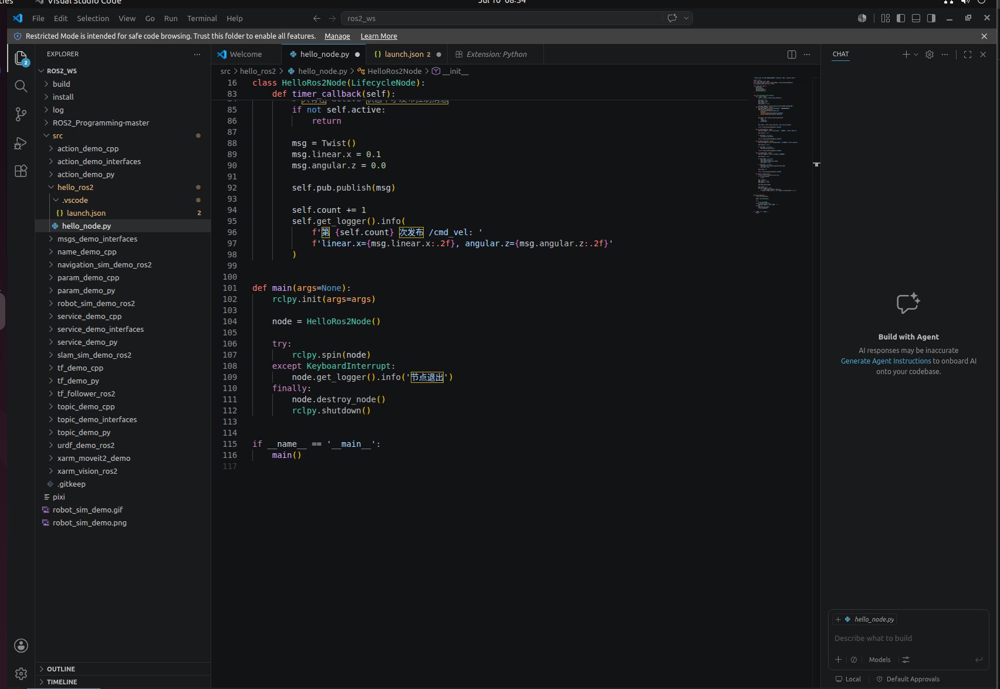

- 截图3：F5 调试运行中，断点处暂停，左侧显示变量面板

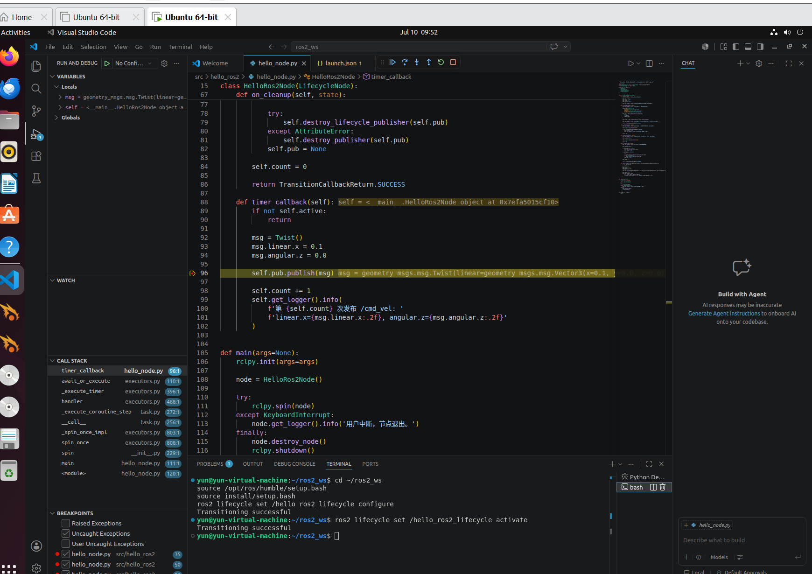

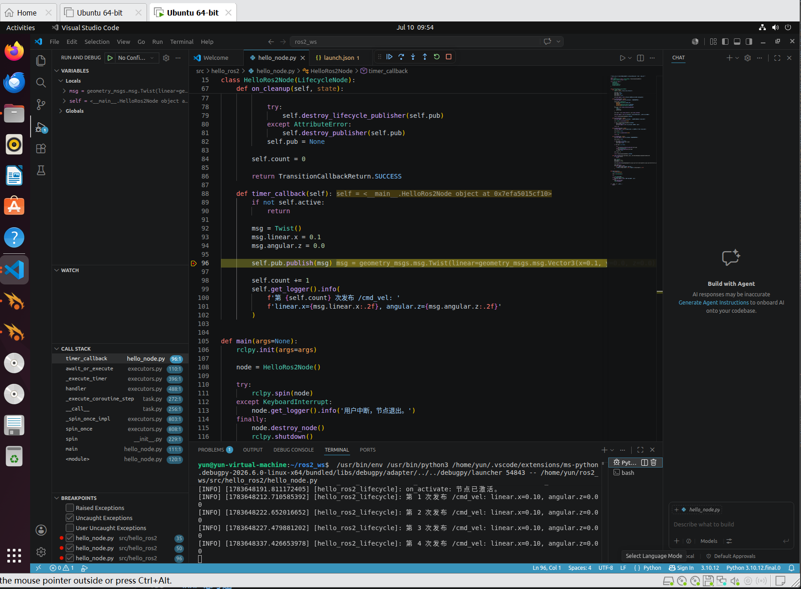

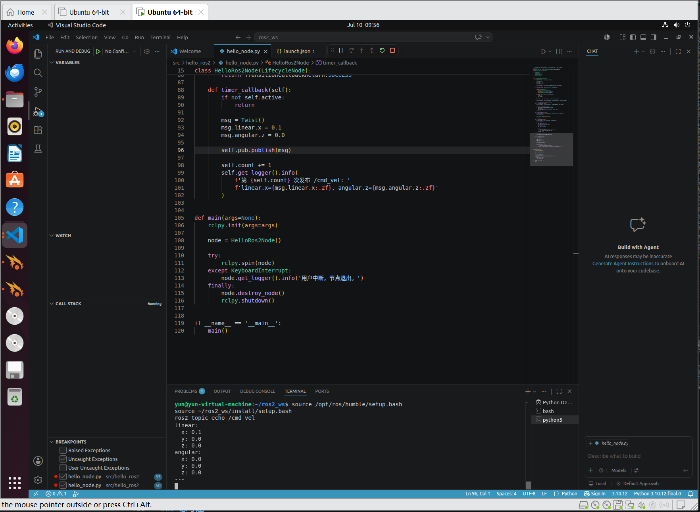

---

## 本章实验总结

| 练习 | 核心技能 | 时长 |
|------|---------|:--:|
| 1.1 | ROS 2 安装验证 | 15min |
| 1.2 | 工作空间 + colcon 构建 | 15min |
| 1.3 | DDS 域 ID 通信隔离 | 15min |
| 1.4 | 课程源码包编译与运行 | 15min |
| 1.5 | Gazebo + RViz 仿真启动 | 15min |
| 1.6 | VS Code + ROS2 插件调试 | 15min |

### 思考题

1. 仿真中 XBot-U 机器人的 `/cmd_vel` 话题有什么作用？速度控制，像机器人发送geometry_msgs/msg/Twist类型消息，实现前进后退等运动指令
2. 如果 Gazebo 无法启动（黑屏/崩溃），可能的原因有哪些？渲染环境有问题，卡死了或者不稳定；相关依赖没完整安装
3. VS Code 断点调试与传统 `print()` 调试相比有哪些优势？可以直接查看当前变量值、对象状态、函数调用过程以及程序执行顺序

## 实际运行证据

ROS 2 生命周期节点、状态查询和 `/cmd_vel` 输出的真实限时运行记录：


原始录制：[ch01_lifecycle.cast](images/runtime/ch01_lifecycle.cast)。完整证据索引见[实际运行证据](runtime_evidence.md)。
