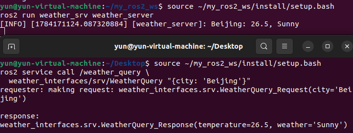
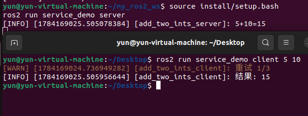
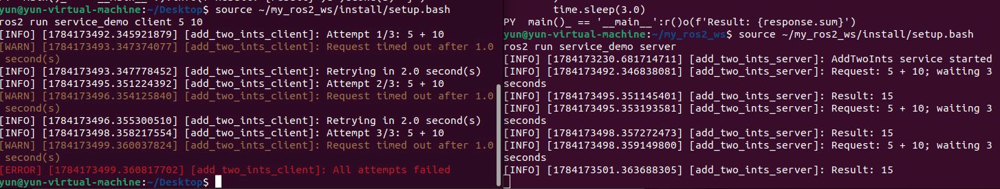
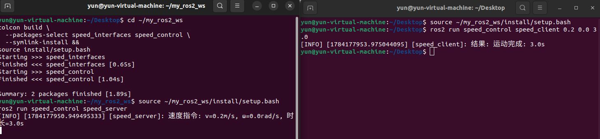
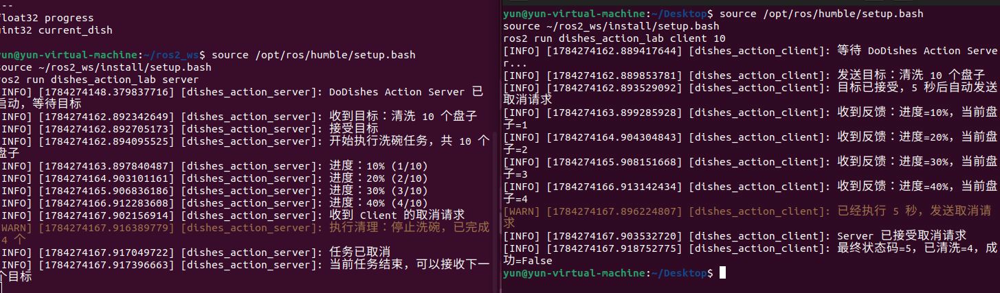
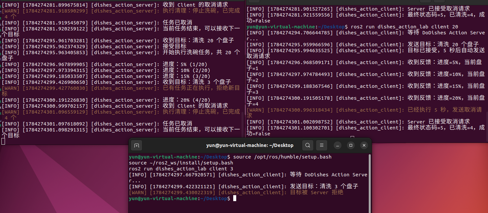
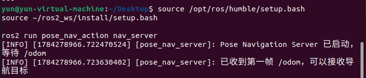
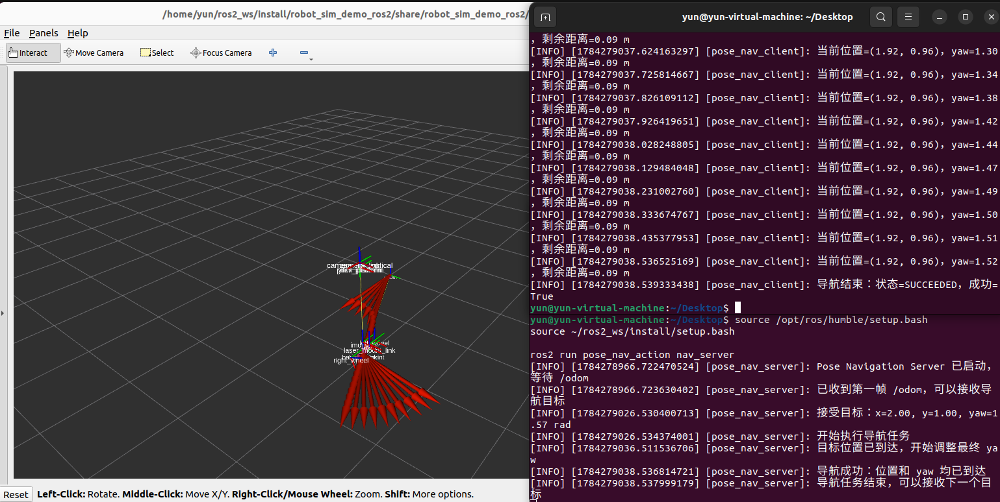
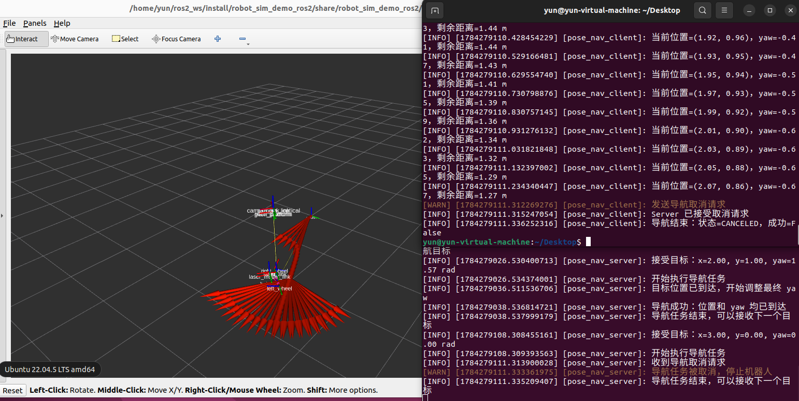
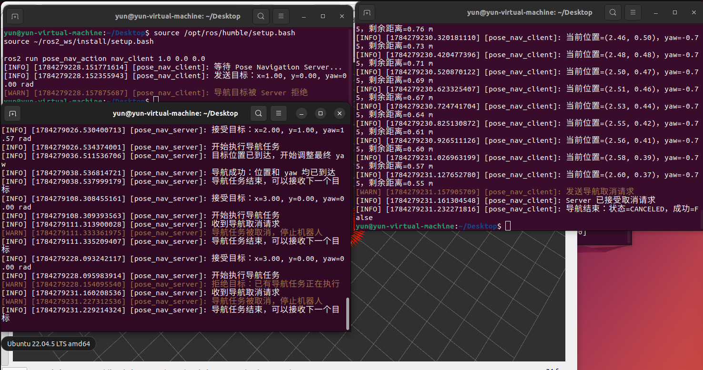

# 第2章 实验指导书：Python 节点编程与工具链

## 当前仓库仿真验证：节点命名空间与工具链检查

### 实验目标

在移动机器人仿真运行时创建/检查 ROS 2 节点，练习 `ros2 node` 命令、节点重命名和 RViz 观察，验证 Python 节点与仿真节点处于同一 DDS 域。

### 运行步骤

```bash
source /opt/ros/jazzy/setup.bash
source install/setup.bash
ros2 launch robot_sim_demo gazebo2.launch.py \
  gui:=true rviz:=true drive:=false
```

另开终端运行并检查节点：

```bash
source install/setup.bash
ros2 run name_demo_cpp name_demo_node \
  --ros-args -r __ns:=/student -p serial:=7
ros2 node list
ros2 node info /student/name_demo
```

### 观察与验收

终端应显示 `/student/name_demo` 的完整名称；RViz 可显示仿真机器人和 TF。源码：`src/name_demo_cpp/src/name_demo.cpp`，仿真入口：`src/robot_sim_demo/launch/gazebo2.launch.py`。

> **实验课时**：2 课时（90 分钟）  
> **实验平台**：Ubuntu 22.04 + ROS 2 Humble  

---

## 实验目标

完成本实验后，学员应能够：
1. 独立创建 ROS 2 Python 包和节点
2. 配置 setup.py 中的 entry_points
3. 使用日志系统进行程序调试
4. 使用 ros2 命令行工具查看系统状态
5. 使用 rqt_graph 和 RViz2 可视化工具

---

## 练习 3.1：创建并运行 Python 节点（约 30 分钟）

### 目标
创建一个完整的 Python 节点，通过定时器周期输出日志。

### 步骤

**步骤1：创建 Python 包**
```bash
cd ~/my_ros2_ws/src
ros2 pkg create hello_pkg --build-type ament_python \
  --dependencies rclpy
```

**步骤2：编写节点代码**

在 `~/my_ros2_ws/src/hello_pkg/hello_pkg/` 目录下创建 `hello_node.py`：

```python
#!/usr/bin/env python3
"""hello_node: 第一个ROS2 Python节点 — 周期输出问候语和计时"""
import rclpy
from rclpy.node import Node


class HelloNode(Node):
    """周期输出问候语的节点 — 演示定时器和日志功能"""

    def __init__(self):
        # 初始化节点，名称为 hello_node
        super().__init__('hello_node')
        # 创建 1 Hz 定时器，回调 timer_callback
        self.timer = self.create_timer(1.0, self.timer_callback)
        self.count = 0                # 计数器
        # 启动日志（仅输出一次）
        self.get_logger().info('HelloNode 已启动！', once=True)

    def timer_callback(self):
        """定时器回调 — 每1秒输出带计数器的日志"""
        self.count += 1
        self.get_logger().info(f'Hello ROS 2! 计数: {self.count}',
                               throttle_duration_sec=1)


def main(args=None):
    rclpy.init(args=args)             # ① 初始化 ROS 2
    node = HelloNode()                # ② 创建节点实例
    try:
        rclpy.spin(node)             # ③ 进入事件循环（阻塞）
    except KeyboardInterrupt:
        pass                          # ④ 捕获 Ctrl+C 正常退出
    finally:
        node.destroy_node()          # ⑤ 销毁节点释放资源
        rclpy.shutdown()             # ⑥ 关闭 ROS 2


if __name__ == '__main__':
    main()
```

**步骤3：配置 setup.py**

编辑 `~/my_ros2_ws/src/hello_pkg/setup.py`，在 `entry_points` 中添加：

```python
entry_points={
    'console_scripts': [
        'hello_node = hello_pkg.hello_node:main',
        #  ↑ 可执行命令     ↑ 模块路径:函数名
    ],
},
```

**步骤4：编译并运行**
```bash
cd ~/my_ros2_ws
colcon build --packages-select hello_pkg --symlink-install
source install/setup.bash
ros2 run hello_pkg hello_node
# 期望输出：[INFO] HelloNode 已启动！
#          [INFO] Hello ROS 2! 计数: 1
#          [INFO] Hello ROS 2! 计数: 2
```

**步骤4：检查运行结果与图示一致**

- 截图1：colcon build 输出显示编译成功



- 截图2：ros2 run 输出显示周期日志



- 截图3：`ros2 node list` 显示 /hello_node



### 参考代码
> 完整参考代码位于 `lab_code/ch02_lab/hello_pkg/`

---

## 练习 3.2：日志系统实验（约 30 分钟）

### 目标
掌握 ROS 2 日志系统，测试不同日志级别和节流功能。

### 步骤

**步骤1：创建带日志功能的节点**

在 `hello_pkg/hello_pkg/` 下创建 `logger_demo.py`：

```python
#!/usr/bin/env python3
"""logger_demo: 演示ROS2日志系统的分级输出、节流和一次性输出"""
import rclpy
from rclpy.node import Node


class LoggerDemoNode(Node):
    """展示日志系统全部特性"""

    def __init__(self):
        super().__init__('logger_demo')
        # 设置日志级别为 DEBUG（默认仅输出 INFO 及以上）
        self.get_logger().set_level(rclpy.logging.LoggingSeverity.DEBUG)
        self.timer = self.create_timer(1.0, self.log_all_levels)
        self.counter = 0

    def log_all_levels(self):
        """输出各级别日志"""
        self.counter += 1
        self.get_logger().debug(f'DEBUG 消息 #{self.counter}')
        self.get_logger().info(f'INFO 消息 #{self.counter}')
        self.get_logger().warn(f'WARN 消息 #{self.counter}')

        # 仅输出一次
        if self.counter == 3:
            self.get_logger().error('ERROR: 第3次出现异常!', once=True)

        # 节流：每秒最多输出1次
        if self.counter >= 5:
            self.get_logger().warn(
                '高频警告——已节流', throttle_duration_sec=2)


def main(args=None):
    rclpy.init(args=args)
    rclpy.spin(LoggerDemoNode())
    rclpy.shutdown()


if __name__ == '__main__':
    main()
```

**步骤2：配置 entry_points 并编译**

在 setup.py 的 entry_points 中添加：
```python
 'logger_demo = hello_pkg.logger_demo:main',
```

**步骤3：运行并观察日志**
```bash
cd ~/my_ros2_ws
colcon build --packages-select hello_pkg --symlink-install
source install/setup.bash
ros2 run hello_pkg logger_demo
# 观察各级别日志输出
# Ctrl+C 停止
```

**步骤4：使用命令行参数修改日志级别**（要先在setup.py中注释掉# self.get_logger().set_level(rclpy.logging.LoggingSeverity.DEBUG)）
```bash
# 仅输出 ERROR 级日志
ros2 run hello_pkg logger_demo --ros-args --log-level ERROR
# 期望：仅看到 ERROR 输出

# 指定节点日志级别
ros2 run hello_pkg logger_demo --ros-args \
  --log-level logger_demo:=WARN
# 期望：仅看到 WARN 及以上输出
```

**步骤4：检查运行结果与图示一致**

- 截图1：默认日志输出（DEBUG ~ ERROR）



- 截图2：`--log-level ERROR` 仅显示错误日志



- 截图3：`rqt_console` 输出（`ros2 run rqt_console rqt_console`）



### 参考代码
> 完整参考代码位于 `lab_code/ch02_lab/hello_pkg/hello_pkg/logger_demo.py`

---

## 练习 3.3：可视化工具使用（约 30 分钟）

### 目标
使用 rqt_graph 和 RViz2 查看 ROS 2 系统状态。

### 步骤

**步骤1：启动 talker 和 listener 两个节点**
```bash
# 终端1
ros2 run demo_nodes_py talker

# 终端2
ros2 run demo_nodes_py listener
```

**步骤2：启动 rqt_graph**
```bash
# 终端3
rqt_graph
```
- 在 rqt_graph 界面中，观察节点（椭圆）与话题（矩形）的拓扑关系
- 勾选 "Nodes/Topics (all)" 查看完整图
- 截图保存拓扑图

**步骤3：查看节点信息**
```bash
# 终端3
ros2 node info /talker
# 期望输出：
# Subscribers: /parameter_events
# Publishers: /chatter: std_msgs/msg/String

ros2 node info /listener
# 期望输出：
# Subscribers: /chatter: std_msgs/msg/String
# Publishers: /parameter_events
```

**步骤4：启动 RViz2**
```bash
rviz2
```
- 左侧 "Displays" → Add → "By topic"，选择话题添加显示
- 理解 RViz2 的 Displays 面板和 Views 面板

**步骤4：检查运行结果与图示一致**

- 截图1：rqt_graph 中的节点-话题拓扑图



- 截图2：ros2 node info /talker 输出



- 截图3：RViz2 启动界面



### 思考题

1. `rqt_graph` 中哪些是节点？哪些是话题？如何区分？椭圆表述节点，矩形表示话题，用箭头链接，	节点 → 话题表示发布，话题 → 节点表示订阅
2. `--log-level` 参数的默认值是多少？（练习3.1步骤1）默认参数是info，ROS2默认会输出 INFO、WARN、ERROR 和 FATAL 级别的日志，不会输出 DEBUG 日志
3. 如果 `entry_points` 未正确配置，运行时会出现什么错误？（练习3.1步骤3、4）entry_points的作用是告诉ROS2运行哪个 Python 文件中的哪个函数作为程序入口。执行 ros2 run 时通常会提示 No executable found，如果模块或函数配置错误，还可能出现 ModuleNotFoundError 或 AttributeError

---

## 练习 4：节点与仿真交互 — 订阅 /odom 查看机器人位置（约 15 分钟）

### 目标
编写一个订阅者节点，订阅 XBot-U 仿真的 `/odom` 话题，实时输出机器人位置和速度。

### 步骤

**步骤1：启动课程仿真**
```bash
source ~/ros2_course_ws/install/setup.bash
ros2 launch robot_sim_demo_ros2 sim_bringup.launch.py
ros2 launch robot_sim_demo_ros2 sim_bringup.launch.py use_rviz:=true
```

**步骤2：创建 odom_monitor.py**
```python
#!/usr/bin/env python3
"""odom_monitor: 监听 XBot-U /odom 话题，实时显示机器人位置"""
import rclpy
from rclpy.node import Node
from nav_msgs.msg import Odometry


class OdomMonitor(Node):
    def __init__(self):
        super().__init__('odom_monitor')
        # 订阅 /odom 话题（XBot-U 里程计数据）
        self.sub = self.create_subscription(
            Odometry, '/odom', self.odom_callback, 10)

    def odom_callback(self, msg):
        # 提取位置 (x, y) 和姿态 (yaw)
        pos = msg.pose.pose.position
        orient = msg.pose.pose.orientation
        # 计算偏航角 (简化取 z * 2)
        yaw = 2.0 * orient.z if orient.z < 1.0 else 0.0
        self.get_logger().info(
            f'XBot-U 位置: x={pos.x:.2f}m, y={pos.y:.2f}m, 航向={yaw:.2f}rad')


def main(args=None):
    rclpy.init(args=args)
    rclpy.spin(OdomMonitor())
    rclpy.shutdown()


if __name__ == '__main__':
    main()
```

**步骤3：运行测试**
```bash
# 终端1：仿真已启动
# 终端2：启动 odom_monitor
cd ~/my_ros2_ws
source /opt/ros/humble/setup.bash
colcon build --packages-select hello_pkg --symlink-install
source install/setup.bash
ros2 run hello_pkg odom_monitor    # 需要先添加到 setup.py 'odom_monitor = hello_pkg.odom_monitor:main'

# 终端3：发送控制指令改变机器人位置
ros2 topic pub /cmd_vel geometry_msgs/msg/Twist \
  "{linear: {x: 0.2}, angular: {z: 0.5}}" -r 10
```

**✓ 验证**：odom_monitor 终端实时输出机器人位置和航向变化。



### 思考题
1. `/odom` 中的 `pose.pose.orientation` 使用四元数表示姿态，如何转换为欧拉角？使用 TF2转换为欧拉角 (Roll、Pitch、Yaw)，其中Yaw是航向角
2. 如何利用 `/odom` 数据计算机器人的行驶总距离？每次接收 /odom 消息时，读取当前位置 (x, y)，与上一时刻的位置计算两点间距离 并将每次位移累加，得到机器人的总行驶距离。

## 实际运行证据

真实运行的 Python 节点、节点列表和节点信息输出：


原始录制：[ch02_nodes.cast](images/runtime/ch02_nodes.cast)。完整证据索引见[实际运行证据](runtime_evidence.md)。
