# 第3章 实验指导书：话题通信编程与实践

> **实验课时**：2 课时（90 分钟）  
> **实验平台**：Ubuntu 22.04 + ROS 2 Humble  

---

## 实验目标

完成本实验后，学员应能够：
1. 编写 Publisher 和 Subscriber 节点
2. 理解标准消息类型的使用
3. 创建并使用自定义消息接口
4. 配置测试不同的 QoS 策略

---

## 练习 3.1：Publisher 与 Subscriber 通信（约 30 分钟）

### 目标
实现一个完整的发布-订阅通信链路，发布者周期发送消息，订阅者接收并打印。

### 步骤

**步骤1：创建 topic_demo 包**
```bash
cd ~/my_ros2_ws/src
ros2 pkg create topic_demo --build-type ament_python \
  --dependencies rclpy std_msgs
```

**步骤2：编写 Publisher 节点**

在 `~/my_ros2_ws/src/topic_demo/topic_demo/` 下创建 `publisher.py`：

```python
#!/usr/bin/env python3
"""publisher_demo: 话题发布者 — 周期发布GPS坐标数据"""
import rclpy
from rclpy.node import Node
from geometry_msgs.msg import Point  # 三维点坐标


class GpsPublisher(Node):
    """模拟GPS传感器数据发布节点 — 周期发布Point消息"""

    def __init__(self):
        super().__init__('gps_publisher')
        # 创建发布者：发布 Point 消息到 /gps_position 话题
        self.publisher = self.create_publisher(
            Point,                # 消息类型（三维坐标）
            '/gps_position',      # 话题名称
            10)                   # 队列深度
        # 创建 1 Hz 定时器
        self.timer = self.create_timer(1.0, self.publish_position)
        self.x = 0.0              # X 坐标初始值

    def publish_position(self):
        """定时器回调 — 构造并发布 Point 消息"""
        msg = Point()
        msg.x = self.x            # 纬度方向
        msg.y = 2 * self.x + 1    # 经度方向（线性变化）
        msg.z = 0.0               # 高度（固定）
        self.publisher.publish(msg)  # 发布消息
        self.get_logger().info(
            f'发布 GPS 位置: x={msg.x:.2f}, y={msg.y:.2f}')
        self.x += 1.0             # 更新坐标


def main(args=None):
    rclpy.init(args=args)
    rclpy.spin(GpsPublisher())    # ① 初始化 ② spin ③ shutdown
    rclpy.shutdown()


if __name__ == '__main__':
    main()
```

**步骤3：编写 Subscriber 节点**

在 `topic_demo/topic_demo/` 下创建 `subscriber.py`：

```python
#!/usr/bin/env python3
"""subscriber_demo: 话题订阅者 — 接收并处理GPS位置数据"""
import rclpy
from rclpy.node import Node
from geometry_msgs.msg import Point


class GpsSubscriber(Node):
    """GPS数据订阅节点 — 监听/gps_position话题并处理坐标"""

    def __init__(self):
        super().__init__('gps_subscriber')
        # 创建订阅者：监听 Point 消息的 /gps_position 话题
        self.subscription = self.create_subscription(
            Point,                # 消息类型
            '/gps_position',     # 话题名称
            self.position_callback,  # 回调函数
            10)                   # 队列深度
        # 防止未使用的变量被 lint 警告
        self.subscription

    def position_callback(self, msg):
        """收到 GPS 位置消息时的回调函数"""
        # 计算到原点的欧氏距离
        distance = (msg.x**2 + msg.y**2)**0.5
        self.get_logger().info(
            f'收到位置: ({msg.x:.2f}, {msg.y:.2f}), '
            f'距原点: {distance:.2f}m')


def main(args=None):
    rclpy.init(args=args)
    rclpy.spin(GpsSubscriber())
    rclpy.shutdown()


if __name__ == '__main__':
    main()
```

**步骤4：配置 setup.py 并编译**

编辑 `topic_demo/setup.py` 的 entry_points：
```python
entry_points={
    'console_scripts': [
        'gps_pub = topic_demo.publisher:main',
        'gps_sub = topic_demo.subscriber:main',
    ],
},
```

```bash
cd ~/my_ros2_ws
colcon build --packages-select topic_demo --symlink-install
source install/setup.bash
```

**步骤5：运行测试**
```bash
# 终端1：启动发布者
ros2 run topic_demo gps_pub
# 终端2：启动订阅者
ros2 run topic_demo gps_sub
# 终端3：监控
ros2 topic echo /gps_position #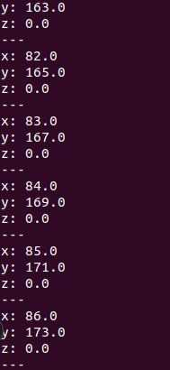
ros2 topic hz /gps_position       # 查看发布频率（期望 ~1Hz）
```

**步骤5：检查运行结果与图示一致**
- 截图1：publisher 发布日志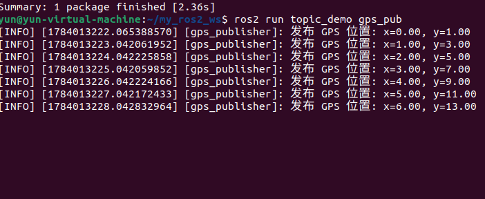
- 截图2：subscriber 接收日志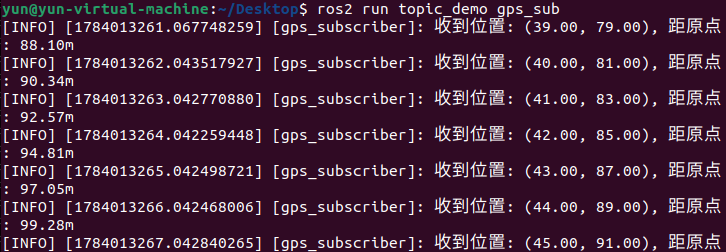
- 截图3：`ros2 topic hz /gps_position` 输出（频率）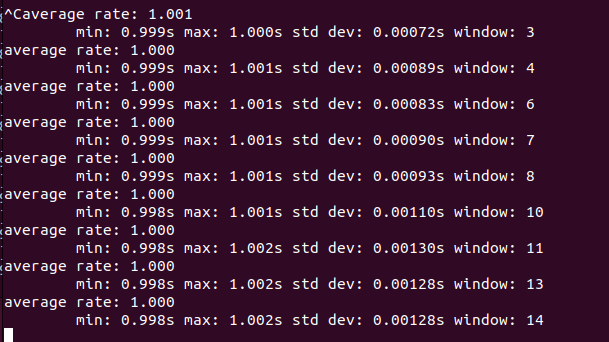
- 截图4：rqt_graph 通信拓扑  运行：source /opt/ros/humble/setup.bash
source ~/my_ros2_ws/install/setup.bash
rqt_graph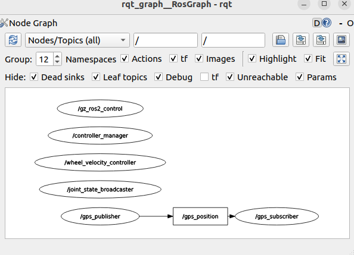
### 参考代码
> 完整参考代码位于 `lab_code/ch03_lab/topic_demo/`

---

## 练习 3.2：自定义消息接口（约 30 分钟）

### 目标
创建自定义消息接口包，定义 `SensorData.msg` 并在 Python 中使用。

### 步骤

**步骤1：创建 CMake 消息接口包**（先查有没有，有的话就不用创建了）
```bash
cd ~/my_ros2_ws/src
ros2 pkg create sensor_interfaces --build-type ament_cmake \
  --dependencies rosidl_default_generators
```

**步骤2：定义 SensorData.msg**

创建 `sensor_interfaces/msg/SensorData.msg`：
因为没有msg文件夹，所以用绝对路径创建
mkdir -p ~/my_ros2_ws/src/sensor_interfaces/msg
nano ~/my_ros2_ws/src/sensor_interfaces/msg/SensorData.msg
```python
# 传感器数据消息定义
float64 temperature      # 温度 (℃)
float64 humidity         # 湿度 (%)
float64 pressure         # 气压 (hPa)
string device_id         # 传感器ID
```

**步骤3：配置 CMakeLists.txt**
```cmake
cmake_minimum_required(VERSION 3.8)
project(sensor_interfaces)

find_package(rosidl_default_generators REQUIRED)
rosidl_generate_interfaces(${PROJECT_NAME}
  "msg/SensorData.msg"
)
ament_package()
```

**步骤4：配置 package.xml**
```xml
<exec_depend>rosidl_default_runtime</exec_depend>
<member_of_group>rosidl_interface_packages</member_of_group>
```

**步骤5：编译接口包**
```bash
colcon build --packages-select sensor_interfaces
source install/setup.bash
ros2 interface show sensor_interfaces/msg/SensorData
```

**步骤6：创建使用自定义消息的 Python 包**
```bash
cd ~/my_ros2_ws/src
ros2 pkg create sensor_pub --build-type ament_python \
  --dependencies rclpy sensor_interfaces
```

编写 `sensor_pub/sensor_pub/sensor_publisher.py`：
```python
#!/usr/bin/env python3
"""sensor_publisher: 使用自定义SensorData消息的发布节点"""
import rclpy
from rclpy.node import Node
from sensor_interfaces.msg import SensorData  # 导入自定义消息


class SensorPublisher(Node):
    def __init__(self):
        super().__init__('sensor_publisher')
        self.pub = self.create_publisher(
            SensorData, '/sensor_data', 10)      # 使用自定义类型
        self.timer = self.create_timer(1.0, self.callback)

    def callback(self):
        msg = SensorData()
        msg.temperature = 25.5
        msg.humidity = 60.0
        msg.pressure = 1013.25
        msg.device_id = 'sensor_01'
        self.pub.publish(msg)
        self.get_logger().info(f'发布传感器数据: {msg.device_id}')


def main(args=None):
    rclpy.init(args=args)
    rclpy.spin(SensorPublisher())
    rclpy.shutdown()


if __name__ == '__main__':
    main()
```

**步骤7：编译并运行**
先在setup.py中修改
entry_points={
    'console_scripts': [
        'sensor_publisher = sensor_pub.sensor_publisher:main',
    ],
},
```bash
source /opt/ros/humble/setup.bash
cd ~/my_ros2_ws

colcon build --packages-select sensor_interfaces sensor_pub --symlink-install
source ~/my_ros2_ws/install/setup.bash

ros2 interface show sensor_interfaces/msg/SensorData
ros2 pkg executables sensor_pub
ros2 run sensor_pub sensor_publisher # 终端1
ros2 topic echo /sensor_data          # 终端2
```

**步骤7：检查运行结果与图示一致**
- 截图1：`ros2 interface show sensor_interfaces/msg/SensorData` 输出消息定义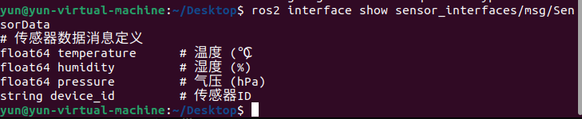
- 截图2：发布者和 echo 终端输出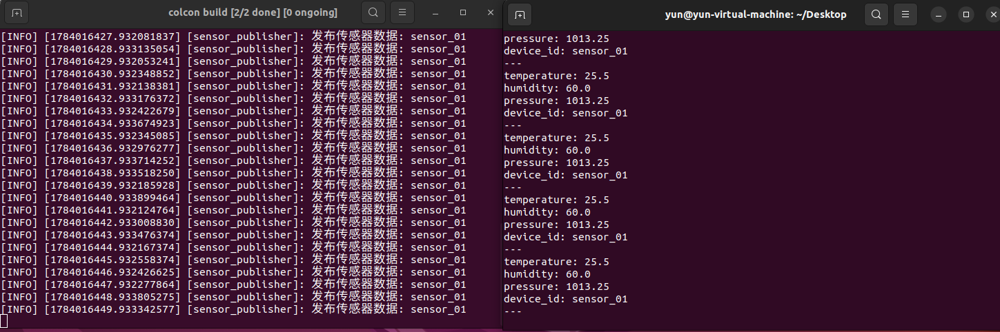
- 截图3：rqt_graph 中的自定义消息话题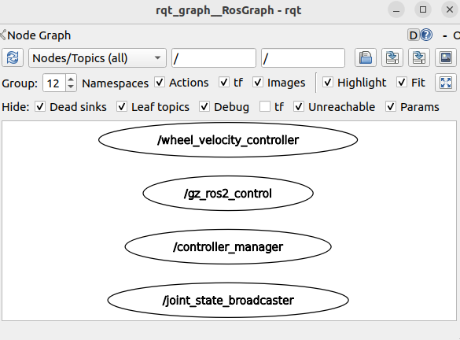

### 参考代码
> 完整参考代码位于 `lab_code/ch03_lab/sensor_interfaces/` 和 `lab_code/ch03_lab/sensor_pub/`

---

## 练习 3.3：QoS 策略对比实验（约 30 分钟）

### 目标
测试不同 QoS 配置下的通信行为差异。

### 步骤

**步骤1：编写 QoS 测试发布者**

在 `topic_demo/topic_demo/` 下创建 `qos_publisher.py`：

```python
#!/usr/bin/env python3
"""qos_publisher: 测试不同QoS配置的发布节点"""
import rclpy
from rclpy.node import Node
from rclpy.qos import QoSProfile, ReliabilityPolicy
from std_msgs.msg import String


class QosPublisher(Node):
    def __init__(self):
        super().__init__('qos_publisher')
        # 可靠传输发布者
        reliable_qos = QoSProfile(
            reliability=ReliabilityPolicy.RELIABLE,
            depth=10)
        self.reliable_pub = self.create_publisher(
            String, '/qos_reliable', reliable_qos)

        # 尽力传输发布者
        best_effort_qos = QoSProfile(
            reliability=ReliabilityPolicy.BEST_EFFORT,
            depth=10)
        self.best_effort_pub = self.create_publisher(
            String, '/qos_best_effort', best_effort_qos)

        # 定时器：每秒向两个话题各发布一次
        self.timer = self.create_timer(1.0, self.publish)
        self.count = 0

    def publish(self):
        self.count += 1
        rel_msg = String()
        rel_msg.data = f'RELIABLE: {self.count}'
        self.reliable_pub.publish(rel_msg)

        be_msg = String()
        be_msg.data = f'BEST_EFFORT: {self.count}'
        self.best_effort_pub.publish(be_msg)

        self.get_logger().info(f'发布 #{self.count}')


def main(args=None):
    rclpy.init(args=args)
    rclpy.spin(QosPublisher())
    rclpy.shutdown()


if __name__ == '__main__':
    main()
```

**步骤2：测试兼容性**

| 实验 | Publisher QoS | Subscriber QoS | 预期结果 |
|------|--------------|----------------|---------|
| A | RELIABLE | RELIABLE | ✓ 正常通信 |
| B | RELIABLE | BEST_EFFORT | ✓ 降级通信 |
| C | BEST_EFFORT | BEST_EFFORT | ✓ 正常通信 |
| D | BEST_EFFORT | RELIABLE | ✗ 无法通信 |

```bash
先在setup.py中添加
entry_points={
    'console_scripts': [
        'gps_pub = topic_demo.publisher:main',
        'gps_sub = topic_demo.subscriber:main',
        'qos_pub = topic_demo.qos_publisher:main',
    ],
},
然后编译
source /opt/ros/humble/setup.bash
cd ~/my_ros2_ws
colcon build --packages-select topic_demo --symlink-install
source ~/my_ros2_ws/install/setup.bash
# 终端1：启动发布者
ros2 run topic_demo qos_pub

# 终端2：分别测试不同 QoS 订阅
# 实验A：订阅 /qos_reliable，默认 RELIABLE
ros2 topic echo /qos_reliable

# 实验D：以 RELIABLE 订阅 BEST_EFFORT 话题 → 应失败
ros2 topic echo /qos_best_effort --qos-reliability reliable

# 实验C：以 BEST_EFFORT 订阅 BEST_EFFORT 话题 → 应成功
ros2 topic echo /qos_best_effort --qos-reliability best_effort
```

**步骤3：检查运行结果与图示一致**
- 截图1：实验 A（成功）：/qos_reliable 正常输出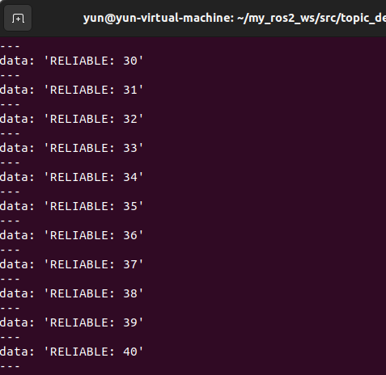
- 截图2：实验 D（失败）：ros2 topic echo 无输出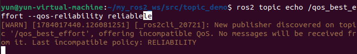
- 截图3：实验 C（成功）：/qos_best_effort 正常输出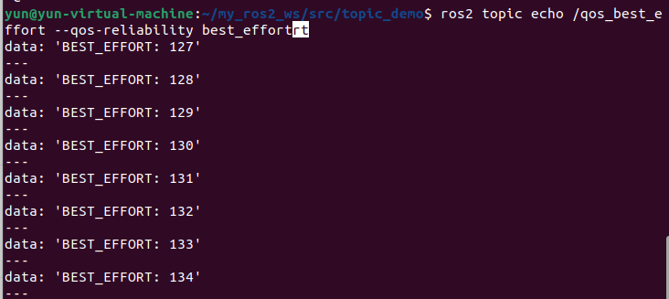

### 参考代码
> 完整参考代码位于 `lab_code/ch03_lab/topic_demo/topic_demo/qos_publisher.py`

---

## 本章实验总结

| 练习 | 核心技能 | 关键 API |
|------|---------|---------|
| 练习1 | Publisher + Subscriber 编程 | `create_publisher()`, `create_subscription()` |
| 练习2 | 自定义消息接口定义与使用 | `.msg` 定义, `rosidl_generate_interfaces()` |
| 练习3 | QoS 策略配置与兼容性测试 | `QoSProfile`, `ReliabilityPolicy` |

### 思考题

1. 如果 Publisher 发布频率 100Hz，Subscriber 处理能力仅 50Hz，使用哪种 QoS 策略处理丢包？KEEP_LAST（depth），队列满就丢掉就消息，保证最新数据，如果可以丢包，可以配合BEST_EFFORT
2. KEEP_LAST(1) 和 KEEP_ALL 的使用场景分别是什么？KEEP_LAST(1)保存最新的一条消息，用于/cmd_vel实时状态数据；KEEP_ALL保存所有消息，用于日志
3. BEST_EFFORT + TRANSIENT_LOCAL 组合能否正常通信？为什么？可以，BEST_EFFORT属于可靠性策略，TRANSIENT_LOCAL是持久性策略，是不同的QoS维度，不冲突

---

## 练习3.4：Twist 控制 XBot-U 走方形轨迹（约 15 分钟）

### 目标
发布 `geometry_msgs/Twist` 消息到 `/cmd_vel`，驱动仿真中的 XBot-U 机器人在 Gazebo 中走正方形轨迹。

### 步骤

**步骤1：启动课程仿真**
```bash
source ~/ros2_course_ws/install/setup.bash
ros2 launch robot_sim_demo_ros2 sim_bringup.launch.py
```

**步骤2：创建 twist_square.py**
```python
#!/usr/bin/env python3
"""twist_square: 发布 Twist 控制 XBot-U 走 1m×1m 正方形轨迹"""
import time
import rclpy
from rclpy.node import Node
from geometry_msgs.msg import Twist


class SquareDriver(Node):
    def __init__(self):
        super().__init__('square_driver')
        self.pub = self.create_publisher(Twist, '/cmd_vel', 10)
        self.get_logger().info('方形轨迹控制器就绪 — 5秒后开始')
        time.sleep(5)  # 等待仿真初始化
        self.drive_square()

    def move(self, linear, angular, duration):
        """发布指定速度并持续 duration 秒"""
        msg = Twist()
        msg.linear.x = linear
        msg.angular.z = angular
        end_time = time.time() + duration
        # 高频发布（10Hz）维持运动
        while time.time() < end_time and rclpy.ok():
            self.pub.publish(msg)
            time.sleep(0.1)  # ~10Hz

    def stop(self):
        self.move(0.0, 0.0, 0.5)

    def drive_square(self):
        """走正方形：直行→转90°→直行→转90°→..."""
        self.get_logger().info('开始走正方形轨迹...')
        for i in range(4):
            # 直行 1 米（速度 0.2m/s × 5秒）
            self.get_logger().info(f'边 {i+1}: 直行')
            self.move(0.2, 0.0, 5.0)
            # 原地左转 90°（角速度 1.57rad/s × 1秒 ≈ π/2）
            self.get_logger().info(f'边 {i+1}: 左转90°')
            self.move(0.0, 1.57, 1.0)
        self.stop()
        self.get_logger().info('正方形轨迹完成！')


def main(args=None):
    rclpy.init(args=args)
    SquareDriver()
    rclpy.shutdown()


if __name__ == '__main__':
    main()
```

**步骤3：运行测试**
```bash
# 终端1：仿真运行中
# 终端2：启动方形轨迹控制器
source /opt/ros/humble/setup.bash
source ~/ros2_course_ws/install/setup.bash
source ~/my_ros2_ws/install/setup.bash
ros2 run topic_demo square_driver  # 需添加 entry_points
```

**✓ 验证**：
- 截图1：Gazebo 中 XBot-U 按正方形轨迹运动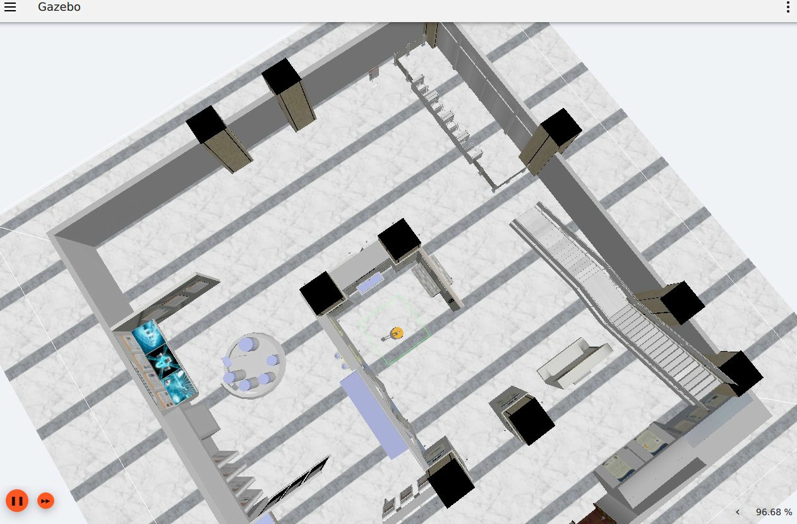
- 截图2：RViz 中 /odom 轨迹显示正方形图案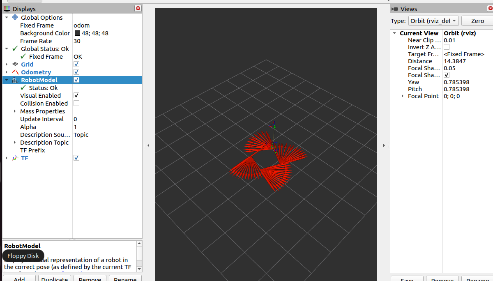
- 截图3：终端日志输出四边一角的执行进度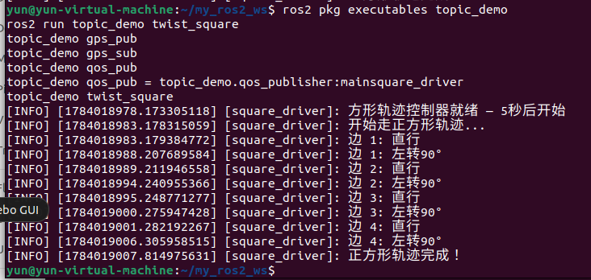

### 参考代码
> 完整参考代码位于 `lab_code/ch03_lab/topic_demo/topic_demo/square_driver.py`

### 思考题
1. 如何精确控制机器人走 2m×2m 的正方形？调整哪些参数？用直线运动+原地旋转90°循环四次。要调整线速度、角速度、运动时间、控制频率
2. 如果需要在正方形路径上添加圆角过渡，如何实现？在拐角处加入圆弧轨迹。在接近拐角时同时设置线速度和角速度，使机器人沿圆弧过渡。

## 实际运行证据

真实运行的话题发布、订阅、自定义消息接口和消息输出：

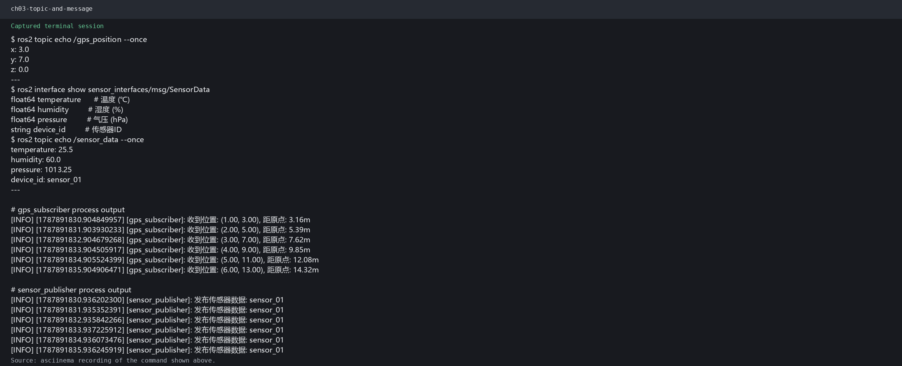

原始录制：[ch03_topics.cast](images/runtime/ch03_topics.cast)。完整证据索引见[实际运行证据](runtime_evidence.md)。
