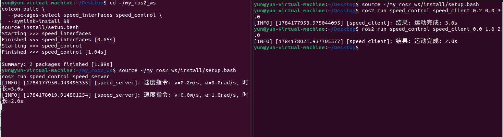
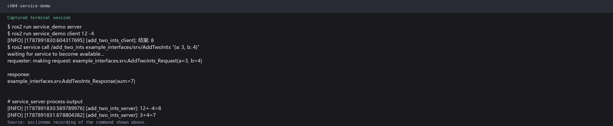

# 第4章 实验指导书：服务通信编程

> **实验课时**：2 课时（90 分钟） | XBot-U Gazebo 仿真

---

## 实验目标
1. 编写 Service Server 和 Client 节点
2. 定义自定义 .srv 接口
3. 处理服务超时和重试

---

## 练习 4.1：AddTwoInts 服务（约 30 分钟）

### 步骤

# 1. 创建包
```bash
cd ~/my_ros2_ws/src
ros2 pkg create service_demo --build-type ament_python \
  --dependencies rclpy example_interfaces
```
# 2. 编写 server.py 和 client.py（参考代码见 lab_code/ch04_lab/）

# 3.修改 ~/my_ros2_ws/src/service_demo/setup.py
```python
entry_points={
    'console_scripts': [
        'server = service_demo.server:main',
        'client = service_demo.client:main',
    ],
},
```
# 4.编译并运行
```bash
colcon build --packages-select service_demo
source install/setup.bash
ros2 run service_demo server    # 终端1
ros2 run service_demo client 5 10  # 终端2
```


**参考代码**：`lab_code/ch04_lab/service_demo/`

---

## 练习 4.2：自定义 .srv 接口（约 30 分钟）

定义 `WeatherQuery.srv`（城市 string → 温度 float64 + 天气 string），创建 Server 模拟天气查询。
1. 创建两个包
```bash
cd ~/my_ros2_ws/src
ros2 pkg create weather_interfaces --build-type ament_cmake
ros2 pkg create weather_srv --build-type ament_python \
  --dependencies rclpy weather_interfaces
mkdir -p weather_interfaces/srv
```

创建 weather_interfaces/srv/WeatherQuery.srv：
string city
---
float64 temperature
string weather

2. 配置接口包
在 weather_interfaces/CMakeLists.txt 的 ament_package() 前添加：

find_package(rosidl_default_generators REQUIRED)
rosidl_generate_interfaces(${PROJECT_NAME}
  "srv/WeatherQuery.srv"
)
ament_export_dependencies(rosidl_default_runtime)

在 weather_interfaces/package.xml 的 <export> 前添加：

<build_depend>rosidl_default_generators</build_depend>
<exec_depend>rosidl_default_runtime</exec_depend>
<member_of_group>rosidl_interface_packages</member_of_group>

3. 编写 Server
创建 weather_srv/weather_srv/weather_server.py：
```bash
import rclpy
from rclpy.node import Node
from weather_interfaces.srv import WeatherQuery


class WeatherServer(Node):
    def __init__(self):
        super().__init__('weather_server')
        self.service = self.create_service(
            WeatherQuery, 'weather_query', self.query_weather)

    def query_weather(self, request, response):
        data = {
            'beijing': (26.5, 'Sunny'),
            'shanghai': (24.0, 'Cloudy'),
            'shenzhen': (30.0, 'Rainy'),
        }
        response.temperature, response.weather = data.get(
            request.city.strip().lower(), (0.0, 'Unknown city'))
        self.get_logger().info(
            f'{request.city}: {response.temperature}, {response.weather}')
        return response


def main(args=None):
    rclpy.init(args=args)
    node = WeatherServer()
    rclpy.spin(node)
    node.destroy_node()
    rclpy.shutdown()
```
4. 注册可执行程序
修改 weather_srv/setup.py
```python
entry_points={
    'console_scripts': [
        'weather_server = weather_srv.weather_server:main',
    ],
},
```
5. 编译和检查接口
```bash
cd ~/my_ros2_ws
colcon build --packages-select weather_interfaces weather_srv --symlink-install
source install/setup.bash
ros2 interface show weather_interfaces/srv/WeatherQuery
```
6. 运行测试
终端 1：
```bash
source ~/my_ros2_ws/install/setup.bash
ros2 run weather_srv weather_server
```
终端 2：
```bash
source ~/my_ros2_ws/install/setup.bash
ros2 service call /weather_query \
  weather_interfaces/srv/WeatherQuery "{city: 'Beijing'}"
  ```

 

**参考代码**：`lab_code/ch04_lab/weather_interfaces/` + `lab_code/ch04_lab/weather_srv/`

---

## 练习 4.3：超时与重试（约 30 分钟）

1. Server 设置 3 秒处理延迟
2. Client 设置 1 秒超时 → 观察超时行为
3. 添加重试机制（最多3次，间隔2秒）

1. 修改 Server
编辑：
```bash
nano ~/my_ros2_ws/src/service_demo/service_demo/server.py
```
增加导入：
```python
import time
将 handle_add() 改为：
def handle_add(self, request, response):
    self.get_logger().info(
        f'收到请求 {request.a} + {request.b}，延迟 3 秒处理')

    time.sleep(3.0)

    response.sum = request.a + request.b
    self.get_logger().info(f'处理完成，结果为 {response.sum}')
    return response
 ```
2. 修改 Client
编辑：
```bash
nano ~/my_ros2_ws/src/service_demo/service_demo/client.py
```
增加导入：
import time
将 call() 方法完整替换为：
```python
def call(self, a, b, timeout_sec=1.0, max_retries=3,
         retry_interval_sec=2.0):
    if not self.client.wait_for_service(timeout_sec=2.0):
        self.get_logger().error('服务不可用，请先启动 Server')
        return None

    for attempt in range(1, max_retries + 1):
        request = AddTwoInts.Request()
        request.a = a
        request.b = b

        self.get_logger().info(
            f'第 {attempt}/{max_retries} 次调用服务')

        future = self.client.call_async(request)
        rclpy.spin_until_future_complete(
            self, future, timeout_sec=timeout_sec)

        if future.done():
            response = future.result()
            if response is not None:
                return response.sum

        self.get_logger().warning(
            f'第 {attempt} 次请求超过 {timeout_sec} 秒，调用超时')

        if attempt < max_retries:
            self.get_logger().info(
                f'{retry_interval_sec} 秒后重试')
            time.sleep(retry_interval_sec)

    return None
    ```
3. 编译

```bash
cd ~/my_ros2_ws
colcon build --packages-select service_demo --symlink-install &&
source install/setup.bash
```

终端 1：
```bash
source ~/my_ros2_ws/install/setup.bash
ros2 run service_demo server
```
终端 2：
```bash
source ~/my_ros2_ws/install/setup.bash
ros2 run service_demo client 5 10
```

### 思考题
1. 服务通信适合什么场景？不适合什么场景？服务通信适合低频、短时间、需要明确响应结果的请求操作，例如参数设置、状态查询、启动停止控制。不适合高频数据传输和长时间任务，后者应使用 Topic 或 Action。
2. 如何保证多个 Client 同时调用服务时的安全性？可以通过 Callback Group 控制并发方式、mutex 保证共享数据访问安全、Executor 管理线程调度，以及服务端状态检查避免重复调用

---

## 练习 4.4：Service 控制机器人运动（约 15 分钟）

### 目标
创建自定义 `SpeedControl.srv` 服务，设置机器人速度（linear, angular）和运行时间（duration），Service 调用后驱动仿真中的 XBot-U 运动。

### 步骤

**步骤1：定义 SpeedControl.srv**
```bash
source /opt/ros/humble/setup.bash
cd ~/my_ros2_ws/src

ros2 pkg create speed_interfaces --build-type ament_cmake
ros2 pkg create speed_control --build-type ament_python \
  --dependencies rclpy geometry_msgs speed_interfaces

mkdir -p speed_interfaces/srv
```
```python
# speed_interfaces/srv/SpeedControl.srv
float64 linear_x         # 线速度 (m/s)
float64 angular_z        # 角速度 (rad/s)
float64 duration         # 运行时长 (秒)
---
bool success             # 执行成功
string message           # 结果消息
```

**步骤2：编写 Service Server**
```python
#!/usr/bin/env python3
"""speed_server: 速度控制服务 — 设置机器人速度和运行时长"""
import time
import rclpy
from rclpy.node import Node
from geometry_msgs.msg import Twist
from speed_interfaces.srv import SpeedControl


class SpeedServer(Node):
    def __init__(self):
        super().__init__('speed_server')
        self.pub = self.create_publisher(Twist, '/cmd_vel', 10)
        self.srv = self.create_service(
            SpeedControl, 'speed_control', self.handle_speed)

    def handle_speed(self, request, response):
        self.get_logger().info(
            f'速度指令: v={request.linear_x}m/s, '
            f'ω={request.angular_z}rad/s, 时长={request.duration}s')
        # 发布速度指令
        msg = Twist()
        msg.linear.x = request.linear_x
        msg.angular.z = request.angular_z
        start = time.time()
        while time.time() - start < request.duration and rclpy.ok():
            self.pub.publish(msg)
            time.sleep(0.1)
        # 停止
        msg.linear.x = 0.0
        msg.angular.z = 0.0
        self.pub.publish(msg)
        response.success = True
        response.message = f'运动完成: {request.duration}s'
        return response


def main(args=None):
    rclpy.init(args=args)
    rclpy.spin(SpeedServer())
    rclpy.shutdown()


if __name__ == '__main__':
    main()
```

**步骤3：编写 Service Client**
```python
#!/usr/bin/env python3
"""speed_client: 调用速度控制服务"""
import sys
import rclpy
from rclpy.node import Node
from speed_interfaces.srv import SpeedControl


class SpeedClient(Node):
    def __init__(self):
        super().__init__('speed_client')
        self.client = self.create_client(SpeedControl, 'speed_control')

    def call(self, linear, angular, duration):
        req = SpeedControl.Request()
        req.linear_x = linear
        req.angular_z = angular
        req.duration = duration
        self.client.wait_for_service()
        future = self.client.call_async(req)
        rclpy.spin_until_future_complete(self, future)
        return future.result()


def main(args=None):
    rclpy.init(args=args)
    client = SpeedClient()
    v = float(sys.argv[1]) if len(sys.argv) > 1 else 0.2
    w = float(sys.argv[2]) if len(sys.argv) > 2 else 0.0
    t = float(sys.argv[3]) if len(sys.argv) > 3 else 3.0
    result = client.call(v, w, t)
    client.get_logger().info(f'结果: {result.message}')
    rclpy.shutdown()

if __name__ == '__main__':
    main()
```
**步骤4：完善配置**

·在 speed_interfaces/CMakeLists.txt 的 ament_package() 前加入：
```Cmake
find_package(rosidl_default_generators REQUIRED)
rosidl_generate_interfaces(${PROJECT_NAME}
  "srv/SpeedControl.srv"
)
ament_export_dependencies(rosidl_default_runtime)
```
·在 speed_interfaces/package.xml 的 <export> 前加入：
<build_depend>rosidl_default_generators</build_depend>
<exec_depend>rosidl_default_runtime</exec_depend>
<member_of_group>rosidl_interface_packages</member_of_group>
·修改 speed_control/setup.py 的入口配置：
```python
entry_points={
    'console_scripts': [
        'speed_server = speed_control.speed_server:main',
        'speed_client = speed_control.speed_client:main',
    ],
},
```
**步骤4：运行测试**
```bash

# 编译
cd ~/my_ros2_ws
colcon build \
  --packages-select speed_interfaces speed_control \
  --symlink-install &&
source install/setup.bash
# 终端1：启动仿真
source ~/my_ros2_ws/install/setup.bash
ros2 launch robot_sim_demo_ros2 sim_bringup.launch.py
# 终端2：启动速度服务
source ~/my_ros2_ws/install/setup.bash
ros2 run speed_control speed_server
# 终端3：调用服务（前进 0.2m/s 持续 3秒）
source ~/my_ros2_ws/install/setup.bash
ros2 run speed_control speed_client 0.2 0.0 3.0    

# 旋转测试（角速度 1.0rad/s 持续 2秒）
ros2 run speed_control speed_client 0.0 1.0 2.0

```

**✓ 验证**：Gazebo 中 XBot-U 按指定速度和时长运动，结束后自动停止。

### 参考代码
> 完整参考代码位于 `lab_code/ch04_lab/speed_control/`

### 思考题
1. 服务处理函数中直接 `time.sleep()` 是否会影响其他服务请求？如何改进？服务回调中直接使用 time.sleep() 会阻塞当前 Executor 线程，在单线程 Executor 下会影响其他服务请求和消息处理。改进方法包括使用 Action 处理长时间任务、采用异步线程、Timer 或 MultiThreadedExecutor，并合理配置 Callback Group。

2. 如果同时在 Server 中处理话题发布和服务请求，两者如何协调？Server 同时处理 Topic 发布和 Service 请求时，需要通过 Executor 进行调度。简单场景可以使用单线程 Executor 保证安全；需要并发时使用 MultiThreadedExecutor，并结合 Callback Group 和 mutex 保护共享数据，避免服务请求影响实时话题发布。

## 实际运行证据

真实运行的 AddTwoInts Server、Client 和服务调用结果：



原始录制：[ch04_service.cast](images/runtime/ch04_service.cast)。完整证据索引见[实际运行证据](runtime_evidence.md)。
