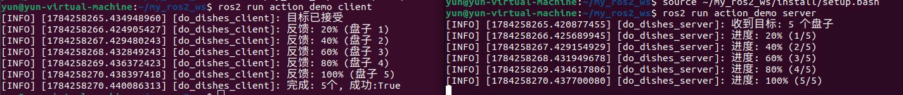
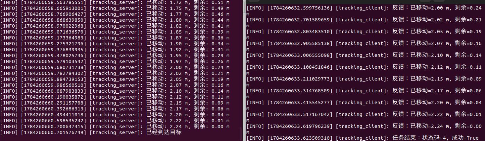
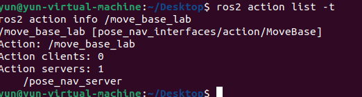
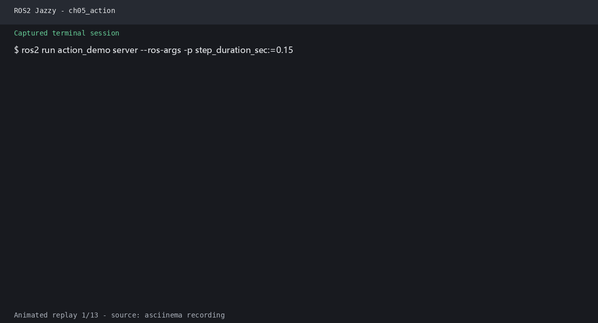

# 第5章 实验指导书：动作通信编程

## 当前仓库仿真验证：Action 反馈与底盘仿真并行检查

### 实验目标

在机器人仿真背景下运行 `DoDishes` Action，观察目标接受、反馈、结果和动作查询，理解长期任务与底盘 Topic 的区别。

### 运行步骤

```bash
source /opt/ros/jazzy/setup.bash
source install/setup.bash
ros2 launch robot_sim_demo gazebo2.launch.py \
  gui:=false rviz:=false drive:=false
```

```bash
# 终端 2
source install/setup.bash
ros2 run action_demo_cpp dishes_server
```

```bash
# 终端 3
source install/setup.bash
ros2 run action_demo_cpp dishes_client
ros2 action info /dishes
```

### 观察与验收

客户端应显示 20% 至 100% 的反馈和最终清洗数量；Gazebo 仍可独立提供 `/odom`、`/scan`。源码：`src/action_demo_cpp/`、`src/action_demo_interfaces/`。

> **实验课时**：2 课时（90 分钟） | XBot-U Gazebo 仿真

---

## 实验目标
1. 编写 Action Server 和 Client
2. 处理进度反馈
3. 实现取消和抢占

---

## 练习 3.1：DoDishes 动作（约 30 分钟）

使用现有的 `action_demo_interfaces` 包，编写洗碗任务 Action Server/Client。
# 创建接口包
```bash
ros2 pkg create --build-type ament_cmake \
  --license Apache-2.0 action_demo_interfaces
mkdir -p action_demo_interfaces/action
nano action_demo_interfaces/action/DoDishes.action
```
粘贴：
uint32 total_dishes
---
uint32 cleaned_dishes
bool success
---
float32 progress
uint32 current_dish
# 配置Cmake
```CMake
cmake_minimum_required(VERSION 3.8)
project(action_demo_interfaces)

find_package(ament_cmake REQUIRED)
find_package(rosidl_default_generators REQUIRED)

rosidl_generate_interfaces(${PROJECT_NAME}
  "action/DoDishes.action"
)

ament_export_dependencies(rosidl_default_runtime)
ament_package()
```
# 配置action_demo_interfaces/package.xml
<?xml version="1.0"?>
<package format="3">
  <name>action_demo_interfaces</name>
  <version>0.1.0</version>
  <description>DoDishes Action interface</description>
  <maintainer email="student@example.com">Student</maintainer>
  <license>Apache-2.0</license>

  <buildtool_depend>ament_cmake</buildtool_depend>
  <build_depend>rosidl_default_generators</build_depend>
  <exec_depend>rosidl_default_runtime</exec_depend>

  <member_of_group>rosidl_interface_packages</member_of_group>

  <export>
    <build_type>ament_cmake</build_type>
  </export>
</package>

# 编译
```bash
colcon build --packages-select action_demo_interfaces
source install/setup.bash
```
# 创建action_demo
**参考代码**：`lab_code/ch05_lab/action_demo/`
修改dishes_server.py
```python
import asyncio 改为 import time
async def execute(self, goal_handle): 改为 def execute(self, goal_handle):
await asyncio.sleep(1.0) 改为 time.sleep(1.0)
```
# 编译
```bash
cd ~/my_ros2_ws
source /opt/ros/humble/setup.bash
colcon build --symlink-install \
  --packages-select action_demo_interfaces action_demo
source ~/my_ros2_ws/install/setup.bash
ros2 pkg prefix action_demo_interfaces
ros2 interface show action_demo_interfaces/action/DoDishes
```
# 运行
终端一
```bash
source /opt/ros/humble/setup.bash
source ~/my_ros2_ws/install/setup.bash
ros2 run action_demo server
```
终端二
```bash
source /opt/ros/humble/setup.bash
source ~/my_ros2_ws/install/setup.bash
ros2 run action_demo client
```



## 练习 3.2：自定义 Tracking 动作（约 30 分钟）

定义 `Tracking.action`（Goal: 目标坐标 Point；Result: 成功标志 bool；Feedback: 当前位置 float64 + 距离 float64），模拟 XBot-U 的路径跟踪。
# 创建接口包：
```bash
ros2 pkg create --build-type ament_cmake \
  --license Apache-2.0 tracking_interfaces
mkdir -p tracking_interfaces/action
# 创建 Tracking.action
nano tracking_interfaces/action/Tracking.action
```
geometry_msgs/Point target
---
bool success
---
float64 current_position
float64 distance
# 编写 CMakeLists.txt
```bash
nano tracking_interfaces/CMakeLists.txt
```
```CMake
cmake_minimum_required(VERSION 3.8)
project(tracking_interfaces)

find_package(ament_cmake REQUIRED)
find_package(geometry_msgs REQUIRED)
find_package(rosidl_default_generators REQUIRED)

rosidl_generate_interfaces(${PROJECT_NAME}
  "action/Tracking.action"
  DEPENDENCIES geometry_msgs
)

ament_export_dependencies(rosidl_default_runtime)
ament_package()
```
3. 编写 package.xml
```bash
nano tracking_interfaces/package.xml
```
<?xml version="1.0"?>
<package format="3">
  <name>tracking_interfaces</name>
  <version>0.1.0</version>
  <description>Tracking Action interface</description>
  <maintainer email="student@example.com">Student</maintainer>
  <license>Apache-2.0</license>

  <buildtool_depend>ament_cmake</buildtool_depend>
  <build_depend>rosidl_default_generators</build_depend>

  <depend>geometry_msgs</depend>

  <exec_depend>rosidl_default_runtime</exec_depend>

  <member_of_group>rosidl_interface_packages</member_of_group>

  <export>
    <build_type>ament_cmake</build_type>
  </export>
</package>

# 编译
```bash
source /opt/ros/humble/setup.bash
colcon build --packages-select tracking_interfaces
source install/setup.bash
```
# 创建 Tracking Python 包
```bash
cd ~/my_ros2_ws/src
#创建包：
ros2 pkg create tracking_server --build-type ament_python --license Apache-2.0 --dependencies rclpy tracking_interfaces

nano ~/ros2_course_ws/src/tracking_server/tracking_server/server.py
```
```python
"""Tracking Action Server：模拟机器人沿直线移动。"""

import math
import time

import rclpy
from rclpy.action import ActionServer, GoalResponse
from rclpy.node import Node

from tracking_interfaces.action import Tracking


class TrackingServer(Node):

    def __init__(self):
        super().__init__('tracking_server')

        self.action_server = ActionServer(
            self,
            Tracking,
            'tracking',
            execute_callback=self.execute_callback,
            goal_callback=self.goal_callback,
        )

        self.get_logger().info('Tracking Action Server 已启动')

    def goal_callback(self, goal_request):
        target = goal_request.target

        self.get_logger().info(
            f'收到目标: x={target.x:.2f}, '
            f'y={target.y:.2f}, z={target.z:.2f}'
        )

        values = (target.x, target.y, target.z)

        if not all(math.isfinite(value) for value in values):
            self.get_logger().warning('目标坐标无效，拒绝目标')
            return GoalResponse.REJECT

        return GoalResponse.ACCEPT

    def execute_callback(self, goal_handle):
        target = goal_handle.request.target

        total_distance = math.sqrt(
            target.x ** 2 +
            target.y ** 2 +
            target.z ** 2
        )

        current_position = 0.0
        speed = 0.25
        period = 0.1

        feedback = Tracking.Feedback()

        while current_position < total_distance:
            time.sleep(period)

            current_position += speed * period
            current_position = min(current_position, total_distance)

            feedback.current_position = current_position
            feedback.distance = total_distance - current_position

            goal_handle.publish_feedback(feedback)

            self.get_logger().info(
                f'已移动: {feedback.current_position:.2f} m, '
                f'剩余: {feedback.distance:.2f} m'
            )

        goal_handle.succeed()

        result = Tracking.Result()
        result.success = True

        self.get_logger().info('已经到达目标')
        return result


def main(args=None):
    rclpy.init(args=args)

    node = TrackingServer()

    try:
        rclpy.spin(node)
    except KeyboardInterrupt:
        pass
    finally:
        node.destroy_node()

        if rclpy.ok():
            rclpy.shutdown()


if __name__ == '__main__':
    main()
```
```bash
nano ~/my_ros2_ws/src/tracking_server/tracking_server/client.py
```
```python
"""Tracking Action Client：发送目标坐标并接收反馈。"""

import sys

import rclpy
from rclpy.action import ActionClient
from rclpy.node import Node

from tracking_interfaces.action import Tracking


class TrackingClient(Node):

    def __init__(self):
        super().__init__('tracking_client')

        self.action_client = ActionClient(
            self,
            Tracking,
            'tracking'
        )

    def send_goal(self, x, y, z):
        self.get_logger().info('等待 Tracking Server...')

        if not self.action_client.wait_for_server(timeout_sec=10.0):
            self.get_logger().error('没有找到 Tracking Server')
            rclpy.shutdown()
            return

        goal = Tracking.Goal()
        goal.target.x = x
        goal.target.y = y
        goal.target.z = z

        self.get_logger().info(
            f'发送目标: ({x:.2f}, {y:.2f}, {z:.2f})'
        )

        future = self.action_client.send_goal_async(
            goal,
            feedback_callback=self.feedback_callback
        )

        future.add_done_callback(self.goal_response_callback)

    def goal_response_callback(self, future):
        goal_handle = future.result()

        if not goal_handle.accepted:
            self.get_logger().warning('目标被 Server 拒绝')
            rclpy.shutdown()
            return

        self.get_logger().info('目标已接受')

        result_future = goal_handle.get_result_async()
        result_future.add_done_callback(self.result_callback)

    def feedback_callback(self, feedback_message):
        feedback = feedback_message.feedback

        self.get_logger().info(
            f'反馈：已移动={feedback.current_position:.2f} m, '
            f'剩余={feedback.distance:.2f} m'
        )

    def result_callback(self, future):
        response = future.result()
        result = response.result

        self.get_logger().info(
            f'任务结束：状态码={response.status}, '
            f'成功={result.success}'
        )

        rclpy.shutdown()


def main(args=None):
    if len(sys.argv) not in (3, 4):
        print(
            '用法: ros2 run tracking_server client '
            '<x> <y> [z]'
        )
        print(
            '示例: ros2 run tracking_server client '
            '2.0 1.0'
        )
        return

    try:
        x = float(sys.argv[1])
        y = float(sys.argv[2])
        z = float(sys.argv[3]) if len(sys.argv) == 4 else 0.0
    except ValueError:
        print('错误：x、y、z 必须是数字')
        return

    rclpy.init(args=args)

    node = TrackingClient()
    node.send_goal(x, y, z)

    try:
        rclpy.spin(node)
    except KeyboardInterrupt:
        pass
    finally:
        node.destroy_node()

        if rclpy.ok():
            rclpy.shutdown()


if __name__ == '__main__':
    main()
```
# 修改 setup.py
```bash
nano ~/my_ros2_ws/src/tracking_server/setup.py
```
```python
from setuptools import find_packages, setup

package_name = 'tracking_server'

setup(
    name=package_name,
    version='0.1.0',
    packages=find_packages(exclude=['test']),
    data_files=[
        (
            'share/ament_index/resource_index/packages',
            ['resource/' + package_name]
        ),
        (
            'share/' + package_name,
            ['package.xml']
        ),
    ],
    install_requires=['setuptools'],
    zip_safe=True,
    maintainer='Student',
    maintainer_email='student@example.com',
    description='Tracking Action Server and Client',
    license='Apache-2.0',
    entry_points={
        'console_scripts': [
            'server = tracking_server.server:main',
            'client = tracking_server.client:main',
        ],
    },
)
```
# 修改tracking_server/package.xml
```bash
nano ~/ros2_course_ws/src/tracking_server/package.xml
```

<?xml version="1.0"?>
<package format="3">
  <name>tracking_server</name>
  <version>0.1.0</version>
  <description>Tracking Action Server and Client</description>
  <maintainer email="student@example.com">Student</maintainer>
  <license>Apache-2.0</license>

  <buildtool_depend>ament_python</buildtool_depend>

  <exec_depend>rclpy</exec_depend>
  <exec_depend>tracking_interfaces</exec_depend>

  <export>
    <build_type>ament_python</build_type>
  </export>
</package>

# 编译
```bash
source /opt/ros/humble/setup.bash
source install/setup.bash
colcon build --symlink-install \
  --packages-select tracking_interfaces tracking_server
source install/setup.bash
ros2 pkg executables tracking_server
```
应显示：
tracking_server client
tracking_server server
# 运行
终端 1：
```bash
source /opt/ros/humble/setup.bash
source ~/my_ros2_ws/install/setup.bash
ros2 run tracking_server server
```
终端 2：
```bash
source /opt/ros/humble/setup.bash
source ~/ros2_course_ws/install/setup.bash
ros2 run tracking_server client 2.0 1.0
```
**参考代码**：`lab_code/ch05_lab/tracking_interfaces/` + `lab_code/ch05_lab/tracking_server/`



---
## 改成用gazebo仿真
保留Tracking.action和Client，改Server
```bash
cd ~/my_ros2_ws
colcon build --symlink-install \
  --packages-select tracking_interfaces tracking_server

nano ~/my_ros2_ws/src/tracking_server/package.xml
```
<exec_depend>geometry_msgs</exec_depend>
<exec_depend>nav_msgs</exec_depend>

```bash
cd ~/my_ros2_ws
source /opt/ros/humble/setup.bash
source ~/ros2_ws/install/setup.bash
colcon build --symlink-install \
  --packages-select tracking_interfaces tracking_server
source ~/my_ros2_ws/install/setup.bash

#终端 1 启动仿真：
source /opt/ros/humble/setup.bash
source ~/ros2_ws/install/setup.bash

LIBGL_DRI3_DISABLE=1 QT_QPA_PLATFORM=xcb \
ros2 launch robot_sim_demo_ros2 sim_bringup.launch.py \
  use_gazebo:=true \
  gz_headless:=true \
  use_rviz:=true \
  enable_fake_laser:=false \
  world:=~/ros2_ws/install/robot_sim_demo_ros2/share/robot_sim_demo_ros2/worlds/ground_test.sdf

#终端 2 启动 Gazebo Tracking Server：
source /opt/ros/humble/setup.bash
source ~/ros2_ws/install/setup.bash
source ~/my_ros2_ws/install/setup.bash
ros2 run tracking_server server_gazebo

#终端 3 发送目标：
source /opt/ros/humble/setup.bash
source ~/ros2_ws/install/setup.bash
source ~/my_ros2_ws/install/setup.bash
ros2 run tracking_server client 2.0 1.0
```
## 练习 3.3：取消与抢占机制（约 30 分钟）

1. Client 发送目标后 5 秒自动取消
2. Server 检测 `is_cancel_requested` 并执行清理
3. 抢占：发送新目标时拒绝或覆盖旧目标
# 创建新包
```bash
source /opt/ros/humble/setup.bash
cd ~/ros2_ws/src

ros2 pkg create --build-type ament_cmake \
    --license Apache-2.0 dishes_action_interfaces

ros2 pkg create --build-type ament_python \
    --license Apache-2.0 dishes_action_lab \
    --dependencies rclpy dishes_action_interfaces

mkdir -p dishes_action_interfaces/action
 ```
# 修改接口
```bash
nano ~/ros2_ws/src/dishes_action_interfaces/action/DoDishes.action
```
uint32 total_dishes
---
uint32 cleaned_dishes
bool success
---
float32 progress
uint32 current_dish
# 接口CMakeList
```bash
nano ~/ros2_ws/src/dishes_action_interfaces/CMakeLists.txt
```
cmake_minimum_required(VERSION 3.8)
project(dishes_action_interfaces)

find_package(ament_cmake REQUIRED)
find_package(rosidl_default_generators REQUIRED)

rosidl_generate_interfaces(${PROJECT_NAME}
  "action/DoDishes.action"
)

ament_export_dependencies(rosidl_default_runtime)
ament_package()
# 接口 package.xml
```bash
nano ~/ros2_ws/src/dishes_action_interfaces/package.xml
```
<?xml version="1.0"?>
<package format="3">
  <name>dishes_action_interfaces</name>
  <version>0.1.0</version>
  <description>DoDishes Action interface</description>
  <maintainer email="student@example.com">Student</maintainer>
  <license>Apache-2.0</license>

  <buildtool_depend>ament_cmake</buildtool_depend>

  <build_depend>rosidl_default_generators</build_depend>
  <exec_depend>rosidl_default_runtime</exec_depend>

  <member_of_group>rosidl_interface_packages</member_of_group>

  <export>
    <build_type>ament_cmake</build_type>
  </export>
</package>

# 创建python文件
```bash
nano ~/ros2_ws/src/dishes_action_lab/dishes_action_lab/dishes_server.py
```
```python
"""DoDishes Action Server with cancellation and goal rejection."""

import threading
import time

import rclpy
from rclpy.action import ActionServer, CancelResponse, GoalResponse
from rclpy.callback_groups import ReentrantCallbackGroup
from rclpy.executors import MultiThreadedExecutor
from rclpy.node import Node

from dishes_action_interfaces.action import DoDishes


class DishesActionServer(Node):

    def __init__(self):
        super().__init__('dishes_action_server')

        self._goal_lock = threading.Lock()
        self._goal_active = False
        self._callback_group = ReentrantCallbackGroup()

        self._action_server = ActionServer(
            self,
            DoDishes,
            'do_dishes_lab',
            execute_callback=self.execute_callback,
            goal_callback=self.goal_callback,
            cancel_callback=self.cancel_callback,
            callback_group=self._callback_group,
        )

        self.get_logger().info(
            'DoDishes Action Server 已启动，等待目标'
        )

    def goal_callback(self, goal_request):
        total = goal_request.total_dishes

        self.get_logger().info(
            f'收到目标：清洗 {total} 个盘子'
        )

        if total == 0:
            self.get_logger().warning(
                '盘子数量不能为 0，拒绝目标'
            )
            return GoalResponse.REJECT

        with self._goal_lock:
            if self._goal_active:
                self.get_logger().warning(
                    '已有任务正在执行，拒绝新目标'
                )
                return GoalResponse.REJECT

            self._goal_active = True

        self.get_logger().info('接受目标')
        return GoalResponse.ACCEPT

    def cancel_callback(self, goal_handle):
        self.get_logger().info('收到 Client 的取消请求')
        return CancelResponse.ACCEPT

    def execute_callback(self, goal_handle):
        total = goal_handle.request.total_dishes
        cleaned = 0
        feedback = DoDishes.Feedback()

        self.get_logger().info(
            f'开始执行洗碗任务，共 {total} 个盘子'
        )

        try:
            for current_dish in range(1, total + 1):
                # 模拟每个盘子清洗 1 秒，每 0.1 秒检查一次取消。
                for _ in range(10):
                    time.sleep(0.1)

                    if goal_handle.is_cancel_requested:
                        break

                if goal_handle.is_cancel_requested:
                    break

                cleaned = current_dish

                feedback.progress = current_dish / total
                feedback.current_dish = current_dish
                goal_handle.publish_feedback(feedback)

                self.get_logger().info(
                    f'进度: {feedback.progress:.0%} '
                    f'({current_dish}/{total})'
                )

            if goal_handle.is_cancel_requested:
                self.get_logger().warning(
                    f'执行清理：停止洗碗，已完成 {cleaned} 个'
                )

                goal_handle.canceled()

                result = DoDishes.Result()
                result.cleaned_dishes = cleaned
                result.success = False

                self.get_logger().info('任务已取消')
                return result

            goal_handle.succeed()

            result = DoDishes.Result()
            result.cleaned_dishes = cleaned
            result.success = True

            self.get_logger().info(
                f'任务成功，共清洗 {cleaned} 个盘子'
            )
            return result

        finally:
            with self._goal_lock:
                self._goal_active = False

            self.get_logger().info(
                '当前任务结束，可以接收下一个目标'
            )


def main(args=None):
    rclpy.init(args=args)

    node = DishesActionServer()
    executor = MultiThreadedExecutor(num_threads=2)
    executor.add_node(node)

    try:
        executor.spin()
    except KeyboardInterrupt:
        pass
    finally:
        executor.shutdown()
        node.destroy_node()

        if rclpy.ok():
            rclpy.shutdown()


if __name__ == '__main__':
    main()
```
```bash
nano ~/ros2_ws/src/dishes_action_lab/dishes_action_lab/dishes_client.py
```
```python
"""DoDishes Client that automatically cancels after five seconds."""

import sys

import rclpy
from rclpy.action import ActionClient
from rclpy.node import Node

from dishes_action_interfaces.action import DoDishes


class DishesActionClient(Node):

    def __init__(self):
        super().__init__('dishes_action_client')

        self._action_client = ActionClient(
            self,
            DoDishes,
            'do_dishes_lab',
        )

        self._goal_handle = None
        self._cancel_timer = None
        self._finished = False

    def send_goal(self, total_dishes):
        self.get_logger().info(
            '等待 DoDishes Action Server...'
        )

        if not self._action_client.wait_for_server(
            timeout_sec=10.0
        ):
            self.get_logger().error(
                '10 秒内没有找到 Action Server'
            )
            return False

        goal = DoDishes.Goal()
        goal.total_dishes = total_dishes

        self.get_logger().info(
            f'发送目标：清洗 {total_dishes} 个盘子'
        )

        send_future = self._action_client.send_goal_async(
            goal,
            feedback_callback=self.feedback_callback,
        )
        send_future.add_done_callback(
            self.goal_response_callback
        )

        return True

    def goal_response_callback(self, future):
        self._goal_handle = future.result()

        if not self._goal_handle.accepted:
            self.get_logger().warning(
                '目标被 Server 拒绝'
            )
            self._finished = True
            rclpy.shutdown()
            return

        self.get_logger().info(
            '目标已接受，5 秒后自动发送取消请求'
        )

        result_future = self._goal_handle.get_result_async()
        result_future.add_done_callback(
            self.result_callback
        )

        self._cancel_timer = self.create_timer(
            5.0,
            self.cancel_goal,
        )

    def cancel_goal(self):
        # create_timer 默认周期执行，所以第一次触发后立即停止。
        self._cancel_timer.cancel()

        if self._finished:
            return

        if self._goal_handle is None:
            return

        self.get_logger().warning(
            '已经执行 5 秒，发送取消请求'
        )

        cancel_future = self._goal_handle.cancel_goal_async()
        cancel_future.add_done_callback(
            self.cancel_response_callback
        )

    def cancel_response_callback(self, future):
        response = future.result()

        if response.goals_canceling:
            self.get_logger().info(
                'Server 已接受取消请求'
            )
        else:
            self.get_logger().warning(
                '取消请求未被接受，任务可能已经结束'
            )

    def feedback_callback(self, feedback_message):
        feedback = feedback_message.feedback

        self.get_logger().info(
            f'收到反馈：进度={feedback.progress:.0%}，'
            f'当前盘子={feedback.current_dish}'
        )

    def result_callback(self, future):
        self._finished = True

        if self._cancel_timer is not None:
            self._cancel_timer.cancel()

        response = future.result()
        result = response.result

        self.get_logger().info(
            f'最终状态码={response.status}，'
            f'已清洗={result.cleaned_dishes}，'
            f'成功={result.success}'
        )

        rclpy.shutdown()


def main(args=None):
    total_dishes = 10

    if len(sys.argv) > 1:
        try:
            total_dishes = int(sys.argv[1])
        except ValueError:
            print('错误：盘子数量必须是整数')
            return

    if total_dishes <= 0:
        print('错误：盘子数量必须大于 0')
        return

    rclpy.init(args=args)
    node = DishesActionClient()

    try:
        if node.send_goal(total_dishes):
            rclpy.spin(node)
    except KeyboardInterrupt:
        pass
    finally:
        node.destroy_node()

        if rclpy.ok():
            rclpy.shutdown()


if __name__ == '__main__':
    main()
```

# 完善配置
```bash
nano ~/ros2_ws/src/dishes_action_lab/package.xml
```
<?xml version="1.0"?>
<package format="3">
  <name>dishes_action_lab</name>
  <version>0.1.0</version>
  <description>DoDishes cancellation and preemption exercise</description>
  <maintainer email="student@example.com">Student</maintainer>
  <license>Apache-2.0</license>

  <buildtool_depend>ament_python</buildtool_depend>

  <exec_depend>rclpy</exec_depend>
  <exec_depend>dishes_action_interfaces</exec_depend>

  <export>
    <build_type>ament_python</build_type>
  </export>
</package>

setup.cfg 可以复制之前的

```bash
nano ~/ros2_ws/src/dishes_action_lab/setup.py
```
```python
from setuptools import find_packages, setup

package_name = 'dishes_action_lab'

setup(
    name=package_name,
    version='0.1.0',
    packages=find_packages(exclude=['test']),
    data_files=[
        (
            'share/ament_index/resource_index/packages',
            ['resource/' + package_name],
        ),
        (
            'share/' + package_name,
            ['package.xml'],
        ),
    ],
    install_requires=['setuptools'],
    zip_safe=True,
    maintainer='Student',
    maintainer_email='student@example.com',
    description='DoDishes cancellation and preemption exercise',
    license='Apache-2.0',
    entry_points={
        'console_scripts': [
            'server = dishes_action_lab.dishes_server:main',
            'client = dishes_action_lab.dishes_client:main',
        ],
    },
)
```

# 编译
打开新终端
```bash
cd ~/ros2_ws
source /opt/ros/humble/setup.bash

colcon build --symlink-install \
    --packages-select dishes_action_interfaces dishes_action_lab

source ~/ros2_ws/install/setup.bash
```
# 自动取消
```bash
终端 1:

bash
source /opt/ros/humble/setup.bash
source ~/ros2_ws/install/setup.bash
ros2 run dishes_action_lab server

终端 2:

bash
source /opt/ros/humble/setup.bash
source ~/ros2_ws/install/setup.bash
ros2 run dishes_action_lab client 10
```
# 拒绝新目标
```bash
#现在终端2发一个较长的目标
ros2 run dishes_action_lab client 20
#5秒内终端3发送第2个目标
source /opt/ros/humble/setup.bash
source ~/ros2_ws/install/setup.bash
ros2 run dishes_action_lab client 3
```
### 思考题
1. 动作通信为什么需要 `async/await`？
2. Feedback 话题的 QoS 应如何配置？

---

自动取消


拒绝新目标


## 练习 4：Action 导航任务 — 发送目标坐标驱动 XBot-U（约 15 分钟）

### 目标
基于 `action_demo_interfaces/action/MoveBase`，编写 Action Client 发送导航目标 (x, y, yaw)，Server 通过发布 `/cmd_vel` 控制 XBot-U 向目标运动，实时反馈当前距离。

### 步骤

# 创建包
```bash
source /opt/ros/humble/setup.bash
cd ~/ros2_ws/src

ros2 pkg create --build-type ament_cmake \
  --license Apache-2.0 pose_nav_interfaces

ros2 pkg create --build-type ament_python \
  --license Apache-2.0 pose_nav_action \
  --dependencies rclpy action_msgs geometry_msgs nav_msgs \
  pose_nav_interfaces

mkdir -p pose_nav_interfaces/action
```
# 创建并配置接口
```bash
nano ~/ros2_ws/src/pose_nav_interfaces/action/MoveBase.action
```
geometry_msgs/PoseStamped target_pose
---
bool success
---
geometry_msgs/Pose feedback_pose
float64 distance_remaining
```bash
nano ~/ros2_ws/src/pose_nav_interfaces/CMakeLists.txt
```
```cmake
cmake_minimum_required(VERSION 3.8)
project(pose_nav_interfaces)

find_package(ament_cmake REQUIRED)
find_package(geometry_msgs REQUIRED)
find_package(rosidl_default_generators REQUIRED)

rosidl_generate_interfaces(${PROJECT_NAME}
  "action/MoveBase.action"
  DEPENDENCIES geometry_msgs
)

ament_export_dependencies(rosidl_default_runtime)
ament_package()
```
```bash
nano ~/ros2_ws/src/pose_nav_interfaces/package.xml
```
<?xml version="1.0"?>
<package format="3">
  <name>pose_nav_interfaces</name>
  <version>0.1.0</version>
  <description>Pose navigation Action interface</description>
  <maintainer email="student@example.com">Student</maintainer>
  <license>Apache-2.0</license>

  <buildtool_depend>ament_cmake</buildtool_depend>

  <build_depend>rosidl_default_generators</build_depend>
  <exec_depend>rosidl_default_runtime</exec_depend>

  <depend>geometry_msgs</depend>

  <member_of_group>rosidl_interface_packages</member_of_group>

  <export>
    <build_type>ament_cmake</build_type>
  </export>
</package>

# 编写导航 Action Server
```bash
nano ~/ros2_ws/src/pose_nav_action/pose_nav_action/nav_server.py
```
```python
#!/usr/bin/env python3
"""nav_action_server: 接收导航目标，发布 /cmd_vel 驱动机器人到目标"""
import math
import threading
import time

import rclpy
from geometry_msgs.msg import Twist
from nav_msgs.msg import Odometry
from rclpy.action import ActionServer, CancelResponse, GoalResponse
from rclpy.callback_groups import ReentrantCallbackGroup
from rclpy.executors import MultiThreadedExecutor
from rclpy.node import Node

from pose_nav_interfaces.action import MoveBase


def clamp(value, minimum, maximum):
    return max(minimum, min(value, maximum))


def normalize_angle(angle):
    return math.atan2(math.sin(angle), math.cos(angle))


def quaternion_norm(quaternion):
    return math.sqrt(
        quaternion.x ** 2
        + quaternion.y ** 2
        + quaternion.z ** 2
        + quaternion.w ** 2
    )


def yaw_from_quaternion(quaternion):
    norm = quaternion_norm(quaternion)

    if norm < 1e-9:
        return 0.0

    x = quaternion.x / norm
    y = quaternion.y / norm
    z = quaternion.z / norm
    w = quaternion.w / norm

    sin_yaw = 2.0 * (w * z + x * y)
    cos_yaw = 1.0 - 2.0 * (y * y + z * z)

    return math.atan2(sin_yaw, cos_yaw)


class PoseNavServer(Node):

    def __init__(self):
        super().__init__('pose_nav_server')

        self._state_lock = threading.Lock()
        self._goal_lock = threading.Lock()
        self._shutdown_event = threading.Event()

        self._odom_received = False
        self._last_odom_time = None
        self._current_x = 0.0
        self._current_y = 0.0
        self._current_z = 0.0
        self._current_yaw = 0.0
        self._goal_active = False

        self._control_period = 0.1
        self._position_tolerance = 0.10
        self._reacquire_distance = 0.16
        self._yaw_tolerance = math.radians(3.0)

        self._linear_gain = 0.8
        self._angular_gain = 1.8
        self._max_linear_speed = 0.25
        self._max_angular_speed = 1.0
        self._drive_heading_limit = math.radians(20.0)

        self._odom_timeout = 1.0
        self._goal_timeout = 120.0

        self._callback_group = ReentrantCallbackGroup()

        self._cmd_pub = self.create_publisher(
            Twist,
            '/cmd_vel',
            10,
        )

        self._odom_sub = self.create_subscription(
            Odometry,
            '/odom',
            self.odom_callback,
            10,
            callback_group=self._callback_group,
        )

        self._action_server = ActionServer(
            self,
            MoveBase,
            'move_base_lab',
            execute_callback=self.execute_callback,
            goal_callback=self.goal_callback,
            cancel_callback=self.cancel_callback,
            callback_group=self._callback_group,
        )

        self.get_logger().info(
            'Pose Navigation Server 已启动，等待 /odom'
        )

    def odom_callback(self, message):
        pose = message.pose.pose

        with self._state_lock:
            self._current_x = pose.position.x
            self._current_y = pose.position.y
            self._current_z = pose.position.z
            self._current_yaw = yaw_from_quaternion(
                pose.orientation
            )
            self._last_odom_time = time.monotonic()
            first_message = not self._odom_received
            self._odom_received = True

        if first_message:
            self.get_logger().info(
                '已收到第一帧 /odom，可以接收导航目标'
            )

    def goal_callback(self, goal_request):
        target = goal_request.target_pose
        pose = target.pose

        if target.header.frame_id != 'odom':
            self.get_logger().warning(
                f'拒绝目标：坐标系必须是 odom，'
                f'收到的是 "{target.header.frame_id}"'
            )
            return GoalResponse.REJECT

        values = (
            pose.position.x,
            pose.position.y,
            pose.position.z,
            pose.orientation.x,
            pose.orientation.y,
            pose.orientation.z,
            pose.orientation.w,
        )

        if not all(math.isfinite(value) for value in values):
            self.get_logger().warning(
                '拒绝目标：位置或姿态包含无效数值'
            )
            return GoalResponse.REJECT

        if quaternion_norm(pose.orientation) < 1e-9:
            self.get_logger().warning(
                '拒绝目标：四元数长度为 0'
            )
            return GoalResponse.REJECT

        with self._state_lock:
            odom_ready = (
                self._odom_received
                and self._last_odom_time is not None
                and time.monotonic() - self._last_odom_time
                <= self._odom_timeout
            )

        if not odom_ready:
            self.get_logger().warning(
                '拒绝目标：尚未收到有效 /odom'
            )
            return GoalResponse.REJECT

        with self._goal_lock:
            if self._goal_active:
                self.get_logger().warning(
                    '拒绝目标：已有导航任务正在执行'
                )
                return GoalResponse.REJECT

            self._goal_active = True

        target_yaw = yaw_from_quaternion(
            pose.orientation
        )

        self.get_logger().info(
            f'接受目标：x={pose.position.x:.2f}, '
            f'y={pose.position.y:.2f}, '
            f'yaw={target_yaw:.2f} rad'
        )

        return GoalResponse.ACCEPT

    def cancel_callback(self, goal_handle):
        self.get_logger().info('收到导航取消请求')
        return CancelResponse.ACCEPT

    def pose_snapshot(self):
        with self._state_lock:
            return (
                self._current_x,
                self._current_y,
                self._current_z,
                self._current_yaw,
                self._last_odom_time,
            )

    def publish_feedback(
        self,
        goal_handle,
        x,
        y,
        z,
        yaw,
        distance,
    ):
        feedback = MoveBase.Feedback()

        feedback.feedback_pose.position.x = x
        feedback.feedback_pose.position.y = y
        feedback.feedback_pose.position.z = z

        feedback.feedback_pose.orientation.x = 0.0
        feedback.feedback_pose.orientation.y = 0.0
        feedback.feedback_pose.orientation.z = math.sin(
            yaw / 2.0
        )
        feedback.feedback_pose.orientation.w = math.cos(
            yaw / 2.0
        )

        feedback.distance_remaining = distance
        goal_handle.publish_feedback(feedback)

    def stop_robot(self):
        self._cmd_pub.publish(Twist())

    def request_shutdown(self):
        self._shutdown_event.set()
        self.stop_robot()

    def execute_callback(self, goal_handle):
        target = goal_handle.request.target_pose.pose
        target_x = target.position.x
        target_y = target.position.y
        target_yaw = yaw_from_quaternion(
            target.orientation
        )

        result = MoveBase.Result()
        result.success = False

        position_reached = False
        start_time = time.monotonic()

        self.get_logger().info('开始执行导航任务')

        try:
            while (
                rclpy.ok()
                and not self._shutdown_event.is_set()
            ):
                now = time.monotonic()

                if goal_handle.is_cancel_requested:
                    self.get_logger().warning(
                        '导航任务被取消，停止机器人'
                    )
                    goal_handle.canceled()
                    return result

                if now - start_time > self._goal_timeout:
                    self.get_logger().error(
                        '导航任务超时，停止机器人'
                    )
                    goal_handle.abort()
                    return result

                (
                    current_x,
                    current_y,
                    current_z,
                    current_yaw,
                    last_odom_time,
                ) = self.pose_snapshot()

                if (
                    last_odom_time is None
                    or now - last_odom_time
                    > self._odom_timeout
                ):
                    self.get_logger().error(
                        '/odom 已超时，停止机器人'
                    )
                    goal_handle.abort()
                    return result

                dx = target_x - current_x
                dy = target_y - current_y
                distance = math.hypot(dx, dy)

                self.publish_feedback(
                    goal_handle,
                    current_x,
                    current_y,
                    current_z,
                    current_yaw,
                    distance,
                )

                command = Twist()

                if not position_reached:
                    if distance <= self._position_tolerance:
                        position_reached = True
                        self.stop_robot()

                        self.get_logger().info(
                            '目标位置已到达，开始调整最终 yaw'
                        )

                        time.sleep(self._control_period)
                        continue

                    desired_heading = math.atan2(dy, dx)
                    heading_error = normalize_angle(
                        desired_heading - current_yaw
                    )

                    command.angular.z = clamp(
                        self._angular_gain * heading_error,
                        -self._max_angular_speed,
                        self._max_angular_speed,
                    )

                    if (
                        abs(heading_error)
                        <= self._drive_heading_limit
                    ):
                        command.linear.x = min(
                            self._max_linear_speed,
                            self._linear_gain * distance,
                        )
                    else:
                        command.linear.x = 0.0

                else:
                    if distance > self._reacquire_distance:
                        position_reached = False

                        self.get_logger().warning(
                            '调整姿态时偏离目标位置，'
                            '重新进入位置控制'
                        )
                        continue

                    yaw_error = normalize_angle(
                        target_yaw - current_yaw
                    )

                    if abs(yaw_error) <= self._yaw_tolerance:
                        self.stop_robot()
                        goal_handle.succeed()
                        result.success = True

                        self.get_logger().info(
                            '导航成功：位置和 yaw 均已到达'
                        )
                        return result

                    command.linear.x = 0.0
                    command.angular.z = clamp(
                        self._angular_gain * yaw_error,
                        -self._max_angular_speed,
                        self._max_angular_speed,
                    )

                self._cmd_pub.publish(command)
                time.sleep(self._control_period)

            if rclpy.ok():
                goal_handle.abort()

            return result

        finally:
            self.stop_robot()

            with self._goal_lock:
                self._goal_active = False

            self.get_logger().info(
                '导航任务结束，可以接收下一个目标'
            )


def main(args=None):
    rclpy.init(args=args)

    node = PoseNavServer()
    executor = MultiThreadedExecutor(num_threads=3)
    executor.add_node(node)

    try:
        executor.spin()
    except KeyboardInterrupt:
        pass
    finally:
        node.request_shutdown()
        executor.shutdown()
        node.destroy_node()

        if rclpy.ok():
            rclpy.shutdown()


if __name__ == '__main__':
    main()
```

# 编写导航 Action Client
```bash
nano ~/ros2_ws/src/pose_nav_action/pose_nav_action/nav_client.py
```
```python
#!/usr/bin/env python3
"""nav_action_client: 发送导航目标并接收进度反馈"""
import math
import sys

import rclpy
from action_msgs.msg import GoalStatus
from rclpy.action import ActionClient
from rclpy.node import Node

from pose_nav_interfaces.action import MoveBase


def normalize_angle(angle):
    return math.atan2(math.sin(angle), math.cos(angle))


def yaw_from_quaternion(quaternion):
    sin_yaw = 2.0 * (
        quaternion.w * quaternion.z
        + quaternion.x * quaternion.y
    )
    cos_yaw = 1.0 - 2.0 * (
        quaternion.y ** 2
        + quaternion.z ** 2
    )
    return math.atan2(sin_yaw, cos_yaw)


class PoseNavClient(Node):

    def __init__(self, cancel_after=None):
        super().__init__('pose_nav_client')

        self._action_client = ActionClient(
            self,
            MoveBase,
            'move_base_lab',
        )

        self._cancel_after = cancel_after
        self._cancel_timer = None
        self._goal_handle = None
        self._finished = False

    def send_goal(self, x, y, yaw):
        self.get_logger().info(
            '等待 Pose Navigation Server...'
        )

        if not self._action_client.wait_for_server(
            timeout_sec=10.0
        ):
            self.get_logger().error(
                '10 秒内没有找到 Action Server'
            )
            return False

        yaw = normalize_angle(yaw)

        goal = MoveBase.Goal()
        goal.target_pose.header.frame_id = 'odom'
        goal.target_pose.header.stamp = (
            self.get_clock().now().to_msg()
        )

        goal.target_pose.pose.position.x = x
        goal.target_pose.pose.position.y = y
        goal.target_pose.pose.position.z = 0.0

        goal.target_pose.pose.orientation.x = 0.0
        goal.target_pose.pose.orientation.y = 0.0
        goal.target_pose.pose.orientation.z = math.sin(
            yaw / 2.0
        )
        goal.target_pose.pose.orientation.w = math.cos(
            yaw / 2.0
        )

        self.get_logger().info(
            f'发送目标：x={x:.2f}, y={y:.2f}, '
            f'yaw={yaw:.2f} rad'
        )

        send_future = self._action_client.send_goal_async(
            goal,
            feedback_callback=self.feedback_callback,
        )
        send_future.add_done_callback(
            self.goal_response_callback
        )

        return True

    def goal_response_callback(self, future):
        self._goal_handle = future.result()

        if not self._goal_handle.accepted:
            self.get_logger().warning(
                '导航目标被 Server 拒绝'
            )
            self._finished = True
            rclpy.shutdown()
            return

        self.get_logger().info('导航目标已接受')

        result_future = self._goal_handle.get_result_async()
        result_future.add_done_callback(
            self.result_callback
        )

        if self._cancel_after is not None:
            self.get_logger().info(
                f'{self._cancel_after:.1f} 秒后自动取消'
            )
            self._cancel_timer = self.create_timer(
                self._cancel_after,
                self.cancel_goal,
            )

    def cancel_goal(self):
        if self._cancel_timer is not None:
            self._cancel_timer.cancel()

        if self._finished or self._goal_handle is None:
            return

        self.get_logger().warning('发送导航取消请求')

        cancel_future = self._goal_handle.cancel_goal_async()
        cancel_future.add_done_callback(
            self.cancel_response_callback
        )

    def cancel_response_callback(self, future):
        response = future.result()

        if response.goals_canceling:
            self.get_logger().info(
                'Server 已接受取消请求'
            )
        else:
            self.get_logger().warning(
                '取消请求未被接受，任务可能已经结束'
            )

    def feedback_callback(self, feedback_message):
        feedback = feedback_message.feedback
        pose = feedback.feedback_pose
        yaw = yaw_from_quaternion(pose.orientation)

        self.get_logger().info(
            f'当前位置=({pose.position.x:.2f}, '
            f'{pose.position.y:.2f})，'
            f'yaw={yaw:.2f}，'
            f'剩余距离={feedback.distance_remaining:.2f} m'
        )

    def result_callback(self, future):
        self._finished = True

        if self._cancel_timer is not None:
            self._cancel_timer.cancel()

        response = future.result()
        result = response.result

        status_names = {
            GoalStatus.STATUS_SUCCEEDED: 'SUCCEEDED',
            GoalStatus.STATUS_CANCELED: 'CANCELED',
            GoalStatus.STATUS_ABORTED: 'ABORTED',
        }

        status_name = status_names.get(
            response.status,
            f'UNKNOWN({response.status})',
        )

        self.get_logger().info(
            f'导航结束：状态={status_name}，'
            f'成功={result.success}'
        )

        rclpy.shutdown()


def main(args=None):
    if len(sys.argv) not in (4, 5):
        print(
            '用法：ros2 run pose_nav_action nav_client '
            '<x> <y> <yaw_rad> [cancel_after_sec]'
        )
        print(
            '示例：ros2 run pose_nav_action nav_client '
            '2.0 1.0 1.57'
        )
        print(
            '取消测试：ros2 run pose_nav_action nav_client '
            '3.0 0.0 0.0 3.0'
        )
        return

    try:
        x = float(sys.argv[1])
        y = float(sys.argv[2])
        yaw = float(sys.argv[3])

        cancel_after = (
            float(sys.argv[4])
            if len(sys.argv) == 5
            else None
        )
    except ValueError:
        print('错误：x、y、yaw 和取消时间必须是数字')
        return

    values = [x, y, yaw]

    if cancel_after is not None:
        values.append(cancel_after)

    if not all(math.isfinite(value) for value in values):
        print('错误：参数必须是有限数值')
        return

    if cancel_after is not None and cancel_after <= 0.0:
        print('错误：取消时间必须大于 0')
        return

    rclpy.init(args=args)
    node = PoseNavClient(cancel_after=cancel_after)

    try:
        if node.send_goal(x, y, yaw):
            rclpy.spin(node)
    except KeyboardInterrupt:
        pass
    finally:
        node.destroy_node()

        if rclpy.ok():
            rclpy.shutdown()


if __name__ == '__main__':
    main()
```
# Python package.xml
```bash
nano ~/ros2_ws/src/pose_nav_action/package.xml
```
<?xml version="1.0"?>
<package format="3">
  <name>pose_nav_action</name>
  <version>0.1.0</version>
  <description>Pose navigation Action Server and Client</description>
  <maintainer email="student@example.com">Student</maintainer>
  <license>Apache-2.0</license>

  <buildtool_depend>ament_python</buildtool_depend>

  <exec_depend>rclpy</exec_depend>
  <exec_depend>action_msgs</exec_depend>
  <exec_depend>geometry_msgs</exec_depend>
  <exec_depend>nav_msgs</exec_depend>
  <exec_depend>pose_nav_interfaces</exec_depend>

  <export>
    <build_type>ament_python</build_type>
  </export>
</package>

# setup.py
```bash
nano ~/ros2_ws/src/pose_nav_action/setup.py
```
```python
from setuptools import find_packages, setup

package_name = 'pose_nav_action'

setup(
    name=package_name,
    version='0.1.0',
    packages=find_packages(exclude=['test']),
    data_files=[
        (
            'share/ament_index/resource_index/packages',
            ['resource/' + package_name],
        ),
        (
            'share/' + package_name,
            ['package.xml'],
        ),
    ],
    install_requires=['setuptools'],
    zip_safe=True,
    maintainer='Student',
    maintainer_email='student@example.com',
    description='Pose navigation Action Server and Client',
    license='Apache-2.0',
    entry_points={
        'console_scripts': [
            'nav_server = pose_nav_action.nav_server:main',
            'nav_client = pose_nav_action.nav_client:main',
        ],
    },
)
```
# setup.cfg
```bash
nano ~/ros2_ws/src/pose_nav_action/setup.cfg
```
```ini
[develop]
script_dir=$base/lib/pose_nav_action
[install]
install_scripts=$base/lib/pose_nav_action
```
# 编译与运行
打开新终端：
```bash
cd ~/ros2_ws
source /opt/ros/humble/setup.bash

colcon build --symlink-install \
  --packages-select pose_nav_interfaces pose_nav_action

source ~/ros2_ws/install/setup.bash
ros2 interface show pose_nav_interfaces/action/MoveBase
```
终端 1：

```bash
source /opt/ros/humble/setup.bash
source ~/ros2_ws/install/setup.bash

LIBGL_DRI3_DISABLE=1 QT_QPA_PLATFORM=xcb \
ros2 launch robot_sim_demo_ros2 sim_bringup.launch.py \
  use_gazebo:=true \
  gz_headless:=true \
  use_rviz:=true \
  enable_fake_laser:=false \
  world:=$HOME/ros2_ws/install/robot_sim_demo_ros2/share/robot_sim_demo_ros2/worlds/ground_test.sdf
```
确认仿真提供正确话题：

```bash
ros2 topic info /cmd_vel
ros2 topic echo /odom --once
```

`/cmd_vel` 应使用：

```text
geometry_msgs/msg/Twist
```

`/odom` 应使用：

```text
nav_msgs/msg/Odometry
```

# 启动 Server

终端 2：

```bash
source /opt/ros/humble/setup.bash
source ~/ros2_ws/install/setup.bash

ros2 run pose_nav_action nav_server
```


# 发送完整位姿目标

终端 3：

```bash
source /opt/ros/humble/setup.bash
source ~/ros2_ws/install/setup.bash

ros2 run pose_nav_action nav_client 2.0 1.0 1.57
```


# 自动取消测试
```bash
ros2 run pose_nav_action nav_client 3.0 0.0 0.0 3.0
```


# 忙碌拒绝测试

终端 3 先发送较远目标：

```bash
ros2 run pose_nav_action nav_client 3.0 0.0 0.0 3.0
```

目标尚未结束时，在终端 4 发送第二个目标：

```bash
source /opt/ros/humble/setup.bash
source ~/ros2_ws/install/setup.bash

ros2 run pose_nav_action nav_client 1.0 0.0 0.0
```


# Action 检查

Server 运行时执行：

```bash
ros2 action list -t
ros2 action info /move_base_lab
```



### 思考题
1. Action 导航与 Nav2 的区别是什么？什么场景用 Action 更合适？
Action 是一种通信机制，适用于执行时间较长、需要实时反馈、支持取消并返回最终结果的任务；Nav2 是导航框架，内部使用 Action（如 NavigateToPose）实现导航功能。Action 更适合导航、机械臂运动、自动充电等长时间任务。

⸻

2. 如何在 execute 中同时处理 /odom 回调和 feedback 发布？
在节点中订阅 /odom，通过回调实时更新机器人位姿；在 execute() 中循环读取最新位姿，计算任务进度并调用 publish_feedback() 发布反馈，达到目标后返回 Result。如果存在并发访问共享数据，应使用互斥锁等机制保证线程安全。

## 实际运行证据

真实运行的 DoDishes Action Server、Client 反馈进度和完成结果：



原始录制：[ch05_action.cast](images/runtime/ch05_action.cast)。完整证据索引见[实际运行证据](runtime_evidence.md)。
