# 第6章 实验指导书：参数系统与 Launch 文件

> **实验课时**：2 课时（90 分钟） | XBot-U Gazebo 仿真

---

## 实验目标
1. 声明、读取、设置参数
2. 实现参数动态回调验证
3. 编写 YAML 参数文件和 Python Launch 文件
4. 条件启动与组合启动

---

## 练习 3.1：参数 CRUD 操作（约 30 分钟）

创建 `param_demo` 节点，声明 robot_name、max_speed、sensor_list 三个参数，每秒输出参数值。使用 `ros2 param` 命令行动态修改参数。

**参考代码**：`lab_code/ch06_lab/param_demo/`
## 创建 param_demo 功能包
```bash
cd ~/ros2_ws/src
ros2 pkg create param_demo \
  --build-type ament_python \
  --license Apache-2.0 \
  --dependencies rclpy rcl_interfaces geometry_msgs demo_nodes_py launch launch_ros ament_index_python rviz2
```
## 创建 Launch 和 YAML 配置目录：

```bash
cd ~/ros2_ws/src/param_demo
mkdir -p launch config
```
## 配置功能包公共文件

### package.xml

文件路径：

```text
nano ~/ros2_ws/src/param_demo/package.xml
```
```xml
<?xml version="1.0"?>
<?xml-model href="http://download.ros.org/schema/package_format3.xsd"
  schematypens="http://www.w3.org/2001/XMLSchema"?>
<package format="3">
  <name>param_demo</name>
  <version>0.1.0</version>
  <description>ROS 2 parameter and launch laboratory</description>

  <maintainer email="student@example.com">Student</maintainer>
  <license>Apache-2.0</license>

  <buildtool_depend>ament_python</buildtool_depend>

  <exec_depend>rclpy</exec_depend>
  <exec_depend>rcl_interfaces</exec_depend>
  <exec_depend>geometry_msgs</exec_depend>
  <exec_depend>demo_nodes_py</exec_depend>
  <exec_depend>launch</exec_depend>
  <exec_depend>launch_ros</exec_depend>
  <exec_depend>ament_index_python</exec_depend>
  <exec_depend>rviz2</exec_depend>

  <export>
    <build_type>ament_python</build_type>
  </export>
</package>
```

### setup.py
```text
nano ~/ros2_ws/src/param_demo/setup.py
```
```python
import os
from glob import glob

from setuptools import find_packages, setup


package_name = 'param_demo'


setup(
    name=package_name,
    version='0.1.0',
    packages=find_packages(exclude=['test']),
    data_files=[
        (
            'share/ament_index/resource_index/packages',
            ['resource/' + package_name],
        ),
        ('share/' + package_name, ['package.xml']),
        (
            os.path.join('share', package_name, 'launch'),
            glob('launch/*.launch.py'),
        ),
        (
            os.path.join('share', package_name, 'config'),
            glob('config/*.yaml'),
        ),
    ],
    install_requires=['setuptools'],
    zip_safe=True,
    maintainer='Student',
    maintainer_email='student@example.com',
    description='ROS 2 parameter and launch laboratory',
    license='Apache-2.0',
    entry_points={
        'console_scripts': [
            'param_node = param_demo.param_demo:main',
            'speed_ctrl = param_demo.speed_controller:main',
        ],
    },
)
```
### setup.cfg

```text
nano ~/ros2_ws/src/param_demo/setup.cfg
```
```ini
[develop]
script_dir=$base/lib/param_demo

[install]
install_scripts=$base/lib/param_demo
```

### 空文件
```text
~/ros2_ws/src/param_demo/resource/param_demo
~/ros2_ws/src/param_demo/param_demo/__init__.py
```
## 编写 param_demo.py

```text
~/ros2_ws/src/param_demo/param_demo/param_demo.py
```

完整代码：

```python
#!/usr/bin/env python3
"""ROS 2 参数声明、读取、动态修改和验证示例。"""

import rclpy
from rcl_interfaces.msg import SetParametersResult
from rclpy.node import Node


class ParamDemoNode(Node):

    def __init__(self):
        super().__init__('param_demo')

        # 练习 3.1 要求的参数。
        self.declare_parameter('robot_name', 'xbot')
        self.declare_parameter('max_speed', 2.0)
        self.declare_parameter('sensor_list', ['lidar', 'camera'])

        # 练习 3.2 使用的参数。
        self.declare_parameter('mode', 'auto')
        self.declare_parameter('enable_debug', False)

        # 参数正式写入前，先调用 validate_parameters() 进行验证。
        self.add_on_set_parameters_callback(self.validate_parameters)

        # 每 1 秒执行一次 print_parameters()。
        self.timer = self.create_timer(1.0, self.print_parameters)

        self.get_logger().info('param_demo 节点已经启动')

    def validate_parameters(self, params):
        """检查准备写入的新参数，非法参数将被拒绝。"""
        for param in params:
            if param.name == 'max_speed':
                if param.value < 0.0 or param.value > 10.0:
                    return SetParametersResult(
                        successful=False,
                        reason='max_speed 必须在 [0.0, 10.0] 范围内',
                    )

            elif param.name == 'mode':
                allowed_modes = ('auto', 'manual', 'hybrid')
                if param.value not in allowed_modes:
                    return SetParametersResult(
                        successful=False,
                        reason='mode 必须是 auto、manual 或 hybrid',
                    )

        return SetParametersResult(successful=True)

    def print_parameters(self):
        """每秒读取并输出一次当前参数。"""
        robot_name = self.get_parameter('robot_name').value
        max_speed = self.get_parameter('max_speed').value
        sensor_list = self.get_parameter('sensor_list').value
        mode = self.get_parameter('mode').value
        enable_debug = self.get_parameter('enable_debug').value

        self.get_logger().info(
            f'robot_name={robot_name} | '
            f'max_speed={max_speed:.2f} m/s | '
            f'sensor_list={sensor_list} | '
            f'mode={mode} | '
            f'enable_debug={enable_debug}'
        )


def main(args=None):
    rclpy.init(args=args)
    node = ParamDemoNode()

    try:
        rclpy.spin(node)
    except KeyboardInterrupt:
        pass
    finally:
        node.destroy_node()
        rclpy.shutdown()


if __name__ == '__main__':
    main()
```

## 编译功能包
```bash
cd ~/ros2_ws
source /opt/ros/humble/setup.bash
rosdep install --from-paths src --ignore-src -r -y
colcon build --packages-select param_demo --symlink-install
```
```bash
source ~/ros2_ws/install/setup.bash
```
## 运行参数节点

终端 1

```bash
source /opt/ros/humble/setup.bash
source ~/ros2_ws/install/setup.bash
ros2 run param_demo param_node
```
终端 2

```bash
source /opt/ros/humble/setup.bash
source ~/ros2_ws/install/setup.bash
```
###  检查节点

```bash
ros2 node list
```
### 列出全部参数

```bash
ros2 param list /param_demo
```

### 读取字符串参数

```bash
ros2 param get /param_demo robot_name
```

### 读取浮点参数

```bash
ros2 param get /param_demo max_speed
```
### 读取字符串数组

```bash
ros2 param get /param_demo sensor_list
```

### 查看参数说明和类型

```bash
ros2 param describe /param_demo max_speed
ros2 param describe /param_demo sensor_list
```
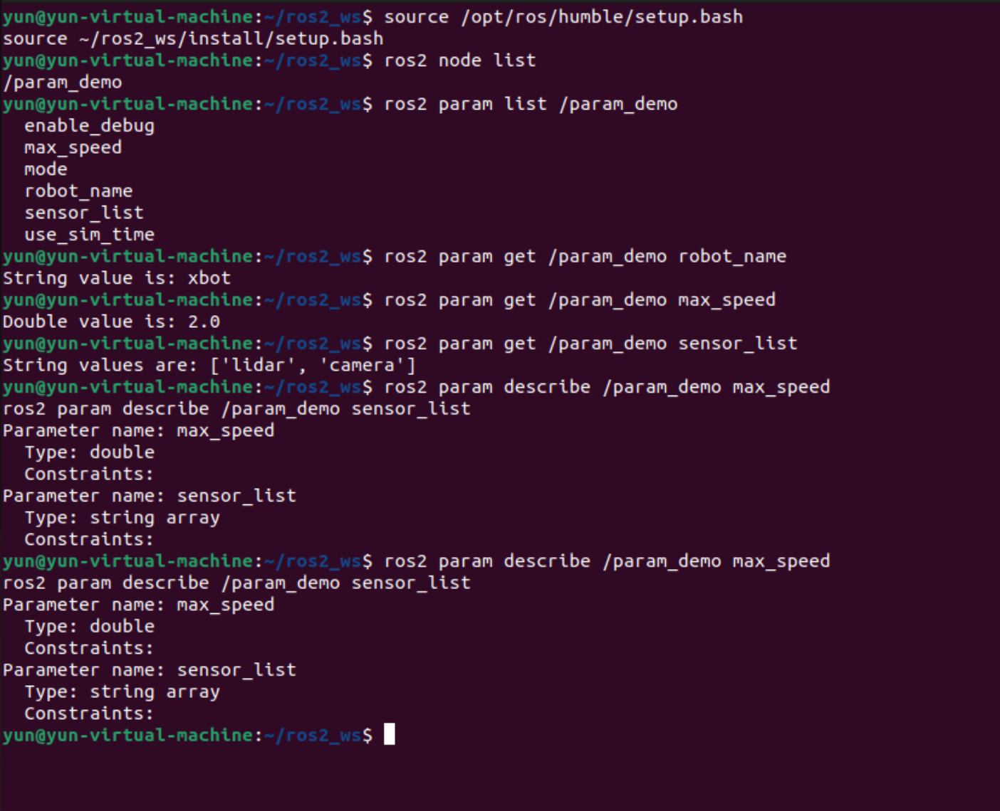
## 动态修改参数

### 修改机器人名称
```bash
ros2 param set /param_demo robot_name xbot_u
```
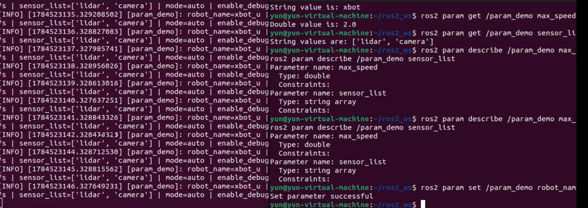
###  修改最大速度

```bash
ros2 param set /param_demo max_speed 4.5
```
```bash
ros2 param get /param_demo max_speed
```
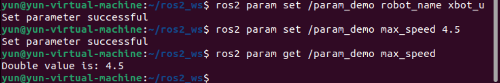
### 修改传感器数组
```bash
ros2 param set /param_demo sensor_list "['lidar', 'camera', 'imu']"
```
```bash
ros2 param get /param_demo sensor_list
```

###  修改布尔参数

```bash
ros2 param set /param_demo enable_debug true
```

关闭调试：

```bash
ros2 param set /param_demo enable_debug false
```
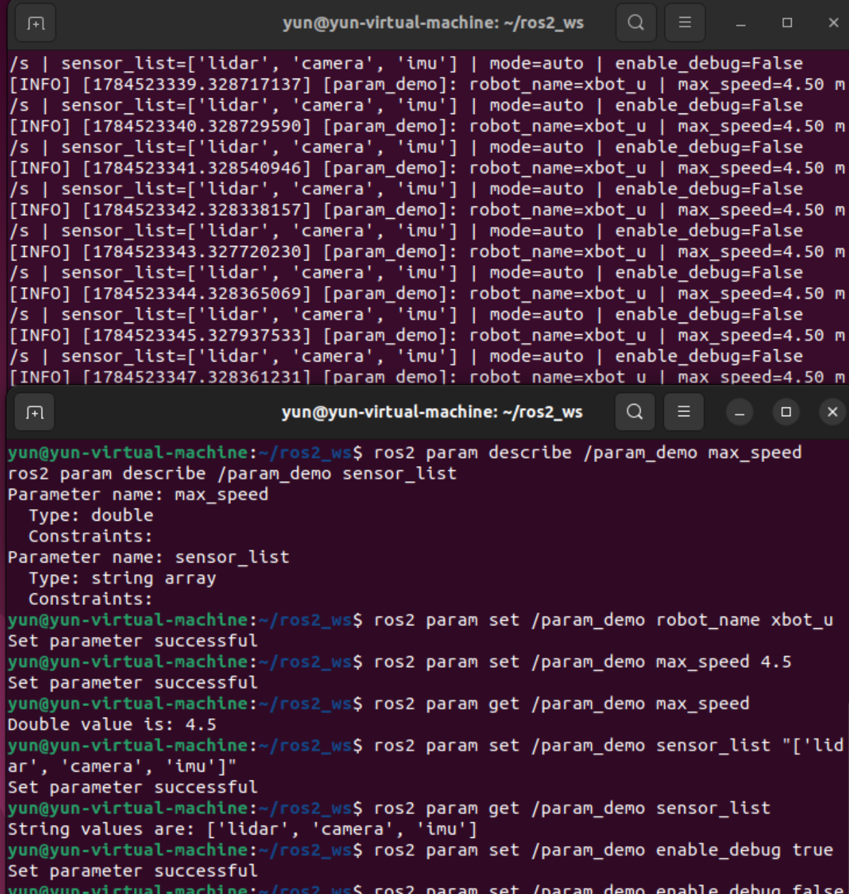
### 导出当前参数
```bash
ros2 param dump /param_demo
```
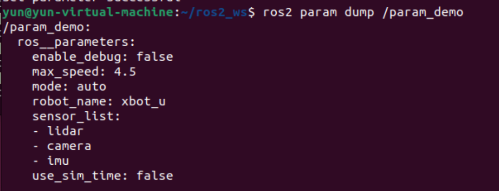
## 练习 3.2：参数回调验证（约 30 分钟）

实现 `add_on_set_parameters_callback`：验证 max_speed 范围 [0.0, 10.0] 和 mode 值 {"auto","manual","hybrid"}。

```python
self.add_on_set_parameters_callback(self.validate_parameters)
```

对应验证函数为：

```python
def validate_parameters(self, params):
    for param in params:
        if param.name == 'max_speed':
            if param.value < 0.0 or param.value > 10.0:
                return SetParametersResult(
                    successful=False,
                    reason='max_speed 必须在 [0.0, 10.0] 范围内',
                )

        elif param.name == 'mode':
            allowed_modes = ('auto', 'manual', 'hybrid')
            if param.value not in allowed_modes:
                return SetParametersResult(
                    successful=False,
                    reason='mode 必须是 auto、manual 或 hybrid',
                )

    return SetParametersResult(successful=True)
```
终端 1 

```bash
source /opt/ros/humble/setup.bash
source ~/ros2_ws/install/setup.bash
ros2 run param_demo param_node
```

终端 2 

```bash
source /opt/ros/humble/setup.bash
source ~/ros2_ws/install/setup.bash
```
## 测试 max_speed

###  设置合法值

```bash
ros2 param set /param_demo max_speed 8.0
```
```bash
ros2 param get /param_demo max_speed
```
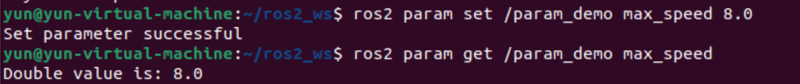
### 测试小于下限的值

```bash
ros2 param set /param_demo max_speed -1.0
```
```bash
ros2 param get /param_demo max_speed
```
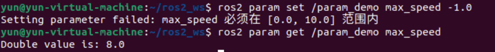

### 测试大于上限的值

```bash
ros2 param set /param_demo max_speed 15.0
```
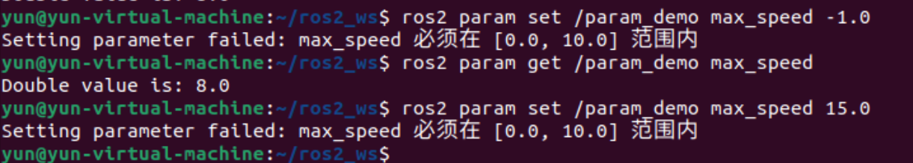
### 测试边界值
```bash
ros2 param set /param_demo max_speed 0.0
ros2 param set /param_demo max_speed 10.0
ros2 param set /param_demo max_speed 10.1
```
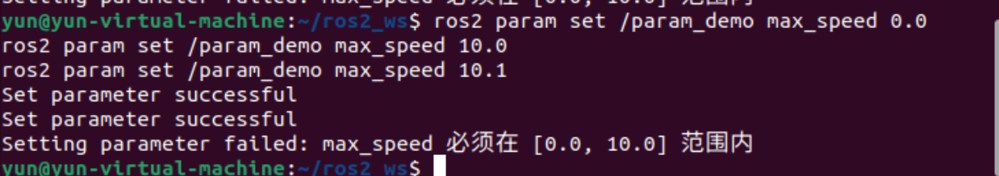
## 17. 测试 mode

### 测试三个合法模式

```bash
ros2 param set /param_demo mode auto
ros2 param set /param_demo mode manual
ros2 param set /param_demo mode hybrid
```
### 测试非法模式

```bash
ros2 param set /param_demo mode sport
ros2 param get /param_demo mode
```
```bash
ros2 param set /param_demo mode AUTO
```
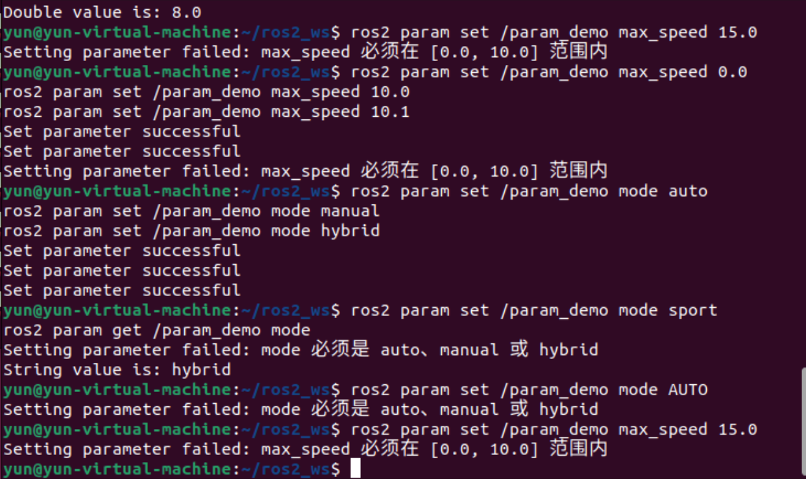
---
# YAML 参数文件实验

## 创建 params.yaml

文件路径：

```text
~/ros2_ws/src/param_demo/config/params.yaml
```

完整内容：

```yaml
param_demo:
  ros__parameters:
    robot_name: 'xbot_u'
    max_speed: 3.5
    sensor_list: ['lidar', 'camera', 'imu']
    mode: 'hybrid'
    enable_debug: true
```

## 通过命令行加载 YAML

先停止之前运行的 `/param_demo` 节点，避免出现同名节点
终端 1 中执行：

```bash
source /opt/ros/humble/setup.bash
source ~/ros2_ws/install/setup.bash
ros2 run param_demo param_node --ros-args \
  --params-file ~/ros2_ws/src/param_demo/config/params.yaml
```
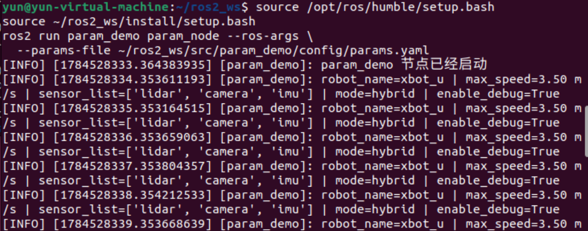
启动后的输出应包含：
## 向运行中的节点加载 YAML

保持节点运行，终端 2 执行：

```bash
ros2 param load /param_demo \
  ~/ros2_ws/src/param_demo/config/params.yaml  #####
```

```bash
ros2 param get /param_demo robot_name
ros2 param get /param_demo max_speed
ros2 param get /param_demo sensor_list
ros2 param get /param_demo mode
ros2 param get /param_demo enable_debug
```
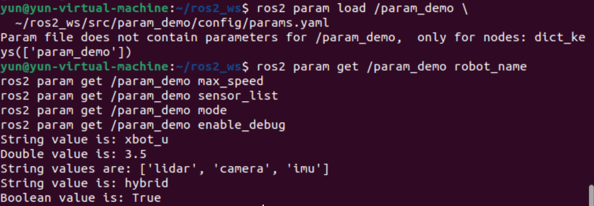
## 练习 3.3：Launch 文件实战（约 30 分钟）

1. 编写 Python Launch 文件，同时启动 talker + listener
2. 添加 `use_rviz` 启动参数控制 RViz 是否启动
3. 组合仿真 Launch：IncludeLaunchDescription 引用 XBot-U 仿真 + 自主导航节点

**提示**：参考 `ros2_ws/src/navigation_sim_demo_ros2/launch/nav2_demo.launch.py`

## 启动 talker、listener 和 RViz
```text
~/ros2_ws/src/param_demo/launch/demo.launch.py
```
```python
#!/usr/bin/env python3

from launch import LaunchDescription
from launch.actions import DeclareLaunchArgument
from launch.conditions import IfCondition
from launch.substitutions import LaunchConfiguration
from launch_ros.actions import Node


def generate_launch_description():
    use_rviz = LaunchConfiguration('use_rviz')

    return LaunchDescription([
        DeclareLaunchArgument(
            'use_rviz',
            default_value='false',
            description='是否启动 RViz2',
        ),

        Node(
            package='demo_nodes_py',
            executable='talker',
            name='my_talker',
            output='screen',
        ),

        Node(
            package='demo_nodes_py',
            executable='listener',
            name='my_listener',
            output='screen',
        ),

        Node(
            package='rviz2',
            executable='rviz2',
            name='rviz2',
            output='screen',
            condition=IfCondition(use_rviz),
        ),
    ])
```

## 使用 Launch 加载 params.yaml
```text
~/ros2_ws/src/param_demo/launch/param_with_yaml.launch.py
```

```python
#!/usr/bin/env python3

import os

from ament_index_python.packages import get_package_share_directory
from launch import LaunchDescription
from launch.actions import DeclareLaunchArgument
from launch.substitutions import LaunchConfiguration
from launch_ros.actions import Node


def generate_launch_description():
    default_params_file = os.path.join(
        get_package_share_directory('param_demo'),
        'config',
        'params.yaml',
    )

    params_file = LaunchConfiguration('params_file')

    return LaunchDescription([
        DeclareLaunchArgument(
            'params_file',
            default_value=default_params_file,
            description='param_demo 节点使用的 YAML 参数文件',
        ),

        Node(
            package='param_demo',
            executable='param_node',
            name='param_demo',
            output='screen',
            parameters=[params_file],
        ),
    ])
```

## 编写组合仿真与导航 Launch
```text
~/ros2_ws/src/param_demo/launch/combined_sim_nav.launch.py
```
```python
#!/usr/bin/env python3

import os

from ament_index_python.packages import get_package_share_directory
from launch import LaunchDescription
from launch.actions import (
    DeclareLaunchArgument,
    IncludeLaunchDescription,
)
from launch.launch_description_sources import PythonLaunchDescriptionSource
from launch.substitutions import LaunchConfiguration


def generate_launch_description():
    use_rviz = LaunchConfiguration('use_rviz')
    use_gazebo = LaunchConfiguration('use_gazebo')
    gz_headless = LaunchConfiguration('gz_headless')
    use_sim_time = LaunchConfiguration('use_sim_time')

    navigation_launch_path = os.path.join(
        get_package_share_directory('navigation_sim_demo_ros2'),
        'launch',
        'nav2_demo.launch.py',
    )


    navigation_stack = IncludeLaunchDescription(
        PythonLaunchDescriptionSource(navigation_launch_path),
        launch_arguments={
            'use_rviz': use_rviz,
            'use_gazebo': use_gazebo,
            'gz_headless': gz_headless,
            'use_sim_time': use_sim_time,
        }.items(),
    )

    return LaunchDescription([
        DeclareLaunchArgument(
            'use_rviz',
            default_value='true',
            description='是否启动 RViz2',
        ),
        DeclareLaunchArgument(
            'use_gazebo',
            default_value='true',
            description='是否启动 Gazebo Sim',
        ),
        DeclareLaunchArgument(
            'gz_headless',
            default_value='false',
            description='是否以无界面模式运行 Gazebo',
        ),
        DeclareLaunchArgument(
            'use_sim_time',
            default_value='true',
            description='是否使用仿真时钟',
        ),
        navigation_stack,
    ])
```
## 重新编译 Launch 文件

在终端 A 中执行：

```bash
cd ~/ros2_ws
source /opt/ros/humble/setup.bash
colcon build --base-paths src/param_demo \
  --packages-select param_demo \
  --symlink-install
source ~/ros2_ws/install/setup.bash
```
```bash
ls ~/ros2_ws/install/param_demo/share/param_demo/launch
```

应看到：

```text
combined_sim_nav.launch.py
demo.launch.py
param_with_yaml.launch.py
```

## 测试 talker 和 listener

先确保之前的测试节点已经停止，然后打开终端 1：

```bash
source /opt/ros/humble/setup.bash
source ~/ros2_ws/install/setup.bash
ros2 launch param_demo demo.launch.py
```

因为 `use_rviz` 默认是 `false`，此时只会启动 talker 和 listener。

终端应持续出现类似输出：

```text
[my_talker]: Publishing: "Hello World: 1"
[my_listener]: I heard: [Hello World: 1]
```

在终端 2 中检查节点：

```bash
source /opt/ros/humble/setup.bash
source ~/ros2_ws/install/setup.bash
ros2 node list
```
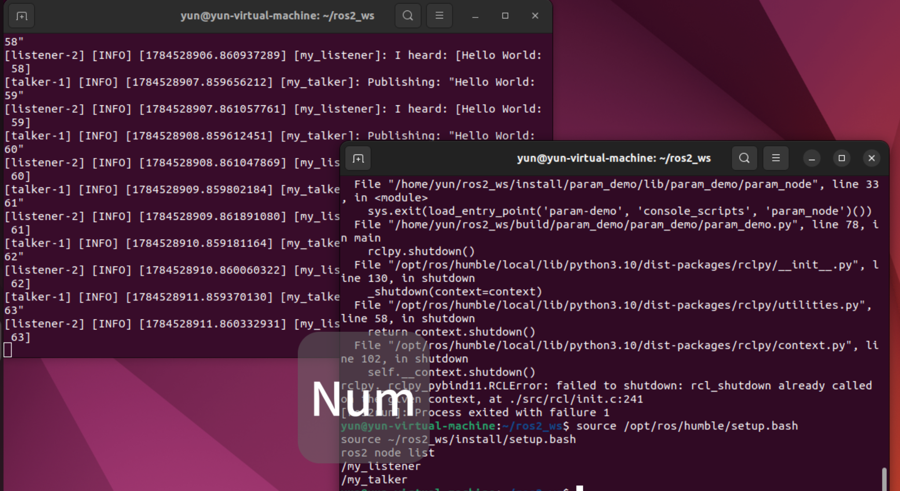
应看到：

```bash
ros2 topic list
ros2 topic echo /chatter
```
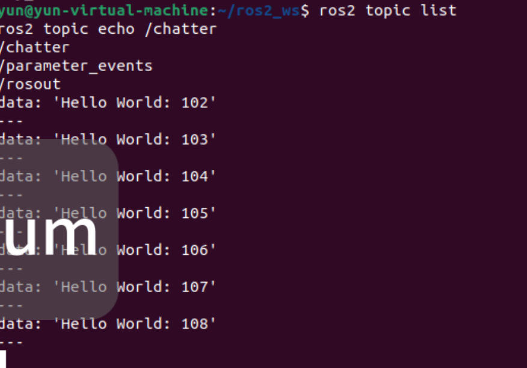
## 测试 use_rviz 条件启动

### 不启动 RViz

终端 1：

```bash
ros2 launch param_demo demo.launch.py use_rviz:=false
```
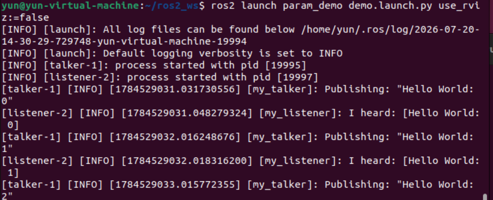
终端 2 ：

```bash
ros2 node list
```

### 启动 RViz
```bash
ros2 launch param_demo demo.launch.py use_rviz:=true
```

```bash
ros2 node list
```
查看 Launch 参数说明：

```bash
ros2 launch param_demo demo.launch.py --show-args
```
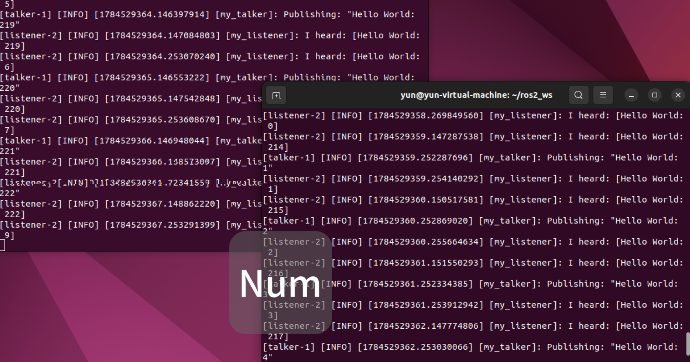
## 测试 Launch 加载 YAML

先停止前一个 Launch，然后在终端 1 中执行：

```bash
source /opt/ros/humble/setup.bash
source ~/ros2_ws/install/setup.bash
ros2 launch param_demo param_with_yaml.launch.py
```
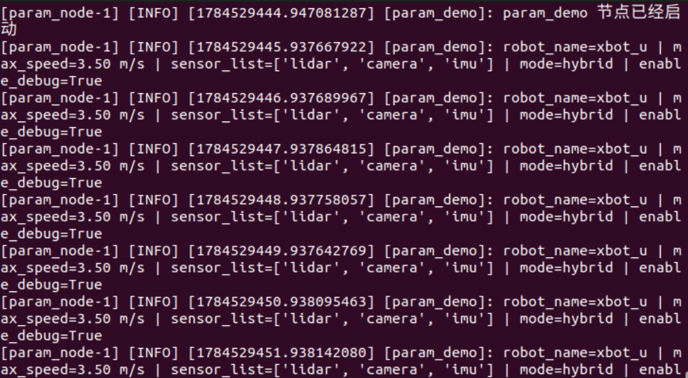
##  测试组合 Launch

### 检查依赖包

执行：

```bash
source /opt/ros/humble/setup.bash
source ~/ros2_ws/install/setup.bash
ros2 pkg prefix robot_sim_demo_ros2
ros2 pkg prefix navigation_sim_demo_ros2
```
### 启动组合系统

```bash
LIBGL_ALWAYS_SOFTWARE=1 \
ros2 launch param_demo combined_sim_nav.launch.py \
  use_gazebo:=true \
  gz_headless:=false \
  use_rviz:=true \
  use_sim_time:=true
```

正常启动顺序为：

1. `nav2_demo.launch.py` 包含并启动 XBot-U Gazebo 仿真。
2. 启动 Nav2 节点并加载地图。
3. 启动 RViz2。
4. 导航生命周期节点激活后输出 `Nav2 stack is active`。

不需要 RViz 时执行：

```bash
ros2 launch param_demo combined_sim_nav.launch.py use_rviz:=false
```

在终端 2 中可以检查：

```bash
ros2 node list
ros2 topic list
ros2 service list
ros2 action list
```

### 思考题
1. `LaunchConfiguration` 和 `DeclareLaunchArgument` 的区别？
2. 什么是 `GroupAction(scoped=True)`，何时使用？

---

## 练习 4：动态参数调速 — 运行时修改机器人速度（约 15 分钟）

### 目标
创建 `speed_controller` 节点，持续发布 `/cmd_vel` 控制机器人运动，通过动态参数实时调整线速度和角速度。

### 步骤
## 编写 speed_controller.py
```text
~/ros2_ws/src/param_demo/param_demo/speed_controller.py
```
```python
#!/usr/bin/env python3
"""使用动态参数控制机器人的线速度和角速度。"""

import rclpy
from geometry_msgs.msg import Twist
from rcl_interfaces.msg import SetParametersResult
from rclpy.executors import ExternalShutdownException
from rclpy.node import Node


class SpeedController(Node):

    def __init__(self):
        super().__init__('speed_controller')

        self.declare_parameter('linear_speed', 0.2)
        self.declare_parameter('angular_speed', 0.0)
        self.declare_parameter('enable_control', True)

        self.add_on_set_parameters_callback(
            self.validate_parameters
        )

        self.publisher = self.create_publisher(
            Twist,
            '/cmd_vel',
            10,
        )

        # 0.1 秒执行一次，即 10 Hz。
        self.timer = self.create_timer(0.1, self.control_loop)

        self.get_logger().info('speed_controller 已启动')

    def validate_parameters(self, params):
        """在参数写入前检查速度范围。"""
        for param in params:
            if param.name == 'linear_speed':
                if abs(param.value) > 1.0:
                    return SetParametersResult(
                        successful=False,
                        reason='线速度范围必须是 [-1.0, 1.0] m/s',
                    )

            elif param.name == 'angular_speed':
                if abs(param.value) > 2.0:
                    return SetParametersResult(
                        successful=False,
                        reason='角速度范围必须是 [-2.0, 2.0] rad/s',
                    )

        return SetParametersResult(successful=True)

    def control_loop(self):
        """读取实时参数并发布速度。"""
        enabled = self.get_parameter('enable_control').value

        message = Twist()

        if enabled:
            message.linear.x = self.get_parameter(
                'linear_speed'
            ).value
            message.angular.z = self.get_parameter(
                'angular_speed'
            ).value

        # 禁用控制时 message 保持全零，保证机器人停止。
        self.publisher.publish(message)

        self.get_logger().info(
            f'enable={enabled}, '
            f'v={message.linear.x:.2f} m/s, '
            f'w={message.angular.z:.2f} rad/s',
            throttle_duration_sec=2.0,
        )


def main(args=None):
    rclpy.init(args=args)
    node = SpeedController()

    try:
        rclpy.spin(node)
    except (KeyboardInterrupt, ExternalShutdownException):
        pass
    finally:
        # Humble 收到 Ctrl+C 后可能已经关闭 context。
        # 只有 context 仍有效时才能继续发布消息。
        if rclpy.ok():
            node.publisher.publish(Twist())
        node.destroy_node()
        if rclpy.ok():
            rclpy.shutdown()


if __name__ == '__main__':
    main()
```

## 创建初始速度 YAML

```text
~/ros2_ws/src/param_demo/config/speed_params.yaml
```

```yaml
speed_controller:
  ros__parameters:
    linear_speed: 0.2
    angular_speed: 0.0
    enable_control: true
```

## 创建 speed.launch.py
```text
~/ros2_ws/src/param_demo/launch/speed.launch.py
```
```python
#!/usr/bin/env python3

import os

from ament_index_python.packages import get_package_share_directory
from launch import LaunchDescription
from launch_ros.actions import Node


def generate_launch_description():
    params_file = os.path.join(
        get_package_share_directory('param_demo'),
        'config',
        'speed_params.yaml',
    )

    return LaunchDescription([
        Node(
            package='param_demo',
            executable='speed_ctrl',
            name='speed_controller',
            output='screen',
            parameters=[params_file],
        ),
    ])
```

## 编译速度控制节点
```bash
cd ~/ros2_ws
source /opt/ros/humble/setup.bash
colcon build --base-paths src/param_demo \
  --packages-select param_demo \
  --symlink-install
source ~/ros2_ws/install/setup.bash
```
```bash
ros2 pkg executables param_demo
```
## 启动 Gazebo 仿真

```bash
source ~/ros2_ws/install/setup.bash
ros2 pkg prefix robot_sim_demo_ros2
source /opt/ros/humble/setup.bash
source ~/ros2_ws/install/setup.bash
ros2 launch robot_sim_demo_ros2 sim_bringup.launch.py
```
## 启动速度控制节点

```bash
source /opt/ros/humble/setup.bash
source ~/ros2_ws/install/setup.bash
ros2 run param_demo speed_ctrl
```
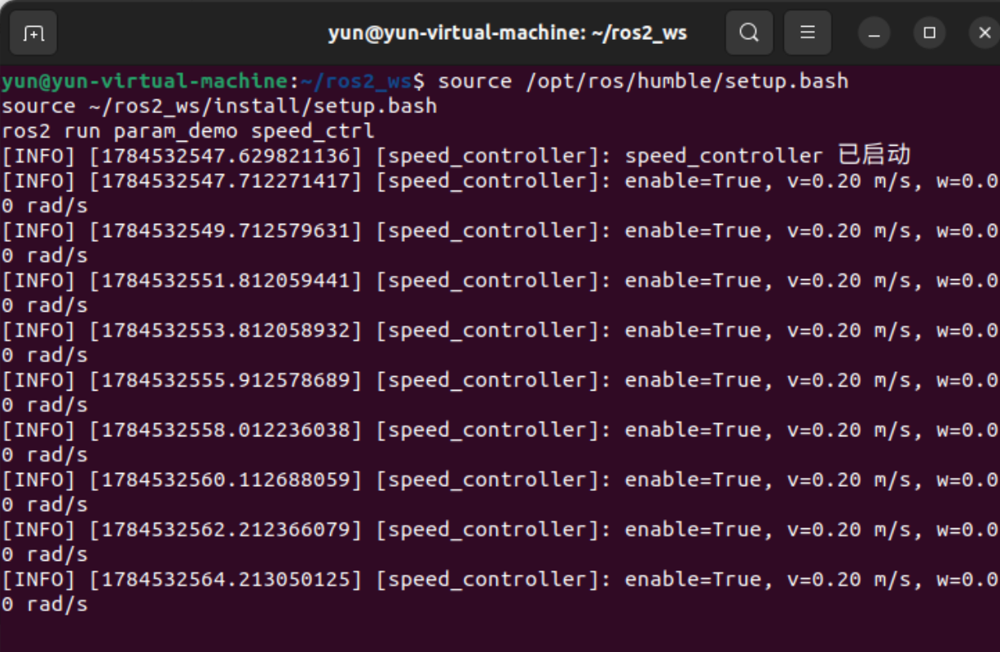
也可以使用 YAML Launch 启动：

```bash
ros2 launch param_demo speed.launch.py
```
## 检查节点、参数和话题

```bash
source /opt/ros/humble/setup.bash
source ~/ros2_ws/install/setup.bash
```

检查节点：

```bash
ros2 node list
```
```bash
ros2 param list /speed_controller
```

读取初始值：

```bash
ros2 param get /speed_controller linear_speed
ros2 param get /speed_controller angular_speed
ros2 param get /speed_controller enable_control
```

检查 `/cmd_vel`：

```bash
ros2 topic info /cmd_vel
```
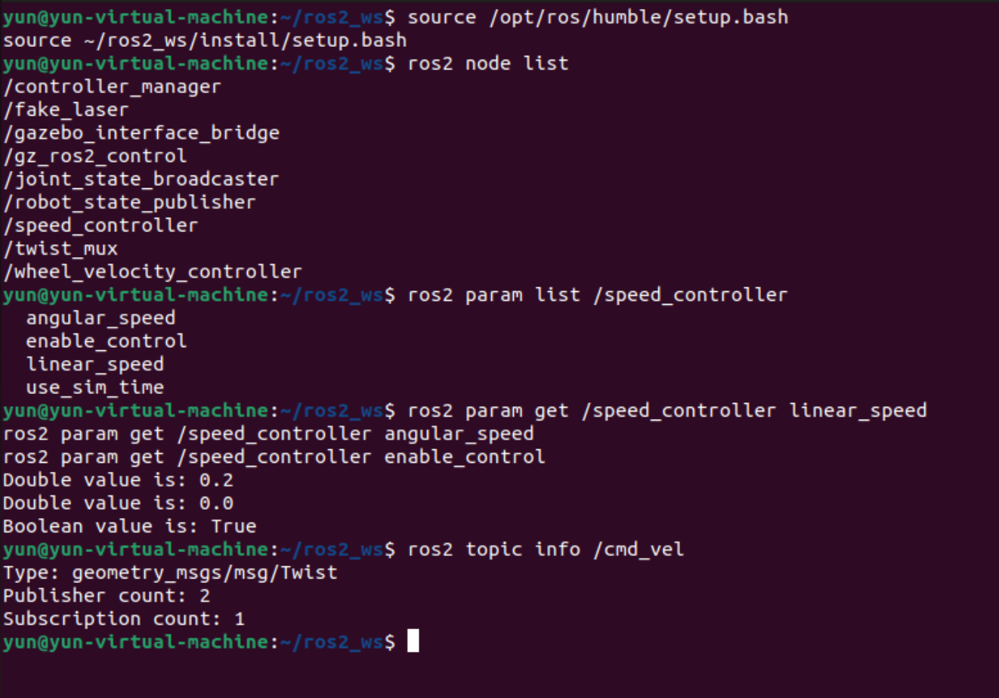
## 动态修改速度
### 加速直行

```bash
ros2 param set /speed_controller linear_speed 0.5
```
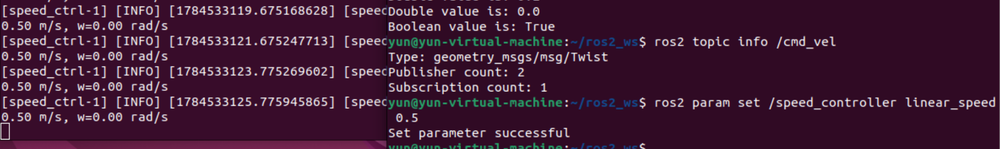
### 一边前进一边左转

```bash
ros2 param set /speed_controller angular_speed 1.0
```
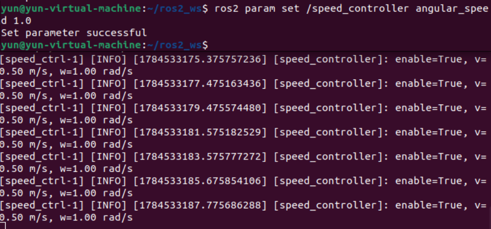
### 一边前进一边右转

```bash
ros2 param set /speed_controller angular_speed -1.0
```

### 停止转动，继续直行

```bash
ros2 param set /speed_controller angular_speed 0.0
```

### 倒车

```bash
ros2 param set /speed_controller linear_speed -0.3
```
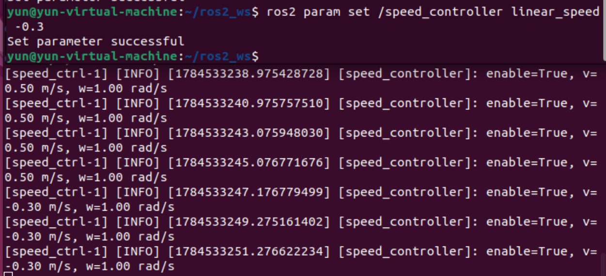
#负线速度表示后退。

### 完全停止

同时把两个速度设置为零：

```bash
ros2 param set /speed_controller linear_speed 0.0
ros2 param set /speed_controller angular_speed 0.0
```

## 暂停和恢复控制

暂停控制：

```bash
ros2 param set /speed_controller enable_control false
```
在禁用状态下修改速度：

```bash
ros2 param set /speed_controller linear_speed 0.4
ros2 param set /speed_controller angular_speed 0.5
```

参数可以修改成功，但节点仍发布零速度，机器人不会运动。

恢复控制：

```bash
ros2 param set /speed_controller enable_control true
```

恢复后，节点会立即使用刚才保存的 `0.4` 和 `0.5`，机器人开始沿弧线运动。

实验结束前再次完全停止：

```bash
ros2 param set /speed_controller linear_speed 0.0
ros2 param set /speed_controller angular_speed 0.0
```

## 测试超限参数

### 线速度超限

```bash
ros2 param set /speed_controller linear_speed 3.0
```
### 负线速度超限

```bash
ros2 param set /speed_controller linear_speed -1.5
```

### 角速度超限

```bash
ros2 param set /speed_controller angular_speed 3.0
```
### 负方向超限：

```bash
ros2 param set /speed_controller angular_speed -2.5
```

### 测试边界值


```bash
ros2 param set /speed_controller linear_speed 1.0
ros2 param set /speed_controller linear_speed -1.0
ros2 param set /speed_controller angular_speed 2.0
ros2 param set /speed_controller angular_speed -2.0
```

完成测试后立即停止：

```bash
ros2 param set /speed_controller linear_speed 0.0
ros2 param set /speed_controller angular_speed 0.0
```

### /cmd_vel 数据

在终端 3 中执行：

```bash
ros2 topic echo /cmd_vel
```
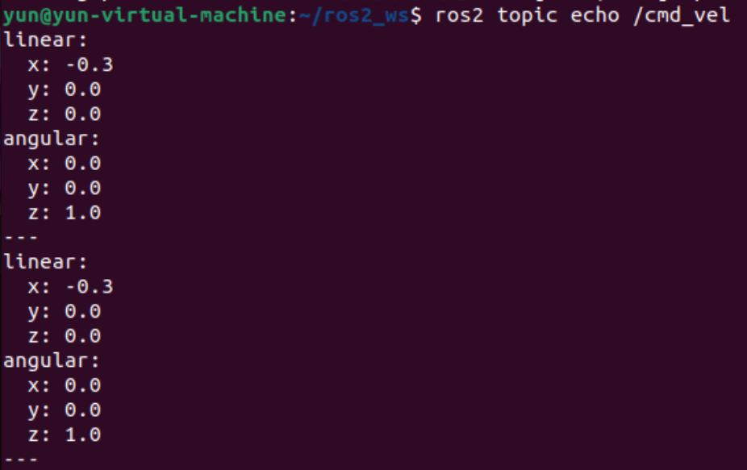
检查发布频率：

```bash
ros2 topic hz /cmd_vel
```
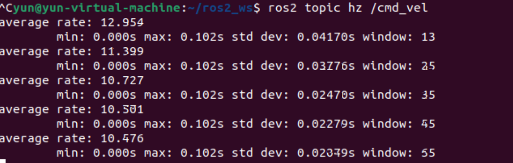
查看详细通信关系：

```bash
ros2 topic info /cmd_vel --verbose
```
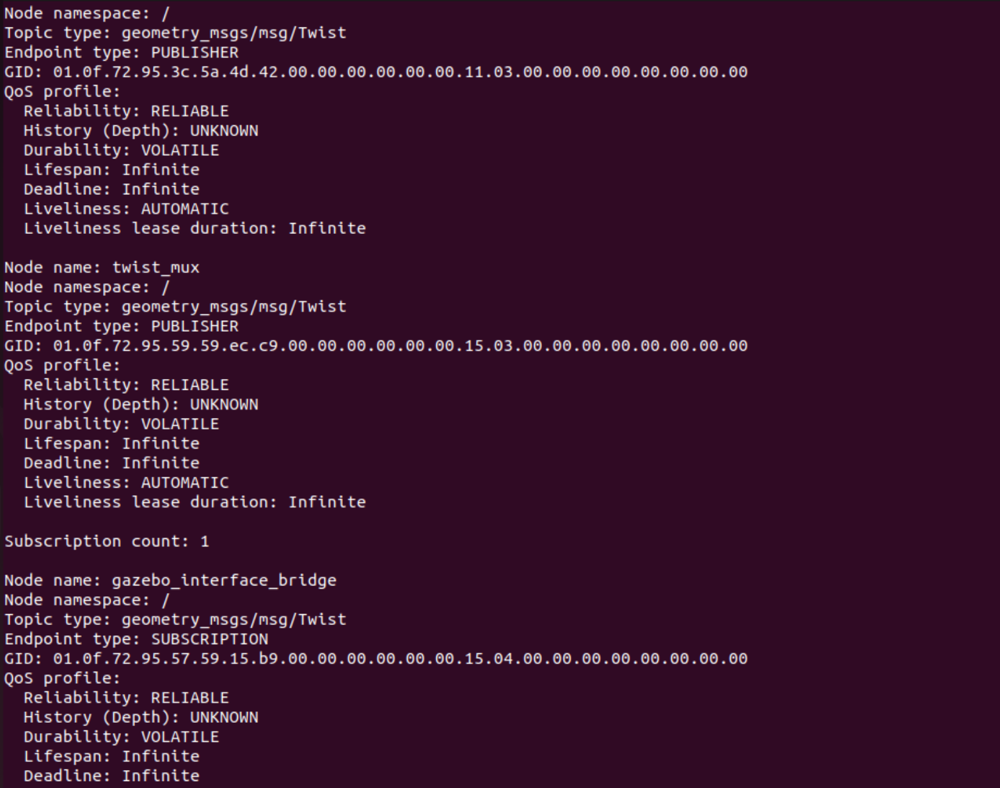
