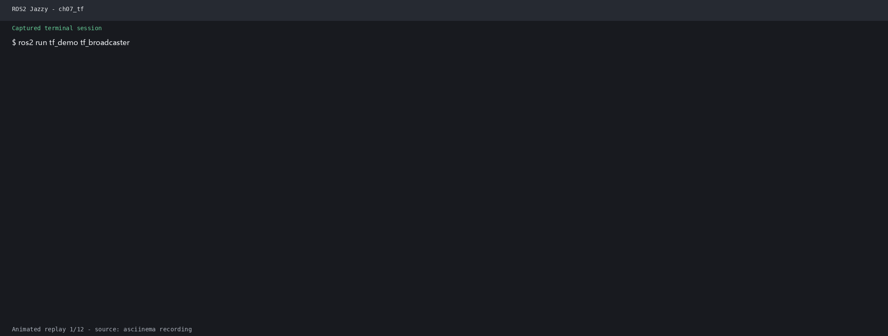

# 第7章 实验指导书：TF2 坐标变换系统

## 当前仓库仿真验证：查询 Wheeltec 传感器 TF

### 实验目标

在 Gazebo 发布的真实 TF 图上练习 `tf2_echo`、`view_frames` 和 RViz TF 显示，确认传感器 frame 与底盘 frame 的关系。

### 运行步骤

```bash
source /opt/ros/jazzy/setup.bash
source install/setup.bash
ros2 launch robot_sim_demo gazebo2.launch.py \
  gui:=true rviz:=true drive:=false
```

另开终端：

```bash
source install/setup.bash
ros2 topic info /tf
ros2 run tf2_ros tf2_echo base_link laser_link
ros2 run tf2_tools view_frames
```

### 观察与验收

RViz 中应能看到机器人 TF；`tf2_echo` 输出平移和旋转。frame 名称以 `ros2 topic echo /tf` 实际输出为准。源码：`src/robot_sim_demo/models/wheeltec_robot/model.sdf`、`src/robot_sim_demo/config/gazebo2_bridge.yaml`。

> **实验课时**：2 课时（90 分钟） | XBot-U Gazebo 仿真

---

## 实验目标
1. 掌握 TF2 广播与监听的核心 API
2. 实现多传感器坐标系对齐
3. 熟练使用 TF2 调试工具

---

## 练习 7.1：TF 广播和监听基础（约 30 分钟）

### 任务
1. 编写 `tf_broadcaster.py`：以 20Hz 频率发布 `odom` → `base_link` 动态变换（圆形轨迹运动），同时发布 `base_link` → `laser_frame` 静态变换。
2. 编写 `tf_listener.py`：监听并每秒输出 `laser_frame` 相对于 `base_link` 的位姿。

### 步骤
1. 创建包 `tf_demo`，参考 `lab_code/ch07_lab/tf_demo/`
2. 运行广播器：`ros2 run tf_demo tf_broadcaster`
3. 运行监听器：`ros2 run tf_demo tf_listener`
4. 验证：`ros2 run tf2_ros tf2_echo base_link laser_frame`

### 参考代码

**tf_broadcaster.py** 核心片段：
```python
import math
from geometry_msgs.msg import TransformStamped
from tf2_ros import TransformBroadcaster, StaticTransformBroadcaster

class TFBroadcaster(Node):
    def __init__(self):
        super().__init__('tf_broadcaster')
        self.dynamic_broadcaster = TransformBroadcaster(self)
        self.static_broadcaster = StaticTransformBroadcaster(self)

        # 发送静态变换 (base_link → laser_frame)
        static_tf = TransformStamped()
        static_tf.header.frame_id = 'base_link'
        static_tf.child_frame_id = 'laser_frame'
        static_tf.transform.translation.x = 0.2
        static_tf.transform.translation.z = 0.1
        static_tf.transform.rotation.w = 1.0
        self.static_broadcaster.sendTransform(static_tf)

        self.timer = self.create_timer(0.05, self.publish_dynamic_tf)
        self.angle = 0.0

    def publish_dynamic_tf(self):
        t = TransformStamped()
        t.header.stamp = self.get_clock().now().to_msg()
        t.header.frame_id = 'odom'
        t.child_frame_id = 'base_link'
        t.transform.translation.x = 1.0 * math.cos(self.angle)
        t.transform.translation.y = 1.0 * math.sin(self.angle)
        t.transform.rotation.z = math.sin(self.angle / 2)
        t.transform.rotation.w = math.cos(self.angle / 2)
        self.dynamic_broadcaster.sendTransform(t)
        self.angle += 0.05
```

---

## 练习 7.2：多传感器坐标对齐（约 30 分钟）

### 任务
为 XBot-U 扩展多传感器 TF 树：在 `base_link` 下添加 `camera_frame`、`imu_link`、`left_wheel` 和 `right_wheel` 四个子系，实现激光雷达点到相机坐标系的对齐变换。

### 步骤
1. 在 `tf_broadcaster.py` 中扩展静态变换广播：
   - `base_link` → `camera_frame`：(x=0.15, z=0.25)
   - `base_link` → `imu_link`：(x=0.0, z=0.05)
   - `base_link` → `left_wheel`：(y=0.15, z=-0.05)
   - `base_link` → `right_wheel`：(y=-0.15, z=-0.05)
2. 在 `tf_listener.py` 中实现激光→相机坐标转换：
```python
from tf2_geometry_msgs import do_transform_point
from geometry_msgs.msg import PointStamped

# 激光点 (1.0, 0.5, 0.0) → 相机坐标系
pt = PointStamped()
pt.header.frame_id = 'laser_frame'
pt.header.stamp = self.get_clock().now().to_msg()
pt.point.x = 1.0; pt.point.y = 0.5

laser_to_camera = self.tf_buffer.lookup_transform(
    'camera_frame', 'laser_frame', rclpy.time.Time())
pt_in_camera = do_transform_point(pt, laser_to_camera)
```
3. 运行 `view_frames` 验证完整的 TF 树结构。

---

## 练习 7.3：TF 调试工具使用（约 30 分钟）

### 任务
使用 TF2 三大调试工具诊断和验证坐标系系统。

### 步骤
1. **tf2_echo**：实时查看任意两坐标系间变换
```bash
ros2 run tf2_ros tf2_echo base_link laser_frame
ros2 run tf2_ros tf2_echo odom base_link
ros2 run tf2_ros tf2_echo camera_frame laser_frame
```
2. **tf2_monitor**：监视所有 TF 发布者，查看帧率和延迟
```bash
ros2 run tf2_ros tf2_monitor
```
3. **view_frames**：生成 PDF 坐标树并分析
```bash
ros2 run tf2_tools view_frames
# 查看生成的 frames.pdf
```

### 思考题
1. 如何判断 TF 树中是否存在环路？
2. 如果 `lookup_transform` 频繁报 `ExtrapolationException`，说明什么？如何修复？
3. 为什么要使用 `can_transform` 而不是直接 `lookup_transform`？

---

## 练习 4：TF 仿真查询 — 查询 XBot-U 传感器坐标系（约 15 分钟）

### 目标
启动仿真后，使用 TF2 查询 LiDAR 和 Camera 相对于 base_link 的位置，计算传感器安装偏移。

### 步骤

**步骤1：启动仿真**
```bash
ros2 launch robot_sim_demo_ros2 sim_bringup.launch.py
```

**步骤2：编写 tf_lookup.py**
```python
#!/usr/bin/env python3
"""tf_lookup: 查询 XBot-U 各坐标系相对位置"""
import rclpy
from rclpy.node import Node
from tf2_ros import Buffer, TransformListener


class TfLookup(Node):
    def __init__(self):
        super().__init__('tf_lookup')
        self.tf_buffer = Buffer()
        self.tf_listener = TransformListener(self.tf_buffer, self)
        self.timer = self.create_timer(2.0, self.lookup_tf)

    def lookup_tf(self):
        try:
            # 查询 laser → base_link 变换
            t = self.tf_buffer.lookup_transform(
                'base_link', 'laser', rclpy.time.Time()
            )
            self.get_logger().info(
                f'LiDAR 位置: x={t.transform.translation.x:.3f}, '
                f'y={t.transform.translation.y:.3f}, '
                f'z={t.transform.translation.z:.3f}')
        except Exception as e:
            self.get_logger().warn(f'TF查询失败: {e}')


def main(args=None):
    rclpy.init(args=args)
    rclpy.spin(TfLookup())
    rclpy.shutdown()
```

**步骤3：运行**
```bash
ros2 run tf_demo tf_lookup
```

**✓ 验证**：终端输出 LiDAR 和 Camera 相对 base_link 的位置坐标。用 `ros2 run tf2_tools view_frames` 查看完整 TF 树。

### 思考题
1. TF 树中 `base_footprint` 和 `base_link` 的区别是什么？
2. 如果 TF 查询超时，如何处理？

## 实际运行证据

真实运行的 TF broadcaster、listener 和 `tf2_echo` 输出：



原始录制：[ch07_tf.cast](images/runtime/ch07_tf.cast)。完整证据索引见[实际运行证据](runtime_evidence.md)。
