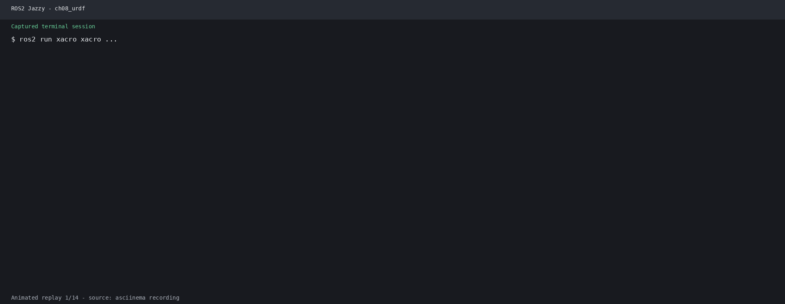

# 第8章 实验指导书：URDF/Xacro 机器人建模

## 当前仓库仿真验证：Xacro 模型与 Gazebo/RViz 对照

### 实验目标

验证 Xacro 展开、Robot State Publisher 和 RViz RobotModel，并将课程自定义 URDF 与 `robot_sim_demo` 的 Wheeltec SDF 模型进行对照。

### 运行步骤

```bash
source /opt/ros/jazzy/setup.bash
source install/setup.bash
ros2 run xacro xacro src/urdf_demo_ros2/urdf/mybot.xacro > /tmp/mybot.urdf
xmllint --noout /tmp/mybot.urdf
ros2 launch urdf_demo_ros2 display_xacro.launch.py \
  use_gui:=false use_rviz:=true
```

另开终端查看 Gazebo 模型：

```bash
ros2 launch robot_sim_demo gazebo2.launch.py \
  gui:=true rviz:=false drive:=false
```

### 观察与验收

RViz 应显示 Xacro 模型及其 TF；Gazebo 显示 Wheeltec 传感器模型。源码：`src/urdf_demo_ros2/urdf/`、`src/robot_sim_demo/models/wheeltec_robot/model.sdf`。

## 实际运行证据

真实运行的 Xacro 展开、XML 校验和 RobotModel/TF 启动输出：



原始录制：[ch08_urdf.cast](images/runtime/ch08_urdf.cast)。

> **实验课时**：2 课时（90 分钟） | XBot-U 模型

---

## 实验目标
1. 编写基础 URDF 描述机器人结构
2. 使用 XACRO 宏实现参数化建模
3. RViz2 可视化完整机器人模型

---

## 练习 8.1：基础 URDF 编写（约 30 分钟）

### 任务
编写一个简单差速机器人 URDF，包含：
- `base_link`：底盘长方体 (0.4×0.3×0.15)，蓝色，mass=5kg
- `left_wheel_link` / `right_wheel_link`：两个轮子 (cylinder, r=0.05, l=0.03)
- `left_wheel_joint` / `right_wheel_joint`：`continuous` 类型
- `caster_wheel_link`：万向轮 (sphere, r=0.02)

### 步骤
1. 在 `lab_code/ch08_lab/urdf_demo/urdf/` 下创建 `simple_robot.urdf`
2. 运行 xacro 解析验证：`xacro urdf/simple_robot.urdf`
3. 使用 `check_urdf` 工具验证语法：`check_urdf <(xacro urdf/simple_robot.urdf)`

### 提示
```xml
<geometry>
  <cylinder radius="0.05" length="0.03"/>
</geometry>
<!-- 圆柱体默认沿 Z 轴，需要 rpy 旋转到 Y 轴 -->
<origin xyz="0 0.15 0" rpy="1.5708 0 0"/>
```

---

## 练习 8.2：XACRO 参数化建模（约 30 分钟）

### 任务
将练习 8.1 的 URDF 改写为 XACRO 文件 `simple_robot.xacro`：
1. 定义 `<xacro:property>`：`wheel_radius`, `wheel_width`, `chassis_length`, `chassis_width`, `chassis_height`
2. 编写 `<xacro:macro name="wheel" params="name reflect">` 消除重复代码
3. 实例化左右轮：`<xacro:wheel name="left" reflect="1"/>`

### 步骤
1. 编写 `simple_robot.xacro`，参考 `lab_code/ch08_lab/urdf_demo/urdf/simple_robot.xacro`
2. 运行 `ros2 launch urdf_demo display.launch.py` 启动 RViz2
3. 修改参数值（如 `wheel_radius`），观察模型变化

---

## 练习 8.3：RViz2 可视化机器人模型（约 30 分钟）

### 任务
配置 RViz2 完整显示机器人模型。

### 步骤
1. 在 RViz2 中添加 `RobotModel` 插件
2. 设置 Description Topic 为 `/robot_description`
3. 添加 `TF` 插件显示坐标系
4. 将 Fixed Frame 设为 `base_link`
5. 运行 `joint_state_publisher_gui`，拖动滑块测试关节运动
6. 保存 RViz 配置到 `urdf_demo/rviz/display.rviz`

### 思考题
1. `robot_state_publisher` 和 `joint_state_publisher` 的分工有何不同？
2. 如果 RViz 显示 "No transform from [left_wheel] to [base_link]"，可能是什么原因？
3. XACRO 宏中的 `*origin` 参数传递 block 时如何实现默认值？

---

## 练习 4：XACRO 自定义标记 — 为 XBot-U 添加视觉标记（约 15 分钟）

### 目标
修改 XBot-U 的 xacro 文件，在 base_link 上方添加一个红色球体标记，并在 RViz 中可视化。

### 步骤

**步骤1：编辑 xacro 文件**
在 `base_link` 的 xacro 定义中添加 marker link 和 joint：
```xml
<link name="custom_marker">
  <visual>
    <geometry>
      <sphere radius="0.03"/>
    </geometry>
    <material name="red_marker">
      <color rgba="1.0 0.0 0.0 1.0"/>
    </material>
  </visual>
</link>

<joint name="marker_joint" type="fixed">
  <parent link="base_link"/>
  <child link="custom_marker"/>
  <origin xyz="0 0 0.3" rpy="0 0 0"/>
</joint>
```

**步骤2：启动 RViz 验证**
```bash
ros2 launch urdf_demo display.launch.py
```
在 RViz 中添加 RobotModel，确认红色球体出现在机器人顶部。

**步骤3：修改 marker 位置和颜色**
改变 `<origin xyz="..." />` 和 `<color rgba="..." />` 参数，重新启动观察变化。

**✓ 验证**：RViz 中 XBot-U 模型顶部显示自定义红色球体标记，位置正确。

### 思考题
1. 如何在 xacro 宏中定义一个参数化的 marker，支持不同颜色和大小？
2. `<visual>` 和 `<collision>` 有什么区别？为什么 marker 可以省略碰撞？
