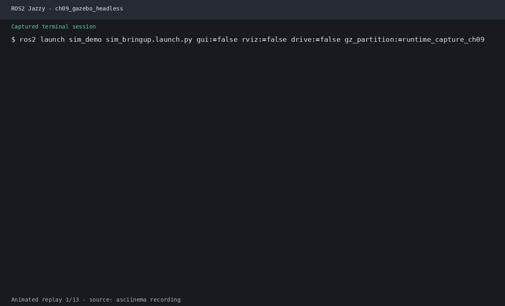
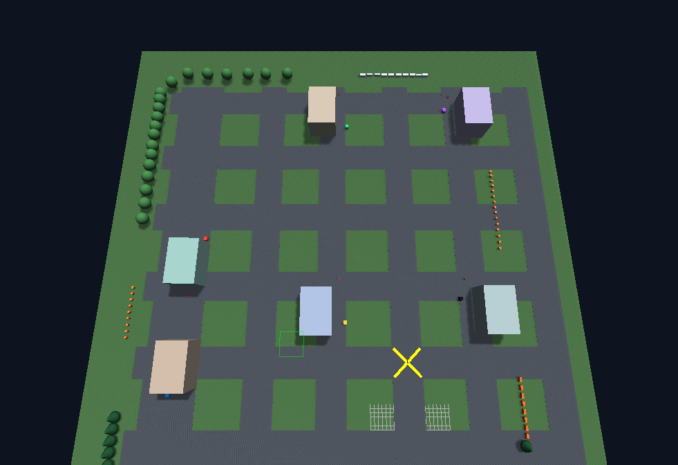
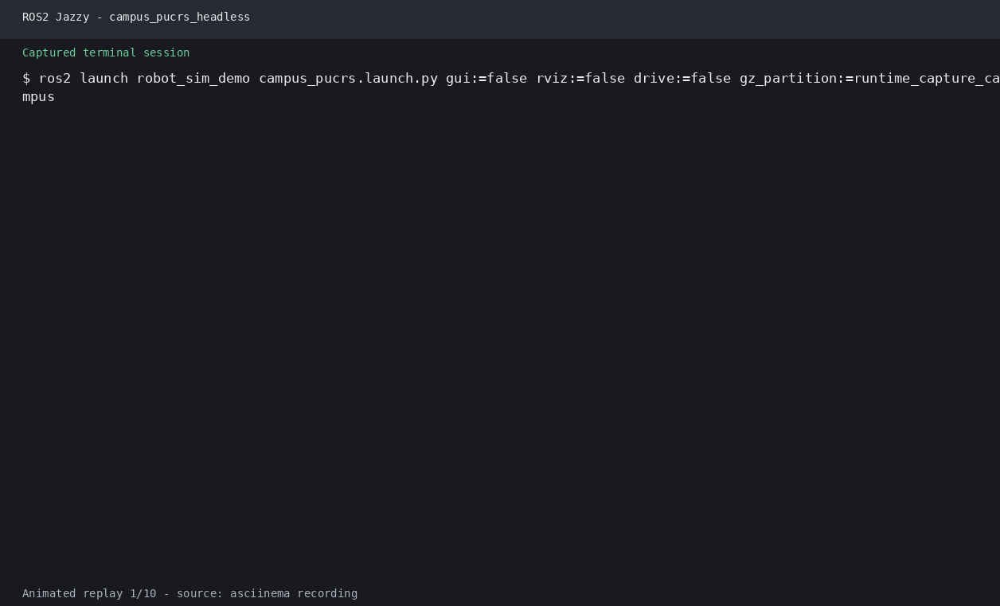

# 第9章 实验指导书：Gazebo 仿真

## 当前仓库仿真验证：ISCAS Museum、Bridge 与多传感器

### 实验目标

使用当前 Gazebo Sim Harmonic 入口验证世界加载、机器人 spawn、ROS-Gazebo Bridge、LiDAR、相机和底盘控制。

### 运行步骤

```bash
source /opt/ros/jazzy/setup.bash
source install/setup.bash
ros2 launch robot_sim_demo gazebo2.launch.py \
  gui:=true rviz:=true drive:=false
```

另开终端：

```bash
source install/setup.bash
ros2 topic echo /clock --once
ros2 topic info /scan
ros2 topic echo /camera/camera_info --once
ros2 topic echo /odom --once
```

### 观察与验收

Gazebo 应加载 Museum 场景并生成 Wheeltec；RViz 可显示 RobotModel、TF 和 LaserScan。终端证据：`images/runtime/ch09_gazebo_headless.png`。源码：`src/robot_sim_demo/`。

> **实验课时**：2 课时（90 分钟） | XBot-U Gazebo 仿真

---

## 实验目标
1. 搭建 Gazebo 仿真环境并 spawn 机器人模型
2. 配置 LiDAR + Camera 传感器插件
3. 使用 ros2_control 差速驱动控制机器人运动

---

## 练习 9.1：Gazebo 环境搭建与 Spawn 机器人（约 30 分钟）

### 任务
编写 `sim_bringup.launch.py`，启动 Gazebo + 空世界 + spawn XBot-U 模型。

### 步骤
1. 创建包 `sim_demo`，参考 `lab_code/ch09_lab/sim_demo/`
2. 编写 Launch 文件启动 Gazebo：
```python
IncludeLaunchDescription(
    PythonLaunchDescriptionSource([
        get_package_share_directory('gazebo_ros'),
        '/launch/gazebo.launch.py'
    ]),
)
```
3. 添加 spawn_entity 节点加载 robot_description
4. 运行：`ros2 launch sim_demo sim_bringup.launch.py`
5. 使用 `gz topic -l` 验证模型已加载

### 验证
```bash
gz topic -l                 # 列出 Gazebo 话题
ros2 topic list             # 列出 ROS2 话题
ros2 run gazebo_ros gazebo_ros_state  # 查看模型状态
```

---

## 练习 9.2：传感器插件配置（约 30 分钟）

### 任务
在 XBot-U 的 URDF/XACRO 中添加 LiDAR 和 Camera 的 Gazebo 传感器插件。

### 步骤
1. 在 URDF `<robot>` 标签内添加 `<gazebo>` 元素：

**LiDAR 插件**：
```xml
<gazebo reference="lidar_link">
  <sensor type="ray" name="lidar">
    <pose>0 0 0 0 0 0</pose>
    <visualize>true</visualize>
    <ray>
      <scan>
        <horizontal>
          <samples>360</samples>
          <min_angle>-1.570796</min_angle>
          <max_angle>1.570796</max_angle>
        </horizontal>
      </scan>
      <range><min>0.12</min><max>12.0</max></range>
    </ray>
    <plugin name="lidar_plugin" filename="libgazebo_ros_ray_sensor.so">
      <ros><namespace>/xbot</namespace></ros>
      <output_type>sensor_msgs/LaserScan</output_type>
    </plugin>
  </sensor>
</gazebo>
```

**Camera 插件**：
```xml
<gazebo reference="camera_link">
  <sensor type="camera" name="camera">
    <camera>
      <horizontal_fov>1.047</horizontal_fov>
      <image><width>640</width><height>480</height></image>
      <clip><near>0.05</near><far>8.0</far></clip>
    </camera>
    <plugin name="camera_plugin" filename="libgazebo_ros_camera.so">
      <ros><namespace>/xbot</namespace></ros>
    </plugin>
  </sensor>
</gazebo>
```

2. 重新启动仿真，验证话题：
```bash
ros2 topic echo /xbot/scan
ros2 run rqt_image_view rqt_image_view /xbot/image_raw
```

---

## 练习 9.3：ros2_control 差速驱动控制（约 30 分钟）

### 任务
配置 `diff_drive_controller` 并通过 `/cmd_vel` 控制机器人运动。

### 步骤
1. 在 URDF 中添加 ros2_control Gazebo 插件：
```xml
<gazebo>
  <plugin name="gazebo_ros2_control" filename="libgazebo_ros2_control.so">
    <ros><namespace>/xbot</namespace></ros>
  </plugin>
</gazebo>
```

2. 编写控制器配置 YAML (`config/diff_drive.yaml`)：
```yaml
controller_manager:
  ros__parameters:
    update_rate: 50
    use_sim_time: true

    diff_drive_controller:
      type: diff_drive_controller/DiffDriveController

diff_drive_controller:
  ros__parameters:
    left_wheel_names:  ["left_wheel_joint"]
    right_wheel_names: ["right_wheel_joint"]
    wheel_separation: 0.3
    wheel_radius: 0.05
    cmd_vel_timeout: 1.0
    publish_odom: true
    odom_frame_id: odom
    base_frame_id: base_link
```

3. 启动 controller_manager 并加载控制器：
```bash
ros2 run controller_manager spawner diff_drive_controller
```

4. 发布速度指令控制运动：
```bash
# 前进
ros2 topic pub /diff_drive_controller/cmd_vel geometry_msgs/msg/Twist \
  "{linear: {x: 0.3}, angular: {z: 0.0}}" -1

# 左转
ros2 topic pub /diff_drive_controller/cmd_vel geometry_msgs/msg/Twist \
  "{linear: {x: 0.0}, angular: {z: 0.8}}" -1
```

### 思考题
1. `diff_drive_controller` 如何将 `cmd_vel` 的线速度和角速度分解为左右轮速？
2. 为什么需要 `cmd_vel_timeout` 参数？如果设为 0 会怎样？
3. `publish_odom: true` 产生的话题和 TF 分别是什么？

---

## 练习 4：Gazebo 传感器数据订阅 — 处理 /scan 和 /camera（约 15 分钟）

### 目标
订阅仿真中的 LiDAR 和 Camera 数据，处理并输出传感器数据摘要。

### 步骤

**步骤1：启动仿真**
```bash
ros2 launch sim_demo sim_bringup.launch.py
```

**步骤2：编写 sensor_reader.py**
```python
#!/usr/bin/env python3
"""sensor_reader: 订阅 /scan 和 /camera 并输出摘要"""
import rclpy
from rclpy.node import Node
from sensor_msgs.msg import LaserScan, Image


class SensorReader(Node):
    def __init__(self):
        super().__init__('sensor_reader')
        self.scan_sub = self.create_subscription(
            LaserScan, '/xbot/scan', self.scan_cb, 10)
        self.img_sub = self.create_subscription(
            Image, '/xbot/image_raw', self.img_cb, 10)

    def scan_cb(self, msg: LaserScan):
        ranges = [r for r in msg.ranges if msg.range_min < r < msg.range_max]
        if ranges:
            self.get_logger().info(
                f'LiDAR: {msg.angle_max - msg.angle_min:.2f}rad, '
                f'{len(msg.ranges)} 点, '
                f'最近: {min(ranges):.2f}m, 最远: {max(ranges):.2f}m')

    def img_cb(self, msg: Image):
        self.get_logger().info(
            f'Camera: {msg.width}x{msg.height}, '
            f'编码: {msg.encoding}', throttle_duration_sec=2.0)


def main():
    rclpy.init()
    rclpy.spin(SensorReader())
    rclpy.shutdown()
```

**步骤3：运行**
```bash
ros2 run sim_demo sensor_reader
```

**✓ 验证**：终端持续输出 LiDAR 扫描角度、点数和距离范围，以及 Camera 图像尺寸。

### 思考题
1. LaserScan 消息中 `ranges` 数组的长度由哪个字段决定？
2. 如何判断 LiDAR 是否被遮挡（大量 NaN 值）？

## 实际运行证据

Gazebo headless 会话真实输出了 `/clock`、`/scan`、`/odom` 和实体创建结果：




Campus PUCRS 场景由 Gazebo GUI Screenshot 插件生成：




原始终端录制：[ch09_gazebo_headless.cast](images/runtime/ch09_gazebo_headless.cast)。

Campus PUCRS headless 运行输出：




完整证据索引见[实际运行证据](runtime_evidence.md)。
