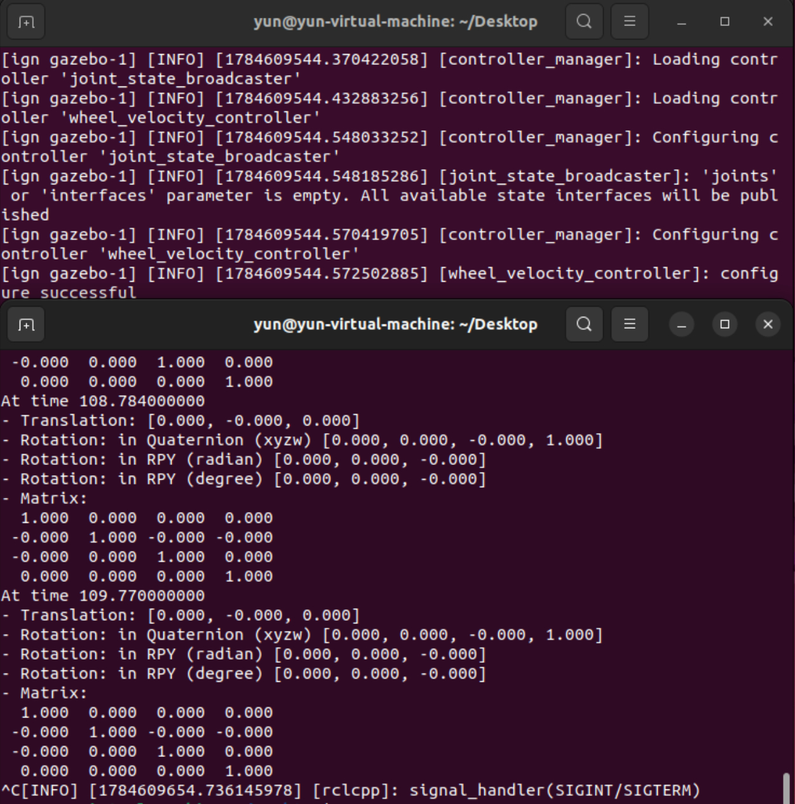
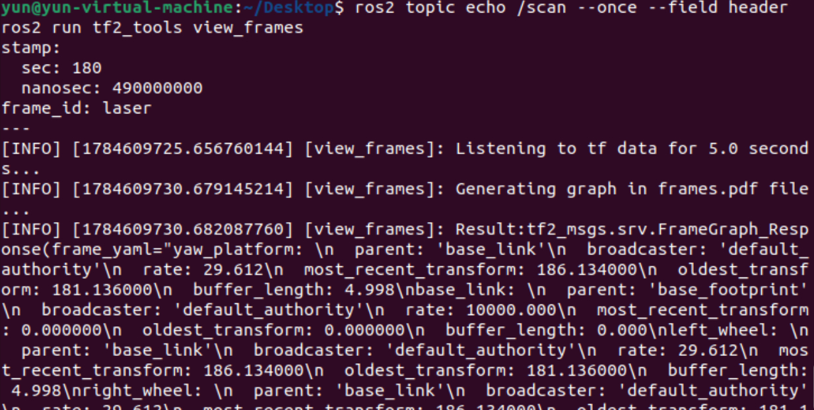
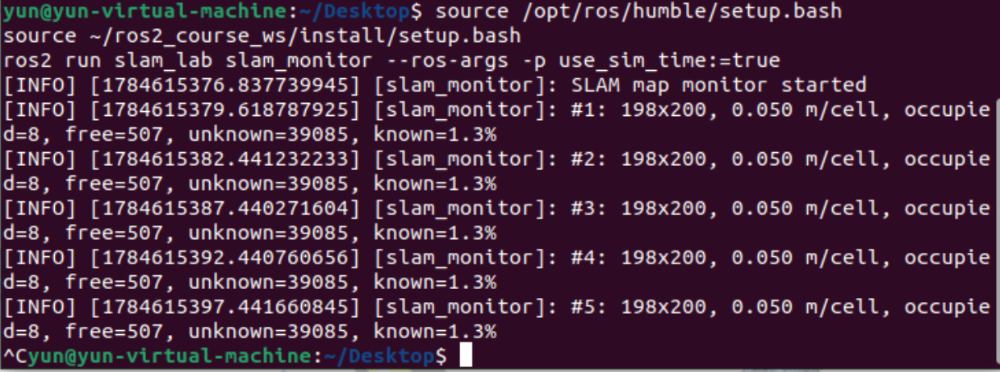
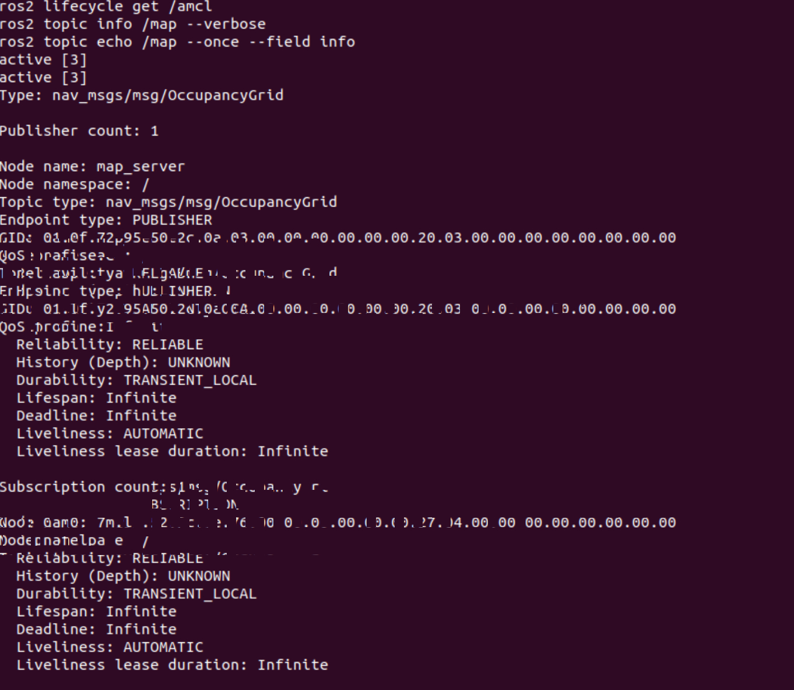
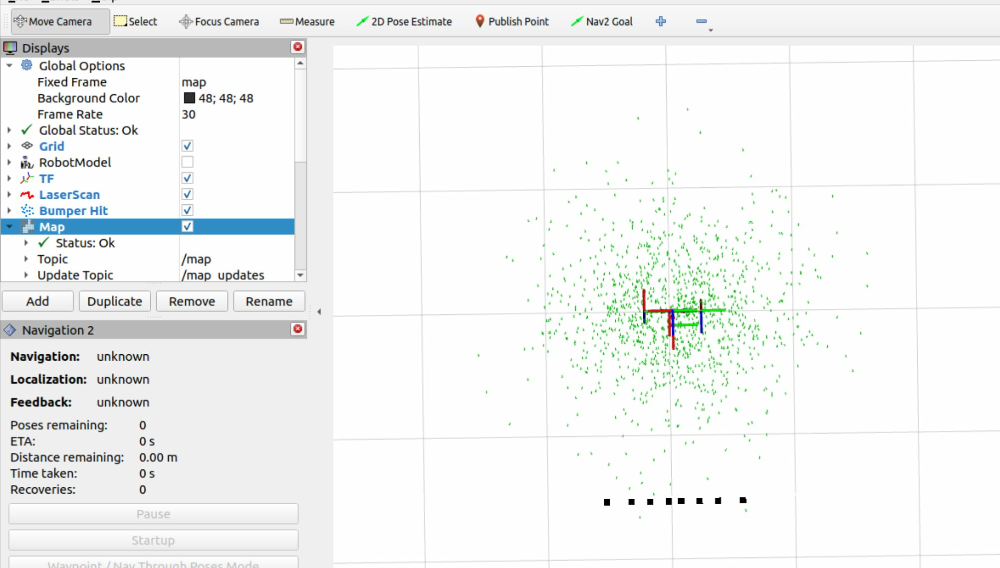
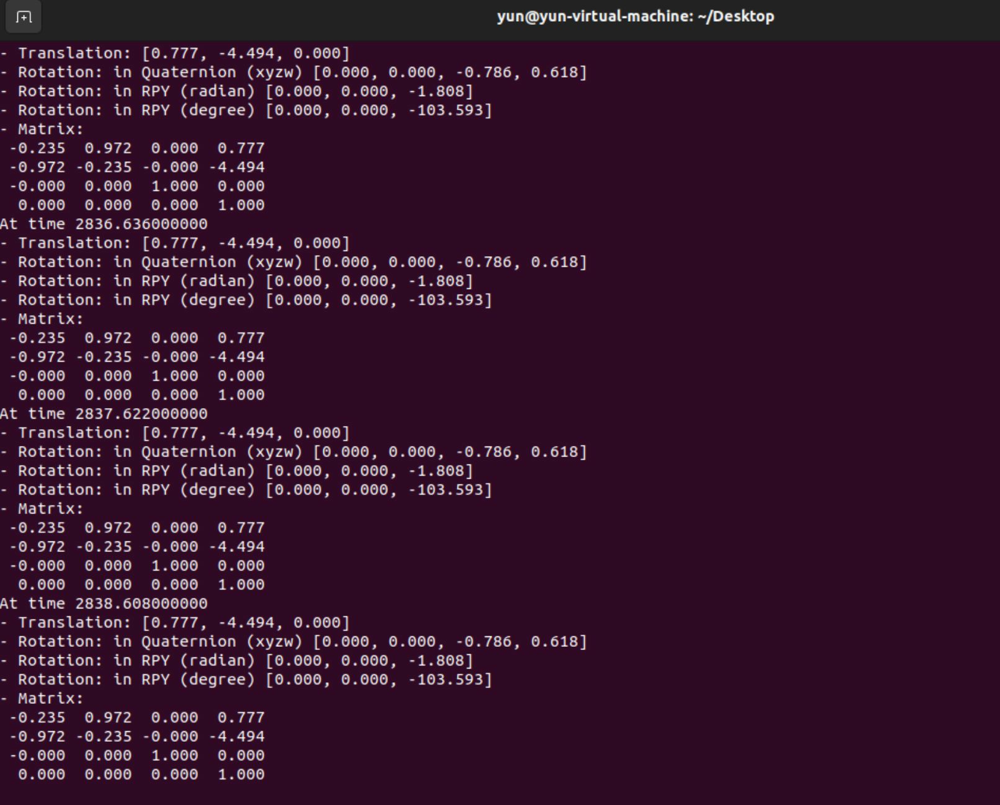
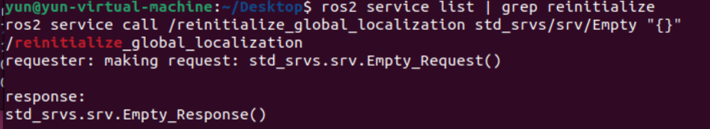
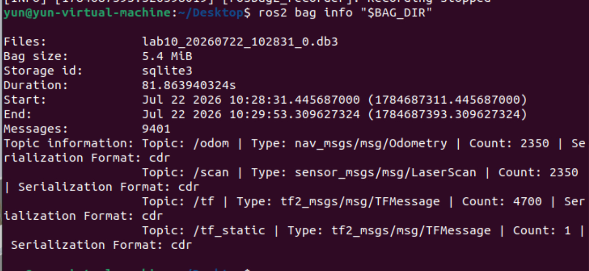
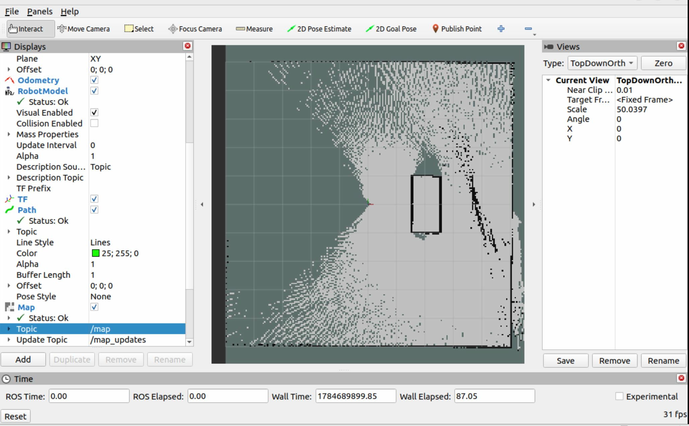

# 第10章 实验指导书：SLAM 建图与定位

## 当前仓库仿真验证：slam_toolbox 在线建图

### 实验目标

使用当前 ROS 2 Jazzy + Gazebo Harmonic 入口，验证激光、里程计、TF 输入经过 `slam_toolbox` 后产生地图更新，并用检查节点给机器人发送可重复运动。

### 运行步骤

```bash
source /opt/ros/jazzy/setup.bash
source install/setup.bash

# 终端 1：Gazebo + slam_toolbox + RViz
ros2 launch slam_sim_demo_ros2 slam_demo.launch.py \
  use_gazebo:=true use_rviz:=true gz_headless:=false
```

```bash
# 终端 2：运动并检查地图增长
source install/setup.bash
ros2 run slam_sim_demo_ros2 slam_map_runner
ros2 topic echo /map --once
```

### 观察与验收

RViz 中添加 Map、LaserScan、TF；终端检查 `map_updates`、`known_cell_growth`、`odom_distance` 和 `scan_updates`，成功时输出 `slam-map-updated`。

源码：`src/slam_sim_demo_ros2/`。启动日志证据：`images/runtime/nonlab_slam.png`。本节验证的是 `slam_toolbox`，不把它的结果标为 Hector、gmapping 或 Cartographer 结果。

## 实际运行证据

真实运行的 `slam_toolbox`、传感器话题和地图更新检查输出：


原始录制：[ch10_slam.cast](images/runtime/ch10_slam.cast)。

> **实验平台**：Ubuntu 22.04 + ROS 2 Humble + Gazebo 仿真
>
> **预计时间**：2 课时（90 分钟）

## 实验准备：创建 slam_lab 功能包

```bash
source /opt/ros/humble/setup.bash
source ~/ros2_course_ws/install/setup.bash

ros2 pkg prefix robot_sim_demo_ros2
ros2 launch robot_sim_demo_ros2 sim_bringup.launch.py --show-args
```

### 安装全部依赖

```bash
source /opt/ros/humble/setup.bash
sudo apt update
sudo apt install -y \
  python3-colcon-common-extensions \
  python3-rosdep \
  python3-setuptools \
  ros-humble-slam-toolbox \
  ros-humble-navigation2 \
  ros-humble-nav2-bringup \
  ros-humble-nav2-map-server \
  ros-humble-rosbag2 \
  ros-humble-cartographer \
  ros-humble-cartographer-ros \
  ros-humble-teleop-twist-keyboard \
  ros-humble-tf2-geometry-msgs \
  ros-humble-tf2-tools
sudo rosdep init 2>/dev/null || true
rosdep update
```

### 创建目录

```bash
source /opt/ros/humble/setup.bash
mkdir -p ~/ros2_course_ws/src
cd ~/ros2_course_ws/src

ros2 pkg create slam_lab \
  --build-type ament_python \
  --license Apache-2.0

cd ~/ros2_course_ws/src/slam_lab
mkdir -p launch config/cartographer
touch resource/slam_lab slam_lab/__init__.py
mkdir -p ~/maps ~/bags ~/lab10
```

最终目录必须是：

```text
slam_lab/
├── package.xml
├── setup.py
├── setup.cfg
├── resource/
│   └── slam_lab
├── slam_lab/
│   ├── __init__.py
│   ├── slam_monitor.py
│   ├── initial_pose_setter.py
│   ├── amcl_evaluator.py
│   └── cartographer_state_saver.py
├── launch/
│   ├── online_mapping.launch.py
│   ├── amcl_localization.launch.py
│   └── cartographer_mapping.launch.py
└── config/
    ├── mapper_params_online_async.yaml
    ├── nav2_localization.yaml
    └── cartographer/
        ├── xbot_2d.lua
        └── Cartographer 官方基础 Lua 文件
```
### package.xml

文件路径：`~/ros2_course_ws/src/slam_lab/package.xml`

```xml
<?xml version="1.0"?>
<?xml-model href="http://download.ros.org/schema/package_format3.xsd"
  schematypens="http://www.w3.org/2001/XMLSchema"?>
<package format="3">
  <name>slam_lab</name>
  <version>0.1.0</version>
  <description>SLAM, AMCL and Cartographer laboratory helpers</description>

  <maintainer email="student@example.com">Student</maintainer>
  <license>Apache-2.0</license>

  <buildtool_depend>ament_python</buildtool_depend>

  <exec_depend>ament_index_python</exec_depend>
  <exec_depend>cartographer_ros</exec_depend>
  <exec_depend>cartographer_ros_msgs</exec_depend>
  <exec_depend>geometry_msgs</exec_depend>
  <exec_depend>launch</exec_depend>
  <exec_depend>launch_ros</exec_depend>
  <exec_depend>nav2_bringup</exec_depend>
  <exec_depend>nav2_map_server</exec_depend>
  <exec_depend>nav_msgs</exec_depend>
  <exec_depend>rclpy</exec_depend>
  <exec_depend>rviz2</exec_depend>
  <exec_depend>slam_toolbox</exec_depend>
  <exec_depend>tf2_geometry_msgs</exec_depend>
  <exec_depend>tf2_ros</exec_depend>

  <export>
    <build_type>ament_python</build_type>
  </export>
</package>
```

### setup.py

文件路径：`~/ros2_course_ws/src/slam_lab/setup.py`

```python
import os
from glob import glob

from setuptools import find_packages, setup


package_name = 'slam_lab'


setup(
    name=package_name,
    version='0.1.0',
    packages=find_packages(exclude=['test']),
    data_files=[
        (
            'share/ament_index/resource_index/packages',
            ['resource/' + package_name],
        ),
        ('share/' + package_name, ['package.xml']),
        (
            os.path.join('share', package_name, 'launch'),
            glob('launch/*.launch.py'),
        ),
        (
            os.path.join('share', package_name, 'config'),
            glob('config/*.yaml'),
        ),
        (
            os.path.join('share', package_name, 'config', 'cartographer'),
            glob('config/cartographer/*.lua'),
        ),
    ],
    install_requires=['setuptools'],
    zip_safe=True,
    maintainer='Student',
    maintainer_email='student@example.com',
    description='SLAM, AMCL and Cartographer laboratory helpers',
    license='Apache-2.0',
    entry_points={
        'console_scripts': [
            'slam_monitor = slam_lab.slam_monitor:main',
            'set_initial_pose = slam_lab.initial_pose_setter:main',
            'amcl_evaluator = slam_lab.amcl_evaluator:main',
            'save_cartographer_state = slam_lab.cartographer_state_saver:main',
        ],
    },
)
```

### setup.cfg

文件路径：`~/ros2_course_ws/src/slam_lab/setup.cfg`

```ini
[develop]
script_dir=$base/lib/slam_lab

[install]
install_scripts=$base/lib/slam_lab
```

### 两个空文件

```text
~/ros2_course_ws/src/slam_lab/resource/slam_lab
~/ros2_course_ws/src/slam_lab/slam_lab/__init__.py
```

### slam_monitor.py

文件路径：`~/ros2_course_ws/src/slam_lab/slam_lab/slam_monitor.py`

```python
#!/usr/bin/env python3
"""Print basic statistics for the current slam_toolbox map."""

import rclpy
from nav_msgs.msg import OccupancyGrid
from rclpy.node import Node
from rclpy.qos import DurabilityPolicy, QoSProfile, ReliabilityPolicy


class SlamMonitor(Node):
    def __init__(self):
        super().__init__('slam_monitor')

        map_qos = QoSProfile(
            depth=1,
            reliability=ReliabilityPolicy.RELIABLE,
            durability=DurabilityPolicy.TRANSIENT_LOCAL,
        )
        self.map_sub = self.create_subscription(
            OccupancyGrid,
            '/map',
            self.map_callback,
            map_qos,
        )
        self.map_count = 0
        self.get_logger().info('SLAM map monitor started')

    def map_callback(self, msg: OccupancyGrid):
        self.map_count += 1
        occupied = sum(value >= 65 for value in msg.data)
        unknown = sum(value < 0 for value in msg.data)
        total = len(msg.data)
        known = total - unknown
        free = known - occupied
        known_ratio = known / total * 100.0 if total else 0.0

        self.get_logger().info(
            f'#{self.map_count}: {msg.info.width}x{msg.info.height}, '
            f'{msg.info.resolution:.3f} m/cell, '
            f'occupied={occupied}, free={free}, unknown={unknown}, '
            f'known={known_ratio:.1f}%'
        )


def main(args=None):
    rclpy.init(args=args)
    node = SlamMonitor()
    try:
        rclpy.spin(node)
    except KeyboardInterrupt:
        pass
    finally:
        node.destroy_node()
        if rclpy.ok():
            rclpy.shutdown()


if __name__ == '__main__':
    main()
```

### initial_pose_setter.py

文件路径：`~/ros2_course_ws/src/slam_lab/slam_lab/initial_pose_setter.py`

```python
#!/usr/bin/env python3
"""Publish an AMCL initial pose from x, y and yaw command-line values."""

import argparse
import math
import sys
import time

import rclpy
from geometry_msgs.msg import PoseWithCovarianceStamped
from rclpy.node import Node
from rclpy.utilities import remove_ros_args


def make_message(node: Node, x: float, y: float, yaw: float):
    message = PoseWithCovarianceStamped()
    message.header.frame_id = 'map'
    message.header.stamp = node.get_clock().now().to_msg()
    message.pose.pose.position.x = x
    message.pose.pose.position.y = y
    message.pose.pose.orientation.z = math.sin(yaw / 2.0)
    message.pose.pose.orientation.w = math.cos(yaw / 2.0)
    message.pose.covariance[0] = 0.25
    message.pose.covariance[7] = 0.25
    message.pose.covariance[35] = 0.0685
    return message


def parse_arguments(raw_args):
    parser = argparse.ArgumentParser()
    parser.add_argument('x', type=float)
    parser.add_argument('y', type=float)
    parser.add_argument('yaw_deg', type=float)
    return parser.parse_args(remove_ros_args(raw_args)[1:])


def main():
    raw_args = sys.argv
    parsed = parse_arguments(raw_args)
    rclpy.init(args=raw_args)

    node = Node('initial_pose_setter')
    publisher = node.create_publisher(
        PoseWithCovarianceStamped,
        '/initialpose',
        10,
    )

    deadline = time.monotonic() + 3.0
    while publisher.get_subscription_count() == 0 and time.monotonic() < deadline:
        rclpy.spin_once(node, timeout_sec=0.1)

    if publisher.get_subscription_count() == 0:
        node.get_logger().warn(
            'No /initialpose subscriber found; check whether AMCL is active'
        )

    yaw = math.radians(parsed.yaw_deg)
    for _ in range(3):
        publisher.publish(make_message(node, parsed.x, parsed.y, yaw))
        rclpy.spin_once(node, timeout_sec=0.2)

    node.get_logger().info(
        f'Published initial pose: x={parsed.x:.2f}, y={parsed.y:.2f}, '
        f'yaw={parsed.yaw_deg:.1f} deg'
    )
    node.destroy_node()
    if rclpy.ok():
        rclpy.shutdown()


if __name__ == '__main__':
    main()
```

### amcl_evaluator.py

文件路径：`~/ros2_course_ws/src/slam_lab/slam_lab/amcl_evaluator.py`

```python
#!/usr/bin/env python3
"""Compare AMCL and simulator ground-truth poses in one TF frame."""

import math

import rclpy
import tf2_geometry_msgs  # Registers geometry message conversions with tf2.
from geometry_msgs.msg import PoseStamped, PoseWithCovarianceStamped
from nav_msgs.msg import Odometry
from rclpy.duration import Duration
from rclpy.node import Node
from tf2_ros import Buffer, TransformException, TransformListener


def yaw_from_pose(pose):
    q = pose.orientation
    return math.atan2(
        2.0 * (q.w * q.z + q.x * q.y),
        1.0 - 2.0 * (q.y * q.y + q.z * q.z),
    )


class AmclEvaluator(Node):
    def __init__(self):
        super().__init__('amcl_evaluator')
        self.declare_parameter('ground_truth_topic', '/ground_truth/odom')
        self.declare_parameter('target_frame', 'map')

        ground_truth_topic = self.get_parameter('ground_truth_topic').value
        self.target_frame = self.get_parameter('target_frame').value
        self.amcl_message = None
        self.ground_truth_message = None

        self.tf_buffer = Buffer()
        self.tf_listener = TransformListener(self.tf_buffer, self)
        self.amcl_sub = self.create_subscription(
            PoseWithCovarianceStamped,
            '/amcl_pose',
            self.amcl_callback,
            10,
        )
        self.ground_truth_sub = self.create_subscription(
            Odometry,
            ground_truth_topic,
            self.ground_truth_callback,
            10,
        )
        self.timer = self.create_timer(1.0, self.evaluate)
        self.get_logger().info(
            f'Comparing /amcl_pose with {ground_truth_topic} in '
            f'{self.target_frame}'
        )

    def amcl_callback(self, msg):
        self.amcl_message = msg

    def ground_truth_callback(self, msg):
        self.ground_truth_message = msg

    def transform_pose(self, header, pose):
        stamped = PoseStamped()
        stamped.header = header
        stamped.pose = pose
        return self.tf_buffer.transform(
            stamped,
            self.target_frame,
            timeout=Duration(seconds=0.2),
        )

    def evaluate(self):
        if self.amcl_message is None or self.ground_truth_message is None:
            return

        try:
            amcl_pose = self.transform_pose(
                self.amcl_message.header,
                self.amcl_message.pose.pose,
            )
            ground_truth_pose = self.transform_pose(
                self.ground_truth_message.header,
                self.ground_truth_message.pose.pose,
            )
        except TransformException as error:
            self.get_logger().warn(f'Cannot transform poses: {error}')
            return

        dx = amcl_pose.pose.position.x - ground_truth_pose.pose.position.x
        dy = amcl_pose.pose.position.y - ground_truth_pose.pose.position.y
        position_error = math.hypot(dx, dy)

        yaw_error = yaw_from_pose(amcl_pose.pose) - yaw_from_pose(
            ground_truth_pose.pose
        )
        yaw_error = math.atan2(math.sin(yaw_error), math.cos(yaw_error))

        self.get_logger().info(
            f'position_error={position_error:.3f} m, '
            f'yaw_error={math.degrees(abs(yaw_error)):.2f} deg'
        )


def main(args=None):
    rclpy.init(args=args)
    node = AmclEvaluator()
    try:
        rclpy.spin(node)
    except KeyboardInterrupt:
        pass
    finally:
        node.destroy_node()
        if rclpy.ok():
            rclpy.shutdown()


if __name__ == '__main__':
    main()
```

### cartographer_state_saver.py

文件路径：`~/ros2_course_ws/src/slam_lab/slam_lab/cartographer_state_saver.py`

```python
#!/usr/bin/env python3
"""Finish one Cartographer trajectory and save its pbstream state."""

import argparse
from pathlib import Path
import sys

from cartographer_ros_msgs.srv import FinishTrajectory, WriteState
import rclpy
from rclpy.node import Node
from rclpy.utilities import remove_ros_args


class CartographerStateSaver(Node):
    def __init__(self):
        super().__init__('cartographer_state_saver')
        self.finish_client = self.create_client(
            FinishTrajectory,
            '/finish_trajectory',
        )
        self.write_client = self.create_client(WriteState, '/write_state')

    def wait_for_services(self):
        if not self.finish_client.wait_for_service(timeout_sec=10.0):
            self.get_logger().error('/finish_trajectory is unavailable')
            return False
        if not self.write_client.wait_for_service(timeout_sec=10.0):
            self.get_logger().error('/write_state is unavailable')
            return False
        return True

    def finish_trajectory(self, trajectory_id):
        request = FinishTrajectory.Request()
        request.trajectory_id = trajectory_id
        future = self.finish_client.call_async(request)
        rclpy.spin_until_future_complete(self, future, timeout_sec=30.0)
        if not future.done() or future.result() is None:
            self.get_logger().error('Failed to finish trajectory')
            return False
        status = getattr(future.result(), 'status', None)
        if status is not None and status.code != 0:
            self.get_logger().error(f'Finish failed: {status.message}')
            return False
        return True

    def write_state(self, filename):
        request = WriteState.Request()
        request.filename = str(filename)
        request.include_unfinished_submaps = True
        future = self.write_client.call_async(request)
        rclpy.spin_until_future_complete(self, future, timeout_sec=30.0)
        if not future.done() or future.result() is None:
            self.get_logger().error('Failed to write Cartographer state')
            return False
        status = getattr(future.result(), 'status', None)
        if status is not None and status.code != 0:
            self.get_logger().error(f'Write failed: {status.message}')
            return False
        return True


def parse_arguments(raw_args):
    parser = argparse.ArgumentParser()
    parser.add_argument('trajectory_id', type=int)
    parser.add_argument('output_file')
    return parser.parse_args(remove_ros_args(raw_args)[1:])


def main():
    raw_args = sys.argv
    parsed = parse_arguments(raw_args)
    output_file = Path(parsed.output_file).expanduser().resolve()
    output_file.parent.mkdir(parents=True, exist_ok=True)

    rclpy.init(args=raw_args)
    node = CartographerStateSaver()
    try:
        if not node.wait_for_services():
            return
        if not node.finish_trajectory(parsed.trajectory_id):
            return
        if node.write_state(output_file):
            node.get_logger().info(f'Saved Cartographer state: {output_file}')
    finally:
        node.destroy_node()
        if rclpy.ok():
            rclpy.shutdown()


if __name__ == '__main__':
    main()
```

### online_mapping.launch.py

文件路径：`~/ros2_course_ws/src/slam_lab/launch/online_mapping.launch.py`

```python
#!/usr/bin/env python3

import os

from ament_index_python.packages import get_package_share_directory
from launch import LaunchDescription
from launch.actions import DeclareLaunchArgument, IncludeLaunchDescription
from launch.conditions import IfCondition
from launch.launch_description_sources import PythonLaunchDescriptionSource
from launch.substitutions import LaunchConfiguration
from launch_ros.actions import Node


def generate_launch_description():
    package_share = get_package_share_directory('slam_lab')
    slam_toolbox_share = get_package_share_directory('slam_toolbox')

    use_sim_time = LaunchConfiguration('use_sim_time')
    params_file = LaunchConfiguration('params_file')
    start_monitor = LaunchConfiguration('start_monitor')

    slam_launch = IncludeLaunchDescription(
        PythonLaunchDescriptionSource(
            os.path.join(
                slam_toolbox_share,
                'launch',
                'online_async_launch.py',
            )
        ),
        launch_arguments={
            'slam_params_file': params_file,
            'use_sim_time': use_sim_time,
        }.items(),
    )

    monitor_node = Node(
        package='slam_lab',
        executable='slam_monitor',
        name='slam_monitor',
        output='screen',
        parameters=[{'use_sim_time': use_sim_time}],
        condition=IfCondition(start_monitor),
    )

    return LaunchDescription([
        DeclareLaunchArgument(
            'use_sim_time',
            default_value='true',
            description='Use the Gazebo /clock topic',
        ),
        DeclareLaunchArgument(
            'params_file',
            default_value=os.path.join(
                package_share,
                'config',
                'mapper_params_online_async.yaml',
            ),
            description='Absolute path to the slam_toolbox parameter file',
        ),
        DeclareLaunchArgument(
            'start_monitor',
            default_value='true',
            description='Start the map statistics node',
        ),
        slam_launch,
        monitor_node,
    ])
```

### amcl_localization.launch.py

文件路径：`~/ros2_course_ws/src/slam_lab/launch/amcl_localization.launch.py`

```python
#!/usr/bin/env python3

import os

from ament_index_python.packages import get_package_share_directory
from launch import LaunchDescription
from launch.actions import DeclareLaunchArgument, IncludeLaunchDescription
from launch.conditions import IfCondition
from launch.launch_description_sources import PythonLaunchDescriptionSource
from launch.substitutions import LaunchConfiguration


def generate_launch_description():
    package_share = get_package_share_directory('slam_lab')
    nav2_share = get_package_share_directory('nav2_bringup')

    map_file = LaunchConfiguration('map')
    params_file = LaunchConfiguration('params_file')
    use_sim_time = LaunchConfiguration('use_sim_time')
    autostart = LaunchConfiguration('autostart')
    use_rviz = LaunchConfiguration('use_rviz')

    localization = IncludeLaunchDescription(
        PythonLaunchDescriptionSource(
            os.path.join(nav2_share, 'launch', 'localization_launch.py')
        ),
        launch_arguments={
            'map': map_file,
            'params_file': params_file,
            'use_sim_time': use_sim_time,
            'autostart': autostart,
        }.items(),
    )

    rviz = IncludeLaunchDescription(
        PythonLaunchDescriptionSource(
            os.path.join(nav2_share, 'launch', 'rviz_launch.py')
        ),
        launch_arguments={'use_sim_time': use_sim_time}.items(),
        condition=IfCondition(use_rviz),
    )

    return LaunchDescription([
        DeclareLaunchArgument(
            'map',
            default_value=os.path.expanduser('~/maps/lab10_map.yaml'),
            description='Absolute path to the saved map YAML file',
        ),
        DeclareLaunchArgument(
            'params_file',
            default_value=os.path.join(
                package_share,
                'config',
                'nav2_localization.yaml',
            ),
            description='Absolute path to the Nav2 localization parameters',
        ),
        DeclareLaunchArgument('use_sim_time', default_value='true'),
        DeclareLaunchArgument('autostart', default_value='true'),
        DeclareLaunchArgument('use_rviz', default_value='true'),
        localization,
        rviz,
    ])
```

### cartographer_mapping.launch.py

文件路径：`~/ros2_course_ws/src/slam_lab/launch/cartographer_mapping.launch.py`

```python
#!/usr/bin/env python3

import os

from ament_index_python.packages import get_package_share_directory
from launch import LaunchDescription
from launch.actions import DeclareLaunchArgument
from launch.substitutions import LaunchConfiguration
from launch_ros.actions import Node


def generate_launch_description():
    package_share = get_package_share_directory('slam_lab')

    configuration_directory = LaunchConfiguration('configuration_directory')
    configuration_basename = LaunchConfiguration('configuration_basename')
    scan_topic = LaunchConfiguration('scan_topic')
    odom_topic = LaunchConfiguration('odom_topic')
    resolution = LaunchConfiguration('resolution')
    use_sim_time = LaunchConfiguration('use_sim_time')

    cartographer_node = Node(
        package='cartographer_ros',
        executable='cartographer_node',
        name='cartographer_node',
        output='screen',
        arguments=[
            '-configuration_directory',
            configuration_directory,
            '-configuration_basename',
            configuration_basename,
        ],
        parameters=[{'use_sim_time': use_sim_time}],
        remappings=[
            ('scan', scan_topic),
            ('odom', odom_topic),
        ],
    )

    occupancy_grid_node = Node(
        package='cartographer_ros',
        executable='cartographer_occupancy_grid_node',
        name='cartographer_occupancy_grid_node',
        output='screen',
        arguments=[
            '-resolution',
            resolution,
            '-publish_period_sec',
            '1.0',
        ],
        parameters=[{'use_sim_time': use_sim_time}],
    )

    return LaunchDescription([
        DeclareLaunchArgument(
            'configuration_directory',
            default_value=os.path.join(
                package_share,
                'config',
                'cartographer',
            ),
        ),
        DeclareLaunchArgument(
            'configuration_basename',
            default_value='xbot_2d.lua',
        ),
        DeclareLaunchArgument('scan_topic', default_value='/scan'),
        DeclareLaunchArgument('odom_topic', default_value='/odom'),
        DeclareLaunchArgument('resolution', default_value='0.05'),
        DeclareLaunchArgument('use_sim_time', default_value='true'),
        cartographer_node,
        occupancy_grid_node,
    ])
```

### mapper_params_online_async.yaml

文件路径：`~/ros2_course_ws/src/slam_lab/config/mapper_params_online_async.yaml`

```yaml
slam_toolbox:
  ros__parameters:
    solver_plugin: solver_plugins::CeresSolver
    ceres_linear_solver: SPARSE_NORMAL_CHOLESKY
    ceres_preconditioner: SCHUR_JACOBI
    ceres_trust_strategy: LEVENBERG_MARQUARDT
    ceres_dogleg_type: TRADITIONAL_DOGLEG
    ceres_loss_function: None

    odom_frame: odom
    map_frame: map
    base_frame: base_link
    scan_topic: /scan
    use_map_saver: true
    mode: mapping

    debug_logging: false
    throttle_scans: 1
    transform_publish_period: 0.02
    map_update_interval: 5.0
    resolution: 0.05
    max_laser_range: 12.0
    minimum_time_interval: 0.5
    transform_timeout: 0.2
    tf_buffer_duration: 30.0
    stack_size_to_use: 40000000
    enable_interactive_mode: true

    use_scan_matching: true
    use_scan_barycenter: true
    minimum_travel_distance: 0.2
    minimum_travel_heading: 0.2
    scan_buffer_size: 10
    scan_buffer_maximum_scan_distance: 10.0
    link_match_minimum_response_fine: 0.1
    link_scan_maximum_distance: 1.5
    loop_search_maximum_distance: 3.0
    do_loop_closing: true
    loop_match_minimum_chain_size: 10
    loop_match_maximum_variance_coarse: 3.0
    loop_match_minimum_response_coarse: 0.35
    loop_match_minimum_response_fine: 0.45

    correlation_search_space_dimension: 0.5
    correlation_search_space_resolution: 0.01
    correlation_search_space_smear_deviation: 0.1

    loop_search_space_dimension: 8.0
    loop_search_space_resolution: 0.05
    loop_search_space_smear_deviation: 0.03

    distance_variance_penalty: 0.5
    angle_variance_penalty: 1.0
    fine_search_angle_offset: 0.00349
    coarse_search_angle_offset: 0.349
    coarse_angle_resolution: 0.0349
    minimum_angle_penalty: 0.9
    minimum_distance_penalty: 0.5
    use_response_expansion: true
```

### nav2_localization.yaml

文件路径：`~/ros2_course_ws/src/slam_lab/config/nav2_localization.yaml`

```yaml
amcl:
  ros__parameters:
    use_sim_time: true
    alpha1: 0.2
    alpha2: 0.2
    alpha3: 0.2
    alpha4: 0.2
    alpha5: 0.2
    base_frame_id: base_link
    beam_skip_distance: 0.5
    beam_skip_error_threshold: 0.9
    beam_skip_threshold: 0.3
    do_beamskip: false
    global_frame_id: map
    lambda_short: 0.1
    laser_likelihood_max_dist: 2.0
    laser_max_range: 12.0
    laser_min_range: 0.15
    laser_model_type: likelihood_field
    max_beams: 60
    max_particles: 2000
    min_particles: 500
    odom_frame_id: odom
    pf_err: 0.05
    pf_z: 0.99
    recovery_alpha_fast: 0.0
    recovery_alpha_slow: 0.0
    resample_interval: 1
    robot_model_type: nav2_amcl::DifferentialMotionModel
    save_pose_rate: 0.5
    sigma_hit: 0.2
    tf_broadcast: true
    transform_tolerance: 1.0
    update_min_a: 0.2
    update_min_d: 0.25
    z_hit: 0.5
    z_max: 0.05
    z_rand: 0.5
    z_short: 0.05
    scan_topic: scan
    set_initial_pose: false
    always_reset_initial_pose: false
    first_map_only: false

map_server:
  ros__parameters:
    use_sim_time: true
    yaml_filename: ''
    topic_name: map
    frame_id: map

lifecycle_manager_localization:
  ros__parameters:
    use_sim_time: true
    autostart: true
    node_names: [map_server, amcl]
    bond_timeout: 4.0
```

### xbot_2d.lua

文件路径：`~/ros2_course_ws/src/slam_lab/config/cartographer/xbot_2d.lua`

Cartographer 的 `map_builder.lua`、`trajectory_builder.lua` 及其依赖文件属于已安装的 Cartographer 软件包，不是本实验重新编写的代码。先复制官方基础文件，再创建下面这个完整的机器人配置：

```bash
cd ~/ros2_course_ws/src/slam_lab
CARTO_CONFIG="$(ros2 pkg prefix cartographer_ros)/share/cartographer_ros/configuration_files"
cp "$CARTO_CONFIG"/*.lua config/cartographer/
nano config/cartographer/xbot_2d.lua
```

```lua
include "map_builder.lua"
include "trajectory_builder.lua"

options = {
  map_builder = MAP_BUILDER,
  trajectory_builder = TRAJECTORY_BUILDER,

  map_frame = "map",
  tracking_frame = "base_link",
  published_frame = "odom",
  odom_frame = "odom",
  provide_odom_frame = false,
  publish_frame_projected_to_2d = true,

  use_odometry = true,
  use_nav_sat = false,
  use_landmarks = false,

  num_laser_scans = 1,
  num_multi_echo_laser_scans = 0,
  num_subdivisions_per_laser_scan = 1,
  num_point_clouds = 0,

  lookup_transform_timeout_sec = 0.2,
  submap_publish_period_sec = 0.3,
  pose_publish_period_sec = 0.005,
  trajectory_publish_period_sec = 0.03,

  rangefinder_sampling_ratio = 1.0,
  odometry_sampling_ratio = 1.0,
  fixed_frame_pose_sampling_ratio = 1.0,
  imu_sampling_ratio = 1.0,
  landmarks_sampling_ratio = 1.0,
}

MAP_BUILDER.use_trajectory_builder_2d = true

TRAJECTORY_BUILDER_2D.use_imu_data = false
TRAJECTORY_BUILDER_2D.min_range = 0.15
TRAJECTORY_BUILDER_2D.max_range = 12.0
TRAJECTORY_BUILDER_2D.missing_data_ray_length = 5.0
TRAJECTORY_BUILDER_2D.num_accumulated_range_data = 1

POSE_GRAPH.optimize_every_n_nodes = 90
POSE_GRAPH.constraint_builder.sampling_ratio = 0.3
POSE_GRAPH.constraint_builder.min_score = 0.55

return options
```

### 编译完整功能包

Cartographer 官方 Lua 基础文件必须已经复制到 `config/cartographer/`，否则 `include` 无法解析。然后编译：

```bash
cd ~/ros2_course_ws
source /opt/ros/humble/setup.bash
rosdep install --from-paths src/slam_lab --ignore-src -r -y
colcon build --packages-select slam_lab --symlink-install
source install/setup.bash

ros2 pkg prefix slam_lab
ros2 pkg executables slam_lab
ros2 launch slam_lab online_mapping.launch.py --show-args
ros2 launch slam_lab amcl_localization.launch.py --show-args
ros2 launch slam_lab cartographer_mapping.launch.py --show-args
```

每个新终端都执行：

```bash
source /opt/ros/humble/setup.bash
source ~/ros2_course_ws/install/setup.bash
```

## 练习1：slam_toolbox 在线建图（约30分钟）

### 启动仿真

```bash
source /opt/ros/humble/setup.bash
source ~/ros2_course_ws/install/setup.bash

ros2 launch robot_sim_demo_ros2 sim_bringup.launch.py \
  use_gazebo:=true \
  gz_headless:=false \
  use_rviz:=false
```

### 检查传感器和 TF
```bash
source /opt/ros/humble/setup.bash
source ~/ros2_course_ws/install/setup.bash

ros2 topic list | grep -E '^/(scan|odom|clock|tf|tf_static)$'
ros2 topic type /scan
ros2 topic echo /scan --once
ros2 topic echo /odom --once
ros2 run tf2_ros tf2_echo odom base_link
```



```bash
ros2 topic echo /scan --once --field header
ros2 run tf2_tools view_frames
```



### slam_toolbox 参数

```bash
source /opt/ros/humble/setup.bash
source ~/ros2_course_ws/install/setup.bash

SLAM_LAB_SHARE="$(ros2 pkg prefix slam_lab)/share/slam_lab"
test -f "$SLAM_LAB_SHARE/config/mapper_params_online_async.yaml"
grep -nE 'odom_frame|map_frame|base_frame|scan_topic|mode|resolution|max_laser_range|use_sim_time' \
  "$SLAM_LAB_SHARE/config/mapper_params_online_async.yaml"
```
### 启动在线异步建图

```bash
source /opt/ros/humble/setup.bash
source ~/ros2_course_ws/install/setup.bash

ros2 launch slam_lab online_mapping.launch.py \
  use_sim_time:=true \
  start_monitor:=true
```

```bash
source /opt/ros/humble/setup.bash
source ~/ros2_course_ws/install/setup.bash

ros2 node list | grep slam
ros2 topic info /map --verbose
ros2 topic echo /map --once --field info
ros2 service list | grep slam_toolbox
```
### 启动 RViz2

```bash
source /opt/ros/humble/setup.bash
source ~/ros2_course_ws/install/setup.bash

rviz2 --ros-args -p use_sim_time:=true
```

在 RViz2 中设置：

1. `Fixed Frame` 设为 `map`；
2. 添加 `Map`，Topic 设为 `/map`；
3. 添加 `LaserScan`，Topic 设为 `/scan`；
4. 添加 `TF` 和 `RobotModel`；
5. 确认地图、激光扫描和机器人位姿重合。

配置完成后在 RViz2 中保存为 `~/lab10/slam_view.rviz`，下次使用：

```bash
rviz2 -d ~/lab10/slam_view.rviz --ros-args -p use_sim_time:=true
```

### 键盘遥控并探索环境
```bash
source /opt/ros/humble/setup.bash
source ~/ros2_course_ws/install/setup.bash

ros2 run teleop_twist_keyboard teleop_twist_keyboard \
  --ros-args \
  -p speed:=0.3 \
  -p turn:=0.8 \
```

### 检查并保存地图

```bash
source /opt/ros/humble/setup.bash
source ~/ros2_course_ws/install/setup.bash

ros2 run nav2_map_server map_saver_cli \
  -t /map \
  -f "$HOME/maps/lab10_map" \
  --ros-args \
  -p use_sim_time:=true \
  -p save_map_timeout:=20.0

test -s "$HOME/maps/lab10_map.pgm" && \
test -s "$HOME/maps/lab10_map.yaml" && \
echo '地图文件保存成功'
ls -lh "$HOME/maps/lab10_map.pgm" "$HOME/maps/lab10_map.yaml"
```
### 可运行的地图监控脚本

```bash
source /opt/ros/humble/setup.bash
source ~/ros2_course_ws/install/setup.bash
ros2 run slam_lab slam_monitor --ros-args -p use_sim_time:=true
```



---

## 练习2：加载地图并使用 AMCL 定位（约30分钟）

### 停止建图节点并确认地图文件

```bash
source /opt/ros/humble/setup.bash
source ~/ros2_course_ws/install/setup.bash

test -s "$HOME/maps/lab10_map.yaml"
test -s "$HOME/maps/lab10_map.pgm"
grep -E '^[[:space:]]*(image|resolution|origin|occupied_thresh|free_thresh):' \
  "$HOME/maps/lab10_map.yaml"
```

### 启动仿真

```bash
source /opt/ros/humble/setup.bash
source ~/ros2_course_ws/install/setup.bash

ros2 launch robot_sim_demo_ros2 sim_bringup.launch.py \
  use_gazebo:=true \
  gz_headless:=false \
  use_rviz:=false
```

### 启动 AMCL 和地图服务器

```bash
source /opt/ros/humble/setup.bash
source ~/ros2_course_ws/install/setup.bash

ros2 launch slam_lab amcl_localization.launch.py \
  map:=$HOME/maps/lab10_map.yaml \
  use_sim_time:=true \
  use_rviz:=false \
  autostart:=true
```
检查生命周期状态：

```bash
source /opt/ros/humble/setup.bash
source ~/ros2_course_ws/install/setup.bash

ros2 lifecycle get /map_server
ros2 lifecycle get /amcl
ros2 topic info /map --verbose
ros2 topic echo /map --once --field info
```



### 启动 RViz2 并设置初始位姿

```bash
source /opt/ros/humble/setup.bash
source ~/ros2_course_ws/install/setup.bash

rviz2 -d /opt/ros/humble/share/nav2_bringup/rviz/nav2_default_view.rviz \
  --ros-args -p use_sim_time:=true
```

在 RViz2 中：

1. `Fixed Frame` 设为 `map`；
2. 确认 `Map` 的 Topic 是 `/map`；
3. 添加或确认 `LaserScan` 的 Topic 是 `/scan`；
4. 点击 `2D Pose Estimate`，在地图中点击机器人位置并拖动箭头指定朝向；
5. 观察粒子云是否逐渐收敛到机器人附近。



```bash
source /opt/ros/humble/setup.bash
source ~/ros2_course_ws/install/setup.bash

# 可以按地图实际位置修改三个数值，yaw 单位为度
ros2 run slam_lab set_initial_pose 0.0 0.0 0.0 \
  --ros-args -p use_sim_time:=true
```

### 验证 AMCL 输出

```bash
source /opt/ros/humble/setup.bash
source ~/ros2_course_ws/install/setup.bash

ros2 topic echo /amcl_pose --once
ros2 topic echo /particle_cloud --once
ros2 run tf2_ros tf2_echo map base_link
```



Nav2 AMCL 的粒子话题是 `/particle_cloud`。移动机器人后可观察频率：

```bash
ros2 topic hz /amcl_pose
```

### 进行移动和全局重定位测试

```bash
source /opt/ros/humble/setup.bash
source ~/ros2_course_ws/install/setup.bash

ros2 run teleop_twist_keyboard teleop_twist_keyboard \
  --ros-args -p speed:=0.2 -p turn:=0.6
```

先在地图中移动到不同区域，再停止机器人并观察 `/amcl_pose` 是否稳定。要测试全局重定位，先在 RViz2 中给出明显错误的初始位姿，然后执行：

```bash
ros2 service list | grep reinitialize
ros2 service call /reinitialize_global_localization std_srvs/srv/Empty "{}"
```



---

## 练习3：Cartographer 2D 建图和地图导出（扩展，约30分钟）

> 使用 `museum.sdf` 世界文件模拟"两层"地图的两次独立建图流程。
###  检查 Cartographer 和楼层资源

```bash
source /opt/ros/humble/setup.bash
source ~/ros2_course_ws/install/setup.bash

ros2 pkg prefix cartographer_ros
ros2 pkg executables cartographer_ros | grep -E 'cartographer_node|occupancy_grid|pbstream'

WORLD_DIR="$(ros2 pkg prefix robot_sim_demo_ros2)/share/robot_sim_demo_ros2/worlds"
ls -lah "$WORLD_DIR"
```

使用现有的 `museum.sdf` 作为建筑世界：

```bash
FLOOR_WORLD="$WORLD_DIR/museum.sdf"
test -f "$FLOOR_WORLD" && echo '博物馆世界文件已找到'
```

Shell 变量只在当前终端有效。后续打开新终端时，需要重新设置 `WORLD_DIR` 和 `FLOOR_WORLD`。

### 创建完整 Lua 配置

完整的 `xbot_2d.lua` 已在实验准备部分给出，并安装在 `slam_lab` 中。Cartographer 官方基础 Lua 文件也必须位于同一目录。检查：

```bash
source /opt/ros/humble/setup.bash
source ~/ros2_course_ws/install/setup.bash

CARTO_LAB_CONFIG="$(ros2 pkg prefix slam_lab)/share/slam_lab/config/cartographer"
test -f "$CARTO_LAB_CONFIG/xbot_2d.lua"
test -f "$CARTO_LAB_CONFIG/map_builder.lua"
test -f "$CARTO_LAB_CONFIG/trajectory_builder.lua"
ls -1 "$CARTO_LAB_CONFIG" | head
```

若任何 `test` 失败，回到“xbot_2d.lua”和“编译完整功能包”步骤重新复制基础 Lua 并编译。配置中的 `provide_odom_frame = false` 是因为 XBot-U 仿真已经提供 `odom -> base_link`；若实际机器人没有这条 TF，应按实际 TF 架构修改。

### 启动第一轮 Cartographer

先停止练习1或练习2的 SLAM/AMCL 节点。打开终端1启动仿真：

```bash
source /opt/ros/humble/setup.bash
source ~/ros2_course_ws/install/setup.bash

WORLD_DIR="$(ros2 pkg prefix robot_sim_demo_ros2)/share/robot_sim_demo_ros2/worlds"
FLOOR_WORLD="$WORLD_DIR/museum.sdf"

ros2 launch robot_sim_demo_ros2 sim_bringup.launch.py \
  world:="$FLOOR_WORLD" \
  use_gazebo:=true \
  gz_headless:=false \
  use_rviz:=false
```

打开终端2，同时启动 Cartographer 和栅格地图节点：

```bash
source /opt/ros/humble/setup.bash
source ~/ros2_course_ws/install/setup.bash

ros2 launch slam_lab cartographer_mapping.launch.py \
  scan_topic:=/scan \
  odom_topic:=/odom \
  resolution:=0.05 \
  use_sim_time:=true
```

打开终端3遥控和终端4 RViz2：

```bash
# 终端3
source /opt/ros/humble/setup.bash
source ~/ros2_course_ws/install/setup.bash
ros2 run teleop_twist_keyboard teleop_twist_keyboard \
  --ros-args -p speed:=0.2 -p turn:=0.6 
```

```bash
# 终端4
source /opt/ros/humble/setup.bash
source ~/ros2_course_ws/install/setup.bash
rviz2 --ros-args -p use_sim_time:=true
```

RViz2 的 `Fixed Frame` 设为 `map`，添加 `/map`、`/scan` 和 `TF`。确认 Cartographer 的地图在机器人移动时更新。

### 保存并导出第一轮地图

先查看当前轨迹编号。通常新启动的 Cartographer 轨迹编号为 `0`，但应以 `/submap_list` 实际输出为准：

```bash
ros2 topic echo /submap_list --once
ros2 service list | grep -E 'finish_trajectory|write_state'
```

建图完成后，在终端5运行实验准备部分完整给出的状态保存节点：

```bash
source /opt/ros/humble/setup.bash
source ~/ros2_course_ws/install/setup.bash
mkdir -p "$HOME/maps"

ros2 run slam_lab save_cartographer_state \
  0 "$HOME/maps/floor1.pbstream"

test -s "$HOME/maps/floor1.pbstream" && echo 'floor1 状态保存成功'
```

该节点依次调用 ROS 2 的 `/finish_trajectory` 和 `/write_state` 服务，并检查返回状态。旧版的 `rosservice call` 是 ROS 1 命令，在 ROS 2 Humble 中不可用。

停止 Cartographer 节点后，将状态转换为 Nav2 可读取的地图：

```bash
ros2 run cartographer_ros cartographer_pbstream_to_ros_map \
  -pbstream_filename "$HOME/maps/floor1.pbstream" \
  -map_filestem "$HOME/maps/floor1_map" \
  -resolution 0.05

ls -lh "$HOME/maps/floor1_map.pgm" "$HOME/maps/floor1_map.yaml"
```

### 3.5 第二轮地图

第二轮必须使用全新的仿真和 Cartographer 进程。先停止第一轮的 Gazebo、Cartographer、occupancy grid 和 teleop，再执行：

```bash
# 终端1：重新启动仿真（同一世界，模拟第二层）
source /opt/ros/humble/setup.bash
source ~/ros2_course_ws/install/setup.bash

WORLD_DIR="$(ros2 pkg prefix robot_sim_demo_ros2)/share/robot_sim_demo_ros2/worlds"
FLOOR_WORLD="$WORLD_DIR/museum.sdf"

ros2 launch robot_sim_demo_ros2 sim_bringup.launch.py \
  world:="$FLOOR_WORLD" \
  use_gazebo:=true \
  gz_headless:=false \
  use_rviz:=false
```

使用与第一轮相同的 Cartographer 和遥控命令，完成探索后保存：

```bash
source /opt/ros/humble/setup.bash
source ~/ros2_course_ws/install/setup.bash

ros2 run slam_lab save_cartographer_state \
  0 "$HOME/maps/floor2.pbstream"

ros2 run cartographer_ros cartographer_pbstream_to_ros_map \
  -pbstream_filename "$HOME/maps/floor2.pbstream" \
  -map_filestem "$HOME/maps/floor2_map" \
  -resolution 0.05

ls -lh "$HOME/maps/floor2_map.pgm" "$HOME/maps/floor2_map.yaml"
```

---

## 练习4：rosbag 回放建图（约15分钟）

### 录制建图数据

停止所有 SLAM、AMCL 和 Cartographer 节点。打开终端1重新启动仿真：

```bash
source /opt/ros/humble/setup.bash
source ~/ros2_course_ws/install/setup.bash

ros2 launch robot_sim_demo_ros2 sim_bringup.launch.py \
  use_gazebo:=true \
  gz_headless:=false \
  use_rviz:=false
```

打开终端2，先确认传感器和控制话题已经就绪：

```bash
source /opt/ros/humble/setup.bash
source ~/ros2_course_ws/install/setup.bash

ros2 topic list | grep -E '^/(scan|odom|tf|tf_static|cmd_vel_teleop)$'
ros2 topic info /scan --verbose
ros2 topic info /cmd_vel_teleop --verbose
```

在终端2开始录制：

```bash
source /opt/ros/humble/setup.bash
source ~/ros2_course_ws/install/setup.bash

mkdir -p "$HOME/bags"
BAG_DIR="$HOME/bags/lab10_$(date +%Y%m%d_%H%M%S)"
printf '%s\n' "$BAG_DIR" | tee "$HOME/bags/latest_bag.txt"

ros2 bag record -o "$BAG_DIR" \
  /scan /odom /tf /tf_static
```

看到 `All requested topics are subscribed` 后保持终端2运行。打开终端3遥控机器人覆盖环境：

```bash
source /opt/ros/humble/setup.bash
source ~/ros2_course_ws/install/setup.bash

ros2 run teleop_twist_keyboard teleop_twist_keyboard \
  --ros-args \
  -p speed:=0.3 \
  -p turn:=0.8 \
  -r cmd_vel:=/cmd_vel_teleop
```

`/cmd_vel_teleop` 会经过 `twist_mux -> /cmd_vel -> gazebo_interface_bridge` 转换为底层轮速命令。

等待出现 `Recording stopped` 后检查包内容：

```bash
source /opt/ros/humble/setup.bash
source ~/ros2_course_ws/install/setup.bash

BAG_DIR="$(cat "$HOME/bags/latest_bag.txt")"
test -d "$BAG_DIR"
ros2 bag info "$BAG_DIR"
```



### 回放数据并建图

停止 Gazebo，避免回放期间同时存在两套 `/scan`、`/odom` 和 TF 发布者。确认 Gazebo、`fake_laser` 和控制器节点已经退出，再打开终端1启动同步建图：

```bash
source /opt/ros/humble/setup.bash
source ~/ros2_course_ws/install/setup.bash

ros2 node list | grep -E 'gazebo|fake_laser|controller_manager'
ros2 topic info /scan --verbose
ros2 topic info /odom --verbose
```

节点过滤命令应无输出，`/scan` 和 `/odom` 应不存在或显示 `Publisher count: 0`。然后启动同步建图：

```bash
source /opt/ros/humble/setup.bash
source ~/ros2_course_ws/install/setup.bash

SLAM_PARAMS="$(ros2 pkg prefix slam_lab)/share/slam_lab/config/mapper_params_online_async.yaml"
ros2 launch slam_toolbox online_sync_launch.py \
  slam_params_file:="$SLAM_PARAMS" \
  use_sim_time:=true
```

看到 `/slam_toolbox` 节点后，打开终端2回放：

```bash
source /opt/ros/humble/setup.bash
source ~/ros2_course_ws/install/setup.bash

BAG_DIR="$(cat "$HOME/bags/latest_bag.txt")"
test -d "$BAG_DIR"
ros2 bag play "$BAG_DIR" --clock --rate 0.5
```

打开终端3运行 RViz2，固定坐标系设为 `map`，观察地图是否随着回放生成：

```bash
source /opt/ros/humble/setup.bash
source ~/ros2_course_ws/install/setup.bash

rviz2 --ros-args -p use_sim_time:=true
```

如果练习1已经保存 RViz 配置，也可以运行：

```bash
rviz2 -d "$HOME/lab10/slam_view.rviz" \
  --ros-args -p use_sim_time:=true
```

RViz2 的 `Fixed Frame` 设为 `map`，添加 `/map`、`/scan` 和 `TF`。当前 VM 可能输出 GLSL 着色器错误，但只要日志持续出现 `Trying to create a map` 且地图尺寸更新，就不影响建图结果。



回放过程中打开终端4验证数据来源、地图和 TF：

```bash
source /opt/ros/humble/setup.bash
source ~/ros2_course_ws/install/setup.bash

ros2 node list | grep -E 'rosbag2_player|slam_toolbox'
ros2 topic info /clock --verbose
ros2 topic info /scan --verbose
ros2 topic info /odom --verbose
ros2 topic info /map --verbose
ros2 topic echo /map --once --field info
ros2 run tf2_ros tf2_echo map base_link
```

看到 `map -> base_link` 连续输出后停止 `tf2_echo`。`/clock`、`/scan` 和 `/odom` 应各有一个来自 `rosbag2_player` 的发布者，`/map` 应由 `slam_toolbox` 发布。`/tf` 同时包含 rosbag 回放的里程计 TF 和 slam_toolbox 发布的 `map -> odom`，因此可能有两个发布者，这是正常现象。偶尔出现一条 `Message Filter dropping message ... queue is full` 通常是启动瞬间的缓存抖动；如果持续出现，停止回放并把 `--rate 0.5` 降到 `--rate 0.2`。

回放结束后保存地图：

```bash
source /opt/ros/humble/setup.bash
source ~/ros2_course_ws/install/setup.bash

mkdir -p "$HOME/maps"
ros2 topic info /map --verbose

ros2 run nav2_map_server map_saver_cli \
  -t /map \
  -f "$HOME/maps/lab10_replayed_map" \
  --ros-args \
  -p use_sim_time:=true \
  -p save_map_timeout:=20.0

test -s "$HOME/maps/lab10_replayed_map.pgm" && \
test -s "$HOME/maps/lab10_replayed_map.yaml" && \
echo '回放地图保存成功'
ls -lh "$HOME/maps/lab10_replayed_map.pgm" \
       "$HOME/maps/lab10_replayed_map.yaml"
```
