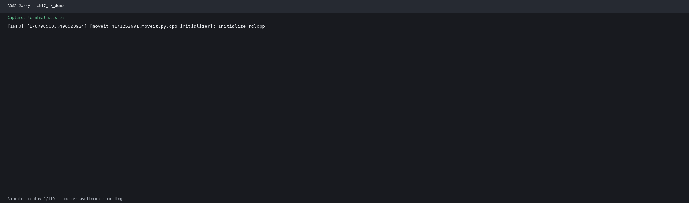

# 第17章 实验：MoveIt2 基础与运动学规划

## 当前仓库仿真验证：xArm FK/IK 与 MotionPlanning

### 实验目标

在 xArm6 的 MoveIt2/RViz 环境中验证规划组、正逆运动学目标和关节状态，配合本实验的 MoveItPy 程序检查规划结果。

### 运行步骤

需要兼容的外部 `xarm_description` 2.0.0：

```bash
source /opt/ros/jazzy/setup.bash
source install/setup.bash
source /path/to/xarm_description_workspace/install/setup.bash
ros2 launch xarm_ros2_arm_only arm_only_move_group.launch.py use_rviz:=true
```

```bash
source install/setup.bash
ros2 run moveit_fk_ik_lab fk_demo
ros2 topic echo /joint_states --once
```

### 观察与验收

RViz 中检查 `xarm` 规划组和 `gripper_centor_link` 末端；程序输出的关节目标与 RViz 轨迹应能对应。源码：`src/lab_code/ch17_lab/moveit_fk_ik_lab/`、`src/xarm/config/`。缺少底层描述包时只记录为环境未满足。

## 实际运行证据

真实运行的 MoveIt 运动学规划和 xArm 控制器输出：




原始录制：[ch17_ik_demo.cast](images/runtime/ch17_ik_demo.cast)。

> **对应理论章节**：第26章《MoveIt2配置与基础规划》、第27章《Python关节空间规划》
> **实验课时**：4课时  
> **实验代码**：`src/lab_code/ch17_lab/moveit_fk_ik_lab/`  

## 实验目标
- 掌握MoveIt2 Setup Assistant的使用方法
- 学会生成机械臂MoveIt2配置功能包
- 理解正运动学和逆运动学求解原理
- 能够使用MotionPlanning插件进行运动规划
- 掌握MoveItPy的基本编程方法
- 学会使用PlanningComponent进行关节空间规划
- 实现机械臂的多目标关节运动序列
- 掌握正运动学和逆运动学两种目标设置方式

## 实验环境
- ROS 2 Jazzy + MoveIt2
- xarm_description功能包
- RViz2 + MotionPlanning插件
- MoveIt2 Setup Assistant
- moveit_py

**MoveIt 前置依赖（统一说明）**：本章及后续 MoveIt 相关实验（第18章、第21章）开始前，需先启动 xArm 仿真与 MoveIt：

```bash
# 方式1: 纯 MoveIt + RViz 仿真（不含 Gazebo）
ros2 launch xarm_ros2_arm_only arm_only_move_group.launch.py

# 方式2: 含 Gazebo 的完整仿真（本章参考代码 README 使用的命令）
ros2 launch xarm_ros2_arm_only arm_only.launch.py
```

默认使用上述 `xarm_ros2_arm_only` 启动命令。17.1 节的 MoveIt Setup Assistant 流程仅作为自行生成配置包的可选练习；生成后请使用实际包名及其生成的 launch 文件。

## 参考代码说明
`src/lab_code/ch17_lab/moveit_fk_ik_lab/`（ament_python 包）提供以下程序，覆盖本章 FK/IK 规划练习：

| 程序 | 功能 |
|------|------|
| `fk_demo.py` | 正运动学（FK）演示：关节空间目标 + 夹爪开合 + Home 归位 |
| `ik_demo.py` | 逆运动学（IK）演示：设置末端目标位姿（位置+姿态），由 MoveIt2 解算 IK 并运动 |
| `fk_ik_exercise.py` | FK/IK 综合练习（含 TODO 填空） |
| `rectangle_exercise.py` | 笛卡尔路径矩形轨迹规划练习 |

构建：
```bash
cd <工作区根目录>
colcon build --symlink-install --packages-select moveit_fk_ik_lab
source install/setup.bash
```

## 17.1 MoveIt2 配置与基础规划

### 17.1.1 安装MoveIt2
```bash
sudo apt install ros-jazzy-moveit ros-jazzy-moveit-py
sudo apt install ros-jazzy-moveit-setup-assistant

# 验证安装
ros2 pkg list | grep moveit
```

### 17.1.2 准备机械臂模型
确保已准备与课程配置兼容的 XBot Arm `xarm_description` 2.0.0：
```bash
source /path/to/xarm_description_workspace/install/setup.bash

# 找到URDF文件路径
ros2 pkg prefix xarm_description
ls $(ros2 pkg prefix xarm_description)/share/xarm_description/urdf/
```

### 17.1.3 启动Setup Assistant
```bash
# 新建终端
ros2 launch moveit_setup_assistant setup_assistant.launch.py
```

### 17.1.4 配置流程

#### 创建新配置
- 点击 "Create New MoveIt Configuration Package"
- 点击 "Browse"，选择URDF文件路径:
  `$(ros2 pkg prefix xarm_description)/share/xarm_description/urdf/arm.urdf.xacro`
- 点击 "Load Files"

#### 生成自碰撞矩阵
- 点击左侧 "Self-Collisions"
- 保持默认采样密度10000
- 点击 "Generate Collision Matrix"
- 查看生成的免检碰撞对

#### 添加虚拟关节
- 点击 "Virtual Joints"
- 添加虚拟关节: xarm_virtual_joint
  - Type: fixed
  - Parent Frame: world
  - Child Frame: base_link

#### 创建规划组
- 点击 "Planning Groups" → "Add Group"
- 创建 arm 组:
  - Group Name: `xarm_group`
  - Kinematic Solver: `kdl_kinematics_plugin/KDLKinematicsPlugin`
  - IK Solver: `KDL`
  - Planner: `RRTConnectkConfigDefault`
  - Add Joints: 选择 arm_1_joint 到 arm_6_joint
- 创建 gripper 组:
  - Group Name: `gripper_group`
  - Kinematic Solver: `kdl_kinematics_plugin/KDLKinematicsPlugin`
  - Add Joints: 选择 gripper_1_joint, gripper_2_joint

#### 添加预设位姿
- 点击 "Robot Poses"
- 添加 Home 位姿:
  - Pose Name: `home`
  - Group: `xarm_group`
  - Joint Values: 全部设为0
- 添加 vertical 位姿:
  - Pose Name: `vertical`
  - arm_1_joint: 0, arm_2_joint: -1.57, arm_3_joint: 0, arm_4_joint: -1.57, arm_5_joint: 0, arm_6_joint: 0

#### 添加末端执行器
- 点击 "End Effectors"
- Name: `gripper`
- End Effector Group: `gripper_group`
- Parent Link: `gripper_centor_link`

#### 配置被动关节
- 点击 "Passive Joints"
- 确认没有需要设为被动的关节

#### 生成配置包
- 点击 "Configuration Files"
- 输出目录: `~/ros2_arm_ws/src/<你的配置包名>`
- 点击 "Generate Package"

### 17.1.5 编译配置包
```bash
cd ~/ros2_arm_ws
colcon build --packages-select <你的配置包名>
source install/setup.bash
```

### 17.1.6 启动MoveIt2演示
```bash
# 默认使用课程提供的 xArm 纯 MoveIt + RViz 仿真（见"实验环境"前置说明）
ros2 launch xarm_ros2_arm_only arm_only_move_group.launch.py

# 可选：使用自行生成的配置包（将占位名称替换为实际包名）
ros2 launch <你的配置包名> demo.launch.py
```

### 17.1.7 配置MotionPlanning插件
在RViz2中:
- 在左侧Displays面板确认已添加MotionPlanning插件
- 设置Global Options → Fixed Frame: `base_link`
- MotionPlanning → Planning Group: `xarm_group`
- 勾选 "Query Start State" 和 "Query Goal State"
- 设置 "Robot Description": `robot_description`

### 17.1.8 正运动学规划
1. 在MotionPlanning面板中:
   - Start State: 选择 `<current>`, 点击 "Update"
   - Goal State: 选择 `home`, 点击 "Update"
   - 点击 "Plan"
   - 观察规划的绿色轨迹
   - 点击 "Execute" 执行

2. 尝试预设位姿:
   - Goal State 选择 `vertical`
   - 点击 "Plan and Execute"

### 17.1.9 随机位姿测试
1. Goal State: 选择 `random valid`
2. 点击 "Update"
3. 点击 "Plan"
4. 观察随机生成的关节值

### 17.1.10 鼠标拖拽交互
- 在3D视图中，拖动机械臂末端的浅蓝色圆球
- 旋转红绿蓝圆环改变末端姿态
- 点击 "Plan" 查看逆运动学求解结果
- 点击 "Execute" 执行运动

### 17.1.11 逆运动学验证
创建Python脚本 `ik_test.py`:
```python
import rclpy
from rclpy.node import Node
from moveit_msgs.srv import GetPositionIK
from geometry_msgs.msg import PoseStamped
from std_msgs.msg import Header

def main():
    rclpy.init()
    node = Node('ik_test_client')
    client = node.create_client(GetPositionIK, '/compute_ik')
    while not client.wait_for_service(timeout_sec=1.0):
        node.get_logger().info('等待IK服务...')

    request = GetPositionIK.Request()
    request.ik_request.group_name = 'xarm_group'
    request.ik_request.robot_state.joint_state.name = [
        'arm_1_joint', 'arm_2_joint', 'arm_3_joint',
        'arm_4_joint', 'arm_5_joint', 'arm_6_joint'
    ]
    request.ik_request.robot_state.joint_state.position = [0.0]*6

    pose = PoseStamped()
    pose.header.frame_id = 'base_link'
    pose.pose.position.x = 0.3
    pose.pose.position.y = 0.0
    pose.pose.position.z = 0.4
    pose.pose.orientation.w = 1.0
    request.ik_request.pose_stamped = pose

    future = client.call_async(request)
    rclpy.spin_until_future_complete(node, future)
    result = future.result()

    if result.error_code.val == result.error_code.SUCCESS:
        joints = result.solution.joint_state.position
        names = result.solution.joint_state.name
        for name, pos in zip(names, joints):
            print(f'{name}: {pos:.4f}')
    else:
        print(f'IK求解失败: error_code={result.error_code.val}')

    node.destroy_node()
    rclpy.shutdown()

if __name__ == '__main__':
    main()
```

运行:
```bash
# 在MoveIt2演示环境运行的同时执行
python3 ik_test.py
```

### 17.1.12 正运动学验证
创建 `fk_test.py`:
```python
import rclpy
from rclpy.node import Node
from moveit_msgs.srv import GetPositionFK
from sensor_msgs.msg import JointState

def main():
    rclpy.init()
    node = Node('fk_test_client')
    client = node.create_client(GetPositionFK, '/compute_fk')
    while not client.wait_for_service(timeout_sec=1.0):
        node.get_logger().info('等待FK服务...')

    request = GetPositionFK.Request()
    request.header.frame_id = 'base_link'
    request.fk_link_names = ['gripper_centor_link']
    request.robot_state.joint_state.name = [
        'arm_1_joint', 'arm_2_joint', 'arm_3_joint',
        'arm_4_joint', 'arm_5_joint', 'arm_6_joint'
    ]
    request.robot_state.joint_state.position = [0.5, -0.3, 0.2, 0.0, 0.0, 0.0]

    future = client.call_async(request)
    rclpy.spin_until_future_complete(node, future)
    result = future.result()

    if result.error_code.val == result.error_code.SUCCESS:
        for pose in result.pose_stamped:
            p = pose.pose.position
            print(f'末端位置: x={p.x:.4f}, y={p.y:.4f}, z={p.z:.4f}')
    else:
        print(f'FK求解失败: error_code={result.error_code.val}')

    node.destroy_node()
    rclpy.shutdown()

if __name__ == '__main__':
    main()
```

### 17.1.13 使用命令行工具
```bash
# 安装moveit_commander
sudo apt install ros-jazzy-moveit-commander

# 启动交互式命令行
ros2 run moveit_commander moveit_commander_cmdline.py

# 在命令行中:
use xarm_group
current
rec c
goal = c
goal[0] = 0.5
go goal
```

### 17.1.14 测试规划场景
添加障碍物测试避障:
1. 在MotionPlanning → Scene Objects面板
2. 点击 "Import From Text"
3. 输入障碍物描述:
```xml
<object>
  <id>box</id>
  <pose>0.3 0 0.2 0 0 0 1</pose>
  <size>0.1 0.3 0.4</size>
</object>
```
4. 将目标设到障碍物后方，观察避障路径

## 17.2 Python 关节空间规划

### 17.2.1 运行参考代码 moveit_fk_ik_lab
先按"实验环境"中的前置说明启动 xArm 仿真与 MoveIt（默认使用 `ros2 launch xarm_ros2_arm_only arm_only_move_group.launch.py`；需要 Gazebo 时使用 `ros2 launch xarm_ros2_arm_only arm_only.launch.py`），再运行实验程序:

```bash
ros2 run moveit_fk_ik_lab fk_demo
ros2 run moveit_fk_ik_lab ik_demo
ros2 run moveit_fk_ik_lab fk_ik_exercise
ros2 run moveit_fk_ik_lab rectangle_exercise
```

程序依次输出各目标规划与执行日志（如 `arm joints: [...]`、`pose x=0.30`），RViz/Gazebo 中机械臂按规划运动并最终回到 Home。

**`fk_ik_exercise.py` TODO 练习**——打开脚本，完成以下 TODO:
1. 设置末端执行器目标位姿（位置 x=0.3, y=-0.3, z=0.3，姿态 rpy=0,0,-π/4）
2. 设置机械臂当前状态为初始状态
3. 规划并执行运动到目标位姿
4. 设置六关节角度目标值 `[-0.9, -1.0, 0.2, 0.9, -0.76, 1.5]` 并规划执行
5. 使用命名目标 `Home` 回到初始位置

**`rectangle_exercise.py` TODO 练习**——补全第三个和第四个矩形顶点坐标，完成笛卡尔路径规划。

### 17.2.2 创建实验包
```bash
cd ~/ros2_arm_ws/src
ros2 pkg create ch17_moveit_py --build-type ament_python --dependencies rclpy moveit
cd ch17_moveit_py
mkdir -p ch17_moveit_py
```

### 17.2.3 编写基础关节空间规划程序
创建 `ch17_moveit_py/joint_space_planner.py`:
```python
import rclpy
from rclpy.node import Node
from moveit.planning import MoveItPy, PlanningComponent
import time

class JointSpacePlanner(Node):
    def __init__(self):
        super().__init__('joint_space_planner')
        self.moveit = MoveItPy(node_name='moveit_py')
        self.arm = PlanningComponent(
            self.moveit, 'xarm_group', 'gripper_centor_link'
        )
        self.get_logger().info('MoveItPy关节空间规划器已启动')

    def plan_and_execute(self, target_joints):
        self.arm.set_start_state_to_current_state()
        self.arm.set_joint_value_target(target_joints)
        plan_result = self.arm.plan()
        if plan_result:
            self.arm.execute(plan_result.trajectory)
            self.get_logger().info(f'执行成功: {target_joints}')
            return True
        else:
            self.get_logger().warn('规划失败')
            return False

    def run_joint_sequence(self):
        self.get_logger().info('=== 关节空间运动序列 ===')

        # 回到Home
        home = [0.0, 0.0, 0.0, 0.0, 0.0, 0.0]
        self.plan_and_execute(home)
        time.sleep(1.0)

        # 序列1
        pose1 = [0.5, -0.3, 0.2, 0.0, 0.0, 0.0]
        self.plan_and_execute(pose1)
        time.sleep(1.0)

        # 序列2
        pose2 = [-0.3, -0.8, 0.5, -0.2, 0.0, 0.0]
        self.plan_and_execute(pose2)
        time.sleep(1.0)

        # 序列3
        pose3 = [0.0, -1.2, 1.0, -0.5, 0.3, 0.0]
        self.plan_and_execute(pose3)
        time.sleep(1.0)

        # 回到Home
        self.plan_and_execute(home)
        self.get_logger().info('关节运动序列完成')

def main(args=None):
    rclpy.init(args=args)
    node = JointSpacePlanner()
    node.run_joint_sequence()
    node.destroy_node()
    rclpy.shutdown()

if __name__ == '__main__':
    main()
```

### 17.2.4 运行关节空间规划
```bash
cd ~/ros2_arm_ws
colcon build --packages-select ch17_moveit_py
source install/setup.bash

# 在MoveIt2演示环境运行的同时
ros2 run ch17_moveit_py joint_space_planner
```

### 17.2.5 编写逆运动学规划程序
创建 `ch17_moveit_py/ik_planner.py`:
```python
import rclpy
from rclpy.node import Node
from moveit.planning import MoveItPy, PlanningComponent
from geometry_msgs.msg import PoseStamped
from tf_transformations import quaternion_from_euler
import time
import math

class IKPlanner(Node):
    def __init__(self):
        super().__init__('ik_planner')
        self.moveit = MoveItPy(node_name='moveit_py')
        self.arm = PlanningComponent(
            self.moveit, 'xarm_group', 'gripper_centor_link'
        )

        self.reference_frame = 'base_link'
        self.end_effector_link = 'gripper_centor_link'

        self.arm.set_pose_reference_frame(self.reference_frame)
        self.arm.set_goal_position_tolerance(0.01)
        self.arm.set_goal_orientation_tolerance(0.02)
        self.arm.set_max_acceleration_scaling_factor(0.5)
        self.arm.set_max_velocity_scaling_factor(0.5)

        self.get_logger().info('IK规划器已启动')

    def set_pose_target(self, x, y, z, roll=0, pitch=0, yaw=0):
        target_pose = PoseStamped()
        target_pose.header.frame_id = self.reference_frame
        target_pose.pose.position.x = x
        target_pose.pose.position.y = y
        target_pose.pose.position.z = z
        q = quaternion_from_euler(roll, pitch, yaw)
        target_pose.pose.orientation.x = q[0]
        target_pose.pose.orientation.y = q[1]
        target_pose.pose.orientation.z = q[2]
        target_pose.pose.orientation.w = q[3]

        self.arm.set_start_state_to_current_state()
        self.arm.set_pose_target(target_pose.pose, self.end_effector_link)
        plan_result = self.arm.plan()
        if plan_result:
            self.arm.execute(plan_result.trajectory)
            self.get_logger().info(f'到达目标位姿: ({x:.3f}, {y:.3f}, {z:.3f})')
            return True
        else:
            self.get_logger().warn(f'IK规划失败: ({x:.3f}, {y:.3f}, {z:.3f})')
            return False

    def run_ik_sequence(self):
        self.get_logger().info('=== IK规划序列 ===')

        # 回到home
        self.arm.set_named_target('home')
        plan = self.arm.plan()
        if plan:
            self.arm.execute(plan.trajectory)
        time.sleep(1.0)

        # 目标1: 前方
        self.set_pose_target(0.3, 0.0, 0.4, 0, math.pi/2, 0)
        time.sleep(1.0)

        # 目标2: 右侧
        self.set_pose_target(0.2, 0.25, 0.35, 0, math.pi/2, 0)
        time.sleep(1.0)

        # 目标3: 左侧
        self.set_pose_target(0.2, -0.25, 0.35, 0, math.pi/2, 0)
        time.sleep(1.0)

        # 目标4: 上方
        self.set_pose_target(0.2, 0.0, 0.5, 0, math.pi/2, 0)
        time.sleep(1.0)

        # 回到home
        self.arm.set_named_target('home')
        plan = self.arm.plan()
        if plan:
            self.arm.execute(plan.trajectory)

        self.get_logger().info('IK规划序列完成')

def main(args=None):
    rclpy.init(args=args)
    node = IKPlanner()
    node.run_ik_sequence()
    node.destroy_node()
    rclpy.shutdown()

if __name__ == '__main__':
    main()
```

运行IK规划:
```bash
ros2 run ch17_moveit_py ik_planner
```

### 17.2.6 编写带速度控制的规划程序
创建 `ch17_moveit_py/velocity_controlled_planner.py`:
```python
import rclpy
from rclpy.node import Node
from moveit.planning import MoveItPy, PlanningComponent
import time

class VelocityControlledPlanner(Node):
    def __init__(self):
        super().__init__('velocity_controlled_planner')
        self.moveit = MoveItPy(node_name='moveit_py')
        self.arm = PlanningComponent(
            self.moveit, 'xarm_group', 'gripper_centor_link'
        )

    def move_joints(self, joints, vel_factor=0.5, acc_factor=0.5):
        self.arm.set_start_state_to_current_state()
        self.arm.set_joint_value_target(joints)
        self.arm.set_max_velocity_scaling_factor(vel_factor)
        self.arm.set_max_acceleration_scaling_factor(acc_factor)
        plan_result = self.arm.plan()
        if plan_result:
            duration = plan_result.trajectory.joint_trajectory.points[-1].time_from_start.sec
            self.get_logger().info(
                f'速度: {vel_factor}, 加速度: {acc_factor}, 轨迹时长: {duration}s'
            )
            self.arm.execute(plan_result.trajectory)
            return True
        return False

    def run_velocity_demo(self):
        target = [0.5, -0.5, 0.3, -0.1, 0.0, 0.0]
        self.get_logger().info('=== 速度对比演示 ===')

        # 低速
        self.get_logger().info('低速运动 (vel=0.2)')
        self.move_joints(target, 0.2, 0.2)
        time.sleep(1.0)

        # 回到home
        self.move_joints([0.0]*6)
        time.sleep(1.0)

        # 中速
        self.get_logger().info('中速运动 (vel=0.5)')
        self.move_joints(target, 0.5, 0.5)
        time.sleep(1.0)

        # 回到home
        self.move_joints([0.0]*6)
        time.sleep(1.0)

        # 高速
        self.get_logger().info('高速运动 (vel=1.0)')
        self.move_joints(target, 1.0, 1.0)

        self.get_logger().info('速度演示完成')

def main(args=None):
    rclpy.init(args=args)
    node = VelocityControlledPlanner()
    node.run_velocity_demo()
    node.destroy_node()
    rclpy.shutdown()

if __name__ == '__main__':
    main()
```

### 17.2.7 编写手爪控制程序
创建 `ch17_moveit_py/gripper_controller.py`:
```python
import rclpy
from rclpy.node import Node
from moveit.planning import MoveItPy, PlanningComponent
import time

class GripperController(Node):
    def __init__(self):
        super().__init__('gripper_controller')
        self.moveit = MoveItPy(node_name='moveit_py')
        self.gripper = PlanningComponent(
            self.moveit, 'gripper_group', 'gripper_centor_link'
        )

    def set_gripper(self, position):
        self.gripper.set_start_state_to_current_state()
        self.gripper.set_joint_value_target(position)
        plan_result = self.gripper.plan()
        if plan_result:
            self.gripper.execute(plan_result.trajectory)
            self.get_logger().info(f'手爪位置: {position}')
            return True
        return False

    def run_gripper_demo(self):
        self.get_logger().info('=== 手爪控制演示 ===')

        open_pos = [0.65, 0.65]
        close_pos = [0.0, 0.0]

        self.get_logger().info('张开手爪')
        self.set_gripper(open_pos)
        time.sleep(1.0)

        self.get_logger().info('闭合手爪')
        self.set_gripper(close_pos)
        time.sleep(1.0)

        self.get_logger().info('半开手爪')
        half_pos = [0.3, 0.3]
        self.set_gripper(half_pos)
        time.sleep(1.0)

        self.get_logger().info('回到张开')
        self.set_gripper(open_pos)

        self.get_logger().info('手爪控制演示完成')

def main(args=None):
    rclpy.init(args=args)
    node = GripperController()
    node.run_gripper_demo()
    node.destroy_node()
    rclpy.shutdown()

if __name__ == '__main__':
    main()
```

### 17.2.8 编写完整运动序列程序
创建 `ch17_moveit_py/complete_sequence.py`:
```python
import rclpy
from rclpy.node import Node
from moveit.planning import MoveItPy, PlanningComponent
import time

class CompleteSequence(Node):
    def __init__(self):
        super().__init__('complete_sequence')
        self.moveit = MoveItPy(node_name='moveit_py')
        self.arm = PlanningComponent(
            self.moveit, 'xarm_group', 'gripper_centor_link'
        )
        self.gripper = PlanningComponent(
            self.moveit, 'gripper_group', 'gripper_centor_link'
        )
        self.get_logger().info('完整运动序列已启动')

    def move_arm(self, joints):
        self.arm.set_start_state_to_current_state()
        self.arm.set_joint_value_target(joints)
        plan = self.arm.plan()
        if plan:
            self.arm.execute(plan.trajectory)

    def move_gripper(self, pos):
        self.gripper.set_start_state_to_current_state()
        self.gripper.set_joint_value_target(pos)
        plan = self.gripper.plan()
        if plan:
            self.gripper.execute(plan.trajectory)

    def run(self):
        self.get_logger().info('开始序列: Home → 准备 → 抓取 → 提起 → 放置 → Home')

        home = [0.0, 0.0, 0.0, 0.0, 0.0, 0.0]
        prepare = [0.5, -0.8, 0.6, -0.3, 0.0, 0.0]
        grasp = [0.5, -0.3, 0.2, -0.1, 0.0, 0.0]
        lift = [0.5, -0.8, 0.6, -0.3, 0.0, 0.0]
        place = [-0.3, -0.8, 0.5, -0.2, 0.0, 0.0]

        self.move_arm(home)
        time.sleep(1)

        self.get_logger().info('[1/5] 移动到准备位姿')
        self.move_arm(prepare)
        time.sleep(1)

        self.get_logger().info('[2/5] 张开手爪')
        self.move_gripper([0.65, 0.65])
        time.sleep(1)

        self.get_logger().info('[3/5] 下降到抓取位姿')
        self.move_arm(grasp)
        time.sleep(1)

        self.get_logger().info('[4/5] 闭合手爪')
        self.move_gripper([0.0, 0.0])
        time.sleep(1)

        self.get_logger().info('[5/5] 提起物体')
        self.move_arm(lift)
        time.sleep(1)

        self.get_logger().info('移动到放置位置')
        self.move_arm(place)
        time.sleep(1)

        self.get_logger().info('张开手爪释放物体')
        self.move_gripper([0.65, 0.65])
        time.sleep(1)

        self.move_arm(home)
        self.get_logger().info('序列完成!')

def main(args=None):
    rclpy.init(args=args)
    node = CompleteSequence()
    node.run()
    node.destroy_node()
    rclpy.shutdown()

if __name__ == '__main__':
    main()
```

### 17.2.9 配置setup.py并编译运行
```python
entry_points={
    'console_scripts': [
        'joint_space_planner = ch17_moveit_py.joint_space_planner:main',
        'ik_planner = ch17_moveit_py.ik_planner:main',
        'velocity_controlled_planner = ch17_moveit_py.velocity_controlled_planner:main',
        'gripper_controller = ch17_moveit_py.gripper_controller:main',
        'complete_sequence = ch17_moveit_py.complete_sequence:main',
    ],
},
```

```bash
cd ~/ros2_arm_ws
colcon build --packages-select ch17_moveit_py
source install/setup.bash

# MoveIt2演示环境启动后, 分别执行:
ros2 run ch17_moveit_py joint_space_planner
ros2 run ch17_moveit_py ik_planner
ros2 run ch17_moveit_py velocity_controlled_planner
ros2 run ch17_moveit_py gripper_controller
ros2 run ch17_moveit_py complete_sequence
```

### 17.2.10 获取当前状态信息
创建 `ch17_moveit_py/state_monitor.py`:
```python
import rclpy
from rclpy.node import Node
from moveit.planning import MoveItPy, PlanningComponent

class StateMonitor(Node):
    def __init__(self):
        super().__init__('state_monitor')
        self.moveit = MoveItPy(node_name='moveit_py')
        self.timer = self.create_timer(2.0, self.print_state)

    def print_state(self):
        state = self.moveit.get_robot_state()
        joint_names = [
            'arm_1_joint', 'arm_2_joint', 'arm_3_joint',
            'arm_4_joint', 'arm_5_joint', 'arm_6_joint'
        ]
        for name in joint_names:
            pos = state.get_joint_positions(name)
            self.get_logger().info(f'{name}: {pos:.4f}')

def main(args=None):
    rclpy.init(args=args)
    node = StateMonitor()
    rclpy.spin(node)
    node.destroy_node()
    rclpy.shutdown()

if __name__ == '__main__':
    main()
```

## 实验结果与分析
- Setup Assistant成功生成了xArm的MoveIt2配置包
- MotionPlanning插件支持正运动学和逆运动学两种规划方式
- IK服务成功将末端位姿转换为关节角度
- FK服务从关节角度计算出末端位姿
- 规划场景中的障碍物会影响路径规划，产生绕行轨迹
- MoveItPy提供了丰富的Python API实现机械臂运动规划
- `set_joint_value_target`实现关节空间控制, `set_pose_target`调用逆运动学求解
- 速度/加速度缩放因子可以有效控制机械臂运动速率
- 完整的运动序列可以组合多个规划步骤完成复杂任务
- 参考代码 `moveit_fk_ik_lab` 的 `fk_demo`/`ik_demo` 与自实现程序行为一致，`fk_ik_exercise`/`rectangle_exercise` 提供了填空练习用于自测

## 思考题
1. MoveIt2中KDL求解器和TRAC-IK求解器有什么区别? 如何切换?
2. Self-Collision矩阵在什么场景下需要重新生成?
3. 在逆运动学求解中，如何指定求解精度和最大迭代次数?
4. 虚拟关节(Virtual Joint)的作用是什么? 在什么场景下需要使用?
5. `plan()`方法返回的plan_result中包含哪些信息? 如何获取轨迹执行时间?
6. MoveItPy中如何设置不同的规划器(planner)? RRTConnect和RRT有什么区别?
7. 当IK求解失败时, 如何调整参数提高求解成功率?
8. 如何实现多个机械臂组件的协同运动?
