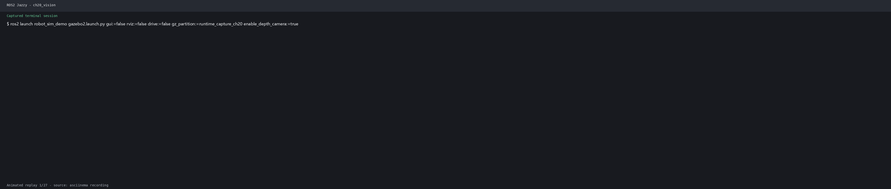

# 第20章 实验：视觉大模型与 ROS2 应用

## 当前仓库仿真验证：Gazebo 图像与离线 mock 后端

### 实验目标

把 `robot_sim_demo` 的相机作为 VLM 服务输入，在不依赖 API Key 的情况下验证订阅、服务调用、结构化结果和任务发布链路。

### 运行步骤

```bash
source /opt/ros/jazzy/setup.bash
source install/setup.bash
ros2 launch robot_sim_demo gazebo2.launch.py \
  gui:=false rviz:=false drive:=false
```

```bash
ros2 topic echo /camera/image_raw --once
ros2 topic echo /camera/camera_info --once
```

运行本实验的离线 mock 节点，检查其服务/话题输出；真实 provider 需要另行配置密钥或 Ollama。

### 观察与边界

可验收图像进入节点且 JSON 可解析；固定 mock 内容不代表 VLM 完成了真实场景理解。源码：`src/lab_code/ch20_lab/`、`src/robot_sim_demo/`。

## 实际运行证据

真实运行的视觉语言模型 mock 输入和服务接口检查：



原始录制：[ch20_vision.cast](images/runtime/ch20_vision.cast)。

> **对应理论章节**：第33章《视觉大模型集成》
> **实验课时**：2课时  
> **实验代码**：`src/lab_code/ch20_lab/`（本章仅提供设计说明占位，无参考实现包，练习需自行实现）  

## 实验目标
- 掌握调用视觉大模型(VLM)API进行图像分析的方法
- 学会将视觉能力封装为ROS2服务
- 理解后端解耦设计：通过参数/环境变量选择离线mock或真实模型provider
- 实现基于VLM的场景描述和目标检测
- 理解Prompt Engineering在机器人场景中的应用

## 实验环境
- ROS 2 Jazzy
- USB摄像头
- Python openai库（可选：pillow、requests）
- 默认使用离线mock后端：**不需要任何API Key即可完成全部测试**
- 可选接入真实provider：OpenAI / 通义千问 / 本地Ollama，密钥通过环境变量提供

## 总体设计（依据 `src/lab_code/ch20_lab/README.md`）
本实验演示将视觉模型能力封装为 ROS2 服务，核心设计要点：

1. **服务化封装**：视觉能力（场景描述、目标检测等）统一封装为ROS2服务，输入图像与查询文本，输出结构化结果，上层节点通过服务调用获取视觉理解结果，不直接依赖模型SDK。
2. **默认离线mock后端**：默认后端为离线模拟（mock）实现，返回模拟的结构化结果，因而不需要API密钥即可完成服务链路搭建与测试，适合课堂教学环境。
3. **provider可选切换**：连接真实模型时，通过ROS参数选择相应提供商（如 `api_type` 参数选择 `openai`/`qwen`/`ollama`），并从环境变量读取密钥（如 `OPENAI_API_KEY`、`DASHSCOPE_API_KEY`），服务接口保持不变。
4. **结构化输出**：以JSON格式返回场景描述、物体列表、建议动作等字段，便于机器人程序解析。

## 实验步骤

### 20.1 安装依赖和配置
```bash
pip install openai pillow requests

# 默认离线mock后端无需任何密钥即可测试
# 如需接入真实模型, 选择一种配置:
# OpenAI:
export OPENAI_API_KEY="sk-your-api-key"

# 或 通义千问:
export DASHSCOPE_API_KEY="sk-your-dashscope-key"

# 或 本地Ollama:
# ollama pull llava
# ollama serve
```

### 20.2 创建实验包
```bash
cd ~/ros2_arm_ws/src
ros2 pkg create ch20_vlm --build-type ament_python --dependencies rclpy sensor_msgs std_msgs cv_bridge
cd ch20_vlm
mkdir -p ch20_vlm
```

### 20.3 编写VLM场景描述节点
创建 `ch20_vlm/scene_describer.py`。该节点通过 `api_type` 参数选择后端provider，默认可在无密钥环境下用mock后端替换 `analyze_image` 的实现进行测试:
```python
import rclpy
from rclpy.node import Node
from sensor_msgs.msg import Image
from std_msgs.msg import String
from cv_bridge import CvBridge
import openai
import base64
import json
import cv2
import os
import threading
import time

class VLMServer(Node):
    def __init__(self):
        super().__init__('vlm_server')
        self.bridge = CvBridge()
        self.latest_image = None

        self.declare_parameter('api_type', 'openai')
        self.declare_parameter('model', 'gpt-4o-mini')
        self.declare_parameter('auto_analyze', False)

        api_type = self.get_parameter('api_type').value
        model = self.get_parameter('model').value
        self.auto_analyze = self.get_parameter('auto_analyze').value

        if api_type == 'qwen':
            self.client = openai.OpenAI(
                api_key=os.getenv('DASHSCOPE_API_KEY', ''),
                base_url='https://dashscope.aliyuncs.com/compatible-mode/v1'
            )
            if model == 'gpt-4o-mini':
                model = 'qwen-vl-plus'
        elif api_type == 'ollama':
            self.client = openai.OpenAI(
                base_url='http://localhost:11434/v1',
                api_key='ollama'
            )
            if model == 'gpt-4o-mini':
                model = 'llava'
        else:
            self.client = openai.OpenAI(
                api_key=os.getenv('OPENAI_API_KEY', '')
            )

        self.model = model

        self.image_sub = self.create_subscription(
            Image, '/image_raw', self.image_cb, 10
        )
        self.query_sub = self.create_subscription(
            String, '/vlm/query', self.query_cb, 10
        )
        self.desc_pub = self.create_publisher(String, '/vlm/description', 10)
        self.status_pub = self.create_publisher(String, '/vlm/status', 10)

        self.get_logger().info(f'VLM场景描述器已启动 (model={model})')

        if self.auto_analyze:
            self.analysis_timer = self.create_timer(10.0, self.auto_analyze_cb)

    def image_cb(self, msg):
        try:
            self.latest_image = self.bridge.imgmsg_to_cv2(msg, 'bgr8')
        except Exception:
            pass

    def query_cb(self, msg):
        if self.latest_image is None:
            self.status_pub.publish(String(data='等待图像...'))
            return
        threading.Thread(target=self.process_query, args=(msg.data,), daemon=True).start()

    def auto_analyze_cb(self):
        if self.latest_image is not None:
            threading.Thread(
                target=self.process_query,
                args=('请描述当前场景中的物体和布局',),
                daemon=True
            ).start()

    def process_query(self, query):
        self.get_logger().info(f'VLM查询: {query}')
        self.status_pub.publish(String(data=f'分析中...'))

        result = self.analyze_image(query)

        if result:
            self.desc_pub.publish(String(data=json.dumps(result, ensure_ascii=False, indent=2)))
            self.get_logger().info(f'场景: {result.get("description", "")[:100]}...')
            self.status_pub.publish(String(data='分析完成'))
        else:
            self.status_pub.publish(String(data='分析失败'))

    def analyze_image(self, query):
        h, w = self.latest_image.shape[:2]
        scale = min(512 / max(h, w), 1.0)
        if scale < 1.0:
            img = cv2.resize(self.latest_image, (int(w * scale), int(h * scale)))
        else:
            img = self.latest_image

        ret, jpeg = cv2.imencode('.jpg', img, [cv2.IMWRITE_JPEG_QUALITY, 70])
        img_b64 = base64.b64encode(jpeg.tobytes()).decode('utf-8')
        data_url = f'data:image/jpeg;base64,{img_b64}'

        system_prompt = """你是一个机器人视觉助手。请分析图像并回答用户问题。
返回JSON格式:
{
  "description": "场景的中文描述(50字以内)",
  "objects": [{"name": "物体名", "position": "位置描述", "count": 1}],
  "actions": ["可行的操作建议"],
  "answer": "对用户问题的直接回答"
}"""

        try:
            response = self.client.chat.completions.create(
                model=self.model,
                messages=[
                    {"role": "system", "content": system_prompt},
                    {
                        "role": "user",
                        "content": [
                            {"type": "text", "text": query},
                            {"type": "image_url", "image_url": {"url": data_url, "detail": "low"}},
                        ]
                    }
                ],
                max_tokens=500,
                response_format={"type": "json_object"},
            )
            content = response.choices[0].message.content.strip()
            return json.loads(content)
        except json.JSONDecodeError as e:
            self.get_logger().error(f'JSON解析失败: {e}')
            return {"description": content if 'content' in dir() else "解析错误", "objects": []}
        except Exception as e:
            self.get_logger().error(f'VLM调用失败: {e}')
            return None

    def run_test_queries(self):
        time.sleep(2)
        test_queries = [
            "桌面上有哪些物体? 请列出所有可见物品",
            "描述当前场景的布局和安全状况",
            "前方是否有障碍物? 机器人的路径是否畅通?",
        ]
        for q in test_queries:
            self.get_logger().info(f'=== 测试: {q} ===')
            result = self.analyze_image(q)
            if result:
                self.get_logger().info(f'回答: {result.get("answer", "")}')
            time.sleep(3)

def main(args=None):
    rclpy.init(args=args)
    node = VLMServer()
    node.run_test_queries()
    try:
        rclpy.spin(node)
    except KeyboardInterrupt:
        pass
    node.destroy_node()
    rclpy.shutdown()

if __name__ == '__main__':
    main()
```

> **练习提示（离线mock后端）**：在无API Key的教学环境中，可将 `analyze_image` 中的网络调用替换为返回固定/模拟JSON的本地实现（mock后端），例如返回 `{"description": "mock场景", "objects": [{"name": "bottle", "position": "桌面中央", "count": 1}], "actions": ["抓取瓶子"], "answer": "mock回答"}`，先验证订阅、服务调用与结果发布的完整链路，再切换到真实provider。

### 20.4 编写VLM目标检测节点
创建 `ch20_vlm/vlm_detector.py`:
```python
import rclpy
from rclpy.node import Node
from sensor_msgs.msg import Image
from vision_msgs.msg import Detection2DArray, Detection2D, ObjectHypothesisWithPose
from std_msgs.msg import String
from cv_bridge import CvBridge
import openai
import base64
import json
import cv2
import os
import numpy as np

class VLMBasedDetector(Node):
    def __init__(self):
        super().__init__('vlm_based_detector')
        self.bridge = CvBridge()

        self.client = openai.OpenAI(
            api_key=os.getenv('OPENAI_API_KEY', '')
        )
        self.declare_parameter('model', 'gpt-4o-mini')
        self.declare_parameter('target_object', 'bottle')
        self.model = self.get_parameter('model').value
        self.target = self.get_parameter('target_object').value

        self.image_sub = self.create_subscription(
            Image, '/image_raw', self.image_cb, 10
        )
        self.det_pub = self.create_publisher(
            Detection2DArray, '/vlm/detections', 10
        )
        self.annotated_pub = self.create_publisher(
            Image, '/vlm/annotated', 10
        )
        self.get_logger().info(f'VLM检测器已启动, 目标: {self.target}')

    def image_cb(self, msg):
        try:
            cv_image = self.bridge.imgmsg_to_cv2(msg, 'bgr8')
        except Exception:
            return

        h, w = cv_image.shape[:2]
        scale = min(512 / max(h, w), 1.0)
        if scale < 1.0:
            img = cv2.resize(cv_image, (int(w * scale), int(h * scale)))
        else:
            img = cv_image

        ret, jpeg = cv2.imencode('.jpg', img, [cv2.IMWRITE_JPEG_QUALITY, 70])
        img_b64 = base64.b64encode(jpeg.tobytes()).decode('utf-8')
        data_url = f'data:image/jpeg;base64,{img_b64}'

        prompt = f"""分析图像。检测"{self.target}"的位置。
图像尺寸: {int(w * scale)}x{int(h * scale)}像素。
只需返回JSON: {{"detected": true/false, "objects": [{{"name": "物体名", "x": 中心x, "y": 中心y, "width": 宽度, "height": 高度, "confidence": 0-1}}]}}"""

        try:
            response = self.client.chat.completions.create(
                model=self.model,
                messages=[
                    {"role": "system", "content": "你是视觉检测助手。只返回JSON。"},
                    {
                        "role": "user",
                        "content": [
                            {"type": "text", "text": prompt},
                            {"type": "image_url", "image_url": {"url": data_url, "detail": "high"}},
                        ]
                    }
                ],
                max_tokens=500,
                response_format={"type": "json_object"},
            )
            result = json.loads(response.choices[0].message.content.strip())

            det_msg = Detection2DArray()
            det_msg.header = msg.header
            annotated = cv_image.copy()

            for obj in result.get('objects', []):
                det = Detection2D()
                scale_x = w / (w * scale)
                scale_y = h / (h * scale)
                det.bbox.center.position.x = float(obj['x']) * scale_x
                det.bbox.center.position.y = float(obj['y']) * scale_y
                det.bbox.size_x = float(obj.get('width', 50)) * scale_x
                det.bbox.size_y = float(obj.get('height', 50)) * scale_y
                hyp = ObjectHypothesisWithPose()
                hyp.hypothesis.class_id = obj.get('name', 'unknown')
                hyp.hypothesis.score = float(obj.get('confidence', 0.5))
                det.results.append(hyp)
                det_msg.detections.append(det)

                x1 = int(det.bbox.center.position.x - det.bbox.size_x / 2)
                y1 = int(det.bbox.center.position.y - det.bbox.size_y / 2)
                x2 = int(det.bbox.center.position.x + det.bbox.size_x / 2)
                y2 = int(det.bbox.center.position.y + det.bbox.size_y / 2)
                cv2.rectangle(annotated, (x1, y1), (x2, y2), (0, 255, 0), 2)
                cv2.putText(annotated, f'{obj["name"]} {obj.get("confidence", 0):.2f}',
                            (x1, y1-5), cv2.FONT_HERSHEY_SIMPLEX, 0.5, (0, 255, 0), 1)

            self.det_pub.publish(det_msg)
            self.annotated_pub.publish(self.bridge.cv2_to_imgmsg(annotated, 'bgr8'))
            self.get_logger().info(f'VLM检测: {len(det_msg.detections)} 个物体')

        except Exception as e:
            self.get_logger().error(f'VLM检测失败: {e}')

def main(args=None):
    rclpy.init(args=args)
    node = VLMBasedDetector()
    rclpy.spin(node)
    node.destroy_node()
    rclpy.shutdown()

if __name__ == '__main__':
    main()
```

### 20.5 编写VLM任务规划节点
创建 `ch20_vlm/task_planner.py`:
```python
import rclpy
from rclpy.node import Node
from std_msgs.msg import String
import openai
import json
import os

class TaskPlanner(Node):
    def __init__(self):
        super().__init__('task_planner')
        self.client = openai.OpenAI(
            api_key=os.getenv('OPENAI_API_KEY', '')
        )
        self.declare_parameter('model', 'gpt-4o-mini')
        self.model = self.get_parameter('model').value

        self.cmd_sub = self.create_subscription(
            String, '/llm/command', self.command_cb, 10
        )
        self.plan_pub = self.create_publisher(String, '/llm/plan', 10)

        self.known_objects = {
            'bottle': '试剂瓶', 'box': '纸箱',
            'cup': '杯子', 'book': '书本',
        }
        self.known_locations = {
            'shelf_A': (2.0, 2.0), 'shelf_B': (-2.0, 2.0),
            'table': (0.5, 0.0), 'station': (0.0, -3.0),
        }
        self.get_logger().info('任务规划器已启动')

    def command_cb(self, msg):
        instruction = msg.data.strip()
        self.get_logger().info(f'指令: {instruction}')
        plan = self.generate_plan(instruction)
        if plan:
            plan_str = json.dumps(plan, ensure_ascii=False, indent=2)
            self.plan_pub.publish(String(data=plan_str))
            self.get_logger().info(f'规划完成: {len(plan.get("tasks", []))} 步')

    def generate_plan(self, instruction):
        system_prompt = f"""你是机器人任务规划器。将自然语言指令转为结构化任务。
已知物体: {json.dumps(self.known_objects, ensure_ascii=False)}
已知位置: {json.dumps({k: list(v) for k, v in self.known_locations.items()})}
可用操作: navigate, pick, place, scan, wait, detect
返回JSON: {{"tasks": [{{"step": 1, "action": "操作", "target": "目标", "params": {{}}}}], "summary": "摘要"}}"""
        try:
            response = self.client.chat.completions.create(
                model=self.model,
                messages=[
                    {"role": "system", "content": system_prompt},
                    {"role": "user", "content": instruction}
                ],
                temperature=0.1,
                max_tokens=1000,
                response_format={"type": "json_object"},
            )
            content = response.choices[0].message.content.strip()
            return json.loads(content)
        except Exception as e:
            self.get_logger().error(f'规划失败: {e}')
            return None

def main(args=None):
    rclpy.init(args=args)
    node = TaskPlanner()
    node.get_logger().info('发送指令: ros2 topic pub /llm/command std_msgs/String "data: \'去桌子上拿瓶子\'"')
    rclpy.spin(node)
    node.destroy_node()
    rclpy.shutdown()

if __name__ == '__main__':
    main()
```

### 20.6 编写VLM服务封装
创建 `ch20_vlm/vlm_service.py`。该节点体现本章"视觉能力封装为ROS2服务"的核心设计，实际实现时应使用自定义服务类型（请求：图像+查询文本；响应：结构化JSON字符串），并将其中的模型调用替换为按参数选择的mock或真实provider:
```python
import rclpy
from rclpy.node import Node
from std_msgs.msg import String
from sensor_msgs.msg import Image
from cv_bridge import CvBridge
import openai
import base64
import json
import cv2
import os

class VLMActionServer(Node):
    def __init__(self):
        super().__init__('vlm_action_server')
        self.bridge = CvBridge()
        self.latest_image = None
        self.client = openai.OpenAI(api_key=os.getenv('OPENAI_API_KEY', ''))

        self.image_sub = self.create_subscription(
            Image, '/image_raw', self.image_cb, 10
        )

        self.srv = self.create_service(String, '/vlm/analyze', self.handle_request)
        self.result_pub = self.create_publisher(String, '/vlm/analysis_result', 10)
        self.get_logger().info('VLM Action Server ready')

    def image_cb(self, msg):
        try:
            self.latest_image = self.bridge.imgmsg_to_cv2(msg, 'bgr8')
        except Exception:
            pass

    def handle_request(self, request, response):
        if self.latest_image is None:
            response.data = json.dumps({"error": "No image available"})
            return response

        ret, jpeg = cv2.imencode('.jpg', self.latest_image,
                                  [cv2.IMWRITE_JPEG_QUALITY, 70])
        img_b64 = base64.b64encode(jpeg.tobytes()).decode('utf-8')
        data_url = f'data:image/jpeg;base64,{img_b64}'

        try:
            resp = self.client.chat.completions.create(
                model='gpt-4o-mini',
                messages=[
                    {"role": "system", "content": "分析场景。返回JSON: {\"description\":\"...\",\"objects\":[...],\"graspable\":[object_names]}"},
                    {"role": "user", "content": [
                        {"type": "text", "text": request.data},
                        {"type": "image_url", "image_url": {"url": data_url, "detail": "low"}},
                    ]}
                ],
                response_format={"type": "json_object"},
                max_tokens=500,
            )
            result = resp.choices[0].message.content.strip()
            response.data = result
            self.result_pub.publish(String(data=result))
        except Exception as e:
            response.data = json.dumps({"error": str(e)})

        return response

def main(args=None):
    rclpy.init(args=args)
    node = VLMActionServer()
    rclpy.spin(node)
    node.destroy_node()
    rclpy.shutdown()

if __name__ == '__main__':
    main()
```

> **注意**：上方 `create_service(String, ...)` 仅为教学示例写法，`String` 是消息类型而非服务类型；自行实现时应定义 `.srv` 接口（如 `VlmAnalyze.srv`：请求含 `sensor_msgs/Image image` 与 `string query`，响应含 `string result_json`）。

### 20.7 配置setup.py并编译运行
```python
entry_points={
    'console_scripts': [
        'scene_describer = ch20_vlm.scene_describer:main',
        'vlm_detector = ch20_vlm.vlm_detector:main',
        'task_planner = ch20_vlm.task_planner:main',
        'vlm_service = ch20_vlm.vlm_service:main',
    ],
},
```

```bash
cd ~/ros2_arm_ws
colcon build --packages-select ch20_vlm
source install/setup.bash

# 使用离线mock后端时无需export任何密钥
# 终端1: 启动相机
ros2 run usb_cam usb_cam_node_exe

# 终端2: 场景描述
ros2 run ch20_vlm scene_describer

# 发送查询
ros2 topic pub /vlm/query std_msgs/String "data: '描述场景中的物体'"
ros2 topic echo /vlm/description

# 或VLM检测
ros2 run ch20_vlm vlm_detector --ros-args -p target_object:=bottle
rqt_image_view /vlm/annotated
```

接入真实provider时（任选其一）:
```bash
# OpenAI
export OPENAI_API_KEY="sk-your-key"

# 通义千问
export DASHSCOPE_API_KEY="sk-your-key"
ros2 run ch20_vlm scene_describer --ros-args -p api_type:=qwen

# 本地Ollama（无需密钥）
ros2 run ch20_vlm scene_describer --ros-args -p api_type:=ollama
```

## 实验结果与分析
- 默认离线mock后端可在无API Key的环境下验证"订阅图像→服务调用→结果发布"的完整链路
- 接入真实VLM后，可成功分析图像内容并生成结构化场景描述
- GPT-4o-mini可以识别场景中的物体、位置和安全状况
- ROS2话题/服务封装使得VLM结果可以被其他节点使用，且provider切换对上层透明
- API调用延迟受网络影响, 通常需要1-3秒

## 思考题
1. VLM相比传统CV方法在目标检测上有什么优势和劣势?
2. Prompt Engineering如何影响VLM的输出质量?
3. 如何减少VLM API调用的延迟? 有无本地部署方案?
4. VLM输出中的幻觉问题如何检测和处理?
5. 离线mock后端与真实VLM后端的切换对上层调用节点是否透明? 服务接口应如何设计才能做到后端无关?
