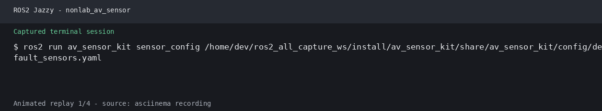
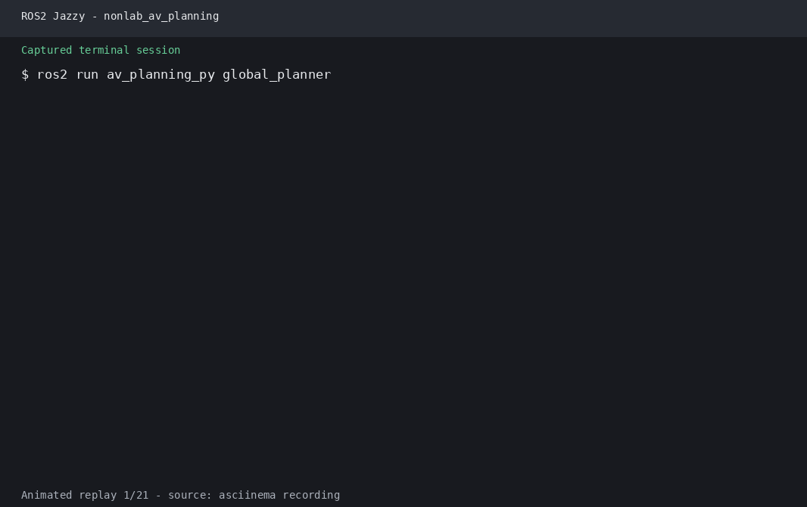
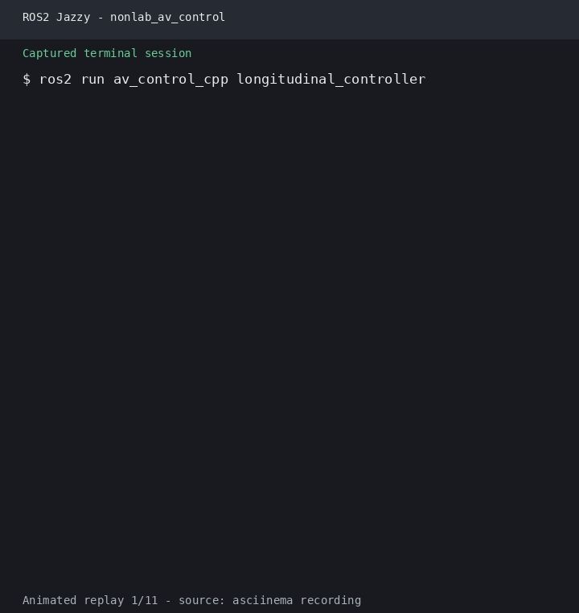
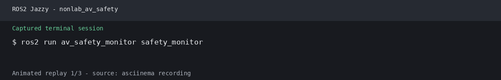

# 第31章 实验指导书：综合项目——城区自动驾驶

> **对应理论章节**：第45章《综合项目：城区自动驾驶》  
> **实验课时**：3 课时  
> **实验代码**：`src/lab_code/ch31_lab/`

---

## 实验目标

在 CARLA 0.9.16 和 ROS 2 Jazzy 环境中，完成传感器、感知、规划、控制和安全监控节点的组合验证。课程仓库提供可构建的基础节点、接口包和演示脚本；完整的城区自动驾驶管线还需要另行提供实现模块。

## 实际运行证据

以下 GIF 记录了自动驾驶基础组件的实际运行检查；这些组件即使可以单独启动，也不代表 CARLA 已连接或完整闭环已经成功。










## 实验准备

### 1. 配置课程环境

在课程根目录执行：

```bash
bash setup_course.sh --with-carla
source ~/.config/ros2-course/env.bash

cd "$ROS2_COURSE_WS"
colcon build --symlink-install
source install/setup.bash
```

确认 ROS 2 和课程包可见：

```bash
echo "$ROS_DISTRO"                         # jazzy
ros2 pkg prefix av_carla_interfaces
ros2 pkg prefix av_sensor_kit
ros2 pkg prefix av_perception_py
ros2 pkg prefix av_planning_py
ros2 pkg prefix av_control_cpp
ros2 pkg prefix av_safety_monitor
```

### 2. 启动 CARLA 和 Bridge

终端 1，启动 CARLA：

```bash
"$CARLA_ROOT/CarlaUE4.sh" -quality-level=Low
```

终端 2，启动 ROS 2 Bridge：

```bash
source ~/.config/ros2-course/env.bash
ros2 launch carla_ros_bridge carla_ros_bridge.launch.py \
  synchronous_mode:=False register_all_sensors:=True
```

终端 3，生成自车并附加 RGB 相机和 LiDAR：

```bash
cd "$ROS2_COURSE_WS"
python3 src/labs/ch23_lab/spawn_ego.py \
  --spawn-point 10 --role-name ego_vehicle
```

检查 Bridge 话题：

```bash
ros2 topic list | grep carla
ros2 topic echo /carla/ego_vehicle/vehicle_control_cmd
```

## 练习 31.1：验证现有功能包

### 接口和传感器

```bash
ros2 interface show av_carla_interfaces/msg/EgoState
ros2 interface show av_carla_interfaces/msg/ControlCmd
ros2 run av_sensor_kit sensor_manager
```

### 感知节点

按需在不同终端启动：

```bash
ros2 run av_perception_py object_detector
ros2 run av_perception_py lidar_detector
ros2 run av_perception_py fusion_node
```

### 规划节点

```bash
ros2 run av_planning_py global_planner
ros2 run av_planning_py waypoint_generator
ros2 run av_planning_py planning_server
```

### 控制和安全节点

```bash
ros2 run av_control_cpp vehicle_controller \
  --ros-args -p target_speed:=10.0
ros2 run av_safety_monitor safety_monitor
```

定位使用 ROS 2 Jazzy 的 `robot_localization` 或实验者提供的定位组件；本仓库没有单独的 `av_localization` 包。

## 练习 31.2：运行综合演示脚本

### 一键启动

`town_demo.sh` 位于工作空间的 `src/labs/ch31_lab/`，默认使用课程环境中的
`$ROS2_COURSE_WS` 和 `$CARLA_ROOT`（分别回退到 `~/ros2_course_ws` 和 `~/carla`）：

```bash
cd "$ROS2_COURSE_WS/src/labs/ch31_lab"
bash town_demo.sh \
  --carla-path "$CARLA_ROOT" \
  --ros-ws "$ROS2_COURSE_WS"
```

脚本会启动 CARLA、Bridge 和 RViz2，并检查 `main_pipeline.py` 所需的目录外模块。缺少这些模块时只启动基础仿真环境，不会伪装成完整管线已经启动。

### 单独启动主管线

当以下模块已经放入 `ch31_lab/` 时，可以按 Python 模块方式启动主管线：

```text
carla_sensor_driver/
perception_node/
localization_node/
planning_node/
control_node/
safety_monitor_node/
```

```bash
cd "$ROS2_COURSE_WS/src/labs"
PYTHONPATH=. python3 -m ch31_lab.main_pipeline
```

主管线提供以下控制接口：

```bash
ros2 service call /pipeline/enable std_srvs/srv/SetBool "{data: true}"
ros2 topic echo /system/pipeline_status
ros2 topic echo /system/performance_metrics
```

## 练习 31.3：测试和验收

### 运行已有单元测试

在课程工作空间执行：

```bash
cd "$ROS2_COURSE_WS"
python3 -m pytest src/course/av_carla_interfaces/test -q
python3 -m pytest src/course/av_sensor_kit/test -q
python3 -m pytest src/course/av_perception_py/test -q
python3 -m pytest src/course/av_planning_py/test -q
python3 -m pytest src/course/av_safety_monitor/test -q
```

控制器为 C++ 包，先执行构建，再使用接口包测试和 C++ 编译结果验证：

```bash
colcon build --symlink-install --packages-select \
  av_carla_interfaces av_control_cpp
```

第 31 章目录中的综合测试脚本可用于已配置的运行环境：

```bash
cd "$ROS2_COURSE_WS/src/labs/ch31_lab"
bash run_all_tests.sh --quick
```

当前目录只提供 `main_pipeline.py`、`town_demo.sh` 和 `run_all_tests.sh`；没有内置 `test/` 目录时，测试脚本会明确跳过该项。

### 验收清单

| 检查项 | 完成 |
|---|---|
| ROS 2 发行版为 Jazzy | □ |
| CARLA 版本为 0.9.16 | □ |
| `av_carla_interfaces` 可以显示接口 | □ |
| CARLA Bridge 话题正常发布 | □ |
| 传感器、感知、规划、控制和安全节点可单独启动 | □ |
| RViz2 可以显示 TF、LaserScan 和路径 | □ |
| 单元测试通过 | □ |
| 目录外主管线组件已配置并完成端到端验证 | □ |

## 结果记录

记录以下内容：

1. `ros2 topic list` 中的 CARLA、感知、规划和安全话题。
2. 各节点启动命令和终端输出。
3. 单元测试通过数量及失败原因。
4. 端到端演示中的碰撞次数、路线完成率和最大跟踪误差。

完整演示需要 CARLA、ROS 2 Jazzy、对应 Python 依赖以及目录外的主管线模块；缺少任一项时，应在实验报告中注明，不将基础 Bridge 验证记为完整自动驾驶验收。
