# 实际运行证据

本页只登记由课程程序在当前环境中实际运行生成的输出。终端证据来自限时终端录制会话（早期条目为 `asciinema` 录制；ch17 起为 `script` 的 typescript+timing 录制，经 `scripts/script2cast.py` 合成为 asciicast v2），再由 `scripts/render_asciinema_gif.py` 渲染为动画 GIF；Gazebo 场景证据来自 Gazebo 的 Screenshot 插件。

采集环境为 WSL2 Ubuntu 24.04、ROS 2 Jazzy、Gazebo Sim Harmonic。采集脚本为每个步骤设置硬超时：单步默认 8 秒、后台进程默认 40 秒、GUI 默认 45 秒。

GIF 证据直接嵌入本页；原始终端录制保留为 `.cast` 链接。

## 已完成

- ch01 生命周期节点： · [原始录制](images/runtime/ch01_lifecycle.cast)
- ch02 Python 节点： · [原始录制](images/runtime/ch02_nodes.cast)
- ch03 话题通信： · [原始录制](images/runtime/ch03_topics.cast)
- ch04 服务通信： · [原始录制](images/runtime/ch04_service.cast)
- ch05 动作通信： · [原始录制](images/runtime/ch05_action.cast)
- ch06 参数系统： · [原始录制](images/runtime/ch06_parameters.cast)
- ch07 TF2： · [原始录制](images/runtime/ch07_tf.cast)
- ch08 URDF+RViz 显示（urdf_demo_ros2）： · [原始录制](images/runtime/ch08_urdf.cast)
- ch09 Gazebo headless： · [原始录制](images/runtime/ch09_gazebo_headless.cast)
- ch17 MoveIt 运动学规划（ik_demo）： · [原始录制](images/runtime/ch17_ik_demo.cast)
- ch18 MoveIt 路径跟随（beeline_demo）： · [原始录制](images/runtime/ch18_beeline_demo.cast)
- Campus PUCRS Gazebo GUI：
- Campus PUCRS headless： · [原始录制](images/runtime/campus_pucrs_headless.cast)
- ch26 控制器单元测试： · [原始录制](images/runtime/ch26_control.cast)
- ch20 视觉语言模型感知（vision_llm_demo）： · [原始录制](images/runtime/ch20_vision.cast)
- ch30 自动驾驶安全监控（av_safety_monitor）： · [原始录制](images/runtime/ch30_safety.cast)
- ch10 SLAM（slam_toolbox）： · [原始录制](images/runtime/ch10_slam.cast)
- ch13 Gazebo 相机桥接： · [原始录制](images/runtime/ch13_camera.cast)
- ch14 相机桥接 headless： · [原始录制](images/runtime/ch14_camera_headless.cast)
- ch19 视觉检测： · [原始录制](images/runtime/ch19_vision.cast)
- ch11 Nav2 自主导航（nav2_demo, museum 场景）： · [原始录制](images/runtime/ch11_nav2.cast)
- ch12 MoveIt 2 机械臂关节规划（arm_only）：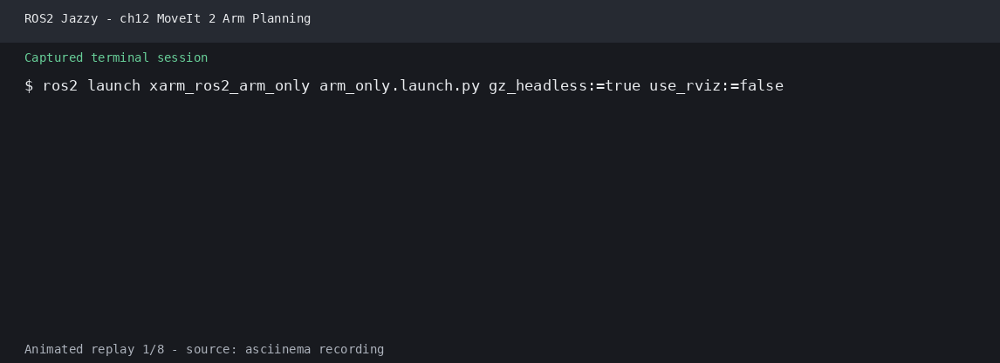 · [原始录制](images/runtime/ch12_arm_only.cast)
- ch15 综合实训相机桥接与控制器检查：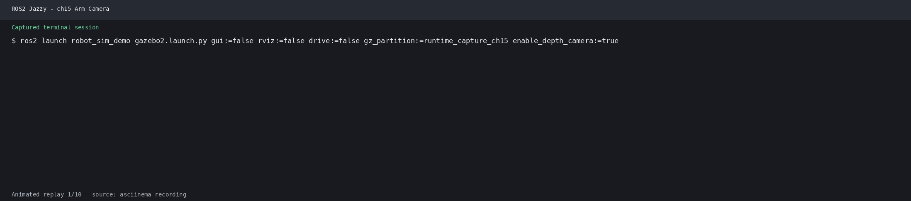 · [原始录制](images/runtime/ch15_arm_camera.cast)

## 场景演示

以下条目来自非实验流程的场景演示录制，同样只登记实际运行的输出。

- ch03 C++ 话题发布（topic_demo_cpp）：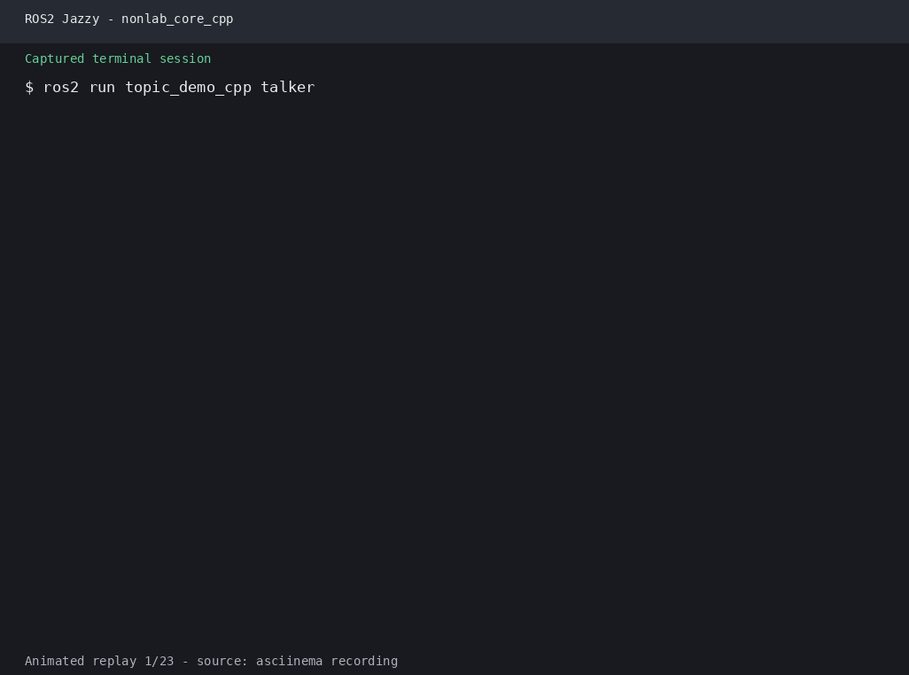 · [原始录制](images/runtime/nonlab_core_cpp.cast)
- ch03 Python 话题发布（topic_demo_py）：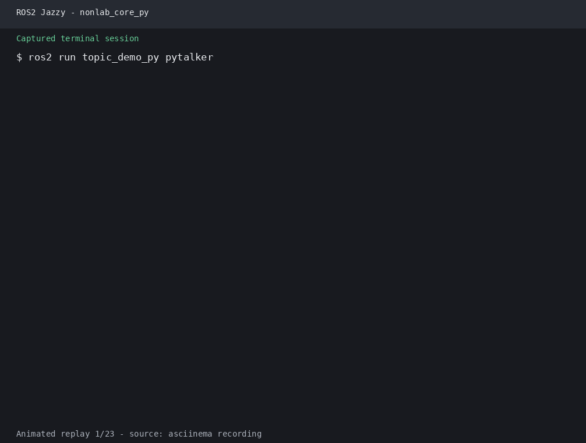 · [原始录制](images/runtime/nonlab_core_py.cast)
- 命名空间与参数演示（name_demo_cpp）：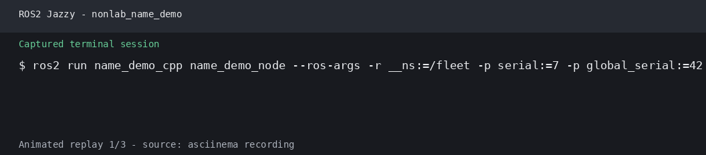 · [原始录制](images/runtime/nonlab_name_demo.cast)
- ch06 参数演示（param_demo_cpp）：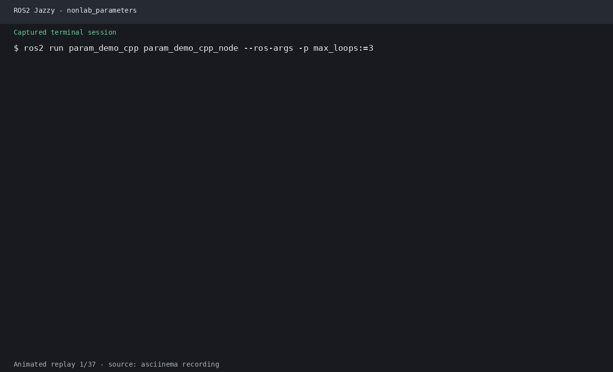 · [原始录制](images/runtime/nonlab_parameters.cast)
- ch07 TF 广播/监听（tf_demo_cpp）：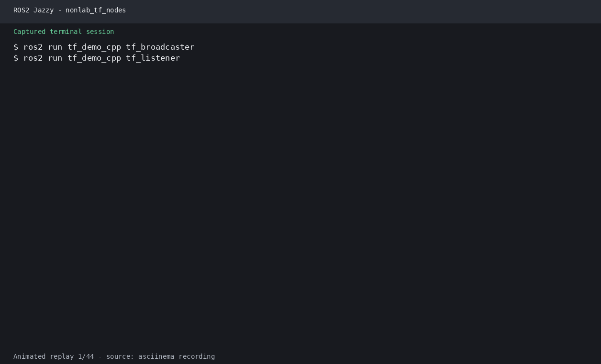 · [原始录制](images/runtime/nonlab_tf_nodes.cast)
- ch07 欧拉角转四元数（tf_demo_cpp）：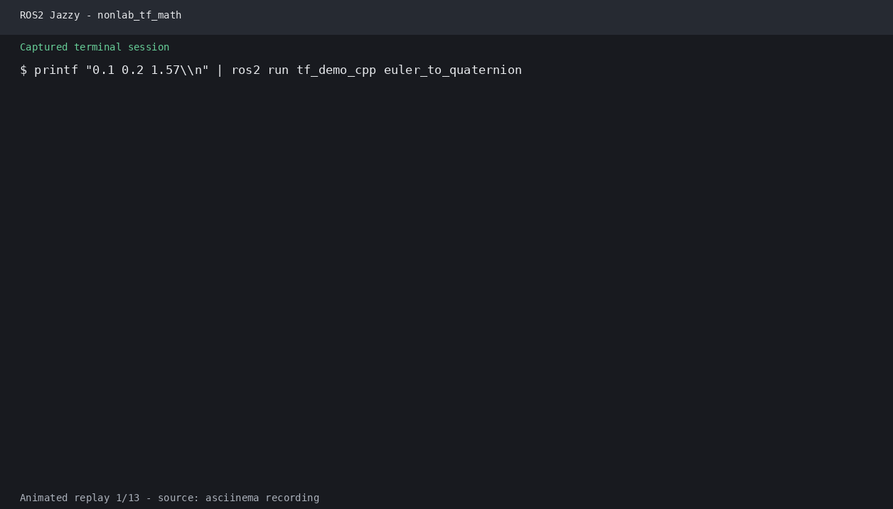 · [原始录制](images/runtime/nonlab_tf_math.cast)
- ch07 TF 目标跟随（tf_follower_ros2）：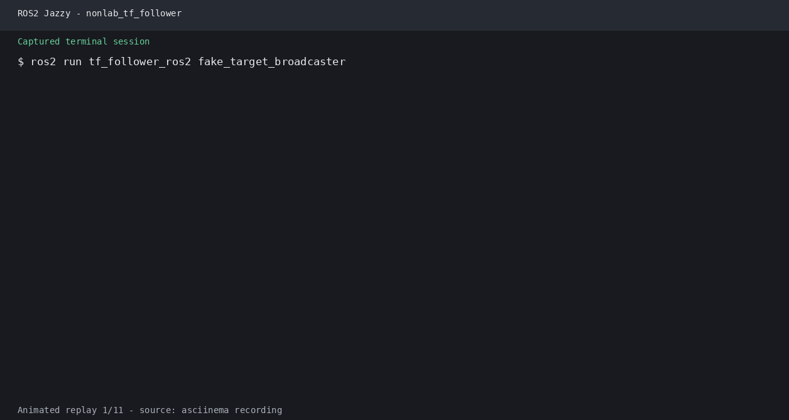 · [原始录制](images/runtime/nonlab_tf_follower.cast)
- ch08 URDF/xacro 解析（urdf_demo_ros2）：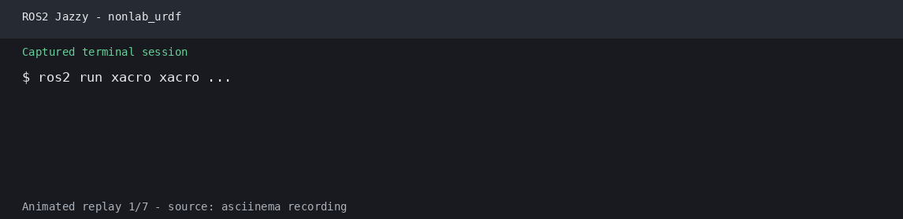 · [原始录制](images/runtime/nonlab_urdf.cast)
- ch10 SLAM（slam_toolbox）： · [原始录制](images/runtime/nonlab_slam.cast)
- ch11 Nav2 组件启动： · [原始录制](images/runtime/nonlab_nav2.cast)
- ch30/ch31 安全监控（av_safety_monitor）： · [原始录制](images/runtime/nonlab_av_safety.cast)
- ch31 传感器配置（av_sensor_kit）： · [原始录制](images/runtime/nonlab_av_sensor.cast)
- ch31 激光感知（av_perception_py）： · [原始录制](images/runtime/nonlab_av_perception.cast)
- ch31 全局规划（av_planning_py）： · [原始录制](images/runtime/nonlab_av_planning.cast)
- ch31 纵向控制（av_control_cpp）： · [原始录制](images/runtime/nonlab_av_control.cast)
- xArm 运行冒烟测试（arm_only_runtime_smoke）：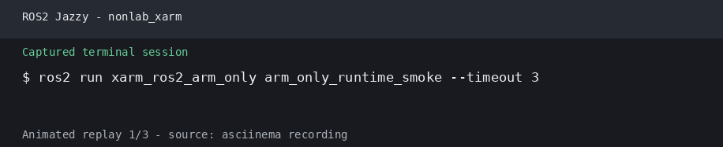 · [原始录制](images/runtime/nonlab_xarm.cast)

## 待采集

- ch16/ch21-ch25、ch27-ch29、ch31 仍需逐个运行并生成证据。
- CARLA 章节需要可用的 CARLA 服务器和 ROS bridge；当前环境未提供，不能伪造截图。
- RViz 已能启动并加载 OpenGL，但 WSLg 的窗口抓取返回全黑帧；黑帧不作为实验截图，需改用可见的桌面捕获链路后再登记。
