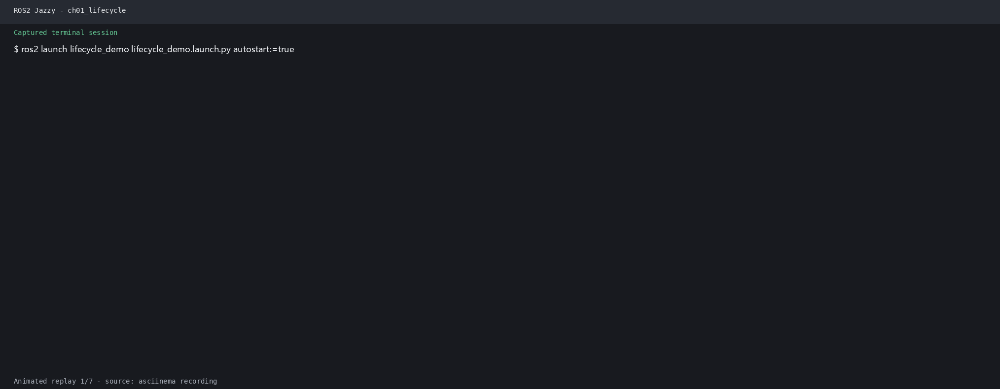
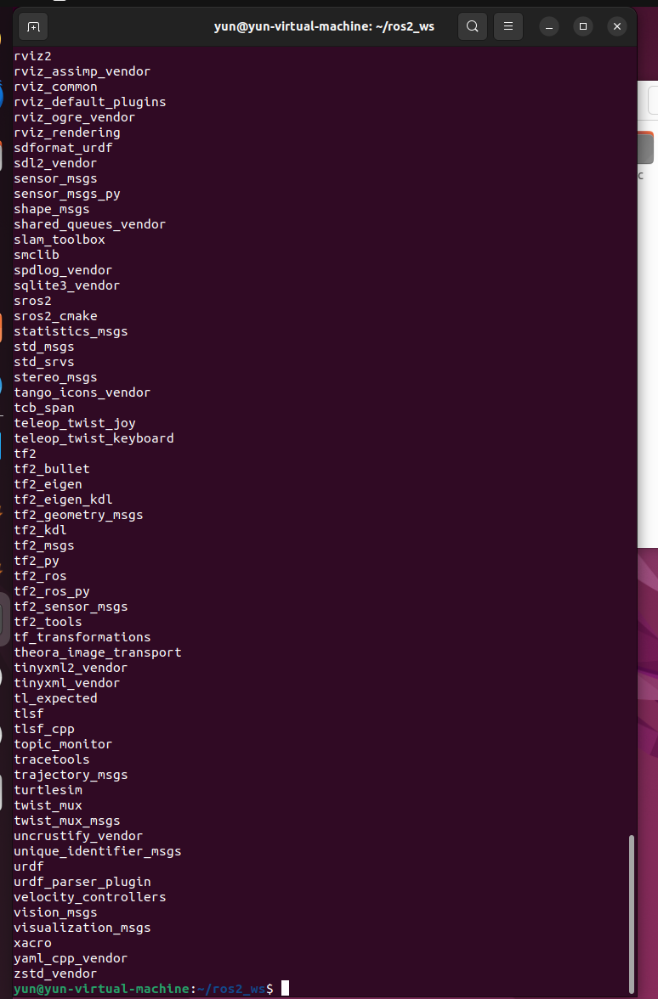
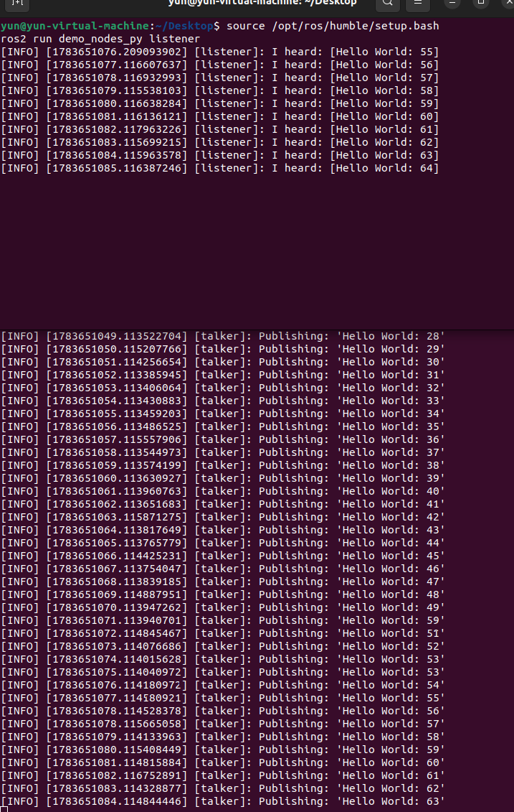
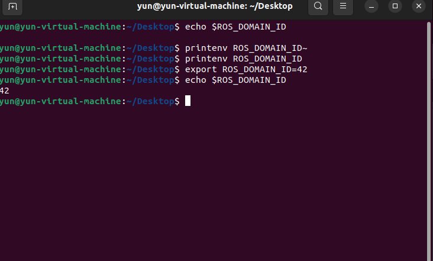

# 第1章 PPT：ROS 2 概述与架构设计

> 共 17 页，标注页码 · 图号与教学文档对应

---

## P1 · 标题页

**ROS 2 概述与架构设计**

- 课程：ROS2 Python 编程
- 章节：第 1 章
- 课时：2 课时（90 分钟）
- 教学方式：讲授 + 演示

<!-- 旁白：欢迎来到本章！页面显示本次课共 2 课时 90 分钟，采用讲授加演示的方式展开。学习 ROS 2 别急着敲代码，先弄清楚三条主线：它为什么重新设计、新架构长什么样、又该怎么装起来。六条学习目标请记在心里，本章后面的演示都会用到这些概念。 -->

---

## P2 · 本课学习目标

- 理解 ROS 1 的四大局限及 ROS 2 的重新设计动机
- 掌握 DDS 去中心化架构与节点自动发现机制
- 理解 RMW 抽象层与 DDS 实现的可替换性
- 掌握 QoS 核心策略维度与预定义配置文件
- 理解生命周期节点的状态机与回调写法
- 完成 ROS 2 安装、工作空间创建与 colcon 构建

<!-- 旁白：六条学习目标可以分成两半：前三条围绕理论，讲 DDS 去中心化、RMW 抽象层和 QoS 策略；后三条偏向动手，从生命周期节点一直到安装、建工作空间、用 colcon 编译。多数人会低估安装与编译这一步的价值，其实工具链顺畅与否直接决定后面每一章的效率。 -->

---

## P3 · ROS 1 的四大局限与 ROS 2 设计目标

- **要点：** Master 单点故障、实时性不足、安全性缺失、嵌入式支持薄弱

```
┌──────────┐ ┌──────────┐ ┌──────────┐ ┌──────────┐
│ 单点故障 │ │ 实时性   │ │ 安全性   │ │ 嵌入式   │
│ Master   │ │ 不足     │ │ 缺失     │ │ 支持薄弱 │
│ 崩溃 =   │ │ TCP 延迟 │ │ 无认证   │ │ 微控制器 │
│ 系统瘫痪 │ │ 不可控   │ │ 授权加密 │ │ 资源受限 │
└──────────┘ └──────────┘ └──────────┘ └──────────┘
        ↓ 2014 年 Open Robotics 启动 ROS 2 ↓
```

- 2007 年 Willow Garage 发布 ROS 1，为机器人软件开发提供统一分布式框架
- 2014 年启动的 ROS 2 针对上述痛点完全重新设计了通信架构

<!-- 旁白：这张四宫格把 ROS 1 时代的四大痛点摆出来：Master 单点故障导致系统整体瘫痪，TCP 传输延迟不可控，没有认证授权机制保障安全，资源有限的微控制器更是跑不动。正因如此，2014 年 Open Robotics 才启动 ROS 2，针对这些问题完全重新设计了通信架构，这是本讲最重要的背景知识。 -->

---

## P4 · ROS 2 版本演进与选型

- **要点：** 半年一版；Humble 与 Jazzy 为 LTS 主力版本

| 版本 | 发布日期 | 状态 |
|------|---------|------|
| Foxy | 2020.06 | EOL |
| Galactic | 2021.05 | EOL |
| **Humble** | 2022.05 | **LTS（推荐）** |
| Iron | 2023.05 | EOL |
| **Jazzy** | 2024.05 | **LTS（最新）** |

- 本课程基于 ROS 2 Humble（Ubuntu 22.04）或 ROS 2 Jazzy（Ubuntu 24.04）

<!-- 旁白：这张表告诉我们版本节奏：ROS 2 每半年发布一个版本，其中 LTS 长期支持版本才是生产环境的选择。Humble 配 Ubuntu 22.04、Jazzy 配 Ubuntu 24.04，本课程以它们为基准。选 LTS 的好处是维护周期长、社区资料多，遇到问题更容易搜到答案；其他过渡版本生命周期短，不建议初学者使用。 -->

---

## P5 · DDS 概念模型：与 ROS 2 概念的对应

- **要点：** DDS 是 OMG 制定的分布式实时通信标准，底层使用 RTPS 协议

| DDS 概念 | ROS 2 概念 | 说明 |
|----------|-----------|------|
| DomainParticipant | Node（通过 context） | 通信参与者 |
| DataWriter | Publisher | 数据写入方 |
| DataReader | Subscription | 数据读取方 |
| Topic | Topic | 数据通道名称 |
| Domain | ROS_DOMAIN_ID | 通信域隔离 |

- DDS 域 ID 用于隔离不同通信环境，域 ID 不同的节点互不可见

<!-- 旁白：这张对应表帮你把 DDS 的术语翻译成 ROS 2 的日常词汇：域参与者对应节点、数据写入器对应发布者、数据读取器对应订阅者、话题两边同名。最值得记住的是最后一行——域 ID 决定通信边界，ROS_DOMAIN_ID 不相同的节点彼此不可见，多机联调时它就是隔离团队的开关。 -->

---

## P6 · DDS 去中心化架构

- **要点：** 节点通过自动发现机制直接对等通信，无需中心 Master

```
图 1-1：DDS 去中心化架构
┌─────────────┐                    ┌─────────────┐
│   Node A    │                    │   Node B    │
│             │                    │             │
│ ┌─────────┐ │    DDS Domain     │ ┌─────────┐ │
│ │Publisher│ │◄════Topic════════►│ │Subscribe│ │
│ └─────────┘ │    (自动发现)      │ └─────────┘ │
└─────────────┘                    └─────────────┘
        │                                  │
        └────────── 去中心化 ─────────────┘
               (无 Master 节点)
```

- 三大收益：多机分布部署、QoS 内建于通信层、符合实时通信标准

<!-- 旁白：这是本讲最重要的架构图：节点 A 与节点 B 之间不存在任何中心节点，发布者和订阅者靠 DDS 域内的自动发现机制直接对等通信。三大收益值得圈出来——支持多机分布式部署、QoS 保障内建于通信层、整体符合实时通信标准。对比 ROS 1 的 Master 架构，这套设计从根上解决了单点故障。 -->

---

## P7 · RMW 分层架构

- **要点：** RMW 抽象层使上层 API 与 DDS 实现解耦，代码可无缝切换底层供应商

```
┌────────────────┐
│ rclcpp / rclpy │  ← 用户代码 API
├────────────────┤
│      RCL       │  ← ROS Client Library
├────────────────┤
│      RMW       │  ← 中间件抽象层（可替换）
├────────────────┤
│ Fast DDS /     │
│ Cyclone DDS /  │  ← DDS 实现（可切换）
│ RTI Connext    │
├────────────────┤
│  UDP / SHMEM   │  ← 传输层
└────────────────┘
```

图 1-2：ROS 2 分层架构

- RMW 层允许在不修改应用代码的情况下切换不同 DDS 实现

<!-- 旁白：这张分层图自上而下是五层：rclpy/rclcpp 用户 API、RCL 客户端库、RMW 抽象层、具体 DDS 实现和传输层。中间的 RMW 起着万能插座的作用，应用代码写一次，就能在 Fast DDS、Cyclone DDS、RTI Connext 之间随意切换，无需改动任何业务代码，这正是 ROS 2 在中间件选型上保持中立的关键设计。 -->

---

## P8 · QoS 策略维度

- **要点：** QoS 从多个维度定义数据传输的质量保证机制

| 策略维度 | 选项 | 含义 |
|---------|------|------|
| Reliability | RELIABLE / BEST_EFFORT | 可靠传输（重传）/ 尽力传输（允许丢包） |
| Durability | VOLATILE / TRANSIENT_LOCAL | 不保存历史 / 保存历史给后来者 |
| History | KEEP_LAST(n) / KEEP_ALL | 保留最后 n 条 / 保留所有 |
| Depth | 正整数 | 队列深度 |
| Deadline | 时间间隔 | 消息更新的最大间隔 |
| Lifespan | 时间间隔 | 消息的有效期 |
| Liveliness | AUTOMATIC / MANUAL | 发布者存活检测 |

<!-- 旁白：表格把 QoS 拆成七个维度，每个维度管一类质量诉求：可靠性决定丢包要不要重传，持久性决定历史数据是否留给迟到者，历史与深度决定队列容量，截止期限、有效时长约束数据时效，活跃度检测发布者是否还活着。实际配置时先想清楚业务对丢包和时延的容忍度，再逐项设置。 -->

---

## P9 · QoS 预定义配置与自定义

- **要点：** 传感器数据用 BEST_EFFORT，服务通信用 RELIABLE，也可逐维自定义

```python
# ROS 2 预定义 QoS 配置文件
from rclpy.qos import QoSProfile, qos_profile_sensor_data, \
    qos_profile_services_default

# 传感器数据：高频，允许丢包
qos_sensor = qos_profile_sensor_data  # BEST_EFFORT, KEEP_LAST(5)

# 服务通信：可靠传输
qos_service = qos_profile_services_default  # RELIABLE, KEEP_LAST(10)

# 自定义 QoS
qos_custom = QoSProfile(
    reliability=rclpy.qos.ReliabilityPolicy.RELIABLE,
    durability=rclpy.qos.DurabilityPolicy.TRANSIENT_LOCAL,
    depth=10
)
```

<!-- 旁白：代码展示了三种取用方式：传感器数据用现成的 qos_profile_sensor_data，默认尽力传输并保留最近 5 条，适合图像、点云这类高频数据；服务通信用 services_default，保证可靠送达；都不合适就手动构造 QoSProfile，逐项填写可靠性、持久性和队列深度。注意发布方与订阅方的 QoS 必须匹配才能通信，第 3 章还会详细展开。 -->

---

## P10 · 节点生命周期状态机

- **要点：** 用标准状态机管理节点的初始化与关停，保证确定的启动/退出流程

```
                             configure()
Unconfigured ─────────────────────────► Inactive
     ▲                                      │
     │                                      │ activate()
     │ cleanup()                            ▼
     │                                   Active
     │                                      │
     └──────────────── deactivate() ────────┘

           shutdown()（从任意状态进入 Finalized）
```

图 1-3：生命周期节点状态转换图

- 设计动机：硬件驱动、导航算法等组件需要有序的初始化与关停（如导航系统先初始化代价地图再激活）

<!-- 旁白：这张状态转换图描述节点的完整生命周期：默认处于未配置态，configure 进入未激活态，activate 后正式开始工作，deactivate 退回未激活态，cleanup 回到初始状态，shutdown 则从任意状态走向终止。这样设计是为了让硬件驱动、导航算法这类组件按确定顺序启动，比如导航系统必须先初始化代价地图，而不是一创建就运行。 -->

---

## P11 · 生命周期 Python API

- **要点：** 继承 LifecycleNode，覆写 on_configure / on_activate 等回调并返回 SUCCESS

```python
import rclpy
from rclpy.lifecycle import LifecycleNode, State, TransitionCallbackReturn

class MyLifecycleNode(LifecycleNode):
    def __init__(self):
        super().__init__('my_lifecycle_node')

    def on_configure(self, state: State):
        # 分配资源、设置参数
        return TransitionCallbackReturn.SUCCESS

    def on_activate(self, state: State):
        # 开始处理数据
        return TransitionCallbackReturn.SUCCESS

    def on_deactivate(self, state: State):
        # 停止处理
        return TransitionCallbackReturn.SUCCESS
```



<!-- 旁白：生命周期功能在 Python 里是这样写的：继承 LifecycleNode，覆写 on_configure、on_activate、on_deactivate 三个回调，分别负责分配资源、开始处理和停止处理，最后都要返回 SUCCESS 表示迁移成功。页面下方的动图展示节点状态从未配置逐步走到激活再关闭的完整过程，这比普通节点多了一层可控性。 -->

---

## P12 · 安装 ROS 2 Humble 与开发环境

- **要点：** 配源安装 desktop-full，再装 colcon/rosdep/vcstool 等开发工具

```bash
# 1. 设置 locale 并添加 ROS 2 软件源
sudo apt install software-properties-common
sudo add-apt-repository universe

# 2. 安装 ROS 2 Humble 完整版
sudo apt update
sudo apt install ros-humble-desktop-full

# 3. 安装开发工具
sudo apt install python3-colcon-common-extensions \
    python3-rosdep python3-vcstool

# 4. 环境变量写入 ~/.bashrc
echo "source /opt/ros/humble/setup.bash" >> ~/.bashrc
source ~/.bashrc

# 5. 初始化 rosdep（用于安装包依赖）
sudo rosdep init
rosdep update
```

<!-- 旁白：安装分三步走：先配置系统源和 locale，然后安装 ros-humble-desktop-full 完整桌面版，最后补上 colcon、rosdep、vcstool 三个开发工具。结尾记得把 source 命令追加进 ~/.bashrc，否则每次开新终端都要手动执行；rosdep 负责自动解析包依赖，后面第一次编译第三方软件包时你就会用到它。 -->

---

## P13 · 工作空间与 colcon 构建

- **要点：** src/build/install/log 四目录；构建后 source install/setup.bash

```
~/ros2_ws/
├── src/       ← 源码包目录
├── build/     ← 编译中间文件
├── install/   ← 安装输出
└── log/       ← 编译日志
```

```bash
mkdir -p ~/ros2_ws/src && cd ~/ros2_ws
colcon build --symlink-install   # Python 包免重编
source install/setup.bash        # 每次新终端都要重新 source
```



<!-- 旁白：工作空间采用标准的四目录结构：src 放我们自己写的源码，build 保存编译中间产物，install 是最终安装输出，log 记录编译日志。命令上有两条经验：Python 包加上 --symlink-install 符号链接安装，改代码后免于反复重编；每次开新终端都必须重新 source install/setup.bash，忘了这一步通常就是 Package not found 报错的根源。 -->

---

## P14 · 运行验证：turtlesim 与命令行观察

- **要点：** 先跑仿真、再读命令；用官方 talker/listener 验证安装是否成功

```bash
# 验证安装：终端 1 运行 talker，终端 2 运行 listener
ros2 run demo_nodes_cpp talker
ros2 run demo_nodes_py listener

# 观察系统实体
ros2 node list
ros2 topic list
ros2 run turtlesim turtle_teleop_key   # 方向键控制乌龟
```




rqt_graph 工具可实时查看节点与话题的连接关系（图源：docs.ros.org）

<!-- 旁白：验证安装的思路是先跑仿真再读命令：两个终端分别运行官方 talker 和 listener，它们通过话题互传消息；随后用 ros2 node list 和 ros2 topic list 观察系统里到底有哪些实体，再用 turtle_teleop_key 控制小乌龟动起来。页面的两张图分别是通信示意和 rqt_graph 实时拓扑，节点之间的话题连接关系一目了然，这个工具后面每章都会用到。 -->

---

## P15 · 本章要点

1. ROS 1 有单点故障、实时性、安全性、嵌入式支持四大局限，ROS 2 全面重新设计
2. ROS 2 用 DDS 去中心化自动发现机制替换 ROS 1 的中心 Master
3. RMW 抽象层使 DDS 实现可替换（Fast DDS / Cyclone DDS / RTI Connext）
4. QoS 从 Reliability、Durability、History、Depth 等维度提供细粒度保障
5. 生命周期节点用标准状态机管理配置、激活与关闭流程
6. colcon 是标准构建工具，新终端必须重新 source，否则报 Package not found

<!-- 旁白：本页汇总全章六条要点，建议大家逐条自查：DDS 去中心化架构解决了 ROS 1 Master 的单点故障，RMW 抽象层让底层实现可替换，QoS 提供细粒度的传输保障，生命周期节点规范了启动与关停流程，colcon 则是日常构建的标准工具。课后对照这份清单回顾，哪条说不清楚就回到对应页面再看一遍。 -->

---

## P16 · 练习题

1. 简述 ROS 1 的三个主要局限性及 ROS 2 对应的解决方案
2. ROS_DOMAIN_ID 的作用是什么？两台机器域 ID 不同能否通信？
3. Publisher（RELIABLE, VOLATILE）与 Subscriber（BEST_EFFORT, VOLATILE）能否匹配？为什么？
4. 查看当前 ROS_DOMAIN_ID，将其修改为 42 并验证
5. 创建工作空间，colcon build 编译并验证 setup.bash 加载
6. 运行 talker/listener，用 ros2 node list 和 ros2 topic list 查看运行状态



<!-- 旁白：练习共六题，前三题检验概念理解，后三题偏向动手操作。第三题的 QoS 匹配问题最有代表性，提示大家从 Reliability 的兼容矩阵入手分析；第五、六题对应本章的实操环节，完成后请保留工作空间，后续章节还会复用。遇到报错先检查是否 source 了 setup.bash。 -->

---

## P17 · 下章预告

**第 2 章：核心编程基础**

- 创建第一个 Python 节点（rclpy）
- 日志系统与参数使用
- rqt_graph / RViz2 可视化工具

<!-- 旁白：下一章我们进入核心编程基础，将亲手创建第一个 rclpy 节点，学习日志输出与参数的使用方法，并借助 rqt_graph 与 RViz2 观察系统运行状态。本节建立的概念与工具链是后续所有实验的地基，请务必完成本章练习后再开始下一章的学习。 -->
