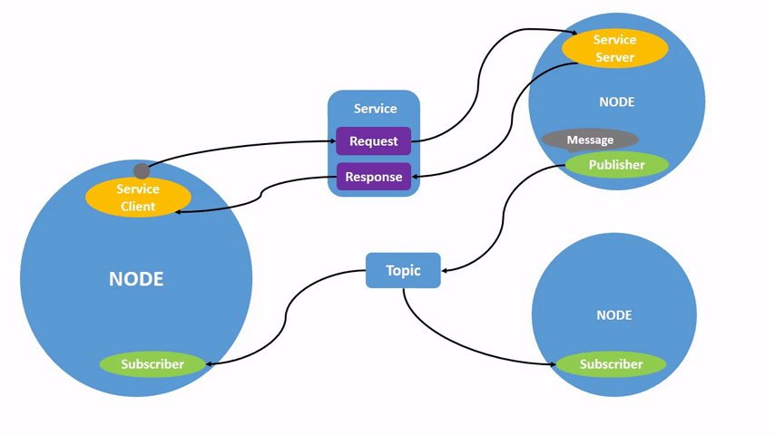
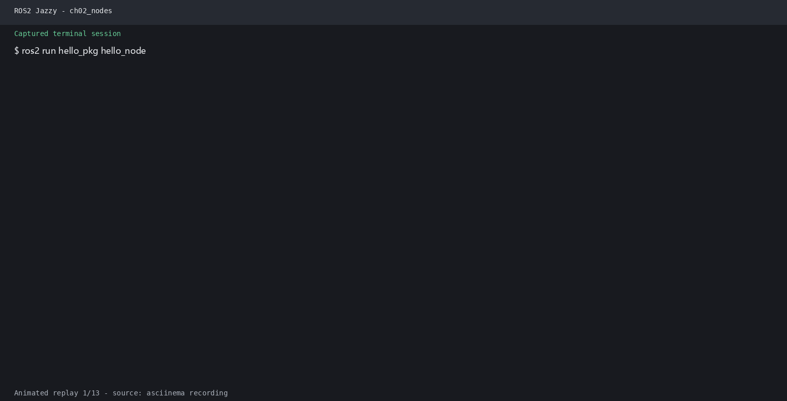

# 第2章 PPT：ROS 2 核心编程基础

> 共 16 页，标注页码 · 图号与教学文档对应

---

## P1 · 标题页

**ROS 2 核心编程基础**

- 课程：ROS2 Python 编程
- 章节：第 2 章
- 课时：2 课时（90 分钟）
- 教学方式：讲授 + 演示

<!-- 旁白：欢迎来到第 2 章！本讲共 90 分钟，围绕四处展开：包的结构与注册、节点模板与命名、日志系统、以及围绕它们的一整套命令行和可视化工具。上一章我们讲懂了架构，这一章要开始写第一个真正能跑的节点，动手的部分明显增多，请准备好环境，边讲边试。 -->

---

## P2 · 本课学习目标

- 掌握 ament_python 包的标准目录结构与 package.xml 配置
- 理解 setup.py 中 entry_points 的注册机制
- 掌握最小节点模板与「init → spin → destroy → shutdown」标准流程
- 理解节点名称、命名空间与重映射规则
- 掌握分级日志系统的使用与高级输出方式
- 熟悉 CLI 命令、rqt_graph 与 RViz2 工具链

<!-- 旁白：六条目标对应本讲的知识地图：前三项任务是搭建包骨架，中间两项是节点与日志，最后一项是工具链。其中最关键的是 entry_points 注册机制——不理解它，写出来的脚本只能自己跑，无法被 ros2 run 调用。请把目标记下，每完成一环就打一个勾。 -->

---

## P3 · Python 包标准结构

- **要点：** ament_python 构建系统；包是可编译、可安装、可分享的最小单元

```
my_robot_pkg/                     # 包根目录
├── package.xml                   # 包元数据（名称、版本、依赖）
├── setup.py                      # 安装脚本
├── setup.cfg                     # 安装配置
├── resource/
│   └── my_robot_pkg              # ament index 标记文件
├── my_robot_pkg/                 # Python 源码
│   ├── __init__.py
│   └── my_node.py                # 节点代码
├── launch/                       # Launch 文件目录
│   └── demo.launch.py
└── test/                         # 测试代码
    ├── __init__.py
    └── test_my_node.py
```

图 2-1：ROS 2 Python 包的标准目录结构

- 创建命令：`ros2 pkg create my_pkg --build-type ament_python --dependencies rclpy`

<!-- 旁白：这张目录树是本讲的第一个重点图。一个 ament_python 包里，package.xml 管声明、setup.py 管安装、resource 标记文件管索引，源码目录才是写节点的地方，launch 与 test 分别管启动和测试。用 ros2 pkg create 一条命令就能生成全部骨架，后面所有章节的练习都会从它开始。 -->

---

## P4 · package.xml 配置

- **要点：** depend 依赖声明必须与实际 import 一致，否则二进制环境无法运行

```xml
<?xml version="1.0"?>
<package format="3">
  <name>my_robot_pkg</name>
  <version>0.1.0</version>
  <description>My first ROS 2 Python package</description>
  <maintainer email="student@example.com">Student Name</maintainer>
  <license>Apache-2.0</license>

  <!-- 运行时依赖 -->
  <exec_depend>rclpy</exec_depend>
  <exec_depend>std_msgs</exec_depend>

  <export>
    <build_type>ament_python</build_type>
  </export>
</package>
```

- `--dependencies rclpy` 参数会把依赖提前写入 package.xml，无需手工添加

<!-- 旁白：配置依赖有个铁律：package.xml 里声明的依赖必须和代码里 import 的库一致。声明少了，编译机器上能跑；换一台只装二进制包的环境就会直接报模块找不到。页面下方还提示一个省事技巧——用 ros2 pkg create 时把 --dependencies 参数写上，依赖会自动写进这个文件，不用手工编辑。 -->

---

## P5 · setup.py 安装入口

- **要点：** entry_points 把 Python 函数注册为 ROS 2 可执行文件，格式「名称 = 包名.模块名:函数名」

```python
from setuptools import find_packages, setup

package_name = 'my_robot_pkg'

setup(
    name=package_name,
    version='0.1.0',
    packages=find_packages(exclude=['test']),
    data_files=[
        ('share/ament_index/resource_index/packages',
            ['resource/' + package_name]),
        ('share/' + package_name, ['package.xml']),
    ],
    install_requires=['setuptools'],
    entry_points={
        'console_scripts': [
            'my_node = my_robot_pkg.my_node:main',
        ],
    },
)
```

- `colcon build --symlink-install` 后代码修改即时生效，无需重编译

<!-- 旁白：这个文件真正决定包如何被安装。其中 entry_points 的 console_scripts 是最关键的一段：左边 my_node 是运行时的可执行名，右边 my_robot_pkg.my_node:main 是函数入口，格式固定为名称等于包名、模块名加函数名。配置好它，colcon build 之后才能用 ros2 run 启动节点。 -->

---

## P6 · 最小节点模板

- **要点：** main 遵循「初始化→创建→spin→销毁→关闭」；spin 为阻塞式事件循环

```python
import rclpy
from rclpy.node import Node

class MyFirstNode(Node):
    def __init__(self):
        super().__init__('my_first_node')   # 节点名称
        self.timer = self.create_timer(1.0, self.timer_callback)
        self.count = 0
        self.get_logger().info('节点已启动！')

    def timer_callback(self):
        self.count += 1
        self.get_logger().info(f'Hello ROS 2! Count: {self.count}')

def main(args=None):
    rclpy.init(args=args)          # 初始化 ROS 2
    node = MyFirstNode()           # 创建节点实例
    try:
        rclpy.spin(node)           # 进入事件循环（阻塞）
    except KeyboardInterrupt:
        pass
    finally:
        node.destroy_node()        # 销毁节点
        rclpy.shutdown()           # 关闭 ROS 2
```

程序 2-1：ROS 2 Python 最小节点模板

<!-- 旁白：这是 ROS 2 Python 编程的骨架模板，值得背下来。main 函数四步走：rclpy.init 初始化、创建节点、spin 进入阻塞事件循环、finally 里销毁节点并 shutdown。中间用定时器每 1 秒触发一次回调，这就是话题发布的最小雏形——回调里的事才是节点真正干活的地方。 -->

---

## P7 · 节点名称与命名空间

- **要点：** 完整节点标识 = `{namespace}/{node_name}`；节点名与可执行文件名是两回事

| 设置方式 | 示例 | 说明 |
|---------|------|------|
| 构造函数 | `rclpy.create_node('n', namespace='my_ns')` | 代码中固定 |
| 命令行重映射 | `--ros-args -r __ns:=/new_ns -r __node:=new_name` | 运行时修改 |
| Node 子类 | `super().__init__('node_name', namespace='my_ns')` | 类继承写法 |

- 命名规则：节点名只能包含字母、数字和下划线，不能包含空格
- 同一可执行文件可重映射生成多个节点实例；重映射后话题名受命名空间影响
- 不同命名空间下节点相互隔离；同名节点在同一命名空间下无法共存

<!-- 旁白：这页说清楚节点标识的完整规则：完整名称由命名空间加节点名组成。三种设置方式里，构造函数适合代码写死，命令行重映射适合运行时临时改名，常见于同一个可执行文件启动多个副本的场景。记住两个限制：节点名不能带空格，同一命名空间下节点名不能重复。 -->

---

## P8 · 分级日志系统

- **要点：** DEBUG/INFO/WARN/ERROR/FATAL 五级，支持节流与一次性输出

| 日志级别 | Python API | 用途 |
|---------|-----------|------|
| DEBUG | `debug()` | 调试信息（默认不输出） |
| INFO | `info()` | 一般信息 |
| WARN | `warn()` | 警告信息 |
| ERROR | `error()` | 错误信息 |
| FATAL | `fatal()` | 致命错误 |

```python
# 设置日志级别
self.get_logger().set_level(rclpy.logging.LoggingSeverity.DEBUG)

# 节流日志：避免高频刷屏
self.get_logger().info('每秒最多输出一次', throttle_duration_sec=1)

# 一次性日志：整个生命周期只输出一次
self.get_logger().info('只输出一次', once=True)
```

- 命令行运行时可用 `--ros-args --log-level DEBUG` 动态调整级别

<!-- 旁白：日志分五级，从调试到致命逐级增加严重程度，默认只显示 INFO 及以上。除了 set_level 控制全局级别，两个参数很实用：throttle_duration_sec 用来节流，防止高频回调刷爆终端；once 保证整段生命周期只输出一次。运行时的 --log-level 参数不用改代码就能临时调节级别。 -->

---

## P9 · 命令行工具链

- **要点：** ros2 node/topic/pkg 命令是调试核心手段；node info 是排查「连不上」的第一工具

```bash
colcon build --packages-select my_robot_pkg --symlink-install
source install/setup.bash
ros2 run my_robot_pkg my_node

ros2 node list               # 列出所有节点
ros2 node info /my_first_node # 订阅/发布/服务/QoS 详情
ros2 topic list              # 列出话题
ros2 topic echo /topic_name  # 监听话题消息
ros2 topic hz /topic_name    # 查看话题频率
ros2 pkg list                # 列出所有包
ros2 pkg xml my_robot_pkg    # 查看包 XML
```

- `ros2 node info` 能显示发布者/订阅者、服务端/客户端及 QoS 配置
- 发现机制在 DDS 层面全局生效，`ros2 node list` 可跨命名空间列出全部节点

<!-- 旁白：命令按使用频率分三层：ros2 run 启动节点，ros2 node list/info 检查节点状态，ros2 topic list/echo/hz 检查话题。其中 ros2 node info 是排障第一工具，能一口气给出发布者、订阅者、服务和 QoS 四类信息。遇到节点连不上的情况，先跑它看看到底哪一侧缺席。 -->

---

## P10 · rqt_graph 可视化

- **要点：** 椭圆 = 节点，矩形 = 话题，连线 = 发布/订阅关系，实时查看通信拓扑

```bash
rqt_graph
# 或 ros2 run rqt_graph rqt_graph
# 安装：sudo apt install ros-humble-rqt-graph
```




图 2-2：rqt_graph 界面示意图

- 勾选「Nodes/Topics (all)」可查看完整的通信图（图源：docs.ros.org）

<!-- 旁白：图形里椭圆代表节点、矩形代表话题、连线代表发布订阅关系，这张图把命令行的抽象输出变成了直观拓扑。页面上两张示意图来自 ROS 2 官方文档，演示节点和话题如何互联。实际使用时勾选 Nodes/Topics (all) 可以看全所有实体，是理解系统行为最快速的入口。 -->

---

## P11 · RViz2 可视化

- **要点：** 左侧 Displays 配置显示项，右侧 Views 控制视角；安装 `ros-humble-rviz2`

```bash
rviz2
# 或指定配置文件
rviz2 -d /path/to/config.rviz
```

图 2-3：RViz2 界面布局

- Displays 面板可添加 RobotModel、TF、LaserScan 等显示项
- Views 面板支持 Orbit、TopDownOrtho 等多种视角

<!-- 旁白：RViz2 的界面以两栏为主：左侧 Displays 决定显示什么——机器人模型、坐标变换、激光扫描都从这里添加；右侧 Views 决定怎么看——轨道视角、俯视视角都在这调。rviz2 打开默认只有坐标轴，实际工程会直接用 -d 参数加载配置文件，团队共享一份 config.rviz 即可复现相同画面。 -->

---

## P12 · 生命周期节点进阶

- **要点：** 继承 LifecycleNode 重写 on_configure/on_activate 回调，响应外部状态迁移

```python
from rclpy.lifecycle import LifecycleNode

class MyNode(LifecycleNode):
    def on_configure(self, state):   pass
    def on_activate(self, state):    pass
    def on_deactivate(self, state):  pass
```

```bash
ros2 lifecycle get /node                  # 查询当前状态
ros2 lifecycle set /node configure        # 触发状态迁移
```

- 只有全部组件进入 Active 状态后，任务级应用才允许发送控制指令
- 建议对照官方 `lifecycle/talker.py` 示例重写一遍状态回调

<!-- 旁白：这页把第 1 章的状态机落实成代码：继承 LifecycleNode 后覆写三个回调，配合 ros2 lifecycle get/set 两个命令，可以在运行时查询和触发状态迁移。它的价值在大型系统里才显现——所有组件都进入 Active 后任务才开始，避免组件未就绪时被误调用，官方 talker 示例值得照着重写一遍加深印象。 -->

---

## P13 · 仿真结合运行：Gazebo 中运行自己的 Python 节点

- **要点：** 自建节点发布的话题在 DDS 域内被自动发现，无需中心节点

```bash
# 终端 1：启动 Gazebo 仿真（无界面）
ros2 launch robot_sim_demo gazebo2.launch.py gui:=false rviz:=false drive:=false

# 终端 2：运行自建节点并观察
ros2 run my_first_pkg my_node
ros2 node list                 # 自己的节点与仿真节点同域自动发现
ros2 node info /listener
ros2 topic list | grep scan    # 查看仿真的 /scan 话题
```



- 用 `--ros-args -r __node:=my_node2` 运行副本，验证节点重映射（对应练习 2.3）

<!-- 旁白：这是第一次把自建节点和仿真环境放在同一个 DDS 域里跑：启动 Gazebo 后无需任何配置，自己的节点自动被发现，ros2 node list 就能看到双方。下方动图演示了节点的运行输出，练习 2.3 要求用重映射参数再启动一个同名副本，用来验证节点重命名与命名空间隔离的效果。 -->

---

## P14 · 本章要点

1. ament_python 包 = package.xml（元数据）+ setup.py（安装入口）+ 源码目录
2. entry_points 把 Python 函数注册为 ROS 2 可执行文件，格式「名称 = 包名.模块名:函数名」
3. 节点流程：init → create_node → spin → destroy → shutdown
4. 日志分级 DEBUG/INFO/WARN/ERROR/FATAL，支持节流与一次性输出
5. ros2 node/topic/pkg 命令是调试核心手段，node info 优先排查连接问题
6. rqt_graph 可视化通信拓扑，RViz2 可视化机器人传感器与执行器数据
7. 生命周期节点通过状态回调保证组件有序启动与关停

<!-- 旁白：七条要点串起整章脉络：包结构解决怎么造，entry_points 解决怎么注册，节点模板解决怎么写，日志解决怎么查，命令与两个可视化工具解决怎么看，生命周期则解决怎么控制启动时机。把这张清单当复习提纲，逐个能讲出例子来，就说明真正掌握了。 -->

---

## P15 · 练习题

1. 创建名为 `hello_pkg` 的 ROS 2 Python 包，包含 `hello_node` 节点，每秒输出一句问候语
2. 运行节点时添加 `--ros-args --log-level DEBUG`，观察不同日志级别的输出差异
3. 运行两个 `hello_node`，用 `-r __node:=hello2` 重命名第二个，用 `ros2 node list` 验证
4. 用 `ros2 node info` 查看 talker 节点的发布者和订阅者信息，画出通信拓扑图
5. 启动 `demo_nodes_py talker` 和 `listener`，用 rqt_graph 可视化节点通信关系
6. 安装并启动 RViz2，加载默认配置，认识显示面板和视角控制


<!-- 旁白：六个练习从建包、调日志、重命名一路做到可视化，覆盖全部核心内容。第三条特别考验重映射的理解，第五条的 rqt_graph 与第六条的 RViz2 验证的是工具链熟练度。做完之后你的环境里会留下一个可复用的 hello 包，第 3 章的消息类型练习会直接用到它。 -->

---

## P16 · 下章预告

**第 3 章：话题通信**

- 发布者 / 订阅者编程模型（Publisher / Subscription）
- 自定义消息类型 Person.msg
- 话题通信的 QoS 匹配与最佳实践

<!-- 旁白：下一章进入三大通信模型的第一个——话题通信。我们会在本章包的基础上自定义 Person.msg 消息，实现发布者与订阅者两端，最后用 QoS 匹配规则解释为什么发布方和订阅方必须协商一致才能通信。聊完话题，服务与动作两大模型会顺势展开，编程的节奏将从单个节点进入多节点协作。 -->