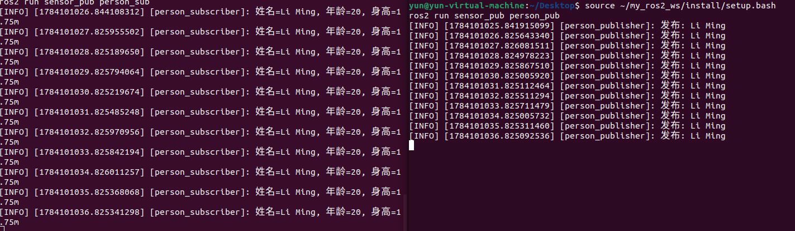
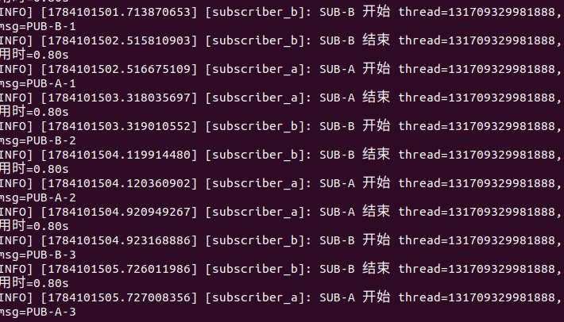
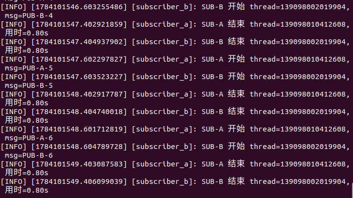

# 第3章 PPT：话题通信（Topics）

> 共 17 页，标注页码 · 图号与教学文档对应

---

## P1 · 标题页

**话题通信（Topics）**

- 课程：ROS2 Python 编程
- 章节：第 3 章
- 课时：2 课时（90 分钟）
- 教学方式：讲授 + 演示

<!-- 旁白：这是第 3 章话题通信的标题页。上一章我们创建了第一个节点，这一章正式进入 ROS 2 最核心的话题机制：发布-订阅模型。全章框架已在本页。请大家备好终端，从理解多对多、异步、解耦这三个关键词开始，再逐步深入。 -->

---

## P2 · 本课学习目标

- 理解发布-订阅模型：异步、多对多、完全解耦
- 掌握 create_publisher / create_subscription API
- 熟悉 std_msgs、sensor_msgs、geometry_msgs 标准消息
- 掌握自定义消息 .msg 接口的创建与使用
- 理解 QoS 可靠性兼容性规则及违约现象
- 使用多线程执行器与回调组提升并行处理能力

<!-- 旁白：六条目标构成章节框架：前两条是发布-订阅模型与核心 API，三四条是标准消息与自定义接口，最后两条是 QoS 兼容性与多线程执行器。建议按顺序逐个击破，学完一页核销一条。若进度过半仍有目标完全陌生，请回顾对应页面后再继续。 -->

---

## P3 · 话题通信架构

- **要点：** 异步多对多；发布者与订阅者完全解耦

```
Publisher 1 ─────┐
                 ├──►  Topic: "/camera/image"  ──► Subscriber A
Publisher 2 ─────┘                                  Subscriber B
                                                    Subscriber C
```

图 3-1：话题通信的多对多发布-订阅模型

- 发布者与订阅者完全解耦，互不知晓对方的存在
- 话题名 + 消息类型 = 通信双方的唯一协议

<!-- 旁白：这张图是话题通信的核心模型：多个发布者、多个订阅者通过同一话题互联，彼此完全解耦。请记住两个要点：话题名加消息类型构成双方唯一协议；发布者与订阅者互不知晓对方存在。机器人中的传感器数据、控制指令都靠这套模型流动。 -->

---

## P4 · 官方演示：发布-订阅数据流

- **要点：** 单对单与多对多的消息流向；话题是节点间的消息通道


单个发布者向话题发布消息，单个订阅者接收


多个发布者与多个订阅者通过同一话题互通，形成多对多拓扑

<!-- 旁白：两个动图出自 ROS 官方文档，直观演示了话题的数据流向：上图是单发布者单订阅者，下图是多个发布者多个订阅者互通的多对多拓扑。无论哪种形态，节点之间始终通过话题这条消息通道交换数据，这正是发布-订阅模型的灵活之处。 -->

---

## P5 · Python Publisher API

- **要点：** create_publisher(消息类型, 话题名, QoS 队列深度)

```python
from std_msgs.msg import String

class TalkerNode(Node):
    def __init__(self):
        super().__init__('talker')
        # 创建发布者：话题名 "chatter"，队列深度 10
        self.publisher = self.create_publisher(
            String, 'chatter', 10)
        self.timer = self.create_timer(0.5, self.timer_callback)
        self.count = 0

    def timer_callback(self):
        msg = String()
        msg.data = f'Hello ROS 2: {self.count}'
        self.publisher.publish(msg)
        self.get_logger().info(f'发布: "{msg.data}"')
        self.count += 1
```

程序 3-1：Publisher 完整示例——定时器周期发布，不用 while 循环

<!-- 旁白：这是 Publisher 的标准写法：先 import 消息类型，再调用 create_publisher 创建发布者，随后用 create_timer 定时触发回调，在回调中构造并发布消息。注意队列深度参数 10 表示最多缓存十条未处理消息。与 ROS 1 相比，这里不再需要 while 循环手工发布。 -->

---

## P6 · Python Subscriber API

- **要点：** 回调签名必须为 callback(msg)；msg 返回后即失效

```python
from std_msgs.msg import String

class ListenerNode(Node):
    def __init__(self):
        super().__init__('listener')
        self.subscription = self.create_subscription(
            String, 'chatter',      # 话题名
            self.listener_callback, # 回调函数
            10)                     # QoS 队列深度

    def listener_callback(self, msg):
        self.get_logger().info(f'收到: "{msg.data}"')
```

程序 3-2：Subscriber 完整示例——回调驱动的编程范式

- 回调中 `msg` 对象在回调返回后即失效，切勿保存引用
- 不要用 while + time.sleep 代替 create_timer——会阻塞回调

<!-- 旁白：订阅者的写法和发布者对称，核心是回调函数：话题每收到一条消息，listener_callback 就被调用一次。请特别记住两个注意点：回调返回后 msg 对象即失效，不能保存引用；也不要试图用 while 加 sleep 代替定时器，那会阻塞执行器，导致消息堆积。 -->

---

## P7 · 标准消息类型

- **要点：** 按功能包分类：基础、传感器、几何三类

| 功能包 | 常用类型 | 用途 |
| --- | --- | --- |
| std_msgs | String / Int32 / Int64 / Float32 / Float64 | 基础数据类型 |
| std_msgs | Bool / Empty / Header | 布尔、信号、标准头 |
| sensor_msgs | Image / LaserScan / PointCloud2 | 图像、激光、点云 |
| sensor_msgs | Imu / Joy | IMU、手柄数据 |
| geometry_msgs | Twist / Pose | 速度指令、位姿 |
| geometry_msgs | Vector3 / Quaternion | 三维向量、四元数 |

- 自定义消息类型必须在接口包中定义（见 P9–P10）

<!-- 旁白：这张表把常用消息按三个功能包归类：std_msgs 提供基础数据类型，sensor_msgs 覆盖图像、激光与 IMU 等传感器数据，geometry_msgs 负责速度、位姿等几何量。记忆时可用联想：做感知找 sensor_msgs，发指令找 geometry_msgs。需要更复杂的结构时，就要自定义消息类型了。 -->

---

## P8 · 查看消息定义与话题命令行

- **要点：** ros2 interface show 查定义；ros2 topic 五件套查状态

```bash
ros2 interface show std_msgs/msg/String
# 输出：string data

ros2 interface show geometry_msgs/msg/Twist
# Vector3 linear
#   float64 x / y / z
# Vector3 angular
#   float64 x / y / z
```

```bash
ros2 topic list -t     # 含类型
ros2 topic echo /topic # 查看消息流
ros2 topic info /topic # 发布/订阅计数与 QoS
ros2 topic hz /topic   # 测频率
ros2 topic bw /topic   # 测带宽
```

- 类比「广播电台」：发布者广播、订阅者收听、频道与节目单必须一致

<!-- 旁白：本页介绍话题的命令行工具：ros2 interface show 查看消息定义，ros2 topic 五件套负责查列表、看内容、看统计、测频率与带宽。可类比广播电台：话题名是频道号，消息类型是节目单，两者匹配才能正常收听。这些命令在后续练习中会反复用到。 -->

---

## P9 · 自定义消息接口包

- **要点：** 接口包仅支持 CMake 构建；rosidl_generate_interfaces 声明 .msg

```
custom_interfaces/
├── CMakeLists.txt
├── package.xml
└── msg/
    └── SensorData.msg
```

```cmake
find_package(rosidl_default_generators REQUIRED)
rosidl_generate_interfaces(${PROJECT_NAME}
  "msg/SensorData.msg")
```

```python
# msg/SensorData.msg
float64 temperature    # 温度 (℃)
float64 humidity       # 湿度 (%)
float64 pressure       # 气压 (hPa)
string device_id       # 设备ID
```

- 接口包单独建包、独立编译，避免「接口改动导致功能包连锁重编译」

<!-- 旁白：自定义消息必须在接口包中定义，三个要点请记住：接口包只能使用 CMake 构建；用 rosidl_generate_interfaces 声明 .msg 文件；目录结构按图示组织。为什么要单独建包独立编译？因为接口一变，依赖它的功能包就要连锁重编译，隔离之后可以避免这种连锁反应。 -->

---

## P10 · 使用自定义消息

- **要点：** package.xml 加依赖；编译后 import 自定义类型

```python
# package.xml 中添加：
# <exec_depend>custom_interfaces</exec_depend>

from custom_interfaces.msg import SensorData

msg = SensorData()
msg.temperature = 25.5
msg.humidity = 60.0
msg.pressure = 1013.25
msg.device_id = 'sensor_01'
self.publisher.publish(msg)
```

- IDL 支持默认值、数组、嵌套类型；.msg 可引用其他接口包类型（如 `geometry_msgs/Point position`）



练习 3.4 中 Person 话题的发布者/订阅者运行输出：订阅端按字段打印姓名、年龄、身高

<!-- 旁白：使用自定义消息分三步：在 package.xml 中声明依赖，编译后在代码里 import 类型，然后像使用普通类一样给字段赋值并发布。示例中的 Person 消息就是练习 3.4 的产物。另外 IDL 还支持默认值、数组与嵌套类型，.msg 文件也能引用其他接口包，扩展能力很强。 -->

---

## P11 · QoS 兼容性规则

- **要点：** Publisher 可靠级别必须 >= Subscriber；日志出现 Incompatible QoS 即不兼容

| Publisher ╲ Subscriber | RELIABLE | BEST_EFFORT |
| --- | --- | --- |
| RELIABLE | 兼容 | 兼容 |
| BEST_EFFORT | 不兼容 | 兼容 |

图 3-2：QoS Reliability 兼容性矩阵

- 控制指令像电话（RELIABLE 保证接通），传感器流像对讲机（BEST_EFFORT 丢一条接着听）
- 日志出现 `Incompatible QoS policies` 即两端不兼容，用 `ros2 topic info -v` 排障


练习 3.5 的验证输出：RELIABLE 发布者配合 BEST_EFFORT 订阅者仍可通信

<!-- 旁白：QoS 兼容性规则可以浓缩成一句话：发布者的可靠性等级必须不低于订阅者。所以 RELIABLE 配 BEST_EFFORT 可以通信，反过来就不行——日志里出现 Incompatible QoS policies 就是不兼容的标志。判定后用 ros2 topic info -v 查看两端配置即可定位问题。 -->

---

## P12 · Python 中配置 QoS

- **要点：** 预定义档案 qos_profile_sensor_data；自定义 QoSProfile

```python
from rclpy.qos import QoSProfile, ReliabilityPolicy, \
    DurabilityPolicy, HistoryPolicy

# 方式1：预定义配置（传感器数据）
self.publisher = self.create_publisher(
    Image, 'camera/image', qos_profile_sensor_data)

# 方式2：自定义 QoS
custom_qos = QoSProfile(
    reliability=ReliabilityPolicy.BEST_EFFORT,
    durability=DurabilityPolicy.VOLATILE,
    history=HistoryPolicy.KEEP_LAST,
    depth=5)
self.subscription = self.create_subscription(
    LaserScan, 'scan', self.callback, custom_qos)
```

- 默认档案：sensor_data (BEST_EFFORT+KEEP_LAST(5))、system_default (RELIABLE+KEEP_LAST(10))、params

<!-- 旁白：配置 QoS 有两条常用路径：传感器数据可直接使用预定义档案 qos_profile_sensor_data；需要精细控制时再自定义 QoSProfile，本例覆盖 reliability、durability、history、depth 四个维度。两种默认档案请区分：sensor_data 是 BEST_EFFORT 加 KEEP_LAST(5)，system_default 是 RELIABLE 加 KEEP_LAST(10)。 -->

---

## P13 · 多线程执行器与回调组

- **要点：** MultiThreadedExecutor 并行回调；回调组控制组内串行/并行

```python
from rclpy.executors import \
    SingleThreadedExecutor, MultiThreadedExecutor
from rclpy.callback_groups import \
    MutuallyExclusiveCallbackGroup, ReentrantCallbackGroup

# 多线程执行器：并行执行回调
executor = MultiThreadedExecutor(num_threads=4)
executor.add_node(node);  executor.spin()

# 互斥组内串行（默认）；可重入组内可并行
group1 = MutuallyExclusiveCallbackGroup()
group2 = ReentrantCallbackGroup()
self.sub = self.create_subscription(
    Image, 'camera', self.callback, 10,
    callback_group=group2)
```



单线程执行器：两个订阅回调顺序执行，互相比等待



多线程执行器：不同线程号并行处理回调，总耗时显著缩短

<!-- 旁白：多线程执行器解决并行问题：MultiThreadedExecutor 可以同时执行多个回调，单线程则必须排队等待。回调组控制并行粒度：互斥组内串行，可重入组内可并行。下方两张截图对比明显——单线程总耗时更长，多线程显著缩短。练习 6 会直接验证这一差异。 -->

---

## P14 · 仿真结合实例：订阅 Gazebo 机器人话题

- **要点：** 仿真 → Bridge → ROS 2 话题 → 订阅节点，验证发布-订阅链路

```bash
# 终端 1：启动 Gazebo 并让机器人自动巡航
ros2 launch robot_sim_demo gazebo2.launch.py gui:=true rviz:=true drive:=true

# 终端 2：直观查看传感器话题
ros2 topic list
ros2 topic echo /odom --once | head
ros2 topic info /scan
ros2 topic hz /camera/image_raw
```

- 订阅 `/scan`（`sensor_msgs/msg/LaserScan`），打印 `angle_min`/`angle_max`/`ranges` 长度
- 观察点：`/odom` 的 position 随时间变化；`/scan` 显示 Publisher count: 1；回调打印频率与 `ros2 topic hz` 一致


<!-- 旁白：演示把仿真与真机链路完整串起来：Gazebo 仿真产生传感器数据，经 Bridge 转为 ROS 2 话题，订阅节点接收并打印。终端 2 用 ros2 topic 五件套观察 /odom 与 /scan，rviz 中可看到激光扫描。重点验证：回调打印频率应与 ros2 topic hz 检测值一致，/odom 的 position 随时间变化。 -->

---

## P15 · 本章要点

1. 话题通信：异步、多对多、发布者与订阅者完全解耦
2. create_publisher(类型, 话题, QoS) / create_subscription(类型, 话题, 回调, QoS)
3. 标准消息分类：std_msgs 基础、sensor_msgs 传感器、geometry_msgs 几何
4. 自定义消息在独立 CMake 接口包中定义 .msg，编译后 import 使用
5. QoS 兼容性：RELIABLE 发布者可与 BEST_EFFORT 订阅者通信，反之不行
6. 多线程执行器 + 回调组并行处理，提高吞吐量

<!-- 旁白：全章六条要点勾勒出话题通信的完整框架：从解耦的发布-订阅模型与两个核心 API 开始，到三类标准消息与自定义接口包，再到 QoS 兼容矩阵与多线程执行器。对照清单逐条自查，说不清楚就翻回对应页面。掌握这些，下一章的服务通信才能顺利展开。 -->

---

## P16 · 练习题

1. 编写 Publisher 发布 Twist 消息控制机器人运动（含线速度、角速度）
2. 编写 Subscriber 订阅 /cmd_vel，打印收到的速度指令
3. 创建自定义接口包，定义含姓名、年龄、身高字段的 Person.msg
4. 基于 Person.msg 编写发布者/订阅者：`ros2 run sensor_pub person_pub` 与 `person_sub`
5. 测试 RELIABLE/BEST_EFFORT 兼容性：`ros2 run topic_demo qos_pub`，再用 `ros2 topic echo --qos-reliability best_effort` 观察
6. MultiThreadedExecutor 运行 2 Publisher + 2 Subscriber（executor_single / executor_multi 对比线程与耗时）

> 提示：练习 4 需先 `colcon build --packages-select sensor_interfaces sensor_pub`；练习 6 用 `ros2 node list` 验证四个节点

<!-- 旁白：六道练习由浅入深：前两题覆盖发布者与订阅者，第三四题练习自定义接口包，第五题验证 QoS 兼容性，第六题考察多线程执行。注意页面提示：练习 4 要先用 colcon build 编译接口包，练习 6 要用 ros2 node list 确认四个节点全部注册。建议按顺序完成，跑通后再进入下一章。 -->

---

## P17 · 下章预告

**第 4 章：服务通信（Services）**

- 客户端 / 服务器模型（Client / Service）
- 请求-响应（request-response）同步通信模式
- 自定义 .srv 接口与异步调用

<!-- 旁白：下一章进入第 4 章服务通信：与话题的异步多对多不同，服务采用客户端-服务器模型和请求-响应同步模式。届时会学习自定义 .srv 接口与异步调用。话题打下的基础——消息定义、编译流程、命令行工具——在服务章节都会继续复用，建议先完成本章练习再前进。 -->
