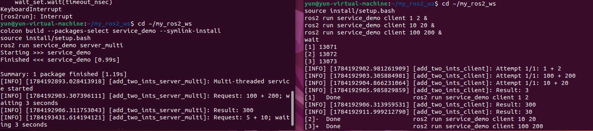

# 第4章 PPT：服务通信（Services）

> 共 13 页

---

## P1 · 标题页
**服务通信（Services）** | 第4章 | 2课时

## P2 · 学习目标
- 理解请求-响应模型
- 掌握 .srv 接口定义
- 编写 Service Server 和 Client
- 处理超时和重试

## P3 · 通信模式对比

| 特性 | Topic | Service | Action |
|------|-------|---------|--------|
| 模式 | 异步多对多 | 同步一对一 | 长期任务 |
| 反馈 | 无 | 无 | 有 |
| 取消 | 不支持 | X | ✓ |

## P4 · 服务通信时序

```
Client ──Request──► Server
                    process()
Client ◄──Response─ Server
```

图 4-1

## P5 · .srv 文件定义
```python
# AddTwoInts.srv
int64 a          # 请求
int64 b
---              # 分隔线
int64 sum        # 响应
```

## P6 · Server 代码
程序 4-1：`create_service(type, name, callback)`

## P7 · Client 代码
程序 4-2：`create_client(type, name)` → `call_async(req)`

## P8 · 同步调用
`spin_until_future_complete(node, future, timeout_sec=N)`

## P9 · 异步调用
`future.add_done_callback(self.response_callback)`
# 创建文件 
~/my_ros2_ws/src/service_demo/service_demo/async_client.py
```python
import rclpy
from rclpy.node import Node
from example_interfaces.srv import AddTwoInts

class AsyncClient(Node):
    def __init__(self):
        super().__init__('async_client')
        self.client = self.create_client(
            AddTwoInts, 'add_two_ints')

    def send_request(self, a, b):
        while not self.client.wait_for_service(timeout_sec=1.0):
            self.get_logger().info('等待服务上线...')

        request = AddTwoInts.Request()
        request.a = a
        request.b = b

        future = self.client.call_async(request)
        future.add_done_callback(self.response_callback)

    def response_callback(self, future):
        try:
            response = future.result()
            self.get_logger().info(f'异步调用结果：{response.sum}')
        except Exception as error:
            self.get_logger().error(f'服务调用失败：{error}')

def main(args=None):
    rclpy.init(args=args)
    node = AsyncClient()
    node.send_request(5, 10)
    rclpy.spin(node)
    node.destroy_node()
    rclpy.shutdown()

if __name__ == '__main__':
    main()
```
在service_demo/setup.py中添加：
'async_client = service_demo.async_client:main',
# 编译
cd ~/my_ros2_ws
python3 -m py_compile \
    src/service_demo/service_demo/async_client.py

colcon build --packages-select service_demo --symlink-install
source install/setup.bash
# 终端一
source ~/my_ros2_ws/install/setup.bash
ros2 run service_demo server
# 终端二
source ~/my_ros2_ws/install/setup.bash
ros2 run service_demo async_client

## P10 · 超时处理
程序 4-3：循环 `spin_once` + `time.time()` 检测超时

## P11 · 重试机制
`wait_for_service(timeout_sec)` + 循环计数

## P12 · 本章要点
1. Service = 同步请求-响应
2. .srv 文件：Request (---以上) / Response (---以下)
3. Server: `create_service()` / Client: `call_async()`
4. 生产环境必须处理超时+重试

## P13 · 练习题
1. AddTwoInts Server/Client
2. WeatherQuery.srv 设计
3. 超时测试
4. 重试机制
5. 多客户端并发
# 启动 Server：
因为练习中的Server 延迟 3 秒， Client 超时只有 1 秒，所以要把 client.py改为：
```python
result = client.call(
    a,
    b,
    timeout_sec=15.0,
    max_retries=1,
)
```
```bash
ros2 run service_demo server
```
·在另一个终端同时启动三个 Client：

```bash
ros2 run service_demo client 1 2 &
ros2 run service_demo client 10 20 &
ros2 run service_demo client 100 200 &
wait
```


默认 `SingleThreadedExecutor` 会依次处理服务请求。需要并发处理时，
Server 可使用 `MultiThreadedExecutor`：

```python
from rclpy.callback_groups import ReentrantCallbackGroup
from rclpy.executors import MultiThreadedExecutor

# 在 Server 的 __init__() 中创建服务
self.callback_group = ReentrantCallbackGroup()
self.srv = self.create_service(
    AddTwoInts,
    'add_two_ints',
    self.handle_add,
    callback_group=self.callback_group,
)


def main(args=None):
    rclpy.init(args=args)
    node = AddTwoIntsServer()

    executor = MultiThreadedExecutor(num_threads=3)
    executor.add_node(node)

    try:
        executor.spin()
    finally:
        executor.shutdown()
        node.destroy_node()
        rclpy.shutdown()
```
setup.py添加配置
'server_multi = service_demo.server_multi:main',
# 运行
终端1
```bash
cd ~/my_ros2_ws
colcon build --packages-select service_demo --symlink-install
source install/setup.bash
ros2 run service_demo server_multi
```
终端2
```bash
cd ~/my_ros2_ws
source install/setup.bash
ros2 run service_demo client 1 2 &
ros2 run service_demo client 10 20 &
ros2 run service_demo client 100 200 &
wait
```

6. `ros2 service call` 命令行
