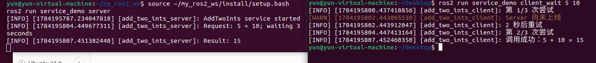
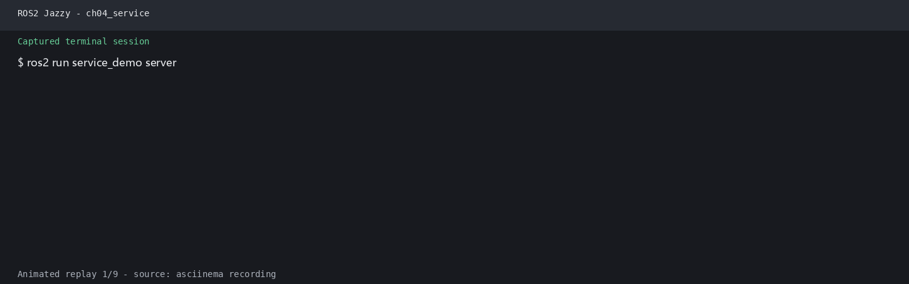

# 第4章 PPT：服务通信（Services）

> 共 17 页，标注页码 · 图号与教学文档对应

---

## P1 · 标题页

**服务通信（Services）**

- 课程：ROS2 Python 编程
- 章节：第 4 章
- 课时：2 课时（90 分钟）
- 教学方式：讲授 + 演示

<!-- 旁白：这是第 4 章服务通信的标题页。上一章话题是异步多对多，本章的同步请求-响应模式补上了另一半拼图。全章 2 课时，先建立服务模型，再学 Server 与 Client 的 API，最后落到超时、重试与降级三层容错。 -->

---

## P2 · 本课学习目标

- 理解请求-响应模型：同步、一对一、立即获取结果
- 掌握 .srv 服务接口的字段定义（Request / Response）
- 掌握 create_service / create_client 的核心 API
- 熟悉 ros2 service 命令行工具与自定义服务消息
- 区分同步调用与异步调用的阻塞行为
- 掌握服务超时、重试与降级的三层容错实践

<!-- 旁白：六条目标与前章结构呼应：前三条覆盖请求-响应模型、.srv 接口定义与核心 API，后三条聚焦调用方式差异与服务容错。学习时建议对照推进，每学完一节回看本页，确认对应目标已经掌握。 -->

---

## P3 · 服务通信架构

- **要点：** 同步请求-响应；一次调用一次应答；一个 Server 可并发服务多个 Client

```
Client                                   Server
  │                                         │
  │ ──── Request (call_id, args) ────────►  │
  │                                         │ process_request()
  │ ◄──── Response (call_id, result) ────   │
  │                                         │
```

图 4-1：服务通信请求-响应时序图。一个 Server 可并发处理多个 Client 请求。

- 服务通信采用同步请求-响应模式，适用于需要立即获取结果的一次性操作
- 与话题的「持续数据流」不同，服务是「问一次、答一次」的短任务通信

<!-- 旁白：时序图展示了服务通信的骨架：客户端发出带 call_id 的请求，服务端调用 process_request 处理后返回响应。记住三个关键词：同步、一对一、即问即答。与话题的持续数据流不同，服务适合查询状态、触发一次性动作这类短任务。 -->

---

## P4 · 服务接口定义（.srv 文件）

- **要点：** `---` 分隔线：上方 Request、下方 Response；字段为类型 + 名称

```python
# AddTwoInts.srv — 两整数相加服务
int64 a                  # 请求：第一个加数
int64 b                  # 请求：第二个加数
---                      # 分隔线（上：请求，下：响应）
int64 sum                # 响应：相加结果
string message           # 响应：附加消息
```

- 分隔线 `---` 上方定义 Request 字段，下方定义 Response 字段
- 服务类型 = 包名 + 服务名（如 `example_interfaces/srv/AddTwoInts`），Server 与 Client 双方以同一类型约定通信协议

<!-- 旁白：.srv 文件的结构非常简单：一条分隔线，上方是请求字段，下方是响应字段，均为类型加名称。AddTwoInts 是最经典的入门示例。注意服务类型的完整写法是包名加目录加服务名，双方必须使用同一类型，通信协议才能对上。 -->

---

## P5 · Python Server API

- **要点：** create_service(类型, 名称, 回调)；回调签名为 fn(request, response)，必须返回 response

```python
import rclpy
from rclpy.node import Node
from example_interfaces.srv import AddTwoInts

class AddTwoIntsServer(Node):
    def __init__(self):
        super().__init__('add_two_ints_server')
        # 创建服务：服务名 "add_two_ints"，类型 AddTwoInts
        self.srv = self.create_service(
            AddTwoInts,                    # 服务类型
            'add_two_ints',                # 服务名称
            self.handle_add_two_ints)      # 回调函数

    def handle_add_two_ints(self, request, response):
        """处理服务请求 — request包含a,b; response包含sum"""
        response.sum = request.a + request.b
        response.message = f'{request.a} + {request.b} = {response.sum}'
        self.get_logger().info(
            f'收到请求: {request.a} + {request.b} = {response.sum}')
        return response                    # 必须返回 response 对象
```

程序 4-1：Service Server 完整示例。

<!-- 旁白：服务端三步走：继承 Node、用 create_service 注册服务与回调、在回调中填充 response 并返回。回调签名为 fn(request, response)，必须返回 response 对象，这是初学者最常见的遗漏。程序 4-1 可直接照抄到工程中使用。 -->

---

## P6 · Python Client API

- **要点：** create_client(类型, 名称)；wait_for_service 等待上线；call_async 返回 future

```python
from example_interfaces.srv import AddTwoInts

class AddTwoIntsClient(Node):
    def __init__(self):
        super().__init__('add_two_ints_client')
        # 创建客户端：服务名 "add_two_ints"，类型 AddTwoInts
        self.client = self.create_client(
            AddTwoInts, 'add_two_ints')

    def send_request(self, a, b):
        """发送异步服务请求"""
        # 等待服务上线
        while not self.client.wait_for_service(timeout_sec=1.0):
            self.get_logger().info('等待服务上线...')

        # 构造请求
        request = AddTwoInts.Request()
        request.a = a
        request.b = b

        # 异步发送请求
        future = self.client.call_async(request)
        return future
```

程序 4-2：Service Client 异步调用示例。使用 `call_async` 发送异步请求，返回 `future` 对象。

<!-- 旁白：客户端同样三步：create_client 创建客户端，wait_for_service 等待服务上线，call_async 异步发送请求并返回 future。while 循环配合 timeout_sec=1.0 是等待上线的惯用写法。下一页会看到调用结果的两种取回方式。 -->

---

## P7 · 官方要点：服务模型与命令行工具

- **要点：** 服务适合「查询状态、触发一次性动作」；ros2 service 四命令调试服务端

```bash
ros2 service list                # 列出全部服务
ros2 service type /spawn        # 查询服务类型
ros2 service find <类型>         # 按类型找服务
ros2 service call /spawn turtlesim/srv/Spawn \
    "{x: 2.0, y: 2.0, theta: 0.0, name: ''}"   # 命令行直接调用
```

- 官方以小乌龟 `/spawn`、`/clear`、`/set_pen` 等服务为例：`ros2 service call` 不写一行代码即可验证服务端逻辑，是调试服务端最快捷的手段
- 服务是短任务；耗时数秒且有进度的任务应改用第 5 章的动作通信


官方服务演示：单个客户端一次「请求-响应」调用


官方服务演示：多个客户端向同一服务发起调用，Server 逐个应答

<!-- 旁白：ros2 service 四条命令覆盖服务调试的主要场景：list 列服务、type 查类型、find 按类型反查、call 直接调用。用 call 调用 /spawn 不写一行代码即可验证服务端逻辑，务必掌握。下方两张官方动图展示了单客户端与多客户端的调用形态。 -->

---

## P8 · 自定义服务消息与接口包

- **要点：** .srv 与 .msg 同样在独立接口包定义；接口改动后依赖包须重新 colcon build

```python
# Example.srv
# 上半部分：请求字段（可含多个字段）
int64 a
int64 b
---
# 下半部分：响应字段
int64 sum
```

- 接口包编译后即可被服务端与客户端共同引用；也支持跨包引用其他包定义的类型（如 `sensor_msgs/Image`）
- 接口类型定义改动后，所有依赖它的包都必须重新 `colcon build`，否则运行时出现「接口不匹配」的隐晦错误
- 工程约定：接口包保持独立、少量高频改动，便于大型团队协作

<!-- 旁白：自定义服务与自定义话题消息流程一致：独立接口包、.srv 文件、CMake 构建。要特别记住工程约定：接口定义改动后，所有依赖包必须重新 colcon build，否则会报出难以定位的接口不匹配错误。跨包引用其他类型也是允许的。 -->

---

## P9 · 同步调用 vs 异步调用

- **要点：** 同步 = 阻塞等待结果；异步 = add_done_callback 回调里取结果

```python
# 同步调用 — 阻塞主线程直到收到响应
future = self.client.call_async(req)
rclpy.spin_until_future_complete(
    self, future, timeout_sec=5.0)   # 同步等待完成
result = future.result()             # 获取结果
```

```python
# 异步调用 — 通过回调处理结果，不阻塞
future = self.client.call_async(req)
future.add_done_callback(self.response_callback)

def response_callback(self, future):
    result = future.result()
    self.get_logger().info(f'Result: {result.sum}')
```

| 对比项 | 同步调用 | 异步调用 |
| --- | --- | --- |
| 等待方式 | spin_until_future_complete | add_done_callback 注册回调 |
| 阻塞行为 | 阻塞主线程直到响应 | 不阻塞，可继续处理其他任务 |
| 结果获取 | future.result() 直接取值 | 回调函数内 future.result() |
| 适用场景 | 简单顺序流程 | 并发多路请求、事件驱动 |

<!-- 旁白：取回 future 结果有两种方式：同步用 spin_until_future_complete 阻塞等待，异步用 add_done_callback 注册回调。对照表请重点看阻塞行为一栏：同步会卡住主线程，异步则不阻塞。简单顺序流程用同步，并发或事件驱动场景用异步。 -->

---

## P10 · 官方要点：编写 Service 与 Client

- **要点：** 「先等待、再调用」是标准姿势；服务回调运行在 spin 执行线程内

```python
# 服务端
self.srv = self.create_service(
    AddTwoInts, 'add_two_ints', self.add_two_ints_callback)

# 客户端 — 三步走
self.client = self.create_client(AddTwoInts, 'add_two_ints')
while not self.client.wait_for_service(timeout_sec=1.0):
    self.get_logger().info('等待服务上线...')   # 先等待
future = self.client.call_async(request)        # 再调用
rclpy.spin_until_future_complete(self, future, timeout_sec=5.0)
```

- 客户端在服务端未启动时调用会立即报错，因此「先等待、再调用」是标准姿势
- 服务回调运行在 `spin` 的执行线程内，复杂工作应移到独立线程或改用 Action，避免阻塞其他回调



练习 4.4 的 client_wait 运行输出：Server 启动后，等待中的客户端立即完成调用并打印求和结果

<!-- 旁白：官方实践给出标准姿势：先等待、再调用。客户端在服务端未启动时直接调用会立即报错，wait_for_service 就是为此而生。同时注意服务回调运行在 spin 执行线程内，复杂工作应移到独立线程或改用 Action。下方截图是练习 4.4 的验证输出。 -->

---

## P11 · 4.3.1 超时处理

- **要点：** spin_once 轮询 + future.done() 判断；超时后 future.cancel() 并返回 None

```python
import time

def call_with_timeout(self, a, b, timeout=5.0):
    req = AddTwoInts.Request()
    req.a = a; req.b = b

    future = self.client.call_async(req)
    start_time = time.time()

    # 带超时的轮询
    while rclpy.ok():
        rclpy.spin_once(self, timeout_sec=0.1)
        if future.done():
            return future.result()
        if time.time() - start_time > timeout:
            self.get_logger().error('服务调用超时！')
            future.cancel()
            return None

    return None
```

程序 4-3：服务调用超时处理模式。

- 超时保护防止客户端无限期阻塞，是服务调用的第一层防护

<!-- 旁白：超时处理是第一层防护：用 spin_once 以 0.1 秒为步长轮询，配合 future.done() 判断完成；超时则调用 future.cancel() 并返回 None。相比 spin_until_future_complete 的一次性等待，轮询方式能在超时后执行自定义日志与清理逻辑。 -->

---

## P12 · 4.3.2 重试机制

- **要点：** wait_for_service 确认在线 + 有限次重试；全部失败后返回 None

```python
def call_with_retry(self, a, b, max_retries=3):
    """带重试的服务调用"""
    for attempt in range(max_retries):
        if self.client.wait_for_service(timeout_sec=2.0):
            req = AddTwoInts.Request()
            req.a = a; req.b = b
            future = self.client.call_async(req)
            rclpy.spin_until_future_complete(
                self, future, timeout_sec=5.0)
            if future.result() is not None:
                return future.result()

        self.get_logger().warn(
            f'重试 {attempt + 1}/{max_retries}...')

    self.get_logger().error('所有重试均失败！')
    return None
```

- 练习 4.4 中 client_wait 的运行输出：Server 不在线时反复检查并提示「等待服务上线」，Server 一上线立即调用成功


练习 4.4 运行输出：Server 未启动时，client_wait 反复检查服务、提示尚无服务可用

<!-- 旁白：重试机制的关键是有限次加退避：每次先 wait_for_service 确认服务在线，调用失败后打印重试进度，超过上限就返回 None 并记录错误。下方的练习 4.4 输出展示了 Server 未上线时客户端反复等待、上线后立即成功的完整过程。 -->

---

## P13 · 4.3.3 三层容错实践

- **要点：** rclpy Future 双用法；容错三层：超时 → 重试 → 降级

| 容错层 | 手段 | 对应知识点 |
| --- | --- | --- |
| 第一层：超时 | spin_until_future_complete(timeout_sec) 超时即放弃 | 4.3.1 |
| 第二层：重试 | 对超时或网络错误做有限次退避重试 | 4.3.2 |
| 第三层：降级 | 多次失败后切换备用策略（如本地默认值） | 4.3.3 |

- `call_async` 返回的 Future 可用 `add_done_callback` 注册完成回调，也可用 `spin_until_future_complete` 阻塞等待
- The Construct 称此为「健壮服务客户端模式（Robust Service Client Pattern）」，在导航、机械臂等真实应用中大量使用
- 建议结合练习 4.5 的并发测试观察服务端在并发请求下的行为

<!-- 旁白：三层容错是本节的方法论总结：第一层超时防止无限阻塞，第二层重试应对瞬时故障，第三层降级在多次失败后切换备用策略，如返回本地默认值。这套模式在导航、机械臂等真实系统中大量使用。可结合练习 4.5 的并发测试加深体会。 -->

---

## P14 · 仿真结合实例：服务节点与 Gazebo 巡检仿真并行运行

- **要点：** 同一 ROS 2 图中并存：Gazebo 持续话题流 + 服务一次性调用

```bash
# 终端 1：启动 Gazebo 仿真（gui/rviz/drive 均关闭）
ros2 launch robot_sim_demo gazebo2.launch.py gui:=false rviz:=false drive:=false

# 终端 2：启动服务端
ros2 run service_demo_cpp server

# 终端 3：查询服务并发送请求
ros2 service list | grep greetings
ros2 run service_demo_cpp client
```

- 观察点：`ros2 service list` 能发现 `/greetings`，客户端返回服务器的响应文本；Gazebo 仍独立发布 `/scan`、`/odom`、`/tf`——服务调用不会替代传感器话题
- 将 C++ 命令替换为 `ros2 run service_demo_py server_demo` 与 `client_demo`，可对比两种语言的 Client/Server API



<!-- 旁白：本页演示服务与仿真的并存运行：三个终端分别启动 Gazebo、服务端与客户端。观察点很清晰——服务调用是独立的一次性请求，Gazebo 的 /scan、/odom、/tf 话题流不受影响。把 C++ 命令换成 Python 版本，还能对比两种语言的 API 差异。 -->

---

## P15 · 本章要点

1. 服务通信是同步请求-响应模式：Client 发送 Request，Server 返回 Response
2. .srv 文件用 `---` 分隔：上半部分 Request、下半部分 Response
3. Server 使用 `create_service(类型, 名称, 回调)`，回调签名为 `fn(request, response)`，必须返回 response
4. Client 使用 `create_client(类型, 名称)`，`wait_for_service` 等待上线后用 `call_async()` 发送请求
5. 同步调用用 `spin_until_future_complete()`；异步调用用 `add_done_callback()`
6. 生产环境必须处理超时和重试（必要时降级），提高系统鲁棒性

<!-- 旁白：六条要点回顾全章：前四条对应模型、接口与两端 API，第五条区分同步与异步调用，第六条强调生产环境必须有超时、重试与降级。建议逐条自查，能完整复述 create_service 与 call_async 的用法后，再进入练习环节。 -->

---

## P16 · 练习题

1. 基于 `example_interfaces/srv/AddTwoInts` 编写 Server 和 Client 节点，验证加法功能
2. 设计 `.srv` 文件 `WeatherQuery.srv`（输入：城市名 string；输出：温度 float64 + 天气 string），实现查询服务
3. 测试服务超时：Client 设置 1 秒超时，Server 处理时间设为 3 秒，观察超时行为
4. 编写带重试机制的 Client_wait：Server 不在线时自动重试 3 次，对比 Server 未启动与启动后的输出
5. 测试多个 Client 同时向同一个 Server 发送请求时的并发处理行为
6. 使用 `ros2 service call` 命令行调用服务，验证 Server 响应

<!-- 旁白：六道练习覆盖本章主线：第一题复现经典加法示例，第二题设计天气查询服务，第三四题分别验证超时与重试，第五题观察并发行为，第六题用命令行直接调用。完成后对照三层容错框架，确认每种容错手段都亲手触发过一次。 -->

---

## P17 · 下章预告

**第 5 章：动作通信（Actions）**

- 目标（Goal）、反馈（Feedback）、结果（Result）三段式通信
- Action Server / Action Client 的编写与回调链
- 取消与抢占机制，支撑长时间任务的工程实践

<!-- 旁白：下一章进入动作通信：目标、反馈、结果三段式设计，专为耗时数秒以上的长任务而生。Action Server 与 Client 的回调链、取消与抢占机制都会展开。服务章节打下的容错思维在动作通信中会进一步深化，请先完成本章练习再继续。 -->