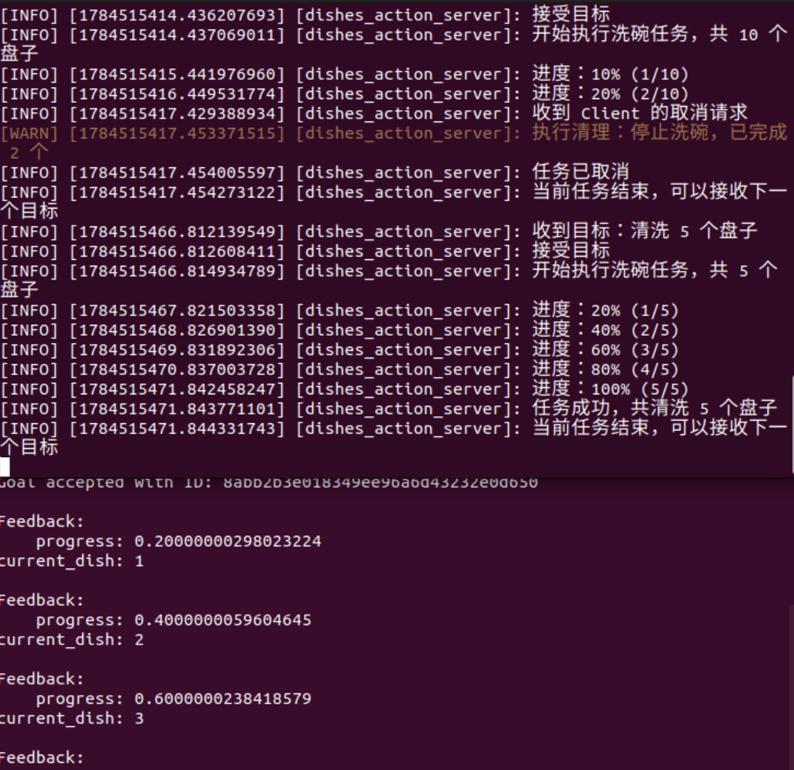

# 第5章 PPT：动作通信（Actions）

> 共 13 页

---

## P1 · 标题页
**动作通信（Actions）** | 第5章 | 2课时

## P2 · 学习目标
- 理解动作通信架构
- 定义 .action 接口
- 编写 Action Server 和 Client
- 实现取消和抢占

## P3 · 动作通信时序

```
Client ──Goal──► Server
       ◄─Accept─
       ◄Feedback── (topic)
       ◄−Result── (service)
```

图 5-1：Goal → Feedback → Result

## P4 · .action 文件结构
```python
# Goal
uint32 total_dishes
---
# Result
bool success
---
# Feedback
float32 progress
```

## P5 · ActionServer 核心 API

程序 5-1：
- `execute_callback` (async)
- `goal_callback` (ACCEPT/REJECT)
- `cancel_callback`

## P6 · ActionServer 执行循环

```python
async def execute(self, goal_handle):
    while not done:
        if goal_handle.is_cancel_requested:
            goal_handle.canceled()
            return
        goal_handle.publish_feedback(fb)
        await asyncio.sleep(1.0)
    goal_handle.succeed()
```

## P7 · ActionClient 核心 API

程序 5-2：
- `send_goal_async(goal, feedback_callback=...)`
- `goal_response_callback`
- `result_callback`

## P8 · 取消机制
`Client → cancel_goal_async() → Server: is_cancel_requested → canceled()` 

## P9 · 抢占机制
`GoalResponse.REJECT` 拒绝新目标

## P10 · 多目标管理
Server 可维护目标队列，串行/并行执行

## P11 · 本章要点
1. Action = 服务(Goal/Result) + 话题(Feedback)
2. Server 需 async/await 支持
3. 支持取消 + 抢占
4. 适用：导航、机械臂运动等长时间任务

## P12 · 练习题
1. DoDishes Action 完整实现
2. Tracking.action 设计
3. 中途取消测试
4. 抢占行为测试
5. `ros2 action` CLI
·编辑：
```bash
nano src/tracking_interfaces/action/Tracking.action
```
改成：
string target_id
geometry_msgs/Point target
float64 speed
---
bool success
---
float64 current_position
float64 distance
· 修改 Tracking Server
编辑：
```bash
nano $src/tracking_server/tracking_server/server.py
```
在 goal_callback() 中增加：
```python
if not goal_request.target_id.strip():
    self.get_logger().warning('目标 ID 不能为空')
    return GoalResponse.REJECT

if not math.isfinite(goal_request.speed):
    self.get_logger().warning('速度不是有效数值')
    return GoalResponse.REJECT

if goal_request.speed <= 0.0:
    self.get_logger().warning('速度必须大于 0')
    return GoalResponse.REJECT

speed = 0.25
# 改为：
speed = goal_handle.request.speed
```
· 修改 Tracking Client
```bash
nano $src/tracking_server/tracking_server/client.py
```
```python
def send_goal(self, x, y, z):
# 改为：
def send_goal(self, target_id, x, y, speed, z=0.0):
# 在创建 Goal 的位置改成：
goal = Tracking.Goal()
goal.target_id = target_id
goal.target.x = x
goal.target.y = y
goal.target.z = z
goal.speed = speed
# 将原来的 main() 替换为：
def main(args=None):
    if len(sys.argv) not in (5, 6):
        print(
            '用法: ros2 run tracking_server client '
            '<target_id> <x> <y> <speed> [z]'
        )
        print(
            '示例: ros2 run tracking_server client '
            'target_1 2.0 1.0 0.25'
        )
        return

    target_id = sys.argv[1]

    try:
        x = float(sys.argv[2])
        y = float(sys.argv[3])
        speed = float(sys.argv[4])
        z = float(sys.argv[5]) if len(sys.argv) == 6 else 0.0
    except ValueError:
        print('错误: 坐标和速度必须是数字')
        return

    if speed <= 0.0:
        print('错误: speed 必须大于 0')
        return

    rclpy.init(args=args)

    node = TrackingClient()
    node.send_goal(target_id, x, y, speed, z)

    try:
        rclpy.spin(node)
    except KeyboardInterrupt:
        pass
    finally:
        node.destroy_node()

        if rclpy.ok():
            rclpy.shutdown()


if __name__ == '__main__':
    main()
 ```
· 把取消时间改成 3 秒
```bash
nano $src/dishes_action_lab/dishes_action_lab/dishes_client.py
```
```python
self._cancel_timer = self.create_timer(
    5.0,
    self.cancel_goal,
)
改成：
self._cancel_timer = self.create_timer(
    3.0,
    self.cancel_goal,
)
```
·编译新工作空间
```bash
cd ~/my_ros2_ws
source /opt/ros/humble/setup.bash

colcon build --symlink-install \
  --packages-select tracking_interfaces tracking_server

source ~/my_ros2_ws/install/setup.bash
```
· 测试 Tracking
```bash
#终端 1：
source /opt/ros/humble/setup.bash
source ~/my_ros2_ws/install/setup.bash
ros2 run tracking_server server
#终端 2：
source /opt/ros/humble/setup.bash
source ~/my_ros2_ws/install/setup.bash
ros2 run tracking_server client target_1 2.0 1.0 0.25
#测试不同速度：
ros2 run tracking_server client target_2 2.0 1.0 0.50
#第二次应该更快完成。
```
· CLI 测试
保持 DoDishes Server 运行：
```bash
ros2 action list -t
ros2 action info /do_dishes_lab

ros2 action send_goal /do_dishes_lab \
  dishes_action_interfaces/action/DoDishes \
  "{total_dishes: 5}" --feedback
```
## P13 · 命令行操作
```bash
ros2 action list
ros2 action send_goal /do_dishes ... "{total_dishes: 5}"
ros2 action info /do_dishes
```
