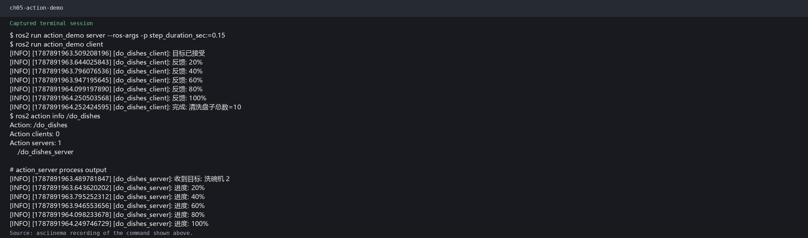

# 第5章 PPT：动作通信（Actions）

> 共 17 页，标注页码 · 图号与教学文档对应

---

## P1 · 标题页

**动作通信（Actions）**

- 课程：ROS2 Python 编程
- 章节：第 5 章
- 课时：2 课时（90 分钟）
- 教学方式：讲授 + 演示

<!-- 旁白：这是第 5 章动作通信的标题页。前两章的观测靠话题、查询靠服务，而导航到点、抓取物品这类长任务需要进度反馈与中途取消，这正是动作的用武之地。本章 2 课时，从三种通信方式对比起步，到两端 API、取消抢占，最后看 Nav2 工程实践。 -->

---

## P2 · 本课学习目标

- 理解动作的适用场景：长时间、可反馈、可取消的任务
- 对比话题、服务与动作三种通信模式的差异
- 掌握 .action 接口文件的三段式定义（Goal / Result / Feedback）
- 掌握 Action Server 与 Action Client 的核心 API 与回调链
- 掌握取消与抢占机制及其判定流程
- 了解 Nav2 等工程实践中的动作使用模式

<!-- 旁白：六条目标承接前章脉络：前三条解决什么时候用动作、.action 怎么定义，后三条覆盖两端 API、取消抢占与工程案例。注意第一条中的三个关键词：长时间、可反馈、可取消，它们是动作区别于话题与服务的本质特征，也是后续内容的判断标准。 -->

---

## P3 · 动作 vs 话题 vs 服务

- **要点：** 动作 = 完成一个目标的全过程；动作在底层由话题与服务组合实现

| 特性 | 话题 (Topic) | 服务 (Service) | 动作 (Action) |
| --- | --- | --- | --- |
| 通信模式 | 异步多对多 | 同步一对一 | 异步 + 双向反馈 |
| 持续时间 | 持续数据流 | 短时一次调用 | 长时间任务（秒~分钟） |
| 反馈 | 无 | 无 | 有（进度反馈） |
| 取消 | 不支持 | 不支持 | 支持取消和抢占 |

- 动作在底层由 2 个话题 + 2 个服务实现，允许反馈与取消，适合长时间任务
- 对比小结：有反馈需求、执行时间长、需要中途取消的任务选用动作

<!-- 旁白：对比表是本章的决策依据：话题是异步多对多的持续数据流，服务是同步一对一的短调用，动作则是异步加双向反馈的长任务。特别提醒：动作并非全新机制，底层由两个话题加两个服务组合实现。选型口诀请记牢：有反馈、时间长、可取消，选动作。 -->

---

## P4 · 动作通信时序图

- **要点：** Client 发送目标 → Server 接受 → 执行中持续反馈 → 完成返回最终结果

```
Client                           Server
  │                                  │
  │ ── Goal Request ──────────────►  │
  │ ◄── Goal Accepted ────────────   │  执行目标（耗时操作）
  │                                  │
  │ ◄── Feedback (持续上报进度) ────  │
  │ ◄── Feedback (持续上报进度) ────  │
  │                                  │
  │ ◄── Final Result (最终结果) ────  │
  │                                  │
```

图 5-1：动作通信时序图。动作结合话题（Feedback 流）与服务（Goal / Result / Cancel）的能力。

<!-- 旁白：时序图完整呈现动作的生命周期：发送目标、服务端接受、执行期间持续上报反馈，最后返回最终结果。图中反馈消息出现两次，正说明反馈是持续的数据流。这张图把底层四个通道抽象成一条时间线，建议对照图注理解动作是话题与服务的组合。 -->

---

## P5 · 官方演示：动作执行数据流

- **要点：** 官方小乌龟例子：目标位置 → 持续反馈 → 到达后返回结果


官方动作演示：Action Client 发送目标（如到达某个位置），Action Server 执行期间持续发布进度反馈，完成后返回最终结果

- 动作的「目标 / 反馈 / 结果」三要素分别在不同话题与服务器上传递，Client 全程异步等待

<!-- 旁白：官方小乌龟演示直观展示动作数据流：客户端发送到达某位置的目标，服务端执行期间持续发布进度，到达后返回结果。注意三要素的传递是异步的：目标用服务通道，反馈用话题通道，结果再回服务通道。全程客户端无需阻塞等待，可继续其他工作。 -->

---

## P6 · .action 文件结构

- **要点：** 两条 `---` 分隔线分成三部分：Goal / Result / Feedback

```python
# DoDishes.action — 洗盘子动作
uint32 total_dishes    # 目标段 Goal：总共需要洗的盘子数
---
uint32 cleaned_dishes  # 结果段 Result：已清洗干净的盘子数
bool success           #                   是否成功完成
---
float32 progress       # 反馈段 Feedback：进度（0.0 ~ 1.0）
uint32 current_dish    #                当前洗到第几个盘子
```

- 第一部分：Goal（客户端请求的目标）；第二部分：Result（任务最终结果）；第三部分：Feedback（执行期间的进度反馈）
- 服务端可用 `.action` 文件中的名称直接访问字段，如 `goal_request.total_dishes`

<!-- 旁白：.action 文件由两条分隔线分成三段：Goal、Result、Feedback，DoDishes 洗盘子示例是经典教材。字段命名直观：total_dishes 是目标，cleaned_dishes 与 success 是结果，progress 是进度反馈。服务端可直接访问字段名，如 goal_request.total_dishes，编写时不要混淆三段的位置。 -->

---

## P7 · Action Server API

- **要点：** ActionServer(节点, 类型, 名称, execute/goal/cancel 回调)；execute 为异步函数

```python
import asyncio
from rclpy.action import ActionServer, CancelResponse, GoalResponse
from action_demo_interfaces.action import DoDishes

class DoDishesServer(Node):
    def __init__(self):
        super().__init__('do_dishes_server')
        self.action_server = ActionServer(
            self, DoDishes, 'do_dishes',
            execute_callback=self.execute,   # 执行（异步）
            goal_callback=self.goal,         # 目标判定
            cancel_callback=self.cancel)     # 取消判定

    def goal(self, goal_request):
        """是否接收新目标"""
        return GoalResponse.ACCEPT            # 或 REJECT

    def cancel(self, goal_handle):
        """是否接收取消请求"""
        return CancelResponse.ACCEPT

    async def execute(self, goal_handle):
        """执行目标 — 每个动作目标独立调度"""
        total = goal_handle.request.total_dishes
        feedback_msg = DoDishes.Feedback()
        for i in range(1, total + 1):
            if goal_handle.is_cancel_requested:   # 检查取消
                goal_handle.canceled()
                return DoDishes.Result(cleaned_dishes=i - 1,
                                       success=False)
            await asyncio.sleep(1.0)              # 模拟 1 秒/盘
            feedback_msg.progress = i / total
            feedback_msg.current_dish = i
            goal_handle.publish_feedback(feedback_msg)
        goal_handle.succeed()
        return DoDishes.Result(cleaned_dishes=total, success=True)
```

程序 5-1：Action Server 完整示例。execute 必须声明为 `async`，内部可 `await` 耗时操作。

<!-- 旁白：服务端核心是 ActionServer 构造与三个回调：goal 判定是否接受目标，cancel 判定是否接受取消，execute 异步执行。execute 必须声明为 async，内部用 await 处理耗时操作，每洗完一个盘子就 publish_feedback 并检查取消请求。完成后调用 goal_handle.succeed 并返回 Result。 -->

---

## P8 · Action Client API

- **要点：** wait_for_server + send_goal_async；goal/feedback/result 三个回调

```python
from rclpy.action import ActionClient

class DoDishesClient(Node):
    def __init__(self):
        super().__init__('do_dishes_client')
        self.client = ActionClient(self, DoDishes, 'do_dishes')

    def send_goal(self, total_dishes):
        """发送目标"""
        self.client.wait_for_server()            # 等待服务端
        goal_msg = DoDishes.Goal()
        goal_msg.total_dishes = total_dishes
        future = self.client.send_goal_async(
            goal_msg,
            feedback_callback=self.feedback_cb)  # 注册反馈回调
        future.add_done_callback(self.goal_resp_cb)  # 目标响应链

    def goal_resp_cb(self, future):
        """服务端是否接受目标"""
        goal_handle = future.result()
        if not goal_handle.accepted:
            return
        goal_handle.result_cb = self.result_cb  # 结果回调链

    def feedback_cb(self, feedback_msg):
        """接收进度反馈"""
        fb = feedback_msg.feedback
        self.get_logger().info(
            f'进度: {fb.current_dish}/{fb.progress * 100:.0f}%')

    def result_cb(self, future):
        """获取最终结果"""
        result = future.result()
        self.get_logger().info(f'结果: {result.success}')
```

程序 5-2：Action Client 完整示例。send_goal_async → goal 响应 → result，形成回调链。

<!-- 旁白：客户端的回调链是本页精髓：send_goal_async 发送目标，goal_resp_cb 检查目标是否被接受，接受后挂接 result_cb 等待最终结果，feedback_cb 全程接收进度反馈。四个函数环环相扣，全部异步执行。对照程序 5-2 理清回调顺序，是掌握动作客户端的关键。 -->

---

## P9 · 官方要点：动作模型与命令行工具

- **要点：** ros2 action 四命令：list / info / send_goal；send_goal 带 --feedback 实时查看

```bash
ros2 action list -t                 # 列出动作与类型
ros2 action info /turtle1/rotate_abs # 查看动作的 2 话题 + 2 服务
ros2 action send_goal /fibonacci \
    action_tutorials_interfaces/action/Fibonacci \
    "{order: 5}" --feedback          # 调用并显示进度反馈
```

- 官方以斐波那契数列 Fibonacci 为例：Client 发目标（求前 N 项），Server 计算中持续反馈部分序列，完成后返回完整序列
- 外卖比喻：顾客（Client）下单后收到配送进度更新，再收到送达确认——服务（Service）相当于「下了单就干等」，动作（Action）全程有反馈

<!-- 旁白：命令行工具 ros2 action 三板斧：list 查看动作及类型，info 查看底层的 2 话题加 2 服务，send_goal 配合 --feedback 直接调用并实时观察进度。外卖比喻非常好记：服务是下单后干等，动作是全程推送配送进度。官方 Fibonacci 示例练习时可直接复用这些命令。 -->

---

## P10 · 官方要点：编写动作服务器与客户端

- **要点：** 三个回调：goal / execute / cancel；execute 内 publish_feedback 持续反馈

```python
# Action Server 三个核心回调
goal_callback(goal_request)      # 目标到达 → ACCEPT / REJECT
execute_callback(goal_handle)    # 异步执行 → publish_feedback
                                 #           → succeed()/abort()/canceled()
cancel_callback(goal_handle)     # 取消请求 → ACCEPT / REJECT
```

- 执行循环中反复检查 `goal_handle.is_cancel_requested`，配合 `goal_handle.canceled()` 优雅退出
- 官方示例从「单目标顺序完成」演进到「多目标排队」，再到「支持取消与抢占」，覆盖了动作服务端设计的三个版本
- `ros2 action send_goal --feedback` 可在不写代码的情况下观察完整动作生命周期

<!-- 旁白：本页浓缩官方教程要点：动作服务端就是 goal、execute、cancel 三个回调的编排，执行循环中反复检查 is_cancel_requested，配合 canceled() 优雅退出。官方示例从单目标顺序完成演进到多目标排队，再到支持取消抢占，三个版本对应了由简到繁的设计思路。 -->

---

## P11 · 官方要点：自定义动作接口

- **要点：** .action 三段式；放在接口包的 action/ 目录；package.xml 声明生成器依赖

```python
# Fibonacci.action
uint32 order                 # Goal
---
int32[] sequence             # Result
---
int32[] partial_sequence     # Feedback
```

- 创建自定义动作：接口包中新建 `action/` 目录，放置 `xxx.action` 文件，编写三段式定义
- `package.xml` 须声明 `rosidl_default_generators` 等生成器依赖，否则编译期报「未找到 action 生成器」错误
- `ros2 interface show <接口名>` 可查看已定义的动作接口内容

<!-- 旁白：自定义动作接口的流程与 .msg、.srv 一脉相承：接口包中新建 action 目录，放置三段式的 .action 文件。特别要注意 package.xml 中必须声明 rosidl_default_generators 生成器依赖，漏掉会导致编译期报错。定义完成后用 ros2 interface show 验证接口内容。 -->

---

## P12 · 取消与抢占机制

- **要点：** 取消是「Server 可拒绝的协作式取消」；抢占 = 新目标 REJECT 旧目标

```
Client → send_goal_async(新目标) ──► Server: goal_callback → REJECT
Server: execute() 循环中检测 → is_cancel_requested == True
    goto ACT_CANCELED → goal_handle.canceled() → 返回
    （同时 notify_client_canceled() 通知客户端）

Client ←─ 收到 canceled 状态 ── 客户端 get_result 返回 CANCELED
```

- 取消是协作式：Server 在执行循环中主动检测 `is_cancel_requested` 才能停下，不会强制打断
- 抢占（多目标时的新目标优先）：对旧目标返回 `GoalResponse.REJECT`，客户端可转而去处理新目标
- 取消结果判定：`goal_handle.canceled()` 之后，客户端侧收到的是 CANCELED 状态

<!-- 旁白：取消与抢占是动作的灵魂：取消是协作式的，服务端在执行循环中主动检测 is_cancel_requested 才会停下，客户端无法强制打断。抢占则是新目标到达时对旧目标返回 REJECT。注意两个状态的区别：主动取消对应 CANCELED，执行异常对应 ABORTED。 -->

---

## P13 · 工程实践：动作的三类应用

- **要点：** Nav2 导航、MoveIt 2 机械臂、slam_toolbox 地图构建均以动作为核心接口


Nav2 总体架构图。导航全流程由 `navigate_to_pose` 等动作组织：接到目标、导航途中持续反馈进度、到达后返回结果。

- 反馈频率建议 1–10 Hz：过高浪费带宽，过低用户感知迟钝
- 5.3.2 抢占语义明确：导航途中收到新目标，旧目标被抢占取消，机器人立即转向新目的地
- 客户端必须处理三种结果终态：

| 终态 | 含义 | 处理建议 |
| --- | --- | --- |
| SUCCEEDED | 目标成功完成 | 正常收尾 |
| CANCELED | 目标被取消 | 清理现场、记录日志 |
| ABORTED | 执行异常中止 | 错误处理、上报 |

<!-- 旁白：Nav2 架构图展示了动作在真实系统中的核心地位：整个导航流程由 navigate_to_pose 等动作组织。工程实践给出两条经验：反馈频率 1 到 10 赫兹为宜；客户端必须处理 SUCCEEDED、CANCELED、ABORTED 三种终态，不能只写成功分支。导航途中收到新目标时，旧目标被抢占，机器人立即转向。 -->

---

## P14 · 仿真结合实例：多个动作客户端并发洗盘子

- **要点：** 单个动作服务端可同时服务多个客户端；Dishes 仿真演示 FIFO 队列与反馈

```bash
# 终端 1：启动动作服务端
ros2 run action_demo_cpp dishes_server

# 终端 2：启动两个动作客户端（观察并发）
ros2 run action_demo_cpp dishes_client
ros2 run action_demo_cpp dishes_client
```

- 观察点：服务端日志显示两个客户端的动作目标交替执行或排队；反馈展示进度（当前盘子数 / 总盘子数）；完成一个目标后 FIFO 队列自动调度下一个
- 对比 `ros2 action list -t` 与 `ros2 service list` 输出，可以看到动作在底层展开为 2 个话题 + 2 个服务




<!-- 旁白：并发演示用两个终端同时启动客户端：单个服务端同时服务多个目标，日志中可以看到目标交替执行或排队，反馈持续展示当前盘子数，完成一个目标后 FIFO 队列自动调度下一个。用 ros2 action list -t 对比 service list，可以亲眼验证动作在底层的展开形式。 -->

---

## P15 · 本章要点

1. 动作 = 服务（Goal / Result / Cancel）+ 话题（Feedback），面向长时间、可反馈、可取消任务
2. .action 文件用两条 `---` 分成 Goal / Result / Feedback 三段
3. Action Server：execute（异步执行）、goal（接受/拒绝）、cancel（取消）三个回调
4. Action Client：wait_for_server + send_goal_async，feedback_callback 接收进度、result_callback 获取结果
5. 取消是协作式的：execute 内检测 is_cancel_requested，调用 canceled() 后再返回
6. 抢占用 GoalResponse.REJECT 拒绝旧目标；客户端须处理 SUCCEEDED / CANCELED / ABORTED 三种终态

<!-- 旁白：六条要点浓缩全章：第一条给出动作的本质定义，第二三条是文件结构与三个回调，第四条是客户端回调链，五六条是取消抢占机制。对照自查时，建议重点复述协作式取消的流程：检测 is_cancel_requested、调用 canceled、客户端收到 CANCELED。 -->

---

## P16 · 练习题

1. 编写 Action Server 执行斐波那契数列任务，每计算一项发布一次反馈
2. 编写 Action Client 订阅反馈并打印当前进度，比较 `--feedback` 选项的输出
3. 实现取消功能：Server 收到取消请求时停止当前任务并返回 CANCELED
4. 对比 ROS2 三种通信方式，选择一个场景设计话题 + 服务 + 动作的混合方案
5. 定义自己的接口（如洗车、擦桌子等任务），并添加反馈与取消支持

<!-- 旁白：五道练习层层递进：斐波那契服务端与反馈客户端是基础，第三题实现取消，第四题设计三通信方式的混合方案，第五题自定义接口。第四题是开放题，建议从机器人巡检切入：话题发布传感器数据、服务查询电量、动作执行整段巡检，三种方式各司其职。 -->

---

## P17 · 下章预告

**第 6 章：参数与 Launch（Parameters & Launch）**

- 参数（Parameter）：节点的动态配置，运行时读写、无需重启
- Launch 文件：一个命令启动多节点、多参数、多命名空间
- 参数 + Launch 组合：机器人系统的「一键启动」工程实践

<!-- 旁白：下一章进入参数与 Launch：参数让节点配置在运行时读写、无需重启，Launch 文件把多节点、多参数、多命名空间的启动工作合并为一条命令。两者组合即机器人系统的一键启动。至此三大通信方式全部学完，本套课件的教学主线也进入收官阶段。 -->