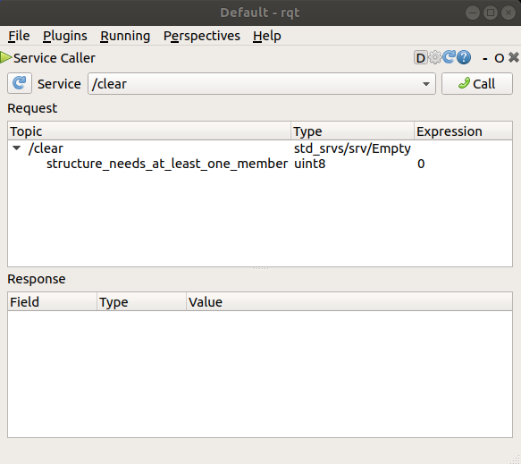
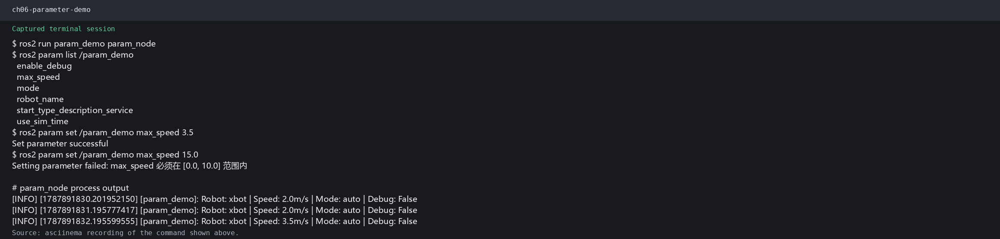

# 第6章 PPT：参数系统与 Launch 文件

> 共 15 页，标注页码 · 图号与教学文档对应

---

## P1 · 标题页

**参数系统与 Launch 文件**

- 课程：ROS2 Python 编程
- 章节：第 6 章
- 课时：2 课时

<!-- 旁白：这是第 6 章参数系统与 Launch 文件的标题页。前几章学会用话题与服务传递数据，但节点的配置和系统一次性启动还没解决，这正是本章的两大主题。本章 2 课时，先讲参数声明、回调与 YAML 加载，再讲 Launch 的组合编排。 -->

---

## P2 · 本课学习目标

- 掌握参数声明与获取：`declare_parameter` / `get_parameter`
- 熟悉参数回调 `add_on_set_parameters_callback` 实现动态重配置
- 会用 YAML 参数文件配合 `--params-file` 批量加载
- 掌握 Python Launch 文件结构与 `Node()` 动作
- 用 `LaunchConfiguration` + `IfCondition` 实现参数传递与条件启动
- 用 `IncludeLaunchDescription` 组合多个 Launch 文件

<!-- 旁白：六个目标分为两半：前三项围绕参数，涵盖声明、获取、回调验证与 YAML 批量加载；后三项围绕 Launch，涵盖节点动作、条件启动与文件组合。学习时注意一条分工主线：参数解决节点的内部配置，Launch 解决系统的外部编排。 -->

---

## P3 · 参数声明与获取

```python
class ParamDemoNode(Node):
    def __init__(self):
        super().__init__('param_demo')

        # 声明参数：名称、默认值、描述
        self.declare_parameter('robot_name', 'xbot')
        self.declare_parameter('max_speed', 2.0)
        self.declare_parameter('enable_logging', True)
        self.declare_parameter('sensor_list', ['lidar', 'camera'])

        # 获取参数值
        name = self.get_parameter('robot_name').value
        speed = self.get_parameter('max_speed').value
        self.get_logger().info(
            f'机器人: {name}, 最大速度: {speed}m/s')
```

- 参数是「每个节点的键值对配置项」，可携带类型、描述与默认值
- 声明集中在 `__init__` 中完成，命名使用蛇形小写

<!-- 旁白：参数是每个节点可独立配置的键值对，声明集中在初始化函数里并给出默认值。代码覆盖四种基础类型外加数组参数，注意 get_parameter 返回的是参数对象，取值要加 .value。好处是同样的代码可以用不同配置启动多套实例。 -->

---

## P4 · 参数类型与命令行工具

| 参数类型 | 说明 | 示例 |
|----------|------|------|
| 布尔 / 整数 / 浮点 / 字符串 | 四类基础类型 | `max_speed = 2.0` |
| 四类基础类型的数组 | 列表型配置 | `['lidar', 'camera']` |
| 描述与默认值 | 声明时一并给定 | `robot_name='xbot'` |

| 命令 | 作用 |
|------|------|
| `ros2 param list` | 列出节点参数 |
| `ros2 param get <node> <name>` | 读取参数 |
| `ros2 param set <node> <name> <value>` | 运行时修改，立即生效 |
| `ros2 param dump` | 参数快照保存为 YAML 文件 |

- 官方示例：`set` 小乌龟 `background_b` 后画面立即变色，演示动态生效
- 静态配置（分辨率、串口号）求稳，运行时可调项（速度上限）求灵活


图：官方小乌龟示例——通过命令行修改画笔参数，画面立即生效。


图：官方小乌龟示例——spawn 服务调用把实体位姿与名称作为参数传入。

<!-- 旁白：本页两张表给出参数类型与命令行四件套。官方小乌龟示例最有说服力：运行时执行 param set 修改背景或画笔参数，画面立刻变化。两张图演示了参数即命令的直观效果。记住分工：静态配置求稳，运行时可调项求灵活。 -->

---

## P5 · 参数回调与动态重配置

```python
class DynamicParamNode(Node):
    def __init__(self):
        super().__init__('dynamic_param')
        self.declare_parameter('speed', 1.0)
        # 注册参数变化回调
        self.add_on_set_parameters_callback(self.param_callback)

    def param_callback(self, params):
        for param in params:
            if param.name == 'speed':
                if param.value < 0 or param.value > 10.0:
                    self.get_logger().error(f'速度必须在 [0.0, 10.0] 范围内, 收到: {param.value}')
                    return SetParametersResult(successful=False)
                self.current_speed = param.value
        return SetParametersResult(successful=True)
```

程序 6-1：参数动态回调模式。回调返回 `SetParametersResult` 告知验证结果。

- 校验失败返回 `successful=False`，非法值将被拒绝
- 也可用 `set_parameters_callback` 拦截写入，实现「只读参数」

<!-- 旁白：回调是动态重配置的关键：参数值写入前先经过 add_on_set_parameters_callback 验证，校验失败返回 successful=False 拒绝写入。示例把速度限定在 0 到 10 之间，非法值被拦截并记录错误。也可用 set_parameters_callback 拦截写入实现只读参数。 -->

---

## P6 · YAML 参数文件

```yaml
# config/robot_params.yaml
param_demo:
  ros__parameters:
    robot_name: 'xbot'
    max_speed: 2.0
    enable_logging: true
    sensor_list: ['lidar', 'camera', 'imu']
```

```bash
ros2 run my_pkg param_demo \
  --ros-args --params-file config/robot_params.yaml
```

- YAML 结构约定：首层为节点名（或 `/**` 通配），其下 `ros__parameters:` 键列参数
- `ros2 param dump` 生成的文件可直接复用为启动参数文件
- 批量参数推荐在 `Node` 中用 `parameters=['path/to/params.yaml']` 引入



图：rqt 参数面板可视化查看与修改节点参数，与命令行工具互补。

<!-- 旁白：YAML 参数文件把配置与代码分离：首层键名对应节点名，其下 ros__parameters 键列出参数。用 --params-file 或 Node 的 parameters 选项批量加载，param dump 导出的快照可直接复用。rqt 面板则提供图形界面，方便观察参数变化。 -->

---

## P7 · Launch 文件基础结构

```python
from launch import LaunchDescription
from launch_ros.actions import Node

def generate_launch_description():
    return LaunchDescription([
        # 启动 talker 节点
        Node(
            package='demo_nodes_py',   # 包名
            executable='talker',       # 可执行文件
            name='my_talker',          # 节点名（可选重映射）
            output='screen',           # 输出到屏幕
        ),
        # 启动 listener 节点
        Node(
            package='demo_nodes_py',
            executable='listener',
            name='my_listener',
            output='screen',
        ),
    ])
```

程序 6-2：Python Launch 文件最小示例。

- 常用项：package、executable、name、namespace、parameters、remappings
- 执行：`ros2 launch <包名> <文件.launch.py>`

<!-- 旁白：Launch 文件是系统启动的编排脚本，最小示例用 Node 动作同时启动 talker 与 listener。常用参数项包括包名、可执行文件名、节点名、命名空间与参数。一条 ros2 launch 命令就能代替多个终端手工启动，这也是后续章节所有实例的入口形式。 -->

---

## P8 · 高级 Launch：参数与条件启动

```python
use_rviz = LaunchConfiguration('use_rviz', default='false')
robot_speed = LaunchConfiguration('robot_speed', default='1.0')

return LaunchDescription([
    DeclareLaunchArgument('use_rviz', default_value='false',
                          description='是否启动 RViz'),
    DeclareLaunchArgument('robot_speed', default_value='1.0',
                          description='机器人最大速度'),

    # 条件启动：仅当 use_rviz=true 时启动 RViz
    Node(package='rviz2', executable='rviz2',
         condition=IfCondition(use_rviz)),

    # 启动节点并传入参数
    Node(package='my_pkg', executable='controller',
         name='robot_controller',
         parameters=[{'max_speed': robot_speed}],
         output='screen'),

    LogInfo(msg=['启动完成，速度=', robot_speed]),
])
```

- 命令行传参：`ros2 launch pkg file.launch.py use_rviz:=true map:=warehouse.yaml`
- `UnlessCondition` 与 `IfCondition` 反向控制启停

<!-- 旁白：本页把 Launch 升级为参数化脚本：LaunchConfiguration 接收命令行传参，IfCondition 按开关条件启动 RViz，节点参数也可以用启动变量填充。命令行用冒号等号语法覆盖默认值，真正实现一次编写、多种用法。 -->

---

## P9 · IncludeLaunchDescription 组合启动

```python
from launch.actions import IncludeLaunchDescription
from launch.launch_description_sources import PythonLaunchDescriptionSource
from ament_index_python.packages import get_package_share_directory

def generate_launch_description():
    return LaunchDescription([
        # 先启动机器人仿真
        IncludeLaunchDescription(
            PythonLaunchDescriptionSource([
                get_package_share_directory('robot_sim_demo_ros2'),
                '/launch/sim_bringup.launch.py'
            ]),
            launch_arguments={'use_gazebo': 'true'}.items(),
        ),
        # 再启动导航
        Node(package='my_pkg', executable='navigator'),
    ])
```

- 典型拼装：「驱动 + SLAM + RViz」组合为系统级启动
- 分工模式：参数解决「节点的内部配置」，Launch 解决「系统的组合编排」
- 一份仓库即可适配仿真与实机多套场景

<!-- 旁白：IncludeLaunchDescription 把多个 Launch 拼装成系统级入口，本例先引入仿真启动文件再启动导航节点。工程上常见组合是驱动加 SLAM 加 RViz。参数管内部配置、Launch 管外部编排，二者各司其职，一份仓库即可适配多套场景。 -->

---

## P10 · 工程实践建议

- 参数命名统一蛇形小写，声明集中在 `__init__` 中
- 关键参数用 `ParameterDescriptor` 标注取值范围与描述
- 高频循环中缓存参数值，通过回调监听变更事件再刷新，避免反复 `get_parameter`
- YAML 文件首层节点名必须与 `Node` 的 `name` 匹配
- `param dump` 导出调好的参数，再写带 `DeclareLaunchArgument` 的启动文件把参数文件路径开放为启动选项
- `RegisterEventHandler` 监听进程退出事件，实现失败自动重启

<!-- 旁白：本页是工程实践经验：命名统一蛇形小写且声明集中；关键参数用 ParameterDescriptor 标注范围；高频循环要缓存参数值而不是反复查询；首层节点名要与 Node 的 name 匹配；param dump 导出参数后将其开放为启动选项。 -->

---

## P11 · 仿真结合实例：用 Launch 参数切换运行模式

`robot_sim_demo` 的 Launch 入口把 `gui`、`rviz`、`drive`、世界文件和生成位姿暴露为 Launch 参数，同一入口即可切换运行模式。

```bash
# 查看当前入口支持的参数
ros2 launch robot_sim_demo gazebo2.launch.py --show-args

# 无 GUI、无 RViz、无自动巡航，适合检查话题
ros2 launch robot_sim_demo gazebo2.launch.py gui:=false rviz:=false drive:=false

# Gazebo + RViz，启用巡航驱动
ros2 launch robot_sim_demo gazebo2.launch.py gui:=true rviz:=true drive:=true \
  drive_linear_speed:=0.12 drive_angular_speed:=0.45
```

- 演示点：`LaunchConfiguration`、条件启动、参数传递




<!-- 旁白：这是仿真结合实例：gazebo2.launch.py 把 GUI、RViz、巡航与世界文件全部暴露为 Launch 参数。--show-args 查看入口支持，冒号等号传入开关，同一入口即可切换无界面检查或完整演示两种模式。运行演示中注意区分 Launch 参数与节点运行时参数。 -->

---

## P12 · 观察结果与边界说明

- `drive:=false` 时不启动 `patrol_driver`，机器人保持静止；`drive:=true` 时 `/cmd_vel` 出现巡航指令
- `rviz:=true` 会条件启动 `museum_rviz`，可同时查看 RobotModel、TF 和 LaserScan
- 修改 `spawn_x`、`spawn_y` 或速度参数后重新启动，比较参数对仿真行为的影响
- 注意：实例使用的是 Gazebo Launch 参数，不等同于 ROS 节点运行时参数，二者分别由 Launch 系统和节点参数 API 管理
- 相关文件：`src/robot_sim_demo/launch/gazebo2.launch.py`、`src/robot_sim_demo/robot_sim_demo/patrol_driver.py`、`src/robot_sim_demo/rviz/museum.rviz`

<!-- 旁白：观察要点：drive 开关决定巡航节点是否启动，rviz 开关条件启动 RViz，修改生成位姿与速度参数后重新启动即可对比效果。特别注意实例用的是 Gazebo Launch 参数，与节点运行时参数分别由两套系统管理，这是初学者最容易混淆的地方。 -->

---

## P13 · 本章要点

1. 参数声明用 `declare_parameter(name, default)`，获取用 `get_parameter(name).value`
2. 参数回调 `add_on_set_parameters_callback()` 实现动态重配置和验证
3. YAML 文件存储参数，通过 `--params-file` 或 Launch 加载
4. Python Launch 文件用 `Node()` 启动节点，`LaunchConfiguration()` 传递参数
5. `IfCondition` 实现条件启动，`IncludeLaunchDescription` 组合多个 Launch

<!-- 旁白：回顾本章主线：参数侧掌握声明、获取、回调验证与 YAML 加载，Launch 侧掌握 Node 动作、LaunchConfiguration、IfCondition 与 IncludeLaunchDescription。五条要点对应六个目标，也是练习题的考点所在。 -->

---

## P14 · 练习题

1. 编写节点 `param_demo`，声明 name、speed、mode 三个参数，每秒输出参数值
2. 实现参数回调验证：speed 必须在 0.0~10.0 内，mode 只能是 "auto"/"manual"/"hybrid"
3. 编写 YAML 参数文件，通过 `--params-file` 加载覆盖默认参数
4. 编写 Python Launch 文件，同时启动 talker、listener 两个节点
5. 在 Launch 中添加条件启动参数 `use_rviz`，控制 RViz 是否启动
6. 使用 `ros2 param list/get/set` 命令行操作节点参数

<!-- 旁白：六道练习从参数节点起步，逐步叠加回调验证、YAML 加载、Launch 双节点启动与条件开关，最后用命令行四件套检查。建议按顺序完成，第 6 题可与第 2 题的校验逻辑互相对照，验证动态重配置生效。 -->

---

## P15 · 下章预告

**第 7 章：TF2 坐标变换系统**

- 坐标系树结构与 DAG 设计
- 静态变换与动态变换广播器
- `lookup_transform` 查询与点坐标变换
- TF 调试工具 tf2_echo / tf2_monitor / view_frames

<!-- 旁白：下一章转向 TF2 坐标变换系统：坐标系树如何设计，静态与动态变换如何广播，变换如何查询，以及三大调试工具。参数与 Launch 是系统骨架，坐标变换则是机器人空间感知的基石。 -->