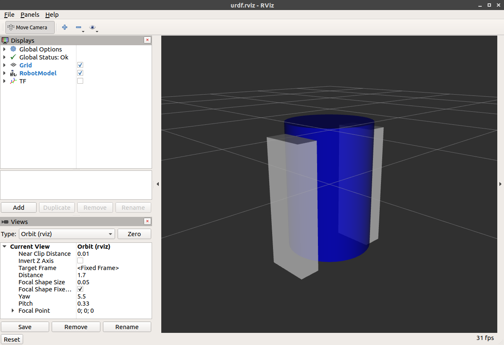
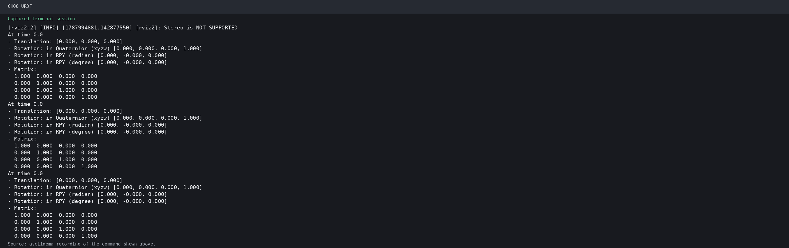

# 第8章 PPT：URDF/Xacro 机器人建模

> 共 15 页，标注页码 · 图号与教学文档对应

---

## P1 · 标题页

**URDF/Xacro 机器人建模**

- 课程：ROS2 Python 编程
- 章节：第 8 章
- 课时：2 课时

<!-- 旁白：这是第 8 章 URDF 建模的标题页。上一章学了坐标变换，而坐标系挂在哪、关节怎么动，都由 URDF 模型定义。本章 2 课时，从语法与建模流程讲起，最后在 RViz2 中可视化验证。 -->

---

## P2 · 本课学习目标

- 理解 URDF 文件结构：`<link>` 与 `<joint>` 两大基本元素
- 掌握 link 的 visual / collision / inertial 三类子元素
- 掌握 joint 类型与 `limit` 限位要求
- 理解 `origin` 的坐标语义差异
- 用 XACRO 属性、数学表达式、宏实现参数化建模
- 用 robot_state_publisher + RViz2 RobotModel 可视化验证

<!-- 旁白：六个目标覆盖建模全流程：前半段是 link 与 joint 语法、三类子元素与 origin 语义，后半段用 Xacro 的宏、属性与表达式做参数化，最后用 robot_state_publisher 加 RViz2 验证模型。 -->

---

## P3 · URDF 文件结构

```xml
<?xml version="1.0"?>
<robot name="my_robot">
  <!-- 连杆定义 -->
  <link name="base_link">
    <visual> ... </visual>
    <collision> ... </collision>
    <inertial> ... </inertial>
  </link>

  <!-- 关节定义 -->
  <joint name="base_to_wheel" type="continuous">
    <parent link="base_link"/>
    <child link="wheel"/>
    <origin xyz="0 0 -0.1" rpy="0 0 0"/>
    <axis xyz="0 1 0"/>
  </joint>
</robot>
```

程序 8-1：URDF 文件最小结构。每个 `<link>` 描述刚体，每个 `<joint>` 描述连接关系。

<!-- 旁白：URDF 只有两类骨干元素：link 描述刚体，含视觉、碰撞与惯性三组描述；joint 描述连接关系，声明父子、原点与转轴。程序 8-1 是最小结构，后续所有机器人模型都是它的扩展，先背熟骨架再看细节。 -->

---

## P4 · link 元素详解

| 子元素 | 用途 | 示例 |
|--------|------|------|
| `<visual>` | 可视化几何体 (mesh/box/cylinder/sphere) | `<cylinder radius="0.1" length="0.2"/>` |
| `<collision>` | 碰撞检测几何体（通常与 visual 一致） | `<box size="0.4 0.3 0.15"/>` |
| `<inertial>` | 惯性参数 (mass + inertia) | `<mass value="1.0"/>` |

```xml
<link name="base_link">
  <visual>
    <geometry><box size="0.4 0.3 0.15"/></geometry>
    <material name="blue"><color rgba="0 0 0.8 1"/></material>
  </visual>
  <collision>
    <geometry><box size="0.4 0.3 0.15"/></geometry>
  </collision>
  <inertial>
    <mass value="5.0"/>
    <inertia ixx="0.1" ixy="0" ixz="0" iyy="0.1" iyz="0" izz="0.1"/>
  </inertial>
</link>
```


图：官方教程——visual 元素的几何体渲染效果，外形与颜色一目了然。



图：官方教程——material 元素定义的颜色材质，可多处复用。

<!-- 旁白：link 三个子元素各有分工：visual 决定长什么样，collision 决定物理碰撞，inertial 决定质量与惯量。两张图分别展示了 visual 的几何外形与 material 的颜色效果。实际建模中碰撞体应比视觉更简化，质量与惯量不可全零。 -->

---

## P5 · joint 类型

| 类型 | 运动自由度 | 典型应用 |
|------|-----------|---------|
| `revolute` | 绕轴旋转（有限范围） | 机械臂关节 |
| `continuous` | 无限旋转 | 轮子 |
| `prismatic` | 沿轴平移 | 升降机构 |
| `fixed` | 无自由度 | 传感器固定连接 |
| `planar` | 平面运动 | 地面移动 |

- revolute / continuous / prismatic 均需声明 `limit`（上下界、最大力矩、最大速度），这是 ros2_control 与 MoveIt 2 正常工作的前提
- 模型描述还包含 `floating` 类型与 `gazebo` 扩展标签

<!-- 旁白：joint 类型决定运动自由度：revolute 有限旋转、continuous 无限旋转、prismatic 平移、fixed 固定、planar 平面运动。运动型关节必须声明 limit 限位，包括上下界与最大力矩、速度，这是 ros2_control 与 MoveIt 2 正常工作的前提。 -->

---

## P6 · origin 语义与建模流程

- 初学者最易踩坑：`origin` 语义随父元素而变
  - link 的 `origin`：几何体「相对自身惯性中心」的位姿
  - joint 的 `origin`：「子 link 相对父 link」的变换
- 官方推荐的开发循环：编辑 URDF → `check_urdf` 语法检查 → RViz 中 `RobotModel` + `TF` 双显示验证
- 网格模型（mesh）用于复杂外观，支持 `scale` 缩放
- 物理属性优先于外观：惯性张量不可全为零（仿真报 NaN），碰撞几何应比视觉几何更简化


图：官方教程——不同 origin 参数的并排效果，直观展示位置与姿态偏差。

<!-- 旁白：origin 是初学者最常踩的坑：link 的 origin 是几何体相对自身惯性中心的位姿，joint 的 origin 是子 link 相对父 link 的变换。官方开发循环是编辑、check_urdf 校验、RViz 双显示验证。物理属性优先于外观，碰撞体要更简化。 -->

---

## P7 · XACRO 基础宏

```xml
<robot xmlns:xacro="http://www.ros.org/wiki/xacro" name="xbot">
  <!-- 参数化属性 -->
  <xacro:property name="wheel_radius" value="0.05"/>
  <xacro:property name="wheel_width" value="0.03"/>

  <!-- 宏定义 -->
  <xacro:macro name="wheel" params="name prefix reflect">
    <joint name="${name}_joint" type="continuous">
      <parent link="base_link"/>
      <child link="${prefix}_wheel"/>
      <origin xyz="0 ${reflect*wheel_base/2} -0.1" rpy="0 0 0"/>
      <axis xyz="0 1 0"/>
    </joint>
    <link name="${prefix}_wheel">
      <visual>
        <geometry>
          <cylinder radius="${wheel_radius}" length="${wheel_width}"/>
        </geometry>
      </visual>
    </link>
  </xacro:macro>

  <!-- 宏实例化 -->
  <xacro:wheel name="left" prefix="left" reflect="1"/>
  <xacro:wheel name="right" prefix="right" reflect="-1"/>
</robot>
```

程序 8-2：XACRO 宏减少重复代码，参数化实现车轮批量生成。

<!-- 旁白：Xacro 的目标是消除重复：property 定义常量，macro 定义可复用部件，实例化时传参批量生成部件。程序 8-2 中两个轮子共用一份宏定义，靠 reflect 参数区别左右位置，代码量大大缩减，也便于批量修改。 -->

---

## P8 · mesh 文件引用

```xml
<link name="lidar_link">
  <visual>
    <geometry>
      <mesh filename="package://robot_description/meshes/lidar.stl"/>
    </geometry>
    <origin xyz="0 0 0.02" rpy="0 0 0"/>
  </visual>
</link>
```

- Mesh 文件通常放在 `meshes/` 目录，路径使用 `package://<pkg_name>/` 前缀
- `xacro` 展开命令：`ros2 run xacro xacro 模型.xacro > 输出.urdf`

<!-- 旁白：复杂外观用 mesh 文件，路径以 package:// 包名前缀定位到 meshes 目录。注意 xacro 文件不能直接被下游工具使用，需要先展开为标准 URDF：ros2 run xacro xacro 输入文件重定向输出，这是本章实例的第一步。 -->

---

## P9 · XACRO 三大武器与模块化

- 属性（`<xacro:property>`）：常量集中定义，如 `wheel_radius`
- 数学表达式（`${(wheel_radius * 2)/3}`）：内联计算，消除魔法数字
- 宏（`<xacro:macro>`）：一次定义、参数化复用，系列化产品改属性即可生成多套 URDF
- `<xacro:if>` / `<xacro:unless>`：条件分支，如 `use_lidar=true` 时才加载 lidar_link
- `<xacro:include>`：大型模型按「底盘 / 机械臂 / 传感器」分文件维护
- 传感器套件（相机、激光雷达、IMU）作为可选模块按需拼装

<!-- 旁白：Xacro 三大武器是属性、数学表达式与宏，配合 if 条件分支与 include 文件包含。工程上把底盘、机械臂、传感器分成独立文件，传感器套件用条件开关按需拼装，实现系列化快速出模型，改属性即可生成多套变体。 -->

---

## P10 · robot_state_publisher + joint_state_publisher

```python
# launch/display.launch.py
def generate_launch_description():
    urdf_path = os.path.join(
        get_package_share_directory('urdf_demo'),
        'urdf', 'simple_robot.xacro')

    return LaunchDescription([
        Node(
            package='robot_state_publisher',
            executable='robot_state_publisher',
            parameters=[{'robot_description': Command(['xacro ', urdf_path])}],
        ),
        Node(
            package='joint_state_publisher',
            executable='joint_state_publisher',
        ),
        Node(
            package='rviz2',
            executable='rviz2',
            arguments=['-d', os.path.join(
                get_package_share_directory('urdf_demo'),
                'rviz', 'display.rviz')],
        ),
    ])
```

程序 8-3：`robot_state_publisher` 解析 URDF 并发布 TF，`joint_state_publisher` 提供关节状态 GUI。

<!-- 旁白：robot_state_publisher 是模型与 TF 之间的桥梁：它读取 robot_description 参数中的 URDF，自动发布各 link 的坐标变换，与第 7 章坐标系树直接衔接。joint_state_publisher 提供关节状态，配合 RViz 一条 launch 命令完成可视化。 -->

---

## P11 · RViz2 RobotModel 显示

- 添加 `RobotModel` 插件，Description Topic 设置为 `/robot_description`
- 添加 `TF` 插件查看各坐标系，Fixed Frame 设为 `base_link` 或 `odom`
- 将配置保存为 `.rviz` 文件，供 Launch 用 `-d` 参数加载
- 同一份模型文件，可被 RViz 用于可视化、Gazebo 用于物理仿真、MoveIt 2 用于运动规划
- 调试顺序建议：先 RViz 静态验证、再 Gazebo 动力学验证、最后接入 ros2_control

<!-- 旁白：RViz2 验证要点：RobotModel 插件读取 /robot_description 话题显示几何体，TF 插件显示坐标系，配置保存为 rviz 文件供 Launch 加载。同一份模型文件可服务 RViz 可视化、Gazebo 仿真与 MoveIt 2 规划，验证顺序建议先静态后动态。 -->

---

## P12 · 仿真结合实例：从 Xacro 模型到 RViz RobotModel

```bash
# 终端 1：展开并校验 Xacro
ros2 run xacro xacro \
  src/urdf_demo_ros2/urdf/mybot.xacro > /tmp/mybot.urdf
xmllint --noout /tmp/mybot.urdf

# 终端 2：启动 robot_state_publisher + RViz
ros2 launch urdf_demo_ros2 display_xacro.launch.py \
  use_gui:=false use_rviz:=true
```

- RViz 中 RobotModel 显示 Xacro 展开的连杆与关节，TF 面板可看到坐标树
- `xmllint` 通过表示 Xacro 输出是合法 XML
- 该入口与 Gazebo SDF 模型路径不同，用于对比 URDF/Xacro 与 SDF 两种建模方式




<!-- 旁白：实战流程：先展开 Xacro 并用 xmllint 校验语法，再启动 display_xacro.launch.py 进入 RViz。RobotModel 显示连杆关节，TF 面板显示坐标树。该入口与 Gazebo 的 SDF 模型路径不同，两种建模方式可对比学习。运行演示展示完整效果。 -->

---

## P13 · 本章要点

1. URDF 由 link（刚体）与 joint（连接）构成，link 含 visual / collision / inertial 三类描述
2. joint 分为 revolute、continuous、prismatic、fixed 等类型，运动型需 `limit`
3. `origin` 语义随父元素而变，是初学者最常踩的坑
4. XACRO 通过宏、属性与数学表达式消除重复并支持条件分支
5. `robot_state_publisher` 解析 URDF 并发布 TF，`joint_state_publisher` 提供关节值 GUI 滑块
6. RViz2 的 RobotModel 插件可视化验证完整机器人模型

<!-- 旁白：回顾六条要点：link 与 joint 两大要素、三类子元素、joint 类型与 limit、origin 语义差异、Xacro 参数化、robot_state_publisher 与 RViz 验证。这六点构成从模型描述到可视化验证的完整链路。 -->

---

## P14 · 练习题

1. 编写包含 base_link 和 lidar_link 的 URDF，通过 fixed joint 连接
2. 为 base_link 添加 collision 和 inertial 元素（mass=10kg, box inertia）
3. 使用 XACRO macro 参数化生成 4 个麦克纳姆轮（前左/前右/后左/后右）
4. 编写 `display.launch.py`，启动 robot_state_publisher + joint_state_publisher + rviz2
5. 在 RViz2 中调出 RobotModel 和 TF 显示，截图完整的机器人模型
6. 使用 XACRO `<xacro:if>` 条件判断：当 `use_lidar=true` 时才加载 lidar_link

<!-- 旁白：练习从最简单的一体两连杆 URDF 起步，逐步加入碰撞惯量、麦克纳姆轮宏、三节点 Launch 与条件加载。第 5 题要求截图完整模型，是检验 Xacro 展开是否正确最直观的方法，先通过再往下走。 -->

---

## P15 · 下章预告

**第 9 章：Gazebo 仿真**

- Gazebo 版本选择与 URDF → SDF 桥接
- spawn_entity 机器人生成
- LiDAR / Camera / IMU 传感器插件
- ros2_control 差速驱动控制

<!-- 旁白：下一章进入 Gazebo 仿真：URDF 到 SDF 的桥接、spawn_entity 生成机器人、传感器插件与 ros2_control 差速控制。本章的模型文件正是下一章仿真世界的主角，两章构成建模到仿真的连续链路。 -->