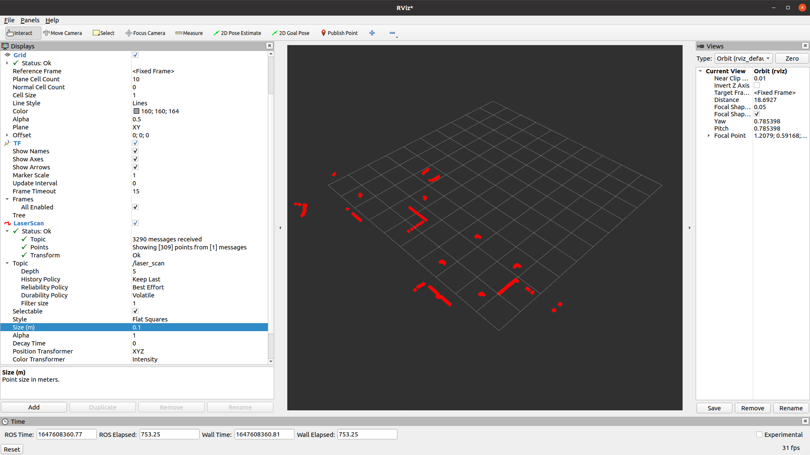
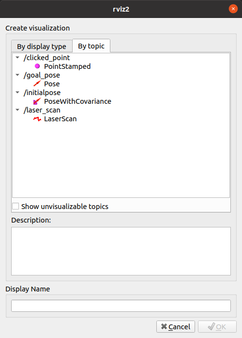
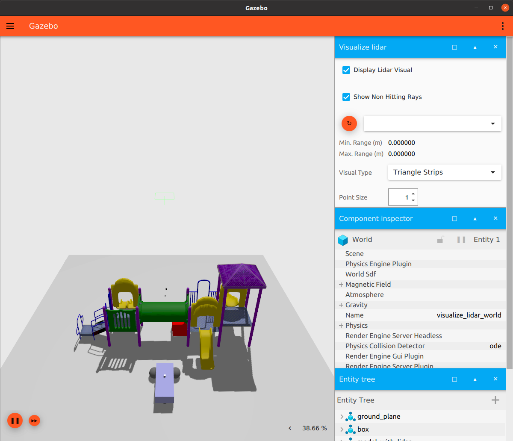
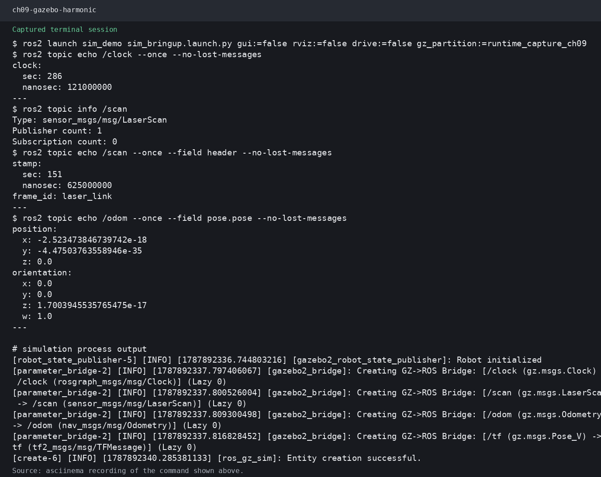

# 第9章 PPT：Gazebo 仿真

> 共 15 页，标注页码 · 图号与教学文档对应

---

## P1 · 标题页

**Gazebo 仿真**

- 课程：ROS2 Python 编程
- 章节：第 9 章
- 课时：2 课时

<!-- 旁白：这是第 9 章 Gazebo 仿真的标题页。有了模型之后，如何让机器人在虚拟物理世界里动起来就是本章主题。本章 2 课时，从版本选型、URDF 桥接讲到传感器插件与 ros2_control 差速控制。 -->

---

## P2 · 本课学习目标

- 了解 Gazebo Classic 与 Gazebo Sim 的版本选择
- 理解 URDF → SDF 桥接与 spawn_entity 机器人生成
- 掌握 LiDAR / Camera / IMU 传感器插件配置
- 理解 ros2_control 架构与 diff_drive_controller
- 会用 YAML 文件配置控制器参数
- 掌握 use_sim_time 等仿真集成要点

<!-- 旁白：六个目标依次推进：版本选型解决用哪套工具，桥接与 spawn 解决怎么进仿真，三类传感器插件解决感知数据从哪来，ros2_control 与 YAML 解决怎么驱动底盘，最后 use_sim_time 解决时间同步。 -->

---

## P3 · Gazebo 版本选择

| 对比项 | Gazebo Classic (11) | Gazebo Sim (Harmonic) |
|--------|--------------------|----------------------|
| 推荐 ROS2 版本 | Humble / Iron | Iron / Jazzy |
| 接口方式 | gazebo_ros_* 插件 | ros_gz_* 接口包 |
| 场景定位 | 2D 机器人教学主流 | 新项目长期演进方向 |

- 本章以 Gazebo Classic + ROS2 Humble 为主讲解，原理与插件写法可平滑迁移
- 当前仓库实例使用 Gazebo Sim Harmonic（新版），命令入口大致对应
- 版本配对务必核对 `package.xml` 与 `ros2 pkg list | grep gazebo` 输出

<!-- 旁白：版本选择是入门第一坑：ROS2 Humble 对应 Gazebo Classic 11，Iron 之后才是 Gazebo Sim。接口方式也不同，Classic 用 gazebo_ros 插件，新版用 ros_gz。装好后务必核对 package.xml 与 pkg list 输出，版本不配对是安装失败主因。 -->

---

## P4 · URDF → SDF 桥接

- Gazebo 原生世界格式为 SDF，ROS2 模型使用 URDF，两者通过插件桥接：

```
URDF（几何 + 关节 + 传感器声明）
   ↓  gazebo_ros 桥接层（libgazebo_ros_init.so 等插件）
SDF（物理引擎 + 渲染 + 传感器实现）
```

- 需要在 URDF 的 `<gazebo>` 扩展标签中显式声明桥接插件，Gazebo 才能「读懂」URDF
- 常见的桥接插件：`libgazebo_ros_init.so`（服务接口）、`libgazebo_ros_factory.so`（模型生成）
- 传感器输出、话题名、更新频率都在插件 `ros` 参数中配置，与模型文件解耦

<!-- 旁白：Gazebo 的世界格式是 SDF，ROS2 模型是 URDF，二者通过 gazebo_ros 桥接层衔接：URDF 只声明几何与关节，桥接插件补齐物理与渲染实现。常见插件有 libgazebo_ros_init 与 libgazebo_ros_factory，必须在扩展标签中显式声明。 -->

---

## P5 · 仿真启动 Launch 文件

```python
# launch/sim_bringup.launch.py（节选）
def generate_launch_description():
    return LaunchDescription([
        # 启动 Gazebo 空世界
        ExecuteProcess(cmd=['gazebo', '--verbose', '-s',
                            'libgazebo_ros_init.so',
                            '-s', 'libgazebo_ros_factory.so'],
                       output='screen'),
        # 将模型描述写入 /robot_description
        Node(package='robot_state_publisher',
             executable='robot_state_publisher',
             output='screen',
             parameters=[{'robot_description': Command(['xacro ', urdf_path])}]),
        # 在空世界中生成机器人
        Node(package='gazebo_ros', executable='spawn_entity.py',
             output='screen',
             arguments=['-topic', 'robot_description',
                        '-entity', 'xbot']),
    ])
```

程序 9-1（节选）：典型仿真启动流程 = 世界 + 描述 + 生成。

<!-- 旁白：典型启动流程是三步：ExecuteProcess 启动带服务插件的空世界，robot_state_publisher 发布模型描述，spawn_entity.py 在指定坐标生成机器人。三件事之间通过话题与参数衔接，缺一步都不行，这是所有仿真实例的模板。 -->

---

## P6 · 物体生成体系：世界文件与 spawn_entity

- 世界文件（`.world` / `.sdf`）声明光照、地面、障碍物等静态环境
- `spawn_entity.py` 通过 `-topic robot_description` 复用状态发布器已上传的模型，再经 `/gazebo/spawn_entity` 服务注入仿真
- world 坐标系 → `/odom` → `/base_footprint` → `/base_link` 的 TF 链与第 7 章坐标系树逐一对应
- 把世界与模型打包进独立仿真包，是可重复实验的工程习惯



图：官方教程——spawn 生成机器人后在 RViz2 中查看模型与话题数据。

<!-- 旁白：世界文件声明光照与障碍物等静态环境，spawn_entity 通过 robot_description 话题复用模型，再经生成服务注入仿真。TF 链要与第 7 章坐标系树对应。把世界与模型打包进独立仿真包，是可重复实验的工程习惯。 -->

---

## P7 · LiDAR 传感器插件

```xml
<gazebo reference="laser_link">
  <sensor type="ray" name="lidar_sensor">
    <always_on>true</always_on>
    <update_rate>10</update_rate>
    <ray>
      <scan><horizontal>
        <samples>720</samples>
        <resolution>1</resolution>
        <min_angle>-3.14</min_angle>
        <max_angle>3.14</max_angle>
      </horizontal></scan>
      <range><min>0.1</min><max>30.0</max></range>
    </ray>
    <plugin name="lidar_plugin" filename="libgazebo_ros_ray_sensor.so">
      <ros>
        <namespace>/xbot</namespace>
        <remapping>~/out:=scan</remapping>
      </ros>
      <output_type>sensor_msgs/LaserScan</output_type>
    </plugin>
  </sensor>
</gazebo>
```

程序 9-2（节选）：`gazebo_ros_ray_sensor` 插件把射线数据发布为 `/xbot/scan`（LaserScan）。

- 720 采样点 × 360° 即 0.5° 分辨率，仿真频率与 update_rate 直接相关



图：官方教程——在 RViz2 中添加 LiDAR 显示，查看 /scan 激光数据。

<!-- 旁白：LiDAR 用 ray 型传感器插件：采样 720 点覆盖 360 度，即 0.5 度分辨率，更新频率 10 赫兹。插件把射线数据发布为 LaserScan 话题，命名空间与重映射都在 ros 参数里配置，与模型文件解耦。RViz 中可直接以点云方式查看。 -->

---

## P8 · Camera 与 IMU 插件

```xml
<gazebo reference="camera_link">
  <sensor type="camera" name="camera_sensor">
    <always_on>true</always_on>
    <update_rate>10</update_rate>
    <camera>
      <horizontal_fov>1.047</horizontal_fov>
      <image><width>640</width><height>480</height></image>
    </camera>
    <plugin name="camera_plugin" filename="libgazebo_ros_camera.so">
      <ros><namespace>/xbot</namespace></ros>
    </plugin>
  </sensor>
</gazebo>
```

```xml
<gazebo reference="imu_link">
  <sensor type="imu" name="imu_sensor">
    <always_on>true</always_on>
    <update_rate>50</update_rate>
    <plugin name="imu_plugin" filename="libgazebo_ros_imu_sensor.so">
      <ros><namespace>/xbot</namespace></ros>
    </plugin>
  </sensor>
</gazebo>
```

- Camera 发布 `/xbot/camera/image_raw`（对应练习 9.3 使用的 `/camera/image_raw`），IMU 发布 3D 线加速度与角速度

<!-- 旁白：Camera 与 IMU 插件写法同构：sensor 标签声明类型与频率，plugin 标签指定插件库与话题配置。Camera 发布图像话题，IMU 发布线加速度与角速度。注意话题是否带命名空间要以实际 remapping 结果为准，练习中要对应调整。 -->

---

## P9 · 传感器插件工程要点

- 差速底盘用 `libgazebo_ros_diff_drive.so`：订阅 /cmd_vel，发布 /odom 与关节状态
- LiDAR / Camera / IMU 分别对应 ray、camera、imu 三类 sensor 插件
- 帧名必须与 URDF 中 link 名一致，与第 7 章 TF 树严格对应
- 仿真中传感器频率受实时因子影响，先 `ros2 topic hz` 验频再谈误检
- 图像带宽大，开发期优先降低分辨率与帧率



图：官方教程——libgazebo_ros_diff_drive 插件驱动下的差速底盘模型。

<!-- 旁白：工程要点：差速底盘用 diff_drive 插件订阅速度指令发布里程计；帧名必须与 URDF 的 link 名一致，与 TF 树严格对应；仿真中频率受实时因子影响，先做 topic hz 验频；图像带宽大，开发期优先降分辨率与帧率。 -->

---

## P10 · ros2_control 三层架构

```
上位层  Controller 管理：diff_drive_controller（速度 → 左右轮速）
          ↓
中间层  Controller Manager：加载 / 激活 / 停用控制器组件
          ↓
底层    GazeboSystem（模拟编码器与电机，经 Gazebo 插件接入）
```

```xml
<gazebo>
  <plugin name="diff_drive" filename="libgazebo_ros2_control.so">
    <ros>
      <namespace>/xbot</namespace>
    </ros>
    <controller_manager>
      <name>controller_manager</name>
    </controller_manager>
  </plugin>
</gazebo>
```

- 三层职责解耦：控制器只管算法，manager 管生命周期，Gazebo 管物理

<!-- 旁白：ros2_control 把控制分成三层：上层控制器算速度映射，中层 controller manager 管理加载与激活，底层 GazeboSystem 模拟电机与编码器。职责解耦的好处是同一套控制器代码既能仿真也能上真机，这也是现代 ROS2 的标准做法。 -->

---

## P11 · diff_drive_controller 配置

```yaml
# config/diff_drive.yaml（程序 9-3 节选）
controller_manager:
  ros__parameters:
    update_rate: 50
    diff_drive_controller:
      type: diff_drive_controller/DiffDriveController

diff_drive_controller:
  ros__parameters:
    use_sim_time: true
    publish_rate: 20.0
    left_wheel_names: ['left_wheel_joint']
    right_wheel_names: ['right_wheel_joint']
    wheel_separation: 0.4
    wheels_per_side: 1
    wheel_radius: 0.1
    linear.x.has_velocity_limits: true
    linear.x.min_velocity: -2.0
    linear.x.max_velocity: 2.0
```

程序 9-3（节选）：速度指令 → 左右轮速的映射参数全部集中于此。

- 激活：`ros2 control load_controller diff_drive_controller`（或 spawner 自动加载）

<!-- 旁白：diff_drive_controller 的参数集中在 YAML：轮距、轮径、左右轮关节名，以及速度限幅。update_rate 决定控制频率，publish_rate 决定里程计发布频率。配置好之后用 spawner 或命令行加载激活，激活前速度指令会被静默忽略。 -->

---

## P12 · 常见坑与验证顺序

- `use_sim_time: true` 未开启 → ROS2 时间与 Gazebo 仿真时钟失配，TF 时延跳变
- `robot_state_publisher` 未启动 → 无 TF，控制器与 RViz 全部失效
- 控制器未 spawn 激活 → /cmd_vel 消息被静默丢弃，节点照常运行但车轮不动
- 推荐验证顺序：`ros2 topic echo /odom` → 发布 /cmd_vel 看车轮 → RViz 看 TF 树 → 再跑导航
- 仿真的「静默失败」多于「显式报错」，逐层验证比看日志更可靠




<!-- 旁白：仿真踩坑清单：use_sim_time 不开，时间失配 TF 跳变；状态发布器没起，没有 TF 一切失效；控制器没激活，速度指令被静默丢弃。推荐按 odom、cmd_vel、TF、导航的顺序逐层验证。仿真的静默失败多于显式报错，运行演示展示验证流程。 -->

---

## P13 · 本章要点

1. Gazebo Classic 与 Gazebo Sim 选型取决于 ROS2 版本，Humble 对应 Classic
2. URDF 需经 gazebo_ros 插件桥接为 SDF，spawn_entity.py 负责生成机器人
3. LiDAR / Camera / IMU 通过 `<gazebo>` 扩展标签声明插件接入仿真
4. diff_drive_controller 是差速底盘的核心控制器，参数集中 YAML 管理
5. ros2_control 三层架构将控制器、控制器管理、物理仿真解耦
6. `use_sim_time` 是仿真与真实系统时间同步的前提

<!-- 旁白：回顾本章要点：版本选型看 ROS2 版本；URDF 经桥接插件转 SDF，spawn_entity 生成机器人；传感器用扩展标签接入；差速控制参数集中在 YAML；ros2_control 三层解耦；use_sim_time 是时间同步前提。六点构成仿真闭环。 -->

---

## P14 · 练习题

1. 编写 world 文件并在其中加载 URDF 机器人模型
2. 编写 `spawn_entity.py` 相关 Launch，启动机器人到世界坐标 (1, 2, 0) 处
3. 为机器人添加 ray 型 LiDAR 插件，topic 输出 `/scan`，并在 RViz2 中显示
4. 编写 Camera 和 IMU 插件，topic 分别为 `/camera/image_raw` 与 `/imu`
5. 配置 diff_drive_controller 的 wheel_separation 与 wheel_radius，使小乌龟图 5-1 差速旋转正确
6. 启动仿真后发布速度指令，观察车轮差速运动，并用日志与 `ros2 topic hz` 验证

<!-- 旁白：六道练习覆盖全流程：写世界文件加载模型、用 Launch 指定生成坐标、添加 LiDAR 并 RViz 显示、写 Camera 与 IMU 插件、配置差速参数、最后发布速度指令观察运动并验证。建议按启动到感知再到控制的顺序完成。 -->

---

## P15 · 下章预告

**第 10 章：SLAM基本概念与贝叶斯框架**

- SLAM 问题定义与数学形式化
- 贝叶斯滤波预测与更新
- 常用 SLAM 算法（gmapping / SLAM Toolbox / Cartographer）
- SLAM 在 ROS2 中的工具链与实战

<!-- 旁白：下一章进入 SLAM：问题定义与贝叶斯框架、滤波与优化两类方法、ROS2 工具链实战。Gazebo 场景正是 SLAM 建图任务的舞台，仿真数据可以先验证算法再上真机。 -->