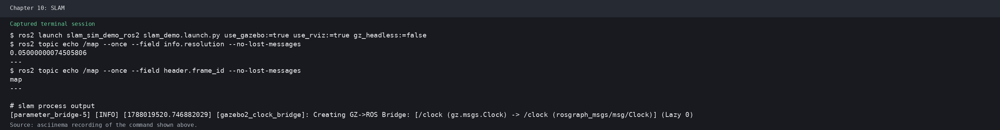
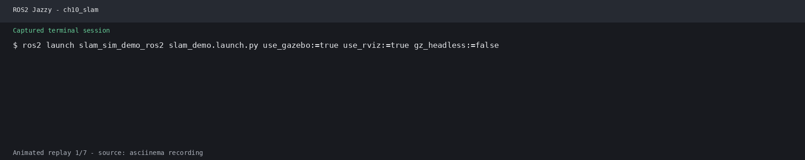
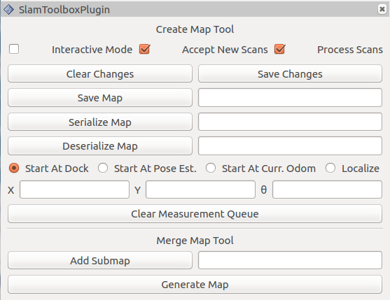

# 第10章 PPT：SLAM基本概念与贝叶斯框架

> 共 17 页，标注页码 · 图号与教学文档对应

---

## P1 · 标题页

**SLAM基本概念与贝叶斯框架**

- 课程：ROS2 Python 编程
- 章节：第 10 章
- 课时：2 课时

<!-- 旁白：这是第 10 章 SLAM 基本概念与贝叶斯框架的标题页。让机器人在未知环境里同时回答「我在哪」和「周围长什么样」，就是本章主题。本章 2 课时，从数学定义讲到贝叶斯框架，再到 ROS2 工具链。 -->

---

## P2 · 本课学习目标

- 理解 SLAM 问题的数学定义与核心挑战
- 掌握贝叶斯滤波框架在 SLAM 中的应用
- 熟悉 SLAM 系统中的传感器模型与 TF 坐标变换体系
- 了解 SLAM 方法的分类及其适用场景
- 能够推导基本贝叶斯滤波公式

<!-- 旁白：五个目标构成递进链条：先理解 SLAM 问题的数学定义与挑战，再掌握贝叶斯滤波框架，熟悉传感器与 TF 体系，了解方法分类，最后能独立推导基本公式。目标是让 SLAM 从黑盒变成可分析、可推导的框架。 -->

---

## P3 · SLAM 问题定义：起源与意义（10.1.1）

```
        ┌───────────┐
        │   定位    │  要精确建图
        └─────┬─────┘
              │ 鸡生蛋蛋生鸡
        └─────┴─────┐
        │   建图    │  要精确定位
        └───────────┘
```

- SLAM (Simultaneous Localization and Mapping)：在未知环境中同时定位与建图
- 机器人领域公认的基础性难题，被誉为「机器人学的圣杯」之一
- 定位：根据传感器数据确定位姿 (x, y, θ)
- 建图：构建栅格地图，用于导航与避障
- 核心挑战：打破定位与建图的耦合，无先验同时完成两项任务

<!-- 旁白：图中央的循环说明困难所在：定位需要地图，建图需要位置，这就是著名的鸡生蛋蛋生鸡问题。SLAM 的目标是打破这种循环，在没有任何先验的情况下同时完成两件事，因此被称为机器人学的圣杯级难题。 -->

---

## P4 · SLAM 问题的数学形式化（10.1.2 / 10.1.3）

**后验概率表达**

```
p(x_{1:t}, m | z_{1:t}, u_{1:t-1})
```

| 符号 | 含义 |
|------|------|
| x_{1:t} | 从时刻 1 到 t 的完整位姿序列 |
| m | 环境地图（栅格地图或特征地图） |
| z_{1:t} | 从时刻 1 到 t 的所有观测数据 |
| u_{1:t-1} | 从时刻 1 到 t-1 的所有控制输入 |

**预测步骤（运动模型）**

```
p(x_t, m | z_{1:t-1}, u_{1:t-1}) = 
∫ p(x_t | x_{t-1}, u_t) · p(x_{t-1}, m | z_{1:t-1}, u_{1:t-2}) dx_{t-1}
```

**更新步骤（观测模型）**

```
p(x_t, m | z_{1:t}, u_{1:t-1}) = 
η · p(z_t | x_t, m) · p(x_t, m | z_{1:t-1}, u_{1:t-1})
```

- η 为归一化常数，确保概率和为 1

<!-- 旁白：数学形式化把问题定义为联合后验概率：在给定观测与控制下求位姿序列与地图。符号表先理清四类变量，再记两个递归步骤：预测用运动模型做积分，更新用观测模型乘上似然，最后乘归一化常数。 -->

---

## P5 · 贝叶斯滤波基本原理（10.2.1 / 10.2.2）

- 贝叶斯滤波是 SLAM 的核心数学工具，递归估计状态
- 基本思想：状态转移模型预测 + 观测模型更新

```python
class BayesianFilter:
    """贝叶斯滤波基础框架"""
    def predict(self, control, motion_noise):
        """预测步骤：根据运动模型更新信念"""
        # 运动模型：x_t = f(x_{t-1}, u_t) + noise
        G = np.eye(self.dim_state)
        self.belief_mean = self.motion_model(self.belief_mean, control)
        self.belief_cov = G @ self.belief_cov @ G.T + np.diag(motion_noise)

    def update(self, observation, obs_noise):
        """更新步骤：根据观测修正信念"""
        innovation = observation - self.observation_model(self.belief_mean)
        K = self.belief_cov @ H.T @ np.linalg.inv(S)
        self.belief_mean = self.belief_mean + K @ innovation
```

**马尔可夫假设**

- 状态完备性：当前状态包含预测未来所需的所有信息
- 观测独立性：给定当前状态，当前观测与过去观测独立
- SLAM 中：未来位姿只取决于当前位姿和控制输入；当前观测只取决于当前位姿和地图

<!-- 旁白：贝叶斯滤波是求解手段：预测步骤向前推移信念，更新步骤用观测修正信念。前提是马尔可夫假设：未来位姿只依赖当前状态与控制，当前观测只依赖当前位姿与地图。代码骨架里的均值与协方差正是信念的两种表示。 -->

---

## P6 · 贝叶斯滤波的 SLAM 实现与局限（10.2.3 / 10.2.4）

- 状态向量：[robot_x, robot_y, robot_theta, lm1_x, lm1_y, ...]

```python
class SLAMBayesianFilter:
    """基于贝叶斯滤波的SLAM框架"""
    def update_with_landmark(self, z, landmark_id, sensor_noise):
        if not self.landmarks_seen[landmark_id]:
            # 初始化新路标点：将极坐标观测转换为全局坐标
            ...
        else:
            # EKF更新已知路标点：预测观测 + EKF更新
            ...
```

- 首次观测路标点：极坐标转全局坐标初始化
- 已知路标点更新：计算量、观测雅可比、创新 EKF 更新

**贝叶斯滤波的局限性**

| 挑战 | 说明 |
|------|------|
| 高维状态空间 | 包含地图点后状态维度线性增长 |
| 非线性问题 | 运动模型与观测模型高度非线性 |
| 数据关联 | 需正确匹配观测与地图点 |
| 计算复杂度 | 协方差更新 O(n²) |

- 催生 GraphSLAM、粒子滤波 SLAM 等更先进方法

<!-- 旁白：把滤波扩展到 SLAM，状态向量会长出所有地图点，复杂度随之上升。首次见到的路标从极坐标转全局初始化，已知路标做 EKF 更新。局限表给出四个维度：高维、非线性、数据关联与 O(n 平方) 计算，正因如此才催生了更先进的方法。 -->

---

## P7 · SLAM 常用传感器（10.3.1）

| 传感器 | 话题/代表产品 | 特点 |
|--------|--------------|------|
| 2D 激光雷达 | sensor_msgs/LaserScan | 室内导航主要传感器，270°-360°、分辨率 0.25°-1°、测距 8-30m |
| 3D 激光雷达 | sensor_msgs/PointCloud2 | 室外大场景，VLP-16、Ouster OS 系列 |
| 深度相机 RGB-D | RGB 图像 + 深度图 | RealSense D415/D435、Kinect，视觉 SLAM |
| IMU | sensor_msgs/Imu | 频率 100-1000Hz，存在漂移，常与激光/视觉融合 |
| 里程计 | nav_msgs/Odometry | 编码器估算位移，短期精度高、长期累积误差 |

- 多传感器融合时可用 SensorMonitor 节点统一订阅 /scan、/imu、/odom 监控数据流

<!-- 旁白：传感器选型表：2D 激光雷达是室内主流，3D 激光适合室外，RGB-D 相机做视觉 SLAM，IMU 频率高但会漂移，里程计短期准长期漂。多传感器融合时，用 SensorMonitor 统一监控各话题的数据流，是排查数据缺失的利器。 -->

---

## P8 · TF 坐标变换体系（10.3.2 / 10.3.3）

```
map → odom → base_footprint → base_link → laser
```

| 坐标系 | 含义 |
|--------|------|
| map | 全局世界坐标系，SLAM 建图固定参考系 |
| odom | 机器人起始位置，里程计连续更新，局部精度高 |
| base_footprint | 机器人在地面的投影，常作本体坐标系 |
| base_link | 机器人本体中心坐标系 |
| laser | 激光传感器坐标系，通常在机器人顶部 |

- map→odom 变换由 SLAM/AMCL 持续更新，消除里程计累积误差
- 代码：TFMonitor 节点每秒查询 map→base_link 变换，并将激光点 (1,0,0) 变换到 map 坐标系（节选）

```python
def query_tf(self):
    trans = self.tf_buffer.lookup_transform(
        'map', 'base_link', rclpy.time.Time())
    # 查询 map → base_link 变换
    map_point = self.tf_buffer.transform(laser_point, 'map')
    # 将激光点转换到map坐标系
```

<!-- 旁白：TF 体系是 SLAM 的坐标系骨架：map 是全局参考系，odom 由里程计连续更新，base_footprint 与 base_link 描述本体，laser 安装于传感器之上。map 到 odom 的变换由 SLAM 或 AMCL 持续修正，正是它抵消了里程计的累积误差。 -->

---

## P9 · 传感器标定与时间同步（10.3.4 / 10.3.5）

```bash
# 检查传感器话题频率
ros2 topic hz /scan
ros2 topic hz /odom
ros2 topic hz /imu

# 检查传感器时间戳
ros2 topic echo /scan --once | grep stamp

# 查看TF树
ros2 run tf2_tools view_frames.py

# 查看TF广播关系
ros2 run tf2_ros tf2_monitor
```

- 时间同步两条铁律
  - 仿真与 bag 重放一律开 use_sim_time
  - 录数据前先 ros2 topic hz 检查频率，避免激光帧率忽高忽低
- slam_toolbox 的 base_frame、odom_frame、map_frame 必须与 TF 树 frame 名逐一对应
- 参数不匹配或 transform_tolerance 过小，建图会直接中断

<!-- 旁白：数据质量决定建图成败：开机先 topic hz 与 echo 检查频率和时间戳，用 view_frames 查看 TF 树。两条铁律：仿真与回放一律开 use_sim_time，录数据前先验频。slam_toolbox 的 frame 名必须与 TF 树一一对应，否则建图中断。 -->

---

## P10 · 基于滤波的 SLAM 方法（10.4.1）

| 算法 | 滤波器类型 | 特点 |
|------|-----------|------|
| EKF-SLAM | 扩展卡尔曼滤波 | 最早的方法，计算 O(n²) |
| FastSLAM 1.0/2.0 | Rao-Blackwellized 粒子滤波 | 粒子表示路径，EKF 维护地图 |
| gmapping | RBPF + 自适应提议分布 | 广泛使用的 2D SLAM |
| UKF-SLAM | 无迹卡尔曼滤波 | 处理强非线性 |

- 优点：在线计算、实时性强，自然处理不确定性，易于嵌入控制回路
- 缺点：线性化误差（EKF）、粒子退化问题（粒子滤波）、大规模环境扩展性有限

<!-- 旁白：滤波方法这张表是谱系图：EKF 最早但计算 O(n 平方)，粒子滤波用粒子表示轨迹，gmapping 加自适应提议分布成为经典。优点是实时在线，缺点是线性化误差与粒子退化，大规模环境扩展性有限，这是选择时的权衡依据。 -->

---

## P11 · 基于优化的 SLAM 方法（10.4.2）

| 算法 | 优化方法 | 特点 |
|------|----------|------|
| GraphSLAM | 稀疏矩阵分解 | 全图优化，离线批处理 |
| Cartographer | Ceres Solver | 子图和回环检测，Google 开源 |
| SLAM Toolbox | Ceres Solver | ROS2 官方 2D SLAM 工具 |
| KartoSLAM | SPA | 基于图优化 |

```
节点 (Vertex):       边 (Edge):
- 机器人位姿 x_t      - 里程计约束 (连续位姿间)
- 路标点 l_j          - 观测约束 (位姿-路标点)
                     - 回环约束 (非连续位标间)
```

- 图优化框架中通过最小化误差函数求解
- GraphSLAM 代码：添加里程计约束、观测约束、构建线性系统 H·Δx = b（节选）


图：slam_toolbox 文档——Ceres 求解器优化前后的对比示意。

<!-- 旁白：图优化方法把问题变成顶点与边的图：位姿与路标是顶点，里程计、观测与回环是约束边，通过最小化误差函数求解。GraphSLAM 用稀疏矩阵，Cartographer 与 SLAM Toolbox 都用 Ceres 求解器，回环检测是它们区别于纯滤波的长处。 -->

---

## P12 · 视觉/混合方法与选型（10.4.3 / 10.4.4 / 10.4.5）

**基于视觉的方法**

- ORB-SLAM2/3：特征法，三线程架构
- DSO：直接法，利用像素亮度
- SVO：半直接法
- VINS-Mono：视觉惯性融合

**混合方法对照表

| 方法 | 代表 | 前端 | 后端 |
|------|------|------|------|
| 激光+IMU 融合 | Cartographer | 扫描匹配 | 图优化 |
| 视觉+惯性融合 | VINS-Fusion | 特征跟踪 | 滑窗 BA |
| 激光+视觉融合 | LVI-SAM | 多传感器前端 | 因子图优化 |

**选型参考（节选）**

- 室内有里程计：slam_toolbox / gmapping
- 室内无里程计：Hector-SLAM
- 大场景：Cartographer
- 相机 + IMU：VINS-Fusion / ORB-SLAM3

<!-- 旁白：视觉方法按特征与像素分派系：ORB 特征法、DSO 直接法、SVO 半直接、VINS 视觉惯性。混合方法表给出融合方向。选型口诀：室内有里程计用 slam_toolbox，无里程计用 Hector，大场景上 Cartographer。 -->

---

## P13 · 贝叶斯框架的数学推导（10.5.1 / 10.5.2 / 10.5.3 / 10.5.4）

**贝叶斯定理回顾

```
p(A|B) = p(B|A) · p(A) / p(B)
```

- 后验 p(x_t, m | z_{1:t}, u_{1:t-1})：给定观测和控制的状态信念
- 似然 p(z_t | x_t, m)：给定位姿和地图的观测概率
- 先验 p(x_t, m | z_{1:t-1}, u_{1:t-1})：预测

**递归贝叶斯滤波推导（预测-更新循环）

```
bel(x_t, m) = ∫ p(x_t | x_{t-1}, u_t) · bel(x_{t-1}, m) dx_{t-1}
bel(x_t, m) = η · p(z_t | x_t, m) · bel(x_t, m)
```

- FastSLAM 条件独立：p(x_{1:t}, m | z_{1:t}, u_{1:t-1}) = p(m | x_{1:t}, z_{1:t}) · p(x_{1:t} | z_{1:t}, u_{1:t-1})
- 给定机器人轨迹，地图点条件独立，可先估计轨迹再计算地图

**信息形式 vs 协方差形式

| 形式 | 代表 | 特点 |
|------|------|------|
| 协方差形式 | EKF-SLAM | 维护均值与协方差，O(n²)，直观 |
| 信息形式 | GraphSLAM | 维护信息矩阵 Ω 与信息向量 ξ，稀疏利于大规模求解 |

<!-- 旁白：数学推导回到贝叶斯定理本身：后验正比于似然乘先验。递归式把预测与更新紧凑表达。FastSLAM 的关键是条件独立分解：给定轨迹后地图点互不影响，先估轨迹再算地图。信息形式较协方差形式更适合大规模稀疏求解。 -->

---

## P14 · ROS2 SLAM 工具链概览（10.6.1 / 10.6.2 / 10.6.3）

- slam_toolbox：ROS2 官方 2D SLAM，图优化，在线/离线建图，替代 gmapping 和 karto
- nav2_amcl：基于已知地图粒子滤波定位，KLD 自适应采样
- cartographer_ros：Google 开源多传感器 SLAM，2D/3D，激光 + IMU 融合

```bash
# slam_toolbox 在线异步建图
ros2 launch slam_toolbox online_async_launch.py \
  slam_params_file:=./config/slam_toolbox_params.yaml \
  use_sim_time:=true

# Nav2 AMCL定位
ros2 launch nav2_bringup localization_launch.py \
  map:=./maps/my_map.yaml \
  use_sim_time:=true
```

**数据录制与离线建图

```bash
# 录制传感器数据
ros2 bag record -o slam_data /scan /tf /tf_static /odom /imu

# 离线建图（使用rosbag）
ros2 launch slam_toolbox offline_launch.py \
  bag_filename:=slam_data use_sim_time:=true

# 评估建图结果
ros2 run nav2_map_server map_saver_cli -f final_map
```


图：slam_toolbox 文档——在线同步建图的栅格地图效果示例。





<!-- 旁白：ROS2 工具链三件套：slam_toolbox 在线与离线建图，nav2_amcl 基于已知地图定位，cartographer_ros 做多传感器融合。命令给出在线异步建图与 AMCL 定位的启动方式，录制 rosbag 后可离线重放建图并用 map_saver 保存地图。运行演示展示建图全过程。 -->

---

## P15 · 官方要点——工具链工程结论（10.6.4 / 10.6.5）

**三种建图模式（SLAM Toolbox Wiki）

| 模式 | 用途 |
|------|------|
| online_async | 在线异步建图，建图与定位同时进行，适合边建图边部署 |
| online_sync | 同步建图，机器人暂停才能出图 |
| offline | 在录制好的 rosbag 上一次性回放建图 |

**Cartographer 调参重点

- min_range / max_range：裁剪激光有效测距范围
- missing_data_ray_length：无回波的射线长度
- use_imu_data：无 IMU 时必须关闭
- ceres_scan_matcher：线性与角度搜索窗口
- 回环检测 spacing 与后端优化频率

**两条工程原则

- 先在 rosbag 上离线调好参数，再上真机或仿真在线运行
- 回环被拒绝时优先查激光范围裁剪与搜索窗口，而非加大迭代次数



图：slam_toolbox 文档——RViz2 中 slam_toolbox 插件面板，用于控制建图会话。

<!-- 旁白：官方要点总结三件事：slam_toolbox 三种模式分别适合边建边部署、暂停出图与离线回放；Cartographer 调参重点是激光范围裁剪、无 IMU 时关闭 use_imu_data 与搜索窗口；工程原则是先 rosbag 离线调参再上真机。插件面板可交互控制会话。 -->

---

## P16 · 本课要点

- SLAM 是同时定位与建图的联合后验估计，被誉为机器人学「圣杯」
- 数学核心：p(x_{1:t}, m | z_{1:t}, u_{1:t-1})，预测/更新两步递归
- 贝叶斯滤波依赖马尔可夫假设，纯滤波受高维、非线性、数据关联限制
- 传感器与坐标：map → odom → base_footprint → base_link → laser
- 滤波方法（EKF/粒子滤波）在线快，优化方法（图优化）大规模与回环更强
- ROS2 工具链：slam_toolbox 建图 + nav2_amcl 定位 + rosbag 离线调参

<!-- 旁白：回顾本章六条要点：问题定义、数学核心、滤波局限、坐标体系、两类方法对比与 ROS2 工具链。从后验公式到工具命令，一条线索贯穿：数学框架决定算法选择，算法选择决定工具链。 -->

---

## P17 · 下章预告

**第 11 章：ICP 与 PLICP 扫描匹配**

- 从贝叶斯框架走向匹配几何
- 预告：扫描匹配的两大经典解法

<!-- 旁白：下一章转向 ICP 与 PLICP 扫描匹配：从贝叶斯框架走向匹配几何，扫描匹配的两大经典解法将登场。它是激光 SLAM 前端的核心算子，也是连接数学与几何实践的桥梁。 -->