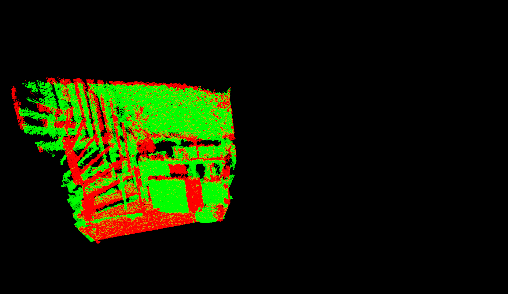
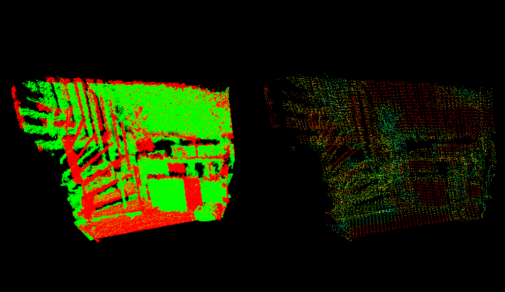
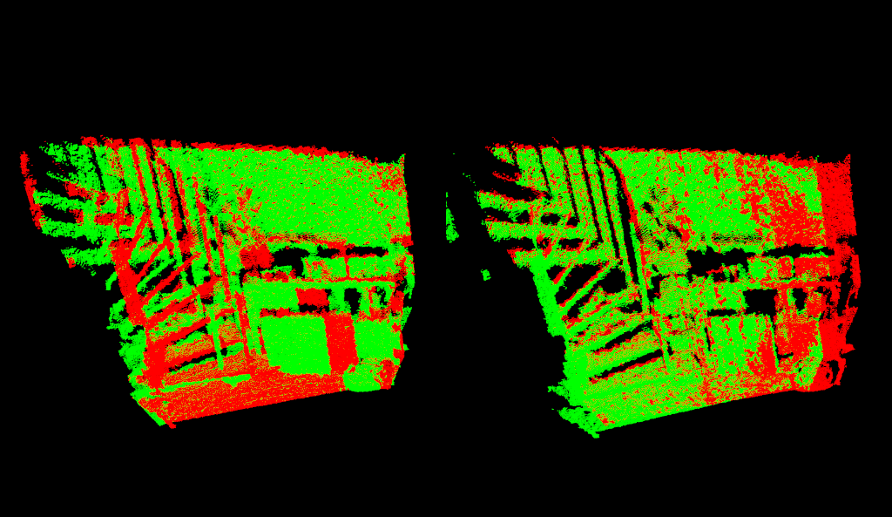
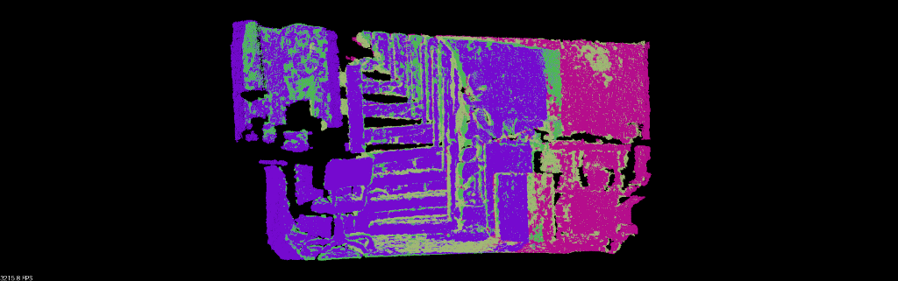

# 第11章 PPT：ICP与PLICP扫描匹配

> 共 17 页，标注页码 · 图号与教学文档对应

## P1

# 第11章 ICP与PLICP扫描匹配

**课程**：ROS2 Python 编程
**课时**：2 课时（90 分钟）
**教学方式**：讲授 + 演示

本章主线：扫描匹配问题定义 → ICP 算法与 SVD 推导 → PLICP 点到线改进 → Gauss-Newton 优化 → ROS2（slam_toolbox）应用与工程案例

<!-- 旁白：大家好，本课讲 SLAM 前端的核心环节——扫描匹配。激光机器人每动一步，都要回答"这两帧点云之间发生了怎样的相对运动"，ICP 与 PLICP 就是回答这个问题的经典算法。我们将从原理推导讲到 Python 实现，最后落到 slam_toolbox 的真实参数上。 -->

---

## P2

## 本课学习目标

- 理解 ICP 扫描匹配算法的基本原理与数学推导（SVD 求解最优变换）
- 掌握 PLICP（Point-to-Line ICP）算法原理及其相对 ICP 的优势
- 熟悉 Gauss-Newton 优化方法在扫描匹配中的应用
- 能够使用 Python + NumPy 实现基本的 ICP 和 PLICP 算法
- 了解扫描匹配在 ROS2 SLAM（slam_toolbox）中的实际应用与参数调优
- 掌握初值估计、鲁棒匹配（Huber 损失）与退化场景的工程对策

<!-- 旁白：这六条目标分三层：前两条是算法原理层，中间两条是实现层，最后两条是工程应用层。学完本章，大家不仅会推导公式，还应该能读懂并调整 slam_toolbox 的扫描匹配参数，明白每个权重改了会发生什么。 -->

---

## P3

## 扫描匹配问题定义

- **要点：** 扫描匹配是 SLAM 前端核心，求两帧间的相对位姿变换 T = (R, t)

**问题形式**：给定参考帧点云 P = {p₁, p₂, ..., pₙ} 与当前帧点云 Q = {q₁, q₂, ..., qₘ}，求将 Q 映射到 P 坐标系的变换矩阵 T：

```
T* = argmin Σ || p_i - T(q_i) ||²
```

- T(q_i) = R · q_i + t：R 为旋转矩阵，t 为平移向量
- 输入是两帧点云，输出是 3 个量：(x, y, θ)
- 求解思路：迭代优化——先给对应关系，再求最优变换，反复修正


图：两帧点云配准示意图——蓝色点云为参考帧，绿色点云为待配准的当前帧

<!-- 旁白：看这张图，蓝色和绿色是同一面墙在两个时刻的观测，扫描匹配要找的就是让绿色贴回蓝色的那个旋转加平移。注意目标函数里"对应点"是未知的，这正是问题难解的原因：对应关系与位姿互相依赖，只能靠迭代交替求解。 -->

---

## P4

## ICP 算法步骤与实现

- **要点：** 迭代执行"变换→找对应→求最优变换"，直到误差收敛

```
算法流程:
1. 初始化变换 T₀ (通常使用里程计或匀速模型)
2. 对Q中每个点，在P中寻找最近邻点
3. 计算使匹配点对距离和最小的变换 T
4. 应用T到Q，重复步骤2-3
5. 当收敛或达到最大迭代次数时停止
```

实现要点（源文档 `ICP` 类）：
- 用 `scipy.spatial.KDTree` 加速最近邻搜索
- 每轮用 SVD 解出当前对应关系下的最优 (R, t)，并增量累乘：`R = R_new @ R`
- 收敛判据：平均误差变化量 < tolerance（如 1e-6）


图：ICP 迭代过程中当前帧逐步向参考帧靠拢

<!-- 旁白：这五步是一个典型的"交替优化"框架：固定对应关系时变换有解析解，固定变换时对应关系可以重新搜索。代码里最值得记住的是 KDTree 的 query 一次拿到距离和索引，以及 R 的累乘顺序——先求出的增量在右边乘，顺序错了结果就反了。 -->

---

## P5

## ICP 的数学推导：SVD 求最优变换

- **要点：** 对应点固定时，最优变换有闭式解——去质心后做 SVD 分解

目标函数（对应点距离平方和）：

```
E(R, t) = Σ || p_i - (R·q_i + t) ||²
```

**求解旋转**：先算两组点的交叉协方差矩阵，再 SVD 分解

```
W = Σ (q_i - μ_q)(p_i - μ_p)ᵀ  =  U·Σ·Vᵀ
R = V·Uᵀ
```

**求解平移**：旋转确定后直接由质心差得到

```
t = μ_p - R·μ_q
```

- 数值细节：若 `det(R) < 0`（反射），需翻转 V 的最后一行再重乘，保证 R 是真旋转


图：配准收敛后两组点云重合，对应点误差最小

<!-- 旁白：这一页是本章的数学核心。直觉上理解：先把两组点都移到质心，旋转只与点的分布方向有关，交叉协方差 W 的 SVD 恰好给出了主方向的对齐。为什么质心可以先行消掉？因为旋转矩阵作用在去质心点上不改变质心约束，平移便可解耦出来。 -->

---

## P6

## ICP 的局限性与收敛分析

- **要点：** ICP 对初值敏感、易陷局部最优，误差来源需逐项认识

四大局限：
- **局部最优**：对初始位姿敏感，初值差则收敛到错误极值
- **点云稀疏性**：结构简单（特征少）的环境中匹配质量差
- **计算效率**：朴素最近邻是 O(n²)，用 KDTree 可优化到 O(n·log n)
- **对应关系误差**：最近邻假设可能造成错误匹配

收敛分析方法（源文档 `ICPWithAnalysis` 类）：
- 变初值实验：初始偏移取 0.0 / 0.5 / 1.0 / 2.0，观察最终误差与迭代次数
- 变噪声实验：噪声 0.0 → 0.5，统计角度误差与平移误差的放大规律


图：初值偏差过大时配准可能停在错误的局部极小

<!-- 旁白：这张图展示了初值不好时的典型失败形态——点云没有完全贴合就停住了。请大家注意"误差不再下降"不等于"配准正确"，它可能只是收敛到了局部极小。这也解释了为什么工程上总要用里程计或匀速模型先给一个不错的初值。 -->

---

## P7

## PLICP：点到线 ICP 原理

- **要点：** 用点到直线的距离代替点到点的距离，收敛更快、精度更高

**目标函数**（n_i 为目标点 p_i 处的法向量）：

```
E(T) = Σ (n_iᵀ · (T(q_i) - p_i))²
```

**点到线距离示意**：

```
      线(L)
        |
  q_i   |    p_i (参考点)
   ×----|----×
        |    ↑
        |    n_i (法向量)
  距离 = n_i · (T(q_i) - p_i)
```

- 动机：真实环境充满平面与直线（墙、柜子），对应点未必重合，但通常落在同一条线上
- 适用性：结构化环境中优势明显；ICP 中"点到点"的假设过强

<!-- 旁白：这一页的关键直觉是：在墙角附近采到的点，几乎不可能恰好落在参考帧某个点的正上方，但大概率落在墙面这条线上。PLICP 只要求当前点落在对应直线上，约束更宽松也更合理，所以迭代次数更少、匹配更稳。 -->

---

## P8

## PLICP 实现：法向量估计与 Gauss-Newton 迭代

- **要点：** 法向量由 k 近邻 PCA 估计；位姿增量由正规方程 H·Δ = -b 求解

**法向量估计**（`estimate_normals`）：
- 对每个点找 k+1 个近邻（排除自身），对邻域点做 PCA
- 协方差矩阵**最小特征值**对应的特征向量即法向量（点云局部呈线状分布）
- 方向一致性：若 `normal · point < 0` 则取反，保证指向传感器外侧

**Gauss-Newton 迭代**（对位姿 (x, y, θ) 线性化）：

```
雅可比:  J_i = [n_i_x, n_i_y, n_i · (∂R/∂θ · q_i)]
更新:    Δξ = -(JᵀJ)⁻¹ · Jᵀ · e(ξ)
```

- 每轮循环：变换 → 找最近邻 → 算点到线残差 → 组装 H = JᵀJ、b = J·d → 解 Δ → 更新位姿
- 角度归一化：`pose[2] = arctan2(sin θ, cos θ)`，防止角度越界
- 数值保护：`H + I·1e-6` 加最小阻尼，避免矩阵奇异

<!-- 旁白：对照 ICP 的 SVD 闭式解，PLICP 把问题变成了非线性最小二乘，每轮迭代只解一个 3x3 的正规方程，代价很低。法向量的 PCA 估计是唯一引入的超参数 k，取 5 左右即可；k 太小法向量噪声大，太大则会把拐角抹平。 -->

---

## P9

## PLICP vs ICP 对比

- **要点：** 结构化环境下 PLICP 迭代更少、误差更小、收敛快 2–3 倍

| 指标 | ICP | PLICP |
|------|-----|-------|
| 距离度量 | 点到点 | 点到线 |
| 目标函数 | Σ‖p_i − (R·q_i + t)‖² | Σ(n_iᵀ(T(q_i) − p_i))² |
| 每轮求解 | SVD 闭式解 | Gauss-Newton 正规方程 |
| 典型迭代上限 | 50 次 | 20 次 |
| 收敛速度 | 慢 | 结构化环境快 2–3 倍 |
| 适用场景 | 通用点云配准 | 墙面等直线特征丰富的环境 |

- 源文档对比实验（`compare_icp_plicp`）：四 walls 结构化点云 + 0.05 噪声，同时统计迭代次数、最终误差与耗时
- 结论：直线特征越丰富，PLICP 的优势越明显

<!-- 旁白：看表格中间两行：两者求解方式完全不同，ICP 每轮解一个全局闭式问题，PLICP 每轮只做一次线性化增量更新。但决定总耗时的往往是迭代轮数——PLICP 收敛快 2 到 3 倍，正是来自"点到线"这个更贴合环境的度量方式。 -->

---

## P10

## Gauss-Newton 优化方法

- **要点：** 非线性最小二乘的主流迭代解法：线性化残差 + 解正规方程

**问题形式**：

```
min F(x) = Σ f_i(x)² = ||f(x)||²
迭代更新：x_{k+1} = x_k - (JᵀJ)⁻¹ · Jᵀ · f(x_k)
```

**在扫描匹配中的应用**（`GaussNewtonScanMatcher`）：
- 残差定义为地图匹配误差：`r_i = 1 - M(S_i(T))`，M 为栅格地图的占据概率
- 地图值与地图梯度均通过**双线性插值**获取，保证残差连续可导
- 每轮解 `H = JᵀJ`、`b = J·r`，求 `H·Δ = -b` 后更新 (x, y, θ)

| 方法 | 收敛速度 | 实现难度 | 需二阶导 | 适用场景 |
|------|---------|---------|---------|---------|
| 梯度下降 | 慢 | 易 | 否 | 远离最优值 |
| Gauss-Newton | 快 | 中 | 否 | 残差较小时 |
| Levenberg-Marquardt | 快 | 中 | 否 | 通用推荐 |
| 牛顿法 | 最快 | 难 | 是 | 小规模问题 |

<!-- 旁白：表格要抓住两列：GN 不需要二阶导却能获得接近二阶的收敛速度，因为它用 JᵀJ 近似了海塞矩阵；LM 是在 GN 的对角线上加阻尼，更稳，工程上最常用。我们代码里 H 加 1e-6 的单位阵，其实就是最简单的 LM 阻尼思想。 -->

---

## P11

## 官方要点：Cartographer 的「先粗后精」匹配策略

- **要点：** 粗匹配找初值（搜索窗口枚举），精匹配做 GN 优化——层层兜底

Google Cartographer 官方文档提出的两阶段策略：

```
阶段1 实时相关性扫描匹配 (Real-Time Correlative Scan Matching)
  → 在搜索窗口内暴力枚举候选位姿，相关性打分选较优初值
阶段2 Ceres 精细优化
  → 本质是 Gauss-Newton（残差平方和最小化）+ 损失函数加权
```

- 粗匹配窗口：`linear_search_window`、`angular_search_window`
  - 窗口越大 → 越能容忍里程计漂移，但计算量**线性增长**
  - 窗口过小 → 粗匹配落在错误极值附近，精细优化**无法挽回**
- 这是对 11.1.4「初始位姿敏感、易陷局部最优」的官方工程对策

<!-- 旁白：为什么说精细优化"无法挽回"坏初值？因为 GN 只能收敛到离初值最近的极小值，它是局部算法。Cartographer 的思路是先花算力把初值圈到正确盆地里，再交给便宜的局部优化器——这个"先粗后精"的组合拳在很多工程问题里都能见到。 -->

---

## P12

## ROS2 应用：slam_toolbox 中的扫描匹配

- **要点：** slam_toolbox 内部用 Ceres Solver 做扫描匹配，权重参数决定目标函数分配

```yaml
slam_toolbox:
  ros__parameters:
    solver_plugin: solver_plugins::CeresSolver
    ceres_scan_matcher:
      translation_weight: 10.0      # 平移权重
      rotation_weight: 40.0         # 旋转权重
      occupied_space_weight: 20.0   # 占据空间权重
      ceres_loss_function: None     # 损失函数
    minimum_time_interval: 0.5      # 最小帧间隔
    minimum_travel_distance: 0.3    # 最小移动距离
    resolution: 0.05                # 地图分辨率
    max_laser_range: 8.0            # 最大激光范围
```

- 三个权重构成目标函数的权值分配：平移、旋转、占据空间置信度
- 节流参数：`minimum_time_interval` 与 `minimum_travel_distance`
  - 保证机器人静止或原地旋转时**不反复触发**代价高昂的匹配计算

<!-- 旁白：这份 yaml 大家以后会经常见到。translation_weight 和 rotation_weight 是"信任哪类观测"的旋钮，最后两位参数则是省钱开关——匹配一次并不便宜，静止时没必要反复算。注意 ceres_loss_function 默认为 None，想要鲁棒匹配时可以配置 Huber 等损失。 -->

---

## P13

## 扫描匹配节点实现与调优

- **要点：** 里程计作初值 + PLICP 匹配 + 滑动窗口更新参考帧

**节点数据流**（源文档 `ScanMatcherNode`）：

```
/scan  → LaserScan 过滤无效点 → 笛卡尔点云 ┐
/odom  → 四元数转欧拉角（初值估计）        ┴→ PLICP 匹配 → 位姿增量 + 误差
误差 < 0.01 → 更新参考帧（滑动窗口）
```

**匹配参数调整**（对应 slam_toolbox 权重）：

| 场景类型 | 平移权重 | 旋转权重 |
|---------|---------|---------|
| 结构化走廊 | 10.0 | 40.0 |
| 开阔广场 | 20.0 | 20.0 |
| 狭窄通道 | 5.0 | 60.0 |

- 点云预处理：体素滤波降采样（0.05）、半径滤波去离群点、提取角点/边缘点
- 初值来源：里程计推算、匀速模型外推、IMU 预积分
- 收敛条件：最大迭代 10–20 次、误差阈值 1e-4 ~ 1e-6

<!-- 旁白：调参表是有物理直觉的：走廊里沿走廓方向平移几乎不产生约束，必须靠更强的旋转权重稳住方向；开阔广场特征全向分布，平移旋转权重对半即可。记住调参纪律：一次只改一个参数，并用 rosbag 离线回放对比建图效果。 -->

---

## P14

## 案例分析：走廊环境与鲁棒匹配

- **要点：** 走廊是典型退化场景；动态障碍物用 Huber 损失降权

**走廊环境**（`corridor_matching_example`）：
- 模拟为两条平行墙（宽 2 m、长 10 m），PLICP 通常比 ICP 快 2–3 倍收敛
- **退化风险**：沿走廊方向移动时约束被"吸收"，算法收敛却完全错位
- 对策：结合里程计一致性检查、提高旋转权重、限制最大匹配距离、依赖回环检测全局纠偏

**动态环境鲁棒匹配**（`RobustScanMatcher`）：
- Huber 损失函数给大残差降权：`w = δ / |r|`（当 r > δ 时）
- 动态行人腿部等摆动点权重被压低，不再污染匹配结果
- 辅助手段：只保留 `range_min ~ max_laser_range` 内命中率稳定的射线
- 匹配得分过低时宁可信任里程计跳过本帧，也不要把错误增量送入后端

<!-- 旁白：走廊退化值得大家记住这个画面：在只有两条平行墙的环境里，沿墙方向平移多少，匹配误差都几乎不变，于是算法"完美收敛"到一个错误的位置。工程上永远要做里程计一致性检查——两次独立估计差得离谱时，先怀疑匹配而不是里程计。 -->

---

## P15

## 本章要点

1. 扫描匹配求两帧间相对位姿 T = (R, t)，目标函数为对应点距离平方和的最小化
2. ICP 交替执行"最近邻对应 + SVD 闭式解"，简单通用，但对初值敏感、易陷局部最优
3. PLICP 用点到线距离替代点到点距离，结构化环境中收敛快 2–3 倍、精度更高
4. Gauss-Newton 通过 JᵀJ 近似海塞矩阵，无需二阶导即可获得快速收敛；LM 在其对角线加阻尼更稳
5. Cartographer 采用"实时相关性粗匹配 + Ceres 精优化"两阶段策略，破解初值敏感问题
6. slam_toolbox 的 `translation_weight`/`rotation_weight`/`occupied_space_weight` 是目标函数的权值分配旋钮
7. 工程三件套：里程计作初值、Huber 损失抗动态物、退化场景做一致性检查

<!-- 旁白：这一页可以当作复习提纲。前三条是算法主线：问题定义、ICP、PLICP；四到六条是优化与系统视角；最后一条是工程经验。如果只能记住一件事，请记住"扫描匹配是局部算法，初值质量决定成败"。 -->

---

## P16

## 练习题

1. **推导题**：推导 ICP 算法中基于 SVD 的最优变换求解过程，说明为什么 SVD 分解可以求得旋转矩阵的最优解。
2. **编程题**：使用 Python 实现完整的二维 ICP，支持 KDTree 加速最近邻搜索，并绘制配准前后对比图。
3. **分析题**：从目标函数、收敛速度、对噪声的鲁棒性三方面比较 ICP 和 PLICP 的异同。
4. **推导题**：推导 PLICP 中 Gauss-Newton 优化的雅可比矩阵 J = [n_x, n_y, n·(∂R/∂θ·q)]，给出完整推导过程。
5. **配置题**：在 slam_toolbox 中调整扫描匹配参数（平移权重、旋转权重、最小移动距离等），说明各参数对建图质量的影响。
6. **设计题**：设计一个融合里程计和激光扫描匹配的位姿估计系统，说明何时更信任里程计、何时更信任扫描匹配。

<!-- 旁白：建议按顺序做：前两题巩固 ICP 本体，三、四题对应 PLICP 的推导主线，五、六题是系统工程题。第 5 题可基于仓库 `src/slam_sim_demo_ros2/params/slam_toolbox_params.yaml` 逐项试参；第 6 题思考清楚"得分低时信谁"就抓住了要害。 -->

---

## P17

## 下章预告

## 第12章：Hector SLAM

- 从"帧间匹配"走向"扫描对地图匹配"：Hector SLAM 的高斯牛顿地图匹配框架
- 双栅格分辨率与多分辨率地图更新技术
- 无需里程计的 SLAM 系统：它靠什么补上初值？
- 分析 Hector SLAM 的优缺点与适用场景

**课后准备**：完成本章第 2、5 题（ICP 实现 + slam_toolbox 调参），下章将直接用到

<!-- 旁白：本章的 PLICP 是"扫描对扫描"，下一章的 Hector SLAM 把匹配对象换成已建好的地图，并用双分辨率栅格加速。一个有趣的思考题：Hector 不用里程计，那它的初值从哪来？带着这个问题进入第 12 章。 -->
