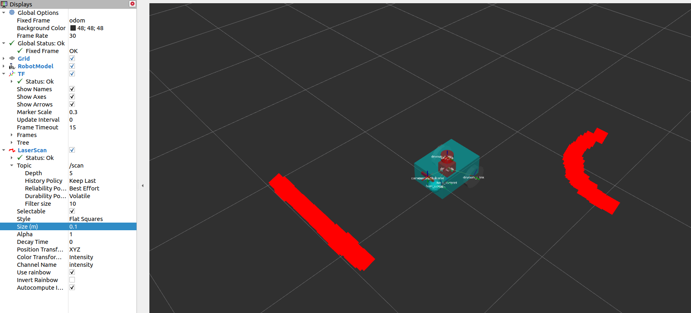
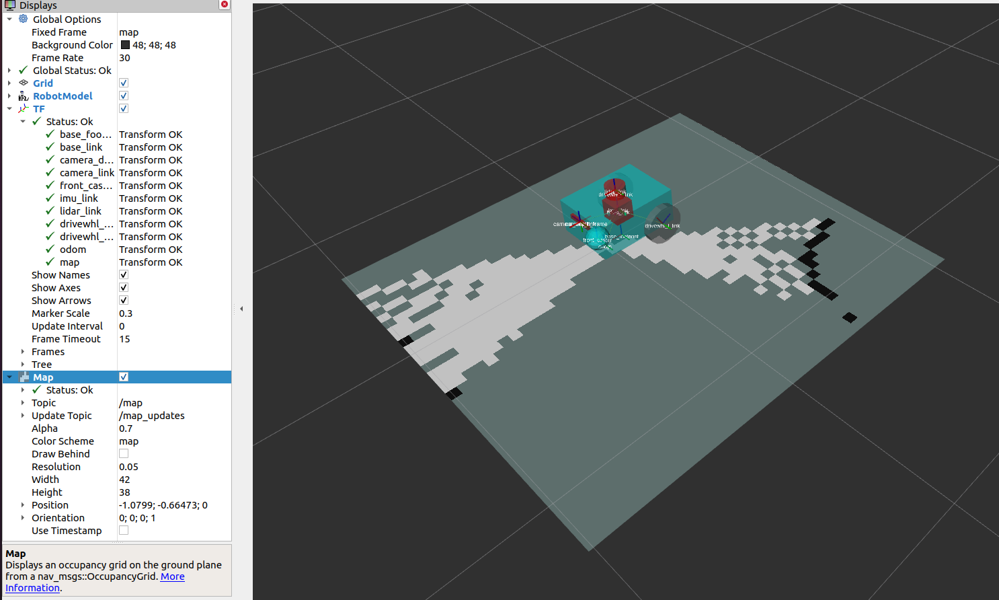

# 第12章 PPT：Hector SLAM

> 共 17 页，标注页码 · 图号与教学文档对应

---

## P1 · 标题页

**Hector SLAM**

- **课程：** ROS2 Python 编程
- **章节：** 第12章
- **课时：** 2 课时（90 分钟）
- **教学方式：** 讲授 + 演示

<!-- 旁白：本章聚焦 Hector SLAM——一种不依赖里程计的二维激光建图方法。我们从扫描-地图匹配的核心思想出发，学习 Gauss-Newton 优化与双线性插值的数学基础，再通过多分辨率栅格和 ROS2 节点实践，掌握它在手持建图等场景中的应用。 -->

---

## P2 学习目标

- **理解** Hector-SLAM 的基本原理与算法架构
- **掌握** 基于优化的激光 SLAM 方法
- **理解** 双栅格地图与多分辨率匹配策略
- **熟悉** Gauss-Newton 地图匹配的数学推导
- **能够** 分析 Hector-SLAM 的优缺点和适用场景

<!-- 旁白：本章目标围绕"原理—推导—实现—评估"四条主线展开。学完后，大家应能独立解释 Hector SLAM 为什么不需要里程计，手算简化的 Gauss-Newton 增量，阅读并修改其扫描匹配代码，并针对具体场景判断它是否适用。 -->

---

## P3 Hector-SLAM 概述

- **要点：** 扫描-地图匹配（Scan-to-Map）；无需里程计；Gauss-Newton 迭代优化位姿

- **来源：** 德国达姆施塔特理工大学（TU Darmstadt），IROS 2011
- **核心思想：** 最小化当前激光扫描与已有栅格地图之间的差异，迭代优化出机器人位姿
- **主要特点：**
  - 不依赖里程计：可用于手持设备或无轮式编码器的平台
  - 多分辨率栅格地图：加速匹配、扩大收敛域
  - 双线性插值：把离散栅格变成连续可微的地图函数

<!-- 旁白：与传统滤波类 SLAM 不同，Hector SLAM 把定位问题转化为一个非线性优化问题：当前帧激光与已建地图越"对齐"，目标函数值越小。正因为它只对齐扫描与地图，不需要轮式里程计的先验，所以特别适合手持建图和无人机等平台。 -->

---

## P4 Hector-SLAM 系统架构

- **要点：** 三个模块串联：扫描-地图匹配 → 地图更新 → 地图发布

```
激光扫描数据输入
    ↓
┌─────────────────────────┐
│    扫描-地图匹配        │
│  (Gauss-Newton优化)     │
│  输入: 当前扫描+已有地图 │
│  输出: 优化后位姿       │
└─────────┬───────────────┘
          ↓
┌─────────────────────────┐
│    地图更新             │
│  (双栅格分辨率)         │
│  输入: 优化后位姿+扫描   │
│  输出: 更新后栅格地图    │
└─────────┬───────────────┘
          ↓
┌─────────────────────────┐
│    地图发布             │
│  /map (OccupancyGrid)   │
│  /slam_out_pose (Pose)  │
└────────────────┘
```

<!-- 旁白：架构上每一帧激光都要走完"匹配—更新—发布"三步。匹配模块输出优化后的位姿；地图模块用这个位姿把新扫描融合进栅格地图；最后按固定频率发布 /map 与 /slam_out_pose，并广播 map 到 odom 的 TF 变换，供 RViz 和导航使用。 -->

---

## P5 优缺点与同类方法对比

- **要点：** 优点是无里程计、计算高效；缺点是依赖高帧率激光、缺乏回环与重定位能力

| 优点 | 缺点 |
|------|------|
| 无需里程计，适用性广 | 低速率激光会导致漂移 |
| 计算效率高，可实时运行 | 移动过快导致建图漂移 |
| 结构化环境中精度高 | 回环检测能力弱 |
| 实现相对简单 | 对初值敏感，重定位能力差 |

| 对比维度 | Hector-SLAM | gmapping | Cartographer |
|---------|-------------|----------|-------------|
| 里程计依赖 | 不需要 | 需要 | 可选 |
| 回环检测 | 不支持 | 不支持 | 支持 |
| 建图质量 | 依赖激光频率 | 依赖里程计精度 | 高（图优化） |
| 计算效率 | 高 | 中 | 中 |
| 适用场景 | 手持/无里程计 | 有里程计 | 复杂大场景 |

<!-- 旁白：从对比表看，Hector SLAM 的定位非常明确：在建图质量上它不如带图优化后端的 Cartographer，但"免里程计"这一点让它在手持设备和无人机上不可替代。使用时要牢记两个前提：激光帧率足够高、运动速度不能过快，否则漂移会迅速累积。 -->

---

## P6 扫描-地图匹配：目标函数

- **要点：** 位姿优化 = 最小化"激光点未命中占据栅格"的误差

```
T* = argmin Σ [1 - M(S_i(T))]²
```

- $T = (x, y, \theta)$：待优化的机器人位姿
- $S_i(T)$：第 i 个激光点在变换 T 下的地图坐标
- $M(S_i(T))$：该坐标处的占据概率（0=空闲，1=占据）

**直观理解：**

| 激光点落点 | M 值 | 误差 | 含义 |
|-----------|------|------|------|
| 占据区域 | ≈ 1 | ≈ 0 | 匹配良好 |
| 空闲区域 | ≈ 0 | ≈ 1 | 匹配不良 |

优化目标：让所有激光点都命中地图的占据区域。

<!-- 旁白：目标函数的设计非常直白：某个激光点若落在被占据的栅格上，误差接近零；若落在空闲区，误差接近一。把所有点的误差平方求和再最小化，就得到最优位姿。这个"以地图为参照的对齐度量"是本章一切推导的出发点。 -->

---

## P7 Gauss-Newton 优化求解

- **要点：** 目标函数非线性，用 Gauss-Newton 法迭代求增量 ΔT

```
ΔT = H⁻¹ · ∇M · Σ (∂S_i/∂T)ᵀ · [1 - M(S_i(T))]
```

- ∇M：地图 M 在 $S_i$ 处的**梯度**（由双线性插值获得）
- ∂S_i/∂T：激光点对位姿参数的**雅可比**，含旋转 θ 的导数
- H：Hessian 近似，$H = \Sigma J_i^T · J_i$

**求解流程：**

1. 用当前位姿变换激光点，插值出 M 值与梯度
2. 组装残差、雅可比，构建正规方程
3. 解出 ΔT，更新位姿
4. ‖ΔT‖ 小于阈值即收敛，否则回到第 1 步

<!-- 旁白：Gauss-Newton 的精髓是用一阶雅可比近似二阶 Hessian，避免计算二阶导数。每一次迭代中，地图梯度提供"往哪边拉"，雅可比提供"位姿各分量各占多少责任"。实践中还会给 H 加微小正则项，防止矩阵奇异导致求解失败。 -->

---

## P8 双线性地图插值

- **要点：** 双线性插值把离散栅格地图变成连续可微函数，使 Gauss-Newton 可用

```
M00 ─── dx ─── M10
  │             │
 dy    M(P)     dy
  │             │
M01 ─── dx ─── M11

M(P) = M00·(1-dx)·(1-dy) + M10·dx·(1-dy)
     + M01·(1-dx)·dy      + M11·dx·dy
```

- 栅格地图本身是**离散**的：只在整数格点上有值
- 双线性插值用周围 4 个格点加权，得到**任意连续坐标**处的 M(P)
- 权重是坐标的线性函数 → M(P) 可导 → 能求梯度、能做优化

<!-- 旁白：为什么非要插值不可？因为优化需要在非整数坐标处求地图值和梯度，而栅格地图天然是离散的。双线性插值用四个格点的加权平均填补空隙，权重随坐标连续变化，于是地图函数变得可微。这是 Hector SLAM 能直接套用梯度优化的关键一步。 -->

---

## P9 扫描匹配器的代码实现

- **要点：** 核心是"变换点坐标 → 插值取值与梯度 → 组装雅可比 → 解正规方程"的循环

```python
class HectorScanMatcher:
    def match(self, scan_points, map_data,
              map_resolution, initial_pose):
        pose = initial_pose.copy()
        grad_x = np.gradient(map_data, axis=1) / map_resolution
        grad_y = np.gradient(map_data, axis=0) / map_resolution
        for iteration in range(self.max_iterations):
            # 变换到地图坐标系
            world_coords = scan_points @ R.T + pose[:2]
            for i, q in enumerate(scan_points):
                # 双线性插值：同时得到地图值与梯度
                M, dM_dx, dM_dy = self.bilinear_interpolate_with_gradient(...)
                residuals[i] = 1.0 - M
                # 组装雅可比 J[i, :]
            H = J.T @ J
            b = J.T @ residuals
            delta = np.linalg.solve(H + np.eye(3) * 1e-6, -b)
            pose[:2] += delta[:2]
            pose[2]  += delta[2]
            if np.linalg.norm(delta) < self.convergence_delta:
                break
        return pose
```

<!-- 旁白：这段实现把前面两页的数学一一对应起来：np.gradient 预先算好整幅地图的梯度，循环体内做双线性插值、填残差和雅可比，最后解一个 3×3 的正规方程。注意代码里对 H 加了 1e-6 的正则项，并设有最大迭代次数与收敛阈值双重退出条件。 -->

---

## P10 双栅格地图与多分辨率匹配

- **要点：** 由粗到精：先在粗分辨率上把初值拉进正确"盆地"，再在细分辨率上精化

```
粗分辨率地图 (0.2m/像素):
┌──────────────────────┐
│  快速粗匹配           │
│  获取初始位姿估计     │
│  收敛域大，精度低     │
└──────────┬──────────┘
           ↓ (结果作为初值)
┌──────────────────────┐
│  高分辨率地图 (0.05m) │
│  精确匹配             │
│  收敛域小，精度高     │
└──────────┬──────────┘
           ↓
    最终精确位姿
```

| 层级 | 分辨率 | 作用 | 特点 |
|------|--------|------|------|
| 粗 | 0.20 m/像素 | 粗匹配，提供初值 | 收敛域大，精度低 |
| 中 | 0.10 m/像素 | 过渡匹配 | 折中 |
| 细 | 0.05 m/像素 | 精确匹配 | 收敛域小，精度高 |

<!-- 旁白：单一分辨率的地图很难同时满足"收敛域大"和"精度高"两个矛盾需求。多分辨率金字塔把两者拆开：粗层负责大范围"抓住"正确解，细层负责精修。这一粗配准加精配准的套路与 Cartographer 的相关性粗匹配异曲同工，是工业级 SLAM 的通用设计。 -->

---

## P11 地图更新策略

- **要点：** 用 Bresenham 光束沿线更新 log-odds：途经栅格变空闲，终点栅格变占据

- **更新规则（对数几率）：**
  - 光束途经栅格：`log_odds -= 0.3`（空闲证据）
  - 光束终点栅格：`log_odds += 1.0`（占据证据）
  - 全图裁剪到 [-5.0, 5.0]，避免过度自信
- **Bresenham 直线算法：** 从机器人栅格到激光点栅格逐格遍历，确定"穿越了哪些格子"
- **发布 OccupancyGrid：**
  - p < 0.2 → 0（空闲）
  - p > 0.8 → 100（占据）
  - 其余 → -1（未知）

<!-- 旁白：地图更新本质是概率融合。每次扫描沿光束方向"扫"出一条自由空间，途经格子累计变空的证据，终点格子累计变占的证据，全部用对数几率相加并限幅。发布时按阈值二值化成导航用的 OccupancyGrid，未知区域单独标记，供路径规划保守处理。 -->

---

## P12 ROS2 节点设计

- **要点：** 订阅 `/scan`，发布 `/map` 与 `/slam_out_pose`，并广播 map→odom TF

```python
class HectorSLAMNode(Node):
    def __init__(self):
        super().__init__('hector_slam')
        # 参数: map_resolution, map_size, max_iterations, ...
        self.map_pub = self.create_publisher(OccupancyGrid, '/map', 10)
        self.pose_pub = self.create_publisher(PoseStamped, '/slam_out_pose', 10)
        self.scan_sub = self.create_subscription(
            LaserScan, '/scan', self.scan_callback, 10)
        self.tf_broadcaster = tf2_ros.TransformBroadcaster(self)

    def scan_callback(self, msg):
        # LaserScan → 点云 → 首帧仅建图
        # 之后: 扫描匹配 → 更新地图 → 发布位姿 → 广播TF
```



图 12-1：RViz 中的 LaserScan 话题可视化（来源：Nav2 官方文档）

<!-- 旁白：节点回调是全流程的调度中心：首帧扫描只更新地图，之后每帧先做扫描-地图匹配，再更新地图、发布位姿、广播 TF。图中所示的正是一帧二维 LaserScan 在 RViz 里的样子，它是调试匹配算法时最直观的输入参照。 -->

---

## P13 启动配置与参数调优

- **要点：** launch 中声明 frame 约定与话题；参数按环境规模与激光帧率调整

```python
Node(
    package='hector_slam',
    executable='hector_mapping',
    parameters=[{
        'map_resolution': 0.05,
        'map_size': 20.0,
        'base_frame': 'base_footprint',
        'odom_frame': 'odom',
        'map_frame': 'map',
        'scan_topic': '/scan',
        'pub_map_odom_transform': True,
    }]
)
```

| 参数 | 默认值 | 说明 | 调优建议 |
|------|--------|------|---------|
| map_resolution | 0.05 | 地图分辨率(m) | 大场景增大到0.1，精细场景减小到0.025 |
| map_size | 20.0 | 地图尺寸(m) | 根据环境大小调整 |
| max_iterations | 15 | 优化最大迭代次数 | 激光频率高可减少 |
| update_factor_free | 0.4 | 空闲栅格更新因子 | 减小提高平滑度 |
| update_factor_occupied | 0.9 | 占据栅格更新因子 | 增大可加快收敛 |

<!-- 旁白：frame 三个参数决定 TF 树的挂接方式，pub_map_odom_transform 决定由建图节点还是外部定位节点广播 map 到 odom。调参纪律与前面章节一致：先录 ros2 bag，再离线重放试参，每次只改一个变量，观察地图边界与漂移的变化。 -->

---

## P14 仿真实践与常见问题

- **要点：** Gazebo 中验证 /scan 与 /tf 接口，按"漂移—失真—重定位"三类问题排查

```bash
ros2 launch robot_sim_demo gazebo2.launch.py drive:=false
ros2 launch hector_slam hector_slam.launch.py
ros2 run teleop_twist_keyboard teleop_twist_keyboard
ros2 run nav2_map_server map_saver_cli -f hector_map
```



图 12-2：占据栅格地图（来源：Nav2 官方文档）

| 问题 | 原因 | 解决方案 |
|------|------|---------|
| 建图漂移 | 移动过快/激光帧率不足 | 降低速度、提高激光频率 |
| 地图失真 | 初始位姿误差过大 | 保证初值准确，增加粗分辨率层 |
| 重定位失败 | 缺乏全局定位能力 | 配合 AMCL，或手动注入 /initialpose |

<!-- 旁白：实践环节先确认仿真发布 /scan 与 TF，再启动建图并用键盘遥控低速走"8"字，最后用 map_saver_cli 保存地图。若看到墙线变粗或错位，对照表逐项排查；Hector 没有全局重定位，一旦丢失只能重启或交给 AMCL 恢复。 -->

---

## P15 本章要点

- Hector-SLAM 采用**扫描-地图匹配**，无需里程计，适合手持与无编码器平台
- 目标函数 $\Sigma [1 - M(S_i(T))]^2$ 用 **Gauss-Newton** 迭代求解
- **双线性插值**使离散栅格地图连续可微，是梯度优化的前提
- **多分辨率地图**由粗到精匹配，兼顾收敛域与精度
- 地图更新基于 **log-odds + Bresenham 光束**，发布标准 OccupancyGrid
- 局限：依赖高帧率激光、无回环检测、重定位能力弱
- ROS2 中经由 `hector_mapping` 节点提供 `/map`、`/slam_out_pose` 与 map→odom TF

<!-- 旁白：一句话概括本章：Hector SLAM 用"对齐当前扫描与已有地图"的方式增量建图，靠插值与多分辨率让优化又快又稳。请把它的适用边界记牢——高帧率激光、低速运动、结构化环境，下一章的 gmapping 将带来以粒子滤波为核心的不同思路。 -->

---

## P16 练习题

1. **原理题：** 说明 Hector-SLAM 为什么不需要里程计信息？它的扫描-地图匹配策略相比帧-帧匹配有什么优势？
2. **推导题：** 推导 Hector-SLAM 中 Gauss-Newton 优化的雅可比矩阵，包括旋转参数 θ 的导数和地图梯度 ∇M 的计算。
3. **编程题：** 实现一个简化版 Hector-SLAM 的扫描匹配模块，能够对模拟激光数据进行扫描-地图匹配并输出优化位姿。
4. **分析题：** 分析 Hector-SLAM 中双栅格地图的作用，说明由粗到精匹配策略如何提高匹配的鲁棒性和效率。
5. **配置题：** 在 Gazebo 仿真中启动 Hector-SLAM，调整参数（地图分辨率、更新因子等），观察不同参数对建图质量的影响。
6. **设计题：** 某手持建图设备（无里程计）需要在 2000m² 的办公环境中快速建图。设计方案包括激光雷达选型、Hector-SLAM 参数配置、建图路径规划策略和地图质量评估方法。

<!-- 旁白：六道题覆盖了从数学推导到工程设计的完整链条。建议优先完成第 2 题和第 4 题，它们直接检验对本章两大核心创新的理解；第 5 题和第 6 题请在仿真环境中动手验证，把参数变化与建图质量的关系写成简短实验报告。 -->

---

## P17 下章预告

**第13章：gmapping 粒子滤波 SLAM**

- **粒子滤波**如何表示"地图 + 位姿"的联合分布
- **FastSLAM 思想**：路径后验与地图条件的分解
- **gmapping 的工程改进**：自适应重采样与散射优化
- 与 Hector-SLAM 的对比：**里程计依赖 vs 免里程计**

<!-- 旁白：Hector SLAM 用确定性优化解决定位，下一章的 gmapping 则走概率路线：用一组粒子同时维护轨迹假设与地图，以粒子权重表达不确定性。两章对照着学，能让大家理解"优化派"与"滤波派"两条技术路线各自的取舍与适用场景。 -->
