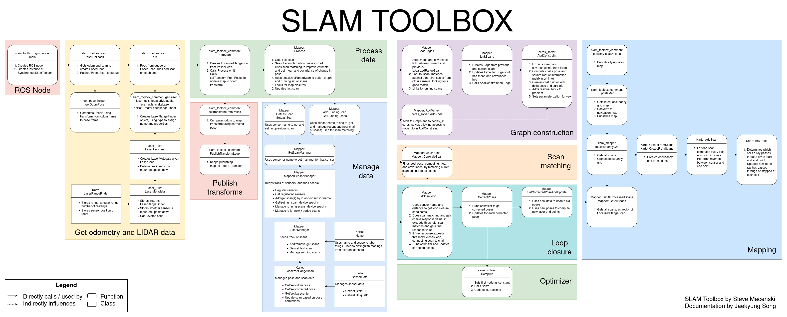
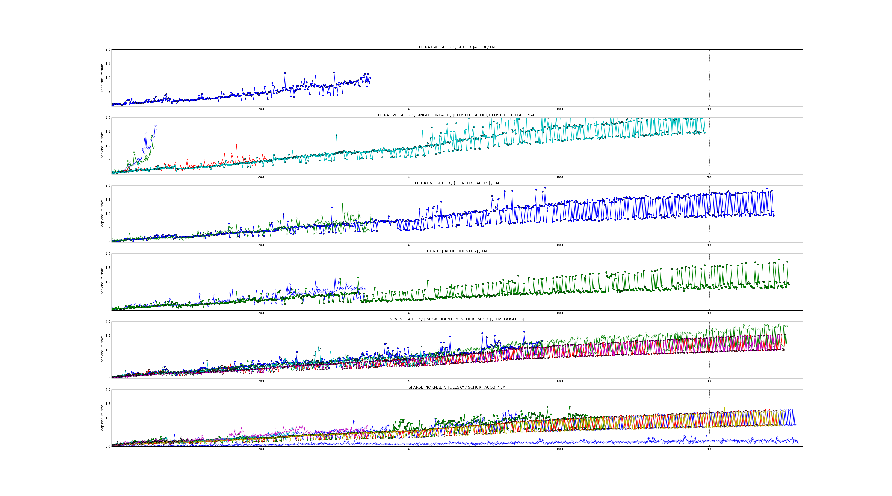

# 第13章 PPT：gmapping 粒子滤波 SLAM

> 共 17 页，标注页码 · 图号与教学文档对应

- **课程：** ROS2 Python 编程
- **章节：** 第13章
- **课时：** 2 课时（90 分钟）
- **教学方式：** 讲授 + 演示

## P1 标题页

<!-- 旁白：本章介绍粒子滤波 SLAM 的代表算法 gmapping。我们从粒子滤波的预测-更新-重采样三步出发，理解 Rao-Blackwellized 分解如何把高维 SLAM 问题拆开，再对比 FastSLAM 1.0 与 2.0，最后学习 gmapping 的三大改进与 slam_toolbox 实操。 -->

---

## P2 学习目标

- **理解** 粒子滤波 SLAM 的基本原理与 Rao-Blackwellized 分解
- **掌握** FastSLAM 框架的算法流程
- **熟悉** gmapping 的提议分布优化和自适应重采样策略
- **能够在** ROS2 中使用 slam_toolbox 进行建图
- **掌握** 建图参数调优方法

<!-- 旁白：本章目标偏向"看懂理论、会配工程"：先厘清粒子滤波为什么能表示任意分布，再弄明白 gmapping 为什么比朴素 FastSLAM 更稳，最后在仿真里用 slam_toolbox 走通建图-保存-评估全流程，并把参数调整与地图质量联系起来。 -->

---

## P3 粒子滤波基本概念

- **要点：** 一组加权粒子近似后验分布；三大步骤：预测、更新、重采样

- **粒子定义：** 每个粒子表示一个假设的机器人轨迹，包含位姿 $x_t$ 与权重 $w_t$，全体粒子共同近似后验 $p(x_t | z_{1:t}, u_{1:t-1})$
- **优势：** 可表示非高斯、多模态分布；无需线性化；用粒子数平衡精度与效率

```
1. 预测 (Prediction):   x_t ~ p(x_t | x_{t-1}, u_t)
2. 更新 (Update):       w_t = w_{t-1} · p(z_t | x_t)
3. 重采样 (Resampling): 根据权重重新采样粒子
```

<!-- 旁白：粒子滤波是蒙特卡洛式的贝叶斯滤波：每个粒子先按运动模型撒开，再用观测打分更新权重，最后按权重"重抽",让粒子重新聚集到高概率区域。三步循环往复，粒子的分布就逼进了真实后验。它的表达力远超高斯假设，代价是计算量随粒子数线性增长。 -->

---

## P4 粒子退化与重采样

- **要点：** 权重集中于少数粒子即退化；用有效样本数 Neff 度量，用重采样解决

```python
def compute_effective_sample_size(weights):
    normalized = weights / np.sum(weights)
    neff = 1.0 / np.sum(normalized ** 2)
    return neff

def detect_particle_depletion(particles):
    neff = compute_effective_sample_size([p.weight for p in particles])
    return neff < len(particles) / 2  # Neff < N/2 判定退化
```

- **退化现象：** 多次迭代后大部分粒子权重趋近于零，只有少数粒子有效
- **直觉：** 权重方差越大，Neff 越小，粒子群越"名存实亡"
- **解决：** 按权重比例重采样，淘汰低权重粒子、复制高权重粒子

<!-- 旁白：退化是粒子滤波的"天花板"：权重越集中，Effective Sample Size 越小，粒子群实际表达的信息越少。Neff 是衡量这一现象的经典指标，1 表示全部权重集中在一个粒子上。重采样把资源重新分配给高权重的轨迹，但会牺牲多样性——这正是下一章要点里"重采样不是越多越好"的原因。 -->

---

## P5 Rao-Blackwellized 分解

- **要点：** 把"轨迹+地图"的联合后验拆成"地图（给定轨迹可解析求解）"乘"轨迹后验"

```
p(x_{1:t}, m | z_{1:t}, u_{1:t-1}) =
p(m | x_{1:t}, z_{1:t}) · p(x_{1:t} | z_{1:t}, u_{1:t-1})
```

- 直接对完整 SLAM 状态（轨迹 + 整幅地图）做粒子滤波维度过高
- **分解思想：** 用粒子滤波估计机器人路径 $x_{1:t}$；给定路径，地图可用解析方法（栅格 log-odds）估计
- 每个粒子独立维护一张地图，相当于"每个轨迹假设配一份地图"

```python
class RBPFSLAMParticle:
    def __init__(self, map_size, resolution):
        self.trajectory = []
        self.pose = np.zeros(3)
        self.weight = 1.0
        self.map = np.zeros(map_size)   # 每个粒子独立的地图 (log-odds)
        self.resolution = resolution
```

<!-- 旁白：Rao-Blackwellized 的精髓是"能解析就不采样"：路径必须靠粒子探索，但给定路径后地图的估计是确定性的栅格累加，不必再用粒子表示。这样状态空间从"轨迹加地图的乘积空间"骤降到"只有轨迹",每个粒子只需多带一份地图而已。 -->

---

## P6 FastSLAM 1.0 与 2.0

- **要点：** 1.0 用运动模型采样、EKF 维护路标；2.0 把激光观测融进提议分布

```
FastSLAM 1.0 算法流程:
1. 对每个粒子:  a. 按运动模型采样新位姿  b. 计算观测似然(权重)
2. 归一化粒子权重
3. 根据权重重采样
4. 对每个粒子更新 EKF 路标点观测
```

**FastSLAM 2.0 的关键改进：**

```
x_t ~ p(x_t | x_{t-1}, u_t, z_t, m)   # 提议分布融合当前激光观测
```

- 1.0 只从运动模型采样，观测只用于事后打分，采样效率低
- 2.0 直接在提议分布中融入激光观测，采样更集中在高概率区域

<!-- 旁白：1.0 与 2.0 的差别就一句话：采样时用不用当前的激光观测。1.0 先按里程计撒粒子、再让观测"打分筛选",若运动噪声远大于观测噪声，大量粒子撒在了低概率区；2.0 用激光似然把提议分布"捏"向高处，同样的粒子数能覆盖更集中的高概率区域。 -->

---

## P7 FastSLAM vs EKF-SLAM

- **要点：** FastSLAM 以 O(M·N) 代价换取对非高斯分布的处理能力

| 特性 | FastSLAM (粒子滤波) | EKF-SLAM |
|------|-------------------|-----------|
| 状态表示 | 离散粒子群 | 高斯分布 |
| 非高斯分布 | 支持 | 不支持 |
| 数据关联 | 每个粒子独立处理 | 需要全局关联 |
| 计算复杂度 | O(M·N) M粒子数,N路标数 | O(N²) |
| 实现难度 | 中等 | 简单 |
| 应用场景 | 大场景、非高斯 | 小场景、高斯噪声 |

<!-- 旁白：EKF-SLAM 用一个高斯估计全部状态，地图尺寸一大，协方差矩阵 O(N²) 就撑不住了，而且多模态分布对它而言天然不可表示。FastSLAM 把关联与估计分散到每个粒子，复杂度降到 O(M·N),代价是多样性维护与重采样策略要格外小心。 -->

---

## P8 gmapping：三大改进与算法流程

- **要点：** 提议分布优化 + 自适应重采样 + 选择性扫描匹配（对应 Grisetti 2007）

```
1. 读取激光扫描数据
2. 根据运动模型预测粒子位姿
3. 计算每个粒子的权重（观测似然）
4. 使用优化提议分布重新采样
5. 更新每个粒子的占据栅格地图
6. 自适应重采样决策
7. 发布建图结果
```

| 改进 | 做法 | 目的 |
|------|------|------|
| 提议分布优化 | 用激光似然修正采样分布 | 粒子集中在高概率区域 |
| 自适应重采样 | Neff 低于阈值才重采样 | 避免多样性骤减 |
| 选择性扫描匹配 | 移动/旋转超过阈值才匹配 | 提高运行效率 |

<!-- 旁白：gmapping 是 FastSLAM 2.0 的工程化集大成者，Grisetti 等人在 2005 与 2007 年的两篇论文把三大改进固定了下来。后两页将逐一看它们怎么用代码落地：什么时候信激光、什么时候信里程计，什么时候重采样，什么时候跳过匹配。 -->

---

## P9 提议分布优化与自适应重采样

- **要点：** 信息融合决定采样中心与协方差；Neff < N/2 才重采样

```python
def compute_optimized_proposal(particle_pose, odom, scan, map_data, res):
    # 1. 扫描匹配得到激光似然最优位姿
    optimized_pose = scan_matcher.match(scan, map_data, res, particle_pose)
    # 2. 激光观测不确定性 = 匹配偏移的外积
    delta = optimized_pose - particle_pose
    laser_cov = np.outer(delta, delta) + np.eye(3) * 0.01
    # 3. 里程计与激光按信息(协方差逆)加权融合
    info = np.linalg.inv(odom_cov) + np.linalg.inv(laser_cov)
    cov = np.linalg.inv(info)
    mean = cov @ (inv_odom_cov @ particle_pose + inv_laser_cov @ optimized_pose)
    return mean, cov   # 从 N(mean, cov) 采样新位姿
```

```python
def should_resample(particles, threshold_ratio=0.5):
    weights = np.array([p.weight for p in particles])
    normalized = weights / np.sum(weights)
    neff = 1.0 / np.sum(normalized ** 2)
    return neff < len(particles) * threshold_ratio
```

<!-- 旁白：优化提议分布本质是一次"信息加权平均"：匹配点与里程计预测各有协方差，按协方差逆加权就得到更紧凑的新分布，观测信息量大时激光意见占主导，观测弱或匹配失败时退回里程计。重采样则只在 Neff 跌破 N/2 时触发，避免每帧重采样把粒子多样性磨平。 -->

---

## P10 slam_toolbox 概述

- **要点：** ROS2 中以 slam_toolbox 替代 gmapping，支持建图/定位/混合模式

| 模式 | 用途 |
|------|------|
| mapping | 在线建图 |
| localization | 在已有地图上定位 |
| mapping + localization | 同时建图和定位 |
| localize_in_partial_map | 支持部分地图定位 |

```yaml
slam_toolbox:
  ros__parameters:
    mode: mapping
    solver_plugin: solver_plugins::CeresSolver
    map_frame: map
    odom_frame: odom
    base_frame: base_footprint
    scan_topic: /scan
    resolution: 0.05
    do_loop_closing: true
    minimum_travel_distance: 0.3
    minimum_travel_heading: 0.3
```



图 13-1：slam_toolbox 建图输出（来源：slam_toolbox 官方 Wiki）

<!-- 旁白：slam_toolbox 由 Steve Macenski 维护，是 gmapping 的 ROS2 后继者：底层从 RBPF 换成了 pose graph 加 Ceres 求解器，并原生支持回环检测与四种工作模式。配置要点是 frame 约定与触发条件——minimum_travel 系列决定"走了多远才匹配一次"，直接影响实时性与精度平衡。 -->

---

## P11 slam_toolbox RViz 界面与地图维护

- **要点：** RViz 插件直接交互地图；建图后可保存、继续建图与清除重试

- **RViz 插件功能：**
  - 查看当前栅格地图与粒子/位姿信息
  - 直接绘制或清除地图区域，手动修正漂移
  - 实时查看位姿图（pose graph）与闭环约束
- **常见操作：**
  - 保存：`ros2 run nav2_map_server map_saver_cli -f my_map`
  - 继续建图：保留地图重启 mapping 模式
  - 清除：在插件中清除地图后重新探索


图 13-2：slam_toolbox 的 RViz 界面插件（来源：slam_toolbox 官方 Wiki）

<!-- 旁白：同伴随教程常见的 slam_toolbox RViz 插件可以在运行时观察估计算法的工作状态，并对地图做手动维护——这是调试回环与漂移时最直接的手段。养成习惯：重要节点先保存地图副本，再做清除或修改操作，避免一次误操作毁掉整轮探索成果。 -->

---

## P12 Ceres 图优化后端

- **要点：** slam_toolbox 用 Ceres 做位姿图优化：回环约束折叠进最小二乘，整体老位置校正

- **位姿图（Pose Graph）：** 节点 = 关键帧位姿；边 = 帧间约束与回环约束
- **图优化（Graph SLAM）：** 构造最小二乘问题，用 Ceres 迭代求解，让所有约束误差和最小
- **与粒子滤波的对比：**
  - 粒子滤波：每帧"即时"估计，靠粒子数堆精度
  - 图优化：累积约束后统一求解，回环修正能力强
- **代价：** 漂移责任转移到回环检测与参数调优



图 13-3：Ceres 求解器性能对比（来源：Ceres Solver 官方文档）

<!-- 旁白：粒子滤波把状态估计做成在线递推，图优化则把过去所有位姿都保留下来"回头算账"。回环检测一旦命中，图优化会把起点以来的累积误差分摊到整条轨迹，这正是 slam_toolbox 大场景表现优于 gmapping 的原因。Ceres 作为通用非线性最小二乘库，负责高效求解这张图。 -->

---

## P13 建图操作流程与质量监控

- **要点：** 启动仿真 → 启动 slam_toolbox → 遥控探索 → 保存地图；用覆盖度量化质量

```bash
# 1. 启动仿真环境
ros2 launch robot_sim_demo gazebo2.launch.py drive:=false
# 2. 启动 slam_toolbox 建图
ros2 launch slam_toolbox online_async_launch.py \
  slam_params_file:=./config/mapper_params_online_async.yaml \
  use_sim_time:=true
# 3. 控制机器人探索
ros2 run teleop_twist_keyboard teleop_twist_keyboard
# 4. 保存地图 (my_map.pgm + my_map.yaml)
ros2 run nav2_map_server map_saver_cli -f ~/maps/my_map
```

```python
def map_callback(self, msg):
    data = np.array(msg.data).reshape(msg.info.height, msg.info.width)
    free = np.sum(data == 0); occ = np.sum(data == 100); unk = np.sum(data < 0)
    coverage = (free + occ) / data.size * 100
    self.get_logger().info(f'建图质量: 覆盖={coverage:.1f}% '
                           f'(空闲={free}, 占据={occ}, 未知={unk})')
```

<!-- 旁白：实操链路只有四步，但质量判断不能靠肉眼。建议按 13.4.4 的思路写一个地图质量监控节点，每 10 帧统计未知区域占比与覆盖度：覆盖度 95% 以上才建议保存。探索时先沿外圈走一遍建立轮廓，再走"S"形覆盖内部，最后回到起点形成闭环。 -->

---

## P14 参数调优与常见问题排查

- **要点：** 粒子数随环境规模与噪声增大；重影、缺失、丢定位三类问题按表对症下药

| 问题 | 原因 | 解决方案 |
|------|------|---------|
| 地图重影/偏移 | 回环未触发或扫描匹配错误 | 降速：线性 0.15、角速度 0.3；调小 minimum_travel_distance/heading |
| 地图缺失区域 | 未充分探索、激光范围有限 | 自动探索或手动补扫；增大 max_laser_range |
| 定位丢失 | 快速移动、环境特征不足 | 提高相关搜索参数：correlation_search_space_smear_deviation、loop_match_maximum_variance_big |

**粒子数选择原则：**

| 环境规模 | 大小因子 | 说明 |
|---------|---------|------|
| < 100 m² | 0.5 | 小房间 |
| < 500 m² | 1.0 | 普通办公室 |
| < 2000 m² | 2.0 | 厂区/仓库 |
| > 2000 m² | 3.0 | 大型场景 |

粒子数 = 30 × 大小因子 × (1 + 噪声×5)，上限 200。

<!-- 旁白：调参纪律与前章一致：先录 bag 离线重放，一次只改一个参数。粒子数按"环境越大、噪声越大约需越多"的经验公式取，但要记住每帧代价随粒子数线性增长。排查问题时先放慢速度——多数重影其实是被快速转向"晃"出来的。 -->

---

## P15 本章要点

- 粒子滤波用**加权粒子**近似后验，三大步骤：预测、更新、重采样
- **粒子退化**用有效样本数 Neff 度量，`Neff < N/2` 时触发重采样
- **Rao-Blackwellized 分解**把 SLAM 拆成"粒子估计轨迹 + 解析更新地图"
- **FastSLAM 1.0** 运动模型采样、EKF 维护路标；**2.0** 把观测融入提议分布
- **gmapping 三大改进**：激光似然优化提议分布、自适应重采样、选择性扫描匹配
- **slam_toolbox** 是 ROS2 中的后继者，基于 pose graph + Ceres，支持回环检测
- 建图质量用**覆盖度**量化（未知区域占比），探索路径决定闭合质量

<!-- 旁白：一句话串起本章：从标准粒子滤波到 FastSLAM 是"降维",从 FastSLAM 到 gmapping 是"节能",从 gmapping 到 slam_toolbox 是"从滤波派转向图优化派"。三条主线都指向同一问题——如何在不确定中又好又省地估计路径与地图。 -->

---

## P16 练习题

1. **原理题：** 说明 Rao-Blackwellized 粒子滤波如何将 SLAM 问题分解，为什么这种分解可以降低状态空间的维度？
2. **编程题：** 实现一个简化版 gmapping 粒子滤波 SLAM 系统，包含粒子初始化、运动模型预测、权重计算和重采样四个核心步骤。
3. **分析题：** 比较 gmapping 和 slam_toolbox 在算法原理上的异同，说明为什么 ROS2 选择了 slam_toolbox 而不是继续使用 gmapping。
4. **配置题：** 在 Gazebo 仿真中使用 slam_toolbox 进行建图，配置参数使建图质量最优，包括分辨率、更新频率、回环检测等。
5. **推导题：** 推导 gmapping 中优化提议分布的数学形式，说明为什么融合激光观测的提议分布可以提高采样效率。
6. **设计题：** 某 2000m² 的仓库需要高精度建图，机器人配备 2D 激光雷达和轮式里程计。设计完整的建图方案：SLAM 算法选择、参数配置、建图路径规划和地图质量评估方法。

<!-- 旁白：建议按"原理—实现—比较—配置—推导—设计"的顺序完成。第 1、5 题检验理论功底，第 2 题把三步循环落实到代码，第 4、6 题则要求你在仿真里真调一遍参数并写清实验记录——这组题正好覆盖从高斯作业到工程方案的完整进阶。 -->

---

## P17 下章预告

**第14章：AMCL 定位**

- **蒙特卡洛定位（MCL）**：粒子滤波在定位中的直接应用
- AMCL 如何用**粒子群**表示机器人位姿的不确定性
- 传感器模型与**自适应重采样**在定位中的角色
- 从"建图"到"定位"：地图、TF 与全局定位流程

<!-- 旁白：建完图之后的下一步，就是让机器人在已有地图上回答"我在哪"——这正是下一章 AMCL 要解决的问题。它与 gmapping 共享粒子滤波的血统：粒子散开探索、按地图似然聚拢，最终收敛到真实位姿。学完这两章，"建图-定位"闭环就完整了。 -->