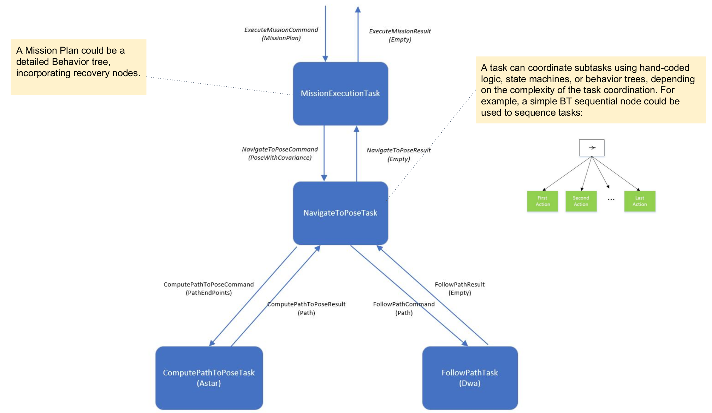
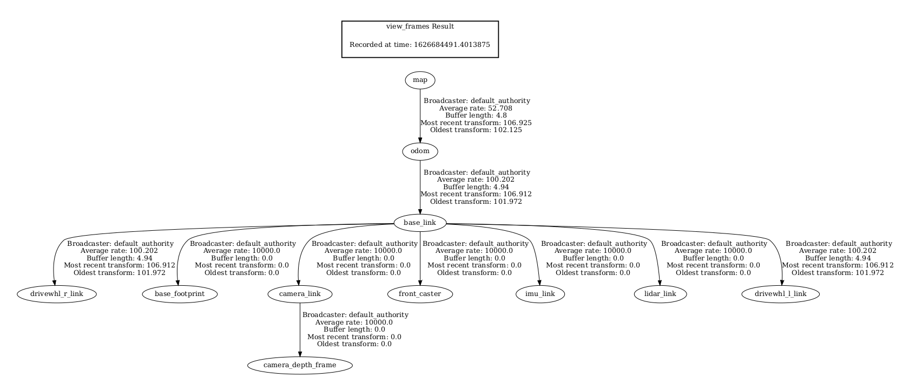
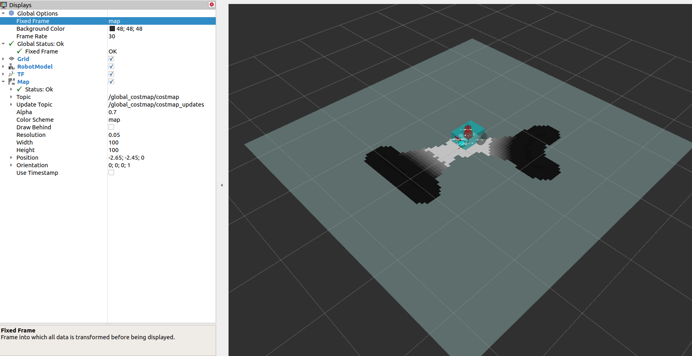

# 第14章 PPT：AMCL 定位

> 共 17 页，标注页码 · 图号与教学文档对应

- **课程：** ROS2 Python 编程
- **章节：** 第14章
- **课时：** 2 课时（90 分钟）
- **教学方式：** 讲授 + 演示

## P1 标题页

<!-- 旁白：本章从"我在哪里"这一导航基本问题出发，讲解自适应蒙特卡洛定位 AMCL。我们先建立粒子滤波定位的完整框架，再深入 KLD 自适应采样与重采样策略，最后落到 Nav2 中的参数配置、质量监控和常见故障处理。 -->

---

## P2 学习目标

- **理解** 自适应蒙特卡洛定位（AMCL）的原理与算法流程
- **掌握** 粒子滤波定位的核心技术：运动模型、观测模型、重采样
- **熟悉** KLD 自适应采样和 alpha_slow/alpha_fast 绑架检测机制
- **能够** 在 ROS2/Nav2 中配置并使用 AMCL 进行机器人定位
- **掌握** AMCL 参数调优方法与定位质量自动监控手段
- **了解** 多传感器融合定位与失败自动恢复的工程实践

<!-- 旁白：学习目标共六条，覆盖原理、实现与工程调优三个层面。AMCL 是移动机器人定位的事实标准，也是后续自主导航的地基，请大家带着"粒子怎么动、怎么称重、怎么筛选"这条主线听课。 -->

---

## P3 定位问题定义

- **要点：** 定位 = 已知地图 + 传感器数据 → 估计位姿；分全局定位、位置追踪、绑架问题三类。

**定位问题的数学形式：**

```
p(x_t | z_{1:t}, u_{1:t-1}, m)
```

其中 `x_t` 是 t 时刻位姿，`z_{1:t}` 是所有观测，`u_{1:t-1}` 是所有控制输入，`m` 是已知环境地图。

| 类型 | 初始位姿 | 典型场景 |
| --- | --- | --- |
| 全局定位 | 完全未知 | 开机自定位 |
| 位置追踪 | 近似已知 | 正常巡航跟踪 |
| 绑架问题 | 被意外移动 | 被人为搬动机器人 |

<!-- 旁白：定位回答的是导航三大问题中的"我在哪里"。注意三种类别的差别：全局定位要在整张地图上撒粒子，绑架问题则要求系统有能力察觉定位失效并重新定位，这为后面 alpha 机制埋下伏笔。 -->

---

## P4 蒙特卡洛定位（MCL）

- **要点：** 用一组加权粒子表示位姿后验；权重刻画粒子位姿与观测的匹配程度。

**MCL 核心思想：**

- 每个粒子是一个位姿假设 (x, y, θ)，权重初始为 `1/N`
- 全局初始化：粒子均匀撒在地图自由空间（`map_data == 0` 的栅格）
- 预测步：速度运动模型 + 高斯噪声推进每个粒子
- 更新步：按观测似然乘性更新权重，随后归一化

```python
for particle in self.particles:
    theta = particle.pose[2]
    particle.pose[0] += (v * np.cos(theta) * dt +
                         np.random.normal(0, noise[0]))
    particle.pose[1] += (v * np.sin(theta) * dt +
                         np.random.normal(0, noise[1]))
    particle.pose[2] += (omega * dt + np.random.normal(0, noise[2]))
```

<!-- 旁白：MCL 的精髓是"用样本代替概率分布"。粒子越密的位置越可能是真实位姿，权重更新让与激光观测吻合的粒子存活。似然计算依赖距离场地图，即每个栅格到最近障碍物的距离。 -->

---

## P5 AMCL 的两大改进

- **要点：** KLD 自适应采样动态调整粒子数；alpha_slow/alpha_fast 双指数平均检测绑架并注入随机粒子。

**1. KLD 自适应采样：** 根据粒子分布的熵动态调整粒子数量，收敛时自动减少粒子。

**2. 重采样策略改进：** 结合权重慢速/快速指数平均：

- `alpha_slow`/`alpha_fast` 分别是权重慢速/快速平均的衰减率（ROS Wiki amcl 页面的原始定义，Nav2 沿用）
- 当快速平均 **低于** 慢速平均 → 观测似然整体骤降（被绑架或重定位失败）→ 按两者比值插入随机粒子

`laser_max_beams`：把一次扫描均匀降采样为固定束数参与似然计算，180～360 是常用区间。

<!-- 旁白：AMCL 相对标准 MCL 的"自适应"二字就体现在这两处。alpha 机制是概率层面的绑架检测：平时快速平均紧跟观测，一旦持续低于慢速平均，说明观测与预测系统性不符，系统按比值自动补充随机粒子。 -->

---

## P6 运动模型与观测模型

- **要点：** 运动模型两种（速度/里程计），观测模型两种（波束/似然域），按场景组合选用。

| 模型 | 类型 | 特点 |
| --- | --- | --- |
| 速度运动模型 | 运动模型 | 由 (v, ω) 推算位姿增量 + 噪声 |
| 里程计运动模型 | 运动模型 | 直接用里程计相对运动作控制输入 |
| 波束模型 | 观测模型 | 四分量：正确测量（高斯）、意外障碍（指数）、失败（均匀）、随机（均匀） |
| 似然域模型 | 观测模型 | 激光末端点到地图障碍物距离 → 高斯似然，最常用 |

```yaml
laser_model_type: "likelihood_field"   # 或 "beam"
z_hit: 0.95        # 正确测量分量权重
z_rand: 0.05       # 随机测量分量权重
sigma_hit: 0.2     # 测量噪声
```

<!-- 旁白：运动模型回答"粒子怎么动"，观测模型回答"粒子怎么称重"。波束模型物理含义完整但要逐束光线投射；似然域模型查距离场即可，计算便宜、工程上更常用，这也是 Nav2 的默认选择。 -->

---

## P7 低方差重采样

- **要点：** 单遍 O(N) 的系统化重采样，权重大的粒子被多次复制，防止粒子退化。

```python
def low_variance_resampling(particles, num=None):
    weights = np.array([p.weight for p in particles])
    weights /= weights.sum() if weights.sum() > 0 else 1
    new_particles = []
    step = 1.0 / num
    start = np.random.uniform(0, step)     # 随机起点
    cumsum = np.cumsum(weights)
    i = 0
    for _ in range(num):
        while cumsum[i] < start:           # 指针只前进不回退
            i += 1
        p = MCLParticle()
        p.pose = particles[i].pose.copy()
        p.weight = 1.0 / num
        new_particles.append(p)
        start += step
    return new_particles
```

**有效样本数：** `Neff = 1 / Σ(w_i²)`，值越小分布越退化；工程上常以 `Neff < 0.5N` 作为触发重采样的阈值。

<!-- 旁白：低方差重采样像"转盘取点"：起点随机，之后按等步长扫描累积权重，权重大的区段自然被多次命中。相比独立按权重抽取，它引入的方差更小，粒子多样性保留更好。 -->

---

## P8 KLD 自适应采样

- **要点：** 所需粒子数只与粒子分布覆盖的"有效栅格数 k"相关，收敛后 k 急剧缩小，可安全降粒子数。

**KLD 采样公式：**

```
n = (k-1) / (2·ε) · z²_{1-δ}
```

| 符号 | 含义 | 示例取值 |
| --- | --- | --- |
| k | 粒子分布覆盖的位姿栅格数 | bin 尺寸 (0.2, 0.2, 0.1) m/rad |
| ε | 近似误差阈值 | 0.05（`kld_epsilon`） |
| z_{1-δ} | 正态分布 1-δ 分位数 | 2.57（δ=0.01） |
| n | 所需粒子数 | clamp 到 [min, max] |

**实验佐证（Fox 等 KLD-Sampling 论文）：** 约 1000 ㎡ 办公楼中，KLD 采样把平均粒子数从数千降到数百而保持同等精度。**复现建议：** 开阔大厅与狭窄走廊各录一段 bag，观察 `/particlecloud` 数量动态变化——开阔处粒子应明显变少。

<!-- 旁白：KLD 把"需要多少粒子"变成信息论问题：分布越集中、覆盖的栅格越少，所需的样本就越少。这正是自适应的含义——发散时多撒、收敛时精简，在精度与算力间自动权衡。 -->

---

## P9 Nav2 中的 AMCL

- **要点：** ROS2 中 AMCL 是 Nav2 框架的一部分，由 `localization_launch.py` 启动，是生命周期受管节点。

```bash
# 启动 AMCL 定位
ros2 launch nav2_bringup localization_launch.py \
  map:=./maps/my_map.yaml \
  params_file:=./config/nav2_params.yaml \
  use_sim_time:=true
```



图 14-1 Nav2 导航系统任务图（来源：navigation2 官方仓库）

<!-- 旁白：看这张官方系统任务图，定位位于感知与规划之间：地图服务器提供地图，AMCL 消费激光与里程计，输出 map→odom 变换供上游使用。命令行启动时注意三件事——地图文件、参数文件和仿真时钟开关。 -->

---

## P10 AMCL 参数配置

- **要点：** docs.ros.org 把 nav2_amcl 参数分为通用、粒子滤波、激光模型、运动模型四组。

```yaml
amcl:
  ros__parameters:
    max_particles: 2000
    min_particles: 500
    update_min_a: 0.2       # 最小旋转更新(rad)
    update_min_d: 0.1       # 最小平移更新(m)
    laser_model_type: "likelihood_field"
    laser_max_beams: 180
    resample_interval: 1
    alpha_slow: 0.001
    alpha_fast: 0.1
    kld_epsilon: 0.05
    kld_delta: 0.01
    base_frame_id: "base_link"
    global_frame_id: "map"
    odom_frame_id: "odom"
    set_initial_pose: true
```

**关键语义：** `update_min_d`/`update_min_a` 决定"多久执行一次滤波更新"——过大使快速转弯时更新不及时，过小浪费算力。`odom_model_type` 可选 `diff`、`omni`、`diff_c`、`omni_c`。

<!-- 旁白：背不下全部参数没关系，记住四组分类即可按图索骥。更新阈值这组参数最容易调错：机器人转弯快就把 update_min_a 调小，否则滤波跟不上位姿变化，输出会出现明显滞后。 -->

---

## P11 TF 坐标系与生命周期

- **要点：** AMCL 只发布 map→odom 变换；必须在 map_server 之后激活，顺序错误是新手定位失败的常见原因。

- **坐标系三要素：** `base_link`（机器人本体）、`odom`（里程计连续位姿）、`map`（全局一致位姿）
- **AMCL 职责边界：** 只估计 `map`→`odom`；航迹推算质量由里程计决定，定位异常应先排除里程计漂移
- **生命周期顺序：** AMCL 依赖 `/map` 话题，须在 map_server 之后激活

```bash
ros2 lifecycle set /map_server activate
ros2 lifecycle set /amcl activate
```



图 14-2 tf2 view_frames 生成的坐标系树（来源：ROS 2 官方文档）

<!-- 旁白：用 view_frames 工具可以导出当前 TF 树，检查 map、odom、base_link 三层关系是否齐全。牢记 AMCL 的职责边界：它不修正里程计漂移，只在两者之间架一座桥，里程计本身很差时调 AMCL 参数无济于事。 -->

---

## P12 定位质量监控与自动恢复

- **要点：** 监控 /amcl_pose 协方差与 /particlecloud 散布；连续异常时自动重发初始位姿恢复定位。

```bash
ros2 topic echo /amcl_pose --once     # 位姿 + 协方差
ros2 topic echo /particlecloud --once # 粒子云
rviz2  # 添加 ParticleCloud、PoseWithCovariance
```

- **质量评分：** `quality = 1/(1 + trace_xy×10 + spread×5)`，综合协方差与粒子散布
- **健康纪律：** x、y 方差持续增大说明粒子发散，应建立自动告警
- **自动恢复：** 粒子散布连续超阈值（如 >2 m）时，用最后可靠位姿 + 大协方差重发 `/initialpose`，逐步收紧



图 14-3 RViz 中的全局代价地图显示（来源：Nav2 官方文档）

<!-- 旁白：定位好不好不能靠感觉，协方差对角元和粒子散布是两个客观指标。恢复时先给大协方差让粒子重新散开，再逐步收紧，切忌盲目重启节点——那会丢掉所有已积累的定位信息。 -->

---

## P13 多传感器定位与仿真实例

- **要点：** AMCL 可融合双激光与 IMU 航向约束；仓库仿真实例可验证初始位姿对收敛的影响。

**多传感器思路（MultiSensorAMCL）：**

- 主激光 `/scan` + 辅助激光 `/scan_back`（后方盲区）
- IMU 航向观测：`yaw_likelihood = exp(-Δθ²/2σ²)`（σ≈0.05），为粒子提供航向约束
- 里程计 `/odom` 提供运动预测

**仿真结合实例（当前仓库）：**

```bash
ros2 launch navigation_sim_demo_ros2 nav2_demo.launch.py \
  use_gazebo:=true use_rviz:=true \
  initial_pose_x:=0.0 initial_pose_y:=0.0 initial_pose_yaw:=0.0
```

调整 `initial_pose_x/y/yaw` 后重启，在 RViz 观察初始估计对收敛过程的影响；地图为 `Software_Museum.yaml`。

<!-- 旁白：多传感器不是简单堆话题：IMU 提供的航向约束补足了激光朝向漂移的短板。仓库实例请重点观察粒子云从发散到聚拢的过程，粒子云是否收敛应以本地 RViz 和 /amcl_pose 实际输出判断。 -->

---

## P14 常见定位问题与解决方案

- **要点：** 全局定位失败、定位漂移、绑架问题各有对应的参数处方；评估用 tf2_monitor + 协方差。

| 问题 | 现象 | 参数处方 |
| --- | --- | --- |
| 全局定位失败 | 粒子无法锁定真实位姿 | 增大 `initial_pose.covariance_*` 至 1.0；`max_particles: 5000` |
| 定位漂移 | 位姿估计持续偏移 | `laser_model_type: "beam"`、`laser_max_beams: 360`、`sigma_hit: 0.1` |
| 绑架问题 | 被搬动后无法重定位 | `alpha_slow: 0.001`、`alpha_fast: 0.1`，自动注入随机粒子 |

**精度评估工具链：**

```bash
ros2 run tf2_ros tf2_monitor   # TF 延迟与频率
ros2 topic echo /amcl_pose     # 位姿与协方差
```

**重定位纪律：** 先用 RViz2 "2D Pose Estimate" 或大协方差 `/initialpose` 试探收敛，再逐步收紧。

<!-- 旁白：这三张处方对应三种典型故障，调参前先分清症状。特别强调重定位纪律：先散后收，一次到位的大协方差试探比反复重启节点科学得多，这也是官方文档推荐的做法。 -->

---

## P15 本章要点

- AMCL 用加权粒子集表示位姿后验：预测（运动模型）、更新（观测似然）、重采样三步循环
- 相对标准 MCL 的两大改进：KLD 自适应采样 + alpha_slow/alpha_fast 绑架检测
- 波束模型四分量物理含义完整；似然域模型查距离场，计算便宜，是 Nav2 默认
- KLD 公式 n=(k-1)/(2ε)·z²_{1-δ}：粒子数只随覆盖栅格数 k 变化，收敛即精简
- 低方差重采样 O(N) 单遍完成，Neff=1/Σw² 是退化程度的度量
- AMCL 只发布 map→odom 变换，须在 map_server 之后激活；`update_min_d/a` 决定滤波更新频率
- 定位健康监控以协方差与粒子散布为指标，恢复原则是"先散后收，逐步收紧"

<!-- 旁白：本章要点按"原理—算法—工程"三层展开。如果只记三件事，那就是：粒子滤波三步循环、KLD 让粒子数随不确定性伸缩、AMCL 的职责边界是 map 到 odom 这一座桥。 -->

---

## P16 练习题

1. **原理题：** 阐述 KLD 自适应采样的原理，说明为什么粒子收敛时可以减少粒子数、发散时需要增加粒子数。
2. **编程题：** 实现简化版 AMCL：粒子初始化、运动模型预测、似然域权重更新、低方差重采样四个步骤。
3. **分析题：** 比较似然域模型与波束模型的优缺点，说明各适合什么场景。
4. **配置题：** 在已知地图上配置 AMCL，使对称走廊、开阔大厅、狭窄通道三种场景下定位性能最优。
5. **操作题：** AMCL 定位丢失时，如何通过 ROS2 命令行手动重置初始位姿并恢复定位？
6. **设计题：** 为跨楼层物流机器人设计定位方案：地图切换机制、AMCL 参数自适应与定位质量评估（提示：`always_reset_initial_pose: false` 与 `first_map_only: false` 组合适用于多地图切换）。

<!-- 旁白：六道题从理论到部署层层递进：原理题检验概念，编程题动手实现核心循环，配置与操作题贴近真机调试，设计题考察多地图场景的综合权衡。建议至少完成前四题再进入下一章。 -->

---

## P17 下章预告

- **下一章：第15章 Cartographer 图优化 SLAM**
- 从粒子滤波（滤波式）走向图优化：前端扫描匹配 + 后端位姿图优化
- 子图（submap）与节点、约束的图结构；回环检测如何消除累积误差
- Cartographer 与 slam_toolbox 的定位建图模式对比实践
- 对照本章：AMCL 的 map→odom 与 Cartographer 轨迹管理有什么异同

<!-- 旁白：下一章我们进入基于图优化的 Cartographer：它把 SLAM 建成"节点 + 约束"的位姿图，用回环检测纠正累积误差。请带着对比的视角预习：滤波式与图优化式方法各自适合什么场景？ -->
