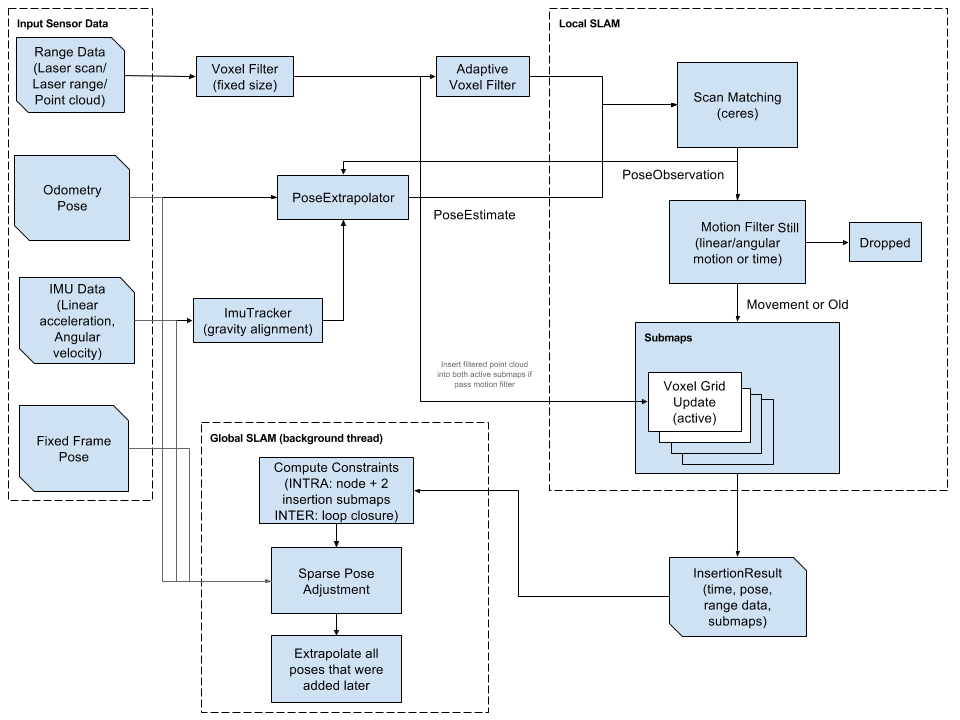
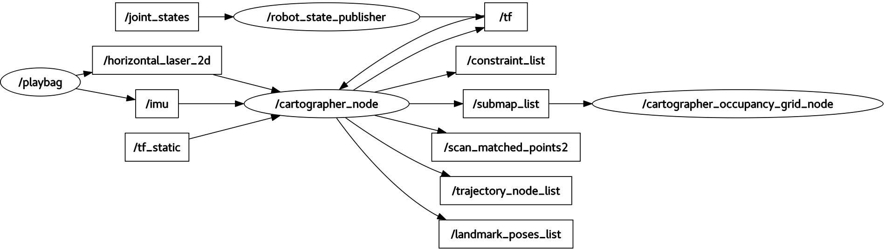
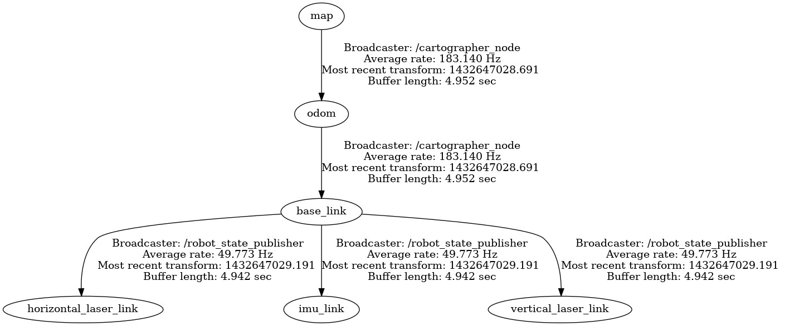
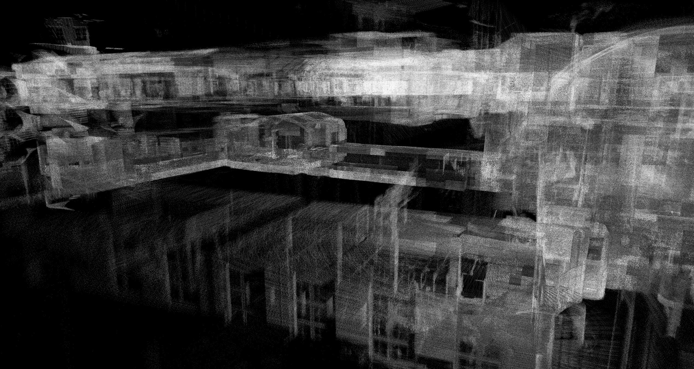

# 第15章 PPT：Cartographer 图优化 SLAM

> 共 17 页，标注页码 · 图号与教学文档对应

- **课程：** ROS2 Python 编程
- **章节：** 第15章
- **课时：** 6 课时（4 理论 + 2 实验）
- **教学方式：** 讲授 + 演示

## P1 标题页

**Cartographer 图优化 SLAM**

从滤波 SLAM 到图优化 SLAM：掌握前端匹配与后端回环优化的完整建图体系

<!-- 旁白：本讲介绍 Google 开源的图优化 SLAM 系统 Cartographer。先回顾滤波 SLAM 的不足，再讲解图优化的数学框架，最后结合 LUA 配置与 ROS2 启动流程掌握完整建图工作流。 -->

---

## P2 学习目标

- 理解图优化 SLAM 的基本原理与数学框架
- 掌握 Cartographer 前后端分离的总体架构与设计思想
- 熟悉局部 SLAM（前端匹配）的算法流程
- 理解全局 SLAM（后端优化）与回环检测机制
- 能在 ROS2 中配置并使用 Cartographer 进行多传感器融合建图
- 掌握 Cartographer 参数调优与常见问题排查方法

<!-- 旁白：学完本章，应能从数学上解释图优化为什么能消除累积误差，能画出 Cartographer 前后端架构图，并独立完成 LUA 配置与 ROS2 建图启动。 -->

---

## P3 从滤波到图优化

- **要点：** 滤波 SLAM 的两大根本缺陷；图优化的核心思想；节点与边的含义

- 传统滤波 SLAM（EKF-SLAM、FastSLAM）的两大问题：
  - **累积误差**：只维护当前状态估计，过去的误差无法修正
  - **线性化误差**：系统线性化只发生在当前估计点，长期误差大
- 图优化 SLAM（Graph-based SLAM）记录所有位姿与约束，构建全局优化问题消除累积误差
- **节点（Vertex）** 为机器人位姿与路标点；**边（Edge）** 为位姿间的约束（里程计、观测、回环）
- 优化目标：最小化所有约束误差的平方和

<!-- 旁白：滤波方法像走一步看一步，走错了回不了头；图优化则把整个轨迹都记下来，通过全局优化把历史误差一次性修正。这就是两者最本质的差别。 -->

---

## P4 图优化的数学形式与稀疏性

- **要点：** 优化目标函数；位姿图误差；Hessian 稀疏性带来的复杂度下降

- 优化目标：X* = argmin Σ e_ij(X)ᵀ · Ω_ij · e_ij(X)
  - X 为全部待优化变量（位姿与路标），e_ij 为约束 ij 的误差向量，Ω_ij 为信息矩阵（协方差逆）
- 位姿图误差：e_ij(x_i, x_j) = t_ij ⊖ (x_i ⊖ x_j)，⊖ 为位姿复合运算的逆
- 每个约束只关联少量节点，Hessian 矩阵大部分为 0，可用稀疏求解器高效求解
- 计算复杂度从 O(n³) 降到接近 O(n)

<!-- 旁白：误差向量被信息矩阵加权，置信度越高的约束在优化中权重越大。Hessian 矩阵的稀疏性让大规模位姿图优化变得可行，这是图优化能实时运行的关键。 -->

---

## P5 图优化 vs 滤波方法

- **要点：** 从状态维护、历史修正、回环检测等维度对比两类方法

| 特性 | 图优化 (GraphSLAM) | 滤波 (EKF-SLAM) |
|------|-------------------|-----------------|
| 状态维护 | 全部位姿 + 地图 | 当前位姿 + 地图 |
| 历史修正 | 可修正全部历史 | 不可修正 |
| 回环检测 | 自然支持 | 需要额外处理 |
| 实时性 | 批量优化 | 在线实时 |
| 精度 | 高（全局优化） | 中（线性化误差） |
| 适用场景 | 大规模、有回环 | 小规模、低噪声 |

<!-- 旁白：图优化以稍高的计算成本换来全局一致的轨迹与地图。EKF 方法实时性好但精度受限，适合小规模低噪声场景；大规模场景特别是存在回环时必须选择图优化。 -->

---

## P6 Cartographer 总体架构

- **要点：** 前后端分离；传感器数据流；2D/3D 建图支持

- Cartographer 是 Google 开源、基于图优化的 SLAM 系统，支持 2D 与 3D 建图
- **前端 Local SLAM**：体素滤波、扫描匹配、子图插入，构建局部一致的子图
- **后端 Global SLAM**：回环检测（分支定界加速）、Ceres 图优化，修正全局位姿与地图
- 传感器输入：激光（LaserScan）、IMU、里程计（Odometry）；子图（Submaps）作为前后端的交接

> 图 15-1 Cartographer 总体架构：前端 Local SLAM 与后端 Global SLAM 协作

<!-- 旁白：Cartographer 把建图拆成两个层次：前端实时为每帧激光找到与当前子图最匹配的位姿，后端则利用回环修正所有历史位姿。子图就是两个层次之间的接口。 -->

---

## P7 核心概念：Submap、Node、Constraint

- **要点：** 三个核心概念的定义与相互关系

- **Submap（子图）**：连续多帧激光构成的局部栅格地图，内部通过前端匹配保持局部一致性
- **Node（节点）**：向子图插入关键帧时创建的位姿，包含位姿估计、时间戳与相关传感器数据
- **Constraint（约束）**：
  - 帧间约束：同一子图内相邻帧的匹配
  - 子图间约束：不同子图之间的匹配（回环）
- 每个约束包含相对变换与信息矩阵

<!-- 旁白：子图是有界的局部地图，节点记录位姿历史，约束把两者连成一张图。帧间约束保证局部平滑，子图间约束负责把漂移拉回来，共同构成优化问题的输入。 -->

---

## P8 Local SLAM 前端流程

- **要点：** 前端五步流水线；Ceres 扫描匹配的目标函数

- 前端流程：体素滤波 → 位姿外推 → 扫描匹配 → 运动滤波 → 子图插入
- **体素滤波**：降低点云密度、去除离群点，采用自适应体素大小
- **位姿外推器**：基于匀速模型预测初始位姿，融合 IMU 数据
- **扫描匹配**：Ceres 优化 argmin Σ (1 - M(T·p_i))²，M 为子图的连续双线性插值
- **运动滤波器**：按时间 / 位移 / 角度阈值筛选关键帧，避免冗余插入

<!-- 旁白：扫描匹配的目标是让激光点在子图上的占据概率尽量接近 1。运动滤波只保留位姿变化足够大的帧，既控制子图规模，也避免重复计算。 -->

---

## P9 全局 SLAM 与回环检测

- **要点：** 回环检测流程；分支定界加速；约束添加与全局优化

- 子图完成后进入后端优化队列；对每个新节点在所有已完成子图中搜索匹配
- **分支定界法（Branch and Bound）** 加速搜索：粗分辨率搜索最优候选，再细分辨率精搜
- 匹配得分超过阈值（min_score）时添加回环约束到图，随后执行全局图优化
- 回环约束让轨迹首尾相连，修正长距离建图的累积漂移

> 图 15-2 位姿图可视化：节点与子图之间的约束关系

<!-- 旁白：回环检测是消除累积误差的关键。当前节点与历史子图匹配得分足够高，就说明机器人回到了曾经到过的地方，这条约束会把整段轨迹拉回正确位置。 -->

---

## P10 Ceres 优化与全局优化效果

- **要点：** Ceres Solver 的角色；优化前漂移与优化后回环闭合的对比

- Cartographer 使用 Google 的 **Ceres Solver** 做非线性最小二乘优化
- 残差构造：residual = 1 - occupancy，占据概率由地图双线性插值获得
- 优化前：误差积累导致轨迹漂移、地图错位；优化后：回环闭合，所有约束均衡分布
- optimize_every_n_nodes 控制优化触发频率，Huber 核抑制离群约束的影响

<!-- 旁白：全局优化把里程计、激光匹配和回环三类约束一起解算。优化完成后整张地图变得一致：走廊对齐、转角闭合，导航才能依赖这张地图。 -->

---

## P11 LUA 配置结构与前端参数

- **要点：** include 模块化；options 关键项；前端调优顺序

- 配置采用 LUA 脚本，`include "map_builder.lua"` / `"trajectory_builder.lua"` 模块化继承，自定义只需覆盖差异项
- options 定义 map_frame、tracking_frame、use_odometry、num_laser_scans 等全局项
- 调优哲学：**先前端后后端**；子图内部漂移（RViz 中子图弯曲错位）后端无法挽救

| 参数 | 说明 | 调优建议 |
|------|------|---------|
| voxel_filter_size | 体素滤波大小 | 0.05（室内）~0.2（室外）|
| ceres_scan_matcher.translation_weight | 平移匹配权重 | 增大提高平移精度 |
| ceres_scan_matcher.rotation_weight | 旋转匹配权重 | 增大提高旋转精度 |
| min_range / max_range | 激光有效范围 | 按传感器型号设置 |
| use_online_correlative_scan_matching | 在线相关匹配 | 里程计可靠时关闭更稳 |

<!-- 旁白：官方建议先保证前端稳定再调后端。前端先调体素滤波和激光范围，确认是否需要在线相关匹配；后端再看优化耗时与回环阈值。漂移先查前端是社区第一原则。 -->

---

## P12 坐标系配置与 ROS2 集成

- **要点：** 坐标系四件套；provide_odom_frame；launch 集成与话题重映射

- 坐标系配置：map_frame = "map"、tracking_frame = "base_link"、published_frame = "odom"、odom_frame = "odom"
- provide_odom_frame = true 时 Cartographer 发布 odom → base_link，只维护 map → odom
- ROS2 启动：cartographer_node 参数指定 configuration_directory / configuration_basename
- 话题重映射（remapping）：/scan、/odom 映射到机器人实际话题
- cartographer_occupancy_grid_node 以 publish_period_sec、resolution 输出 OccupancyGrid

> 图 15-3 2D 建图坐标系演示：map / odom / base_link 的 TF 关系

<!-- 旁白：Cartographer 自己维护 map 到 odom 的变换，odom 到 base_link 由后端提供或由里程计发布。launch 文件里只需指定配置目录与文件名，再通过重映射把话题接上。 -->

---

## P13 后端参数调优与多传感器融合

- **要点：** POSE_GRAPH 关键参数；多传感器融合开关

- 后端调优关注 POSE_GRAPH：optimize_every_n_nodes、constraint_builder、fast_correlative_scan_matcher
- 多传感器融合：use_imu_data、use_odometry、num_laser_scans = 2 时通过 remapping 映射多雷达话题

| 参数 | 说明 | 调优建议 |
|------|------|---------|
| optimize_every_n_nodes | 优化间隔 | 小值更频繁但计算量大；0 关闭优化 |
| min_score | 回环检测最低得分 | 0.5~0.7，太高会漏检 |
| linear_search_window | 回环线性搜索窗口 (m) | 大范围回环需增大 |
| angular_search_window | 回环角度搜索窗口 (rad) | 旋转不确定时增大 |
| branch_and_bound_depth | 分支定界深度 | 7~12，深度大搜索快 |
| sampling_ratio | 约束采样比例 | 降低可减小 CPU 负载 |

<!-- 旁白：min_score 是回环检测的闸门：太低会引入误匹配，太高会漏掉真实回环。3D 建图依赖 IMU 提供重力方向先验，多楼层可通过多条轨迹在同一个 pbstream 中合并。 -->

---

## P14 建图工作流、纯定位与常见问题

- **要点：** 完整建图五步；纯定位模式；大规模优化与问题排查

- 完整工作流：启动仿真 → 启动 Cartographer 建图 → RViz2 可视化 → teleop 控制探索 → /write_state 保存 pbstream → cartographer_pbstream_to_ros_map 转 pgm/yaml → Nav2 加载地图
- **纯定位模式**：-load_state_filename 加载 pbstream，optimize_every_n_nodes = 0 关闭后端优化
- 大规模环境（>10000m²）：增大体素滤波、降低关键帧频率与优化频率、扩大回环搜索范围
- 常见问题：漂移（激光频率建议 >5Hz、检查 IMU 标定、降低移动速度）；回环未闭合（min_score 降为 0.4、扩大搜索窗口）；CPU 过高（增大体素、降低 sampling_ratio）

> 图 15-4 3D 点云查看器：多传感器融合的点云建图输出

<!-- 旁白：保存的地图是 pbstream 二进制格式，必须先转换成 pgm 和 yaml 才能给 Nav2 使用。录好 bag 后用 cartographer_assets_writer 离线重跑参数，是调参的标准做法。工程选型上：2D 室内优先 slam_toolbox，需要 3D 或多传感器紧耦合时选 Cartographer。 -->

---

## P15 本章要点

- 图优化把 SLAM 建模为节点 - 边图，最小化所有约束误差平方和，解决滤波方法的累积误差与线性化误差
- 目标函数 X* = argmin Σ eᵀΩe；位姿图误差 e = t ⊖ (x_i ⊖ x_j)；稀疏 Hessian 使复杂度接近 O(n)
- Cartographer 前后端分离：Local SLAM 构建子图，Global SLAM 完成回环检测与 Ceres 全局优化
- 前端流程五步：体素滤波 → 位姿外推 → 扫描匹配 → 运动滤波 → 子图插入
- 回环检测用分支定界法加速，min_score 控制回环约束的质量
- LUA 配置模块化 include，调优顺序先前端后后端，"漂移先查前端"
- 建图结果经 /write_state 保存 pbstream，再用 cartographer_pbstream_to_ros_map 转为 pgm/yaml

<!-- 旁白：本章的关键词是子图、节点、约束和分支定界。记住调优顺序先前端后后端，遇到漂移先查前端，这套方法论同样适用于其他图优化建图工具。 -->

---

## P16 练习题

- 阐述图优化 SLAM 的基本原理，说明为何能消除累积误差，并推导 Gauss-Newton 优化的核心公式
- 编程实现简化位姿图优化系统：支持添加节点、里程计约束与回环约束，用 Gauss-Newton 法全局优化
- 分析 Cartographer 前后端分离设计的优势，说明 Local SLAM 与 Global SLAM 的协作机制
- 编写 LUA 配置文件，使 10000m² 仓库环境实现高质量建图（覆盖前端匹配、后端优化与回环检测参数）
- 描述完整建图工作流：从启动仿真、开始建图、控制探索到保存地图并转换为 PGM/YAML 格式
- 设计 3D 建图方案：3D 激光雷达 + IMU + 轮式里程计，包括传感器配置、参数调优、多楼层合并与地图配准

<!-- 旁白：练习题覆盖原理推导、代码实现、配置编写与方案设计四个层次。第 6 题建议参考官方背包示例：IMU 不可省略，多楼层用多条轨迹合并，楼层间不强行加回环约束。 -->

---

## P17 下章预告

**下章：第16章 Nav2 架构与核心组件**

- 本章完成了 SLAM 建图：Cartographer 输出全局一致的地图
- 下一章进入自主导航：Nav2 框架的架构设计与核心组件
- 预告内容：navigation2 栈组成、全局与局部代价地图、规划器与控制器接口、AMCL 与 Nav2 集成
- 建图与定位是导航的基础，地图就绪后即可开始导航系统搭建

<!-- 旁白：地图建好了，下一步就是让机器人在上面走起来。下一章讲解 Nav2 架构，学习代价地图、规划器与控制器如何协同完成自主导航。 -->

---