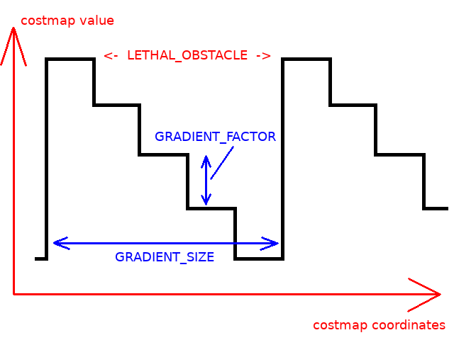
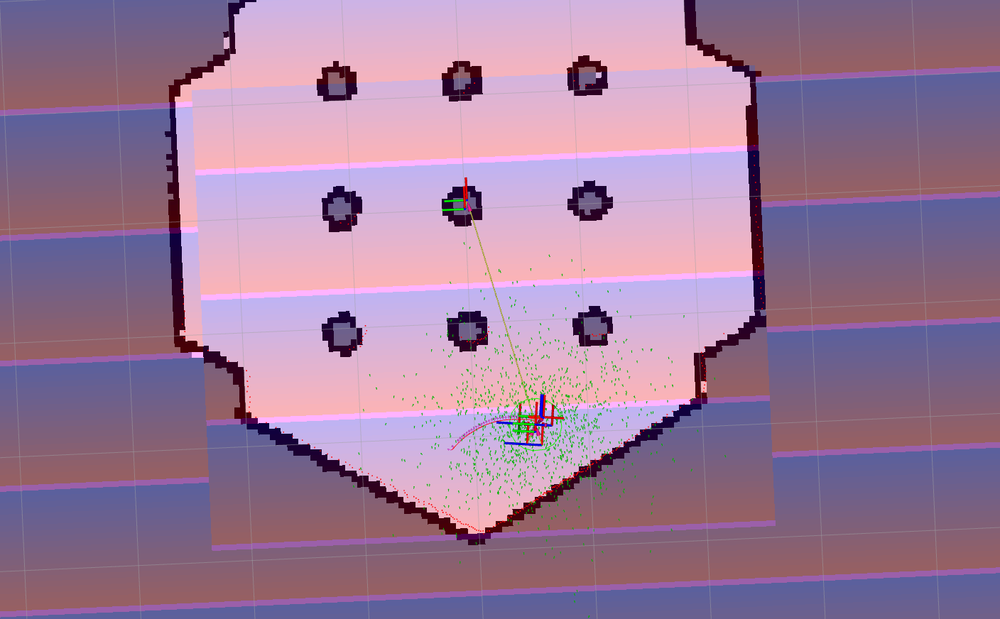
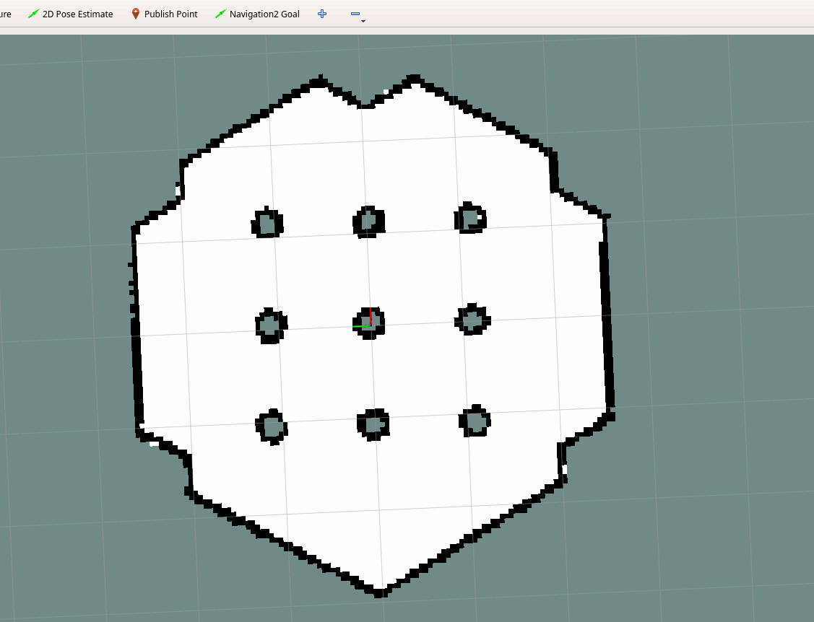

# 第17章 PPT：全局代价地图

> 共 17 页，标注页码 · 图号与教学文档对应

---

## P1 全局代价地图

- 第 17 章 · 全局代价地图（2 课时）
- 从"栅格代价语义"到"多层融合"再到"在线调参"的完整链路：
  - 代价地图是什么：栅格化环境表示，每个栅格一个代价
  - 四层体系：静态层、障碍物层、膨胀层（+ 体素层）如何合成主代价地图
  - 全局 vs 局部：坐标系、范围、更新频率与插件组合
  - 实战调优：分辨率、频率、膨胀半径、滚动窗口与调试手段
- 本章立足 Nav2 官方 Costmap2D 文档，配套 Python 实现辅助理解

<!-- 旁白：各位同学好，上一章我们认识了 Nav2 的整体架构，本章深入其中最基础的数据结构——全局代价地图。课程沿"栅格代价语义、多层融合、在线调参"三条线索推进，内容基于 Nav2 官方 Costmap2D 文档。掌握本章后，大家就能解释路径为什么绕行、为什么穿墙这类常见现象。 -->

---

## P2 学习目标

- 掌握代价值的语义（0/1-127/128-253/254/255）与 Costmap2D 数据结构
- 理解分层架构与全局/局部代价地图的差异
- 掌握静态层、障碍物层、膨胀层的配置方法
- 理解膨胀公式与 cost_scaling_factor 的作用
- 掌握分辨率、更新频率、膨胀半径、滚动窗口的调优原则
- 学会用 CLI 与 RViz 监控、诊断和清除代价地图

<!-- 旁白：本页六项目标从代价值语义与数据结构起步，经分层架构、图层配置、膨胀公式，最后落到参数调优与监控诊断。其中膨胀公式与调优原则是实际调试的高频点，建议每学完一节就对照目标自查掌握程度，收尾时可用第六项的玻璃墙场景做综合检验。 -->

---

## P3 什么是代价地图

- **要点：** 栅格化环境表示；每个栅格一个代价值；为规划器提供障碍物信息

代价地图（Costmap）把环境划分为若干栅格（cell），每个栅格用一个 0-255 的整数表示通行代价，规划器据此寻找安全路径。

- **代价值语义**

| 代价值 | 含义 | 说明 |
|--------|------|------|
| 0 | Free 空闲可通行 | 无障碍区域 |
| 1-127 | Inscribed 内切区 | 机器人中心进入即危险 |
| 128-253 | Obstacle 障碍膨胀区 | 越接近障碍代价越高 |
| 254 | Lethal 致命 | 栅格被障碍物占据 |
| 255 | Unknown 未知 | 尚未观测的区域 |

- 阈值由 `track_unknown_space` 决定是否将未知区域视为障碍
- 代价值越小越安全，规划器优先选择低代价区域

<!-- 旁白：表中五个代价值区间是本章的语言基础：0 表示自由通行，1 到 127 是内切危险区，128 到 253 随接近障碍代价升高，254 为致命栅格，255 表示尚未观测的未知区。规划器优先挑选低代价栅格，因此理解这些语义就等于读懂了规划器的"地图语言"，track_unknown_space 参数决定未知区是否按障碍处理。 -->

---

## P4 Costmap2D 数据结构

- **要点：** 世界坐标与栅格坐标互转；核心是二维 uint8 数组

C++ 类 `nav2_costmap_2d::Costmap2D` / Python 版维护一张 `height×width` 的 `uint8` 数组，配合分辨率与原点完成坐标映射。

```
世界坐标 (x, y)  ──world_to_grid──▶  栅格坐标 (gx, gy)  ──索引──▶  代价值 cost
                       │                                        ▲
                       │  grid_to_world                         │ set_cost
                       ▼                                        │
                  恢复世界坐标 ◀────────────── 更新栅格代价 ◀─────┘
```

- **核心成员：** `resolution`（m/像素）、`width`、`height`、`origin`（地图原点）、`costmap`（uint8 数组）
- **核心方法：** `world_to_grid(x, y)` 取整转换；`grid_to_world(gx, gy)` 还原世界坐标；`set_cost/get_cost`
- Python 中常用 numpy 数组承载，未知区域默认填 255，`to_occupancy_grid()` 输出 OccupancyGrid 消息

<!-- 旁白：这张数据流图说明代价地图的本质是一张二维 uint8 数组：world_to_grid 把世界坐标换算成栅格索引，get_cost 读取代价，set_cost 更新后再经 grid_to_world 还原世界坐标。分辨率与原点是坐标映射的两个关键成员，Python 版常用 numpy 承载数组并通过 to_occupancy_grid 输出消息。 -->

---

## P5 官方代价语义与未知空间

- **要点：** Lethal=100 / Inscribed=99 / No Information=255；Track Unknown 模式可选

Nav2 官方文档的代价阈值定义（OccupancyGrid 模式）：

- `LETHAL_OBSTACLE=254`：占据栅格，路径不可通过
- `INSCRIBED_INFLATED_OBSTACLE=253`：内切圆半径之内"必然碰撞"的一档
- `NO_INFORMATION=255`：未知区，等价于"最大代价 + 1"
- `FREE_SPACE=0`：完全空闲；`INSCRIBED=128` 附近为内切半径边界参考
- `track_unknown_space: true` 时未知区按 255 参与规划（默认按 Free 处理）



图 17-w1：代价梯度示意——从障碍物向外代价逐渐衰减（来源：docs.nav2.org）

<!-- 旁白：图中从障碍物向外的颜色渐变直观展示了代价梯度的衰减过程，越靠近障碍颜色越深、代价越高。注意 Nav2 官方把 254 定为致命、253 为内切必然碰撞档、255 为未知，与直觉略有差别；track_unknown_space 开启后未知区按 255 参与规划，关闭则按空闲处理，这一开关在演示和排查时经常用到。 -->

---

## P6 代价地图分层架构

- **要点：** 多图层各自维护、取最大值融合；膨胀层必须放最后

Nav2 把代价地图组织为可插拔层（plugin），各层独立更新，主代价地图（Master Costmap）逐栅格取各层最大值完成融合：

```
        静态地图 /map ──▶  StaticLayer   ─┐
        激光/点云 /scan ─▶ ObstacleLayer ─┤ 取最大值    ┌─────────────┐
        体素观测       ─▶ VoxelLayer   ─┤ 融合 ───▶ │ 主代价地图 ──▶ 规划器 │
        禁止区域       ─▶ KeepoutLayer ─┘ (Master)  └─────────────┘
        以上结果统一 ──▶ InflationLayer（必须最后执行）
```

| 图层 | 插件 | 数据来源 | 更新方式 |
|------|------|----------|----------|
| 静态层 | StaticLayer | map_server 加载 YAML/PGM | 地图加载 |
| 障碍物层 | ObstacleLayer | LaserScan/PointCloud2 | 实时更新 |
| 体素层 | VoxelLayer | 3D 点云 | 实时更新 |
| 膨胀层 | InflationLayer | 合成结果 | 障碍更新后 |
| 范围层 | RangeLayer | 距离传感器 | 实时更新 |
| 禁飞层 | KeepoutLayer | 禁止进入区域 | 配置加载 |

<!-- 旁白：图中各图层把不同来源的数据各自加工，主代价地图逐栅格取最大值完成融合，因此任何一层报出的高风险都会生效。表格列出六种图层插件的数据来源与更新方式，需要特别注意的是膨胀层必须放在最后执行，否则后续图层新出现的障碍将得不到膨胀保护。 -->

---

## P7 全局代价地图 vs 局部代价地图

- **要点：** 一个管全局规划、一个管实时避障；坐标系与频率不同

| 特性 | 全局代价地图 | 局部代价地图 |
|------|--------------|--------------|
| 坐标系 | map | odom |
| 范围 | 整个已知地图 | 机器人周围滚动窗口 |
| 更新频率 | 低（1-2 Hz） | 高（5-10 Hz） |
| 分辨率 | 较高（0.05 m） | 较高（0.05 m） |
| 用途 | 全局路径规划 | 局部路径规划与避障 |
| 图层配置 | static + obstacle + inflation | obstacle/voxel + inflation（无 static） |

- 全局代价地图承载静态环境信息，负责"宏观找路"
- 局部代价地图跟踪传感器实时观测，负责"微观避障"
- 两者由规划器配合：全局路径给参考，局部路径贴地执行

<!-- 旁白：本表对比了两种代价地图：全局图挂在 map 坐标系、覆盖整张已知地图、约 1 到 2 Hz 低频更新，承担宏观找路；局部图挂在 odom 坐标系、以滚动窗口跟随机器人、5 到 10 Hz 高频刷新，承担实时避障。图层配置上全局含静态层而局部不含，两者由规划器配合完成"参考路径加贴地执行"。 -->

---

## P8 代价地图 YAML 配置

- **要点：** 全局低频 + 静态层；局部高频 + 滚动窗口

```yaml
# global_costmap 配置
global_costmap:
  global_costmap:
    ros__parameters:
      update_frequency: 1.0            # 低频更新
      publish_frequency: 1.0
      global_frame: map                # 全局坐标系
      robot_base_frame: base_link
      robot_radius: 0.22
      resolution: 0.05
      track_unknown_space: true
      plugins: ["static_layer", "obstacle_layer", "inflation_layer"]
      inflation_layer:
        plugin: "nav2_costmap_2d::InflationLayer"
        cost_scaling_factor: 3.0
        inflation_radius: 0.55

# local_costmap 配置
local_costmap:
  local_costmap:
    ros__parameters:
      update_frequency: 5.0            # 高频更新
      publish_frequency: 2.0
      global_frame: odom               # 里程计坐标系
      robot_base_frame: base_link
      rolling_window: true             # 滚动窗口模式
      width: 4                         # 窗口大小 (m)
      height: 4
      plugins: ["voxel_layer", "inflation_layer"]
```

- 图层顺序即 plugins 列表顺序；静态层在前、膨胀层最后

<!-- 旁白：这段 YAML 集中体现了两图的差异：全局侧低频更新、global_frame 为 map、插件含静态层；局部侧 5 Hz 高频、global_frame 为 odom、开启 rolling_window 并给定 4 米窗口。plugins 列表的顺序就是各图层执行顺序，静态层在前、膨胀层收尾，inflation_radius 与 cost_scaling_factor 也在这里一并设置。 -->

---

## P9 层插件体系与滚动窗口

- **要点：** 图层可插拔、可自定义；rolling_window 决定局部窗口物理尺寸

- 官方把地图组织为可插拔层：`static_layer` 加载 pgm/yaml；`obstacle_layer` 消费 LaserScan/PointCloud，支持 Raytracing（空区标记为可通行）与 Observation Buffer 两套缓存机制；`voxel_layer` 维护 3D 体素，处理桌子下沿等悬空障碍；`inflation_layer` 必须放最后统一膨胀
- 官方建议组合：全局 = 静态层 + 障碍层 + 膨胀层；局部 = 障碍层/体素层 + 膨胀层 + `rolling_window: true`
- `width`/`height`/`resolution` 决定局部窗口物理尺寸（典型 3m×3m、0.05m）；`update_frequency` 建议不低于控制器频率的一半



图 17-w2：自定义代价层插件运行效果（来源：docs.nav2.org）



图 17-w3：同名插件的导航演示动图（来源：docs.nav2.org）

<!-- 旁白：两张图分别展示自定义梯度图层插件在 RViz 中的静态效果与导航运行动态，运行画面里机器人始终沿着低代价梯度前进。文字部分回顾了四种官方图层的职责与推荐组合，滚动窗口的物理尺寸由 width、height 与 resolution 共同决定，update_frequency 建议不低于控制器频率的一半。 -->

---

## P10 静态层配置

- **要点：** 负责加载预构建栅格地图；输入 /map 或 YAML/PGM

**工作流程：**

```
1. 订阅 /map 话题（或 map_server 加载）
2. 将地图数据转换为 costmap 格式
3. 标记已知区域为对应代价
4. 标记未知区域为 255
5. 持续监听地图更新
```

**地图文件格式（office_map.yaml）：**

```yaml
image: office_map.pgm          # 地图图像文件
resolution: 0.05               # m/像素
origin: [-10.0, -10.0, 0.0]    # 原点 (x, y, yaw)
negate: 0                      # 是否反转像素值
occupied_thresh: 0.65          # 大于此值视为障碍物
free_thresh: 0.196             # 小于此值视为空闲
```

- 订阅时推荐 `map_subscribe_transient_local: true`（QoS transient_local）保证上线即能收到最新地图

<!-- 旁白：静态层的流程是订阅或加载地图、转换为代价格式、标记已知与未知区域并持续监听更新。地图 YAML 里 origin 给出左下角的世界坐标，occupied_thresh 与 free_thresh 划分占据与空闲像素，negate 控制是否反转灰度；订阅时建议使用 transient_local QoS，保证后上线的节点也能立即收到最新地图。 -->

---

## P11 障碍物层配置

- **要点：** 实时感知动态障碍；marking 标记 / clearing 清除配合

**工作流程：**

```
1. 订阅传感器话题 (LaserScan/PointCloud2)
2. 将传感器数据转换到地图坐标系
3. 标记传感器命中点 (marking) —— 置为 254 lethal
4. 清除传感器与障碍之间的路径 (clearing) —— Raytracing 置 0
5. 障碍物标记为 254 (lethal)
```

**多传感器源配置（observation_sources 逗号分隔）：**

```yaml
obstacle_layer:
  plugin: "nav2_costmap_2d::ObstacleLayer"
  observation_sources: "scan front_sonar rear_sonar"
  scan:
    topic: /scan
    data_type: "LaserScan"
    max_obstacle_height: 2.0   # 只标记该高度以下障碍
    clearing: true
    marking: true
    raytrace_max_range: 3.0
  front_sonar:
    topic: /sonar/front
    data_type: "Range"         # 超声等距离传感器
    min_range: 0.1
    max_range: 2.0
```

- 激光扫不到的玻璃墙，可用超声/毫米波作为第二个 observation source 补齐（17.7.5）

<!-- 旁白：障碍物层的核心是 marking 与 clearing 的配合：命中点标记为 254 致命，同时用射线追踪把传感器与障碍之间的区域清成可通行，二者缺一都会造成幻影障碍。示例配置演示了激光与超声两种观测源共存，max_obstacle_height 过滤高空点，激光扫不到的玻璃墙正是靠追加超声观测源来补齐的。 -->

---

## P12 膨胀层配置

- **要点：** 障碍周围生成代价梯度；公式呈指数衰减

**膨胀公式：**

```
if distance < inscribed_radius:
    cost = 254 (lethal)
elif distance < inflation_radius:
    cost = exp(-cost_scaling_factor * (distance - inscribed_radius)) * 253
else:
    cost = 0
```

**参数说明：**

| 参数 | 默认参考值 | 作用与调法 |
|------|-----------|------------|
| inflation_radius | 0.55 m | 影响范围；越大越安全但易绕路，越小越贴障碍 |
| cost_scaling_factor | 3.0 | 衰减速度；越大衰减越快，近处高代价远处无影响 |
| inscribed_radius | 由 footprint 推导 | 内切半径内一律 254（必然碰撞） |

- Python 实现可"预计算膨胀核（inflation kernel）"，对每个 lethal 栅格滑窗、逐栅格取最大值完成膨胀
- 膨胀层放在 plugins 列表最后，对合成结果统一膨胀

<!-- 旁白：这段伪代码就是膨胀公式：内切半径内一律 254，内切与膨胀半径之间按指数规律衰减，其余为 0。参数表中 inflation_radius 决定影响范围，cost_scaling_factor 控制衰减快慢——调大它梯度更陡、近处代价高而远处无影响。工程上可预计算膨胀核滑窗实现，注意膨胀层必须放在插件列表最后执行。 -->

---

## P13 代价地图参数调优

- **要点：** 分辨率/频率/膨胀半径/滚动窗口四组参数按场景权衡

**分辨率与更新频率：**

| 场景 | 推荐分辨率 | 全局 update_frequency | 局部 update_frequency |
|------|-----------|----------------------|----------------------|
| 室内小场景（50-500 m²） | 0.05 m | 1.0 Hz | 5.0 Hz |
| 中型环境（500-2000 m²） | 0.05 m | 1.0 Hz | 5.0 Hz |
| 大型环境（>2000 m²） | 0.1 m | 0.5-1.0 Hz | 2-5 Hz |

**膨胀半径推荐（× 机器人半径）：**

| 环境类型 | 乘数 | 思路 |
|----------|------|------|
| 狭窄走廊 | 1.5 | 尽量贴近障碍通过 |
| 仓库 | 2.0 | 标准安全距离 |
| 办公室 | 2.5 | 兼顾安全与通过性 |
| 开阔空间 | 3.0 | 保持安全距离 |

**滚动窗口（局部）：** 差速 3×3 m；阿克曼 5×5 m；高速机器人 8×8 m

<!-- 旁白：两张表给出量化经验：分辨率在中小场景保持 0.05 米，大型环境可放宽到 0.1 米并适当降低频率；膨胀半径按机器人半径乘 1.5 到 3 倍选取，狭窄走廊取小值保证通过性，开阔空间取大值保持安全距离。滚动窗口尺寸按底盘类型从差速 3 米到高速机器人 8 米递增，这些数值建议直接作为工程默认值记忆。 -->

---

## P14 实战与调试

- **要点：** CLI 监控 + RViz 直方图 + clear 服务；先查 TF 再谈调参

```bash
# 查看与统计代价地图
ros2 topic echo /global_costmap/costmap --once
ros2 topic hz /local_costmap/costmap
# 清除代价地图
ros2 service call /global_costmap/clear_entirely nav2_msgs/srv/ClearEntireCostmap "{}"
# RViz 可视化：添加 Map → Topic: /global_costmap/costmap
rviz2
```

**常见问题与解决：**

| 问题 | 常见原因 | 解决思路 |
|------|----------|----------|
| 代价地图未更新 | 传感器话题未发布 / TF 错误 / 生命周期未激活 | 先查 TF 链与节点状态 |
| 路径穿过障碍 | 膨胀半径过小、衰减过快 | 调大 inflation_radius、调小 factor |
| 性能下降 | 地图过大或更新过频 | 降低分辨率（0.05→0.1）、调低频率 |

- 调参纪律：先保证 TF 正确；用 RViz 逐层关闭插件定位问题层；监控 `map_update_loop` 耗时，优先降体素分辨率而非单纯降频率
- 玻璃墙问题：costmap 只信传感器与静态地图——补充超声/毫米波观测源，或在静态地图中标注 lethal

<!-- 旁白：调试命令分三层：topic echo 与 hz 查看数据是否更新及更新频率，clear_entirely 服务一键清除残留代价，RViz 中把 Map 显示绑定到 costmap 话题可直观看梯度分布。排查表提醒先查 TF 与生命周期状态再谈调参；性能不足时优先降低体素分辨率而非盲目降频，玻璃墙问题则要补充观测源解决。 -->

---

## P15 本章要点

- 代价值语义：0 空闲、1-127 内切、128-253 膨胀、254 致命、255 未知
- 代价地图分层：静态层、障碍物层（+体素层）、膨胀层取最大值融合
- 全局（map、1Hz、static 组合）vs 局部（odom、5Hz、滚动窗口）
- 膨胀公式：距离越近代价指数上升，254 为必然碰撞区
- 调优四参数：分辨率、更新频率、膨胀半径、滚动窗口
- 调参纪律：先 TF、再逐层、后性能预算
- 调试三板斧：topic echo/hz、RViz 直方图、clear 服务

<!-- 旁白：七条要点按数据流记忆最顺：先记住五段代价语义，再理解各层取最大值融合成主图，然后区分全局与局部两张图在坐标系、频率与插件组合上的差异，最后落到膨胀公式与四组调优参数。"先 TF、再逐层、后性能预算"的调试纪律是排障顺序的保证，务必熟记并优先执行。 -->

---

## P16 练习题

1. **原理题：** 解释代价值 0、1-127、128-253、254、255 的含义，写出膨胀层代价计算公式。
2. **配置题：** 为半径 0.3 m 的差速机器人配置全局（0.05 m、膨胀 0.6 m）与局部（3 m 滚动窗口、5 Hz）代价地图。
3. **编程题：** 实现一个简单膨胀层，给定障碍位置与膨胀半径计算各栅格代价值。
4. **分析题：** 比较全局与局部代价地图在坐标系、更新频率、大小、插件配置上的差异及配合机制。
5. **操作题：** 用命令行查看当前代价地图状态，分析代价分布，识别潜在导航问题。
6. **设计题：** 为玻璃墙展览馆设计代价地图方案：标记玻璃墙、配置传感器融合与膨胀参数。

<!-- 旁白：六道题覆盖面很全：原理题默写代价语义与膨胀公式，配置题给定量条件练习参数设计，编程题动手实现简化膨胀层，分析题比较两张代价地图，操作题练 CLI 诊断，设计题以玻璃墙展馆综合考察传感器融合方案。建议按此顺序完成，前两题是后四题的必备基础。 -->

---

## P17 下章预告

- 下一章：第 18 章 全局路径规划
- 内容预告：
  - 图搜索算法：A* 与 Dijkstra 的原理与差异
  - Nav2 的 NavFn、Theta*、Smac 等全局规划器
  - 全局路径如何消费棋盘格图与多重尺度代价
  - 规划器 Server 的参数配置与路径输出

<!-- 旁白：本章解决了"代价从哪里来"的问题，下一章回答"有了代价怎么找路"：第十八章讲解 A* 与 Dijkstra 的图搜索原理，介绍 NavFn、Theta* 与 Smac 系列全局规划器的特点与选型，并讨论路径平滑。预习时请回顾本章的全局代价地图结构，规划器消费的正是它的输出。 -->