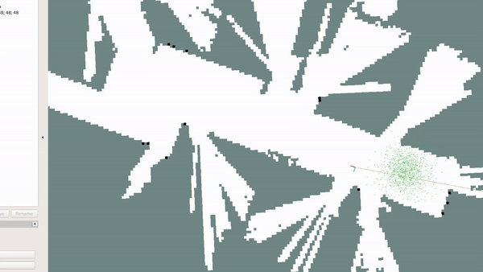
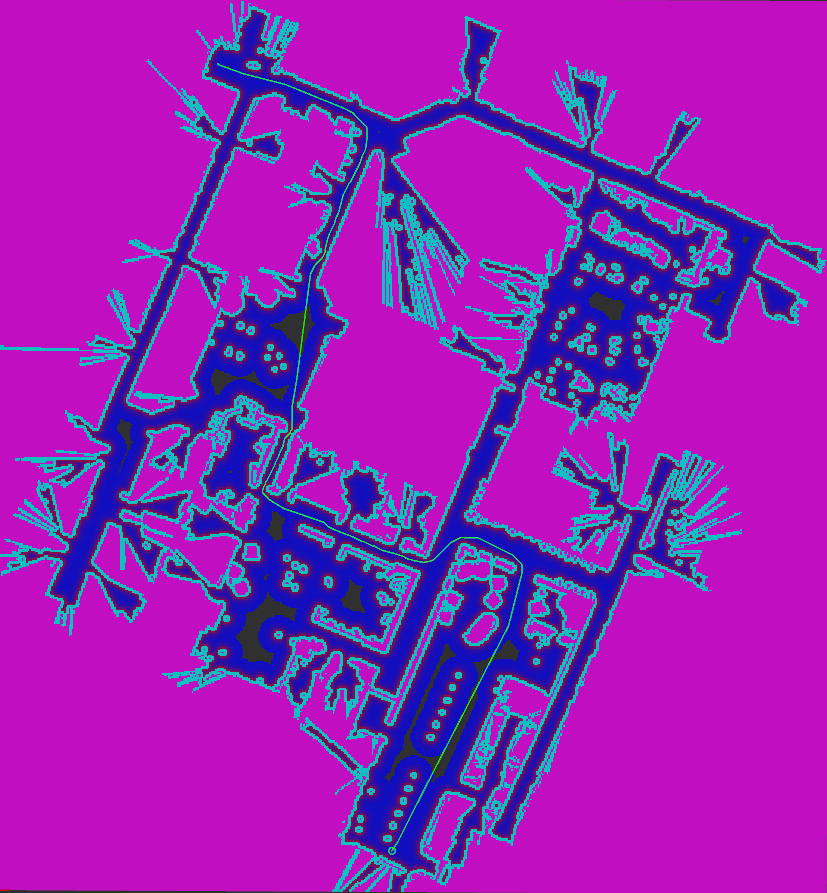
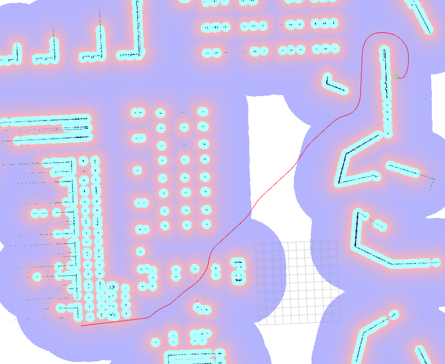

# 第18章 PPT：全局路径规划
> 共 17 页，标注页码 · 图号与教学文档对应

---

## P1

# 全局路径规划

**课程**：ROS2 Python 编程　**章节**：第18章　**课时**：2 课时（90 分钟）
**教学方式**：讲授 + 演示

<!-- 旁白：各位同学好，欢迎进入第十八章。上一章我们学会了代价地图如何表达环境，本章学习如何在这张地图上找到最优路径，即全局路径规划。课程从 Dijkstra 与 A* 两个经典算法讲起，再进入 Nav2 的 Smac 系列规划器与路径优化技术，理论与实践并重。 -->

---

## P2

### 学习目标

- 理解 Dijkstra 算法的原理与 Python 实现
- 理解 A* 算法的原理、启发式函数设计与 Python 实现
- 掌握 Nav2 Smac Planner 系列规划器的工作原理与选型
- 熟悉全局路径规划的代价函数设计思路
- 能够配置和切换不同的全局规划器（GridBased / Smac Hybrid）
- 掌握路径平滑、修剪与代价感知优化技术

<!-- 旁白：本页六项目标按"原理—实现—选型—实践"逐层递进：先掌握 Dijkstra 与 A* 的算法原理和编码实现，再熟悉 Smac 系列规划器的选型依据，最后落到规划器配置与路径优化。建议以编程题为学习主线，带着目标听完后两节的算法推导。 -->

---

## P3

### 全局路径规划概述

- **要点：** 问题定义；输入输出；优化目标

**问题定义**：在已知环境地图（代价地图）中，寻找从起点到终点的无碰撞最优路径。

- **输入**：环境地图（代价地图）、起点位姿 (x_start, y_start, θ_start)、终点位姿 (x_goal, y_goal, θ_goal)
- **输出**：路径，即一系列连续的位姿点 {(x₁, y₁, θ₁), ..., (xₙ, yₙ, θₙ)}
- **优化目标**：`path* = argmin f(path)`，其中 f(path) 通常为路径总长度，也可包含转弯代价、安全距离等约束



图 18-w1：Nav2 规划器插件演示——在代价地图上生成直线路径（来源：docs.nav2.org）

**参考来源**：Nav2 官方文档 Planner Tables 与 Smac Planner、docs.ros.org、A* 原始论文（Hart 等，1968）

<!-- 旁白：注意规划问题的三要素：输入是代价地图与首尾位姿，输出是带朝向的位姿点序列，优化目标是路径长度等约束的最小化。图 18-w1 动图展示了 Nav2 在栅格地图上逐步生成直线路径的过程，可结合后面的算法实现反复体会"搜索"与"回溯"两个阶段。 -->

---

## P4

### 路径规划的评价指标

- **要点：** 五项核心指标；实时性优先

| 指标 | 含义 | 重要性 |
|------|------|--------|
| 路径长度 | 从起点到终点的总距离 | 高 |
| 计算时间 | 规划所需时间 | 高（实时性） |
| 平滑度 | 路径曲率变化 | 中 |
| 安全距离 | 距离障碍物的最近距离 | 高 |
| 完备性 | 是否存在可行解 | 高 |

- 机器人导航中"计算时间"是硬约束：碰撞规避必须跟上底盘运动
- 平滑度与安全距离往往此消彼长，需结合代价地图膨胀层统一权衡

<!-- 旁白：表中五项指标并非并列关系：计算时间是实时性的硬约束，安全距离与完备性关乎基本可用性，路径长度与平滑度则是质量指标。特别留意平滑度与安全距离此消彼长的矛盾，这正是引入代价地图膨胀层统一权衡的原因，也是本章代价函数设计的伏笔。 -->

---

## P5

### Dijkstra 算法原理

- **要点：** 广度优先最短路径搜索；G(n) 最小优先扩展；完备性

**核心思想**：维护从起点到每个节点的最短距离 G(n)，每次选择 G(n) 最小的节点扩展，直到扩展到目标点。

```
1. 初始化: open_list = {start}; closed_list = {}; g(start)=0, g(其他)=∞
2. while open_list 不为空:
   3. 取出 g 值最小的节点 n
   4. if n == goal: 回溯路径，返回成功
   5. n 移入 closed_list
   6. 遍历 n 的相邻节点 m:
      7. if m in closed_list: continue
      8. if m 是障碍物: continue
      9. new_g = g(n) + cost(n, m)
      10. if new_g < g(m): 更新 g(m)、parent(m)，必要时加入 open_list
3. return 失败（无可行路径）
```

**优点**：保证最短路径、算法完备（有解必能找到）、实现简单
**缺点**：不考虑目标位置，向所有方向等距离扩展，搜索范围大、效率低，大地图上计算时间过长

<!-- 旁白：伪代码展示了 Dijkstra 的完整闭环：open_list 每次取出 g 值最小的节点扩展，命中目标即回溯，同时用 parent 指针重建路径。效率低的根源在于第 2 步的"向所有方向等距离扩展"，完全无视目标方位，这为下一节引入启发式 H(n) 埋下伏笔；优点是保证最短路径且算法完备，实现简单。 -->

---

## P6

### Dijkstra Python 实现

- **要点：** 8 邻域连接；代价融合；优先队列 + closed 集合

```python
class DijkstraPlanner:
    def __init__(self, costmap, resolution=0.05):
        self.height, self.width = costmap.shape
        self.neighbors = [(-1,-1),(-1,0),(-1,1),(0,-1),(0,1),(1,-1),(1,0),(1,1)]
        self.movement_costs = [√2, 1, √2, 1, 1, √2, 1, √2]   # 对角线代价更高
```

**关键逻辑**：

```python
# 代价 = 移动代价 + 地图代价（254 及以上视为障碍）
step_cost = movement_cost * (1.0 + map_cost / 50.0)
# 优先队列: (g_score, (row, col))
open_heap = [(0, start)]
while open_heap:
    current_g, current = heapq.heappop(open_heap)
    if current in closed_set: continue
    if current == goal: return self._reconstruct_path(parent, start, goal)
    closed_set.add(current)
    for i, (dr, dc) in enumerate(self.neighbors):
        ...
        if tentative_g < g_score[neighbor]:
            g_score[neighbor] = tentative_g; parent[neighbor] = current
            heapq.heappush(open_heap, (tentative_g, neighbor))
```

- `world_to_grid / grid_to_world` 完成世界坐标与栅格坐标互转，`resolution=0.05` 即 5 cm 栅格

<!-- 旁白：实现细节有三处值得强调：8 邻域中对角线移动代价取根号二；step_cost 公式把地图代价值融合进移动代价，让路径倾向绕开高代价区域；优先队列配合 closed_set 防止重复扩展。坐标互转时注意 resolution 的单位换算，这是初学者最易出错的地方。 -->

---

## P7

### A* 算法原理

- **要点：** F(n)=G(n)+H(n)；启发式函数选择；可采纳性理论

**评价函数**：`F(n) = G(n) + H(n)`

- G(n)：起点到当前节点 n 的实际代价
- H(n)：当前节点 n 到目标点的启发式估计代价

| 启发式 | 公式 | 适用 |
|--------|------|------|
| 曼哈顿距离 | abs(dx) + abs(dy) | 四邻域连接 |
| 欧氏距离 | √(dx² + dy²) | 八邻域连接 |
| 切比雪夫距离 | max(abs(dx), abs(dy)) | 允许斜向移动 |
| 对角线距离 | d1·(dx+dy) + (d2−2·d1)·min(dx,dy) | 对角线移动（d2=√2） |

**官方要点**（来源：docs.ros.org / Nav2 文档）：A* 出自 Hart、Nilsson 与 Raphael 1968 年 SRI 论文。启发式 h(n) 若"可采纳"（不高估真实代价），A* 保证最优；若满足一致性，首次扩展节点即为最优。欧氏距离是 8 邻域可采纳启发式，而切比雪夫/对角线距离（√2 对角代价）更贴合实际步长，能减少无效扩展。

<!-- 旁白：F = G + H 是 A* 的灵魂，关键在 H 的设计。表中四种启发式按连接方式选用：四邻域配曼哈顿距离，八邻域配欧氏或对角线距离。"可采纳"即不高估真实代价，这是最优性的理论保障；对角线距离因贴合实际步长而扩展节点最少，是八邻域场景的首选。 -->

---

## P8

### A* Python 实现

- **要点：** f_score 优先队列；对角线启发式；open/closed 集合管理

```python
class AStarPlanner:
    def plan(self, start_world, goal_world):
        g_score = {start: 0.0}
        f_score = {start: self._heuristic(start, goal)}
        open_heap = [(f_score[start], start)]
        open_set = {start}; closed_set = set(); parent = {}
        while open_heap:
            _, current = heapq.heappop(open_heap)
            if current == goal:
                return self._reconstruct_path(parent, start, goal)
            open_set.discard(current); closed_set.add(current)
            for i, (dr, dc) in enumerate(self.neighbors):
                ...
                tentative_g = g_score[current] + step_cost
                if tentative_g < g_score.get(neighbor, inf):
                    g_score[neighbor] = tentative_g
                    f_score[neighbor] = tentative_g + self._heuristic(neighbor, goal)
                    if neighbor not in open_set:
                        heapq.heappush(open_heap, (f_score[neighbor], neighbor))
```

- 启发式：对角线距离 `1.0·(dr+dc) + (√2 − 2.0)·min(dr, dc)`
- 与 Dijkstra 的唯一区别：优先队列按 **f_score 而非 g_score** 排序

<!-- 旁白：对照上一节代码，这里实质变化只有两处：优先队列改为按 f_score 排序，以及 open_set 与 closed_set 双集合的维护。对角线启发式公式中根号二减二的系数来自 d2 与 2·d1 的差，符号别写错。建议动手把两份代码做一次 diff，体会"一个启发式改变一切"。 -->

---

## P9

### A* vs Dijkstra

- **要点：** 效率差异；路径质量相当；对比实验

| 对比项 | Dijkstra | A* |
|--------|----------|-----|
| 扩展方向 | 向四周等距扩展 | 受启发式引导朝目标扩展 |
| 评价函数 | f = g | f = g + h |
| 搜索效率 | 低（探索大） | 高（节点少） |
| 最优性 | 保证 | 启发式可采纳时保证 |
| 实现复杂度 | 低 | 低（仅多一个启发式） |

**对比实验输出**：

```
Dijkstra: 482点, 85.3ms
A*:       214点, 31.7ms
Dijkstra路径长度: 3.21m
A*路径长度:       3.21m
```

- 相同代价定义下两者路径长度一致，A* 用时约为 Dijkstra 的 1/3

<!-- 旁白：表格说明两者本质相同、只差一个启发式；实验数据则给出量化对比：路径长度完全一致（3.21 米），但 A* 的扩展节点数与耗时约为 Dijkstra 的三分之一。这印证了可采纳启发式"不损失最优性、大幅提升效率"的价值，也解释了工程上默认选 A* 的原因。 -->

---

## P10

### Nav2 Smac Planner 概述

- **要点：** 规划器全家福；选型指引；Theta* 示例

Nav2 内置五类全局规划器：

| 规划器 | 算法 | 特点 | 适用场景 |
|--------|------|------|---------|
| NavfnPlanner | 导航函数 | 经典、路径平滑 | 简单环境 |
| SmacPlanner2D | A* | 标准 A* 于 2D 代价地图 | 通用场景 |
| SmacPlannerHybrid | Hybrid-A* | 带运动学约束 | 非全向机器人 |
| SmacPlannerLattice | 状态格 | 满足动力学约束 | 阿克曼转向 |
| ThetaStarPlanner | Theta* | 任意角度路径 | 全向机器人 |



图 18-w2：Theta* 规划器生成的任意角度路径（来源：docs.nav2.org）

**官方要点**：圆形差速底盘用 NavFn/Smac 2D 足够；需考虑朝向与转弯半径时引入 Hybrid-A*；Lattice 适合要求路径可精确复现的场景。`tolerance` 语义：目标不可达时按该半径搜索"最近可达点"直接规划过去。

<!-- 旁白：表中五类规划器按运动学约束递进：从经典的 NavFn 到满足阿克曼转向的 Lattice，选型核心是底盘类型——圆形差速用 NavFn 或 Smac 2D 足够，需要考虑朝向与转弯半径再上 Hybrid-A*。图 18-w2 展示 Theta* 的任意角度路径，全向底盘值得尝试；tolerance 的"最近可达点"语义在目标落在障碍内时非常实用。 -->

---

## P11

### Hybrid-A* 算法

- **要点：** 状态 (x,y,θ)；运动基元；Reeds-Shepp 连接；官方运动学细节

Hybrid-A* 在标准 A* 基础上加入运动学约束：状态空间由 (x,y) 扩展到 (x,y,θ)，考虑最小转弯半径，支持前进/后退，并用 Reeds-Shepp 曲线连接目标。

```python
# 运动基元生成（速度 + 转角 + 时间步 + 挡位）
前进: [steer=-0.4…0.4, v=0.3, dt=0.5] ×5    后退: [steer=-0.2…0.2, v=-0.2, dt=0.3] ×3
# 自行车模型仿真
new_theta = theta + v * tan(steer) / 0.5 * dt
# 离散化：xy 分辨率 0.2m（比代价地图粗）、θ 分辨率 15°
# 距目标 <0.5m 时用 Reeds-Shepp 曲线直连
# 节点代价 = 运动距离 + 转向惩罚 |steer|·0.5
```



图 18-w3：Smac Hybrid-A* 生成的带运动学约束路径（来源：docs.nav2.org）

**官方要点**：`motion_model_for_search_type` 选 DUBIN（仅前进）或 REEDS_SHEPP（允许倒车）；`minimum_turning_radius` 过小会生成底盘转不出的急弯；`reverse_penalty`/`change_penalty`/`non_straight_penalty` 是"像不像人开车"的旋钮。调参顺序：先把 `analytic_expansion_ratio` 与 `analytic_expansion_max_length` 调到能稳定生成解析端点，再收紧惩罚项。Lattice 依赖离线运动基元文件，其分辨率必须与 costmap 匹配（最常见坑）。

<!-- 旁白：Hybrid-A* 的三个关键词：状态从 (x, y) 扩展到 (x, y, θ)、运动基元由"速度 + 转角 + 时间步"生成、距目标较近时用 Reeds-Shepp 曲线解析直连。代码注释里的自行车模型公式决定了航向更新，xy 与 θ 的离散化分辨率影响搜索粒度。图 18-w3 显示生成路径平滑且符合转弯半径约束，这正是非全向底盘选择它的原因。 -->

---

## P12

### Nav2 规划器配置与切换

- **要点：** planner_server YAML；Hybrid 调参；运行时切换

```yaml
planner_server:
  ros__parameters:
    planner_plugins: ["GridBased"]
    GridBased:
      plugin: "nav2_navfn_planner/NavfnPlanner"
      tolerance: 0.5                # 目标容忍距离
      use_astar: true               # 使用 A* 加速
      allow_unknown: false          # 不允许未知区域
    # Smac Planner Hybrid 可选配置
    # GridBased:
    #   plugin: "nav2_smac_planner/SmacPlannerHybrid"
    #   tolerance: 0.5
    #   max_planning_time: 2.0       # 最大规划时间(s)
    #   minimum_turning_radius: 0.2  # 最小转弯半径(m)
    #   reverse_penalty: 2.0         # 后退惩罚
    #   change_penalty: 0.5          # 方向变化惩罚
    #   non_straight_penalty: 1.1    # 非直线惩罚
```

**运行时切换**：

```bash
ros2 param get /planner_server planner_plugins          # 查看当前规划器
ros2 param set /planner_server planner_plugins "['SmacPlanner']"   # 动态切换
```

- 切换后需要重新发起导航请求才会触发重规划

<!-- 旁白：YAML 中注释掉的 Hybrid 配置就是切换开关，注释与反注释即可完成规划器替换；tolerance 与 use_astar 是 NavFn 最常用的两个参数。bash 命令演示了运行时动态查看与切换规划器，注意切换后必须重新发起导航请求才会触发重规划，这也是排查"改了没生效"的第一步。 -->

---

## P13

### 路径优化与规划器协同

- **要点：** 平滑/修剪/插值；代价感知外推；smoother_server 标准管线

**路径平滑**（去除锐角转折）：

```python
class PathSmoother:
    def __init__(self, weight_data=0.5, weight_smooth=0.3, weight_length=0.2):
        ...
    def smooth(self, path, num_iterations=100):   # 梯度下降迭代
        # d_data：保持接近原始点、d_smooth：与邻居差距、d_length：均匀间距
        new_path[i] += d_data + d_smooth + d_length
    def b_spline_smooth(self, path, num_points=100):
        # scipy: splprep + splev B 样条插值
```

- **修剪**（Douglas-Peucker）：最远点距首尾连线超过 epsilon 则递归二分，否则丢弃中间点
- **插值**：`interpolate_path(path, step_size=0.1)` 按固定步长均匀重采样
- **代价感知**（CostAwarePathOptimizer）：cost > 50 的高代价区域沿法线外推，`push_force = min(cost/100, 0.5)·0.05`，迭代 50 次、变化 < 0.001 收敛

**官方要点**（来源：Nav2 文档 / Robotics Back-End）：后处理由独立 `smoother_server` 承担——Simple Smoother 用共轭梯度迭代，`w_smooth`/`w_data` 权衡平滑度与贴合度，避免"抄近道"穿墙；默认行为树在 ComputePathToPose 后串联 SmoothPath Action，构成"折线路径 + 平滑输出"标准管线。实验表明：先平滑后跟踪，DWB/RPP/MPPI 横向误差显著降低——平滑器是规划与控制之间的质量缓冲。

<!-- 旁白：路径优化分三板斧：平滑用梯度下降迭代或 B 样条插值去除锐角，修剪用 Douglas-Peucker 递归二分压缩冗余点，代价感知优化则沿法线把路径推出高代价区域。注意 push_force 公式中 min(cost/100, 0.5) 的上限设计，防止过度外推。Nav2 的 smoother_server 独立承担后处理，实验证明先平滑后跟踪能显著降低横向误差。 -->

---

## P14

### 实战案例

- **要点：** Nav2 完整流程；命令行调试；常见问题

**演示节点流程**（订阅代价地图 → A* 规划 → 发布 /planned_path）：

```
订阅 /global_costmap/costmap (OccupancyGrid)
  └─ 首次收到 → reshape 为代价地图 → 创建 AStarPlanner
       └─ 规划 start=(0,0) → goal=(3,2)
            ├─ 成功 → 发布 /planned_path (nav_msgs/Path)，log 路径点数
            └─ 失败 → 等待下一帧代价地图
```

**命令行调试**：

```bash
ros2 topic echo /plan --once                      # 查看规划路径
ros2 topic echo /global_costmap/costmap --once    # 查看代价地图
ros2 param describe /planner_server GridBased.plugin
ros2 param set /planner_server GridBased.tolerance 0.3
```

| 常见问题 | 解决思路 |
|----------|---------|
| 路径规划超时 | 降低代价地图分辨率、减小搜索范围、换更高效规划器 |
| 路径穿过障碍物 | 膨胀半径过小，检查代价地图更新，增加规划容忍度 |
| 路径不平滑 | 平滑器后处理、改用 Hybrid-A*、降低代价地图分辨率 |

**仿真实例**：`ros2 launch navigation_sim_demo_ros2 nav2_demo.launch.py use_gazebo:=true use_rviz:=true gz_headless:=false` + `nav_goal_runner -p goal_x:=1.0 -p goal_y:=0.0` + `ros2 topic echo /plan --once`；参数在 `nav2_params.yaml`。

<!-- 旁白：演示节点的流程图值得精读：首次收到代价地图才创建规划器，目标求解失败则等待下一帧地图，体现了"数据驱动"的节点设计模式。命令行四条指令覆盖路径、地图、参数的查看与修改，是调试的基本功。故障排查表按症状给出三类解决思路：超时先降分辨率、穿墙查膨胀半径、不平滑上平滑器后处理。 -->

---

## P15

### 本章要点

- 全局路径规划：在已知代价地图上求无碰撞最优路径，输入起点/终点位姿，输出位姿点序列
- Dijkstra 均匀等距扩展保证最短路径但效率低；A* 以 F = G + H 引导搜索，启发式可采纳时同样保证最优
- 8 邻域连接下优先使用对角线距离启发式（√2 对角代价），减少无效扩展
- Nav2 默认 GridBased 为 NavFn；Smac 家族覆盖 2D / Hybrid-A* / Lattice，另有 Theta*
- Hybrid-A* 扩展状态到 (x, y, θ)，以运动基元 + Reeds-Shepp 连接处理最小转弯半径、倒车与转向惩罚
- 路径优化三板斧：平滑（梯度下降 / B 样条）、修剪（Douglas-Peucker）、代价感知外推；smoother_server 与规划器协同是 Nav2 标准管线

<!-- 旁白：六条要点构成一条主线：从问题定义出发，经 Dijkstra 与 A* 的对比引出启发式设计，再由 Smac 家族与 Hybrid-A* 落到实际选型，最后以平滑、修剪、外推三板斧收尾。复习时建议把本页与 P10 的规划器表格、P9 的对比实验搭配使用，形成"原理—选型—优化"的完整知识链。 -->

---

## P16

### 练习题

1. **原理题**：比较 Dijkstra 与 A* 的异同，说明启发式函数 H(n) 如何影响搜索效率和路径质量。
2. **编程题**：实现 A* 路径规划算法，在给定代价地图上搜索最短路径并可视化。
3. **分析题**：分析 Hybrid-A* 与标准 A* 的区别，说明为什么非全向机器人需要 Hybrid-A* 规划器。
4. **配置题**：在 Nav2 中配置 Smac Planner Hybrid，调整最小转弯半径、后退惩罚等参数以适应差速机器人。
5. **设计题**：设计三层路径规划框架——上层 A* 中分辨率粗规划，中层 Hybrid-A* 细化，下层平滑器后处理。

<!-- 旁白：五道题覆盖五个能力层次：原理题检验概念辨析，编程题动手实现 A* 并可视化，分析题理解运动学约束的必要性，配置题练习参数调整，设计题综合三层框架。建议至少独立完成前两题，后三题可结合真实底盘参数在仿真中验证，遇到困难回顾 P11 与 P12 的要点。 -->

---

## P17

### 下章预告

**第19章　局部路径规划**

- DWA 动态窗口法与 DWB 控制器
- Regulated Pure Pursuit 与 MPPI 控制器
- 局部规划参数调优与调试命令

<!-- 旁白：本章解决了"从起点到终点走哪条路"的问题，下一章回答"沿这条路怎么走"：DWA 动态窗口法与 DWB 控制器、Regulated Pure Pursuit 与 MPPI 都将登场，还有局部规划的参数调优与调试命令。建议先复习本章的代价函数设计思路，它同样是局部规划器的基础。 -->