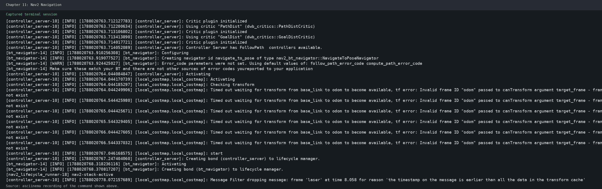
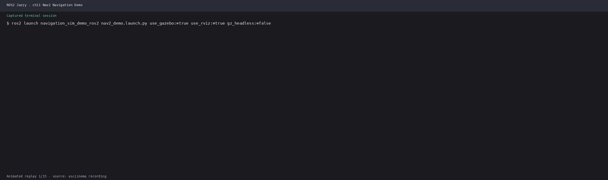

# 第19章 PPT：局部路径规划
> 共 17 页，标注页码 · 图号与教学文档对应

---

## P1

# 局部路径规划

**课程**：ROS2 Python 编程　**章节**：第19章　**课时**：2 课时（90 分钟）
**教学方式**：讲授 + 演示

<!-- 旁白：同学们好，今天我们进入第19章局部路径规划。如果说上一章的全局路径规划是"规划好路线图"，那么本章的局部路径规划就是"边走边躲障碍"。本页先交代本章在全书中的定位：控制器把全局路径变成实时的速度指令，课程目标在下一页列出，请同学们对照学习目标检查掌握程度。 -->

---

## P2

### 学习目标

- 理解 DWA（动态窗口法）算法的原理与 Python 实现
- 掌握 Regulated Pure Pursuit 控制器的工作机制与配置方法
- 熟悉局部路径规划的轨迹评价（评分）方法
- 能够在 Nav2 中配置 DWB 和 RPP 控制器
- 了解 MPPI、TEB 等控制器的选型依据
- 掌握局部规划参数调优与调试方法

<!-- 旁白：本页的学习目标覆盖原理与实现两条线：前三条偏算法，后三条偏工程。请同学们记住第 3 条是本章的坐标——局部规划输出的是速度指令而非路径点，后续 DWA、DWB、RPP、MPPI 都是围绕这个输出展开的。 -->

---

## P3

### 局部路径规划概述

- **要点：** 局部规划的任务；与全局规划的差异；四大核心挑战

局部路径规划是在全局路径的引导下，根据传感器实时信息生成安全的速度指令，实现动态避障和路径跟踪。

| 特性 | 全局路径规划 | 局部路径规划 |
|------|-------------|-------------|
| 规划范围 | 整个地图 | 机器人周围（数米） |
| 信息源 | 已知地图 | 实时传感器 |
| 更新频率 | 低 (1-2 Hz) | 高 (10-50 Hz) |
| 规划目标 | 最短路径 | 路径跟踪+避障 |
| 输出 | 路径点序列 | 速度指令 (v, ω) |

**局部规划的核心挑战：**

- 实时性：需要在毫秒级生成控制指令
- 安全性：必须避开动态障碍物
- 平滑性：速度变化不能太剧烈
- 可达性：满足机器人运动学约束（差速 / 阿克曼）

<!-- 旁白：本页给出全局与局部规划的对照表：全局规划低频、面向已知地图，局部规划高频、面向实时传感器，核心挑战是实时、安全、平滑与可达。后面的 DWA、RPP、MPPI 等控制器都围绕这四个挑战展开，大家可以带着"实时性与安全性如何权衡"的问题学习后续各页。 -->

---

## P4

### Nav2 局部控制器与 controller_server

- **要点：** FollowPath 动作服务；插件化加载；全局低频、局部高频的解耦设计

Nav2 的 controller_server 是一个 FollowPath Action 服务器：全局规划器只负责给出路径，实际的速度指令由插件加载的控制器在最新代价地图上计算。

- 默认控制频率 `controller_frequency`：20 Hz
- 控制前检查目标位姿与 TF 是否就绪，未就绪直接返回失败，由行为树接管恢复
- 「控制器报错先查上游」：即先确认全局路径、代价地图与 TF 是否正常


图：Nav2 架构中 controller_server 与规划器、行为树的关系

**Nav2 支持的局部控制器插件：**

| 控制器 | 算法 | 特点 | 适用场景 |
|--------|------|------|---------|
| DWB | 动态窗口法 + 评分 | 功能最全，可定制 | 通用场景 |
| Regulated Pure Pursuit | 调节纯追踪 | 简单可靠 | 差速/阿克曼 |
| MPPI | 模型预测路径积分 | 采样+并行优化 | 高端动态场景 |
| TEB | 时间弹性带 | 考虑时间最优 | 复杂环境 |

<!-- 旁白：进入局部规划前先建立整体框架：controller_server 是一个动作服务器，它把路径当作输入、把速度指令当作输出，具体算法全部由插件决定。架构图中可以看到它与全局规划器、行为树、代价地图的分工。官方强调这种解耦的价值——全局规划可以低频省算力，局部控制必须高频响应动态障碍，两者互不阻塞；如果控制器报错，先检查上游的路径与 TF。 -->

---

## P5

### DWA 动态窗口法原理

- **要点：** 速度空间采样；动态窗口三层约束；四步选优流程

DWA（Dynamic Window Approach）在速度空间中采样，预测每条轨迹的未来状态，通过评分选择最优速度指令。

```
1. 生成速度采样窗口
   - 考虑最大/最小速度限制
   - 考虑加速度限制（动态窗口）
   - 考虑安全停止距离

2. 对每组速度 (v, ω) 模拟轨迹
   - 使用运动模型前向模拟
   - 预测未来N步的位姿

3. 评估每条轨迹
   - 方向评分（与目标对齐）
   - 障碍物评分（最小距离）
   - 速度评分（鼓励高速）
   - 路径评分（与全局路径对齐）

4. 选择最优速度
   - 加权求和各评分
   - 选择综合得分最高的速度
```

**动态窗口 = 速度极限 ∩ 加速度极限 ∩ 安全停止距离**

- 速度极限：`[min_speed, max_speed]` × `[-max_yaw_rate, max_yaw_rate]`
- 加速度极限：当前速度 ± 一个 dt 内可达到的变化量
- 安全停止：能及时停下而不碰撞的速度范围

<!-- 旁白：动态窗口的名字来自三个约束的交集：机器人不能超出速度极限，不能瞬时改变速度，也不能在无法停住的速度上行驶。取交集后就得到一个窄小的采样窗口，窗口内的每组速度都会前向模拟出一条轨迹，再按四个评分加权选出最优。算法后半部分的评分权重会直接影响避障与跟路的偏向，是调参的主战场。 -->

---

## P6

### DWA 的 Python 实现

- **要点：** 动态窗口计算；轨迹前向模拟；核心 API 结构

**动态窗口计算——取三组约束的交集：**

```python
def _calc_dynamic_window(self, state: np.ndarray) -> tuple:
    v = state[3]
    w = state[4]

    # 运动学极限
    vs = [self.min_speed, self.max_speed,
          -self.max_yaw_rate, self.max_yaw_rate]

    # 加速度极限
    vd = [v - self.max_accel * self.dt,
          v + self.max_accel * self.dt,
          w - self.max_delta_yaw_rate * self.dt,
          w + self.max_delta_yaw_rate * self.dt]

    # 取交集
    v_min = max(vs[0], vd[0])
    v_max = min(vs[1], vd[1])
    w_min = max(vs[2], vd[2])
    w_max = min(vs[3], vd[3])

    return v_min, v_max, w_min, w_max
```

**轨迹前向模拟——用运动模型推进 N 步：**

```python
def _predict_trajectory(self, state: np.ndarray, v: float,
                         w: float) -> np.ndarray:
    x, y, theta = state[0], state[1], state[2]
    traj = [(x, y, theta)]

    time = 0
    while time < self.predict_time:
        x += v * np.cos(theta) * self.dt
        y += v * np.sin(theta) * self.dt
        theta += w * self.dt
        time += self.dt
        traj.append((x, y, theta))

    return np.array(traj)
```

- 主流程 `plan()`：生成窗口 → 按 `v_resolution`/`w_resolution` 采样 → 逐条预测与评分 → 取最高分

<!-- 旁白：实现的关键是窗口交集与轨迹模拟两段代码。窗口交集把速度极限和加速度极限逐项取最大最小，得到当前时刻真实可达的速度集合；轨迹模拟用简单的运动学积分推进位姿，dt 越小、predict_time 越长，模拟越精细，但采样量也越大。plan 主流程把采样、预测、评分串起来，评分细节见下页。 -->

---

## P7

### DWA 评分机制

- **要点：** 四个评分项；碰撞惩罚；加权综合

每条模拟轨迹按四个维度评分，加权求和后取最高分：

| 评分项 | 计算方式 | 作用 |
|--------|---------|------|
| 目标方向评分 | 轨迹终点朝向与目标方向的角度差（归一化到 [0,1]） | 引导机器人朝目标 |
| 障碍物距离评分 | 轨迹到最近障碍物的距离，距离 < 0.2m 视为碰撞 | 保证安全避障 |
| 速度评分 | v / max_speed，并对过度旋转施加惩罚 | 鼓励高效行进 |
| 路径跟踪评分 | 轨迹点与全局路径的平均距离（距离越小分越高） | 贴合全局路径 |

**加权综合公式：**

```
total_score = alpha_heading * heading_score
            + alpha_dist   * obstacle_score
            + alpha_velocity * speed_score
            + alpha_path   * path_score
```

**设计要点：**

- 距离 < 0.2m 判定碰撞，直接返回 `-inf` 淘汰该轨迹
- 速度评分对旋转惩罚：`v_score * (1.0 - 0.3 * w_penalty)`，鼓励直线高速
- 权重 `alpha_*` 决定行为偏向：调大 `alpha_dist` 更保守避障，调大 `alpha_path` 更贴路径

<!-- 旁白：评分器是 DWA 的"价值判断"。四个评分各有侧重：方向评分解决去哪，障碍评分解决别撞，速度评分解决别慢，路径评分解决别偏。权重是策略的开关——想穿过窄道就提高路径与障碍权重，想快速到达就提高速度权重。注意碰撞判定是硬约束，距离低于阈值直接淘汰，这是安全性的底线。 -->

---

## P8

### DWB 控制器与配置

- **要点：** DWA 的 Nav2 升级版；三大核心组件；critics 插件化

DWB（Dynamic Window Based）是 Nav2 中 DWA 的升级实现，增加了更多可配置的评分器（Critic）。

**DWB 核心组件：**

- **Critics（评分器）**：评估轨迹的各项指标，可自由组合与加权
- **Goal Checker（目标检查器）**：判断是否到达目标（xy 与 yaw 容差）
- **Oscillation Handler（振荡处理器）**：防止前进-后退来回振荡

**典型 critics 组合（YAML 节选）：**

```yaml
FollowPath:
  plugin: "dwb_core::DWBLocalPlanner"
  min_vel_x: 0.0
  max_vel_x: 0.5
  max_vel_y: 0.0           # 差速机器人，无侧向运动
  max_vel_theta: 1.0
  vx_samples: 20           # 线速度采样数
  vtheta_samples: 40       # 角速度采样数
  sim_time: 1.5            # 仿真时长(s)
  sim_granularity: 0.025   # 仿真步长(m)

  critics: [
    "RotateToGoal", "Oscillation", "BaseObstacle",
    "GoalAlign", "PathAlign", "PathDist", "GoalDist"
  ]
```

- 各评分器用 `CriticName.scale` 设置权重，如 `BaseObstacle.scale: 32.0`
- Goal Checker：`xy_goal_tolerance: 0.1`、`yaw_goal_tolerance: 0.1`（rad）

<!-- 旁白：DWB 把 DWA 的评分体系组件化：每个评分器是一个独立插件，可以增删和调权，这就是 critics 机制。配置上需要同时给出速度采样范围、仿真时长与评分器列表；加速度限制 acc_lim_x 等决定动态窗口，vx_samples 决定采样密度。Goal Checker 用位置与角度双容差判断到达，stateful 模式避免目标反复切换。 -->

---

## P9

### DWB 评分器详解与调优

- **要点：** 常用 critic 的功能；约 20 个内置 critic；调优先粗后精

**内置约 20 个 critic，常用组合与作用：**

| Critic | 作用 | 典型权重 |
|--------|------|---------|
| BaseObstacle | 碰撞拒绝：轨迹栅格代价 ≥254 直接淘汰 | 32.0 |
| PathAlign | 路径对齐：轨迹点与全局路径的距离 | 32.0 |
| PathDist | 到全局路径的接近度（另一视角） | 32.0 |
| GoalAlign | 终点朝向与目标对齐 | 24.0 |
| GoalDist | 轨迹终点到目标点的距离 | 24.0 |
| RotateToGoal | 原地转向对准目标（终段使用） | 32.0 |
| Oscillation | 抑制前进-后退抖动 | 10.0 |

**官方调优指南的顺序：**

1. 先只开启碰撞类与目标类 critic，保证「基本可达」
2. 再逐个加入精细 critic（PathAlign、Oscillation 等）
3. 逐步调整权重，避免多目标互相抵消

- 典型场景权重：狭窄走廊强化 `PathAlign`；开阔大厅强化 `GoalAlign`；动态障碍场景强化 `BaseObstacle` 并加 `Oscillation`

<!-- 旁白：评分器列表就是 DWB 的策略清单，多数场景按 BaseObstacle 打底、贴路径与向目标各一类的思路组合即可。官方的调优顺序值得背下来：先粗后精——先保证不撞、能到，再加"走得好不好"的精细指标，否则多个评分同时上阵会互相抵消，越调越乱。Oscillation 的阈值检查最近 5 条指令是否有方向交替，防止抖动。 -->

---

## P10

### Pure Pursuit 基本原理

- **要点：** 前瞻点跟踪；圆弧拟合；曲率公式

Pure Pursuit 是一种基于几何追踪的路径跟踪算法，通过追踪路径前方的一个目标点来引导机器人。

```
1. 在全局路径上找到前瞻点（lookahead point）
   - 距离机器人当前位置为 lookahead_distance

2. 计算机器人到前瞻点的转角
   - 使用圆弧拟合，圆弧经过机器人和前瞻点

3. 输出速度指令
   - 线速度：根据曲率自适应调节
   - 角速度：圆弧曲率
```

**曲率计算公式：**

```
γ = 2 * sin(α) / L

其中:
- α: 机器人朝向与前向量之间的夹角
- L: 前瞻距离
- γ: 曲率

控制量:
- ω = v * γ (角速度 = 线速度 × 曲率)
```

**关键特征：**

- 只有一个几何参数（前瞻距离）决定行为：前瞻小→转弯更紧但易振荡；前瞻大→轨迹平滑但切弯
- 不做速度采样、不评估多条候选，计算开销远低于 DWB

<!-- 旁白：纯追踪像"狗追骨头"：机器人在全局路径上取一个远程目标点，用一段经过自身与目标点的圆弧来拟合转向。曲率公式 γ = 2sin(α)/L 里，α 是朝向与前向量的夹角，L 是前瞻距离——夹角越大或前瞻越短，转弯越急。因此调节前瞻距离就能改变整体驾驶风格，这也是后面 RPP 调参的第一杠杆。 -->

---

## P11

### Regulated Pure Pursuit 实现与配置

- **要点：** 曲率调节与代价调节；速度自适应前瞻；碰撞检测

RPP 在经典纯追踪之上增加两种调节，并支持按速度缩放前瞻距离：

**曲率调节（use_regulated_linear_velocity）：**

```
curvature_factor = 1.0 - abs(curvature) * curvature_weight
velocity *= max(curvature_factor, 0.3)    # 曲率越大速度越低
```

**代价调节（use_cost_regulated_linear_velocity）：**

```
cost_factor = 1.0 - (cost / 254.0) * cost_scaling_gain
velocity *= max(cost_factor, 0.1)         # 靠近障碍物减速
```

**关键参数：**

| 参数 | 默认值 | 说明 |
|------|--------|------|
| desired_linear_vel | 0.3 | 期望线速度 (m/s) |
| max_linear_vel / min_linear_vel | 0.5 / 0.05 | 线速度上下限 |
| lookahead_dist | 1.0 | 基础前瞻距离 (m) |
| min/max_lookahead_dist | 0.3 / 2.0 | 前瞻距离区间 |
| use_velocity_scaled_lookahead | true | 按速度缩放前瞻：快更快看远 |
| max_allowed_curvature | 0.5 | 曲率上限（阿克曼/大曲率受限） |
| use_collision_detection | true | 开启前向碰撞检查（碰撞检查距离 0.5m） |

<!-- 旁白：RPP 的三个特性从名字就能记：regulated 表示速度受调节，不再恒速；cost regulated 表示把代价地图的障碍代价折算成速度上限；velocity scaled lookahead 让高速时看得更远、低速时转弯更紧。注意 RPP 本身不具备绕障决策能力，它的避障依赖规划器，所以官方提示要配合合理路径与碰撞检测使用。 -->

---

## P12

### DWB vs RPP 对比

- **要点：** 两控制器特性对照；选型依据

| 特性 | DWB | RPP |
|------|-----|-----|
| 算法基础 | 动态窗口法 + 多评分器 | 纯追踪 + 速度调节 |
| 计算复杂度 | 高（评分器多） | 低（几何计算） |
| 参数数量 | 多（大量评分器参数） | 少（简单直观） |
| 平滑性 | 好 | 好 |
| 狭窄通道 | 好 | 中（需要调前瞻参数） |
| 动态环境 | 好（实时避障） | 中（被动反应） |
| 调试难度 | 难（参数多） | 易（参数少） |
| 适用场景 | 通用场景 | 简单可靠场景 |

**选型建议：**

- 追求功能全面、场景多变 → DWB（评分器可定制）
- 追求简单可靠、快速部署 → RPP（差速/阿克曼均可）
- 密集动态环境优先采样类控制器（DWB），平滑跟踪优先 RPP

<!-- 旁白：这张表把两代控制器摊开对比：DWB 是"重武器"，评分器多、可定制性强，但参数爆炸、调试成本高；RPP 是"轻骑兵"，几何计算快、参数少，但缺乏主动绕障能力。工程选型的思路是：场景简单选 RPP 上线快，场景复杂且动态障碍多选 DWB，练习第 5 题的对比实验正是围绕这张表设计的。 -->

---

## P13

### MPPI 控制器与选型

- **要点：** 采样式模型预测控制；并行优化；控制器插件生态

MPPI（Model Predictive Path Integral）是一种基于采样的模型预测控制方法：

**核心思想：**对控制序列进行多次采样（加入噪声），前向模拟每条采样序列的未来状态，根据代价函数计算每条序列的权重，加权平均生成最优控制序列，执行第一个控制指令后重复。

**优势：**可处理非线性动力学，自然支持并行计算（GPU 加速），对模型误差鲁棒，适合复杂动态环境。

**关键参数：**

| 参数 | 默认值 | 说明 |
|------|--------|------|
| samples | 1000 | 采样数 |
| time_steps | 56 | 预测步数 |
| dt | 0.1 | 时间步长 (s) |
| vx_std / wz_std | 0.2 / 0.4 | 速度噪声标准差（探索幅度） |
| obstacle_cost_weight | 10.0 | 避障代价权重 |
| path_cost_weight / goal_cost_weight | 5.0 / 5.0 | 路径与目标代价 |

**官方选型要点：**除 DWB、RPP 外还有 TEB（时间弹性带，支持倒车与阿克曼）、Rotation Shim（先原地转向再交给下层控制器）等；Jazzy 版本起 MPPI 成为默认控制器。

<!-- 旁白：MPPI 的思路完全不同：它不逐一评分仿真轨迹，而是对控制序列加噪声采样上千条，按代价加权平均出最优控制——更像"大数据投票"。噪声标准差决定探索范围，代价权重决定避障与跟路的取舍。官方提醒选型看底盘与环境：狭窄密集用采样类（DWB/MPPI），直径受限考虑 TEB/MPPI，追求平滑与精度选 RPP。 -->

---

## P14

### 参数调优与调试命令

- **要点：** 速度参数按场景推荐；前瞻距离三原则；DWB 权重按场景切换

**速度参数推荐（全向/差速 vs 阿克曼、环境修正）：**

| 场景 | 推荐做法 |
|------|---------|
| 差速机器人 | max_linear_vel 0.5、max_angular_vel 1.0、acc_lim_x 2.5 |
| 阿克曼机器人 | max_linear_vel 0.8、max_angular_vel 0.5、acc_lim_x 1.5 |
| 狭窄环境 | 线速度乘 0.6、加速度乘 0.7（低速高转向） |
| 开阔环境 | 线速度乘 1.2（发挥高速） |

**前瞻距离三原则：**速度越快前瞻越远（3 倍速度打底）、控制频率越高可适当缩短、车体越长前瞻越远（2 倍车长）——最终限幅在 [0.3, 3.0] m。

**调试命令：**

```bash
# 查看当前控制器参数
ros2 param describe /controller_server FollowPath

# 动态调整速度
ros2 param set /controller_server FollowPath.max_vel_x 0.3

# 查看轨迹细节
ros2 topic echo /controller_server/trajectory_details

# 查看速度指令
ros2 topic echo /cmd_vel

# RViz2中可视化：添加 Local Plan, Trajectories
rviz2
```

<!-- 旁白：调参从车身和场景出发：差速车体面速度慢、横摆能力好，阿克曼相反；再按环境缩放。前瞻距离的经验公式（3 倍速度 + 2 倍车长，按控制频率修正）可直接套用，最终限幅 0.3 到 3 米。排障用命令四件套：param describe 查参数、param set 热调、echo trajectory_details 看轨迹评分、echo /cmd_vel 看输出速度，RViz 加 Local Plan 与 Trajectories 显示。 -->

---

## P15

### 仿真结合实例：控制器跟踪路径并输出速度

- **要点：** 在 Nav2 仿真中观察 DWB 控制器、局部代价地图与 /cmd_vel 的关系

**运行步骤：**

```bash
source /opt/ros/jazzy/setup.bash
source install/setup.bash
ros2 launch navigation_sim_demo_ros2 nav2_demo.launch.py \
  use_gazebo:=true use_rviz:=true gz_headless:=false
```

```bash
ros2 topic echo /cmd_vel --once
ros2 topic echo /odom --once
ros2 topic info /scan
```

**观察结果：**

- 发送导航目标后，控制器根据路径输出速度指令；RViz 同时显示 Local Costmap 和路径
- 若没有 `odom → base_link` TF，控制器会等待变换，需先检查 Gazebo 桥和 TF
- 控制器参数位于 `src/navigation_sim_demo_ros2/params/nav2_params.yaml`



图：Nav2 仿真中控制器跟踪路径并发布速度指令



<!-- 旁白：仿真验证把本章知识串成一条链路：全局路径经 controller_server 交给 DWB，DWB 参考局部代价地图输出 /cmd_vel，Gazebo 底盘执行后通过 /odom 反馈位姿。观察要点是发送目标后 /cmd_vel 是否持续更新、RViz 中 Local Costmap 是否随障碍变化。控制器常见故障是缺 TF——没有 odom 到 base_link 的变换，控制器只会等待，检查仿真桥与 TF 树即可。 -->

---

## P16

### 本章要点

- 局部路径规划在全局路径引导下以 10-50 Hz 生成速度指令，controller_server 以 20 Hz 插件化加载控制器
- DWA 在「速度极限 ∩ 加速度极限 ∩ 安全停止」的动态窗口内采样，前向模拟轨迹并按四维加权评分选优
- DWB 是 DWA 的插件化升级：critics 组合 + Goal Checker + Oscillation Handler，内置约 20 个评分器
- Pure Pursuit 以曲率 γ = 2sin(α)/L 追踪前瞻点；RPP 增加曲率调节、代价调节与速度自适应前瞻
- MPPI 以千级采样 + 加权平均求最优控制，适合非线性与动态环境，Jazzy 起为默认控制器
- 调参按「速度→前瞻→评分权重」顺序进行，调试用 param/param set 与 trajectory_details、/cmd_vel 话题

<!-- 旁白：本章要点共六条，覆盖概述、架构、算法、配置、调试与仿真等环节。请同学们对照检查：能否用一句话说出 DWA 与 DWB 的关系、RPP 的三类调节分别解决什么问题，并完成仿真实例与课后练习第 5 题（DWB/RPP 对比实验）。下一组轮到的同学请提前准备练习题的讲评。 -->

---

## P17

### 练习题

1. **原理题**：说明 DWA 算法中动态窗口的定义，阐述为什么需要结合速度极限、加速度极限和安全停止距离来生成动态窗口。
2. **编程题**：实现 DWA 局部路径规划器，包含速度空间采样、轨迹预测和评分函数，并在仿真环境中测试避障效果。
3. **分析题**：比较 DWB 和 Regulated Pure Pursuit 的异同，分析两种控制器在不同场景下的适用性。
4. **配置题**：为差速机器人在走廊环境配置 DWB 控制器参数，要求能够顺利通过 0.8m 宽的走廊并保持稳定的导航行为。
5. **操作题**：在仿真环境中分别使用 DWB 和 RPP 控制器进行导航，对比两种控制器在路径跟踪精度和安全避障方面的表现。
6. **设计题**：设计一个自适应控制器切换策略：在宽阔区域使用 RPP 提高效率，在狭窄通道切换到 DWB 提高通过能力，并给出切换条件和参数过渡方案。

<!-- 旁白：课后练习共 6 题，覆盖原理、编程、分析、配置、操作与设计。第 1、2 题对应 DWA 原理与实现，第 3 题是 DWB 与 RPP 的对比分析，第 5 题在仿真中操作对比两种控制器，第 6 题结题设计题适合进阶挑战。下章进入第 20 章行为树与恢复行为。 -->