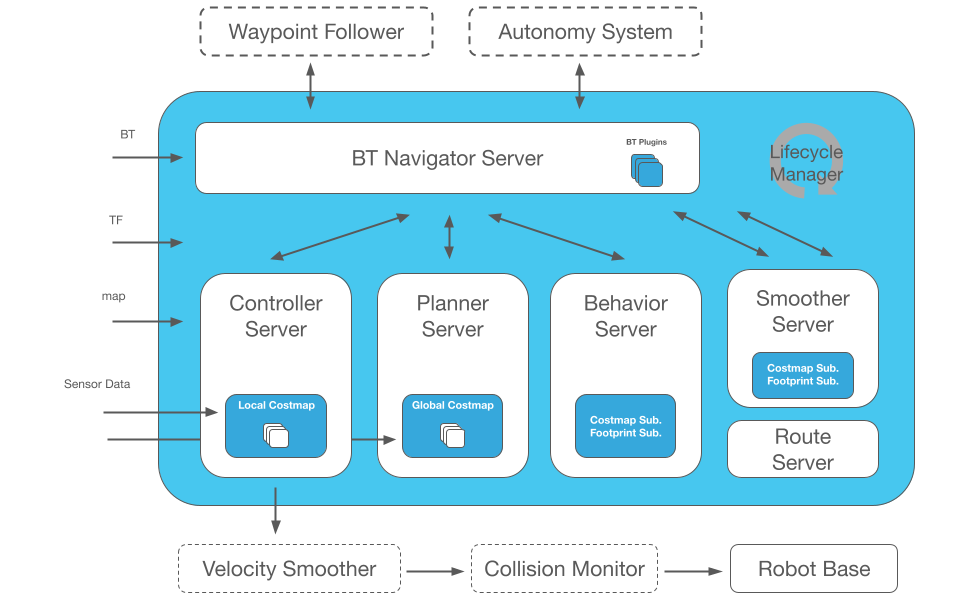
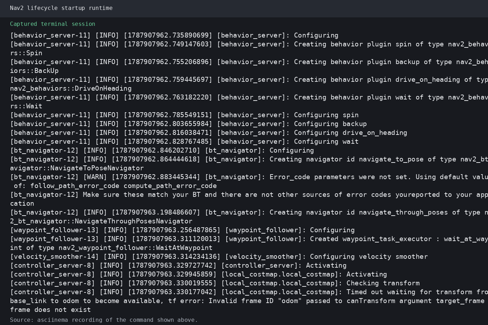

# 第20章 PPT：行为树与恢复行为
> 共 17 页，标注页码 · 图号与教学文档对应

---

## P1

# 行为树与恢复行为

**课程**：ROS2 Python 编程　**章节**：第20章　**课时**：2 课时（90 分钟）
**教学方式**：讲授 + 演示

<!-- 旁白：同学们好，今天我们进入第20章行为树与恢复行为。行为树是 Nav2 的调度大脑：它把"导航、避障、恢复"等原子能力编排成可读的决策流程，而恢复行为是机器人在导航失败时的"自救策略"。本页先交代章节定位，建议同学们边学边想：如果机器人卡在墙角，行为树会怎样让它脱困？ -->

---

## P2

### 学习目标

- 理解行为树的基本概念、节点类型与三态执行模型
- 掌握 Nav2 默认行为树的结构与执行流程
- 了解恢复行为的触发机制与六种恢复行为的用途
- 掌握使用 py_trees 自定义条件节点与动作节点
- 能够将节点组装为自定义行为树并配置加载
- 掌握行为树状态订阅与 Groot 可视化调试方法

<!-- 旁白：学习目标从概念到工程递进：前三条解决"看得懂"，后三条解决"写得出来"。请记住第 4 条的关键词是 py_trees——Nav2 行为树节点的官方 Python 库，后续编程题直接使用它，同学们需要能在代码中区分四种注册方式。 -->

---

## P3

### 为什么用行为树

- **要点：** 传统决策的可读性问题；行为树的组成与优势

机器人任务决策的传统实现容易陷入"状态过多、逻辑易乱"的困境，行为树用树状结构把决策拆分、并支持任意复杂节点复用。

| 特性 | 状态机（FSM） | 行为树（BT） |
|------|--------------|-------------|
| 流程描述 | 状态与转移表 | 树状层级结构 |
| 可读性 | 状态多时难维护 | 直观、易读 |
| 复用性 | 状态复用困难 | 子树可整体复用 |
| 并发表达 | 需要额外机制 | Parallel 节点原生支持 |
| 失败处理 | 需要手写转移 | Fallback 节点自动回退 |

**行为树的核心设计：**

- 控制节点决定子节点执行方式，叶节点执行具体动作或判断
- 每个节点每次行为都必须返回 `SUCCESS` / `FAILURE` / `RUN` 之一
- 同一棵子树可挂在任意层级，构成模块化的"执行策略库"

<!-- 旁白：与状态机相比，行为树最大的优势是"决策显式化"：树结构本身就是流程图，父子关系一目了然；子树还能像零件一样被反复装配。控制节点和叶节点的分工让失败处理不需要手写状态转移，后续章节的 Nav2 默认树就是这套思想的官方范本。 -->

---

## P4

### 行为树节点类型与执行状态

- **要点：** 控制节点四成员；叶节点两类；三态执行模型

**节点类型：**

| 类型 | 作用 | 典型节点 |
|------|------|---------|
| Control | 控制子节点执行顺序 | Sequence、Fallback、Parallel |
| Decorator | 修饰子节点的行为 | Inverter、Retry、Repeat、Timeout |
| Action | 执行具体动作 | NavigateToPose、Spin、BackUp |
| Condition | 检查条件是否满足 | IsBatteryLow、IsPathValid |

**执行状态（三态）：**

- `SUCCESS`：节点任务已成功完成
- `FAILURE`：节点任务失败（可被 Fallback 捕获）
- `RUN`：节点任务仍在执行中（行为树特有，驱动多帧节奏）

<!-- 旁白：节点类型是行为树的"词法表"：Sequence 是"全部做完才算成功"，Fallback 是"做成一个就算成功"，Parallel 是"同时推进，按策略汇总"，Decorator 像包装纸一样给子节点加限制或重试。三态中的 RUN 意义重大——它让一棵树可以被反复 tick 而不必每帧重建，NavigateToPose 这类长任务正是靠 RUN 保持在执行中。 -->

---

## P5

### Nav2 默认行为树结构

- **要点：** bt_navigator 加载树；默认框架与恢复子树的挂载点

bt_navigator 是行为树的服务端：通过 `default_bt_xml_filename` 参数指定 XML 文件，把导航目标、代价地图、底盘等能力暴露给树节点。



图：Nav2 架构中 behavior tree 与 planner、controller、recovery 的关系

**默认树框架（方式一与二的多模封装）：**

```xml
<root main_tree_to_execute="MainTree">
  <BehaviorTree ID="MainTree">
    <Sequence name="Main">
      <Fallback name="Goal Selector"/>
      <RecoveryNode name="Recovery"/>
    </Sequence>
  </BehaviorTree>
</root>
```

- 目标选择（NavigateToPose）与恢复（RecoveryNode）分层挂载，任何一级失败都进入恢复分支

<!-- 旁白：Nav2 的默认树把"选择目标"与"处理失败"分成两个独立分支：主分支负责执行，恢复分支负责兜底。任何子节点失败，行为都会切到恢复分支做自救，成功后再回到主分支继续。理解这个框架是后续自定义树的起点，恢复分支的具体内容见下两页。 -->

---

## P6

### 恢复行为机制

- **要点：** RecoveryNode 语义；触发条件；默认恢复序列

恢复行为是"导航失败时的自救动作"。RecoveryNode 包裹一个主任务：主任务失败时按序执行恢复动作，全部恢复失败才返回 `FAILURE`。

**触发恢复的典型场景：**

- 全局路径规划失败（目标不可达、代价地图异常）
- 路径跟踪卡住（速度过小、长时间无进展）
- 目标位姿校验失败或 TF 缺失
- 用户显式请求清除代价地图

**Nav2 默认恢复序列：** `Spin → Wait → BackUp → ClearEntireCostmap`

- 先原地旋转寻找新的可行路径，再等待，再后退一段，最后清除整张代价地图重新规划
- 恢复动作执行成功后立即回到主任务重试，避免"僵死"式失败

<!-- 旁白：恢复机制的理念是"失败不放弃，先自救再重试"。RecoveryNode 的循环语义让它天然具备重试能力：Warm 失败就依次执行 Spin、Wait、BackUp、清图，每步成功都会让主任务获得一次重试机会。注意默认序列是官方准则，生产部署时通常按底盘能力裁剪——没有旋转能力的底盘应去掉 Spin。 -->

---

## P7

### 六种恢复行为对比

- **要点：** 六种恢复的用途、参数与适用场景

| 恢复行为 | 动作 | 关键参数 | 适用场景 |
|---------|------|---------|---------|
| Spin | 原地旋转指定角度 | yaw、time_allowance | 被局部障碍卡住，换朝向重启规划 |
| Wait | 原地等待一段时间 | wait_duration | 动态障碍密集，等待让路 |
| BackUp | 沿车体方向后退一段 | backup_dist | 前方被挡，后退重选路线 |
| ClearCostmapExceptRegion | 清除指定区域外代价 | reset_distance | 仅清除机器人周围区域 |
| ClearEntireCostmap | 清除整张代价地图 | 无 | 代价图异常或长期无法规划 |
| ClearCostmapAroundPose | 清除目标点邻近区域 | use_footprint | 目标点附近代价异常 |

- 恢复行为通过各自的服务（如 `/clear_entire_costmap`）触发，也可在行为树中被节点直接调用

<!-- 旁白：六种恢复行为可归纳为三对：转向类（Spin）、等待类（Wait）、移动类（BackUp）加上三档清图（区域外、整张、目标点）。选型原则是"最小干预"：能用 Spin 解决就不用清图，清图会失去历史障碍信息、可能带来新的风险。参数方面 Spin 的 yaw 默认按面朝方向转，time_allowance 是它的超时保护。 -->

---

## P8

### 自定义恢复行为：Spin 的实现

- **要点：** 用 ActionClient 调用 /spin 动作；姿态旋转与状态检查

恢复行为的实现模式是"包装一个 Nav2 动作/服务"：节点创建动作客户端，把目标发给对应服务器，tick 期间轮询结果并映射为三态。

```python
class Spin(rclpy.node.Node):
    def __init__(self):
        super().__init__('spin_node')
        self._client = ActionClient(self, SpinAction, '/spin')
        self._goal = SpinAction.Goal()
        self._goal.yaw = 3.14159        # 旋转 180 度
        self._goal.time_allowance = 10.0  # 超时秒数

    def execute(self):
        self._send_goal_future = self._client.send_goal_async(self._goal)
        rclpy.spin_until_future_complete(self, self._send_goal_future)
        self._get_result_future = self._client.get_result_async(
            self._send_goal_future.result())
        rclpy.spin_until_future_complete(self, self._get_result_future)
        if self._get_result_future.result().status == 4:  # STATUS_SUCCEEDED
            return True
        return False
```

- 目标字段：`yaw` 指定旋转量，`time_allowance` 作为超时保护
- 关键检查：结果状态 `status == 4` 表示 `STATUS_SUCCEEDED`，其余按失败处理

<!-- 旁白：任何恢复行为在代码层都是三句话：发目标、等结果、查状态。send_goal_async 后必须等待两个 future——先等服务器接受目标，再等结果返回；status 值 4 对应动作结果成功，Nav2 在 status 字段中枚举了全部状态码。time_allowance 是安全网：机器人卡住旋转不完成时，超时能保证任务继续走恢复链条。 -->

---

## P9

### 清除代价地图的配置

- **要点：** 代价地图插件参数；清除服务与行为树触发

代价地图的清除依赖地图插件与 `always_send_full_costmap` 等参数的配合：

```yaml
obstacles_layer:
  plugins: ["obstacles_layer"]
  obstacles_layer:
    plugin: "nav2_costmap_2d::ObstacleLayer"
    footprint_padding: 0.01          # 轮廓填充
    always_send_full_costmap: true   # 必须为 true，否则无法清整张地图
    rolling_window: false            # 关闭滚动窗口，避免清除后立即重建
```

**触发清除的两种方式：**

- 服务方式：调用 `/clear_entire_costmap`、`/clear_costmap_around_pose` 等 Nav2 服务
- 行为树方式：在自定义树中挂载 ClearEntireCostmap 节点，恢复节点触发后自动调用

<!-- 旁白：清图是"最后手段"，配置上有两个高频坑：一是 always_send_full_costmap 必须为 true，否则服务端认为没必要下发整张地图，清除不生效；二是 rolling_window 若开启，清除后传感器数据会立刻重建障碍，清理等于白做。实际项目中清图前建议先确认为什么代价异常——常是传感器误报或 TF 抖动。 -->

---

## P10

### 自定义条件节点：BatteryCheck

- **要点：** py_trees 条件节点模板；tick 返回三态；注册到行为树

条件节点不做动作，只回答"是否满足"：Nav2 的行为树节点基于 py_trees 编写，继承 Behaviour 并实现 `update()` 即可。

```python
import py_trees

class BatteryCheck(py_trees.behaviour.Behaviour):
    def __init__(self, name, threshold=30.0):
        super().__init__(name)
        self.threshold = threshold

    def update(self):
        battery = get_battery_percent()          # 订阅 /battery_state
        if battery < self.threshold:
            return py_trees.common.Status.FAILURE
        return py_trees.common.Status.SUCCESS
```

- `FAILURE` 让外层 Fallback 转去"回充"分支，实现"电量不足先充电再导航"
- 注册：把节点类通过 `BehaviorServer` 的插件机制加载，供行为 XML 中的 `<BatteryCheck/>` 引用

<!-- 旁白：条件节点是行为树的"传感器"：它通过订阅话题或轮询话题判断条件，例如电量不足返回 FAILURE，外层 Fallback 就会切换到回充子树。注意条件是轻量轮询，不要在 update 里做耗时计算；条件节点的返回值语义是"现在是否可以继续"，与 Action 节点的长任务语义完全不同。 -->

---

## P11

### 自定义动作节点：NavigateToPose 封装

- **要点：** 动作客户端封装；目标构造；与 ClearCostmap 服务的协作

动作节点封装"长任务"：发起目标、等待完成，把动作结果映射为行为树状态。

```python
class NavigateToPoseAction:
    def __init__(self, node):
        self._node = node
        self._client = ActionClient(node, NavigateToPose, '/navigate_to_pose')
        self._goal = NavigateToPose.Goal()
        self._goal.pose.header.frame_id = 'map'
        self._goal.pose.pose.position.y = 2.0
        self._goal.pose.pose.orientation.w = 1.0
        self._goal.behavior_tree = ''   # 空表示使用 bt_navigator 默认树

    def cleanup(self):
        self._client.destroy()
```

**与代价地图服务的协作模式：**

- 目标构造时明确 `frame_id='map'` 与目标姿态的四元数
- 导航失败时先调用清除服务（如 `/clear_entire_costmap`），再重新发送目标，实现"清障重试"闭环

<!-- 旁白：动作节点的封装要点是目标对象完整：frame_id、位置、姿态、behavior_tree 四个字段缺一不可，orientation.w = 1.0 表示零旋转的默认姿态；cleanup 里必须销毁客户端，避免节点反复创建时的资源泄漏。把"导航→失败→清图→重试"写成闭环，正是训练巡逻型任务的常见组合。 -->

---

## P12

### 自定义行为树组装

- **要点：** XML 组装；patrol 巡逻树；循环与重试装饰器

行为树通过 XML 定义：控制节点组装叶子，Decorator 添加循环与重试语义。

```xml
<BehaviorTree ID="MainTree">
  <Sequence name="Patrol">
    <NavigateToPose id="waypoint_1"/>
    <Wait wait_duration="5.0"/>
    <NavigateToPose id="waypoint_2"/>
    <Wait wait_duration="5.0"/>
  </Sequence>
</BehaviorTree>
```

**巡逻任务的关键装饰器：**

- `<Repeat num_cycles="-1"/>`：让整棵巡逻树无限循环（`-1` 表示无限）
- `<RetryUntilSuccess num_attempts="3"/>`：单点导航失败最多重试 3 次
- 装载方式：`default_bt_xml_filename` 指向该 XML，bt_navigator 启动时加载

<!-- 旁白：组装树的思路是"先定主流程，再补恢复"：这条巡逻树以 Sequence 依次访问两个航点，每个航点停留 5 秒；Repeat 的 num_cycles 取 -1 表示无限循环，配合 RetryUntilSuccess 使单点失败不至于终止整棵树。同学们可在此基础上把 Wait 换成 BatteryCheck，得到"电量不足即回充"的完整巡检任务。 -->

---

## P13

### 行为树调试与 Groot 可视化

- **要点：** bt_status 话题；rqt_bt_monitor；Groot2 连接与参数

Nav2 提供了"状态可观测"的调试管道，从话题到可视化层层递进：

- 话题监控：订阅 `/bt_navigator/bt_status`，观察行为树每 tick 的当前活动状态
- 动作状态：`/navigate_to_pose/_action/status` 反馈导航目标生命周期
- 实时面板：`ros2 run rqt_bt_monitor rqt_bt_monitor` 以列表显示各节点状态
- 可视化调试：Groot2 通过 WebSocket 连接 bt_navigator，树中每个节点高亮显示 `RUN/SUCCESS/FAILURE`
- 参数定位：`default_bt_xml_filename` 指定了当前加载的是哪棵 XML 树，排障先确认它

<!-- 旁白：行为树的排障三板斧：先订阅 bt_status 看"树走到哪一步"，再用 rqt_bt_monitor 看节点级状态，最后用 Groot2 把整棵树可视化——卡在哪个节点、返回什么状态一目了然。选型注意 rqt_bt_monitor 直观但信息少，Groot2 功能全但需要额外连接配置；官方文档与 The Construct 教程都有现成的 Groot2 连接模板。 -->

---

## P14

### 实战案例：多机器人巡逻调度

- **要点：** 多机器人并发控制；任务文件驱动；恢复策略按需配置

通过行为树 + 动作客户端，一个调度器即可驱动多台机器人协同巡逻：

```python
class MultiRobotScheduler:
    def __init__(self, node, robots):
        self._node = node
        self._clients = {}                     # 每台机器人一个客户端
        for name in robots:
            self._clients[name] = ActionClient(
                node, NavigateToPose, f'/{name}/navigate_to_pose')

    def load_tasks(self, filepath):
        with open(filepath, 'r') as f:         # tasks.yaml
            return yaml.safe_load(f)['tasks']  # 每项含 x / y / 恢复策略

    def start(self):
        for task in self.load_tasks('tasks.yaml'):
            goal = NavigateToPose.Goal()
            goal.pose.header.frame_id = 'map'
            goal.pose.pose.position.x = task['x']
            goal.pose.pose.position.y = task['y']
            tree = self._get_bt(task.get('recovery_strategy'))
            self._clients[task['robot']].send_goal_async(goal, tree=tree)
```



图：多机器人调度下各机器人按各自导航目标运行


- 每台机器人独立的动作服务器；任务文件（tasks.yaml）驱动调度
- 恢复策略可写成不同子树：普通巡逻用默认恢复，物流任务用"失败即回中转站"

<!-- 旁白：多机器人调度的关键点是"命名空间隔离"：每台机器人的动作服务器地址是 /机器人名/navigate_to_pose，调度器只需维护名字到客户端的映射，就能并发向全部机器人派发目标。任务文件中既给坐标，也给恢复策略的下标，把"去哪"和"怎么自救"解耦。演示图中多台机器人各走各的路径，验证了行为树在合作任务中的可扩展性。 -->

---

## P15

### 本章要点

- 行为树 = 控制节点（Sequence/Fallback/Parallel/Decorator）+ 叶节点（Action/Condition），状态三态 `SUCCESS / FAILURE / RUN`
- Nav2 以 bt_navigator 加载 `default_bt_xml_filename` 指定的 XML 树，主流程与恢复分支分层挂载
- RecoveryNode 语义为"失败即自救"：默认序列 `Spin → Wait → BackUp → ClearEntireCostmap`，六种恢复可按底盘裁剪
- 恢复行为 = 动作客户端包装：send_goal_async → 等 future → 查 status（4 表示成功）
- 自定义节点基于 py_trees：继承 Behaviour 实现 update()，条件返回三态，动作封装长任务
- 调试三板斧：bt_status 话题、rqt_bt_monitor、Groot2 可视化，排障先确认 XML 加载项

<!-- 旁白：本页把六条要点浓缩为三维框架：结构（节点与三态）、执行（默认树与恢复序列）、扩展（py_trees 自定义）。请同学们自检：能否默写 RecoveryNode 的默认恢复序列，能否说出 status==4 的含义，能否用 py_trees 写一个电量判断节点？下页练习围绕这三问展开。 -->

---

## P16

### 练习题

1. **原理题**：简述行为树三态（SUCCESS / FAILURE / RUN）的含义，说明 RUN 状态对长任务节点（如导航）的意义。
2. **配置题**：为差速机器人配置恢复行为序列，要求删除 Spin 并说明理由；给出对应的 YAML 配置片段。
3. **编程题**：使用 py_trees 实现一个检查 `on/off` 话题的条件节点，在外部节点中实现超时附件的编写。
4. **分析题**：分析执行不同子树（如回充子树 vs 巡逻子树）场景中 Fallback 节点与 RecoveryNode 的异同。
5. **操作题**：在 Nav2 仿真中发送导航目标后，通过 rqt_bt_monitor 和 bt_status 观察行为树状态变化，并记录执行顺序。
6. **设计题**：使用自定义行为树实现"巡逻—发现目标—报站等待"任务，要求包含条件节点、动作节点与恢复分支，并画出 XML 结构。

<!-- 旁白：练习 1 与 2 考查本章核心概念，练习 3 是 py_trees 编程基本功，练习 4 关注两种失败处理机制的区别，练习 5 是操作流程训练，练习 6 综合题把巡逻、报站与恢复串成一棵完整的行为树。做完第 6 题，同学们就具备了把任意任务"树化"的能力。 -->

---

## P17

### 下章预告：第21章 视觉SLAM导论

行为树解决了"如何组织任务"，下一章转向"机器人如何认识自己身在何处"。

- 视觉 SLAM 的基本原理：特征提取、帧间匹配、建图与定位
- 视觉里程计与后端优化的分工
- 视觉建图在 Nav2 中的融合方式

<!-- 旁白：本章是"任务决策"的收官，下一章进入"感知与定位"。行为树编排任务，SLAM 提供位置认知，两者结合才构成完整的自主导航闭环。请同学们课下预习视觉特征点（如 ORB）与帧间匹配的基本流程，为下一章做准备。 -->