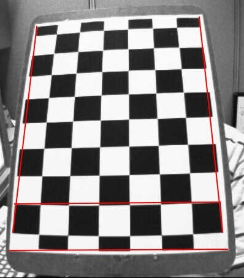
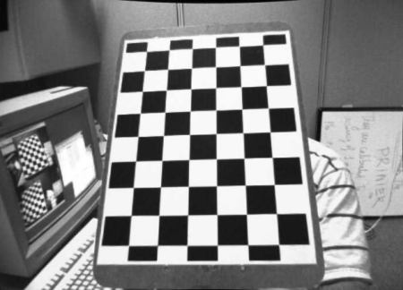
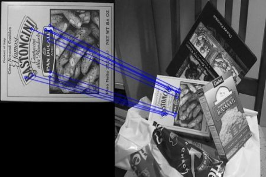

# 第21章 PPT：视觉SLAM导论

> 共 17 页，标注页码 · 图号与教学文档对应

---

## P1 · 标题页

- 课程：ROS2 Python 编程
- 章节：第 21 章 视觉 SLAM 导论
- 课时：2 课时
- 内容：视觉 SLAM 概述、相机模型、ORB-SLAM、DSO 直接法、RGB-D SLAM、融合策略

<!-- 旁白：欢迎来到第 21 章！本次课共 2 课时 90 分钟，我们要从一只相机的视角讲到完整 SLAM 框架。本章内容分为六块：视觉 SLAM 概述、相机模型、ORB-SLAM、DSO 直接法、RGB-D SLAM 和融合策略，听起来多，其实都围绕一个核心问题——如何让机器人看见世界并知道自己在哪。 -->

---

## P2 · 学习目标

- 理解视觉 SLAM 的基本原理和经典框架
- 掌握 ORB-SLAM2/3 的特征提取与跟踪方法
- 了解 DSO 直接法和 RGB-D SLAM 的原理
- 熟悉视觉特征提取与匹配技术
- 掌握视觉与激光融合 SLAM 的策略

<!-- 旁白：六条学习目标可以分成两半：前两条讲原理与经典框架，重点是 ORB-SLAM 的三线程结构；后四条从特征匹配一路到多传感器融合，偏工程实践。学完本章你应该能回答两个问题——视觉 SLAM 为什么难，以及光照、纹理、算力这些约束如何影响方案选型。 -->

---

## P3 · 视觉 SLAM 概述

- 视觉 SLAM 与激光 SLAM 的比较：视觉信息丰富、成本低，但受光照影响大
- 相机类型：

| 类型 | 特点 | 输出 |
| --- | --- | --- |
| 单目 | 无法直接恢复尺度 | 图像 |
| 双目 | 视差恢复深度 | 图像 + 深度 |
| RGB-D | 直接深度测量 | 图像 + 深度图 |

- 经典框架：前端（特征提取与匹配）→ 后端（优化）→ 回环检测 → 建图
- 特征法以重投影误差最小化为核心，直接法以光度误差最小化为核心

<!-- 旁白：这张相机对比表值得多看一眼：单目便宜但恢复不了尺度，双目靠视差算深度，RGB-D 直接给出深度图，工程上各有取舍。再记住一条主线——经典框架就是前端提特征、后端做优化、回环消漂移、最后建图，后面要讲的每个算法都能挂到这条流水线上。 -->

---

## P4 · 相机模型与 ROS2 接口

- 针孔相机模型：内参 fx、fy、cx、cy 描述像素与三维点投影关系
- 畸变模型：径向畸变 + 切向畸变，标定后修正




- ROS2 图像传输：原生 image_transport 支持 Raw / Compressed / Theora 三种话题格式
- 原始图像转压缩图像：

```
ros2 run image_transport republish raw in:=/camera/image_raw compressed out:=/camera/image_color
```

- 小分辨率（如 320×180）可大幅降低传输带宽与处理负载，适合 SLAM 前处理

<!-- 旁白：这两张图直观展示了镜头畸变：上图是径向畸变把边缘直线拉弯的效果，下图是标定去畸变后的校正结果。工程上必须先标定内参与畸变系数再谈 SLAM 精度。别忘了 image_transport 的 republish 命令——把原始图像压成 JPEG、降到 320×180，能省下大量带宽。 -->

---

## P5 · 视觉特征提取与匹配

- ORB 特征 = **FAST 关键点 + BRIEF 描述子**
- 提取器参数：

```
orb = cv2.ORB_create(nfeatures=1000, scaleFactor=1.2, nlevels=8)
```

- 匹配采用汉明距离度量，最近邻 + 次近邻比值法：

```
matches = bf.knnMatch(des1, des2, k=2)
good = [m for m, n in matches if m.distance < 0.75 * n.distance]
```

- Lowe 比率测试（阈值 0.75）：保留距离明显优于次近邻的匹配，剔除误匹配



<!-- 旁白：这张图是 ORB 特征匹配的可视化结果：那些连线把两帧图像的特征点一一对应起来，它们就是估计相机运动的原料。FAST 负责找角点、BRIEF 生成描述子，匹配时用汉明距离。重点体会 Lowe 比率测试的作用：0.75 的阈值会把"次近邻也很接近"的歧义匹配全部剔除，画面里杂乱交叉的误匹配正是这样消掉的。 -->

---

## P6 · ORB-SLAM 三线程架构

- 三线程并行协作：

| 线程 | 职责 | 关键点 |
| --- | --- | --- |
| 跟踪 Tracking | 逐帧定位相机位姿 | 特征匹配 + 运动模型 |
| 建图 LocalMapping | 维护局部地图 | 关键帧筛选、三角化 |
| 回环 LoopClosing | 消除累积漂移 | 词袋检测 + 闭环优化 |

- 地图点（MapPoint）：多个关键帧观测三角化得到，重投影验证多次剔除外点

<!-- 旁白：这张三线程表格是 ORB-SLAM 的灵魂：Tracking 每帧定位相机位姿，LocalMapping 挑关键帧做三角化，LoopClosing 用词袋发现"回到了老地方"并消除累积漂移。三者共享同一份地图点协作，任何一环掉队整条流水线都会停摆。 -->

---

## P7 · 重投影误差与 BA

- 重投影误差：3D 地图点按位姿投影到图像，与检测点之间的像素误差
- 目标函数：最小化所有观测的重投影误差平方和

```
E = Σ || z_ij - π(T_i, P_j) ||²
```

- BA（Bundle Adjustment）在局部建图和回环后优化相机位姿与地图点
- 局部 BA 只优化共视关键帧，全局 BA 处理回环修正累积漂移

<!-- 旁白：公式看着吓人，思路其实朴素：把三维地图点按当前位姿投影回图像，和实际检测到的像素位置求差，差的平方和越小，位姿就越可信。BA 就是同时优化位姿和地图点的大号最小二乘——局部 BA 只处理共视关键帧，全局 BA 则在回环之后一次性修正累积误差。 -->

---

## P8 · RealSense D415 相机配置

- D415 为 RGB-D 相机，支持单目 + 双目立体深度
- 相机参数文件（D415.yaml）：

| 参数 | 数值 |
| --- | --- |
| 模型 | PinHole |
| fx / fy | 615.0 |
| cx / cy | 320 / 240 |

- 内参矩阵用于初始化三角化与 BA 投影模型
- 发布频率建议与 SLAM 处理速度匹配，避免队列堆积

<!-- 旁白：这张内参表要和代码里的参数文件逐一对应：模型 PinHole、fx 和 fy 都是 615、cx 和 cy 是 320 和 240。内参直接决定三角化初始化和 BA 的投影模型，换相机就必须重新标定。频率匹配也常被忽视——图像发布太快而 SLAM 处理不过来，队列堆积只会徒增延迟。 -->

---

## P9 · EVO 轨迹评估

- 评估指标：绝对位姿误差（ATE）、相对位姿误差（RPE）
- 常用命令：

```
evo_traj tum traj.txt --ref ref.txt -a          # 对齐并绘制轨迹
evo_ape tum traj.txt ref.txt -a                 # 绝对位姿误差
evo_rpe tum traj.txt ref.txt -a                 # 相对位姿误差
```

- `-a` 使用 Umeyama 算法对齐（单目可用 `-as` 仅做尺度对齐）
- 支持的格式：TUM、KITTI、EuRoC
- 用于对比不同 SLAM 算法在相同数据集上的精度

<!-- 旁白：跑完 SLAM 一定要用 EVO 量化评估，别只靠肉眼对比轨迹。三条命令分别对应轨迹对齐绘图、绝对位姿误差和相对位姿误差，`-a` 参数用 Umeyama 算法对齐，单目系统记得加 `-s` 处理尺度。EVO 支持 TUM、KITTI、EuRoC 三种格式，对比不同算法时保持数据集一致即可。 -->

---

## P10 · 直接法 DSO

- DSO（Direct Sparse Odometry）：最小化**光度误差**而非重投影误差
- 不计算特征描述子，直接利用像素灰度值估计位姿
- 相机需要**光度标定**：曝光时间、伽马响应、渐晕
- 优化框架：图像金字塔 + Gauss-Newton 迭代 + 逆深度参数化
- SE3 指数映射 `_se3_exp`：将李代数增量映射为位姿变化

<!-- 旁白：DSO 换了一条路：不做特征、不算描述子，直接拿像素灰度做文章，最小化的是光度误差。代价是必须做光度标定——曝光时间、伽马响应、渐晕效应都要建模。图像金字塔加 Gauss-Newton 迭代、逆深度参数化这些设计，都是为了在稀疏的高梯度像素上稳定求解。 -->

---

## P11 · RGB-D SLAM

- 深度图直接提供尺度，无需三角化初始化
- 关键帧判定：平移 > 0.1 或旋转 > 0.3 时插入新关键帧
- 建图方式：

| 方法 | 配置 | 特点 |
| --- | --- | --- |
| TSDF 融合 | voxel_length=0.01、sdf_trunc=0.03 | 隐式曲面，内存友好 |
| 点云拼接 | depth_trunc=5.0 | 直观但冗余大 |

- TSDF 适合实时局部建图，稠密点云适合最终地图输出

<!-- 旁白：RGB-D 相机把最头疼的尺度问题直接解决了：深度图自带尺度，不用三角化初始化。关键帧判定条件记一下——平移超过 0.1 米或旋转超过 0.3 弧度才插入新关键帧。建图二选一：TSDF 融合内存友好适合实时，点云拼接直观但冗余大，适合出最终地图。 -->

---

## P12 · 特征法 vs 直接法

| 维度 | 特征法（间接法） | 直接法 |
| --- | --- | --- |
| 误差项 | 重投影误差 | 光度误差 |
| 特征提取 | 需要 | 不需要 |
| 光照鲁棒 | 较好 | 敏感（需光度标定） |
| 纹理要求 | 有特征即可 | 梯度丰富区域 |
| 典型代表 | ORB-SLAM | DSO |
| 精度 | 高质量稀疏地图 | 半稠密、稠密 |

- 适用场景：特征法适合结构化环境；直接法适合视觉退化但纹理丰富的环境

<!-- 旁白：这张六行对比表是特征法和直接法的正面交锋：误差项一个用重投影、一个用光度，直接法省掉了特征提取，但对光照变化敏感、需要光度标定。选型口诀很简单——结构化环境、要稀疏高精度地图选 ORB-SLAM；纹理丰富但视觉退化、要稠密地图选 DSO。 -->

---

## P13 · 多传感器融合策略

| 耦合方式 | 原理 | 代表 |
| --- | --- | --- |
| 松耦合 | 各系统独立求解后融合 | LIC-Fusion |
| 紧耦合 | 统一状态量联合优化 | LVI-SAM、R3LIVE |

- VIO（视觉惯性里程计）原理：IMU 预积分 + 视觉 BA 联合优化
- LVI-SAM 启动：激光 + 视觉 + IMU 三源紧耦合实时建图
- 停车场场景选型：VINS-Fusion / FAST-LIO2 / Cartographer 3D，叠加位姿图与关键帧图像库应对光照变化与重复纹理

<!-- 旁白：融合策略表只记两行：松耦合是各系统独立求解后再融合，实现简单；紧耦合把所有传感器的状态量放进一个优化问题联合求解，精度高但计算重，代表是 LVI-SAM 和 R3LIVE。停车场案例提醒我们，光照变化加重复纹理是纯视觉的天敌，必须叠加位姿图与关键帧图像库兜底。 -->

---

## P14 · VIO 与工程要点

- VINS-Mono 简化实现：滑窗优化视觉 + 惯性误差，先由 IMU 预积分提供初值
- 工程建议：
  - 相机与 IMU 需要**外参标定**（旋转 + 平移）
  - IMU 频率高（100 Hz 以上），图像频率低（10~30 Hz），时间对齐是关键
  - 车辆起步易导致视觉退化，可用初始化阶段的静止检测辅助
- 视觉 SLAM 选型取决于场景光照、纹理与计算资源约束

<!-- 旁白：VINS-Mono 的滑窗优化先靠 IMU 预积分提供初值，再联合视觉误差一起优化，这就是 VIO 的骨架。工程上有三条血泪教训：相机与 IMU 的外参标定必须做；IMU 上百赫兹、图像只有一二十赫兹，时间对齐是精度命门；车辆起步瞬间视觉退化严重，要用静止检测来缓解。 -->

---

## P15 · 本章要点

- 视觉 SLAM 框架：前端跟踪、后端优化、回环检测、建图四部分
- ORB 特征集 FAST 角点与 BRIEF 描述子，匹配用汉明距离 + Lowe 比率测试
- ORB-SLAM 三线程并行：跟踪、局部建图、回环闭合
- DSO 以光度误差为核心，需光度标定，适合纹理丰富场景
- RGB-D SLAM 直接获得尺度，TSDF 融合适合实时建图
- 视觉与激光多传感器融合是复杂场景的可靠方案

<!-- 旁白：六条要点正好把本章串成一条线：框架四件套、ORB 特征与匹配、三线程架构、DSO 直接法、RGB-D 建图、多传感器融合。复习时建议按"原理—算法—工程"的顺序过一遍，每一条都能展开讲两分钟，本章就算真正过关了。 -->

---

## P16 · 课后练习

1. 原理题：比较特征法与直接法的异同、优缺点及适用场景
2. 编程题：使用 OpenCV 提取 ORB 特征并实现匹配，用 Lowe 比率测试剔除误匹配
3. 分析题：分析 ORB-SLAM 三个并行线程（跟踪、建图、回环）的协作机制
4. 配置题：配置 ORB-SLAM3 的 ROS2 接口，使用 RealSense D415 实现实时 RGB-D SLAM 建图
5. 操作题：录制含图像与 IMU 数据的 rosbag，使用 EVO 评估轨迹精度
6. 设计题：为大型室内停车场设计视觉+激光+IMU 融合 SLAM 方案，说明传感器配置、融合策略与地图表示

<!-- 旁白：六道题由易到难：前两题练原理和 OpenCV 动手能力，第三题考验对三线程协作的理解，第四题开始碰真实相机配置，第五题学用 EVO 做量化评估，最后一道设计题模拟真实工程选型。建议至少完成前四题，最后两题可以留作课程大作业的起点。 -->

---

## P17 · 下章预告

- 第 22 章：多传感器融合 SLAM
- 内容：IMU+LiDAR 融合、VIO、EKF 与图优化、工程案例

<!-- 旁白：下一章我们进入多传感器融合 SLAM：IMU 加激光的紧耦合、VIO 的 EKF 与图优化，以及完整的工程案例。本章搭好视觉底盘，加上下一章的激光与惯性，你的 SLAM 武库就齐了。下课别走远，我们继续。 -->