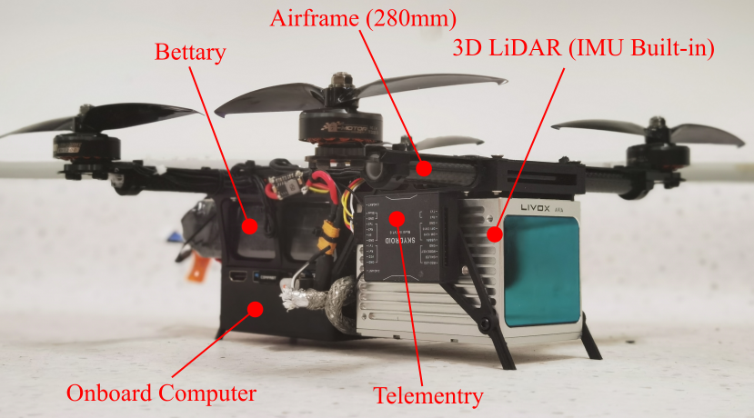
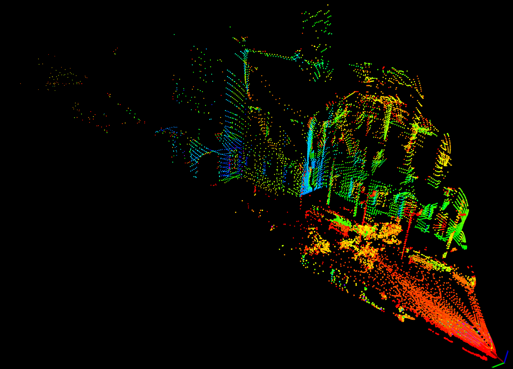
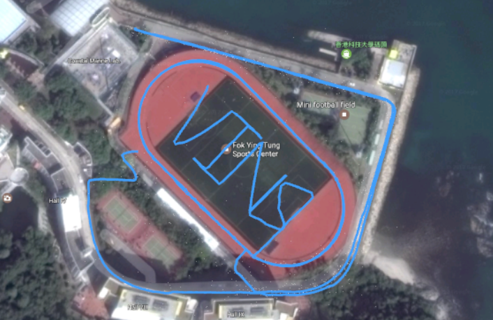

# 第22章 PPT：多传感器融合SLAM

> 共 17 页，标注页码 · 图号与教学文档对应

---

## P1 · 标题页

- 课程：ROS2 Python 编程
- 章节：第 22 章 多传感器融合 SLAM
- 课时：2 课时
- 内容：融合框架、IMU+LiDAR、VIO、EKF 与因子图、工程案例

<!-- 旁白：欢迎来到第 22 章！本次课共 2 课时 90 分钟，主题是多传感器融合 SLAM。上一章我们只用一只相机做 SLAM，这一章把 IMU、LiDAR、视觉全部装上车：先讲融合的必要性与框架，再深入 IMU+LiDAR、VIO、EKF 与因子图两条融合路线，最后看真实工程案例。 -->

---

## P2 · 学习目标

- 理解多传感器融合 SLAM 的必要性和基本框架
- 掌握 IMU+LiDAR 融合的原理与方法
- 掌握视觉+IMU 融合（VIO）的原理
- 熟悉 Kalman 滤波和图优化两种融合框架
- 了解实际工程中的多传感器融合案例

<!-- 旁白：五条目标同样分两半：前两条回答融合的"为什么"并讲 IMU+LiDAR 的主流做法，第三条进入 VIO；后两条把 Kalman 滤波和因子图两种框架摆在一起，再用工程案例收尾。学完你要能回答：什么时候该用滤波，什么时候该上因子图。 -->

---

## P3 · 为什么需要多传感器融合

- 单一传感器局限：
  - LiDAR：几何精确，但玻璃、镜面易退化
  - 相机：纹理丰富，但光照变化、快速运动易失效
  - IMU：高频无漂移短期，但长期积分漂移大
  - 轮式里程计：短时稳定，累积误差明显
- 融合框架：前端多源观测 → 状态估计（滤波 / 图优化）→ 后端一致性维护
- 耦合方式：**松耦合**（独立求解后融合）与**紧耦合**（统一状态联合优化）

<!-- 旁白：这一页先讲融合的动机：LiDAR 怕玻璃镜面、相机怕光照和快速运动、IMU 长期积分必漂移，没有任何单一传感器是万能的。记住通用流水线——多源观测进入状态估计，再用后端一致性维护；耦合方式分松紧，后面几页会反复用到这两个词。 -->

---

## P4 · IMU 在 LiDAR SLAM 中的三作用

- **运动畸变校正**：LiDAR 一帧扫描期间载体在运动，IMU 高频数据反推逐点去畸变
- **位姿预测**：为帧间匹配与 Kalman 更新提供先验初值
- **重力约束**：提供重力方向，约束俯仰、横滚自由度，降低定位维度
- Cartographer 官方文档明确将 IMU 列为核心输入

<!-- 旁白：这页只讲一件事：IMU 在 LiDAR SLAM 里干三样活——用高频数据反推逐点去畸变、为帧间匹配提供位姿初值、用重力方向锁定俯仰和横滚。Cartographer 官方文档把 IMU 列为核心输入，这三个作用在下一页 FAST-LIO2 的实现里会全部出现。 -->

---

## P5 · FAST-LIO2 融合实现

- 状态量：15 维（位置、速度、姿态、陀螺偏置、加计偏置、重力）+ 协方差
- 频率：LiDAR 10 Hz、IMU 200 Hz
- 回调结构：

```
imu_callback:   重力加速度置 -9.81
lidar_callback: 五步流程
  1. 畸变校正
  2. 曲率特征提取（80/30 percentile）
  3. scan-to-map 匹配
  4. Kalman 更新
  5. 地图更新
```

- 姿态增量用 so3 指数映射处理，保证旋转的流形一致性





<!-- 旁白：左边是 FAST-LIO2 的系统构成，右边是 AVIA 雷达的扫描效果。状态向量 15 维，LiDAR 10 赫兹、IMU 200 赫兹，五步流程里畸变校正、曲率特征、scan-to-map 匹配、Kalman 更新、地图更新环环相扣。特别注意 so3 指数映射——旋转必须在流形上处理，直接当普通向量加是最容易犯的错。 -->

---

## P6 · IMU 标定与 Cartographer 配置

- IMU 标定内容：零偏（bias）、尺度因子、安装外参、噪声密度
- Cartographer LUA 配置要点：TRAJECTORY_BUILDER_2D 中启用 use_imu_data，配置 IMU 话题与外参
- 标定不良的典型表现：静止时姿态缓慢漂移、z 轴高度发散
- 官方要点：IMU 坐标系约定、上线前用 rosbag 回放验证

<!-- 旁白：IMU 标定要覆盖四件事：零偏、尺度因子、安装外参、噪声密度。标定不良有两个典型症状——静止时姿态缓慢漂移、z 轴高度发散，遇到先查标定。上线前务必用 rosbag 回放验证 LUA 配置，特别是 use_imu_data 与外参是否真的生效。 -->

---

## P7 · VIO：VINS-Mono 滑窗优化

- 滑动窗口：window_size=10，窗口内关键帧联合优化
- IMU 预积分：两帧之间 IMU 积分为视觉 BA 提供初值与约束
- 优化目标：BA 误差 + 边缘化先验
- 边缘化：移除最旧帧时保留其信息作为先验，避免信息丢失
- 视觉 + IMU 融合在无 GPS、纹理差、快速旋转场景下鲁棒性显著提升



<!-- 旁白：这张图是 VINS-Mono 的整体框架：前端视觉跟踪加 IMU 预积分，后端滑动窗口联合优化。窗口大小 10，优化目标是 BA 误差加边缘化先验——边缘化的精髓是把被移除旧帧的信息压缩成先验保留下来，不让信息白白丢掉。这套结构在无 GPS、纹理差、快速旋转的场景里鲁棒性提升非常明显。 -->

---

## P8 · EKF 多传感器融合

- MultiSensorEKF：15 维状态向量 + 协方差矩阵
- 各观测噪声 R：

| 传感器 | R | 特点 |
| --- | --- | --- |
| IMU | 0.1 | 高频，预测为主 |
| LiDAR | 0.05 | 精度高 |
| 视觉 | 0.2 | 中等精度 |
| GPS | 1.0 | 室外绝对定位 |

- predict 用 IMU 高频传播，update 按传感器到达顺序依次修正
- 协方差实时反映定位置信度，可驱动下游行为决策

<!-- 旁白：这张观测噪声表就是 EKF 的工作台：IMU 0.1 高频做预测，LiDAR 0.05 最可信，视觉 0.2 居中，GPS 1.0 只在室外给绝对约束。predict 由 IMU 高频驱动，update 按传感器到达顺序依次修正。还要懂得读协方差矩阵——它实时反映定位置信度，下游行为决策可以直接拿它当依据。 -->

---

## P9 · 图优化：GTSAM

- 因子图节点 = 位姿，边 = 观测约束
- 常用因子：

```
PriorFactorPose2    # 先验因子（锚定）
BetweenFactorPose2  # 相邻位姿约束（里程计）
ImuFactor           # IMU 预积分约束
```

- 图优化框架 vs 滤波框架：图优化可批量重线性化、支持回环，精度更高但计算量大
- 适用：回环丰富的建图任务；滤波适合在线实时定位

<!-- 旁白：因子图把 SLAM 翻译成一张图：节点是位姿，边是约束。三种常用因子对应三种信息来源——先验因子锚定起点、相邻位姿因子来自里程计、IMU 因子来自预积分。对比一下：图优化能批量重线性化、支持回环，精度高但计算量大，所以回环丰富的建图任务用它，在线实时定位用滤波。 -->

---

## P10 · robot_localization 实践

- ekf_node / ukf_node 融合里程计 + IMU，输出 100 Hz 平滑位姿
- 核心思想：**covariance is king**——调参的核心是协方差矩阵
- 遵循 REP-105 坐标系规范：map → odom → base_link
- use_control=false：不依赖控制输入时关闭，减少误差源
- 输出发布到 /odometry/filtered 供 Nav2 使用

<!-- 旁白：robot_localization 是拿来就能用的融合方案：ekf_node 融合里程计和 IMU，输出 100 赫兹平滑位姿。这一页最该记住四个字——covariance is king，调参调的就是协方差矩阵。坐标系遵守 REP-105：map 到 odom 再到 base_link。use_control 关掉，少一个输入就少一个误差源。 -->

---

## P11 · 工程案例：AGV 与自动驾驶

- AGV 案例：
  - 传感器：2D 激光 ×2 + IMU + 编码器 + RFID
  - 融合输出 100 Hz 位姿，地图分辨率 0.05 m
  - RFID 提供绝对位置锚点，消除累积漂移
- 自动驾驶案例：多模式运行（纯激光、纯视觉、GPS 融合、混合），按场景自动切换
- 共性经验：冗余传感器 + 置信度评估 + 故障降级策略

<!-- 旁白：两个案例讲完就能看到共性：AGV 用双激光加 IMU、编码器、RFID，其中 RFID 专门当绝对位置锚点消除累积漂移；自动驾驶系统按场景在纯激光、纯视觉、GPS 融合、混合模式之间自动切换。提炼成三条工程经验——冗余传感器、置信度评估、故障降级策略。 -->

---

## P12 · 时间同步与故障检测

- SensorTimeSynchronizer：
  - ApproximateTimeSynchronizer，slop=0.05
  - 互相关偏移估计在线修正时间戳
  - 条件允许优先硬件触发
- SensorHealthMonitor 超时阈值：

| 传感器 | 超时 |
| --- | --- |
| LiDAR | 0.5 s |
| camera | 1.0 s |
| IMU | 0.2 s |
| GPS | 2.0 s |

- 故障时自动切换备用源并上报状态

<!-- 旁白：时间同步是融合系统的隐形命门：ApproximateTimeSynchronizer 用 slop=0.05 兼容不同频率，互相关估计在线修正时间戳，条件允许优先硬件触发。故障检测这张超时表记三个数就够——LiDAR 0.5 秒、IMU 0.2 秒最严格、GPS 2 秒最宽松，超时即切换备用源并上报。 -->

---

## P13 · 特殊场景：传感器退化与选型

- 玻璃幕墙：激光穿透无回波 → 视觉 / 超声补充
- 高挑空间视觉特征少 → 激光为主
- 金属结构干扰 IMU 磁力计 → 禁用磁力计，依赖陀螺
- 长走廊、隧道：几何约束退化 → 加轮式里程计先验
- 选型原则：先分析场景退化模式，再配置冗余传感器组合

<!-- 旁白：这一页是"退化模式清单"：玻璃幕墙激光穿透没回波，交给视觉和超声；高挑空间视觉特征太少，改为激光为主；金属结构干扰磁力计，直接禁用靠陀螺；长走廊几何约束退化，加轮式里程计兜底。选型原则一句话——先分析场景怎么退化，再配冗余组合。 -->

---

## P14 · 仿真数据同步实践

- 启动仿真：

```
ros2 launch robot_sim_demo gazebo2.launch.py gui:=false
```

- 桥接配置：src/robot_sim_demo/config/gazebo2_bridge.yaml，同步 LiDAR、相机与里程计话题
- 验证时间戳对齐：ros2 topic echo --field header.stamp 对比各传感器
- 注意：本仓库仿真入口仅提供单一 Wheeltec 机器人；FAST-LIO、VINS 等算法需外部部署

<!-- 旁白：仿真实践三步走：launch 一条命令起 Gazebo，桥接配置里把 LiDAR、相机、里程计话题同步出来，再用 ros2 topic echo --field header.stamp 逐个对比验证时间戳对齐。提醒一句：本仓库仿真入口只有单一 Wheeltec 机器人，FAST-LIO、VINS 这些算法需要外部部署。 -->

---

## P15 · 本章要点

- 融合的本质：用多源观测弥补单传感器退化与漂移
- IMU 三作用：运动畸变校正、位姿预测、重力约束
- FAST-LIO2：15 维状态、IEKF 迭代更新、so3 流形一致性
- EKF 与图优化各有适用场景，GTSAM 因子图支持回环
- robot_localization 调参核心是协方差矩阵（covariance is king）
- 工程落地离不开时间同步、故障检测与降级策略

<!-- 旁白：六条要点就是本章的审计清单：融合本质、IMU 三作用、FAST-LIO2 的 IEKF 与 so3 流形、EKF 与图优化的分工、covariance is king、时间同步与降级策略。能把这六条各自展开讲两分钟，多传感器融合这一章就算真正掌握了。 -->

---

## P16 · 课后练习

1. 原理题：比较松耦合与紧耦合的原理差异，说明为什么紧耦合精度更高
2. 编程题：实现一个简化 EKF，融合激光里程计与 IMU 输出位姿
3. 分析题：分析 IMU 在 LiDAR SLAM 中的三个作用：运动畸变校正、位姿预测、重力约束
4. 配置题：为 Cartographer 编写激光 + IMU + 里程计融合的 LUA 配置
5. 操作题：录制含激光、IMU、里程计的 rosbag，用 FAST-LIO2 或同类算法建图并评估
6. 设计题：为机场候机楼清洁机器人设计融合方案（玻璃幕墙激光穿透、高挑空间视觉特征少、金属结构 IMU 干扰），说明传感器选型、融合策略与应急方案

<!-- 旁白：六道题从原理到工程：前两题打基础——松紧耦合对比和手写简化 EKF；第三题回顾 IMU 三作用；第四题写 Cartographer 的 LUA 配置；第五题录包上 FAST-LIO2 建图评估；第六题是机场清洁机器人设计题，玻璃幕墙、高挑空间、金属结构三个坑都在题面里，就看你能不能配出合理的冗余组合。 -->

---

## P17 · 下章预告

- 第 23 章：SLAM 与导航综合实训
- 内容：建图到导航完整流程、多机器人调度、项目文档规范

<!-- 旁白：下一章是 SLAM 与导航综合实训：从建图到导航的完整流程、多机器人调度和项目文档规范。前两章的激光、视觉、融合知识会在下一章合体落地，提前把实验环境准备好。下课，我们下节课见！ -->