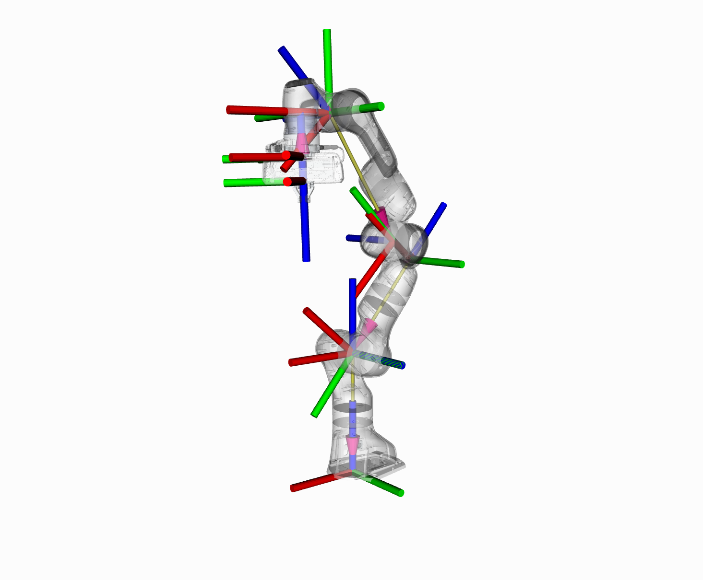
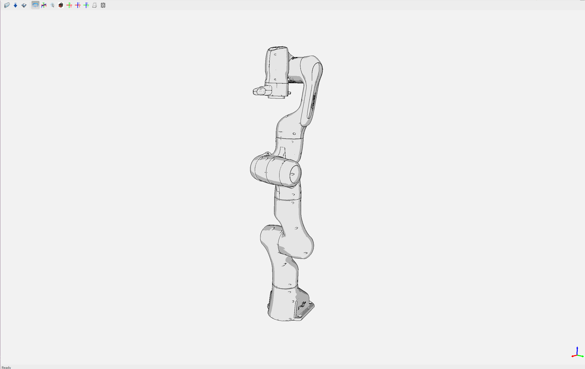

# 第24章 PPT：机械臂基础知识

> 共 17 页，标注页码 · 图号与教学文档对应

---

## P1 · 标题页

- 课程：ROS2 Python 编程
- 章节：第 24 章 机械臂基础知识
- 课时：2 课时
- 内容：机械臂分类、齐次变换与 DH 参数、正逆运动学、工作空间、ROS2 接口

<!-- 旁白：欢迎来到第 24 章，机械臂基础知识！本章 2 课时，从机械臂分类一路讲到齐次变换、DH 参数、正逆运动学、工作空间，最后落到 ROS2 接口。这是机械臂部分的地基章，线性代数会大量回归，别慌，我们一步步来。 -->

---

## P2 · 学习目标

- 理解机械臂的分类与应用场景
- 掌握机器人运动学基础与 DH 参数建模
- 理解正运动学与逆运动学的基本原理
- 了解机械臂工作空间的概念与分析方法
- 掌握 ROS2 中机械臂接口的使用方法

<!-- 旁白：五条目标两条主线：前四条是运动学理论——分类、DH 建模、正逆解、工作空间；最后一条是 ROS2 接口。学完本章的检验标准：能对任何一台串联机械臂写出 DH 参数表，并算出末端位姿。 -->

---

## P3 · 机械臂结构分类

- **关节型**：旋转关节串联，模拟人手臂；6 轴可达空间任意位姿

```
基座 → 腰关节(J1) → 肩关节(J2) → 肘关节(J3)
     → 腕关节(J4) → 腕关节(J5) → 腕关节(J6) → 末端
```

- **直角坐标型**：三个线性滑动关节互相垂直，精度高但灵活性受限
- **SCARA**：两平行旋转关节 + 一线性垂直关节，水平柔顺、垂直刚性，适合装配
- **并联型**：多连杆并联驱动末端平台（如 Delta），刚度高、速度快、工作空间小
- **协作型**：具备力控、碰撞检测与安全保护，可无围栏人机协同（UR5e、Panda、LBR iiwa）

<!-- 旁白：结构分类五种各有所长：关节型 6 轴最通用、直角坐标精度高但笨重、SCARA 水平柔顺垂直刚性适合装配、并联刚度高速度快但空间小、协作型带力控能无围栏和人一起干活。中间那行 ASCII 就是关节型的腰、肩、肘、腕结构——模拟人手臂的映射。 -->

---

## P4 · 应用分类与关键指标

| 分类 | 应用场景 | 特点 |
| --- | --- | --- |
| 工业机器人 | 焊接、搬运、装配、喷涂 | 高速度、高精度、大负载 |
| 服务机器人 | 家庭服务、医疗辅助 | 轻量化、安全交互 |
| 特种机器人 | 太空、水下、核环境 | 环境适应性强 |
| 教育机器人 | 教学实验、科研 | 开放接口、模块化 |

- 关键技术指标：
  - 自由度（DOF）：独立运动轴数量，6 自由度可到达任意位姿
  - 负载能力、工作空间、重复定位精度
  - 最大运动速度（各关节角速度上限）、防护等级（IP）

<!-- 旁白：应用分类四象限，指标才是选型的硬道理。自由度 6 是个魔法数字——正好能到达空间任意位姿。买机械臂盯四个数：自由度、负载、工作空间、重复定位精度；粉尘和湿气环境别忘了防护等级 IP。 -->

---

## P5 · 位姿与齐次变换

- 位姿 = 位置（3D 坐标）+ 姿态（朝向）
- 齐次变换矩阵：4×4 矩阵统一表达旋转与平移

```
    [ R   t ]
T = [ 0 0 0 1 ]
```

- 姿态表示方式：
  - 旋转矩阵：直观但参数冗余
  - 欧拉角：直观但存在万向节锁
  - **四元数**：无奇异、插值平滑，TF2 中统一使用



<!-- 旁白：位姿等于位置加姿态，齐次变换用一个 4×4 矩阵把两者统一。三种姿态表示各有取舍：旋转矩阵直观但冗余、欧拉角直观但有万向节锁、四元数无奇异且插值平滑——这也是 TF2 统一用四元数的原因。右图是 Panda 机械臂的 TF 坐标系可视化，每个坐标系就是一个位姿。 -->

---

## P6 · DH 参数建模

- Denavit-Hartenberg 参数：相邻连杆变换的标准描述，每关节四个参数

| 参数 | 符号 | 含义 |
| --- | --- | --- |
| 连杆长度 | a_i | 沿 X_i 轴从 Z_i 到 Z_{i+1} 的距离 |
| 连杆扭转 | α_i | 绕 X_i 轴从 Z_i 到 Z_{i+1} 的角度 |
| 关节距离 | d_i | 沿 Z_i 轴从 X_{i-1} 到 X_i 的距离 |
| 关节转角 | θ_i | 绕 Z_i 轴从 X_{i-1} 到 X_i 的角度 |

- 相邻连杆变换：T_i = Rot(z,θ_i) · Trans(z,d_i) · Trans(x,a_i) · Rot(x,α_i)

<!-- 旁白：DH 参数用四个数标准化描述相邻连杆：a 沿 X 的杆长、α 绕 X 的扭转、d 沿 Z 的关节距离、θ 绕 Z 的关节转角。记牢口诀"沿 X、绕 X、沿 Z、绕 Z"，相邻连杆变换就是这四个基本运动的乘积。 -->

---

## P7 · 六自由度 DH 参数与正运动学

- DH 参数表（[a, alpha, d, theta_offset]）：

```
J1: [0,        0,     0.333, 0]
J2: [0,        -π/2,  0,     0]
J3: [0,        π/2,   0.316, 0]
J4: [0.0825,   π/2,   0,     0]
J5: [-0.0825,  -π/2,  0.384, 0]
J6: [0,        π/2,   0,     0]
```

- 正运动学实现：

```
T = T_0_1 @ T_1_2 @ ... @ T_5_6    # 逐关节变换连乘
```

- dh_transform 按标准 DH 构造 4×4 矩阵，forward_kinematics 依次连乘输出末端位姿



<!-- 旁白：左边参数表是 Panda 的六轴 DH 参数，注意 J2 的 -π/2 和 J5 的 -0.0825 两个负值——它们决定了连杆扭转方向，是最容易抄错的陷阱。正运动学就是 dh_transform 构造 4×4 矩阵后依次连乘，代码一行 T = T_0_1 @ ... @ T_5_6 搞定。 -->

---

## P8 · 正运动学与逆运动学

- **正运动学（FK）**：已知关节角度 → 末端位姿，唯一确定
- **逆运动学（IK）**：已知目标位姿 → 关节角度，三类难点：
  - **多解性**：同一末端位姿可能对应多组关节角
  - **存在性**：目标位姿可能超出工作空间
  - **奇异性**：某些位姿下雅可比矩阵降秩
- 解析法：满足 Pieper 准则（三相邻关节轴交于一点）可推导闭式解
- 数值法：基于雅可比伪逆的迭代优化，通用性强

<!-- 旁白：正运动学一一对应唯一确定，逆运动学反过来三条难点全出：同一末端位姿多解、目标超工作空间不可达、奇异位姿雅可比降秩。解析法要满足 Pieper 准则——三相邻关节轴交于一点；数值法雅可比伪逆迭代通用性强，工程上首选。 -->

---

## P9 · 数值 IK：雅可比伪逆法

- 迭代流程：
  1. 正运动学计算当前位姿
  2. 求位置误差 + 姿态误差（旋转向量）
  3. 数值差分计算雅可比 J（eps=1e-6）
  4. 伪逆求解关节增量：delta = pinv(J) @ error
  5. 限位裁剪（±2π）后更新角度
- 收敛判据：误差范数 < 1e-4，max_iter=100
- 特点：无需解析推导，但迭代效率依赖初始猜测质量

<!-- 旁白：数值 IK 五步迭代：算当前位姿、求位置加姿态误差、数值差分得雅可比、伪逆求增量、限位裁剪后更新。收敛判据误差范数小于 1e-4、最多 100 次迭代。它对初始猜测很敏感——初值好收敛快，初值差可能震荡，调 IK 的第一直觉就是换初值。 -->

---

## P10 · ROS2 运动学求解器

| 求解器 | 说明 | 适用场景 |
| --- | --- | --- |
| KDL | Orocos KDL 运动学库 | 通用求解 |
| TRAC-IK | 改进的 IK 求解器 | 高鲁棒性 |
| IKFast | 解析法求解器 | 实时性要求高 |
| BioIK | 生物启发式 IK | 多约束优化 |

- kinematics.yaml 配置示例：

```
kinematics_solver: kdl_kinematics_plugin/KDLKinematicsPlugin
kinematics_solver_search_resolution: 0.005
kinematics_solver_timeout: 0.005
kinematics_solver_attempts: 3
```

<!-- 旁白：求解器选型看场景：KDL 通用、TRAC-IK 高鲁棒、IKFast 实时性最强、BioIK 支持多约束优化。kinematics.yaml 里四个参数——求解器名、搜索分辨率 0.005、超时 0.005 秒、尝试 3 次，MoveIt 就按这份配置加载求解插件。 -->

---

## P11 · 工作空间分析

- 定义：末端执行器可达的所有空间位置的集合
  - 可达工作空间：末端可到达的所有位置
  - 灵巧工作空间：末端可以任意姿态到达的位置
- 影响因素：关节运动范围、连杆尺寸、机械结构、自碰撞
- 蒙特卡洛法：在关节限位内随机采样 → 正运动学映射到笛卡尔空间 → 3D 散点图
- 采样量建议：num_samples=10000 量级，散点密度反映可达性分布

<!-- 旁白：工作空间分两层：可达工作空间只看位置，灵巧工作空间还要求任意姿态。蒙特卡洛法是工程上最简单的分析法——在关节限位内随机采样一万次，经正运动学映射到笛卡尔空间画 3D 散点图，散点密度直接反映可达性分布。 -->

---

## P12 · JointState 关节状态话题

- 消息结构：

```
sensor_msgs/JointState
  name: string[]       # 关节名称列表
  position: float64[]  # 关节位置（弧度）
  velocity: float64[]  # 关节速度
  effort: float64[]    # 关节力矩
```

- 订阅示例：create_subscription(JointState, '/joint_states', ...)，按 name 索引读取 position
- 机械臂状态监控、正运动学输入均以 /joint_states 为基础

<!-- 旁白：/joint_states 是机械臂的"心电图"：name、position、velocity、effort 四个字段。订阅后一定要按 name 索引读取 position——别按数组下标猜顺序，关节顺序变了就全错。状态监控和正运动学的输入都从这条话题来，字段名也得照抄：position 不叫 angles。 -->

---

## P13 · TF2 坐标变换与 robot_state_publisher

- TF2 维护从 base_link 到各连杆再到工具端的变换树
- 查询末端位姿：

```
tf_buffer.lookup_transform('base_link', 'tool0',
                           Time(), Duration(seconds=1.0))
```

- robot_state_publisher：监听 /joint_states，按 URDF 自动计算并发布各连杆 TF

```
ros2 run robot_state_publisher robot_state_publisher \
  --ros-args -p robot_description:="$(cat my_arm.urdf)"
```

<!-- 旁白：TF2 维护 base_link 到各连杆再到 tool0 的变换树，lookup_transform 一查就能拿到末端位姿。robot_state_publisher 是"翻译官"：监听 /joint_states，按 URDF 自动算出各连杆 TF 发布出去。这条命令把 URDF 喂给它，机械臂的数字孪生就跑起来了。 -->

---

## P14 · ROS2 Control 机械臂接口

- 控制器类型：
  - JointStateController：发布关节状态
  - JointTrajectoryController：执行关节轨迹
  - PositionController：位置控制
- ros2_controllers.yaml 示例：

```
controller_manager:
  update_rate: 100
joint_state_broadcaster:
  type: joint_state_broadcaster/JointStateBroadcaster
arm_controller:
  type: joint_trajectory_controller/JointTrajectoryController
  joints: [joint1 ... joint6]
```

- JointTrajectoryController 是机械臂轨迹执行的标准入口

<!-- 旁白：ros2_control 三种控制器各司其职：JointStateController 发布关节状态、JointTrajectoryController 执行轨迹、PositionController 做位置控制。yaml 里 update_rate 100 赫兹，arm_controller 挂六个关节。记住：JointTrajectoryController 是轨迹执行的标准入口。 -->

---

## P15 · 本章要点

- 机械臂按结构分：关节型、直角坐标、SCARA、并联、协作型
- 位姿用齐次变换矩阵统一表达，四元数避免万向节锁
- DH 四参数（a、α、d、θ）标准化描述相邻连杆变换
- 正运动学唯一，逆运动学存在多解、奇异、不可达三大难点
- 数值 IK 基于雅可比伪逆迭代，求解器可用 KDL / TRAC-IK / IKFast
- ROS2 侧通过 /joint_states、TF2 与 ros2_control 完成状态获取与控制

<!-- 旁白：六条要点串起来就是本章地图：结构分类、齐次变换与四元数、DH 四参数、正逆解的对称与难点、雅可比伪逆迭代、ROS2 三大接口。能对着每条讲出"是什么、为什么、怎么用"，这章就算到手了。 -->

---

## P16 · 课后练习

1. 建立六自由度机械臂的标准 DH 参数表，实现正运动学计算函数（关节角度 → 末端位姿）
2. 用 Python 实现基于雅可比伪逆的数值 IK 求解器，验证非奇异位姿下的收敛性能
3. 用蒙特卡洛法计算机械臂工作空间，绘制三维散点图并分析形状特征
4. 编写 ROS2 节点订阅 /joint_states，实时计算机械臂末端执行器位置并输出
5. 解释 TF2 变换树的构建过程，以及 robot_state_publisher 如何从关节角度得到坐标变换

<!-- 旁白：五道题层层递进：第一题建 DH 表写正解，第二题写数值 IK 验证收敛，第三题蒙特卡洛画工作空间，第四题订阅 /joint_states 算末端位置，第五题讲清 TF2 变换树。第一、二题是核心——IK 的收敛性实验结果记得截图存档，复试和面试都用得上。 -->

---

## P17 · 下章预告

- 第 25 章：ROS2 机械臂建模
- 内容：URDF、Xacro、SRDF、RViz 可视化与 3D 模型导入

<!-- 旁白：下一章把理论变成模型：URDF、Xacro、SRDF、RViz 可视化与 3D 模型导入。学完 DH 参数再看机器人建模描述，你会对连杆和关节的关系有全新的理解。下课，下节课见！ -->