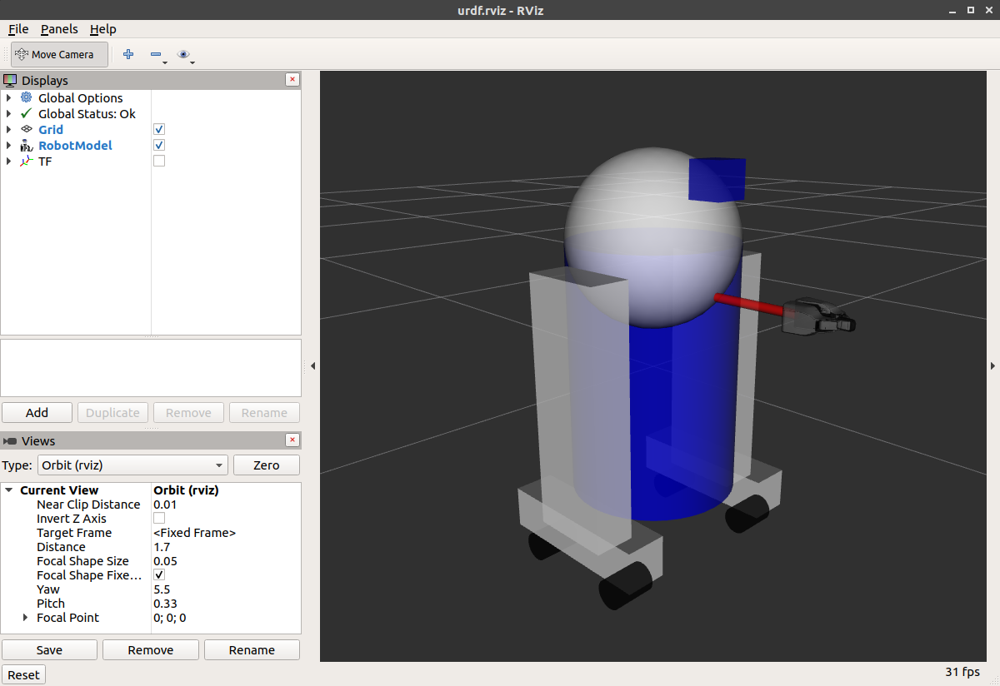
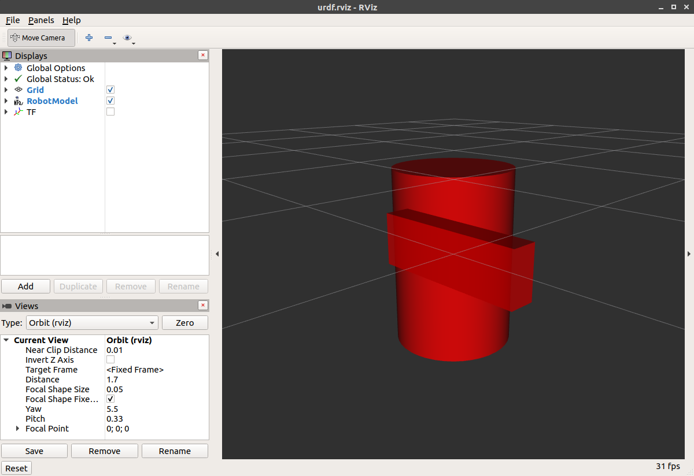
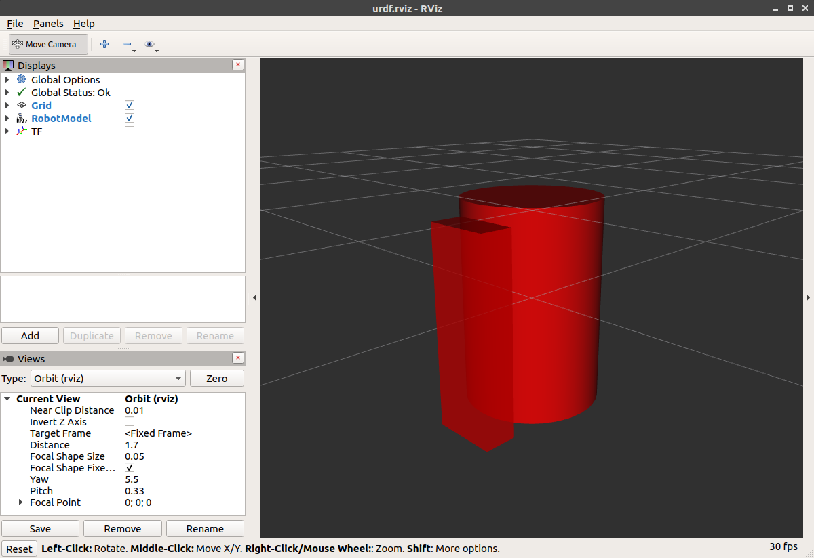

# 第25章 PPT：ROS2 机械臂建模

> 共 16 页，标注页码 · 图号与教学文档对应

---

## P1 · 标题页

- 课程：ROS2 Python 编程
- 章节：第 25 章 ROS2 机械臂建模
- 课时：2 课时
- 内容：URDF 基础、六自由度机械臂建模、Xacro、SRDF、Rviz 可视化、3D 模型导入、模型验证

<!-- 旁白：欢迎来到第 25 章，ROS2 机械臂建模！2 课时把上一章的运动学理论落成模型文件：URDF 基础、六自由度建模、Xacro、SRDF、Rviz 可视化、3D 模型导入和三层验证。从这一章起，你的机器人开始"能看"了。 -->

---

## P2 · 学习目标

- 掌握 URDF 和 Xacro 建模方法
- 理解 SRDF 语义描述文件的结构
- 学会在 Rviz 中可视化机械臂模型
- 掌握 3D 模型导入与整合方法

<!-- 旁白：四条目标对应四条能力线：URDF 加 Xacro 建模、SRDF 语义、Rviz 可视化、3D 模型整合。检验标准一句话——不查教程独立写出一个能动的六轴机械臂 URDF。 -->

---

## P3 · URDF 基础：概念与结构

- URDF：Unified Robot Description Format，统一机器人描述格式，基于 XML 规范
- 机器人模型 = **Link（连杆）+ Joint（关节）** 构成的树状结构
- `<robot name="my_arm">` 为根元素，`name` 属性标识机器人

```
<robot name="my_arm">
  <link name="base_link">
    <visual>
      <geometry>
        <cylinder length="0.18" radius="0.1"/>   <!-- 黄色底座 -->
      </geometry>
    </visual>
  </link>
  <joint name="joint1" type="revolute">
    <parent link="base_link"/>
    <child link="link1"/>
    <origin xyz="0 0 0.18"/>
    <axis xyz="0 0 1"/>
    <limit effort="300" velocity="0.6" lower="-2.96" upper="2.96"/>
  </joint>
</robot>
```

- 父连杆 → 关节 → 子连杆 逐级嵌套，构成完整运动链





<!-- 旁白：URDF 就是机器人的「身份证」：一个 XML 文件把连杆和关节说清楚。看这段最小示例——base_link 用圆柱做外观，joint1 是 revolute 旋转关节，origin 定位、axis 定轴、limit 限位。上面两张图：一张是 URDF 在 RViz 里的可视化效果，另一张是多种几何形状的组合示例，geometry 里圆柱、方块、球体都可以自由搭配。 -->

---

## P4 · link 三要素与关节类型

- link 的三大核心子元素：

| 子元素 | 作用 | 示例 |
| --- | --- | --- |
| visual | 外观显示 | origin / geometry / material |
| collision | 碰撞模型 | 可简化，不必与 visual 相同 |
| inertial | 惯性参数 | mass=1.0，ixx=0.0052 iyy=0.0052 izz=0.005 |

- 关节类型表：

| 类型 | 说明 | 自由度 | 典型应用 |
| --- | --- | --- | --- |
| revolute | 旋转关节，有限位 | 1 | 机械臂关节 |
| continuous | 连续旋转 | 1 | 车轮 |
| prismatic | 滑动关节 | 1 | 夹爪 |
| fixed | 固定关节 | 0 | 底座 |
| floating | 浮动关节 | 6 | 自由物体 |
| planar | 平面运动 | 3 | AGV 底盘 |

- 关节属性：parent/child、origin（xyz、rpy）、axis、limit（effort/velocity/lower/upper）、dynamics（damping=50、friction=1）、mimic（multiplier、offset）、safety_controller（soft_lower_limit=-2.85、soft_upper_limit=2.85）



<!-- 旁白：link 三要素各有分工：visual 管外观，collision 管碰撞、可以简化，inertial 管惯性，动力学仿真必备。六种关节类型里 revolute 和 continuous 最常用，fixed 用来焊死底座，floating 和 planar 在机械臂里很少见。origin 的 xyz 加 rpy 决定子连杆相对父连杆的位姿，下图里 origin 一改、坐标系跟着挪，就是它的直观效果。 -->

---

## P5 · 六自由度 URDF 建模

- 新建功能包：

```
ros2 pkg create arm_description --build-type ament_python --dependencies rclpy
```

- 目录结构：urdf / launch / rviz / meshes
- 连杆链：base_link → joint1(腰) → link1 → joint2(肩) → link2 → joint3 → link3 → joint4 → link4 → joint5 → link5 → tool0
- 关键定义：

| 部件 | 几何 | 颜色 | 参数 |
| --- | --- | --- | --- |
| base_link | 圆柱 0.09 高 × 0.08 半径 | 黄 | 质量 2.0 |
| link1 | 0.06×0.06×0.25 | 蓝 | joint1 腰 z 轴 ±π |
| link2 | 0.06×0.06×0.25 | 绿 | joint2 肩 y 轴 ±2.09 |
| link3 | 0.05×0.05×0.15 | 红 | joint3 y 轴 ±2.09 |
| link4 | 0.04×0.04×0.08 | 黄 | joint4/5 continuous effort 50 |
| link5 | 圆柱 0.08×0.03 | 灰 | tool0 固定关节 |

- 各连杆使用不同颜色，便于调试与区分

<!-- 旁白：六轴机械臂的连杆链从 base_link 一路到 tool0，中间五个旋转关节。新建 ament_python 功能包后按 urdf、launch、rviz、meshes 四个目录组织文件。表格里每个连杆的几何和颜色都不同——纯粹为了调试，RViz 里一眼就能分清谁是谁。 -->

---

## P6 · ros2_control 硬件接口

- **command interface**：位置 / 速度 / 力矩指令接口，控制器写入
- **state interface**：位置 / 速度 / 力矩状态接口，硬件读取反馈
- hardware 插件类型：
  - 真机驱动：读写实际电机总线
  - mock_components：无硬件仿真（joint_state_publisher 模式）
  - gazebo_ros2_control：在 Gazebo 中联动物理仿真
- transmission 为 ROS1 遗留概念，已废弃不用

<!-- 旁白：ros2_control 的接口分两类：command 接口给控制器写指令，state 接口让硬件读反馈。硬件插件三种：真机驱动读写电机总线，mock_components 无硬件也能仿真，gazebo_ros2_control 联动 Gazebo 物理仿真。transmission 是 ROS1 的遗留概念，直接跳过不用记。 -->

---

## P7 · Xacro：参数与数学表达式

- 参数集中定义，一处修改全局生效：

```
<xacro:property name="base_radius" value="0.08"/>
<xacro:property name="base_height" value="0.09"/>
<xacro:property name="link1_len" value="0.25"/>
<xacro:property name="link2_len" value="0.25"/>
<xacro:property name="link3_len" value="0.15"/>
```

- `${}` 内支持数学运算：`<origin xyz="0 0 ${base_height}"/>`
- 关节限位参数化：joint1 `lower=${-pi} upper=${pi}`，joint2/3 绕 y 轴 `±2π/3`

<!-- 旁白：Xacro 的核心思想是参数集中定义、一处修改全局生效。五个 property 定义完尺寸，后面所有引用都跟着变；${} 里还能做数学运算，origin 里直接写 ${base_height} 就行。关节限位也参数化：joint1 用正负 pi，joint2、joint3 用正负 2π/3，改起来一目了然。 -->

---

## P8 · Xacro 宏封装

- 宏定义：`create_link(name, length, color_name)`，内部自动计算质量与惯量：
  - `mass = ${length*5}`
  - `inertia = 0.001 * length * 10`
- 关节宏 `create_revolute_joint`：统一 `effort=100`
- 效果：URDF 代码量大幅缩减，参数与结构分离
- Xacro 是**预处理工具**，不参与运行时解析：

```
xacro <file> > out.urdf
```

<!-- 旁白：宏是 Xacro 的杀手锏：create_link 宏内部自动算质量和惯量——mass 等于长度乘 5，惯量按 0.001 乘长度乘 10 估算，关节宏统一 effort 100。几百行的 URDF 立刻瘦身，参数与结构分离。最后记住 Xacro 是预处理工具：xacro 命令展开成 URDF，运行时解析的仍是纯 XML。 -->

---

## P9 · SRDF 语义描述

- SRDF 描述机器人**语义**而非几何：规划组、预设位姿、碰撞矩阵、虚拟关节、末端执行器
- 规划组：`arm_group`（joint1～joint6）、`gripper`
- 预设位姿 group_state：
  - home：所有关节为 0
  - vertical：j2=-1.57、j3=1.57、j5=1.57
- virtual_joint：`base_footprint`，world → base_link，类型 fixed
- disable_collisions 规则：Never / Adjacent

<!-- 旁白：SRDF 描述语义而不是几何：规划组、预设位姿、碰撞矩阵、虚拟关节、末端执行器五件事。两个规划组 arm_group 和 gripper；home 位姿全零，vertical 靠 j2 负 1.57、j3 和 j5 正 1.57 摆出竖直姿态。disable_collisions 用 Never 和 Adjacent 两类规则把不该检测的碰撞对关掉，规划更快更稳。 -->

---

## P10 · MoveIt 配置包结构

- config 目录：six_dof_arm.srdf、kinematics.yaml、joint_limits.yaml、ompl_planning.yaml、fake_controllers.yaml、ros2_controllers.yaml
- launch 目录：move_group、planning_context、demo
- Setup Assistant 流程：导入 URDF → 定义规划组 → 配置碰撞矩阵 → 预设位姿 → 虚拟关节 + 末端执行器
- SRDF 只携带语义，**运行时与 URDF 合并为 planning scene**

<!-- 旁白：MoveIt 配置包 config 目录五件套：SRDF、kinematics、joint_limits、ompl_planning、控制器配置；launch 目录三个入口。Setup Assistant 五步走：导入 URDF、定规划组、配碰撞矩阵、设预设位姿、挂虚拟关节和末端执行器。记住 SRDF 只带语义，运行时与 URDF 合并成 planning scene 才生效。 -->

---

## P11 · Rviz 可视化

- `display.launch.py`：robot_state_publisher + joint_state_publisher_gui + `rviz2 -d display.rviz`
- joint_state_publisher_gui：滑块手动控制各关节角度
- `display_xacro.launch.py`：use_sim_time 由 LaunchConfiguration 配置，`process_file(xacro_file).toxml()` 生成 robot_description
- 启动方式：

```
ros2 launch arm_description display.launch.py
ros2 launch arm_description display_xacro.launch.py
```

- RViz 相关组件：RobotModel、TF、MotionPlanning

<!-- 旁白：可视化两条路径：display.launch.py 用 URDF 加 joint_state_publisher_gui 滑块手动掰关节；display_xacro.launch.py 用 process_file 把 Xacro 展开成 robot_description，use_sim_time 走 LaunchConfiguration 配置。RViz 里盯三个组件：RobotModel 看模型，TF 看坐标系，MotionPlanning 留给下一章。 -->

---

## P12 · 3D 模型导入与简化

- mesh 引用：`<mesh filename="package://arm_description/meshes/base.stl"/>`
- 常见格式：

| 格式 | 特点 |
| --- | --- |
| STL | 广泛支持，无颜色 |
| Collada (.dae) | 带纹理，文件较大 |
| OBJ | 需配套 MTL 材质文件 |

- 碰撞模型简化（trimesh）：

```
simplify_quadric_decimation(max_faces=500)   # base.stl → base_collision.stl
```

- 路径排查：`echo $AMENT_PREFIX_PATH`，在 install 目录下 find 查找 *.stl / *.dae

<!-- 旁白：mesh 引用用 package:// 协议指向功能包内的文件。格式三选一：STL 支持最广但没有颜色，Collada 带纹理但文件大，OBJ 要配 MTL 材质文件。碰撞模型必须简化——simplify_quadric_decimation 把面数砍到 500，生成 base_collision.stl。模型路径找不到就 echo AMENT_PREFIX_PATH，再去 install 目录 find。 -->

---

## P13 · 模型验证（三层检查）

- 语法层：`check_urdf six_dof_arm.urdf`（输出 root link: base_link）；`xmllint --noout`
- 结构层：graphviz + `urdf_to_graphviz` 生成 six_dof_arm.pdf，检查父链连接错误
- 运行层：joint_state_publisher_gui 滑块逐一测试关节运动
- 性能要点：碰撞网格顶点应为**数百量级**，否则 MoveIt 规划性能显著下降；可用 MeshLab 抽壳、减面处理

<!-- 旁白：验证分三层：语法层 check_urdf 输出 root link 就说明 XML 没问题，再用 xmllint 把关；结构层用 urdf_to_graphviz 生成 PDF 查父链连接；运行层用滑块逐个试关节。性能红线记一条：碰撞网格顶点保持数百量级，超标就用 MeshLab 抽壳减面，否则 MoveIt 规划明显变慢。 -->

---

## P14 · 本章要点

- URDF 是机械臂建模的基础：link + joint 树状结构
- 关节类型决定自由度，limit 限位保证运动安全
- Xacro 通过 property 与宏实现参数化和代码复用
- SRDF 描述规划组、预设位姿、碰撞矩阵等语义信息
- 3D 网格用于可视化，碰撞模型必须简化以保证规划性能
- 模型验证分语法、结构、运行时三层进行

<!-- 旁白：六条要点串起全章：URDF 的 link 加 joint 树状结构、关节类型与限位、Xacro 参数化与宏、SRDF 语义、碰撞模型简化、三层验证。能对着每条讲出「是什么、为什么、怎么用」，建模这一关就算过了。 -->

---

## P15 · 课后练习

1. 编写一个六自由度机械臂的 URDF 文件，包含底座、三个连杆、腕部和末端执行器，用不同颜色区分
2. 使用 Xacro 重构：将连杆长度、颜色等参数设为变量，用宏简化代码
3. 编写 SRDF：定义 arm_group 和 gripper 两个规划组，以及 home 和 vertical 两个预设位姿
4. 编写 launch 文件在 RViz 中可视化模型，并用 joint_state_publisher_gui 手动控制
5. 导入 STL 或 DAE 3D 模型作为可视化模型，为碰撞检测创建简化模型

<!-- 旁白：五道题正好是建模的完整闭环：第一题手写 URDF 练基础，第二题 Xacro 重构练复用，第三题 SRDF 练语义，第四题 launch 可视化练调试，第五题 3D 模型导入练工程化。建议按顺序做——前一题的产物就是后一题的输入，做完你会收获一个完整的 arm_description 包。 -->

---

## P16 · 下章预告

- 第 26 章：MoveIt2 基础
- 内容：机械臂运动规划、轨迹执行与应用开发

<!-- 旁白：模型就绪，下一章让机械臂动起来：第 26 章 MoveIt2 基础——运动规划、轨迹执行与应用开发。今天写的 SRDF 规划组和预设位姿，在 MoveIt2 里全部派上用场。下课，下节课见！ -->