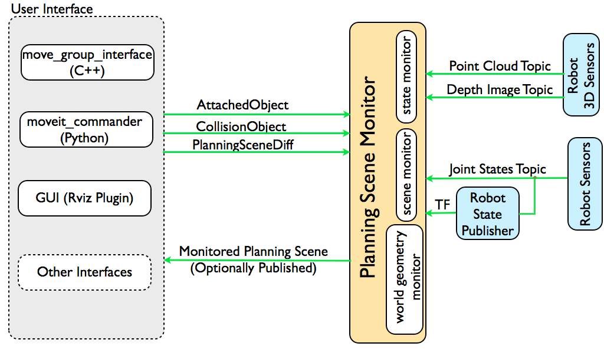

# 第26章 PPT：MoveIt2 基础

> 共 17 页，标注页码 · 图号与教学文档对应

---

## P1 · 标题页

- 课程：ROS2 Python 编程
- 章节：第 26 章 MoveIt2 基础
- 课时：2 课时
- 内容：MoveIt2 架构、Setup Assistant 配置、MoveGroupInterface 编程、OMPL 规划器、碰撞检测、仿真启动

<!-- 旁白：从这一章开始我们进入机械臂运动规划部分。MoveIt2 是 ROS 2 生态中最主流的机械臂规划框架，前面建模章节生成的 URDF/Xacro 模型正是它的输入。本章先建立整体框架，下一章再深入 Python 编程细节。 -->

---

## P2 · 本课学习目标

- 理解 MoveIt2 架构设计与 move_group 中枢作用
- 掌握 Setup Assistant 配置流程与配置包结构
- 学会使用 MoveItPy（MoveGroupInterface）编程接口
- 理解 OMPL 规划算法原理与规划器配置方法
- 掌握碰撞检测的配置、使用与障碍物编程
- 学会启动 MoveIt2 + RViz/Gazebo 仿真环境

<!-- 旁白：本章覆盖"配置—编程—规划—避障—运行"完整链路。重点是三条主线：一是用 Setup Assistant 生成配置包，二是用 MoveItPy 写规划程序，三是理解 OMPL 与碰撞检测的原理。学完应能独立完成一次从配置到执行的机械臂运动。 -->

---

## P3 · MoveIt2 概述与整体架构

- **要点：** move_group 中枢节点；三种使用方式

- MoveIt2：ROS 2 环境下最主流的机械臂运动规划框架，MoveIt 的升级版本
- 集成运动规划、控制、3D 感知、运动学成果，提供易用的机器人应用开发平台
- 核心是 **move_group** 节点：把所有系统组件组合在一起，对外只暴露 ROS 2 接口（action、service、topic）
- 三种使用方式：

| 使用方式 | 依赖包/工具 |
| --- | --- |
| C++ API | move_group_interface 包 |
| Python API | moveit_py 包 |
| GUI 交互 | RViz2 MotionPlanning 插件 |


move_group 对外提供操作与服务，对内协调规划器、场景与控制器

<!-- 旁白：这张官方架构图的核心是中间的 move_group：它像"总调度台"，上面接用户接口，下面管规划器和控制器。注意看它的三对接口——用户代码不直接碰硬件，而是通过 action/service/topic 与 move_group 通信，这也是三种使用方式（C++、Python、GUI）的共同入口。 -->

---

## P4 · 配置参数与规划场景

- **要点：** 五大配置来源；PlanningScene 四要素

- move_group 运行所需的配置参数：

| 参数 | 说明 | 来源 |
| --- | --- | --- |
| robot_description | URDF 机器人模型 | 参数服务器 |
| robot_description_semantic | SRDF 语义模型 | 参数服务器 |
| kinematics.yaml | 运动学求解器配置 | MoveIt 配置包 |
| joint_limits.yaml | 关节限制配置 | MoveIt 配置包 |
| ompl_planning.yaml | OMPL 规划器配置 | MoveIt 配置包 |

- **规划场景 PlanningScene** 是环境模型的核心概念，包含四个要素：
  - RobotState：当前机器人状态（各关节位置）
  - CollisionObjects：环境中的碰撞物体
  - AttachedCollisionObjects：附着在机器人上的物体
  - OccupancyMap：环境占用地图



规划场景 = 机器人当前状态 + 环境中的碰撞物体

<!-- 旁白：左边表格记来源：模型和语义来自参数服务器，其余三个 yaml 都由配置包提供，Setup Assistant 就是帮我们生成它们。右边规划场景四要素中，CollisionObjects 是我们编程时最常打交道的——往场景里"放"箱子、圆柱，规划器就会自动绕开它们。 -->

---

## P5 · 运动规划流程与流水线

- **要点：** 七步规划流程；规划适配器先修正后时间参数化

```
用户设定目标 → move_group 接收请求
  → 查询规划场景（当前状态 + 环境）
  → 调用运动学求解器（IK/FK）
  → 调用运动规划器（OMPL 等）
  → 碰撞检测验证
  → 返回规划轨迹
  → 通过控制器执行轨迹
```

- 官方文档将 move_group 称为系统唯一"上帝节点"，持有机器人模型、规划场景、规划流水线与控制器管理器
- 流水线级联机制：`planning_adapters`（如 FixStartStateBounds、AddTimeParameterization）先修正请求再交给规划器
- OMPL 输出的是"关节路径"，**时间参数化**才赋予速度与加速度


MoveIt 官方规划流水线：请求经适配器修正后交给规划器，再时间参数化输出轨迹

<!-- 旁白：把这张图和上面的七步流程对照着看：请求进来先被 planning_adapters 修正起始状态，然后才轮到 OMPL 搜索路径。特别强调最后一步 AddTimeParameterization——OMPL 只给几何路径，轨迹上每个点的时间、速度、加速度都是时间参数化补上的，这也是为什么限速参数要单独设置。 -->

---

## P6 · Setup Assistant：安装与配置步骤（上）

- **要点：** 三个安装包；加载模型、碰撞矩阵、虚拟关节、规划组

```bash
# 安装MoveIt2完整包
sudo apt install ros-jazzy-moveit
# 安装MoveIt2 Python API
sudo apt install ros-jazzy-moveit-py
# 安装Setup Assistant
sudo apt install ros-jazzy-moveit-setup-assistant

# 启动Setup Assistant
ros2 launch moveit_setup_assistant setup_assistant.launch.py
```

1. **加载机器人模型**：Create New MoveIt Configuration Package，选择 URDF/Xacro
2. **生成自碰撞免检矩阵**：自动检测不可能碰撞的连杆对，减少规划计算量

```
base_link ↔ link2: 距离远，永不碰撞 → 免检
link1   ↔ link2: 相邻连杆，碰撞检测 → 需检
```

3. **添加虚拟关节（可选）**：把基座标系连接到世界坐标系（`<virtual_joint>` type="fixed" parent_frame="world"）
4. **添加规划组**：基于关节或基于连杆两种配置方式

<!-- 旁白：Setup Assistant 是图形化向导，八步走完生成完整配置包。本页是前四步：加载模型后立刻生成自碰撞矩阵——base_link 和远处连杆物理上不可能碰到，提前免检能省大量计算；虚拟关节负责把机器人"钉"在世界坐标系上；规划组是后续一切规划的单位。 -->

---

## P7 · 配置步骤（下）与配置包解析

- **要点：** 规划组求解器与预设位姿；生成的配置包目录

- **步骤5 添加末端执行器**：`<end_effector name="gripper_ee" parent_link="link5" parent_group="arm_group" group="gripper"/>`
- **步骤6 添加预设位姿**：SRDF 中保存命名位姿，供 `set_named_target("home")` 直接调用

```xml
<group_state name="home" group="arm_group">
    <joint name="joint1" value="0"/>
    <joint name="joint2" value="0"/>
    <joint name="joint3" value="0"/>
</group_state>
```

- **步骤7 ROS2 Control 配置**：controller_list 声明 arm_controller / gripper_controller 及其关节，action 类型 FollowJointTrajectory
- **步骤8 生成配置包**，目录结构：

```
generated_moveit_config/
├── config/   # arm.srdf、kinematics.yaml、joint_limits.yaml、
│             # ompl_planning.yaml、fake_controllers.yaml…
├── launch/   # move_group.launch.py、demo.launch.py…
└── rviz/     # moveit.rviz
```

- joint_limits.yaml：`max_velocity: 0.5`、`max_acceleration: 0.5`——限制每个关节的速度与加速度上限

<!-- 旁白：规划组配置里 kinematics.yaml 指定 KDL 求解器（搜索分辨率 0.005、超时 0.005）；预设位姿 home、retract 是最常用的命名目标。生成的配置包里 config 目录五个 yaml 各司其职，launch 目录负责启动。改关节限位就到 joint_limits.yaml 里调 max_velocity。 -->

---

## P8 · MoveGroupInterface 编程

- **要点：** MoveItPy 初始化；set target → plan → execute 三段式

```python
from moveit.planning import MoveItPy, PlanningComponent

class MoveGroupDemo(Node):
    def __init__(self):
        super().__init__('move_group_demo')
        # 初始化MoveItPy
        self.moveit = MoveItPy(node_name='moveit_py')
        # 获取规划组件
        self.arm = PlanningComponent(self.moveit, 'arm_group', 'link5')
        # 配置规划参数
        self.arm.set_goal_position_tolerance(0.01)
        self.arm.set_goal_orientation_tolerance(0.01)
        self.arm.set_max_velocity_scaling_factor(0.5)
        self.arm.set_max_acceleration_scaling_factor(0.5)

    def plan_to_joint_target(self, joint_values):
        self.arm.set_start_state_to_current_state()
        self.arm.set_joint_value_target(joint_values)
        plan_result = self.arm.plan()
        if plan_result:
            self.arm.execute(plan_result.trajectory)
```

- C++ 侧对应 `moveit::planning_interface::MoveGroupInterface move_group(node, "arm_group")`，同样 setJointValueTarget → plan → execute

<!-- 旁白：这段骨架代码体现 MoveItPy 的三段式：先 set_joint_value_target 设目标，再 plan() 得到规划结果，最后 execute() 执行轨迹。构造 PlanningComponent 时传入规划组名和末端 link；两条 tolerance 和两条 scaling_factor 分别控制精度与速度，工程上常用 0.5 起步防止动作过猛。 -->

---

## P9 · 常用 API 方法

- **要点：** 目标设置、规划执行、状态查询三类 API

| 方法 | 功能 | 参数 |
| --- | --- | --- |
| set_joint_value_target() | 设置关节目标 | 关节角度列表 |
| set_pose_target() | 设置末端位姿目标 | Pose对象/Stamped |
| set_named_target() | 设置命名位姿 | 位姿名称字符串 |
| plan() | 规划轨迹 | 可选规划器ID |
| execute() | 执行轨迹 | 规划结果 |
| get_current_pose() | 获取当前位姿 | 末端link名称 |
| get_current_joint_values() | 获取当前关节值 | 无 |
| set_goal_tolerance() | 设置容忍度 | 位置+姿态容忍度 |
| set_max_velocity_scaling_factor() | 速度缩放 | 0.0~1.0 |
| set_max_acceleration_scaling_factor() | 加速度缩放 | 0.0~1.0 |

- 官方 MoveItPy 路线要点：绕开 move_group 进程，直接在应用进程内构造 `PlanningSceneMonitor` 与 `MoveItPy` 对象；用 `PlanComponents` 组装请求，`plan()` 返回带轨迹的结果，`execute()` 走 FollowJointTrajectory action；还支持离线"免状态监视"模式，适合练手与单元测试

<!-- 旁白：这张表按三类记忆：前两页的 set_* 是"去哪"，plan/execute 是"怎么去"，get_current_* 是"现在在哪"。官方 MoveItPy 教程的典型结构——加载 robot description、定义初始姿态、多次随机查询并统计规划时间——直接对应课后练习第 2 题，注意体会 plan() 返回结果需要判空再执行。 -->

---

## P10 · OMPL 运动规划算法

- **要点：** 基于采样的规划库；RRTConnect 双树收敛快

- OMPL（Open Motion Planning Library）：MoveIt2 默认规划算法库，基于采样，在高维配置空间中搜索可行路径

```
RRT算法流程：
1. 初始化树T，包含起始节点q_start
2. 循环直到到达目标或超时：
   a. 随机采样q_rand
   b. 找到T中最近的节点q_near
   c. 沿q_near→q_rand方向扩展一步得到q_new
   d. 检查q_near→q_new路径是否无碰撞
   e. 若无碰撞，将q_new加入T
   f. 若q_new接近目标，返回路径
```

| 算法 | 特点 | 适用场景 |
| --- | --- | --- |
| RRTConnect | 双向RRT，收敛快 | 通用场景 |
| PRM* | 渐进最优 | 多查询场景 |
| RRT* | 渐进最优RRT | 需要最优路径 |
| EST | 基于扩展空间树 | 狭窄通道 |
| KPIECE | 基于单元分割 | 高维空间 |

<!-- 旁白：RRT 的关键是"边采样边长树"：每轮随机采一个点、找最近节点、朝它扩一步、做碰撞检查，无碰撞就入树，直到够到目标。RRTConnect 更聪明——起点终点各长一棵树，两头同时扩展再对接，所以收敛最快、工业上用得最广。选型记住三个代表：RRTConnect 求快、RRT* 求优、PRM 适合重复查询。 -->

---

## P11 · 规划器配置与时间权衡

- **要点：** planner_id 指定算法；规划时间换成功率与路径质量

```yaml
# ompl_planning.yaml
arm_group:
  planner_configs:
    - RRTConnectkConfigDefault
  default_planner_config: RRTConnectkConfigDefault

RRTConnectkConfigDefault:
  type: geometric::RRTConnect
  range: 0.1            # 扩展步长
  goal_bias: 0.1        # 目标偏置概率
  max_planning_time: 1.0  # 最大规划时间
```

```python
plan_result = self.arm.plan(
    planner_id='RRTConnectkConfigDefault',
    planning_time=10.0,  # 最大规划时间
    max_attempts=100,    # 最大尝试次数
)
```

| planning_time | 成功率 | 路径质量 | 适用场景 |
| :---: | :---: | :---: | :---: |
| 0.5s | 低 | 一般 | 快速运动 |
| 2.0s | 中 | 较好 | 常规任务 |
| 10.0s | 高 | 最优 | 精密操作 |

- 官方建议：RRTConnect 是"双树连接"式单查询规划器，成功率与速度平衡最好；RRT* 渐进最优但需大量采样收敛，常配限时截断；PRM 一次建图多次查询，适合固定环境重复抓取

<!-- 旁白：yaml 里 range 是每次扩展的步长，goal_bias 是朝目标"作弊"的概率，max_planning_time 是硬性截断。代码里用 planner_id 切换算法、planning_time 给足时间。权衡表说明时间就是质量：给 10 秒规划又稳又好，但实时性场景只能给 0.5 秒，要按任务取舍。 -->

---

## P12 · 碰撞检测机制与配置

- **要点：** FCL/Bullet 后端；三类碰撞检测；SRDF 免检对

- MoveIt2 使用 **FCL**（Flexible Collision Library）和 Bullet 进行碰撞检测
- 三种碰撞检测模式：
  - **自碰撞检测**：机器人连杆之间
  - **环境碰撞检测**：机器人与环境物体
  - **附着物体碰撞检测**：附着在机器人上的物体与环境
- SRDF 中定义免检对减少计算量：

```xml
<disable_collisions link1="base_link" link2="link2" reason="Never"/>
<disable_collisions link1="base_link" link2="link4" reason="Adjacent"/>
```

- 配置碰撞参数：

```yaml
collision_detection:
  type: "FCL"          # 碰撞引擎
  padding: 0.01        # 碰撞安全余量（米）
  scale: 1.0           # 碰撞缩放比例
```

<!-- 旁白：三类检测对象不同：自碰撞靠免检矩阵省算力，环境碰撞靠场景里的 CollisionObjects，附着碰撞管的是夹爪里夹着的工件。免检对的 reason 有 Never（永远碰不到）和 Adjacent（相邻连杆必然接触）两类。padding 给物体加 1 厘米安全余量，宁可保守也别擦碰。 -->

---

## P13 · 障碍物编程

- **要点：** CollisionObject 三种基本形状；ADD/REMOVE 操作

- 编程检测：`CollisionRequest`（contacts=True，max_contacts=10）+ `CollisionResult`，调用 `planning_scene.check_collision()` 后遍历 contacts 输出碰撞对
- 添加障碍物：构造 `CollisionObject`（operation=ADD），配合 `SolidPrimitive` 设置形状与尺寸，`process_collision_object(co)` 提交；REMOVE 操作移除

| 形状 | dimensions 参数 | 用途示例 |
| --- | --- | --- |
| BOX | [x, y, z] 三维尺寸 | 桌面、挡板 |
| CYLINDER | [height, radius] | 立柱、瓶体 |
| SPHERE | [radius] | 球形障碍 |

- 官方约定：碰撞对象分三类——环境物体（collision object）、附着物体（attached body，随末端执行器移动）、自碰撞（self-collision）；合法形状为 box、sphere、cylinder、convex、mesh buffer；添加到规划场景后**规划器自动避让**

<!-- 旁白：障碍物编程的套路是"一个对象 + 一种形状 + 一个位姿"：CollisionObject 携带 id 和 ADD 操作，SolidPrimitive 给尺寸，PoseStamped 给位置，提交给规划场景即可。表格里三种基本形状的 dimensions 顺序容易记混，圆柱是先高度后半径。特别注意添加之后不用写避障代码，规划器会自动把障碍物纳入约束。 -->

---

## P14 · 启动 MoveIt2 仿真

- **要点：** 两条仿真入口；MoveItConfigsBuilder 加载配置

```bash
# 课程提供的 xArm6 MoveIt + RViz（mock components，不启动 Gazebo）
ros2 launch xarm_ros2_arm_only arm_only_move_group.launch.py use_rviz:=true

# 课程提供的 Gazebo Harmonic + ros2_control + MoveIt2 仿真
ros2 launch xarm_ros2_arm_only arm_only.launch.py

# 验证 Gazebo 控制链
ros2 control list_controllers
```

- `arm_only_move_group.launch.py`：使用 `MoveItConfigsBuilder` 加载 URDF/Xacro、SRDF、运动学、关节限位和 OMPL 配置，启动 move_group 与可选 RViz
- `arm_only.launch.py`：在此基础上增加 Gazebo Harmonic、`gz_ros2_control`、控制器生成和机器人 spawn
- 配置文件位于 `src/xarm/config/`，启动文件位于 `src/xarm/launch/`
- 注意：本仓库仅配置仿真，不提供真实硬件驱动入口，不要用仿真命令控制实体机械臂

<!-- 旁白：两条命令的区别在"有没有 Gazebo"：第一条是纯 MoveIt + RViz 的 mock 模式，规划演示最快；第二条补齐了 gz_ros2_control 控制链，可以用 list_controllers 验证控制器是否在线。RViz 的 MotionPlanning 面板里选 xarm 规划组、拖动目标关节、点 Plan 即可看到轨迹。真机部署需要厂商驱动并迁移配置，切勿直接上实体臂。 -->

---

## P15 · 本章要点

- move_group 是 MoveIt2 的中枢"上帝节点"，集成机器人模型、规划场景、规划流水线与控制器管理器，提供 C++、Python、GUI 三种使用方式
- Setup Assistant 八步生成配置包：加载 URDF → 自碰撞矩阵 → 虚拟关节 → 规划组 → 末端执行器 → 预设位姿 → 控制器 → Generate Package
- MoveItPy 编程三段式：set_joint_value_target/set_pose_target → plan() → execute()
- OMPL 默认算法 RRTConnect（双树收敛快）；RRT* 渐进最优、PRM 适合多查询；planning_time 越长成功率与路径质量越高
- 碰撞检测默认 FCL 后端，分自碰撞、环境碰撞、附着物体三类，SRDF 免检对节省计算
- 规划场景可编程添加 BOX/CYLINDER/SPHERE 障碍物，添加后规划器自动避让
- 仿真入口：arm_only_move_group.launch.py（RViz mock）与 arm_only.launch.py（Gazebo + ros2_control）

<!-- 旁白：这一页是全章骨架，建议按"架构—配置—编程—算法—避障—运行"六层记忆。最需要动手巩固的是两条：Setup Assistant 完整走一遍八步，MoveItPy 写通一次规划执行；其余如规划器调参、障碍物编程都是在这些骨架上加细节。 -->

---

## P16 · 练习题

1. 使用 MoveIt2 Setup Assistant 为一个六自由度机械臂配置 MoveIt2 环境，生成完整的配置包。
2. 编写 Python 程序，使用 MoveItPy API 控制机械臂运动到多个关节目标位置，并记录规划时间。
3. 修改 ompl_planning.yaml 配置文件，设置不同的规划器（RRTConnect、PRM、RRT*），比较各规划器的规划成功率和路径质量。
4. 编写程序在规划场景中添加障碍物（盒体、球体、圆柱体），测试碰撞检测功能。
5. 解释 MoveIt2 的完整运动规划流程，从用户请求到轨迹执行的各个步骤。

<!-- 旁白：练习 1、2 对应配置与编程两条主线，务必实际运行；练习 3 是对比实验，建议固定同一起止状态，分别统计成功率和路径长度；练习 4 结合了障碍物编程与碰撞检测两类 API；练习 5 是口头梳理题，能独立画出七步流程图才算真正掌握。 -->

---

## P17 · 下章预告

- 第 27 章：**MoveIt2 Python 规划**
- 深入 MoveItPy API 的完整编程模型：关节目标、位姿目标、命名目标三种设定方式
- 学习 `config_files` 与官方 MoveItPy Tutorial Suite 的六大组件
- 完整的规划-执行-验证闭环 Python 程序实践

<!-- 旁白：本章搭建了 MoveIt2 的整体框架并完成了第一次规划，下一章我们正式进入 Python 规划编程：把目标设定、规划执行、状态查询的 API 组合成完整程序，并结合官方教程项目逐个模块拆解。请先确保本章仿真环境能正常启动，下章代码将直接在此基础上展开。 -->
