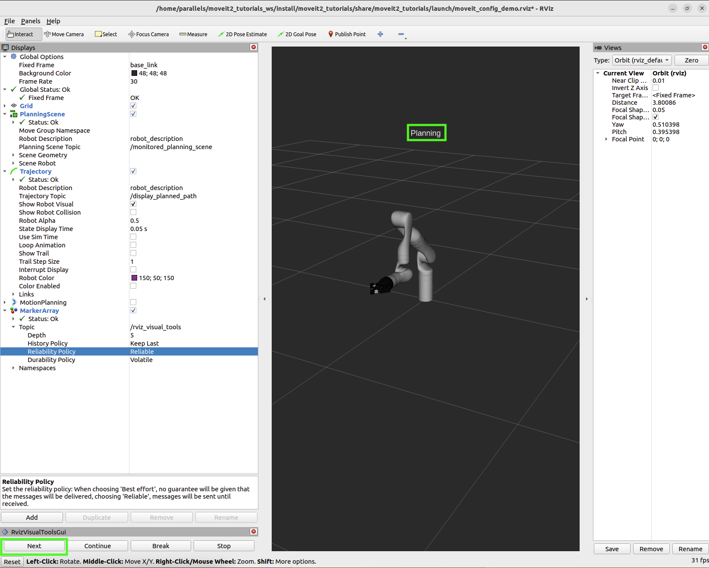
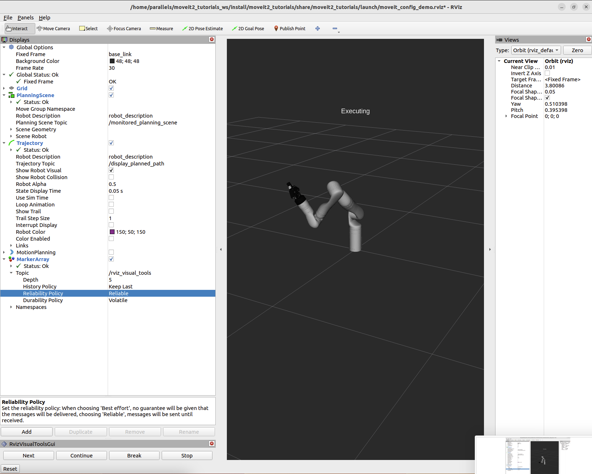
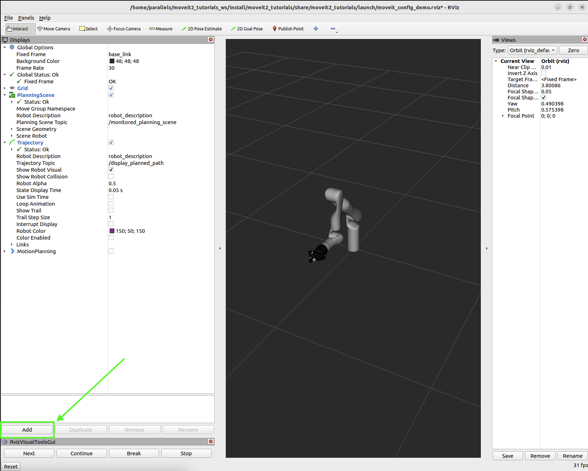

# 第27章 PPT：MoveIt2 Python 规划

> 共 17 页，标注页码 · 图号与教学文档对应

---

## P1 · 标题页

- **课程：** ROS2 机器人编程
- **章节：** 第 27 章 MoveIt2 Python 规划
- **课时：** 2 课时
- **内容：** MoveItPy 编程接口、PlanningComponent 规划与执行、关节空间与位姿目标、IK/FK 直接求解、多目标应用与三步排错法

<!-- 旁白：上一章我们用命令行和 RViz 认识了 MoveIt2，本章进入真正的编程：用官方 Python 接口 MoveItPy 驱动机械臂完成规划、执行、求解与排错。 -->

---

## P2 · 学习目标

- **要点：**
- 掌握 MoveItPy API 的三大核心类：MoveItPy、PlanningComponent、RobotState
- 学会按"设置起始状态 → 设置目标 → 规划 → 执行"四步编写规划程序
- 掌握四种目标设定方式：关节列表、字典、命名位姿、末端位姿
- 理解位置/姿态公差与速度/加速度缩放因子的作用与设置时机
- 会用 KinematicsSolver 直接求解 IK/FK 并查询当前状态
- 掌握规划失败的三步诊断法，并能在 RViz 中观察规划与执行

<!-- 旁白：本章目标围绕"会写、会调、会排错"展开：先掌握核心类与编程流程，再通过关节空间与位姿两类目标落地，最后具备独立分析规划结果的能力。 -->

---

## P3 · MoveItPy 概述与核心类

- **要点：** MoveItPy 是 MoveIt2 官方 Python API，位于 `moveit.planning` 模块，提供运动规划、执行、场景交互与运动学求解能力

| 核心类 | 职责 | 创建示例 |
| --- | --- | --- |
| MoveItPy | 主入口：加载配置、初始化节点与规划场景监听器 | `moveit = MoveItPy(node_name='moveit_py')` |
| PlanningComponent | 对应 MoveGroup 概念，封装某规划组的规划与执行接口 | `PlanningComponent(moveit, 'arm_group', 'link5')` |
| RobotState | 表示机器人状态，可查询/设置关节角与连杆位姿 | `RobotState(robot_model)` |

- 三个参数依次为：MoveItPy 实例、规划组名称、末端执行器 link
- 规划组与 SRDF 中定义一致；末端 link 决定位姿目标的参考对象

<!-- 旁白：强调"一组一组件"——每个规划组各建一个 PlanningComponent，机械臂和手爪各自独立规划、协同配合。 -->

---

## P4 · 编程基本流程

- **要点：** 官方推荐的编程范式是在节点类中封装"设置起始状态 → 设置目标 → 规划 → 执行"四步

```
初始化 MoveItPy + PlanningComponent
        │
        ▼
① 设置起始状态 ─── set_start_state_to_current_state()
        ▼
② 设置规划目标 ─── 关节目标 / 位姿目标 / 命名位姿
        ▼
③ 规划轨迹 ────── plan(planner_id=..., planning_time=...)
        ▼
④ 执行轨迹 ────── execute(plan_result.trajectory)
```

- 教学文档在 `MoveIt2Programmer(Node)` 类的 `plan_and_execute()` 中完整演示该流程
- 每一步成功后再进入下一步，规划失败要检查 `plan_result` 再决策

<!-- 旁白：这页是本章的"骨架"：后续每一节都在细化这四步中的某一步。建议学员先把这四步背下来，再看参数细节。 -->

---

## P5 · 配置参数与官方示例套件

- **要点：** MoveItPy 通过 `config_files` 加载运动学与规划器配置；官方教程套件给出六个可对照学习的组件

```python
moveit = MoveItPy(node_name='moveit_py',
                  config_files=['config/kinematics.yaml',
                                'config/ompl_planning.yaml'])
```

| 官方套件组件 | 作用 |
| --- | --- |
| MoveItPy | 主入口与节点初始化 |
| PlanningSceneMonitor | 监听规划场景与碰撞环境 |
| RobotModel / RobotState | 机器人模型与状态描述 |
| PlanComponents | 装载各规划组组件 |
| PoseGoal / JointGoal | 两类目标示例程序 |
| motion_planning 显示工具 | RViz 中可视化规划结果 |

<!-- 旁白：配置文件决定能用哪些规划器、IK 参数是多少；官方套件在本仓库 ch17_lab 中有对应实现，可边看代码边对照。 -->

---

## P6 · PlanningComponent 创建与参数

- **要点：** 规划前先创建组件并设置公差与缩放因子，这些参数直接决定规划的精度与速度观感

```python
arm = PlanningComponent(moveit, 'arm_group', 'link5')
arm.set_goal_position_tolerance(0.01)
arm.set_goal_orientation_tolerance(0.01)
arm.set_max_velocity_scaling_factor(0.5)
arm.set_max_acceleration_scaling_factor(0.5)
```

| 参数 API | 作用 | 示例值 |
| --- | --- | --- |
| set_goal_position_tolerance | 目标位置公差（米） | 0.01 |
| set_goal_orientation_tolerance | 目标姿态公差（弧度） | 0.01 |
| set_pose_reference_frame | 位姿参考坐标系 | 'base_link' |
| get_end_effector_link | 查询末端执行器 link | 'link5' |
| set_max_velocity_scaling_factor | 速度缩放 0.0~1.0 | 0.5 |
| set_max_acceleration_scaling_factor | 加速度缩放 0.0~1.0 | 0.5 |

<!-- 旁白：公差太紧会规划变慢甚至失败，太松会降低到达精度；缩放因子 0.5 意味着使用一半的最大速度/加速度，调试阶段建议先用小值。 -->

---

## P7 · 目标设定四种方式

- **要点：** 目标类型决定规划维度，PlanningComponent 提供四种等价入口

| 方式 | API | 说明 |
| --- | --- | --- |
| 关节列表 | `set_joint_value_target([0.5, -0.3, ...])` | 按关节顺序给定弧度值 |
| 字典形式 | `set_joint_value_target({'joint1': 0.5})` | 指定关节名，可只写部分关节 |
| 命名位姿 | `set_named_target('home')` | 使用 SRDF 预定义姿态 |
| 末端位姿 | `set_pose_target(pose, 'link5')` | 先解 IK，再进行位姿规划 |

- 末端位姿目标的姿态由四元数给出，可借助 `quaternion_from_euler(pi, 0, 0)` 构造
- 位姿目标通常配合 `set_pose_reference_frame('base_link')` 明确参考系

<!-- 旁白：前三种是关节空间目标——直接指定各关节角度；第四种是笛卡尔空间目标——只关心末端到哪，关节怎么动由 IK 和规划器决定。 -->

---

## P8 · 规划执行与当前状态

- **要点：** `plan()` 返回规划结果对象，`execute()` 依赖控制器执行服务器；状态查询用 RobotState

```python
plan_result = arm.plan(planner_id='RRTConnectkConfigDefault',
                       planning_time=5.0)
arm.execute(plan_result.trajectory)

arm.get_current_joint_values()      # 当前关节角
arm.get_current_pose('link5')       # 末端当前位姿
```

- 执行前提：`/xarm_controller` 与 `/gripper_controller` 的 `follow_joint_trajectory` 执行服务器在线
- 纯仿真可加载 `arm_only.launch.py`（含 controller_manager），程序中用有界等待确认执行服务器可用
- 规划结果包含轨迹点、规划耗时与完成度等信息，执行前应判空

<!-- 旁白：规划成功不代表能执行——控制器不在就会报执行服务器不存在。教学中先确认 launch 文件把控制器拉起来了。 -->

---

## P9 · 关节空间规划与命名位姿

- **要点：** JointSpacePlanner 同时驱动手臂与手爪两个组件，`run_sequence` 演示完整抓取前置序列

- `run_sequence` 流程：`home` → 开手爪 → 关节目标 1 → 关节目标 2 → 合手爪 → 回 `home`
- 手爪为棱柱关节：`[0.65, 0.65]` 为张开，`[0.0, 0.0]` 为闭合

```python
arm.set_start_state_to_current_state()
arm.set_joint_value_target([0.5, -0.3, 0.2, 0.1, 0.0, 0.0])
gripper.set_joint_value_target([0.65, 0.65])   # 张开
```

- 命名位姿在 SRDF 中定义，常用：`home`、`vertical`、`horizontal`、`retract`
- `set_named_target('home')` 与关节目标方式完全等价，只是参数来自配置

<!-- 旁白：命名位姿的价值在于可读性——代码里写 home 比写一串角度清晰得多；抓取序列演示了"手臂+手爪"交替规划的套路。 -->

---

## P10 · 在 RViz 中观察规划与执行

- **要点：** RViz 的 MotionPlanning 面板可同时显示规划轨迹与执行过程，是验证程序行为的直观手段



RViz 中观察规划出的目标位姿与轨迹



RViz 中执行轨迹时机器人状态逐步逼近目标

- 仿真运行：`ros2 launch xarm_ros2_arm_only arm_only_move_group.launch.py use_rviz:=true`
- 运行实验程序：`ros2 run moveit_fk_ik_lab fk_demo`，再用 `ros2 topic echo /joint_states --once` 对照

<!-- 旁白：左图是规划完成后的目标展示，右图是执行中的动态过程。教学中让学员用面板上的 start/goal 状态按钮复现这两幅图。 -->

---

## P11 · 逆运动学规划

- **要点：** IKPlanner 只给末端位姿，MoveIt2 自动解算关节角并规划；参数配置参考自官方教程

```python
arm.set_goal_position_tolerance(0.02)
arm.set_goal_orientation_tolerance(0.03)
arm.set_max_acceleration_scaling_factor(0.6)
arm.set_pose_reference_frame('base_link')

pose = PoseStamped()
pose.header.frame_id = 'base_link'
pose.pose.position.x = 0.3
pose.pose.orientation = quaternion_from_euler(pi, 0, 0)
arm.set_pose_target(pose.pose, 'link5')
```

- `plan_to_pose` 流程：回 home → 构造位姿目标 → 设置起始状态 → 规划 → 执行
- 示例目标点：`(0.3, 0.1, 0.25)`、`(0.3, -0.1, 0.25)`、`(0.4, 0.0, 0.35)`

<!-- 旁白：与关节目标不同，这里程序完全不知道关节角——这正是 IK 规划的价值。提醒学员：目标位姿必须落在工作空间内且避开奇异区。 -->

---

## P12 · 直接 IK/FK 求解与官方要点

- **要点：** KinematicsSolver 不经规划直接解算；正解由 RobotState 查询

```python
# 直接 IK：目标位姿 → 关节角
solver = KinematicsSolver(moveit)
solution = solver.solve_ik('arm_group', target_pose,
                           'link5', robot_state, timeout=0.1)
joints = solution.get_joint_group_positions()

# 直接 FK：关节角 → 末端位姿
robot_state.set_joint_group_positions('arm_group', joints)
robot_state.update()
pose = robot_state.get_pose('link5')
```

- 官方要点一：IK 通常作为规划目标而非独立数学函数；`PlanComponents` 先查询求解器（默认 KDL 数值 IK），对可跳过 IK 的关节空间目标会回退处理
- 官方要点二：`RobotState.setFromIK` 是官方 `solveIK` 示例的核心调用，可获得按评分排序的多个解
- 官方要点三：`getGlobalLinkTransform` 返回 Isometry3d 且无缓存，读取时机决定结果正确性；监控运行状态应订阅 `/joint_states`
- 大幅位姿跳变易落入奇异区或超出工作空间，呼应第 24 章 IK 三约束：多解性、存在性、奇异性

<!-- 旁白：直接求解适合"已知位姿求关节角"的分析型任务；规划式 IK 适合"让机器人走过去"。两者底层都依赖同一套运动学求解器。 -->

---

## P13 · 多目标规划器与规划分析

- **要点：** MultiTargetPlanner 把关节规划与笛卡尔规划封装成统一接口；PlanAnalyzer 输出轨迹指标

```python
class MultiTargetPlanner:
    def go_home(self): ...            # 回 home 位姿
    def plan_joint_motion(self): ...  # set_joint_value_target
    def plan_cartesian_motion(self): ...  # set_pose_target(pose, 'link5')
```

- `run_demo` 演示：`home` → 关节运动 1 → `home` → 笛卡尔运动 1
- PlanAnalyzer 分析规划结果：

| 指标 | 含义 |
| --- | --- |
| 轨迹点数 | 离散化后的路径采样密度 |
| 总时长 | 末点 `time_from_start` |
| 规划耗时 | `plan()` 调用自身开销 |
| 关节运动范围 | 各关节最小/最大角位移 |

<!-- 旁白：对比关节运动与笛卡尔运动的轨迹点数与时长，能让学员直观感受两种规划在路径形态上的差异，为下一章笛卡尔路径做铺垫。 -->

---

## P14 · 排错三步法与仿真结合

- **要点：** 规划失败按官方三步诊断；仿真结合时先确认 MotionPlanning 面板已添加



RViz 中通过 Add 按钮添加 MotionPlanning 面板

| 步骤 | 手段 | 看什么 |
| --- | --- | --- |
| 1 | 规划日志 | error code 1/2/3：1 起始状态越限、2 目标不可达（IK 无解）、3 规划器超时 |
| 2 | RViz Planning Scene 面板 | 勾选显示 start/goal 状态，目测目标是否在可行域内 |
| 3 | move_group debug 日志 | 采样失败发生在哪个空间维度 |


fk_ik_lab 程序在仿真中的运行输出

<!-- 旁白：三步法从"读日志"到"看图"再到"开 debug 深挖"，代价递增。教学中给出一个故意不可达的目标，让学员完整走一遍流程。 -->

---

## P15 · 本章要点

- MoveItPy 三大核心类：MoveItPy 主入口、PlanningComponent 规划组件、RobotState 状态对象
- 编程四步流程：设置起始状态 → 设置目标 → `plan()` → `execute()`
- 目标四种方式：关节列表、字典、命名位姿、末端位姿——类型决定规划维度
- 公差与缩放因子须在规划前设置：位置/姿态公差控制精度，缩放因子控制快慢
- 关节空间目标用 `set_joint_value_target`/`set_named_target`，位姿目标用 `set_pose_target`
- 直接求解：`KinematicsSolver.solve_ik` 求 IK，RobotState 的 `get_pose` 求 FK
- 排错三步：规划日志 error code → RViz start/goal 可视化 → move_group debug 日志

<!-- 旁白：带学员把这七条当作"通关清单"自查：每一条都能在 ch17_lab 的代码里指出对应实现，即达到本章要求。 -->

---

## P16 · 练习题

1. 编写程序让机械臂依次运动到 5 个不同的关节目标，每次到达后输出当前关节值
2. 让末端执行器沿 Z 轴上升 0.1 米、沿 X 轴移动 0.2 米，再回到初始位置（使用位姿目标）
3. 分别用命名位姿与关节目标两种方式让机械臂到达同一姿态，对比规划结果的轨迹点数与总时长
4. 使用 IK 求解器计算位姿 `(0.3, 0.1, 0.2, roll=pi)` 对应的关节角，并验证解的正确性
5. 编写正运动学程序：读取 `/joint_states` 中的关节角，输出末端 `link5` 的位姿

<!-- 旁白：练习 1~3 巩固规划流程，练习 4~5 对应直接 IK/FK 求解。建议课上完成 1、4，其余作为课后作业，全部基于 ch17_lab 框架改写。 -->

---

## P17 · 下章预告

- **下一章：** 第 28 章 MoveIt2 笛卡尔空间与避障
- **预告内容：** 笛卡尔连续路径规划（笛卡尔空间多路径点）、路径约束与避障策略
- **与本章关系：** 本章的 `set_pose_target` 只解决"单个位姿目标"；下一章把多个位姿串成连续路径，并让机器人在障碍物环境中安全通过

<!-- 旁白：结尾抛出问题——如果末端要沿直线走一整段轨迹，逐点调用 set_pose_target 会怎样？带着这个疑问进入第 28 章的笛卡尔路径规划。 -->
