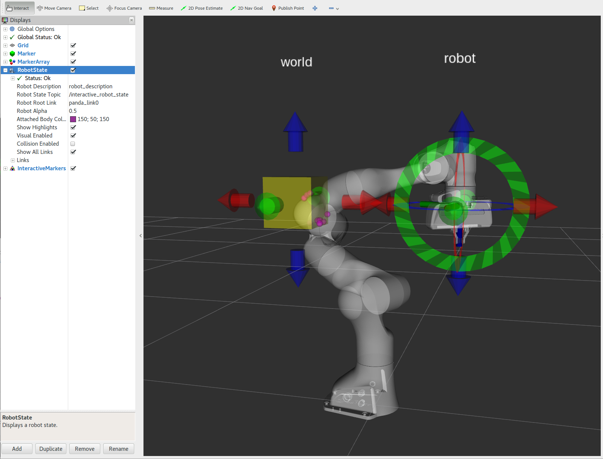
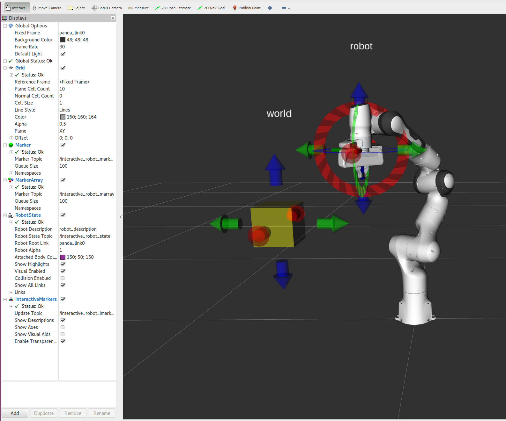
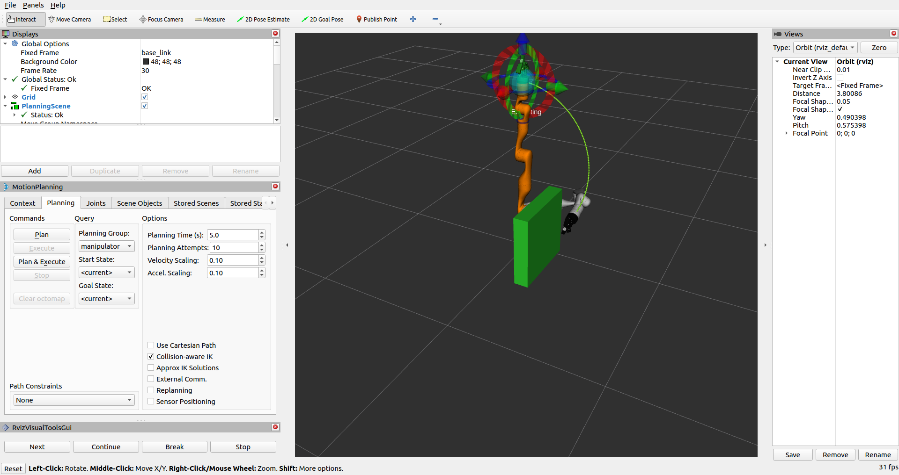
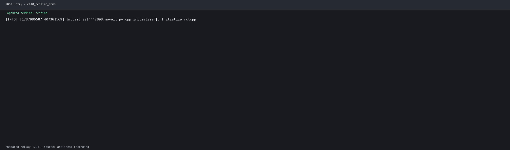

# 第28章 PPT：MoveIt2 笛卡尔空间与避障

> 共 17 页，标注页码 · 图号与教学文档对应

---

## P1 · 标题页

- **课程：** ROS2 机器人编程
- **章节：** 第 28 章 MoveIt2 笛卡尔空间与避障
- **课时：** 2 课时
- **内容：** 直线/圆弧/复杂路径的笛卡尔规划、computeCartesianPath 三参数、位姿约束、规划场景与障碍物管理、物体附着、避障策略与安全余量、狭窄通道规划器对比

<!-- 旁白：上一章用 MoveItPy 做关节空间规划，本章让末端按用户指定的空间路径运动：先讲直线、圆弧与复杂路径的笛卡尔规划，再讲位姿约束与规划场景障碍物，最后给出避障策略与官方调参建议。 -->

---

## P2 · 学习目标

- **要点：**
- 掌握笛卡尔空间路径规划方法：直线、圆弧与 S 形/锯齿形复杂路径
- 理解 `plan_cartesian_path` 的参数含义，会用 fraction 判断路径完成度
- 掌握位姿约束的四种类型，并会用 `set_path_constraints` 添加约束
- 学会通过规划场景接口添加、移除与附着障碍物，动态更新场景
- 掌握避障规划策略与碰撞安全余量（padding）的设置方法
- 了解 OMPL 官方对狭窄通道问题的规划器选择建议

<!-- 旁白：本章目标围绕"路径可控与场景感知"展开：笛卡尔规划保证末端轨迹，位姿约束与规划场景让规划感知需求与环境，最终在障碍物环绕下仍能规划出安全路径。 -->

---

## P3 · 笛卡尔路径规划基础

- **要点：** 笛卡尔空间规划让末端执行器沿用户指定的直线或曲线运动，中间点由规划器插值生成，适用于焊接、涂胶、搬运等高精度作业

| 特性 | 笛卡尔空间 | 关节空间 |
| --- | --- | --- |
| 末端轨迹 | 可控（直线/曲线） | 不可控 |
| IK 需求 | 需要 | 不需要 |
| 计算量 | 大 | 小 |
| 适用场景 | 精密作业、路径受限任务 | 点对点快速移动 |
| 奇异问题 | 容易出现 | 不容易出现 |

- 高精度任务必须做笛卡尔规划；单纯"点对点"移动用关节空间即可

<!-- 旁白：先明确两类空间的分工：关节空间只保证起点和终点，笛卡尔空间保证中间过程，代价是 IK 计算量大且更易遇到奇异位形。 -->

---

## P4 · 直线路径规划

- **要点：** `plan_cartesian_path` 输入末端 waypoint 列表，输出插值后的轨迹；当 fraction 达到 1.0 才可执行

```python
waypoints = [p0, p1, p2]            # 末端路径点（Pose 列表）
plan_result = self.arm.plan_cartesian_path(
    waypoints, 0.01, 0.0, True      # eef_step=0.01, jump_threshold=0.0, avoid_collisions=True
)
if plan_result:
    fraction = plan_result.fraction
```

- fraction 是成功插值的路径点比例：1.0 为完整成功，小于 1.0 说明部分点碰撞/奇异/超限
- 官方要求 fraction 达到 1.0（或显式接受的阈值）才执行；失败可重试以提高完成度

<!-- 旁白：fraction 是笛卡尔规划的核心返回值，它直接告诉你这条"直线"能走多远、卡在哪里；本章源代码里用 while 循环重试直到 fraction 达到 1.0。 -->

---

## P5 · 圆弧与复杂路径

- **要点：** `plan_cartesian_path` 只支持直线段，圆弧等曲线用"微分思想"切分为密集小线段近似，路径点越密越接近真实曲线

```python
# 圆弧：Y-Z 平面内以 (0.4, 0.0, 0.35) 为圆心、半径 0.1 的圆
for th in np.arange(0, math.pi * 2, 0.015):
    target_pose.pose.position.y = center_y + radius * math.cos(th)
    target_pose.pose.position.z = center_z + radius * math.sin(th)
    waypoints.append(deepcopy(target_pose.pose))

# 圆弧路径规划，fraction 达到 1.0 才执行
plan_result = self.arm.plan_cartesian_path(waypoints, 0.01, 0.0, True)
```

- S 形路径：`generate_s_shape`（幅值 0.05、20 步，Y 方向按 sin 变化）
- 锯齿形路径：`generate_zigzag`（宽度 0.08、4 段往返）
- 多个 waypoint 一次性规划；转弯处规划器会停顿重算，正方形四边应分四次直线段完成

<!-- 旁白：圆弧的精度取决于采样密度：np.arange(0, 2π, 0.015) 意味着每段约 0.86 度，400 多个 waypoint 用直线逼近一个圆；S 形和锯齿形同理，都是把参数方程变成 waypoint 列表。 -->

---

## P6 · 官方要点：computeCartesianPath 的三个参数

- **要点：** 官方 Cartesian Path 教程明确三个决定性参数：`eef_step`、`jump_threshold`、`avoid_collisions`

| 参数 | 作用 | 官方建议 |
| --- | --- | --- |
| eef_step | 末端插值步长，决定 waypoint 间采样密度 | 0.01 m 量级，过大会跳过碰撞 |
| jump_threshold | 关节空间跳变阈值，拒绝解臂形变附近的"假直线" | 设 0 表示禁用检测 |
| avoid_collisions | 是否在插值中逐点做碰撞检查 | 必开 |

- 返回值 fraction 必须达到 1.0（或显式接受的阈值）才可执行
- 练习第 1 题的"正方形四边"用四次直线笛卡尔段，而非一个 waypoint 列表直接到位

<!-- 旁白：此节编译自 moveit.picknik.ai 的 Cartesian Path 教程：三个参数决定精度与安全性，其中 eef_step 过大会直接跳过薄障碍，是实战中最常见的坑。 -->

---

## P7 · 位姿约束类型

- **要点：** 位姿约束在规划过程中限制路径行为，确保中间路径满足特定要求，MoveIt2 支持四种约束

| 约束类型 | 说明 | 适用场景 |
| --- | --- | --- |
| PositionConstraint | 位置约束，限制末端位置范围 | 保持末端在指定区域内 |
| OrientationConstraint | 姿态约束，保持末端姿态 | 保持工具朝下、水平等 |
| JointConstraint | 关节约束，限制特定关节角度 | 限制某关节角度范围 |
| VisibilityConstraint | 可见性约束，目标必须位于视野内 | 相机感知类任务 |

- 编程统一通过 `Constraints` 消息与 `set_path_constraints` 接口添加，`clear_path_constraints` 清除

<!-- 旁白：四种约束对应不同的作业语义：位置约束划区域、姿态约束固定朝向、关节约束限定构型、可见性约束服务视觉任务；后续抓取与放置章节还会大量用到姿态约束。 -->

---

## P8 · 添加位姿约束

- **要点：** 位置约束用 `PositionConstraint` 定义约束区域（球体），姿态约束用 `OrientationConstraint` 设定目标朝向与各轴容忍度

```python
pc = PositionConstraint()
pc.header.frame_id = 'base_link'
pc.link_name = 'link5'
pc.weight = 1.0
sphere = SolidPrimitive()
sphere.type = SolidPrimitive.SPHERE
sphere.dimensions = [0.3]          # 半径 0.3 米的球体
pc.constraint_region.primitives = [sphere]
pc.constraint_region.primitive_poses = [Pose()]
pc.constraint_region.primitive_poses[0].position.x = 0.3

constraints = Constraints()
constraints.position_constraints = [pc]
self.arm.set_path_constraints(constraints)
```

- 姿态约束：末端朝下用欧拉角 (π, 0, 0) 转四元数，三轴容忍度各 0.1 rad
- 关节约束：`JointConstraint(joint_name, position, tolerance_above, tolerance_below)`，容忍度一般取 ±0.1

<!-- 旁白：约束区域既可以用球体，也可以组合盒体/圆柱体；姿态约束的 tolerance 决定"保持朝向"的宽松程度，Write 容差越大规划越容易成功。 -->

---

## P9 · 官方要点：位姿约束与圆弧轨迹的官方做法

- **要点：** 官方文档对"带约束的圆弧"给出的标准方案是"密集 waypoint + 位姿约束"

- 应用层按参数方程生成圆弧上的采样位姿（每段 0.005~0.01 rad），逐次调用笛卡尔规划
- 或改用 `MotionPlanRequest` 的 `path_constraints`（方向约束 tolerance），让优化型规划器在连续空间内保持姿态
- 官方提醒：笛卡尔路径是"直线插值 + 校验"而非"带约束的求解"，圆弧越细越接近真实弧线
- 这也是 The Construct 课程中"画圆"练习的核心结论

<!-- 旁白：关键认知是笛卡尔规划只做插值与校验，不做约束求解；想要精确圆弧，要么把 waypoint 加密，要么显式加上方向约束交给优化型规划器。 -->

---

## P10 · 规划场景与障碍物

- **要点：** 规划场景涉及三个关键概念：`CollisionObject`（碰撞物体）、`AttachedCollisionObject`（附着物体）与 `PlanningScene`（完整场景消息）

| 物体类型 | SolidPrimitive 类型 | 典型尺寸参数 |
| --- | --- | --- |
| 长方体 | BOX | 长宽高三维尺寸 |
| 球体 | SPHERE | 半径 |
| 圆柱体 | CYLINDER | 高与半径 |
| 网格模型 | MESH | 网格文件路径 |

```python
co = CollisionObject()
co.id = 'box_obs'
co.header.frame_id = 'base_link'
co.operation = CollisionObject.ADD
co.primitives = [primitive]                 # SolidPrimitive 几何
co.primitive_poses = [pose.pose]
self.planning_scene_monitor.process_collision_object(co)
```



实心球、盒体、桌板等典型碰撞物体的可视化

- 颜色通过 `ObjectColor` + `PlanningScene(is_diff=True)` 发布；`REMOVE` 操作移除障碍物

<!-- 旁白：仿真演示里用 add_box 加桌板、add_sphere 加障碍球、再 add_color 上色，旁边两张图展示碰撞物体在 RViz 中的显示效果；真实环境则走深度相机生成的八叉树网格。 -->

---

## P11 · 物体附着与分离

- **要点：** 机械臂抓取物体后，用 `AttachedCollisionObject` 把物体附着到末端连杆，使其随末端运动并参与碰撞计算

```python
aco = AttachedCollisionObject()
aco.link_name = link_name                   # 附着到哪个连杆
aco.object = co                             # CollisionObject 本体
aco.touch_links = ['link5', 'gripper_link'] # 允许接触的连杆列表

self.psm.process_attached_collision_object(aco)
self.psm.process_attached_collision_object(aco_detach)  # 分离：REMOVE 操作
```

- 附着后物体从环境碰撞体变为机器人的一部分，规划时随末端连杆运动
- `touch_links` 声明允许接触的连杆，避免抓手与物体被误判为碰撞

<!-- 旁白：附着与分离是一对镜像操作：attach 后物体"长"在末端上，任何关节规划都会带着它走；detach 后物体回到场景中，碰撞检查恢复为环境障碍物。 -->

---

## P12 · 官方要点：规划场景官方 API

- **要点：** 官方 Planning Scene 教程将场景操作归纳为四个操作：`applyCollisionObjects`、`moveCollisionObject`、`attachObject` 与 `detachObject`

| 操作 | 作用 |
| --- | --- |
| applyCollisionObjects | 批量添加 box/sphere/cylinder/mesh，含位姿与颜色 |
| moveCollisionObject | 平移已存在的物体 |
| attachObject | 把物体挂到指定连杆，随末端运动 |
| detachObject | 释放回场景 |

- 附着后自碰撞检查把物体与机械臂的接触视为合法（通过 Allowed Collision Matrix 自动放行），抓取后工作空间行为显著变化
- 真实深度相机环境走 octomap 通道自动更新，`/planning_scene` topic 是官方标准的场景监控接口

<!-- 旁白：练习第 4 题"附着前后差异"在官方教程有精确对应：附着后物体进入 ACM 自动放行列表，因此可以贴着抓手运动而不报碰撞。 -->

---

## P13 · 避障规划策略与安全余量

- **要点：** 避障规划基于四项策略：碰撞检测、配置空间搜索、安全余量设置与环境变化重规划

| 设置项 | 作用 |
| --- | --- |
| padding | 全局碰撞安全余量 0.02 m |
| padding_scale | 缩放因子 1.0 |
| max_contacts | 最大碰撞接触点数 10 |

- 编程方式：`AllowedCollisionMatrix` 设置特定连杆对放行，`CollisionRequest(padding=margin)` 带安全余量检测
- `padding` 越大越安全，但会缩小可通过空间，需在安全与可达性之间权衡



RViz 中碰撞检测结果的可视化

<!-- 旁白：安全余量不是越大越好——padding 0.02 意味着所有物体外扩 2 厘米，障碍物之间 4 厘米的缝才过得去，这也是狭窄通道题要调 padding 的原因。 -->

---

## P14 · 避障规划完整示例与 RViz 可视化

- **要点：** 在规划场景中加入桌子和左右障碍物，目标点在障碍物后方，用 RRTConnect 最多尝试 5 次规划

```python
plan_result = self.arm.plan(
    planner_id='RRTConnectkConfigDefault',
    planning_time=5.0          # 增加规划时间提高成功率
)
```

- 场景：桌子（0.8×0.6×0.02）+ 左/右障碍物（0.1×0.1×0.3 位于 (0.3, ±0.2, 0.15)），目标 (0.4, 0.0, 0.25)
- RViz MotionPlanning 插件：PlanningScene Topic 填 `/planning_scene`，Robot Description 填 `robot_description`，并打开 Show Robot Collision
- 规划失败先检查障碍物是否阻塞、规划时间是否充足、规划器参数是否合适



绕开障碍物的规划路径示意



<!-- 旁白：这段程序把本章所有知识点串起来：建场景、加障碍、避障规划、结果可视化一气呵成；xArm 实机演示中还能用 RViz 的 Planning Scene 面板现场加盒子，观察路径与碰撞结果实时变化。 -->

---

## P15 · 本章要点

- **要点：**
- `plan_cartesian_path` 以 waypoint 列表做直线插值，fraction 达到 1.0 才执行
- 圆弧/S 形等复杂路径用密集采样"以直代曲"，采样越密越接近真实曲线
- computeCartesianPath 三参数：eef_step、jump_threshold、avoid_collisions
- 位姿约束四类型：位置、姿态、关节、可见性，统一用 set_path_constraints 添加
- CollisionObject/AttachedCollisionObject 动态管理规划场景，支持添加、移除与附着
- 避障四策略：碰撞检测、配置空间搜索、安全余量、重规划
- 狭窄通道难题：RRTConnect 几乎必成于开阔空间，PRM/EST 更依赖采样扩散，可对比成功率调参

<!-- 旁白：把本章知识收敛为一条主线：让末端走限定路径，让规划感知环境，让路径安全通过障碍，三件事环环相扣。 -->

---

## P16 · 练习题

1. 编写笛卡尔路径规划程序，使末端执行器沿正方形的四条边运动（边长 0.1 米），回到起点。

2. 编写圆弧轨迹规划程序，使末端在水平面内画一个完整的圆形。

3. 在规划场景中添加三个不同形状的障碍物（盒体、球体、圆柱体），规划一条从起点到终点的避障路径。

4. 编写程序，将物体附着到末端执行器后规划运动，再分离物体，比较附着前后的规划行为差异。

5. 设计一个包含狭窄通道的避障场景，测试不同规划器（RRTConnect、PRM、EST）通过狭窄通道的成功率。

<!-- 旁白：五道题由易到难：前两题练 path 生成，第三题练场景接口，第四题练附着语义，第五题练规划器对比——每道题都能直接在 xArm 仿真或实机上验证。 -->

---

## P17 · 下章预告

- **要点：**
- 下一章进入第 29 章「抓取与放置编程」
- 先用 MoveIt Task Constructor 把"抓取—搬移—放置"分解为任务阶段
- 再为每个阶段设置抓取姿势、场景物体与失败回退逻辑
- 最终用 MTC 在仿真中演示完整的抓取与放置流水线

<!-- 旁白：抓取与放置是工业机器人的经典场景：任务如何分解、物品如何识别与抓取、失败如何回退，下一章用 MoveIt Task Constructor 一一拆解。 -->