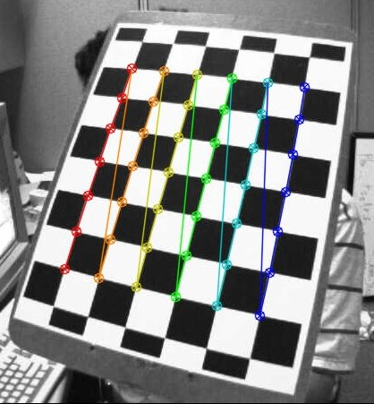

# 第30章 PPT：ROS2 图像接口与相机标定

> 共 17 页，标注页码 · 图号与教学文档对应

---

## P1 · 标题页

- **课程：** ROS2 机器人编程
- **章节：** 第 30 章 ROS2 图像接口与相机标定
- **课时：** 2 课时
- **内容：** 图像消息接口、cv_bridge 图像转换、image_transport 传输机制、usb_cam 驱动、相机标定原理与流程

<!-- 旁白：上一章完成了抓取与放置，而抓取的感知源头是相机；本章进入图像世界，先打通消息接口，再完成相机标定，为后续颜色检测与 YOLO 目标检测打好基础。 -->

---

## P2 · 学习目标

- **要点：**
- 掌握 sensor_msgs/Image 消息结构与 CameraInfo 相机内参消息
- 学会使用 cv_bridge 完成 ROS2 图像与 OpenCV 格式互转
- 理解 image_transport 图像传输机制与压缩传输
- 学会 usb_cam 驱动的安装、配置与多摄像头使用
- 理解相机标定原理：内参矩阵与畸变系数
- 掌握 camera_calibration 棋盘格标定的完整流程

<!-- 旁白：本章目标是一条完整链路：消息格式理解、cv_bridge 互转、传输优化、驱动接入，最后用标定把像素坐标与真实世界对齐。 -->

---

## P3 · Image 消息结构

- **要点：** ROS2 用 sensor_msgs/Image 作为标准图像消息，原始像素以扁平字节流承载

```
sensor_msgs/Image
  - header          # 消息头 (stamp, frame_id)
  - height          # 图像高度 (像素)
  - width           # 图像宽度 (像素)
  - encoding        # 编码格式 (rgb8, bgr8, mono8...)
  - is_bigendian    # 字节序
  - step            # 行字节数 (width * bytes_per_pixel)
  - data            # 原始图像数据 (uint8数组)
```

- `encoding` 字段决定图像数据的解释方式，与 OpenCV 类型一一对应
- 高分辨率图像可改用 `sensor_msgs/CompressedImage`：`format`(jpeg/png/bmp) + `data`，大幅减少带宽

<!-- 旁白：Image 消息的要点是非布局的：行数、列数、编码与行步长都在头部给出，像素则是一维数组；解析图像等于按 header 里的元信息把 data 重新排版成二维矩阵。 -->

---

## P4 · 编码格式对应表

- **要点：** encoding 值与 OpenCV 类型一一对应，灰度、彩色、带通道与浮点深度图各有约定

| encoding值 | OpenCV类型 | 说明 |
| --- | --- | --- |
| mono8 | CV_8UC1 | 8位灰度图 |
| mono16 | CV_16UC1 | 16位灰度图 |
| bgr8 | CV_8UC3 | BGR彩色图（OpenCV默认） |
| rgb8 | CV_8UC3 | RGB彩色图 |
| bgra8 | CV_8UC4 | BGR带Alpha通道 |
| rgba8 | CV_8UC4 | RGB带Alpha通道 |
| 32FC1 | CV_32FC1 | 32位浮点深度图 |

- 通道数规则：mono/32f 为单通道，bgr8/rgb8 为三通道，bgra8/rgba8 为四通道
- 常见坑：OpenCV 默认 BGR，先转灰度再发布时必须用 `mono8` 而非 `bgr8`

<!-- 旁白：转换表要横向记忆：一端是 ROS 字符串，另一端是 OpenCV 常量；实际开发中 bgr8、mono8、32FC1 三种最常用，分别对应彩色、灰度与深度。 -->

---

## P5 · CameraInfo 消息

- **要点：** 相机内参通过 /camera_info 话题发布，k 为内参矩阵，d 为畸变系数

```
sensor_msgs/CameraInfo
  - header
  - height, width           # 图像分辨率
  - distorsion_model        # 畸变模型 (plumb_bob, rational...)
  - d                       # 畸变系数 [k1, k2, p1, p2, k3]
  - k                       # 内参矩阵 [fx, 0, cx; 0, fy, cy; 0, 0, 1]
  - r                       # 校正矩阵 (3x3)
  - p                       # 投影矩阵 (3x4)
  - binning_x, binning_y    # 合并像素
  - roi                     # 感兴趣区域
```

```python
def info_callback(self, msg):
    self.get_logger().info(f'分辨率: {msg.width}x{msg.height}')
    self.get_logger().info(f'内参矩阵: {msg.k}')
    self.get_logger().info(f'畸变系数: {msg.d}')
```

- `k` 是 9 个元素的一维数组，需要 reshape(3, 3) 使用

<!-- 旁白：CameraInfo 与 Image 是双胞胎：一张图加一份相机参数，才能把像素换算成射线；k 的九个元素要按行主序 reshape 成 3x3 矩阵后再参与计算。 -->

---

## P6 · 官方要点：sensor_msgs 定义与 cv_bridge 教程

- **要点：** 官方把字段语义写死在接口里：encoding 复用 OpenCV 字符串、step 是行字节数（含内存对齐）、data 为扁平字节流

- 官方 cv_bridge 教程约定转换有复制与共享所有权（share）两种模式
- 共享模式零拷贝，但要求后续算法不得改动图像缓冲，是性能与线程安全的分界线
- 转灰度后重新发布必须先在副本上改写，再发布，这正是练习第 1 题的关键
- 官方要点出处：docs.ros.org、ros-perception/image_pipeline 与 OpenCV 官方标定教程

<!-- 旁白：官方文档最有价值的提醒是内存语义：共享模式为什么快、为什么不能改，理解了这一点，图像流水线里"必须复制再改写"的规则就顺理成章了。 -->

---

## P7 · cv_bridge 图像转换

- **要点：** cv_bridge 提供 ROS2 Image 与 OpenCV Mat 的双向转换，是图像编程的桥头堡

```
ROS2 Image ──imgmsg_to_cv2()──→ OpenCV Mat
OpenCV Mat ──cv2_to_imgmsg()──→ ROS2 Image
```

```python
cv_image = self.bridge.imgmsg_to_cv2(data, 'bgr8')
gray = cv2.cvtColor(cv_image, cv2.COLOR_BGR2GRAY)
msg = self.bridge.cv2_to_imgmsg(gray, 'mono8')
msg.header.stamp = self.get_clock().now().to_msg()
msg.header.frame_id = 'camera_link'
self.image_pub.publish(msg)
```

- 转换失败抛 CvBridgeError，订阅回调中必须 try/except 包裹
- 发布前必须手动填充 `header.stamp` 与 `frame_id`

<!-- 旁白：记住"入 bgr8、出 mono8"的套路：订阅端按相机默认编码解析，发布端按处理结果编码发布；这是视觉节点最常见的第一段代码。 -->

---

## P8 · 图像发布节点

- **要点：** 图像发布节点的骨架是"摄像头上帧 + 定时器驱动发布"，用 OpenCV 打开设备并定时发布

```python
self.cap = cv2.VideoCapture(0)
self.cap.set(cv2.CAP_PROP_FRAME_WIDTH, 640)
self.cap.set(cv2.CAP_PROP_FRAME_HEIGHT, 480)
self.cap.set(cv2.CAP_PROP_FPS, 30)
self.timer = self.create_timer(0.033, self.timer_callback)
```

```python
ret, frame = self.cap.read()
msg = self.bridge.cv2_to_imgmsg(frame, 'bgr8')
msg.header.stamp = self.get_clock().now().to_msg()
msg.header.frame_id = 'camera_link'
self.pub.publish(msg)
```

- 定时器周期 0.033 s 与 30 fps 对应；摄像头打开失败要主动报错
- 析构时 `cap.release()` 释放设备

<!-- 旁白：这个节点把前面所有零件组装起来：VideoCapture 是设备抽象，create_timer 把采集变成周期话题流量，cv2_to_imgmsg 完成格式转换，一个完整的话题发布端就绪。 -->

---

## P9 · image_transport 传输机制

- **要点：** image_transport 是图像发布/订阅的抽象层，同一图像在 raw 与 compressed 等后缀话题上共存，订阅端按需选择

| 标准插件 | 话题后缀 | 传输内容 |
| --- | --- | --- |
| raw | /image_raw | 原始 sensor_msgs/Image |
| compressed | /image_raw/compressed | JPEG/PNG 压缩图像 |
| compressedDepth | /image_raw/compressedDepth | 深度图像压缩 |
| theora | /image_raw/theora | 视频流编码 |
| video | /image_raw/video | 视频格式 |

- 官方要点：image_transport 本质是"话题重发布器"，插件通过 pluginlib 动态加载
- `CameraPublisher` 可把 Image 与 CameraInfo 同步发布
- 压缩发布只需把 `advertise()` + `publish()` 换成 transport 版，算法代码不变

<!-- 旁白：理解 image_transport 的关键是"约定的后缀"：订阅方用 raw 拿原始图、用 compressed 拿压缩图，发布方并不关心谁在听；带宽焦虑时换后缀即可，不动算法代码。 -->

---

## P10 · usb_cam 驱动使用与参数配置

- **要点：** usb_cam 支持 UVC 标准 USB 摄像头，即装即用发布 /image_raw 与 /camera_info，多摄像头靠重映射隔离

```bash
sudo apt install ros-jazzy-usb-cam
ros2 run usb_cam usb_cam_node_exe \
  --ros-args --params-file usb_cam_params.yaml
ros2 run image_tools showimage --ros-args -r image:=/image_raw
```

| 参数 | 说明 |
| --- | --- |
| video_device | 设备路径（/dev/video0） |
| framerate | 帧率（30.0） |
| frame_id | 坐标系（camera_link） |
| pixel_format | 像素格式（yuyv） |
| image_width/height | 分辨率（640x480） |

```bash
ros2 run usb_cam usb_cam_node_exe \
  --ros-args --remap __node:=usb_cam2 \
  -p video_device:=/dev/video2 \
  --remap /image_raw:=/camera2/image_raw \
  --remap /camera_info:=/camera2/camera_info
```

- 参数文件按 `/**:` 命名空间写入 `ros__parameters`；命令行 `-p` 单参数覆盖与 `--params-file` 可混用

<!-- 旁白：usb_cam 是 ROS2 里最常用的摄像头驱动：安装即用，把 UVC 摄像头变成两个标准话题；多摄像头是车上常态，方案不是多写代码，而是重映射：节点名错开、话题名错开，一套逻辑服务多路相机。 -->

---

## P11 · 相机标定原理

- **要点：** 相机把三维世界映射到像素平面，内参矩阵 K 描述映射关系；畸变分径向与切向两类

```
    [ fx   0   cx ]
K = [ 0    fy  cy ]
    [ 0    0    1 ]
```

- fx, fy 为焦距（像素单位），cx, cy 为光心坐标（像素）
- 径向畸变 k1, k2, k3：桶形/枕形，离中心越远越明显
- 切向畸变 p1, p2：镜头与传感器不平行
- 张氏标定（Zhang's method）通过最小化重投影误差求解参数


径向畸变下棋盘格边缘变弯曲的示例

<!-- 旁白：标定的本质是求解 K 与畸变系数这组数，让"棋盘格上已知间距的角点"投影误差最小；官方经验阈值：单目标定重投影 RMS 低于约 0.5 像素，否则要补样本。 -->

---

## P12 · 标定板与角点检测

- **要点：** 标定板提供已知几何的图案，三种图案按精度需求选择；OpenCV 用 findChessboardCorners 提取角点

| 标定图案 | 特点 | 适用 |
| --- | --- | --- |
| 棋盘格（Chessboard） | 黑白交替方格，最常用 | 常规标定 |
| 对称圆点图案 | 规则排列的圆形 | 中等精度场景 |
| 非对称圆点图案 | 错位排列 | 高精度标定 |

```python
board = np.zeros((6*200, 8*200, 3), dtype=np.uint8)
for i in range(6):
    for j in range(8):
        if (i + j) % 2 == 0:
            board[i*200:(i+1)*200, j*200:(j+1)*200] = 255
cv2.imwrite('calibration_board.png', board)
```

- 打印后贴在硬板上，确保平整无折痕；`--size 8x6` 指内角点数（官方填 7x5）



检测棋盘格内角点并绘制的结果

<!-- 旁白：角点是标定的已知点：我 知道它们在板上的三维间距，又测出它们在图像里的二维坐标，一组对应关系就是一个方程；内角点数量是"格子数减一"，填参数时别把它和方格数混了。 -->

---

## P13 · camera_calibration 标定流程

- **要点：** ROS 官方标定工具按"覆盖区域 → 倾斜与远近 → 指标全绿 → Calibrate → Save"五步完成标定

```bash
sudo apt install ros-jazzy-camera-calibration

ros2 run camera_calibration cameracalibrator.py \
  --size 8x6 --square 0.0245 \
  image:=/camera/color/image_raw camera:=/camera
```

- 缓慢移动标定板，覆盖画面各个区域
- 倾斜不同角度，并让标定板接近和远离相机
- X, Y, Size, Skew 四条指标条全部变绿后点击 Calibrate
- Save 保存结果到 `/tmp/calibrationdata.tar.gz`

<!-- 旁白：标定的成败在采集：四种体位都要覆盖、远近都要有，四条指标条全绿说明样本分布足够；采集是体力活，Save 前的一分钟，之后全是计算。 -->

---

## P14 · 标定结果加载与仿真校验

- **要点：** 标定结果以 yaml 保存，加载后调用 getOptimalNewCameraMatrix 与 undistort 完成去畸变

```python
data = yaml.safe_load(open(calib_file))
camera_matrix = np.array(data['camera_matrix']['data']).reshape(3, 3)
dist_coeffs = np.array(data['distortion_coefficients']['data'])
```

```python
new_cam, roi = cv2.getOptimalNewCameraMatrix(K, d, (w, h), 1, (w, h))
undistorted = cv2.undistort(frame, K, d, None, new_cam)
```


去畸变后棋盘格边缘恢复为直线

- 仿真校验：启动 Gazebo 相机后 `ros2 topic echo /camera/camera_info --once`，观察 k 矩阵与输出分辨率
- rqt_image_view 可直接订阅 /camera/image_raw 实时查看画面


<!-- 旁白：去畸变有两种实现：undistort 整图一次完成，initUndistortRectifyMap+remap 查表加速适合视频流；注意仿真内参是模型设定值，不等同于真实镜头的标定结果。 -->

---

## P15 · 本章要点

- **要点：**
- Image 消息：header/encoding/step/data，像素是扁平字节流；高带宽用 CompressedImage
- CameraInfo 的 k 为内参矩阵，d 为畸变系数，使用前 reshape(3, 3)
- cv_bridge 双向转换：入 bgr8、出 mono8，发布前补 header；共享模式零拷贝但不可改缓冲
- 图像发布骨架：VideoCapture + create_timer + cv2_to_imgmsg
- image_transport 按后缀选择传输格式，压缩发布不改算法代码
- usb_cam 即装即用，多摄像头靠节点与话题重映射隔离
- 标定五步流程：采集覆盖 → 全绿 → Calibrate → Save → 加载去畸变（重投影 RMS < 0.5 像素）

<!-- 旁白：收敛主线：消息格式决定看得懂，cv_bridge 决定能处理，标定决定测得准；下一章的颜色检测与 YOLO 将站在这条链路上直接消费图像话题。 -->

---

## P16 · 练习题

1. 编写ROS2节点，订阅相机图像话题，将彩色图像转换为灰度图并重新发布。

2. 使用usb_cam驱动启动USB摄像头，查看其发布的/image_raw和/camera_info话题内容。

3. 使用camera_calibration工具对相机进行标定，保存标定结果并编写节点加载标定参数。

4. 编写节点，对输入的图像进行畸变校正，并发布校正后的图像话题。

5. 实现一个图像传输节点，使用image_transport发布压缩图像，并在订阅端显示。

<!-- 旁白：由易到难：第 1 题练 cv_bridge 双向转换，第 2 题练驱动与消息查看，第 3 题练完整标定链路，第 4 题练去畸变，第 5 题练传输优化，均在 Gazebo 相机或 USB 摄像头上可验证。 -->

---

## P17 · 下章预告

- **要点：**
- 下一章进入第 31 章「颜色检测与 YOLO 检测」
- 先讲颜色空间转换与 HSV 颜色阈值分割
- 再引入 YOLO 目标检测模型及其 ROS2 节点封装
- 最终实现基于检测结果的视觉定位与抓取入口

<!-- 旁白：本章打通的图像链路将在下一章产出"语义"：颜色帮你分物体，YOLO 帮你认物体，检测框再换算回像素坐标，接上抓取与导航。 -->