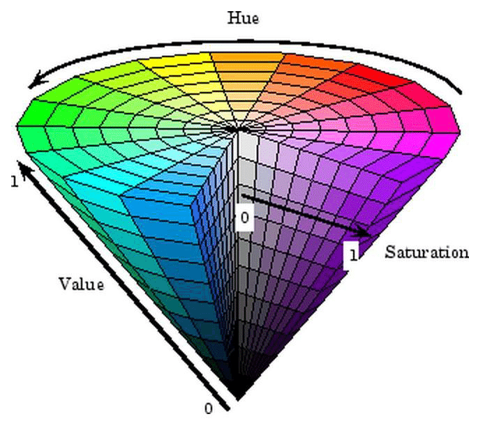
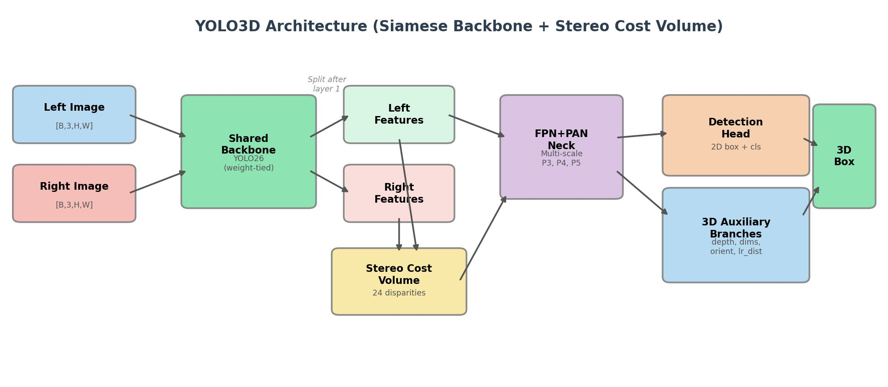
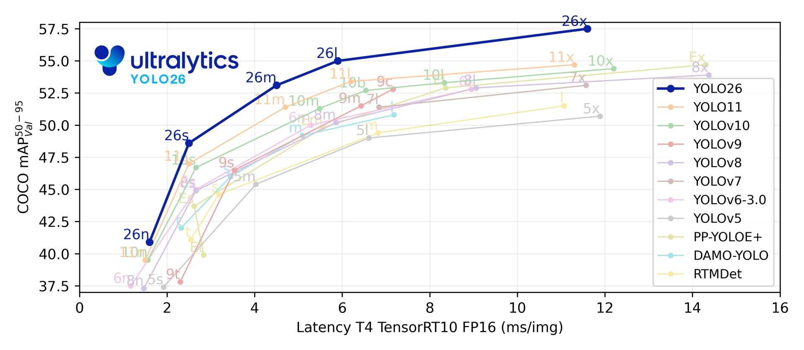

# 第31章 PPT：颜色检测与YOLO检测

> 共 16 页，标注页码 · 图号与教学文档对应

---

## P1 标题页

- **第 31 章：颜色检测与YOLO检测**
- **课时：** 2 课时
- **主线：** HSV 颜色检测 → YOLOv8 深度学习检测 → vision_msgs 标准输出

<!-- 旁白：本章把传统颜色检测与深度学习检测放在同一框架下讲解，两种方法最终都归一到 vision_msgs 标准消息。 -->

---

## P2 学习目标

1. 理解 HSV 颜色空间，掌握 inRange 阈值分割与形态学去噪
2. 掌握 ColorDetector 与 MultiColorDetector 两个颜色检测节点的实现
3. 理解 YOLOv8 的推理流程与输出解码（yolo_postprocess）
4. 掌握 YOLOv8Detector 节点与 ONNX 部署方式
5. 会用 vision_msgs 的 Detection2D/Detection2DArray 发布检测结果
6. 能依据官方要点选择 conf/iou/imgsz 等推理参数

<!-- 旁白：学习目标与传统视觉章节衔接，也承接后面的手眼标定与抓取应用。 -->

---

## P3 HSV 颜色空间

- **要点：** HSV 三通道比 RGB 更符合人眼感知，H 表示色相
- OpenCV 取值范围：H 0-180、S 0-255、V 0-255
- 颜色检测三步：高斯去噪 → inRange 阈值分割 → 轮廓提取
- 图 31-1：HSV 色相环（H 分量在圆环上周期分布）

<!-- 旁白：强调 H 是环形的，所以红色会同时出现在 0 附近和 180 附近，这是后面双区间合并的原因。 -->

---

## P4 阈值工具与形态学去噪

- **要点：** inRange 得到掩码后，用形态学开闭运算去噪

| 通道 | 取值范围 | 说明 |
| --- | --- | --- |
| H | 0-180 | 色相，环形分布 |
| S | 0-255 | 饱和度 |
| V | 0-255 | 亮度 |

- 去噪：`cv2.MORPH_ELLIPSE` 结构元、kernel (5,5)、先 OPEN 再 CLOSE
- 官方要点：H ∈ [0,180]，红色需取 0-10 与 170-180 两个区间再合并

<!-- 旁白：表格对应教学文档中的 HSV 参数表；开运算去掉孤立白点，闭运算填补目标内部黑洞。 -->

---

## P5 ColorDetector 颜色检测节点

- **要点：** 单一颜色的检测、轮廓提取与最小外接矩形
- 参数：H_min 35、H_max 77、S 43-255、V 46-255（绿色示例）
- 图像处理：GaussianBlur(7,7,0) → inRange → 形态学开闭 → findContours（过滤 area<500）→ minAreaRect
- 发布：`/color_detection/result` 标注图、`/color_detection/mask` 掩码图

<!-- 旁白：节点把处理链封装在回调里，result 用于调试显示，mask 用于下游几何计算。 -->

---

## P6 红色双区间与 MultiColorDetector

- **要点：** 红色横跨 H 环两端，需两个区间 bitwise_or 合并
- 红色区间：H 0-10 与 H 170-180，合并后得到完整掩码
- MultiColorDetector：按颜色字典批量检测多目标，轮廓过滤 area<300
- 输出每个颜色的中心点与角度，供抓取或跟踪使用

<!-- 旁白：多颜色检测的本质是同一流程按 HSV 区间复用，工程上用字典管理各颜色参数。 -->

---

## P7 YOLOv8 概览

- **要点：** YOLOv8 一步完成分类与回归，端到端输出检测框
- 输入 640x640，输出 [1,84,8400]：80 类得分 + 4 个框回归值
- 图 31-2：YOLO 网络结构（Backbone-Neck-Head）

<!-- 旁白：只需记住输出张量维度与 8400 个预测格点的含义，网络细节交给框架。 -->

---

## P8 YOLOv8Detector 节点

- **要点：** 用 ultralytics 推理并按 ROS 2 消息发布检测结果

| 参数 | 默认值 | 说明 |
| --- | --- | --- |
| model_path | yolov8n.pt | 模型权重或 ONNX |
| confidence_threshold | 0.5 | 置信度阈值 |
| use_onnx | false | 启用 ONNX Runtime |

- 发布：`/yolo/detections`（Detection2DArray）、`/yolo/visualization`（标注图）
- 推理调用：`model(frame, conf=..., verbose=False)[0]`，读取 boxes.xyxy、boxes.conf、boxes.cls 与 model.names

<!-- 旁白：节点内模型只加载一次，回调中只做推理与消息封装，保证帧率。 -->

---

## P9 YOLO 性能与基准

- **要点：** 模型规模 n/s/m/l/x 越大精度越高、速度越慢
- 图 31-3：YOLO 家族在 COCO 上的 mAP-速度基准曲线

- 实时机器人系统常选 yolov8n/yolov8s，在 CPU 上也能到可接受帧率

<!-- 旁白：选型时用基准曲线权衡 mAP 与 FPS，机器人端优先保证帧率稳定。 -->

---

## P10 yolo_postprocess 后处理

- **要点：** 原始输出需转置过滤再 NMS 才是最终检测
- [1,84,8400] 转置为 [8400,84]，取每行最大得分
- 过滤低于置信度的候选，再用 `cv2.dnn.NMSBoxes` 抑制重叠框
- 输出映射回原图坐标，得到 (x1,y1,x2,y2,cls,score)

<!-- 旁白：后处理是理解 YOLO 输出的关键，也是部署 ONNX 时必须手写的部分。 -->

---

## P11 vision_msgs 标准消息

- **要点：** 用 Detection2DArray 描述多目标检测结果
- 安装：`sudo apt install ros-jazzy-vision-msgs`
- 核心类型：Detection2D、Detection2DArray、ObjectHypothesisWithPose、BoundingBox2D
- BoundingBox2D：center（Pose2D）+ size_x/size_y；ObjectHypothesis 携带 id 与 score

<!-- 旁白：统一消息后，颜色检测与 YOLO 检测可以共用同一套下游抓取逻辑。 -->

---

## P12 ONNX 导出与官方推理要点

- **要点：** ONNX 让 YOLO 脱离 Python 框架独立运行
- 导出：`yolo export format=onnx`，推理端用 ONNX Runtime
- 官方推理默认：conf=0.25、iou=0.7、imgsz=640
- 官方要点：imgsz 必须与训练一致；跟踪用 model.track（ByteTrack）

<!-- 旁白：部署链路为 pt 到 onnx 再到 runtime，跨平台部署时 imgsz 与类别顺序都要保持一致。 -->

---

## P13 颜色检测与 YOLO 对比

- **要点：** 两者互补：颜色法快而脆，YOLO 稳而重

| 维度 | 颜色检测 | YOLOv8 |
| --- | --- | --- |
| 依赖 | HSV 阈值 | 大规模训练数据 |
| 速度 | 极快（毫秒级） | 依赖硬件 |
| 鲁棒性 | 光照敏感 | 光照/背景鲁棒 |
| 输出 | 掩码 + minAreaRect | 检测框 + 类别 + 置信度 |

<!-- 旁白：产线固定光照用颜色法足够；开放场景目标多样时选 YOLO，两者也可级联使用。 -->

---

## P14 本章要点

- HSV：H 0-180、S/V 0-255，红色双区间 0-10 与 170-180 合并
- 形态学：MORPH_ELLIPSE kernel (5,5)，先 OPEN 再 CLOSE
- ColorDetector：GaussianBlur(7,7,0)、findContours area<500、minAreaRect
- YOLOv8Detector：conf 0.5，发布 `/yolo/detections` 与 `/yolo/visualization`
- 后处理：[1,84,8400] 转置 + cv2.dnn.NMSBoxes
- vision_msgs：Detection2DArray 统一检测结果输出

<!-- 旁白：本章要点是下一章 AR 检测与手眼标定的前置知识，检测输出的位姿将被坐标变换使用。 -->

---

## P15 练习题

1. 修改 ColorDetector 的 HSV 参数，把目标从绿色改为蓝色，观察掩码变化并说明 H 取值依据。
2. 为什么红色检测必须用两个区间？写出 MultiColorDetector 中合并掩码的代码。
3. 解释 [1,84,8400] 各维含义，并手写从原始输出到 NMS 的后处理流程。
4. 用 vision_msgs 把 YOLOv8Detector 的输出封装为 Detection2DArray，说明各字段来源。
5. 导出 yolov8n ONNX 并用 ONNX Runtime 推理，验证 imgsz 与训练不一致时的报错现象。
6. 对比颜色检测与 YOLO 在光照变化下的表现，设计一个实验验证鲁棒性差异。

<!-- 旁白：练习覆盖调参、后处理、消息封装与实验设计，建议在真机或仿真中完成。 -->

---

## P16 下章预告

- **下一章（第 32 章）：AR 标签检测与手眼标定**
- 内容：ArUco/AprilTag 检测、单标签位姿估计、eye-in-hand 与 eye-to-hand、easy_handeye 标定
- 预习：复习 tf2 坐标变换与相机内参概念

<!-- 旁白：本章得到的检测框与掩码，下一章将升级为相机系下的 6D 位姿，并通过手眼标定映射到机器人基座系。 -->
