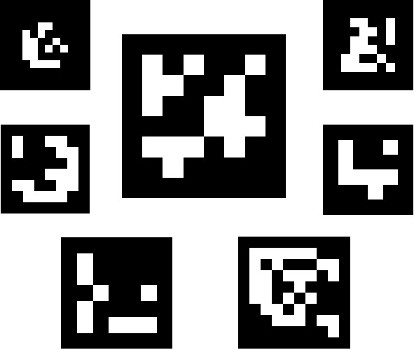
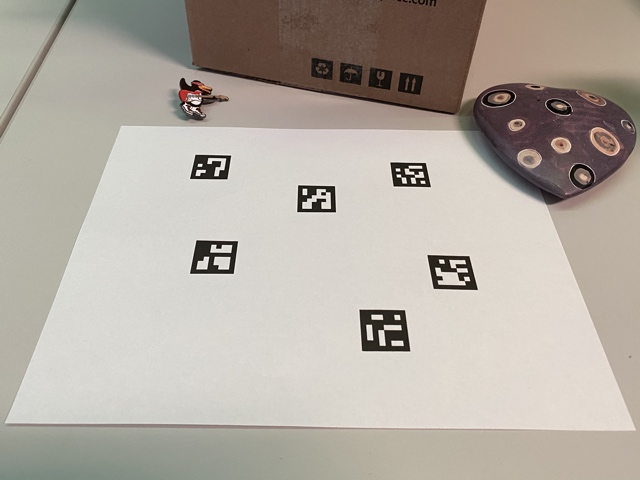

# 第32章 PPT：AR标签检测与手眼标定

> 共 16 页，标注页码 · 图号与教学文档对应

---

## P1 标题页

- **第 32 章：AR标签检测与手眼标定**
- **课时：** 2 课时
- **主线：** ArUco/AprilTag 检测 → 单目标位姿估计 → easy_handeye 手眼标定

<!-- 旁白：本章把检测升级为 6D 位姿，并用标定把相机系位姿变换到机器人基座系，是视觉抓取的基础。 -->

---

## P2 学习目标

1. 理解 AR 标签原理，掌握 ArUco 字典与标签生成
2. 掌握 ArucoDetector 节点：检测、显示与位姿发布
3. 了解 AprilTag 检测与 solvePnP 位姿估计
4. 掌握 MultiArucoDetector 多标签管理与独立话题发布
5. 区分 eye-in-hand 与 eye-to-hand 标定方式
6. 会用 easy_handeye 完成手眼标定并发布标定结果

<!-- 旁白：学习目标从单标签检测到多标签，再到标定落地，层层递进。 -->

---

## P3 AR 标签检测概述

- **要点：** AR 标签是编码的黑白方块，可同时得到身份与位姿
- 检测流程：自适应阈值 → 轮廓筛选 → 透视校正 → 码字解码
- 图 32-1：ArUco 字典 family（不同尺寸与纠错能力）

<!-- 旁白：字典决定标签数量与容错位数，系统内所有节点必须使用同一字典。 -->

---

## P4 ArUco 字典与标签

- **要点：** 常用 DICT_6X6_250：6x6 位、250 个标签

| 字典 | 位矩阵 | 标签数 | 特点 |
| --- | --- | --- | --- |
| DICT_4X4_50 | 4x4 | 50 | 检测快、容错低 |
| DICT_6X6_250 | 6x6 | 250 | 均衡，本章使用 |
| DICT_6X6_1000 | 6x6 | 1000 | 大规模场景 |

- 标签需打印后固定在物体上，边长即 marker_size（本章 0.065 m）

<!-- 旁白：marker_size 必须与实物一致，否则平移分量按比例出错。 -->

---

## P5 ArucoDetector 节点实现

- **要点：** 用新 ArucoDetector API 完成检测与显示
- 字典：`cv2.aruco.getPredefinedDictionary(cv2.aruco.DICT_6X6_250)`
- 订阅 `/camera/color/image_raw`，检测后叠加角点与 ID 显示
- 参数 marker_size 0.065，内参 camera_matrix = msg.k.reshape(3,3)

<!-- 旁白：新 API 把 DetectorParameters 与字典一起封装进 ArucoDetector，detectMarkers 输出角点、ID 与旋转向量。 -->

---

## P6 单标签位姿估计

- **要点：** estimatePoseSingleMarkers 输出相机系下的 6D 位姿
- 输入：角点、marker_size、camera_matrix、dist_coeffs
- rvec 转旋转矩阵再转四元数（trace 法），tvec 即平移
- 图 32-2：单标签位姿轴可视化（0.03 m 轴长）

- 发布 `/aruco/pose`，frame_id 设为 camera_color_optical_frame

<!-- 旁白：注意光学系 z 朝前，位姿必须挂在 camera_color_optical_frame 下，后续由 tf2 变换到基座系。 -->

---

## P7 AprilTag 检测

- **要点：** AprilTag 用 pip 安装，solvePnP 求位姿
- `pip install apriltag`，检测结果为标签中心与角点
- 位姿：cv2.solvePnP 求解，tag_size 0.065 与 ArUco 一致
- 适用场景：光照变化大、需要更高解码鲁棒性的场合

<!-- 旁白：ArUco 与 AprilTag 输出统一为位姿话题，下游不感知标签类型。 -->

---

## P8 MultiArucoDetector 多标签检测

- **要点：** 一个节点管理多个标签，按 ID 发布独立话题
- 尺寸字典：{1: 0.065, 2: 0.065, 3: 0.040, 4: 0.040}
- 每个 ID 发布 `/aruco/{id}/pose`，便于不同物体对应不同话题
- 轮廓级过滤与丢失保持策略，保证位姿连续输出

<!-- 旁白：不同物体挂不同尺寸的标签，工程上用字典统一管理尺寸，避免多个节点重复检测。 -->

---

## P9 手眼标定问题

- **要点：** 标定求相机系与机器人系之间的固定变换

| 方式 | 相机位置 | 求解变换 | 典型场景 |
| --- | --- | --- | --- |
| eye-in-hand | 装在末端 | 相机到末端 | 视觉伺服 |
| eye-to-hand | 固定在外 | 相机到基座 | 固定工位检测 |

- 已知量：标签位姿（相机系）与末端位姿（机器人正向运动学）

<!-- 旁白：本项目相机固定在桌面支架上，属于 eye-to-hand，求解 base_link 到 camera_link 的变换。 -->

---

## P10 easy_handeye 标定流程

- **要点：** easy_handeye 打包采集与求解，采样越多越准

| launch 组成 | 节点 | 关键参数 |
| --- | --- | --- |
| 相机驱动 | usb_cam | /dev/video0 |
| 标签检测 | aruco_ros aruco_node | marker_size 0.065、reference_frame camera_link |
| 标定核心 | easy_handeye calibrate | eye_on_hand False、robot_base_frame base_link、robot_effector_frame tool0、tracking_base_frame camera_link、tracking_marker_frame aruco_marker_frame |

- 求解客户端：handeye_calibration_client，采样不少于 17 组

<!-- 旁白：移动机械臂到不同姿态采集多组位姿对，最小二乘求解 AX=XB。 -->

---

## P11 标定结果与校验

- **要点：** 结果存 YAML，可读性校验后再使用
- 本项目结果（base_link 到 camera_link）：平移 1.004/-0.628/0.553，四元数 0.482/-0.072/0.118/0.866
- 校验：把标签位姿变换到基座系，与实测位置比对
- 误差主要来自手眼装配误差与标签打印尺寸偏差

<!-- 旁白：校验时多测几个标签位置，误差明显增大说明采样姿态多样性不足。 -->

---

## P12 CalibrationPublisher 发布标定

- **要点：** 用 StaticTransformBroadcaster 常态发布标定变换
- 读取 YAML：eye_on_hand 与 transformation 节
- 发布 base_link 到 camera_link 的静态 tf，开机即生效
- 下游直接 lookupTransform 使用，无需重复标定

<!-- 旁白：静态变换只在启动时发布一次，注意 tf 树中不要存在环路或重复发布。 -->

---

## P13 ManualHandEyeCalibration 手动标定

- **要点：** 手动法直接测量装配尺寸，作为自动标定的对照
- 原理：AX=XB，A 为机器人运动，B 为相机观测
- 步骤：固定标签、多姿态采集、记录位姿对、求解
- 适用：无标定板或快速验证场景，精度低于 easy_handeye

<!-- 旁白：手动法数值可用来初检自动标定结果，两者相差过大时应重新采样。 -->

---

## P14 本章要点

- ArUco：DICT_6X6_250、marker_size 0.065、内参来自 msg.k
- 位姿：estimatePoseSingleMarkers / solvePnP，frame_id 用 camera_color_optical_frame
- MultiArucoDetector：{1:0.065, 2:0.065, 3:0.040, 4:0.040}，按 ID 发布 `/aruco/{id}/pose`
- 标定：eye-to-hand 求基座系变换，easy_handeye 采样不少于 17 组
- 结果：YAML 保存，CalibrationPublisher 用 StaticTransformBroadcaster 发布

<!-- 旁白：检测是手段，标定是桥梁；有了基座系位姿，MoveIt2 才能规划抓取。 -->

---

## P15 练习题

1. 生成一张 DICT_6X6_250 的 ID=3 标签并打印，测量边长后设置 marker_size，验证位姿精度。
2. 修改 ArucoDetector，在显示窗口叠加绘制坐标轴，说明 rvec/tvec 的物理含义。
3. 用 trace 法实现旋转矩阵转四元数，并解释为何不能用欧拉角直接转换。
4. 为 MultiArucoDetector 增加 ID=5（0.055 m）支持，说明需要改动的地方。
5. 完成 easy_handeye 标定，采样 17 组与 30 组，对比结果差异并分析原因。
6. 阅读 handeye_calibration_client 源码，说明采样客户端与标定服务端的交互流程。

<!-- 旁白：练习覆盖标签制作、位姿数学、多标签扩展与标定全流程，重点是标定校验环节。 -->

---

## P16 下章预告

- **下一章（第 33 章）：视觉大模型与ROS2应用**
- 内容：CLIP/SAM/GPT-4V 能力边界、GPT4VSceneUnderstander 节点、SAM 分割与 CLIP 零样本分类
- 预习：了解 OpenAI API 的 image_url 消息格式与 JSON 模式

<!-- 旁白：传统检测解决是什么在哪，下一章引入大模型解决场景语义理解这类开放问题。 -->