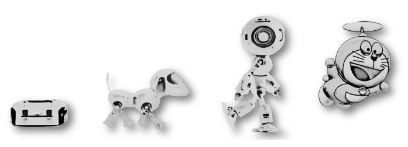
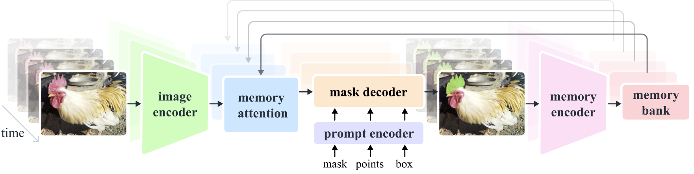

# 第33章 PPT：视觉大模型与ROS2应用

> 共 16 页，标注页码 · 图号与教学文档对应

---

## P1 标题页

- **第 33 章：视觉大模型与ROS2应用**
- **课时：** 2 课时
- **主线：** GPT-4V 场景理解 → SAM 分割 → CLIP 零样本分类

<!-- 旁白：本章把三个代表性视觉大模型接入 ROS 2 节点，形成可复用的认知感知能力。 -->

---

## P2 学习目标

1. 了解视觉大模型的演进脉络与能力边界
2. 掌握 GPT-4V API 的 image_url 消息与 JSON 输出模式
3. 实现 GPT4VSceneUnderstander 场景理解节点
4. 理解 SAM 的分割范式并搭建 SAM 节点
5. 掌握 CLIP 零样本分类的实现与话题输出
6. 能为大模型节点设计健壮的 JSON 解析与超时处理

<!-- 旁白：大模型节点与前面章节的检测节点最大的区别是引入了网络请求与文本输出。 -->

---

## P3 视觉大模型演进

- **要点：** 从专用检测到通用多模态，模型从认得变成说得清
- 图 33-1：多模态基础模型演进时间线

- 关键转折：对比学习（图文对齐）→ 大规模分割 → 多模态对话

<!-- 旁白：时间线帮助建立坐标系：CLIP 是对齐，SAM 是分割，GPT-4V 是理解与推理。 -->

---

## P4 主流视觉大模型

- **要点：** 按任务选型：分类对齐用 CLIP，分割用 SAM，开放问答用 GPT-4V

| 模型 | 任务 | 输入 | 输出 |
| --- | --- | --- | --- |
| CLIP | 图文对齐分类 | 图像 + 候选文本 | 类别得分 |
| SAM | 通用分割 | 图像 + 提示点/框 | 掩码 |
| GPT-4V | 场景理解问答 | 图像 + 文本指令 | 自然语言/JSON |

<!-- 旁白：三个模型正好覆盖感知-分割-理解三层能力，可组合成完整认知栈。 -->

---

## P5 GPT-4V API 基础

- **要点：** 图像以 image_url 块传入，支持 base64 data URL

| 参数 | 建议值 | 说明 |
| --- | --- | --- |
| model | gpt-4o | 多模态模型 |
| detail | low | 控制分辨率与成本 |
| temperature | 0 | 输出稳定可复现 |
| max_tokens | 500 | 限制回答长度 |

- 消息结构：user 消息内混合 text 块与 image_url 块

<!-- 旁白：机器人场景要求输出可解析，因此 response_format 用 json_object 并把 schema 写进 system_prompt。 -->

---

## P6 GPT4VSceneUnderstander 节点设计

- **要点：** 订阅图像与查询，发布描述与结构化对象列表
- 订阅：`/camera/color/image_raw` 图像、`/vlm/query` 文本指令
- 发布：`/vlm/description` 场景描述、`/vlm/objects` 对象列表
- 参数：api_key、model（gpt-4o）、system_prompt

<!-- 旁白：节点把 ROS 请求-响应映射为一次 API 调用，图像编码与消息组装都封装在回调中。 -->

---

## P7 图像编码与请求构造

- **要点：** JPEG 压缩后 base64 编码为 data URL
- 编码：cv2.imencode('.jpg', frame, 85) → base64 → `data:image/jpeg;base64,...`
- 请求体：system_prompt + 查询文本 + image_url(detail low)
- 官方要点：image_url 块可传外部 URL 或 base64 data URL

<!-- 旁白：JPEG 质量取 85 在体积与清晰度间平衡；detail low 足够定位大物体且省 token。 -->

---

## P8 JSON Schema 与解析

- **要点：** 用固定 schema 保证输出可被程序消费

| 字段 | 类型 | 含义 |
| --- | --- | --- |
| description | string | 场景整体描述 |
| objects[].name | string | 对象名称 |
| objects[].position | string | 相对位置描述 |
| objects[].color | string | 颜色属性 |
| objects[].confidence | number | 置信度 0-1 |

- 解析失败处理：JSONDecodeError 时记录原始文本并重试一次

<!-- 旁白：schema 同时写进 system_prompt 与文档，模型输出与代码解析共用同一约定。 -->

---

## P9 官方要点：稳定性设计

- **要点：** 让大模型输出稳定是工程化关键
- temperature=0 加固定 system_prompt 提高可复现性
- self-consistency：多次采样投票，用于关键判断
- 超时与重试：API 波动时降级为传统检测器输出

<!-- 旁白：官方文档明确 detail high/low 的取舍；机器人系统中低延迟比长答案更重要。 -->

---

## P10 SAM 分割架构

- **要点：** SAM 由图像编码器与提示解码器组成，可分割任意目标
- 图 33-2：SAM 图像编码器-提示编码器-掩码解码器结构

- 权重 sam_vit_h_4b8939.pth，用 segment-anything 的 SamPredictor 加载，设备优先 cuda

<!-- 旁白：SAM 把分割什么交给提示（点/框），机器人可用检测结果作为提示框，实现检测-分割级联。 -->

---

## P11 SAM 节点实现

- **要点：** 用检测框作为提示得到实例掩码
- 流程：图像消息 → np array → SamPredictor.set_image → predict(box=...)
- 输出：掩码轮廓叠加显示 + 面积/中心点发布
- 性能：vit_h 权重大，推理前预热编码器

<!-- 旁白：SAM 与 YOLO 级联时，YOLO 给框、SAM 给掩码，掩码可用于精确的位姿估计。 -->

---

## P12 CLIP 零样本分类

- **要点：** CLIP 直接用文本类名给图像分类，无需训练
- 类别列表：['robot','person','table','chair','bottle','book','box','tool']
- 计算图像与各文本的特征相似度，softmax 得到概率
- 发布 `/clip/classification`：最高分类别与得分

<!-- 旁白：新增类别只要改文本列表，这就是零样本的意义；类名越具体，区分度越好。 -->

---

## P13 CLIP 节点实现

- **要点：** CLIP 节点结构与 GPT-4V 节点一致，仅推理后端不同
- 加载：clip.load('ViT-B/32')，图像与文本分两个编码器
- 订阅图像，触发式推理，避免逐帧全量计算
- 输出与 vision_msgs 对齐，供调度节点消费

<!-- 旁白：把 CLIP 的类别得分与 YOLO 检测融合，可以过滤检测器不认识的类别。 -->

---

## P14 本章要点

- 模型选型：CLIP 分类对齐、SAM 通用分割、GPT-4V 场景理解
- GPT-4V：image_url 块、JPEG q85 加 base64、detail low、temperature 0
- 节点：GPT4VSceneUnderstander 发布 `/vlm/description` 与 `/vlm/objects`
- JSON schema：description + objects[{name, position, color, confidence}]
- SAM：sam_vit_h_4b8939.pth、SamPredictor、box 提示
- CLIP：ViT-B/32、8 类零样本、发布 `/clip/classification`

<!-- 旁白：三个节点都遵循订阅图像-推理-发布结构化结果的模板，可以互相替换组合。 -->

---

## P15 练习题

1. 编写 system_prompt 与 JSON schema，让 GPT-4V 输出物体的相对位置与颜色，并解析为 objects 列表。
2. 实现 self-consistency：同一图像采样 3 次并对 objects 投票，说明去重规则。
3. 用 YOLO 检测框作为 SAM 的 box 提示，输出实例掩码并计算掩码面积。
4. 给 CLIP 增加 red box / blue box 复合类名，验证与纯类名的区分能力差异。
5. 对比 detail high 与 low 的输出质量与 token 消耗，给出机器人场景的选择依据。
6. 为 GPT4VSceneUnderstander 增加超时与降级逻辑：API 失败时回退到 YOLO 检测结果。

<!-- 旁白：练习重点是把大模型输出工程化：可解析、可降级、可与其他检测器融合。 -->

---

## P16 下章预告

- **下一章（第 34 章）：视觉抓取应用**
- 内容：检测-位姿-变换-规划-执行全链路、VisionGraspDetector、SceneManager、抓放状态机
- 预习：复习 MoveIt2 规划场景与附加碰撞体概念

<!-- 旁白：认知能力最终要落到抓得住，下一章把前面所有检测结果接入 MoveIt2 抓取。 -->