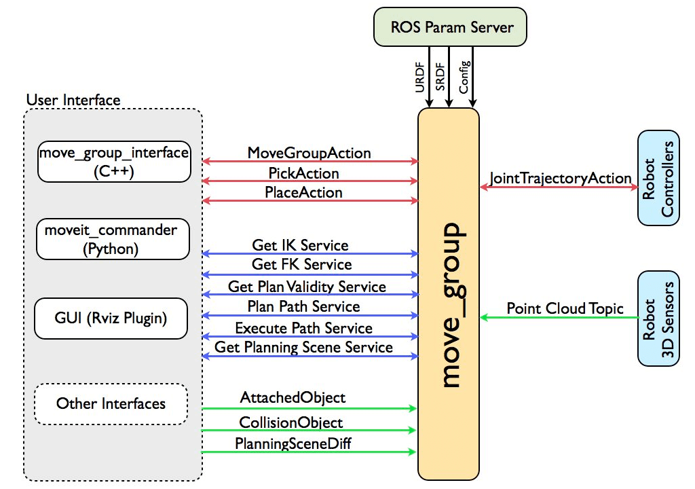
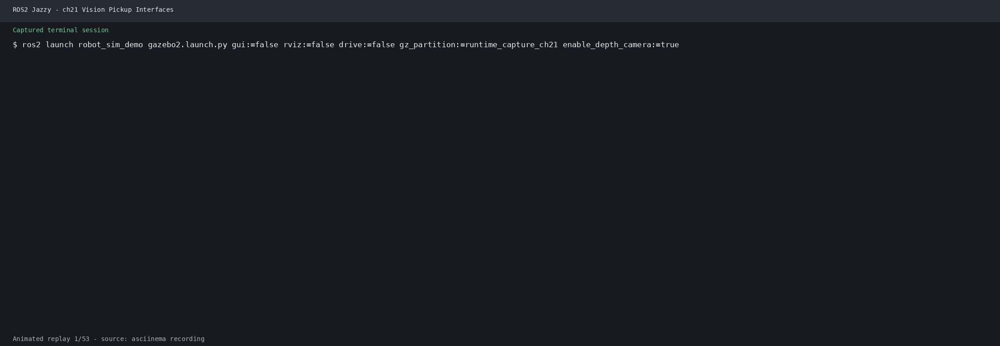

# 第34章 PPT：视觉抓取应用

> 共 16 页，标注页码 · 图号与教学文档对应

---

## P1 标题页

- **第 34 章：视觉抓取应用**
- **课时：** 2 课时
- **主线：** 相机采集 → 物体检测 → 位姿估计 → 坐标变换 → 运动规划 → 抓取执行

<!-- 旁白：本章是感知与操作两条线的汇合点，把第 30-32 章的视觉输出接入第 26-29 章的 MoveIt2 规划执行。 -->

---

## P2 学习目标

1. 描述视觉抓取闭环的六大环节及各环节的数据流
2. 编写 VisionGraspDetector 节点完成 ArUco 检测与位姿估计
3. 用 tf2 把目标位姿从相机系变换到 base_link 并发布 /target_pose
4. 会用 SceneManager 搭建包含桌面与目标物体的规划场景
5. 理解 move_group 中枢与规划流水线的级联机制
6. 能定位手眼标定误差、位姿跳变等常见抓取故障

<!-- 旁白：学习目标覆盖感知、变换、规划、执行四个层面，抓取成功率是综合指标。 -->

---

## P3 视觉抓取任务总览

- **要点：** 六环节闭环：相机采集 → 物体检测 → 位姿估计 → 坐标变换 → 运动规划 → 抓取执行
- 检测层复用第 31 章的 YOLO 2D 检测框与第 32 章的 ArUco 6D 位姿
- 规划执行层复用第 26-29 章的 MoveIt2 规划与 ros2_control 硬件控制
- 官方进阶路线：MoveIt Task Constructor 把抓取建模为可回溯的阶段化流水线

<!-- 旁白：强调这是一个完整的系统集成任务，任何一环的误差都会沿数据流向下游放大。 -->

---

## P4 相机采集与目标检测

- **要点：** 相机节点发布 /camera/color/image_raw 与 camera_info，检测节点按帧推理
- YOLO 检测：输出 /yolo/detections（Detection2DArray），提供类别与 2D 检测框
- ArUco 检测：DICT_6X6_250 字典、marker_size=0.065 米，得到标签角点与 6D 位姿
- 选型：类别识别用 YOLO，毫米级 6D 位姿用 ArUco，两者互补

<!-- 旁白：回顾第 31 章的检测消息与第 32 章的 ArUco 字典，本章直接复用这两个节点的输出。 -->

---

## P5 AR 标签位姿估计

- **要点：** VisionGraspDetector 订阅相机图像，估计标签在相机系下的 6D 位姿
- estimatePoseSingleMarkers 输出 rvecs/tvecs，Rodrigues 转旋转矩阵再转四元数
- 位姿原始参考系为 camera_color_optical_frame，尚未在机器人基座系下表达
- 以 PoseStamped 形式发布，header.frame_id 必须填写正确

<!-- 旁白：位姿估计的数学核心是 PnP 求解，工程核心是正确的参考系标注，为下一页坐标变换铺垫。 -->

---

## P6 坐标变换链

- **要点：** 抓取规划要求目标位姿统一到基座系，变换链贯穿三个参考系

| 变换段 | 含义 | 参考系 |
| --- | --- | --- |
| 目标 → 相机 | ArUco 估计的 tvecs | camera_color_optical_frame |
| 相机 → 基座 | lookup_transform 查询手眼外参 | base_link |
| 基座 → 末端 | MoveIt2 正逆运动学 | end_effector |

- 用 lookup_transform 查询 base_link 到相机光学系的外参，再经 do_transform_pose 变换
- 变换后的位姿发布为 /target_pose，供 MoveIt2 规划直接使用

<!-- 旁白：变换链每一级都依赖外参精度，任何一级时间戳不匹配都会导致查询失败。 -->

---

## P7 MoveIt2 系统架构

- **要点：** move_group 是系统唯一的中枢节点
- 图 34-1：MoveIt2 系统架构（move_group 中枢与外部接口）

- 对外暴露 action/service/topic 三类接口；用户侧可用 MoveGroupInterface（C++）、moveit_py（Python）或 RViz MotionPlanning

<!-- 旁白：move_group 持有机器人模型、规划场景、规划流水线与控制器管理，应用层只与它对话。 -->

---

## P8 MoveIt2 规划流水线

- **要点：** 规划请求先经 planning_adapters 修正，再交给规划器求解
- 图 34-2：MoveIt2 规划流水线（规划适配器与规划器级联）

- FixStartStateBounds 修正越限初始状态，AddTimeParameterization 为路径赋予速度与加速度
- OMPL 输出的是关节路径，时间参数化之后才是可执行的含时轨迹

<!-- 旁白：理解级联机制后，规划报错就能按 error code 分层定位：初始状态、目标可达性、超时。 -->

---

## P9 规划场景与物体管理

- **要点：** SceneManager 把桌面与目标物体注入规划场景，供碰撞检测使用

| API | 关键参数 | 说明 |
| --- | --- | --- |
| add_table | id='table'，frame_id='base_link'，BOX [1.0,1.2,0.02]，z=-0.01 | 添加桌面碰撞体 |
| add_target_object | object_id、pose、size | 添加目标物体碰撞体 |

- 内部基于 PlanningSceneInterface 与 move_group 同步场景
- 场景缺失是规划失败的常见根因：机械臂可能规划出穿过桌面的轨迹被拒

<!-- 旁白：场景物体的尺寸与位姿要与实物一致，尤其是桌面高度，它决定抓取平面的可达性。 -->

---

## P10 抓取执行流程

- **要点：** 五步流程：预抓取 → 接近 → 闭合 → 撤离 → 放置
- 预抓取位姿沿抓取轴后撤一段距离，保证接近路径无碰撞
- MoveGroupInterface：setPoseTarget → plan → execute，轨迹经 FollowJointTrajectory 下发
- 夹爪闭合由 ros2_control 控制器执行，与机械臂轨迹按时间对齐
- 官方进阶：MTC 组合 PickCurrentPose → OpenHand → MoveToPreGrasp → MoveToGrasp → Place

<!-- 旁白：五步分解的本质是给每个动作一个可独立验证的阶段，失败时能定位到具体步骤。 -->

---

## P11 运行演示

- **要点：** 端到端演示：相机目标接口与 xArm 规划分层
- 运行演示：相机目标接口与 xArm 规划分层（ch21 运行记录）

- 观察点：检测框是否稳定、/target_pose 是否平滑、规划轨迹是否避开桌面

<!-- 旁白：演示中感知与规划分层清晰，位姿经 TF 变换后进入 MoveIt2，与本章数据流一一对应。 -->

---

## P12 手眼标定与抓取精度

- **要点：** 抓取精度首先取决于手眼外参标定质量（第 32 章 easy_handeye）
- eye-in-hand 与 eye-to-hand 两种安装方式对应不同的外参查询方向
- 标定误差沿变换链逐级传递放大，末端累积可达数毫米
- 建议：标定后用固定标志位姿复核残差，确认毫米级一致性再上线

<!-- 旁白：演示里若目标抓偏，先查标定残差再查检测抖动，误差定位要从变换链末端向前端排查。 -->

---

## P13 常见问题与调试

- **要点：** 抓取故障按数据流分段定位：感知 → 变换 → 规划 → 执行

| 现象 | 可能原因 | 解决 |
| --- | --- | --- |
| TF 查询失败 | 外参未发布或时间戳不匹配 | 检查 tf 树与 use_sim_time |
| /target_pose 跳变 | 检测抖动、标志遮挡 | 滑动平均滤波、稳定光照 |
| 抓取位置偏移 | 手眼标定残差 | 重新标定并复核 marker_size |
| 规划频繁失败 | 规划场景碰撞体缺失 | 补齐桌面与目标物体 |

<!-- 旁白：调试顺序建议固定下来：先看 tf 诊断，再看位姿曲线，最后看规划日志的 error code。 -->

---

## P14 本章要点

- 六环节闭环：相机采集 → 物体检测 → 位姿估计 → 坐标变换 → 运动规划 → 抓取执行
- ArUco：DICT_6X6_250、marker_size 0.065，estimatePoseSingleMarkers 输出 6D 位姿
- 坐标链：目标 → camera_color_optical_frame → base_link → end_effector
- move_group 中枢持有模型、场景、流水线与控制器管理
- SceneManager：add_table 与 add_target_object 注入碰撞体
- 抓取五步：预抓取 → 接近 → 闭合 → 撤离 → 放置

<!-- 旁白：本章要点按数据流排列，复习时顺着这条线回忆每级的输入输出与误差来源。 -->

---

## P15 练习题

1. 画出本章六环节数据流图，标注每级的话题名与消息类型。
2. 修改 VisionGraspDetector 的 marker_size 参数，观察位姿估计误差如何变化并解释原因。
3. 编写节点订阅 /target_pose 并打印其在 base_link 下的坐标，验证 TF 变换链正确性。
4. 用 SceneManager 依次添加桌面与目标物体，然后故意删去桌面，观察规划失败现象。
5. 沿抓取轴调整预抓取后撤距离，统计不同距离下的抓取成功率。
6. 查阅 MoveIt Task Constructor 文档，把五步抓取流程映射为 MTC 阶段序列。

<!-- 旁白：练习覆盖数据流梳理、参数敏感性、场景管理与进阶流水线，建议在仿真中逐一验证。 -->

---

## P16 下章预告

- **下一章（第 35 章）：综合实训**
- 内容：智能工厂产线与家庭服务两大场景、模块化架构与节点通信设计、感知-认知-规划-执行全链路集成
- 预习：回顾第 30-33 章感知认知输出与第 26-29 章规划执行接口

<!-- 旁白：下一章把全书模块拼装成两个完整场景，本章的抓取闭环是其中最核心的执行单元。 -->
