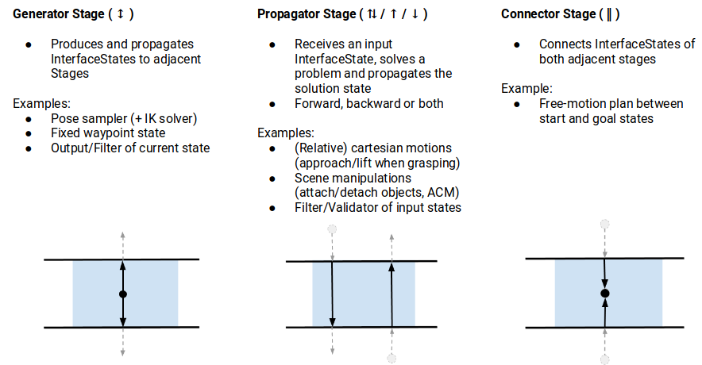
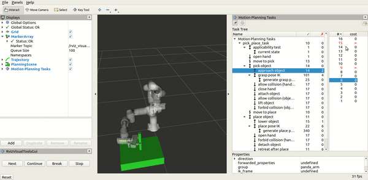

# 第35章 PPT：综合实训

> 共 16 页，标注页码 · 图号与教学文档对应

---

## P1 标题页

- **第 35 章：综合实训**
- **课时：** 4 课时
- **主线：** 智能工厂产线 / 家庭服务两大场景 → 模块化拆分 → 通信设计 → 感知-认知-规划-执行全链路集成验收

<!-- 旁白：本章是全书的收官实训，用 4 课时把前面所有模块拼装成两个可运行、可验收的完整系统。 -->

---

## P2 学习目标

1. 描述智能工厂产线与家庭服务两大场景的系统组成与任务流程
2. 按模块化原则拆分 YOLO 检测、AR 标签、TF 变换与 MoveIt2 节点
3. 设计节点间话题、服务与动作三类通信并定义消息接口
4. 集成第 30-33 章感知认知输出与第 26-29 章规划执行接口
5. 用 MoveIt Task Constructor 把抓取任务组织为阶段化流水线
6. 完成全链路联调、容错处理与集成验收

<!-- 旁白：学习目标强调架构与集成，单点技术在前面章节已掌握，本章考察组合与工程化能力。 -->

---

## P3 实训目标与总体架构

- **要点：** 五层架构数据流：图像采集 → 视觉处理 → TF 变换 → 运动规划 → 硬件控制
- 图像采集：usb_cam/RealSense 发布 /camera/image_raw 与 camera_info
- 视觉处理：YOLO 目标检测（第 31 章）+ ArUco 位姿估计（第 32 章）
- TF 变换：相机系到 base_link 的手眼外参（第 32 章）
- 规划与控制：MoveIt2 抓取与避障规划（第 26-29 章）+ ros2_control 机械臂与夹爪

<!-- 旁白：先给出参考架构，再进入两个场景；实训时按层逐个验收，避免一次性联调无从下手。 -->

---

## P4 场景一：智能工厂产线

- **要点：** 传送带按颜色分拣物料，机械臂循环执行检测-抓取-放置
- 相机俯视产线，YOLO 检测来料类别，ArUco 标签给出抓取位姿
- 节点按固定频率消费图像流，抓取节拍由触发服务控制
- 验收指标：连续运行中检测稳定、抓取成功率与节拍满足产线节拍

<!-- 旁白：工厂场景突出实时性与稳定性，光照固定，适合展示颜色检测与 YOLO 的工程取舍。 -->

---

## P5 场景二：家庭服务机器人

- **要点：** 大模型解析自然语言指令，VLM 定位物品，机械臂抓取递送
- LLM 解析用户语音/文本指令为结构化任务（第 33 章）
- VLM 对开放类别物品给出语义定位，ArUco 标签补充精确位姿
- 相比产线场景多了语义层：任务分解、物体查找与人机交互
- 验收指标：指令理解正确、目标查找成功、抓取递送完整闭环

<!-- 旁白：家庭场景突出开放性，检测目标不可枚举，需要 VLM 与传统视觉级联兜底。 -->

---

## P6 技术栈总览

- **要点：** 两大场景共用同一套模块化技术栈，按章节回溯即可定位实现

| 模块 | 对应章节 | 核心技术 |
| --- | --- | --- |
| 图像采集与标定 | 第 30 章 | usb_cam、相机内参标定 |
| 视觉检测 | 第 31-32 章 | YOLOv8、ArUco 位姿估计 |
| 认知与语义 | 第 33 章 | VLM 开放词汇定位 |
| 运动规划 | 第 26-28 章 | MoveIt2、OMPL、规划场景 |
| 执行控制 | 第 29 章 | ros2_control、FollowJointTrajectory |

<!-- 旁白：这张表是实训的任务书索引，学生按模块回查对应章节即可获取实现细节。 -->

---

## P7 架构设计原则

- **要点：** 模块化拆分是本章工程能力的核心考察点

| 原则 | 工程含义 | 落地手段 |
| --- | --- | --- |
| 模块化 | 感知/变换/规划各自独立成节点 | 单一职责、独立包管理 |
| 可扩展 | 更换相机或机械臂不动全链路 | 参数化配置、标准消息接口 |
| 容错 | 检测丢失或规划失败不崩溃 | 重试、降级、状态监控 |
| 实时 | 抓取节拍满足要求 | 回调内只做轻量计算 |

<!-- 旁白：四条原则在验收时逐条检查：能否单独替换节点、能否在失败后自动恢复运行。 -->

---

## P8 节点通信设计

- **要点：** 先定义接口再写代码，话题/服务/动作各司其职

| 话题 | 类型 | 说明 |
| --- | --- | --- |
| /camera/image_raw | Image | 相机原始图像 |
| /yolo/detections | Detection2DArray | YOLO 检测输出 |
| /aruco/pose | PoseStamped | 标签 6D 位姿 |
| /target_pose | PoseStamped | base_link 下目标位姿 |
| /grasp_command | Trigger | 抓取触发服务 |
| /grasp_result | Bool | 抓取结果反馈 |

- 消息类型与第 31-32 章保持一致，保证模块即插即用

<!-- 旁白：接口先行是本实训的纪律要求，接口冻结后各模块可并行开发与测试。 -->

---

## P9 感知集成：YOLO 与 AR 标签模块

- **要点：** 感知层输出统一的检测结果与位姿，供下游直接消费
- YOLO 模块：model_path=yolov8n.pt、confidence_threshold=0.5
- 发布 /yolo/detections（Detection2DArray）与 /yolo/visualization 调试图
- ArUco 模块：DICT_6X6_250、marker_size=0.065，发布 /aruco/pose
- 联调要点：先用 visualization 话题确认检测稳定，再接位姿下游

<!-- 旁白：感知集成的验收标准是连续运行时检测框不抖、位姿曲线平滑，这也是第 34 章调试经验的应用。 -->

---

## P10 坐标变换与抓取指令

- **要点：** TF 节点把视觉位姿统一到 base_link，触发服务下发抓取指令
- lookup_transform 查询手眼外参，do_transform_pose 得到 /target_pose
- /grasp_command（Trigger 服务）触发规划执行，避免抓取动作反复自触发
- /grasp_result 反馈成功与否，驱动上层任务状态机推进
- 失败处理：位姿超时、规划失败时返回错误码并允许重试

<!-- 旁白：这一页是感知到规划的桥，验收时重点测试服务触发的时序与失败重试逻辑。 -->

---

## P11 规划与执行集成

- **要点：** MoveIt2 负责抓取与避障规划，ros2_control 负责硬件执行
- Launch 文件一次性启动 move_group、ros2_control 与全部感知节点
- MoveItPy/MoveGroupInterface：setPoseTarget → plan → execute
- 轨迹经 FollowJointTrajectory 下发机械臂，夹爪独立控制
- 规划场景：SceneManager 注入桌面与目标物体碰撞体（第 34 章）

<!-- 旁白：建议以 Launch 为验收单位：一条命令拉起全系统，才算完成集成。 -->

---

## P12 进阶：MTC 阶段化任务规划

- **要点：** MoveIt Task Constructor 把抓取建模为可回溯的阶段序列
- 图 35-1：MTC 任务阶段划分（生成与计算两阶段）

- 阶段序列：PickCurrentPose → OpenHand → MoveToPreGrasp → MoveToGrasp → Place
- 生成阶段并行采样候选解，计算阶段验证可行性，失败自动回溯

<!-- 旁白：MTC 是官方推荐的进阶路线，相比手写五步流程，它能自动回溯并给出多组候选抓取。 -->

---

## P13 MTC 阶段类型与运行演示

- **要点：** 三类阶段：SerialContainer 串联、Generator 并行生成、失败回溯
- 图 35-2：MTC 阶段类型（生成器、传播器与监视器）

- 运行演示：MTC 多阶段抓取任务在 RViz 中逐阶段展开

- 观察点：阶段之间的解传递、失败时的回溯路径

<!-- 旁白：演示中能看到 MTC 把抓取拆成显式阶段并逐阶段求解，这正是第 34 章五步流程的工程化升级。 -->

---

## P14 本章要点

- 五层架构：图像采集 → 视觉处理 → TF 变换 → 运动规划 → 硬件控制
- 两大场景：智能工厂产线重实时稳定，家庭服务重语义开放
- 接口先行：话题/服务/动作消息定义冻结后再并行开发
- 四条原则：模块化、可扩展、容错、实时，验收时逐条检查
- 全链路数据流：/camera/image_raw → /yolo/detections → /target_pose → /grasp_command
- 进阶路线：MTC 阶段化流水线，生成采样与失败回溯

<!-- 旁白：本章要点是全书知识的索引，建议作为答辩时的自查清单逐条对照演示。 -->

---

## P15 练习题

1. 画出你实现的系统架构图，标注全部节点与话题，并对照五层架构说明差异。
2. 把 YOLO 模块替换为颜色检测模块，验证接口不变时系统仍可运行。
3. 设计 /grasp_command 失败重试机制：连续失败三次后进入降级状态并上报。
4. 用 MTC 重写抓取流程，对比手写五步流程的成功率与代码量。
5. 在家庭服务场景中接入 VLM，把开放类别物品定位结果融合进抓取链路。
6. 编写集成验收文档：列出测试用例、通过标准与实测数据。

<!-- 旁白：练习按难度递进排列，前两题考察架构理解，后四题对接真实工程改造与验收流程。 -->

---

## P16 下章预告

- **下一章（第 36 章）：自动驾驶概述与CARLA基础**
- 内容：自动驾驶分级与系统组成、CARLA 仿真器基础、传感器与车辆控制接口
- 预习：回顾 ROS 2 话题通信与 Launch 组织方式，为仿真环境搭建做准备

<!-- 旁白：从下一章起进入自动驾驶仿真专题，本章的模块化与集成方法论同样适用于 CARLA 项目。 -->
