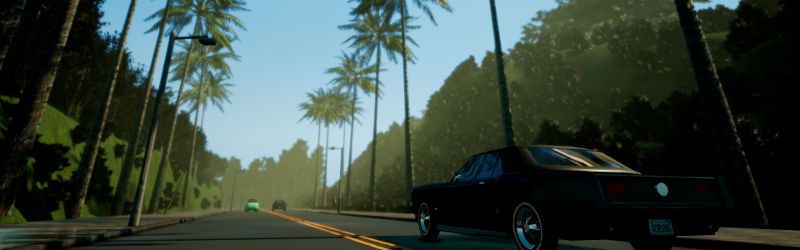
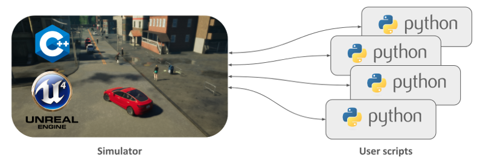

# 第36章 PPT：自动驾驶概述与CARLA基础

> 共 17 页，标注页码 · 图号与教学文档对应 · 课时：2 课时（90 分钟）

---

## P1 标题页

- **要点：** 第36章 自动驾驶概述与CARLA基础（2 课时）

**第36章 自动驾驶概述与CARLA基础**

课程：ROS2 Python 编程 · 课时：2 课时（90 分钟） · 教学方式：讲授 + 演示

本章路线：自动驾驶技术背景 → SAE 分级与系统架构 → CARLA 仿真平台 → 环境搭建与核心概念 → 世界、地图与天气

<!-- 旁白：各位同学好，本章我们正式进入自动驾驶专题。前面打下的 ROS 2 基础从这一章开始要应用到自动驾驶场景中。我们将先建立分级标准与系统架构的全局认识，再动手搭建 CARLA 仿真环境。 -->

---

## P2 本课学习目标

- **要点：** 分级标准、三层架构、CARLA 核心概念、环境搭建、Python API

1. 了解自动驾驶技术的发展历程与 SAE J3016 分级标准（L0–L5）
2. 理解 ODD、DDT 概念，说清 L2 与 L3 的分水岭
3. 掌握自动驾驶「感知→规划→控制」三层架构及各层职责
4. 理解 CARLA 的 World、Map、Actor、Blueprint、Sensor 等核心概念
5. 学会搭建 CARLA 0.9.16 环境并完成安装验证与排障
6. 掌握 Python API 基本用法：生成车辆与传感器、切换地图、控制天气

<!-- 旁白：本章六个目标分两条线：前三条是理论线，搞清分级标准、关键概念与三层架构；后三条是实践线，围绕 CARLA 展开环境搭建与 Python API 操作。学完要能独立生成车辆和传感器。 -->

---

## P3 自动驾驶分级标准：SAE J3016

- **要点：** SAE J3016（2014 年发布）将自动驾驶分为 L0–L5 六级；量产车集中在 L2–L2+，Robotaxi 限定区域达 L4

SAE International 于 2014 年发布 J3016 标准，已被全球广泛采用：

| 等级 | 名称 | 驾驶操作 | 环境监控 | 任务接管 | 典型场景 |
|:----:|------|:--------:|:--------:|:--------:|----------|
| L0 | 无自动化 | 人类 | 人类 | 人类 | — |
| L1 | 驾驶辅助 | 人类+系统 | 人类 | 人类 | 自适应巡航 ACC |
| L2 | 部分自动化 | 系统 | 人类 | 人类 | 特斯拉 Autopilot |
| L3 | 有条件自动化 | 系统 | 系统 | 人类（接管请求） | 奥迪 A8 Traffic Jam Pilot |
| L4 | 高度自动化 | 系统 | 系统 | 系统 | Robotaxi（限定区域） |
| L5 | 完全自动化 | 系统 | 系统 | 系统 | 全场景无人驾驶 |

- 业界现状：量产车主要集中在 L2–L2+；Waymo、百度 Apollo 等 Robotaxi 在限定区域内达到 L4 水平

<!-- 旁白：这张表要纵向看：从 L2 到 L3，环境监控的责任从人转移到系统，这就是分水岭；L4 与 L5 的区别则在运行范围是否受限。请记住"典型场景"一列，考试常结合实际车型出题。 -->

---

## P4 ODD、DDT 与 L2/L3 分水岭

- **要点：** DDT 动态驾驶任务、ODD 运行设计域、DDT 后备；L3 首次把「责任」从人转移到系统

SAE J3016（2021 修订版）删除了旧版两段式表述，改用三个工程概念精确切分等级：

| 概念 | 全称 | 含义 |
|------|------|------|
| DDT | 动态驾驶任务 | 横向/纵向控制、OBD（物体与事件探测响应）与对事件的响应 |
| ODD | 运行设计域 | 系统运行的限定条件：道路类型、车速区间、天气等 |
| DDT 后备 | fallback | DDT 失效时接管的机制：由人还是系统完成 |

- **L2/L3 分水岭**不在「谁握着方向盘」，而在「系统承担 DDT 的哪一部分、事故责任如何转移」：
  - L2：驾驶员持续执行 OBD 与后备（环境监控在人）
  - L3：条件激活时系统执行全部 DDT，驾驶员只做紧急后备
- 工程意义：L3 首次把责任从人转移到系统，直接决定传感器冗余、功能安全与数采方案的设计基准

<!-- 旁白：三个概念是理解分级的技术语言：DDT 说的是驾驶任务本身，ODD 划定系统允许运行的边界，后备机制决定失效时谁接管。L2 与 L3 的本质差异在责任主体，这直接影响传感器冗余设计。 -->

---

## P5 自动驾驶系统架构：感知→规划→控制

- **要点：** 感知层多传感器融合、规划层行为决策与运动规划、控制层 PID/MPC

自动驾驶系统通常采用三层架构，自上而下数据流如下：

```
┌────────────────────────────────────────────────┐
│                  感知层 (Perception)             │
│   相机(目标检测)  激光雷达(点云)  毫米波/超声波(距离)  │
│              └──── 多传感器融合 ─────┘              │
│            输出：障碍物 / 车道 / 信号灯             │
├────────────────────────────────────────────────┤
│                  规划层 (Planning)               │
│        行为决策(换道/跟车/停车) → 运动规划          │
│            输出：路径 + 速度曲线（轨迹）            │
├────────────────────────────────────────────────┤
│                  控制层 (Control)                │
│         PID / MPC → 油门 / 刹车 / 转向            │
├────────────────────────────────────────────────┤
│                 执行机构 (底盘/线控)               │
└────────────────────────────────────────────────┘
```

- 感知层：摄像头、激光雷达、毫米波雷达、超声波等采集数据，做目标检测、语义分割、深度估计
- 规划层：根据感知结果做行为决策并生成可执行轨迹（路径+速度曲线）
- 控制层：将轨迹转化为油门、刹车、转向信号，经 PID 或 MPC 控制器执行

<!-- 旁白：结合架构图看数据流：感知层融合多传感器输出障碍物与车道，规划层据此生成带速度曲线的轨迹，控制层再把轨迹分解为油门、刹车和转向。三层各自独立发展，又通过标准接口衔接。 -->

---

## P6 CARLA 概述

- **要点：** 基于 UE4 的开源自动驾驶仿真器；CVC 研发维护；传感器套件灵活、Python API 完整


CARLA 官网欢迎页：CARLA 是基于 Unreal Engine 4 的开源自动驾驶仿真器

- CARLA（Car Learning to Act）由巴塞罗那计算机视觉中心（CVC）研发维护，代码托管于 GitHub，社区活跃
- 基于 UE4 的高保真渲染：逼真的光照、反射和物理效果
- 灵活传感器套件：RGB 相机、深度相机、语义分割相机、LIDAR、雷达、GNSS、IMU 等
- 内置交通管理器（Traffic Manager）：控制 NPC 车辆行为，模拟真实交通流
- 提供 Town01–Town12 共 12 种风格场景；可经 carla_ros_bridge 与 ROS 2 无缝对接

<!-- 旁白：这张截图来自 CARLA 官网。CARLA 的优势在于高保真渲染与完整传感器套件，再加 Traffic Manager 模拟交通流，使我们能在同一环境里复现各种驾驶场景，这也是课程选它作仿真基线的原因。 -->

---

## P7 版本选型与安装方式

- **要点：** 本课程基线 CARLA 0.9.16；Python API 版本必须与模拟器完全一致

| 版本 | 发布时间 | UE 版本 | Python API | 推荐用途 |
|:----:|:--------:|:-------:|:----------:|----------|
| 0.9.13 | 2022.06 | UE4.26 | 0.9.13 | 历史版本，仅供兼容性对比 |
| **0.9.16** | — | — | **0.9.16** | **本课程基线** |
| 0.9.14 | 2022.12 | UE4.27 | 0.9.14 | 历史版本，不用于本课程 |

- 官方文档明确三种安装方式：预编译版本（binary）、源码编译（source）、Docker 镜像
- **版本匹配纪律**：`carla==0.9.x` 的 Python API 与模拟器版本必须完全一致，否则报 `client is not running`
- 显卡要求：≥6 GB 显存，推荐 RTX 20 系以上；支持 Linux/Windows 双平台
- 官方《First steps》强调：先确认 `CarlaUE4` 正常启动渲染窗口，再运行 Python 脚本——客户端连不上时最常见原因是模拟器未就绪

<!-- 旁白：版本表强调一条纪律：Python API 与模拟器版本必须完全一致，很多"连不上"的问题其实是版本错配。课程统一使用 0.9.16，安装器会帮大家对齐版本，不要自行混用其他版本。 -->

---

## P8 环境搭建（Ubuntu 24.04 / WSL2）

- **要点：** 推荐仓库安装器一键安装；WSL2 需 D3D12 后端；先启动服务器再连客户端

推荐使用仓库根目录安装器（同时安装 CARLA 运行库、Python API、图形/无头依赖与固定版本 ROS 2 Bridge）：

```bash
cd /path/to/Technologies-of-ROS2-Programming-master
bash setup_course.sh --with-carla        # 完整安装
bash setup_course.sh --carla-bridge-only # Windows 主机跑服务端时
source ~/.config/ros2-course/env.bash
```

手动安装要点：`apt` 安装 libomp5、Vulkan、xvfb 等依赖 → 下载 CARLA 0.9.16 与 AdditionalMaps 并解压到 CARLA 根目录 → 在 venv 中 `pip install carla==0.9.16` → 启动 `./CarlaUE4.sh -quality-level=Low`

```bash
# WSL2 下 Intel/AMD GPU 通过 WSLg 的 D3D12 后端运行
export GALLIUM_DRIVER=d3d12
./CarlaUE4.sh -quality-level=Low
```


CARLA 0.9.16 启动后的城市场景：服务器就绪后方可运行 Python 客户端

<!-- 旁白：安装优先用仓库自带安装器，一条命令完成依赖、CARLA 与 Bridge 的部署。WSL2 用户要特别注意 D3D12 后端这个环境变量。右侧动图是启动成功后的城市场景，服务器就绪后才能连客户端。 -->

---

## P9 安装验证清单

- **要点：** 五项检查：GPU/OpenGL、服务器启动、Python API 版本、客户端连接、磁盘空间

| 检查项 | 验证命令 | 预期结果 |
|--------|---------|---------|
| GPU驱动/OpenGL | `glxinfo -B` | 显示物理 GPU 或 WSLg D3D12 后端，非 llvmpipe |
| CARLA服务器 | `./CarlaUE4.sh -quality-level=Low` | UE4 窗口正常显示 |
| Python API | `python3 -c "from importlib.metadata import version; print(version('carla'))"` | 打印 `0.9.16` |
| 客户端连接 | `python3 -c "import carla; c=carla.Client('localhost',2000); c.set_timeout(5); print(c.get_server_version())"` | 返回服务器版本元组 |
| 磁盘空间 | `df -h ~/carla` | 可用空间 >10GB |

- 逐项通过后再进入开发，可避免后续「连不上、import 失败」的无效排查

<!-- 旁白：五项检查对应从硬件到软件的链路：先确认 GPU 与 OpenGL 正常，再确认服务器能启动，然后核对 Python 版本、客户端连通性，最后确认磁盘空间。逐项打勾能省掉大量无效排查时间。 -->

---

## P10 常见问题与排障

- **要点：** 黑屏查驱动与 Vulkan、llvmpipe 查 D3D12、连接超时查服务器与 2000 端口

| 问题 | 可能原因 | 解决方案 |
|------|---------|---------|
| `CarlaUE4.sh` 启动后黑屏退出 | GPU 不支持或驱动过低 | `./CarlaUE4.sh -vulkan` 或升级显卡驱动 |
| WSL2 中 OpenGL 显示 `llvmpipe` | WSLg 未选 D3D12 后端 | 先 `export GALLIUM_DRIVER=d3d12` 再验证 |
| `import carla` 失败 | Python 包未正确安装 | 在 venv 中 `pip install carla==0.9.16` |
| `Client.__init__()` 连接超时 | CARLA 服务器未启动 | 确认 `./CarlaUE4.sh` 已运行，检查端口 2000 |
| UE4 窗口卡死无响应 | 显存不足 | `-quality-level=Low` 降低画质 |
| AdditionalMaps 不显示 | 附加地图解压位置不对 | 解压到 CARLA 根目录（与 CarlaUE4.sh 同级） |
| `libomp5` 缺失 | 缺少 OpenMP 库 | `sudo apt-get install libomp5` |

<!-- 旁白：排障表按"现象—原因—对策"组织。最常见的是黑屏、llvmpipe 软渲染和连接超时三类，分别对应驱动问题、D3D12 后端未启用和服务器未启动。遇到报错先对号入座，再按对策处理。 -->

---

## P11 CARLA 核心概念与模块架构

- **要点：** Server/Client 通过 TCP 相连；World、Map、Actor、Blueprint、Sensor、Traffic Manager 六大概念


CARLA 官方模块架构图：客户端经 Python API（TCP）与服务器交互，服务器管理 World 与 Actor

| 核心概念 | 说明 | Python 类 |
|----------|------|-----------|
| World | 仿真世界实例，包含地图、天气、Actor 等 | `carla.World` |
| Map | 仿真地图：道路网络、交通标志、地形 | `carla.Map` |
| Actor | 世界中的动态实体：车辆、行人、传感器 | `carla.Actor` |
| Blueprint | Actor 的模板/工厂，定义 Actor 属性 | `carla.ActorBlueprint` |
| Sensor | 特殊 Actor，收集环境数据（相机、LIDAR 等） | `carla.Sensor` |
| Traffic Manager | 交通流控制器，管理 NPC 车辆行为 | `carla.TrafficManager` |

<!-- 旁白：架构图展示了客户端经 TCP 与服务器交互的全貌。六大概念中 World 是总入口，Blueprint 是生成 Actor 的模板，Sensor 是特殊的 Actor——理解这个定位，后面的代码就好读懂了。 -->

---

## P12 Python API 基本用法

- **要点：** Client→World→Blueprint→spawn_actor；传感器 attach_to 车辆并用 listen 回调

```python
import carla

client = carla.Client('localhost', 2000)   # 连接服务器
client.set_timeout(10.0)
world = client.get_world()                 # 获取世界

# 从蓝图库生成车辆
blueprint_library = world.get_blueprint_library()
vehicle_bp = blueprint_library.find('vehicle.tesla.model3')
spawn_point = world.get_map().get_spawn_points()[0]
vehicle = world.spawn_actor(vehicle_bp, spawn_point)

# 生成 RGB 相机并附着到车辆
camera_bp = blueprint_library.find('sensor.camera.rgb')
camera_bp.set_attribute('image_size_x', '800')
camera_bp.set_attribute('image_size_y', '600')
camera_bp.set_attribute('fov', '90')
camera = world.spawn_actor(camera_bp,
    carla.Transform(carla.Location(x=1.5, z=2.4)), attach_to=vehicle)

camera.listen(lambda image: image.save_to_disk(f'output/{image.frame:06d}.png'))
vehicle.apply_control(carla.VehicleControl(throttle=0.5, steer=0.0))
```

- 流程：连接 → 取 World → 找 Blueprint → spawn_actor → sensor.listen 回调 → apply_control

<!-- 旁白：这段代码是 CARLA 编程的骨架：先建 Client 并设超时，再取 World；从蓝图库找模板、设属性后用 spawn_actor 生成车辆；相机用 attach_to 挂到车上，listen 注册回调收图。建议课后亲手跑一遍。 -->

---

## P13 Town 地图类型

- **要点：** Town01–Town12 共 12 张官方地图，风格与用途各异；`carla.get_available_maps()` 列出全部

| 地图 | 风格 | 特点 | 推荐用途 |
|:----:|:----:|------|----------|
| Town01 | 简单小镇 | 直线道路，基础交叉口 | 入门练习 |
| Town03 | 中型城市 | 环岛、立交桥，车道多 | 综合测试 |
| Town04 | 大型城市 | 大型环岛，多车道高速 | 高速路测试 |
| Town05 | 城市+高速 | 多种道路类型混合 | 完整场景（基础驾驶推荐） |
| Town06 | 长距离 | 高速公路长廊，多出入口 | 长距测试 |
| Town07 | 乡村道路 | 狭窄道路，无车道线 | 乡村场景 |
| Town09 | 市中心 | 密集建筑，复杂路口 | 城市挑战 |
| Town10 | 大城市 | 天际线，多种建筑 | 视觉测试 |

- 官方推荐：Town01/Town05 做基础驾驶测试（路网规整、红绿灯齐备）、Town03 做城市场景、Town04 偏高速变道
- 切换：`client.load_world('Town03')`；支持 OpenDRIVE 高精地图导入

<!-- 旁白：地图选择看需求：入门用 Town01，综合测试选 Town03，练变道跑 Town04。注意 load_world 会重新加载场景，之前生成的 Actor 都会清空，切换地图后要重新生成车辆和传感器。 -->

---

## P14 天气与环境系统

- **要点：** 预设天气 + 逐字段自定义；`world.set_weather()` 生效；参数可做平滑渐变

```python
# 预设：ClearNoon / CloudyNoon / WetNoon / HardRainNoon / SoftRainNoon ...
world.set_weather(carla.WeatherParameters.ClearNoon)

# 自定义：雨天黄昏 = 云量 + 降水 + 太阳高度角（黄昏约 5~15 度）
weather = carla.WeatherParameters(
    cloudiness=50.0, precipitation=30.0,      # 云量、降水
    sun_altitude_angle=10.0, sun_azimuth_angle=180.0,  # 太阳高度/方位
    fog_density=5.0, wetness=50.0)            # 雾浓度、路面积水
world.set_weather(weather)
```

| 参数 | 范围 | 效果 |
|------|:----:|------|
| `cloudiness` | 0-100 | 云层覆盖，0=晴天，100=阴天 |
| `precipitation` | 0-100 | 降雨强度，0=无雨，100=暴雨 |
| `precipitation_deposits` | 0-100 | 路面积水 |
| `fog_density` | 0-100 | 雾浓度，影响能见度 |
| `wetness` | 0-100 | 路面反光湿润效果 |
| `sun_altitude_angle` | -90~90 | 太阳高度角，负值=夜晚 |

- 天气渐变：按时间步进插值两组参数并循环 `set_weather()`，即可在 20 秒内从晴天平滑过渡到雨天
- 仿真价值：降雨、夜间、传感器失效都可一键注入——可复现、可切片、可注入故障

<!-- 旁白：天气系统有两层用法：预设天气一键切换，适合快速搭场景；逐字段自定义则能精确控制云量、降水、太阳角度等参数。注意太阳高度角取负值代表夜晚，做夜间感知实验时会用到。 -->

---

## P15 本章要点

- **要点：** 全章 5 条核心结论回顾

1. SAE J3016 将自动驾驶分为 L0–L5 六级；量产车集中于 L2–L2+，Robotaxi 在限定区域达 L4
2. L2/L3 分水岭在「系统承担 DDT 的哪一部分、事故责任如何转移」：L3 首次把责任从人转移到系统
3. 自动驾驶系统遵循「感知→规划→控制」三层架构：多传感器融合 → 行为决策与运动规划 → PID/MPC 控制
4. CARLA 是基于 UE4 的开源仿真器，核心概念为 World、Map、Actor、Blueprint、Sensor、Traffic Manager
5. 环境搭建关键是版本匹配纪律（Python API 与模拟器版本一致）与「先启动服务器、再连客户端」；平台提供 12 种地图与可编程天气系统

<!-- 旁白：五条要点把本章串成一条线：分级标准给了共同语言，L2/L3 分水岭引出工程意义，三层架构定义了系统骨架，CARLA 则是把骨架跑起来的平台。环境搭建的版本纪律务必牢记。 -->

---

## P16 练习题

- **要点：** 4 道题覆盖分级、架构、Blueprint 与场景搭建

1. 简述 SAE J3016 标准中 L2 和 L3 的核心区别。为什么 L3 被认为是自动驾驶技术的重要分水岭？
2. 自动驾驶系统的感知—规划—控制三层架构中，每一层的主要职责是什么？请举例说明各层使用的典型算法。
3. 什么是 CARLA 中的 Blueprint？它与面向对象编程中的「工厂模式」有何关联？请结合代码说明如何使用 Blueprint 生成一辆车辆和一台相机传感器。
4. 假设你需要在 CARLA 的 Town03 地图中搭建一个雨天黄昏的测试场景，请编写相应的 Python 代码实现（包括天气参数设置、地图加载和车辆生成）。

<!-- 旁白：四道题分别检验概念辨析、架构理解、动手能力和综合设计。第四题综合了地图加载、天气设置与车辆生成三个知识点，是本章的实战检验，建议在完成环境验证后作答。 -->

---

## P17 下章预告

- **要点：** 第37章 CARLA_ROS2桥接与车辆部署

**第37章：CARLA_ROS2桥接与车辆部署**

- 通过 carla_ros_bridge 把 CARLA 传感器世界接入 ROS 2：`/carla/ego_vehicle` 与图像话题
- 在仿真中部署 ego vehicle，打通「CARLA 仿真 ↔ ROS 2 工具链」的数据通路
- 为后续章节的感知与规划算法实验奠定环境基础

课后建议：按官方《First steps》教程重新走一遍「生成车辆 → 生成传感器 → 设定天气」的最小闭环，建立对官方 API 的第一手感。

<!-- 旁白：下一章我们把 CARLA 与 ROS 2 连接起来：传感器数据将以话题形式进入 ROS 生态，车辆控制也能从 ROS 侧下发。课后请保持 CARLA 环境可用，并预读第 37 章讲义。 -->
