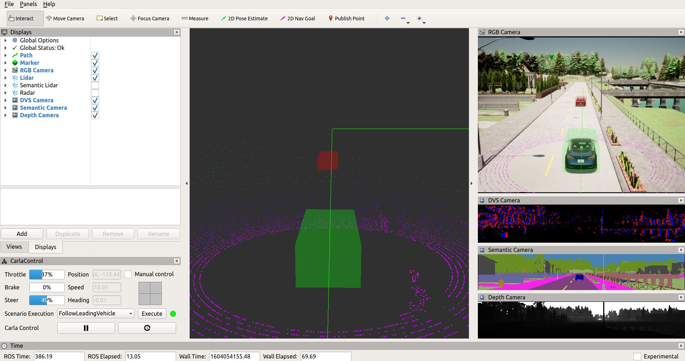

# 第37章 PPT：CARLA_ROS2桥接与车辆部署

> 共 17 页，标注页码 · 图号与教学文档对应 · 课时：2 课时（90 分钟）

---

## P1 标题页

- **要点：** 第37章 CARLA-ROS2 桥接与车辆部署（2 课时）

**第37章 CARLA-ROS2 桥接与车辆部署**

课程：ROS2 Python 编程 · 课时：2 课时（90 分钟） · 教学方式：讲授 + 演示

本章路线：桥接架构与安装验证 → 话题映射与同步模式 → Ego Vehicle 部署 → RViz2 可视化与 TF 树 → 车辆控制接口

环境基线：Ubuntu 24.04 · ROS 2 Jazzy · CARLA 0.9.16

<!-- 旁白：各位同学好，上一章我们在 CARLA 里生成了车辆和传感器，但这些数据还停留在仿真器内部。本章要架起一座桥，让传感器数据以 ROS 2 话题形式流动，之前学的 rviz2、tf2 等工具将全部派上用场。 -->

---

## P2 本课学习目标

- **要点：** 架构原理、生成流程、可视化、控制接口四条主线

1. 理解 CARLA-ROS2 Bridge 的架构原理与通信机制
2. 掌握 Bridge 的安装、验证与常见问题排障
3. 掌握 Ego Vehicle 的 Blueprint 选取与生成流程
4. 学会在 RViz2 中可视化传感器话题与 TF 树
5. 掌握车辆控制接口的使用与自动/手动模式切换

<!-- 旁白：五个目标层层递进：先理解 Bridge 的架构与通信机制，再完成安装验证；随后掌握车辆的生成部署，最后落到 RViz2 可视化与控制接口这两个日常最常用的技能点上。 -->

---

## P3 37.1.0 Bridge 安装步骤

- **要点：** Bridge 从源码编译；课程安装器 `setup_course.sh` 固定 bridge commit 与依赖版本

```bash
# 1. 在课程仓库根目录运行安装器
bash setup_course.sh --with-carla
source ~/.config/ros2-course/env.bash
# CARLA 服务端在 Windows 主机时改用：
# bash setup_course.sh --carla-bridge-only

# 2. 验证安装
source /opt/ros/jazzy/setup.bash
source ~/carla_ws/install/setup.bash
ros2 launch carla_ros_bridge carla_ros_bridge.launch.py --show-args
# 期望：显示可用参数列表，无报错
```

安装器生成的环境文件设置 `CARLA_HOST`、`CARLA_PORT`、`CARLA_MAP`、`CARLA_BRIDGE_TIMEOUT`

<!-- 旁白：安装环节的关键是课程安装器：它固定了 bridge 的 commit 与依赖版本，避免"能装不能跑"。验证时先看 --show-args 能否列出参数，无报错才说明安装完整。 -->

---

## P4 安装验证清单与常见排障

- **要点：** 先过验证清单，再按「原因 → 解决」定位排障

| 检查项 | 命令 | 预期结果 |
|--------|------|---------|
| Python路径 | `echo $PYTHONPATH \| grep carla` | 含 `PythonAPI/carla` |
| Bridge包 | `ros2 pkg list \| grep carla` | `carla_ros_bridge` 等 |
| 编译状态 | `colcon build --packages-select carla_ros_bridge` | 无错误 SUCCESS |
| 启动参数 | `...carla_ros_bridge.launch.py --show-args` | 显示参数列表 |
| 话题映射 | `ros2 interface package carla_msgs` | 消息类型列表 |

| 问题 | 原因 | 解决 |
|------|------|------|
| `No module named 'carla'` | 未用课程 venv | `source ~/.config/ros2-course/env.bash` |
| `carla_msgs` 未找到 | 依赖未构建 | `colcon build --packages-select carla_msgs` |
| 编译失败 | Python/Jazzy 不匹配 | Ubuntu 24.04 + Python 3.12 |
| rosdep 找不到依赖 | 未初始化 | `sudo rosdep init && rosdep update` |
| 启动后无话题 | ego vehicle 未生成 | 先运行 `spawn_ego.py` |
| `derived-object-msgs` 缺失 | 依赖不完整 | `rosdep install --from-paths src` |

<!-- 旁白：验证清单与排障表要配合使用：五项检查从 Python 路径到话题映射逐层确认。遇到 No module named carla 这类报错，多半是没 source 课程环境文件，先对表定位再处理。 -->

---

## P5 37.1.1 Bridge 工作原理

- **要点：** Bridge 是连接 CARLA 与 ROS 2 的中间件：ROS 2 节点 + CARLA Python API 客户端，双向映射

```
┌──────────────────────────────────────────┐
│              ROS 2 生态                  │
│  RViz2 · rqt_graph · 自定义控制节点      │
└───────────────────┬──────────────────────┘
                    │ 话题 / 服务
┌───────────────────▼──────────────────────┐
│         carla_ros_bridge 节点            │
│  话题发布/订阅器 · CARLA Python API 客户端│
└───────────────────┬──────────────────────┘
                    │ TCP 2000 / 2001-2002
┌───────────────────▼──────────────────────┐
│         CARLA 仿真器                     │
│  World · Vehicle · Sensor(Camera/Lidar)  │
└──────────────────────────────────────────┘
```

官方工程纪律：`role_name` 必须先于 spawn 在仿真器侧注册；传感器清单静态声明，新增传感器需重启 bridge


ROS 2 节点与话题关系图示例（rqt_graph）

<!-- 旁白：这张三层图是本章的纲要：上层是 RViz2 与自定义节点，中间是 Bridge，它同时扮演 ROS 2 节点和 CARLA 客户端，底层是仿真器。注意官方纪律：role_name 必须先生成再被识别。 -->

---

## P6 37.1.2 话题映射表

- **要点：** Bridge 将 CARLA 传感器数据映射为 `/carla/ego_vehicle/*` 下的 ROS 2 话题

| CARLA 组件 | ROS 2 话题 | 消息类型 | 说明 |
|:----------:|:-----------|:---------|------|
| GNSS | `/carla/ego_vehicle/gnss` | `nav_msgs/Odometry` | GPS定位 |
| IMU | `/carla/ego_vehicle/imu` | `sensor_msgs/Imu` | 惯性测量 |
| RGB Camera | `/carla/ego_vehicle/rgb_front/image` | `sensor_msgs/Image` | 前视图像（另有 `camera_info` 内参） |
| Depth Camera | `/carla/ego_vehicle/depth_front/image` | `sensor_msgs/Image` | 深度图像 |
| Lidar | `/carla/ego_vehicle/lidar` | `sensor_msgs/PointCloud2` | 点云 |
| Radar | `/carla/ego_vehicle/radar_front` | `...RadarDetectionArray` | 毫米波雷达 |
| 车辆状态 | `/carla/ego_vehicle/vehicle_status` | `carla_msgs/CarlaEgoVehicleStatus` | 速度、朝向 |
| 车辆控制 | `/carla/ego_vehicle/vehicle_control_cmd` | `carla_msgs/CarlaEgoVehicleControl` | 油门/刹车/转向 |
| 里程计 | `/carla/ego_vehicle/odometry` | `nav_msgs/Odometry` | 里程计 |
| 碰撞检测 | `/carla/ego_vehicle/collision` | `carla_msgs/CarlaCollisionEvent` | 碰撞事件（另有 `lane_invasion`） |

<!-- 旁白：话题映射表按传感器列出命名规律：全部挂在 /carla/ego_vehicle/ 前缀下，消息类型沿用 ROS 标准包。GNSS 用 Odometry、Lidar 用 PointCloud2，做订阅时按表选类型即可。 -->

---

## P7 37.1.3 同步模式 vs 异步模式

- **要点：** 参数 `synchronous_mode` 控制；数据采集必须开同步模式

| 特性 | 同步模式 | 异步模式 |
|:----:|:--------:|:--------:|
| 步进控制 | ROS 2 控制仿真步进 | CARLA 自主推进 |
| 时序一致性 | 严格保证 | 可能有延迟 |
| 传感器数据 | 同一时刻触发 | 各自独立触发 |
| 适用场景 | 强化学习、高精度控制 | 可视化、数据采集 |
| 性能开销 | 较高 | 较低 |

```bash
ros2 launch carla_ros_bridge carla_ros_bridge.launch.py \
  host:="$CARLA_HOST" port:="$CARLA_PORT" town:="$CARLA_MAP" \
  synchronous_mode:=True   # 异步改为 False
```

时间同步铁律：ROS 侧必须 `use_sim_time:=true`，由 bridge 把 CARLA 时钟发布为 `/clock`；同步模式下传感器回复慢导致超时，应调大 `synchronous_mode_timeout` 或减少传感器，而不是关闭同步

<!-- 旁白：同步与异步的核心差异在谁控制时钟。数据采集和强化学习必须用同步模式保证时序一致；配合 use_sim_time 为真，让 bridge 发布 /clock。超时应当调大 timeout，而不是关闭同步。 -->

---

## P8 37.2.1 Blueprint 选取

- **要点：** 每种车辆有唯一 Blueprint ID；用 `filter` 枚举、`find` 精确选取

```python
import carla

client = carla.Client('localhost', 2000)
client.set_timeout(10.0)
world = client.get_world()

# 枚举所有可用车辆 Blueprint
blueprints = world.get_blueprint_library().filter('vehicle.*')
for bp in blueprints:
    print(bp.id)

# 选取常用 Ego Vehicle Blueprint
vehicle_bp = world.get_blueprint_library().find('vehicle.tesla.model3')
# 或: vehicle.toyota.prius / vehicle.audi.etron
#     vehicle.lincoln.mkz2017
```

<!-- 旁白：Blueprint 选取只有两个动作：filter 模糊枚举、find 精确查找。枚举能帮我们确认车型 ID 的准确写法；选定后还能用 set_attribute 设置颜色等外观属性，就像给车辆换装。 -->

---

## P9 37.2.2 生成流程与 Spawn Point

- **要点：** 连接 → World → Blueprint → role_name → Spawn Point → spawn_actor → 传感器 → 灯光

```
1 连接CARLA服务器 ─► 2 获取World ─► 3 选Blueprint
   ▲                                      │
   │                                      ▼
8 设灯光(可选) ◄─ 7 挂传感器 ◄─ 6 spawn_actor
   ▲                                      │
   │                                      ▼
```
（4 设置 role_name="ego_vehicle"，5 选 Spawn Point）

```python
spawn_points = world.get_map().get_spawn_points()
for i, sp in enumerate(spawn_points):
    print(f"[{i:3d}] x={sp.location.x:.2f} y={sp.location.y:.2f}")
vehicle = world.spawn_actor(vehicle_bp, spawn_points[10])
```

<!-- 旁白：生成流程共八步，最容易被忽略的是第五步 Spawn Point 的选取。代码先把所有出生点打印出来再选择，比盲选下标更可靠，避免车辆生成在重叠点上导致失败。 -->

---

## P10 37.2.3 spawn_ego.py 与 role_name

- **要点：** `role_name` 是 Bridge 识别 Ego Vehicle 的关键属性，默认管理 `ego_vehicle`

```python
def spawn_ego_vehicle(world, spawn_point_index=0):
    lib = world.get_blueprint_library()
    vehicle_bp = lib.find('vehicle.tesla.model3')
    vehicle_bp.set_attribute('role_name', 'ego_vehicle')
    vehicle_bp.set_attribute('color', '255,0,0')  # 红色
    spawn_points = world.get_map().get_spawn_points()
    if spawn_point_index >= len(spawn_points):
        spawn_point_index = 0
    vehicle = world.spawn_actor(vehicle_bp,
                                spawn_points[spawn_point_index])
    return vehicle
```

| role_name | Bridge 话题前缀 | 用途 |
|:---------:|:----------------|------|
| `ego_vehicle` | `/carla/ego_vehicle/*` | 主控车辆 |
| `hero` | `/carla/hero/*` | 第二控制车辆 |
| `vehicle_1` | `/carla/vehicle_1/*` | 其他受控车辆 |

<!-- 旁白：role_name 是 Bridge 识别车辆的钥匙：设为 ego_vehicle 就映射到 /carla/ego_vehicle/ 话题族。表格给出三种常用取值，换名字就是换话题前缀，多车场景靠它区分车辆身份。 -->

---

## P11 37.3.1 RViz2 传感器话题可视化

- **要点：** 在 RViz2 中添加 Image / PointCloud2 / Odometry / TF 显示，即可观察 CARLA 传感器数据

| 显示类型 | 话题 | 说明 |
|:--------:|:-----|------|
| Image | `/carla/ego_vehicle/rgb_front/image` | 前视RGB图像 |
| PointCloud2 | `/carla/ego_vehicle/lidar` | 激光雷达点云 |
| Odometry | `/carla/ego_vehicle/odometry` | 车辆路径 |
| TF | `/tf` | 坐标变换树 |
| Axes | 固定坐标系 `map` | 坐标轴参考 |

```bash
rviz2 -d src/carla_ros_bridge/rviz/carla_bridge.rviz
```


官方 ros-bridge 仓库的 RViz 自动驾驶演示（AD Demo）

<!-- 旁白：RViz2 里加四类显示：Image 看相机、PointCloud2 看雷达、Odometry 看轨迹、TF 看坐标关系。图片展示了官方 AD 演示的效果，配置文件直接用仓库提供的 carla_bridge.rviz 即可。 -->

---

## P12 37.3.2 TF 树结构

- **要点：** Bridge 以 `role_name` 为 TF 前缀发布 `map → odom → ego_vehicle → 各传感器 frame`

```
map
 └── odom
      └── ego_vehicle
           ├── ego_vehicle/rgb_front
           ├── ego_vehicle/lidar
           ├── ego_vehicle/imu
           └── ego_vehicle/gnss
```

```bash
ros2 run tf2_tools view_frames.py
evince frames.pdf   # 查看生成的 TF 树 PDF
```

官方要点：先用 `view_frames` 核对父子关系再谈传感器融合；推荐用 launch 文件统一管理 vehicle + sensors 的生成，保证话题、TF 与控制接口同时就绪

<!-- 旁白：TF 树的父子关系必须记牢：map 到 odom 由系统维护，ego_vehicle 下挂载各传感器 frame。做传感器融合前先用 view_frames 生成 PDF 核对，树结构不对，融合结果必然出错。 -->

---

## P13 37.4.1/2 控制消息与手动控制节点

- **要点：** 控制指令经 `/carla/ego_vehicle/vehicle_control_cmd` 下发，类型 `carla_msgs/CarlaEgoVehicleControl`

```
# CarlaEgoVehicleControl.msg
float32 throttle        # 油门 [0.0, 1.0]
float32 brake           # 刹车 [0.0, 1.0]
float32 steer           # 转向 [-1.0, 1.0] 负=左 正=右
bool    hand_brake      # 手刹
bool    reverse         # 倒车
bool    manual_gear_shift / int32 gear
```

```python
class ManualControlNode(Node):
    def __init__(self):
        super().__init__('manual_control_node')
        self.pub = self.create_publisher(
            CarlaEgoVehicleControl,
            '/carla/ego_vehicle/vehicle_control_cmd', 10)

    def send_control(self, throttle=0.0, brake=0.0, steer=0.0):
        cmd = CarlaEgoVehicleControl()
        cmd.throttle, cmd.brake, cmd.steer = throttle, brake, steer
        cmd.hand_brake = cmd.reverse = False
        self.pub.publish(cmd)
```

<!-- 旁白：控制消息五个字段各有限制：油门刹车在 0 到 1 之间，转向正负 1 且负值向左。右侧节点模板给出标准写法：创建发布器、填字段、publish，三步即可手动控车。 -->

---

## P14 37.4.3/4 模式切换与键盘控制

- **要点：** 通过 `enable_autopilot` 服务切换自动/手动；键盘节点按步长增减控制量

```bash
# 启用自动驾驶（禁用改 data: false）
ros2 service call /carla/ego_vehicle/enable_autopilot \
  std_srvs/srv/SetBool "{data: true}"
```

| 按键 | 控制指令 | 值 |
|:----:|:--------:|:--:|
| W / S | 油门/刹车增加 | +0.05 |
| A / D | 左/右转向 | ∓0.05 |
| Space | 手刹/急停 | brake=1.0 |
| R | 倒车切换 | reverse toggle |
| P | 自动驾驶切换 | autopilot toggle |

官方提醒：由 autopilot 切回手动瞬间，先把 `throttle/brake` 平滑归零再接本地控制，否则车辆会以切换前的油门冲出去

<!-- 旁白：模式切换用 enable_autopilot 服务完成，注意切回手动时要先平滑归零再接本地控制，否则车辆会带着切换前的油门冲出去。键盘控制表给出各键步长，实测时逐步体会。 -->

---

## P15 本章要点

- **要点：** 双向映射是核心，部署流程与控制接口是技能落点

1. Bridge 作为 ROS 2 节点经 CARLA Python API 与仿真器通信，实现数据与控制的双向映射
2. 安装靠 `setup_course.sh` 固定版本；按验证清单与排障表确认 `carla_msgs`、编译与启动参数
3. 传感器数据映射为 `/carla/ego_vehicle/*` 话题；数据采集必须同步模式 + `use_sim_time:=true`
4. Ego Vehicle 部署：Blueprint 选取 → role_name 设置 → Spawn Point 确定 → `spawn_actor`
5. RViz2 订阅传感器话题可视化，TF 树以 `role_name` 为前缀组织坐标关系
6. 控制接口支持手动（`vehicle_control_cmd`）与自动驾驶（`enable_autopilot` 服务）动态切换

<!-- 旁白：六条要点回顾全章：双向映射是 Bridge 的本质，安装验证与排障是工程基本功，话题与 TF 是数据视角，部署流程与控制接口是操作视角。两条线合起来才完整。 -->

---

## P16 练习题

- **要点：** 覆盖安装验证、部署流程、可视化与控制四类技能

1. 运行安装验证清单中的五项检查，记录 `ros2 interface package carla_msgs` 的输出
2. 编写脚本枚举所有 `vehicle.*` Blueprint，并打印每个的 `role_name` 推荐值
3. 修改 `spawn_ego.py`：以 `role_name="hero"` 生成第二辆车，观察话题前缀变化
4. 在同步模式下启动 bridge，用 `ros2 topic hz` 对比 RGB 图像与 Lidar 点云的频率
5. 用 `view_frames` 生成 TF 树 PDF，画出 `map → ego_vehicle/rgb_front` 的完整链路
6. 实现键盘控制节点：按 W/S/A/D 增减控制量，按 P 切换自动驾驶并验证车辆行为

<!-- 旁白：六道练习覆盖安装、枚举、多车、频率对比、TF 树与键盘控制。第三题改 role_name 观察话题前缀变化，能直观验证 Bridge 的识别机制；第六题注意模式切换的平滑处理。 -->

---

## P17 下章预告

- **要点：** 第38章 多传感器套件与数据采集

**第38章 多传感器套件与数据采集**

- 在 Ego Vehicle 上挂载完整传感器套件（相机、Lidar、GNSS/IMU、Radar）
- 传感器标定与多传感器数据的时间同步
- 使用 `rosbag2` 录制与回放传感器数据
- 为后续感知与建图章节准备数据集

课后任务：保持本章 bridge 环境可用，预读第38章讲义

<!-- 旁白：桥接打通后，下一章要为车辆挂满传感器：相机内参标定、LiDAR 点云、GNSS/IMU 数据形态都会展开，最后用 rosbag2 录制数据集，为感知与建图章节做准备。 -->
